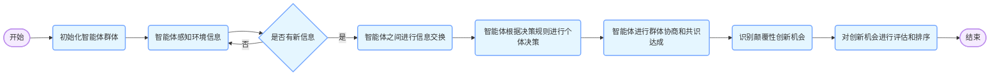

# 智能体群体决策在识别颠覆性创新机会中的应用

> 关键词：智能体群体决策、颠覆性创新机会、多智能体系统、决策算法、创新识别

> 摘要：本文聚焦于智能体群体决策在识别颠覆性创新机会中的应用。首先介绍了研究的背景、目的、预期读者以及文档结构等内容。接着阐述了智能体群体决策和颠覆性创新机会的核心概念及其联系，给出了相应的原理和架构示意图与流程图。详细讲解了核心算法原理，并用 Python 代码进行示例。分析了相关的数学模型和公式，并举例说明。通过项目实战，展示了代码实现和解读。探讨了智能体群体决策在识别颠覆性创新机会中的实际应用场景。推荐了学习资源、开发工具框架和相关论文著作。最后总结了未来发展趋势与挑战，还提供了常见问题解答和扩展阅读参考资料，旨在为该领域的研究和实践提供全面的指导。

## 1. 背景介绍 
### 1.1 目的和范围
在当今快速发展的科技时代，颠覆性创新不断涌现，它能够打破现有的市场格局，创造新的商业机会和价值。然而，识别颠覆性创新机会并非易事，需要综合考虑众多因素和信息。智能体群体决策作为一种新兴的决策方法，通过模拟多个智能体之间的交互和协作，能够充分利用群体的智慧和信息，为识别颠覆性创新机会提供了新的思路和方法。

本文的目的是深入探讨智能体群体决策在识别颠覆性创新机会中的应用，详细介绍相关的理论、算法和实践案例，为研究人员和企业决策者提供全面的参考和指导。研究范围涵盖了智能体群体决策的基本原理、核心算法、数学模型，以及在不同领域中识别颠覆性创新机会的实际应用。

### 1.2 预期读者
本文的预期读者包括计算机科学、管理学、经济学等领域的研究人员，他们可以从本文中获取关于智能体群体决策和颠覆性创新机会识别的最新研究成果和方法，为自己的研究提供参考和启发。同时，企业的管理者和决策者也可以通过本文了解如何利用智能体群体决策来识别潜在的颠覆性创新机会，从而制定更加科学合理的战略规划，提升企业的竞争力。此外，对人工智能和创新管理感兴趣的技术爱好者和学生也可以从本文中获得有益的知识和信息。

### 1.3 文档结构概述
本文将按照以下结构进行组织：
- 核心概念与联系：介绍智能体群体决策和颠覆性创新机会的核心概念，分析它们之间的联系，并给出相应的原理和架构示意图与流程图。
- 核心算法原理 & 具体操作步骤：详细讲解智能体群体决策的核心算法原理，并用 Python 代码进行示例，说明具体的操作步骤。
- 数学模型和公式 & 详细讲解 & 举例说明：分析智能体群体决策的数学模型和公式，对其进行详细讲解，并通过具体的例子说明其应用。
- 项目实战：代码实际案例和详细解释说明：通过一个实际的项目案例，展示如何使用智能体群体决策来识别颠覆性创新机会，包括开发环境搭建、源代码详细实现和代码解读。
- 实际应用场景：探讨智能体群体决策在不同领域中识别颠覆性创新机会的实际应用场景。
- 工具和资源推荐：推荐学习智能体群体决策和颠覆性创新机会识别的相关资源，包括书籍、在线课程、技术博客和网站等，以及开发工具框架和相关论文著作。
- 总结：未来发展趋势与挑战：总结智能体群体决策在识别颠覆性创新机会中的应用现状，分析未来的发展趋势和面临的挑战。
- 附录：常见问题与解答：提供一些常见问题的解答，帮助读者更好地理解本文的内容。
- 扩展阅读 & 参考资料：列出相关的扩展阅读资料和参考文献，方便读者进一步深入研究。

### 1.4 术语表
#### 1.4.1 核心术语定义
- **智能体（Agent）**：是指具有自主决策能力、能够感知环境并与其他智能体进行交互的实体。智能体可以是软件程序、机器人或其他具有一定智能的设备。
- **智能体群体决策（Multi - Agent Group Decision - Making）**：是指多个智能体通过协作和交互，共同完成决策任务的过程。在这个过程中，智能体之间可以交换信息、分享知识，以达到更好的决策效果。
- **颠覆性创新（Disruptive Innovation）**：是指能够打破现有的市场格局，创造新的市场需求和价值的创新。颠覆性创新通常采用新的技术、商业模式或市场策略，对传统产业造成巨大的冲击。
- **创新机会识别（Innovation Opportunity Identification）**：是指通过对市场、技术、社会等因素的分析和研究，发现潜在的创新机会的过程。

#### 1.4.2 相关概念解释
- **多智能体系统（Multi - Agent System，MAS）**：是由多个智能体组成的系统，这些智能体之间可以相互协作、竞争或通信，以实现共同的目标。多智能体系统可以模拟复杂的社会和经济现象，为解决实际问题提供有效的方法。
- **群体智慧（Collective Intelligence）**：是指群体中个体的智慧和知识通过协作和交互，形成的一种超越个体能力的智慧。群体智慧可以用于解决复杂的问题，做出更加明智的决策。

#### 1.4.3 缩略词列表
- **MAS**：Multi - Agent System（多智能体系统）
- **DIDO**：Disruptive Innovation Detection and Opportunity Identification（颠覆性创新检测与机会识别）

## 2. 核心概念与联系 
### 智能体群体决策原理
智能体群体决策基于多智能体系统，每个智能体具有一定的自主决策能力和信息处理能力。智能体之间通过通信机制进行信息交换和共享，根据自身的目标和规则进行决策。在群体决策过程中，智能体可以通过协作、竞争或协商等方式来达成共识，最终做出最优的决策。

智能体群体决策的优势在于能够充分利用群体的智慧和信息，克服个体决策的局限性。多个智能体可以从不同的角度和层面分析问题，提供更多的解决方案和思路，从而提高决策的准确性和可靠性。

### 颠覆性创新机会的特点
颠覆性创新机会通常具有以下特点：
- **突破性**：采用新的技术、商业模式或市场策略，打破现有的市场格局和竞争规则。
- **不确定性**：由于颠覆性创新往往是前所未有的，其发展前景和市场需求具有很大的不确定性。
- **潜在价值高**：一旦成功实施，颠覆性创新能够创造巨大的商业价值和社会价值。

### 智能体群体决策与颠覆性创新机会识别的联系
智能体群体决策可以为颠覆性创新机会识别提供有效的方法和工具。通过多个智能体的协作和交互，可以对大量的市场、技术和社会信息进行分析和处理，发现潜在的颠覆性创新机会。智能体可以根据自身的专业知识和经验，对不同的创新机会进行评估和筛选，提高识别的准确性和效率。

同时，颠覆性创新机会的识别也为智能体群体决策提供了新的应用场景和挑战。在识别颠覆性创新机会的过程中，智能体需要处理大量的不确定性信息，采用灵活的决策策略，以适应不断变化的环境。

### 原理和架构的文本示意图
```plaintext
智能体群体决策系统
|
|-- 智能体集合
|   |-- 智能体 1
|   |-- 智能体 2
|   |--...
|   |-- 智能体 n
|
|-- 通信机制
|   |-- 消息传递
|   |-- 信息共享
|
|-- 决策规则
|   |-- 个体决策规则
|   |-- 群体共识规则
|
|-- 环境感知
|   |-- 市场信息
|   |-- 技术信息
|   |-- 社会信息
|
|-- 颠覆性创新机会识别模块
|   |-- 机会筛选
|   |-- 机会评估
|   |-- 机会排序
```

### Mermaid 流程图


## 3. 核心算法原理 & 具体操作步骤 
### 核心算法原理
智能体群体决策在识别颠覆性创新机会中常用的算法包括蚁群算法、粒子群算法和遗传算法等。这里以蚁群算法为例进行详细讲解。

蚁群算法是一种模拟蚂蚁觅食行为的优化算法。蚂蚁在寻找食物的过程中，会在路径上留下信息素，其他蚂蚁会根据信息素的浓度来选择路径。随着时间的推移，信息素会逐渐挥发，而蚂蚁会不断地更新信息素的浓度。最终，蚂蚁会找到一条从巢穴到食物源的最短路径。

在智能体群体决策中，我们可以将每个智能体看作是一只蚂蚁，将不同的创新机会看作是不同的路径。智能体通过在不同的创新机会上留下“信息素”（表示对该机会的偏好程度），并根据其他智能体留下的信息素来选择创新机会。通过不断地迭代和更新信息素，智能体群体可以逐渐找到最优的创新机会。

### Python 代码示例
```python
import random
import math

# 定义创新机会列表
innovation_opportunities = [
    {"id": 1, "potential": 0.8, "risk": 0.2},
    {"id": 2, "potential": 0.6, "risk": 0.3},
    {"id": 3, "potential": 0.9, "risk": 0.4},
    {"id": 4, "potential": 0.7, "risk": 0.1}
]

# 定义智能体数量
num_agents = 10

# 初始化信息素矩阵
pheromone_matrix = {opp["id"]: 1.0 for opp in innovation_opportunities}

# 定义信息素挥发率
evaporation_rate = 0.1

# 定义迭代次数
num_iterations = 20

# 定义蚂蚁选择创新机会的函数
def ant_choose_opportunity(agent_id):
    total_pheromone = sum(pheromone_matrix.values())
    probabilities = []
    for opp in innovation_opportunities:
        probability = pheromone_matrix[opp["id"]] / total_pheromone
        probabilities.append(probability)
    # 根据概率选择创新机会
    choice = random.choices(innovation_opportunities, weights=probabilities)[0]
    return choice

# 定义更新信息素的函数
def update_pheromones(selected_opportunities):
    for opp in innovation_opportunities:
        pheromone_matrix[opp["id"]] *= (1 - evaporation_rate)
    for opp in selected_opportunities:
        pheromone_matrix[opp["id"]] += opp["potential"]

# 主循环
for iteration in range(num_iterations):
    selected_opportunities = []
    for agent_id in range(num_agents):
        choice = ant_choose_opportunity(agent_id)
        selected_opportunities.append(choice)
    update_pheromones(selected_opportunities)

# 输出最终的信息素矩阵
print("最终信息素矩阵：", pheromone_matrix)

# 找出信息素浓度最高的创新机会
best_opportunity = max(pheromone_matrix, key=pheromone_matrix.get)
print("最佳创新机会 ID：", best_opportunity)
```

### 具体操作步骤
1. **初始化**：定义创新机会列表、智能体数量、信息素矩阵、信息素挥发率和迭代次数等参数。
2. **迭代过程**：
    - 每个智能体根据信息素矩阵的概率分布选择一个创新机会。
    - 所有智能体选择完成后，更新信息素矩阵，增加被选择的创新机会的信息素浓度，并挥发信息素。
3. **结束条件**：达到指定的迭代次数后，结束迭代。
4. **结果输出**：找出信息素浓度最高的创新机会，作为最佳的颠覆性创新机会。

## 4. 数学模型和公式 & 详细讲解 & 举例说明 
### 蚁群算法的数学模型
在蚁群算法中，信息素的更新公式为：
$$\tau_{ij}(t + 1) = (1 - \rho)\tau_{ij}(t) + \Delta\tau_{ij}(t)$$
其中，$\tau_{ij}(t)$ 表示在时间 $t$ 时，从节点 $i$ 到节点 $j$ 的信息素浓度；$\rho$ 表示信息素挥发率，$0 < \rho < 1$；$\Delta\tau_{ij}(t)$ 表示在时间 $t$ 时，从节点 $i$ 到节点 $j$ 的信息素增量。

信息素增量的计算公式为：
$$\Delta\tau_{ij}(t)=\sum_{k = 1}^{m}\Delta\tau_{ij}^k(t)$$
其中，$m$ 表示蚂蚁的数量，$\Delta\tau_{ij}^k(t)$ 表示第 $k$ 只蚂蚁在时间 $t$ 时，从节点 $i$ 到节点 $j$ 留下的信息素增量。

对于第 $k$ 只蚂蚁，其信息素增量的计算公式为：
$$\Delta\tau_{ij}^k(t)=\begin{cases}
\frac{Q}{L_k}, & \text{如果第 } k \text{ 只蚂蚁在时间 } t \text{ 时经过了边 } (i, j) \\
0, & \text{否则}
\end{cases}$$
其中，$Q$ 是一个常数，表示蚂蚁释放的信息素总量，$L_k$ 表示第 $k$ 只蚂蚁在本次迭代中所经过的路径长度。

### 详细讲解
信息素挥发率 $\rho$ 控制了信息素的衰减速度。如果 $\rho$ 过大，信息素会快速挥发，导致蚂蚁难以形成稳定的路径；如果 $\rho$ 过小，信息素会积累过多，使得算法容易陷入局部最优解。

常数 $Q$ 影响了蚂蚁释放的信息素总量。$Q$ 值越大，蚂蚁释放的信息素越多，对其他蚂蚁的吸引力也就越大。

路径长度 $L_k$ 表示了第 $k$ 只蚂蚁所经过的路径的优劣。路径越短，信息素增量越大，说明该路径越优。

### 举例说明
假设我们有三个创新机会 $A$、$B$、$C$，初始信息素浓度分别为 $\tau_A(0) = 1$，$\tau_B(0) = 1$，$\tau_C(0) = 1$，信息素挥发率 $\rho = 0.1$，常数 $Q = 10$。

在第一次迭代中，有三只蚂蚁，它们选择的创新机会分别为 $A$、$B$、$A$。假设选择 $A$ 的蚂蚁所经过的“路径长度”（可以理解为评估该创新机会的成本或风险）为 $L_{A1}= 2$，$L_{A2}= 3$，选择 $B$ 的蚂蚁所经过的“路径长度”为 $L_B = 4$。

首先计算信息素挥发后的浓度：
$$\tau_A(1)=(1 - 0.1)\times1 = 0.9$$
$$\tau_B(1)=(1 - 0.1)\times1 = 0.9$$
$$\tau_C(1)=(1 - 0.1)\times1 = 0.9$$

然后计算信息素增量：
对于创新机会 $A$：
$$\Delta\tau_A^1=\frac{10}{2}=5$$
$$\Delta\tau_A^2=\frac{10}{3}\approx3.33$$
$$\Delta\tau_A=\Delta\tau_A^1+\Delta\tau_A^2 = 5 + 3.33 = 8.33$$
对于创新机会 $B$：
$$\Delta\tau_B=\frac{10}{4}=2.5$$
对于创新机会 $C$：
$$\Delta\tau_C = 0$$

最后更新信息素浓度：
$$\tau_A(1)=0.9 + 8.33 = 9.23$$
$$\tau_B(1)=0.9 + 2.5 = 3.4$$
$$\tau_C(1)=0.9 + 0 = 0.9$$

在第二次迭代中，蚂蚁会根据更新后的信息素浓度来选择创新机会，信息素浓度越高的创新机会被选择的概率越大。

## 5. 项目实战：代码实际案例和详细解释说明 
### 5.1  开发环境搭建
#### 编程语言和版本
本项目使用 Python 3.8 及以上版本进行开发。Python 是一种广泛使用的高级编程语言，具有丰富的库和工具，适合用于实现智能体群体决策算法。

#### 依赖库安装
在项目中，我们需要使用 `random` 库进行随机数生成，该库是 Python 的内置库，无需额外安装。

#### 开发工具
可以使用 Visual Studio Code、PyCharm 等集成开发环境（IDE）进行代码的编写和调试。这些 IDE 提供了丰富的功能，如代码高亮、自动补全、调试等，能够提高开发效率。

### 5.2  源代码详细实现和代码解读
```python
import random
import math

# 定义创新机会列表
innovation_opportunities = [
    {"id": 1, "potential": 0.8, "risk": 0.2},
    {"id": 2, "potential": 0.6, "risk": 0.3},
    {"id": 3, "potential": 0.9, "risk": 0.4},
    {"id": 4, "potential": 0.7, "risk": 0.1}
]

# 代码解读：定义了一个包含四个创新机会的列表，每个创新机会用一个字典表示，包含 ID、潜在价值和风险三个属性。

# 定义智能体数量
num_agents = 10

# 代码解读：设置智能体的数量为 10，即有 10 个智能体参与决策。

# 初始化信息素矩阵
pheromone_matrix = {opp["id"]: 1.0 for opp in innovation_opportunities}

# 代码解读：使用字典推导式初始化信息素矩阵，每个创新机会的初始信息素浓度为 1.0。

# 定义信息素挥发率
evaporation_rate = 0.1

# 代码解读：设置信息素挥发率为 0.1，表示每次迭代后信息素会挥发 10%。

# 定义迭代次数
num_iterations = 20

# 代码解读：设置迭代次数为 20，即算法会进行 20 次迭代。

# 定义蚂蚁选择创新机会的函数
def ant_choose_opportunity(agent_id):
    total_pheromone = sum(pheromone_matrix.values())
    probabilities = []
    for opp in innovation_opportunities:
        probability = pheromone_matrix[opp["id"]] / total_pheromone
        probabilities.append(probability)
    # 根据概率选择创新机会
    choice = random.choices(innovation_opportunities, weights=probabilities)[0]
    return choice

# 代码解读：该函数实现了蚂蚁选择创新机会的逻辑。首先计算所有创新机会的信息素总和，然后计算每个创新机会的选择概率，最后根据概率使用 random.choices 函数选择一个创新机会。

# 定义更新信息素的函数
def update_pheromones(selected_opportunities):
    for opp in innovation_opportunities:
        pheromone_matrix[opp["id"]] *= (1 - evaporation_rate)
    for opp in selected_opportunities:
        pheromone_matrix[opp["id"]] += opp["potential"]

# 代码解读：该函数实现了信息素的更新逻辑。首先对所有创新机会的信息素进行挥发操作，然后增加被选择的创新机会的信息素浓度，增加的量为该创新机会的潜在价值。

# 主循环
for iteration in range(num_iterations):
    selected_opportunities = []
    for agent_id in range(num_agents):
        choice = ant_choose_opportunity(agent_id)
        selected_opportunities.append(choice)
    update_pheromones(selected_opportunities)

# 代码解读：主循环控制算法的迭代过程。在每次迭代中，每个智能体选择一个创新机会，然后更新信息素矩阵。

# 输出最终的信息素矩阵
print("最终信息素矩阵：", pheromone_matrix)

# 找出信息素浓度最高的创新机会
best_opportunity = max(pheromone_matrix, key=pheromone_matrix.get)
print("最佳创新机会 ID：", best_opportunity)

# 代码解读：输出最终的信息素矩阵，并找出信息素浓度最高的创新机会的 ID。
```

### 5.3  代码解读与分析
#### 整体逻辑
代码的整体逻辑是模拟蚁群算法，通过多个智能体（蚂蚁）在不同的创新机会之间进行选择，不断更新信息素矩阵，最终找出信息素浓度最高的创新机会作为最佳的颠覆性创新机会。

#### 关键步骤分析
- **信息素初始化**：将每个创新机会的初始信息素浓度设置为 1.0，确保在开始时每个创新机会被选择的概率相等。
- **智能体选择**：每个智能体根据信息素矩阵的概率分布选择一个创新机会，信息素浓度越高的创新机会被选择的概率越大。
- **信息素更新**：在每次迭代结束后，对信息素矩阵进行更新，挥发信息素并增加被选择的创新机会的信息素浓度。
- **迭代终止**：当达到指定的迭代次数后，算法终止，输出最终的信息素矩阵和最佳创新机会。

#### 复杂度分析
- **时间复杂度**：算法的时间复杂度主要取决于迭代次数和智能体数量。在每次迭代中，每个智能体需要选择一个创新机会，更新信息素矩阵，因此时间复杂度为 $O(num\_iterations\times num\_agents)$。
- **空间复杂度**：算法的空间复杂度主要取决于创新机会的数量，用于存储信息素矩阵，因此空间复杂度为 $O(len(innovation\_opportunities))$。

## 6. 实际应用场景 
### 科技创业领域
在科技创业领域，智能体群体决策可以帮助创业者识别潜在的颠覆性创新机会。通过模拟多个智能体对市场趋势、技术发展、竞争态势等信息的分析和评估，创业者可以发现那些具有高潜力的创新方向。例如，在人工智能、区块链、生物技术等新兴领域，智能体群体决策可以快速筛选出有前景的创业项目，提高创业成功的概率。

### 企业战略规划
企业在制定战略规划时，需要考虑市场的变化和竞争对手的动态。智能体群体决策可以为企业提供更加全面和准确的信息，帮助企业识别潜在的颠覆性创新机会，从而调整战略方向，保持竞争优势。例如，传统制造业企业可以利用智能体群体决策来评估新兴技术（如智能制造、工业互联网等）对自身业务的影响，提前布局，实现转型升级。

### 风险投资领域
风险投资机构需要在众多的创业项目中选择具有高回报潜力的项目进行投资。智能体群体决策可以帮助风险投资机构对项目进行评估和筛选，识别出那些具有颠覆性创新潜力的项目。通过分析项目的技术创新性、市场需求、团队能力等因素，智能体群体决策可以为风险投资机构提供科学的决策依据，降低投资风险。

### 政府政策制定
政府在制定科技政策、产业政策时，需要考虑如何促进颠覆性创新的发展。智能体群体决策可以帮助政府分析不同政策措施对创新的影响，识别出那些能够有效激发创新活力的政策方向。例如，政府可以利用智能体群体决策来评估税收优惠、研发补贴等政策对企业创新的激励作用，制定更加科学合理的政策。

## 7. 工具和资源推荐
### 7.1 学习资源推荐
#### 7.1.1 书籍推荐
- 《多智能体系统：原理、设计与应用》：本书系统地介绍了多智能体系统的基本原理、设计方法和应用案例，是学习多智能体系统的经典教材。
- 《创新的扩散》：该书深入探讨了创新在社会中的传播和扩散机制，对于理解颠覆性创新的发展过程具有重要的参考价值。
- 《人工智能：一种现代的方法》：这是一本全面介绍人工智能领域的经典著作，涵盖了智能体、搜索算法、机器学习等多个方面的内容。

#### 7.1.2 在线课程
- Coursera 上的“Multi - Agent Systems”课程：由知名高校的教授授课，系统地介绍了多智能体系统的理论和实践。
- edX 上的“Innovation Management”课程：该课程聚焦于创新管理的理论和方法，包括创新机会识别、创新战略制定等内容。
- Udemy 上的“Python for Data Science and Machine Learning Bootcamp”课程：学习 Python 编程语言和数据分析、机器学习的基础知识，为实现智能体群体决策算法提供技术支持。

#### 7.1.3 技术博客和网站
- Medium：上面有很多关于人工智能、创新管理等领域的优质博客文章，可以及时了解最新的研究成果和实践经验。
- arXiv：一个预印本数据库，提供了大量关于人工智能、机器学习等领域的学术论文，是获取前沿研究信息的重要渠道。
- IEEE Xplore：电气和电子工程师协会（IEEE）的数字图书馆，包含了众多关于智能体系统、创新技术等方面的学术论文和会议记录。

### 7.2 开发工具框架推荐
#### 7.2.1 IDE和编辑器
- Visual Studio Code：一款轻量级的代码编辑器，支持多种编程语言和丰富的插件扩展，适合用于 Python 代码的开发。
- PyCharm：专门为 Python 开发设计的集成开发环境，提供了强大的代码调试、代码分析等功能，提高开发效率。

#### 7.2.2 调试和性能分析工具
- pdb：Python 的内置调试器，可以帮助开发者逐行调试代码，找出代码中的错误。
- cProfile：Python 的性能分析工具，可以分析代码的运行时间和函数调用次数，帮助开发者优化代码性能。

#### 7.2.3 相关框架和库
- Mesa：一个用于构建基于智能体的模型的 Python 框架，提供了丰富的智能体建模和模拟工具。
- NetworkX：一个用于创建、操作和研究复杂网络的 Python 库，可以用于模拟智能体之间的交互和通信。

### 7.3 相关论文著作推荐
#### 7.3.1 经典论文
- “Ant System: Optimization by a Colony of Cooperating Agents”：蚁群算法的经典论文，详细介绍了蚁群算法的原理和应用。
- “The Innovator's Dilemma: When New Technologies Cause Great Firms to Fail”：该论文提出了颠覆性创新的概念，分析了大企业在面对颠覆性创新时的困境。

#### 7.3.2 最新研究成果
- 在 IEEE Transactions on Systems, Man, and Cybernetics 等期刊上搜索关于智能体群体决策和颠覆性创新机会识别的最新研究论文，了解该领域的前沿动态。

#### 7.3.3 应用案例分析
- 一些知名企业（如谷歌、苹果等）的创新案例分析报告，可以学习它们在识别和利用颠覆性创新机会方面的经验和做法。

## 8. 总结：未来发展趋势与挑战
### 未来发展趋势
- **与大数据和人工智能技术的深度融合**：随着大数据和人工智能技术的不断发展，智能体群体决策可以利用更多的数据和更强大的算法来提高决策的准确性和效率。例如，结合深度学习算法，智能体可以更好地理解和分析复杂的市场和技术信息，发现更多潜在的颠覆性创新机会。
- **跨领域应用的拓展**：智能体群体决策将不仅仅局限于科技创业、企业战略规划等领域，还将拓展到医疗、教育、交通等更多领域。在这些领域中，智能体群体决策可以帮助解决复杂的问题，推动行业的创新和发展。
- **多智能体系统的协同进化**：未来的多智能体系统将更加注重智能体之间的协同进化，智能体可以通过不断学习和适应环境，提高自身的决策能力和协作能力。同时，多智能体系统可以与人类决策者进行更加有效的交互，实现人机协同决策。

### 挑战
- **信息不确定性和复杂性**：在识别颠覆性创新机会的过程中，智能体需要处理大量的不确定性信息，如市场需求的变化、技术发展的趋势等。如何有效地处理这些不确定性信息，提高决策的可靠性，是一个亟待解决的问题。
- **智能体的自主性和协作性平衡**：智能体需要具有一定的自主性，能够根据自身的目标和规则进行决策。同时，智能体之间需要进行有效的协作和沟通，以达成群体共识。如何平衡智能体的自主性和协作性，是智能体群体决策面临的一个挑战。
- **伦理和法律问题**：随着智能体群体决策在各个领域的广泛应用，伦理和法律问题也日益凸显。例如，智能体的决策结果可能会对人类社会产生重大影响，如何确保智能体的决策符合伦理和法律要求，是一个需要深入研究的问题。

## 9. 附录：常见问题与解答
### 问题 1：智能体群体决策与传统决策方法有什么区别？
智能体群体决策通过多个智能体的协作和交互，充分利用群体的智慧和信息，能够处理更加复杂和不确定的问题。而传统决策方法通常基于个体的经验和判断，容易受到个体认知能力和信息获取的限制。智能体群体决策可以从多个角度和层面分析问题，提供更多的解决方案和思路，提高决策的准确性和可靠性。

### 问题 2：如何确定智能体的数量和类型？
智能体的数量和类型需要根据具体的应用场景和问题来确定。一般来说，智能体的数量越多，群体的智慧和信息越丰富，但同时也会增加决策的复杂度和计算成本。智能体的类型可以根据其功能和专业知识进行划分，例如市场分析智能体、技术评估智能体等。在确定智能体的数量和类型时，需要综合考虑问题的复杂度、数据的可用性和计算资源等因素。

### 问题 3：蚁群算法在实际应用中可能会遇到哪些问题？
蚁群算法在实际应用中可能会遇到以下问题：
- **收敛速度慢**：蚁群算法的收敛速度相对较慢，尤其是在问题规模较大时，需要进行大量的迭代才能找到最优解。
- **容易陷入局部最优解**：由于蚁群算法是基于信息素的更新来寻找最优解，容易陷入局部最优解，无法找到全局最优解。
- **参数调整困难**：蚁群算法的性能受到多个参数的影响，如信息素挥发率、常数 $Q$ 等，参数的调整需要一定的经验和技巧。

### 问题 4：如何评估智能体群体决策的效果？
可以从以下几个方面评估智能体群体决策的效果：
- **决策的准确性**：评估决策结果与实际最优解的接近程度，可以通过比较决策结果与已知的最优解或实际的市场表现来进行评估。
- **决策的效率**：评估决策过程所花费的时间和计算资源，可以通过记录决策的迭代次数、运行时间等指标来进行评估。
- **群体的一致性**：评估智能体之间的意见一致性，可以通过计算智能体选择的一致性比例等指标来进行评估。

## 10. 扩展阅读 & 参考资料
### 扩展阅读
- 《群体的智慧》：深入探讨了群体智慧的原理和应用，为理解智能体群体决策提供了理论基础。
- 《未来简史：从智人到神人》：从宏观的角度探讨了科技发展对人类社会的影响，对于思考颠覆性创新的未来发展具有启发意义。

### 参考资料
- Bonabeau, E., Dorigo, M., & Theraulaz, G. (1999). Swarm Intelligence: From Natural to Artificial Systems. Oxford University Press.
- Christensen, C. M. (1997). The Innovator's Dilemma: When New Technologies Cause Great Firms to Fail. Harvard Business School Press.

作者：AI天才研究院/AI Genius Institute & 禅与计算机程序设计艺术 /Zen And The Art of Computer Programming