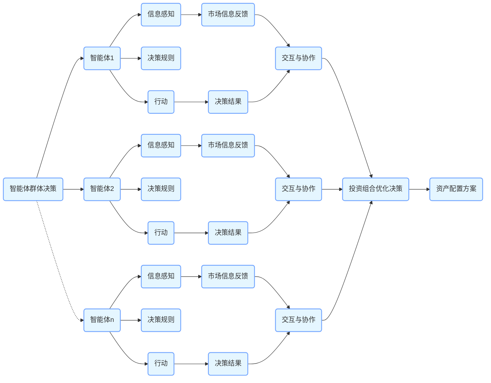

# 智能体群体决策在资产配置中的应用：优化投资组合

> 关键词：智能体群体决策、资产配置、投资组合优化、人工智能、金融科技

> 摘要：本文聚焦于智能体群体决策在资产配置领域的应用，旨在探讨如何利用智能体群体的协同决策能力来优化投资组合。首先介绍了相关背景知识，包括目的范围、预期读者等。接着阐述了核心概念及联系，给出了原理和架构的示意图与流程图。详细讲解了核心算法原理和具体操作步骤，结合 Python 代码进行说明。同时给出了相关数学模型和公式，并举例阐释。通过项目实战展示了代码的实际应用和解读。分析了该技术在实际中的应用场景，推荐了学习、开发相关的工具和资源，涵盖书籍、在线课程、开发框架等。最后总结了未来发展趋势与挑战，还提供了常见问题解答和扩展阅读参考资料，为智能体群体决策在资产配置中的应用提供了全面且深入的技术指导。

## 1. 背景介绍 
### 1.1 目的和范围
在金融市场中，资产配置是投资决策的核心环节，合理的资产配置能够有效降低风险、提高收益。传统的资产配置方法往往依赖于经验和简单的数学模型，难以应对复杂多变的市场环境。智能体群体决策作为一种新兴的人工智能技术，具有分布式、自适应和协同性等特点，能够模拟多个智能体在复杂环境下的决策过程。本文章的目的在于研究如何将智能体群体决策应用于资产配置，以优化投资组合。范围涵盖了从理论概念的介绍到实际项目的应用，包括核心算法原理、数学模型、代码实现以及实际应用场景等方面。

### 1.2 预期读者
本文预期读者主要包括金融领域的从业者，如投资经理、分析师等，他们希望借助新技术来改进资产配置策略；计算机科学领域的研究人员和开发者，对人工智能在金融领域的应用感兴趣；以及金融和计算机相关专业的学生，希望通过本文了解跨学科的知识和应用。

### 1.3 文档结构概述
本文将按照以下结构展开：首先介绍背景知识，为后续内容奠定基础；接着阐述核心概念及联系，包括智能体群体决策和资产配置的相关概念以及它们之间的关系；然后详细讲解核心算法原理和具体操作步骤，并使用 Python 代码进行实现；给出相关数学模型和公式，并举例说明；通过项目实战展示代码的实际应用和解读；分析该技术在实际中的应用场景；推荐学习和开发相关的工具和资源；最后总结未来发展趋势与挑战，提供常见问题解答和扩展阅读参考资料。

### 1.4 术语表
#### 1.4.1 核心术语定义
- **智能体（Agent）**：具有自主性、反应性、社会性和主动性的实体，能够在一定环境中感知信息，并根据自身的目标和知识进行决策和行动。
- **智能体群体决策（Multi - Agent Group Decision - Making）**：多个智能体通过交互和协作，共同做出决策的过程。
- **资产配置（Asset Allocation）**：根据投资目标、风险承受能力等因素，将资金分配到不同类型的资产上，如股票、债券、基金等。
- **投资组合（Investment Portfolio）**：由多种资产组成的集合，投资者通过合理配置不同资产的比例来实现特定的投资目标。

#### 1.4.2 相关概念解释
- **分布式决策**：决策过程分散在多个智能体中进行，每个智能体根据自己的局部信息做出决策，然后通过交互和协作达成全局最优决策。
- **自适应决策**：智能体能够根据环境的变化和自身的经验，动态调整自己的决策策略。
- **协同性**：多个智能体之间通过信息共享和合作，共同完成决策任务，提高决策的效率和质量。

#### 1.4.3 缩略词列表
- **AI**：Artificial Intelligence，人工智能
- **MPT**：Modern Portfolio Theory，现代投资组合理论
- **RL**：Reinforcement Learning，强化学习

## 2. 核心概念与联系 

### 智能体群体决策原理
智能体群体决策基于多个智能体的交互和协作。每个智能体具有自己的目标、知识和决策规则。在资产配置的场景中，智能体可以代表不同的投资策略、市场参与者或资产类别。智能体通过感知市场信息，如资产价格、收益率、风险等，根据自身的决策规则进行决策，然后与其他智能体进行交互，共享信息和调整决策。

### 资产配置与投资组合优化
资产配置的目标是通过合理分配资金到不同资产上，实现投资组合的风险和收益的平衡。投资组合优化则是在给定的约束条件下，寻找最优的资产配置方案，使得投资组合的预期收益最大化或风险最小化。

### 智能体群体决策与资产配置的联系
智能体群体决策可以应用于资产配置的各个环节。例如，智能体可以模拟不同投资者的决策行为，通过群体决策找到更优的资产配置方案；智能体可以实时监测市场变化，根据市场情况动态调整投资组合；智能体之间的协作可以提高决策的准确性和效率，避免单一决策的局限性。

### 核心概念原理和架构的文本示意图
```plaintext
                          智能体群体决策
                            /           \
                      智能体1           智能体2 ...  智能体n
                     /    |    \       /    |    \
             信息感知  决策规则  行动  信息感知  决策规则  行动
                     |         |       |         |
               市场信息反馈  决策结果  市场信息反馈  决策结果
                     |         |       |         |
                    \ /       \ /     \ /       \ /
                   交互与协作  交互与协作 ...  交互与协作
                    |         |       |         |
                    \         |         /
                     投资组合优化决策
                          |
                          V
                      资产配置方案
```

### Mermaid 流程图


## 3. 核心算法原理 & 具体操作步骤 

### 核心算法原理
在智能体群体决策应用于资产配置中，我们可以采用强化学习算法作为核心算法。强化学习是一种通过智能体与环境进行交互，不断尝试不同的行动，并根据环境反馈的奖励信号来学习最优策略的方法。

在资产配置场景中，智能体的行动是调整投资组合中不同资产的比例，环境是金融市场，奖励信号可以是投资组合的收益率或风险调整后的收益率。智能体的目标是通过不断学习，找到一种资产配置策略，使得长期的奖励最大化。

### 具体操作步骤
1. **定义状态空间**：状态空间包括市场信息和投资组合的当前状态。市场信息可以包括资产的价格、收益率、波动率等，投资组合的当前状态可以包括各资产的持有比例。
2. **定义行动空间**：行动空间是智能体可以采取的行动集合，即调整投资组合中各资产的比例。例如，可以定义每个资产的比例调整范围为 $[-0.1, 0.1]$。
3. **定义奖励函数**：奖励函数用于衡量智能体采取某个行动后的效果。常见的奖励函数可以是投资组合的收益率或夏普比率。
4. **选择强化学习算法**：可以选择深度 Q 网络（Deep Q - Network，DQN）、策略梯度算法（Policy Gradient）等。
5. **训练智能体**：智能体在环境中不断尝试不同的行动，根据奖励信号更新自己的策略。
6. **应用策略**：训练完成后，智能体可以根据学习到的策略进行资产配置决策。

### Python 代码实现
```python
import numpy as np
import torch
import torch.nn as nn
import torch.optim as optim

# 定义状态空间维度、行动空间维度和隐藏层维度
state_dim = 10
action_dim = 5
hidden_dim = 64

# 定义深度 Q 网络
class DQN(nn.Module):
    def __init__(self):
        super(DQN, self).__init__()
        self.fc1 = nn.Linear(state_dim, hidden_dim)
        self.fc2 = nn.Linear(hidden_dim, hidden_dim)
        self.fc3 = nn.Linear(hidden_dim, action_dim)

    def forward(self, x):
        x = torch.relu(self.fc1(x))
        x = torch.relu(self.fc2(x))
        return self.fc3(x)

# 初始化 DQN 网络和目标网络
dqn = DQN()
target_dqn = DQN()
target_dqn.load_state_dict(dqn.state_dict())

# 定义优化器和损失函数
optimizer = optim.Adam(dqn.parameters(), lr=0.001)
criterion = nn.MSELoss()

# 定义经验回放缓冲区
class ReplayBuffer:
    def __init__(self, capacity):
        self.capacity = capacity
        self.buffer = []
        self.position = 0

    def push(self, state, action, reward, next_state, done):
        if len(self.buffer) < self.capacity:
            self.buffer.append(None)
        self.buffer[self.position] = (state, action, reward, next_state, done)
        self.position = (self.position + 1) % self.capacity

    def sample(self, batch_size):
        batch = np.random.choice(len(self.buffer), batch_size)
        states, actions, rewards, next_states, dones = zip(*[self.buffer[i] for i in batch])
        return np.array(states), np.array(actions), np.array(rewards), np.array(next_states), np.array(dones)

    def __len__(self):
        return len(self.buffer)

# 初始化经验回放缓冲区
replay_buffer = ReplayBuffer(capacity=10000)

# 定义超参数
gamma = 0.99
epsilon = 0.1
batch_size = 32
target_update_freq = 100

# 训练智能体
for episode in range(1000):
    # 初始化状态
    state = np.random.rand(state_dim)
    done = False
    while not done:
        # 根据 epsilon - greedy 策略选择行动
        if np.random.rand() < epsilon:
            action = np.random.randint(action_dim)
        else:
            state_tensor = torch.FloatTensor(state).unsqueeze(0)
            q_values = dqn(state_tensor)
            action = torch.argmax(q_values, dim=1).item()

        # 执行行动，获取奖励和下一个状态
        next_state = np.random.rand(state_dim)
        reward = np.random.rand()
        done = np.random.rand() < 0.1

        # 将经验存入回放缓冲区
        replay_buffer.push(state, action, reward, next_state, done)

        # 从回放缓冲区中采样一批经验
        if len(replay_buffer) >= batch_size:
            states, actions, rewards, next_states, dones = replay_buffer.sample(batch_size)
            states_tensor = torch.FloatTensor(states)
            actions_tensor = torch.LongTensor(actions)
            rewards_tensor = torch.FloatTensor(rewards)
            next_states_tensor = torch.FloatTensor(next_states)
            dones_tensor = torch.FloatTensor(dones)

            # 计算 Q 值
            q_values = dqn(states_tensor).gather(1, actions_tensor.unsqueeze(1)).squeeze(1)
            next_q_values = target_dqn(next_states_tensor).max(1)[0].detach()
            target_q_values = rewards_tensor + gamma * next_q_values * (1 - dones_tensor)

            # 计算损失
            loss = criterion(q_values, target_q_values)

            # 更新网络参数
            optimizer.zero_grad()
            loss.backward()
            optimizer.step()

        # 更新状态
        state = next_state

    # 更新目标网络
    if episode % target_update_freq == 0:
        target_dqn.load_state_dict(dqn.state_dict())
```

## 4. 数学模型和公式 & 详细讲解 & 举例说明 

### 现代投资组合理论（MPT）基础
现代投资组合理论由哈里·马科维茨（Harry Markowitz）提出，其核心思想是通过资产的多元化配置来降低风险。该理论基于以下几个关键概念：

#### 预期收益率
设投资组合中有 $n$ 种资产，第 $i$ 种资产的预期收益率为 $E(R_i)$，投资组合中第 $i$ 种资产的权重为 $w_i$，且 $\sum_{i = 1}^{n}w_i=1$。则投资组合的预期收益率 $E(R_p)$ 为：
$$E(R_p)=\sum_{i = 1}^{n}w_iE(R_i)$$

#### 收益率的方差（风险）
投资组合收益率的方差 $\sigma_p^2$ 为：
$$\sigma_p^2=\sum_{i = 1}^{n}\sum_{j = 1}^{n}w_iw_j\sigma_{ij}$$
其中，$\sigma_{ij}$ 是资产 $i$ 和资产 $j$ 的收益率的协方差。当 $i = j$ 时，$\sigma_{ii}=\sigma_i^2$ 是资产 $i$ 的收益率的方差。

#### 夏普比率
夏普比率（Sharpe Ratio）用于衡量投资组合的风险调整后收益，定义为：
$$S_p=\frac{E(R_p)-R_f}{\sigma_p}$$
其中，$R_f$ 是无风险利率。夏普比率越高，说明投资组合在承担单位风险时获得的超额收益越高。

### 智能体群体决策中的数学模型
在智能体群体决策应用于资产配置中，我们可以将每个智能体的决策看作是对投资组合权重的调整。设智能体 $k$ 在第 $t$ 时刻的决策为 $\Delta w_{k,t}^i$，表示智能体 $k$ 对第 $i$ 种资产权重的调整量。则投资组合在第 $t + 1$ 时刻的权重为：
$$w_{t + 1}^i=w_t^i+\sum_{k = 1}^{m}\Delta w_{k,t}^i$$
其中，$m$ 是智能体的数量。

### 举例说明
假设有三种资产 $A$、$B$、$C$，它们的预期收益率分别为 $E(R_A)=0.1$，$E(R_B)=0.15$，$E(R_C)=0.2$，收益率的方差分别为 $\sigma_A^2 = 0.04$，$\sigma_B^2 = 0.09$，$\sigma_C^2 = 0.16$，协方差 $\sigma_{AB}=0.02$，$\sigma_{AC}=0.03$，$\sigma_{BC}=0.04$。投资组合的初始权重为 $w_A = 0.3$，$w_B = 0.3$，$w_C = 0.4$。无风险利率 $R_f = 0.05$。

#### 计算投资组合的预期收益率
$$E(R_p)=w_AE(R_A)+w_BE(R_B)+w_CE(R_C)=0.3\times0.1 + 0.3\times0.15+0.4\times0.2 = 0.155$$

#### 计算投资组合的方差
$$
\begin{align*}
\sigma_p^2&=w_A^2\sigma_A^2+w_B^2\sigma_B^2+w_C^2\sigma_C^2 + 2w_Aw_B\sigma_{AB}+2w_Aw_C\sigma_{AC}+2w_Bw_C\sigma_{BC}\\
&=0.3^2\times0.04 + 0.3^2\times0.09+0.4^2\times0.16+2\times0.3\times0.3\times0.02+2\times0.3\times0.4\times0.03+2\times0.3\times0.4\times0.04\\
&=0.0036+0.0081 + 0.0256+0.0036+0.0072+0.0096\\
&=0.0577
\end{align*}
$$

#### 计算夏普比率
$$S_p=\frac{E(R_p)-R_f}{\sigma_p}=\frac{0.155 - 0.05}{\sqrt{0.0577}}\approx0.43$$

## 5. 项目实战：代码实际案例和详细解释说明 

### 5.1  开发环境搭建
#### 安装 Python
首先需要安装 Python 环境，建议使用 Python 3.7 及以上版本。可以从 Python 官方网站（https://www.python.org/downloads/）下载并安装。

#### 安装必要的库
使用以下命令安装必要的 Python 库：
```sh
pip install numpy torch pandas matplotlib
```
- `numpy`：用于数值计算。
- `torch`：用于深度学习模型的构建和训练。
- `pandas`：用于数据处理和分析。
- `matplotlib`：用于数据可视化。

### 5.2  源代码详细实现和代码解读
```python
import numpy as np
import pandas as pd
import torch
import torch.nn as nn
import torch.optim as optim
import matplotlib.pyplot as plt

# 定义状态空间维度、行动空间维度和隐藏层维度
state_dim = 5
action_dim = 3
hidden_dim = 64

# 定义深度 Q 网络
class DQN(nn.Module):
    def __init__(self):
        super(DQN, self).__init__()
        self.fc1 = nn.Linear(state_dim, hidden_dim)
        self.fc2 = nn.Linear(hidden_dim, hidden_dim)
        self.fc3 = nn.Linear(hidden_dim, action_dim)

    def forward(self, x):
        x = torch.relu(self.fc1(x))
        x = torch.relu(self.fc2(x))
        return self.fc3(x)

# 初始化 DQN 网络和目标网络
dqn = DQN()
target_dqn = DQN()
target_dqn.load_state_dict(dqn.state_dict())

# 定义优化器和损失函数
optimizer = optim.Adam(dqn.parameters(), lr=0.001)
criterion = nn.MSELoss()

# 定义经验回放缓冲区
class ReplayBuffer:
    def __init__(self, capacity):
        self.capacity = capacity
        self.buffer = []
        self.position = 0

    def push(self, state, action, reward, next_state, done):
        if len(self.buffer) < self.capacity:
            self.buffer.append(None)
        self.buffer[self.position] = (state, action, reward, next_state, done)
        self.position = (self.position + 1) % self.capacity

    def sample(self, batch_size):
        batch = np.random.choice(len(self.buffer), batch_size)
        states, actions, rewards, next_states, dones = zip(*[self.buffer[i] for i in batch])
        return np.array(states), np.array(actions), np.array(rewards), np.array(next_states), np.array(dones)

    def __len__(self):
        return len(self.buffer)

# 初始化经验回放缓冲区
replay_buffer = ReplayBuffer(capacity=10000)

# 定义超参数
gamma = 0.99
epsilon = 0.1
batch_size = 32
target_update_freq = 100

# 模拟市场数据
def generate_market_data(num_steps):
    prices = np.random.randn(num_steps, state_dim).cumsum(axis=0)
    returns = np.diff(prices, axis=0) / prices[:-1]
    return returns

# 训练智能体
num_steps = 1000
market_data = generate_market_data(num_steps)
portfolio_weights = np.array([1/action_dim] * action_dim)
total_rewards = []

for episode in range(100):
    episode_reward = 0
    state = market_data[0]
    for t in range(num_steps - 1):
        # 根据 epsilon - greedy 策略选择行动
        if np.random.rand() < epsilon:
            action = np.random.randint(action_dim)
        else:
            state_tensor = torch.FloatTensor(state).unsqueeze(0)
            q_values = dqn(state_tensor)
            action = torch.argmax(q_values, dim=1).item()

        # 调整投资组合权重
        new_weights = portfolio_weights.copy()
        new_weights[action] += 0.1
        new_weights = new_weights / new_weights.sum()

        # 计算奖励
        next_state = market_data[t + 1]
        portfolio_return = np.dot(new_weights, next_state)
        reward = portfolio_return

        # 更新投资组合权重
        portfolio_weights = new_weights

        # 将经验存入回放缓冲区
        replay_buffer.push(state, action, reward, next_state, False)

        # 从回放缓冲区中采样一批经验
        if len(replay_buffer) >= batch_size:
            states, actions, rewards, next_states, dones = replay_buffer.sample(batch_size)
            states_tensor = torch.FloatTensor(states)
            actions_tensor = torch.LongTensor(actions)
            rewards_tensor = torch.FloatTensor(rewards)
            next_states_tensor = torch.FloatTensor(next_states)
            dones_tensor = torch.FloatTensor(dones)

            # 计算 Q 值
            q_values = dqn(states_tensor).gather(1, actions_tensor.unsqueeze(1)).squeeze(1)
            next_q_values = target_dqn(next_states_tensor).max(1)[0].detach()
            target_q_values = rewards_tensor + gamma * next_q_values * (1 - dones_tensor)

            # 计算损失
            loss = criterion(q_values, target_q_values)

            # 更新网络参数
            optimizer.zero_grad()
            loss.backward()
            optimizer.step()

        # 更新状态和奖励
        state = next_state
        episode_reward += reward

    # 更新目标网络
    if episode % target_update_freq == 0:
        target_dqn.load_state_dict(dqn.state_dict())

    total_rewards.append(episode_reward)
    print(f'Episode {episode}: Reward = {episode_reward}')

# 绘制奖励曲线
plt.plot(total_rewards)
plt.xlabel('Episode')
plt.ylabel('Total Reward')
plt.title('Training Rewards')
plt.show()
```

### 5.3  代码解读与分析
1. **网络定义**：定义了一个三层的全连接神经网络 `DQN`，用于估计 Q 值。
2. **经验回放缓冲区**：`ReplayBuffer` 类用于存储智能体的经验，包括状态、行动、奖励、下一个状态和终止标志。
3. **市场数据生成**：`generate_market_data` 函数用于模拟市场数据，生成资产的收益率序列。
4. **训练过程**：
    - 每个回合中，智能体根据 epsilon - greedy 策略选择行动，调整投资组合权重。
    - 计算投资组合的收益率作为奖励。
    - 将经验存入回放缓冲区，并从缓冲区中采样一批经验进行训练。
    - 使用 DQN 网络计算 Q 值，使用目标网络计算目标 Q 值，然后计算损失并更新网络参数。
    - 每隔一定回合更新目标网络的参数。
5. **结果可视化**：绘制训练过程中的总奖励曲线，观察智能体的学习效果。

## 6. 实际应用场景 
### 机构投资者的资产配置
机构投资者，如养老基金、保险公司等，管理着大量的资金，需要进行长期的资产配置。智能体群体决策可以帮助机构投资者模拟不同的市场情景和投资策略，通过群体的协同决策找到最优的资产配置方案，降低风险并提高收益。

### 个人投资者的投资组合优化
个人投资者通常缺乏专业的投资知识和经验，智能体群体决策可以为个人投资者提供个性化的投资建议。根据个人的投资目标、风险承受能力和财务状况，智能体可以推荐合适的资产配置方案，并实时调整投资组合。

### 量化投资策略的开发
量化投资通过数学模型和算法来进行投资决策。智能体群体决策可以作为量化投资策略的一部分，与其他技术相结合，如机器学习、深度学习等，开发出更加复杂和有效的投资策略。

### 风险管理
在金融市场中，风险管理至关重要。智能体群体决策可以实时监测市场风险，通过群体的交互和协作，及时调整投资组合，降低风险暴露。例如，当市场出现异常波动时，智能体可以迅速做出反应，减少高风险资产的持仓。

## 7. 工具和资源推荐
### 7.1 学习资源推荐
#### 7.1.1 书籍推荐
- 《人工智能：一种现代的方法》（Artificial Intelligence: A Modern Approach）：全面介绍了人工智能的基本概念、算法和应用，是人工智能领域的经典教材。
- 《Python 深度学习》（Deep Learning with Python）：详细介绍了使用 Python 和 Keras 进行深度学习的方法和技巧，适合初学者入门。
- 《智能投资：用人工智能方法实现量化投资策略》：结合人工智能和金融投资，介绍了如何使用人工智能技术进行量化投资策略的开发。

#### 7.1.2 在线课程
- Coursera 上的“人工智能基础”（Foundations of Artificial Intelligence）课程：由知名教授授课，系统讲解人工智能的基础知识和算法。
- edX 上的“深度学习”（Deep Learning）课程：深入介绍深度学习的原理和应用，包括神经网络、卷积神经网络、循环神经网络等。
- Udemy 上的“量化投资与 Python 实战”课程：结合 Python 编程和金融投资知识，介绍量化投资策略的开发和实现。

#### 7.1.3 技术博客和网站
- Medium：有很多关于人工智能和金融科技的技术博客，作者分享了最新的研究成果和实践经验。
- Towards Data Science：专注于数据科学和人工智能领域，提供了丰富的教程和案例分析。
- arXiv：一个预印本平台，包含了大量的学术论文，涉及人工智能、金融等多个领域。

### 7.2 开发工具框架推荐
#### 7.2.1 IDE和编辑器
- PyCharm：一款功能强大的 Python 集成开发环境，提供了代码编辑、调试、版本控制等功能。
- Jupyter Notebook：一个交互式的开发环境，适合进行数据分析和模型开发，支持 Python、R 等多种编程语言。
- Visual Studio Code：一款轻量级的代码编辑器，支持多种编程语言和插件扩展，具有丰富的开发工具和调试功能。

#### 7.2.2 调试和性能分析工具
- PyTorch Profiler：用于分析 PyTorch 模型的性能，包括计算时间、内存使用等方面的分析。
- TensorBoard：用于可视化深度学习模型的训练过程和性能指标，帮助开发者监控模型的训练情况。
- cProfile：Python 内置的性能分析工具，用于分析 Python 代码的运行时间和函数调用情况。

#### 7.2.3 相关框架和库
- PyTorch：一个开源的深度学习框架，提供了丰富的神经网络层和优化算法，易于使用和扩展。
- TensorFlow：另一个流行的深度学习框架，具有强大的分布式计算能力和广泛的应用场景。
- scikit - learn：一个用于机器学习的 Python 库，提供了各种机器学习算法和工具，如分类、回归、聚类等。

### 7.3 相关论文著作推荐
#### 7.3.1 经典论文
- Markowitz, H. M. (1952). Portfolio selection. The journal of finance, 7(1), 77 - 91.：现代投资组合理论的奠基之作，提出了投资组合的预期收益率和风险的计算方法。
- Watkins, C. J., & Dayan, P. (1992). Q - learning. Machine learning, 8(3 - 4), 279 - 292.：介绍了 Q - learning 算法，是强化学习领域的经典论文。
- Mnih, V., et al. (2015). Human - level control through deep reinforcement learning. Nature, 518(7540), 529 - 533.：提出了深度 Q 网络（DQN）算法，将深度学习和强化学习相结合，取得了很好的效果。

#### 7.3.2 最新研究成果
- 在 arXiv 上搜索“Multi - Agent Reinforcement Learning in Asset Allocation”等关键词，可以找到最新的关于智能体群体决策在资产配置中的研究成果。

#### 7.3.3 应用案例分析
- 一些金融科技公司会在其官方网站或博客上分享智能体群体决策在资产配置中的应用案例，如蚂蚁金服、腾讯金融科技等。

## 8. 总结：未来发展趋势与挑战
### 未来发展趋势
- **多学科融合**：智能体群体决策在资产配置中的应用将与其他学科，如经济学、统计学、心理学等深度融合，形成更加完善的理论和方法体系。
- **与区块链技术结合**：区块链技术具有去中心化、不可篡改等特点，可以与智能体群体决策相结合，提高资产配置的透明度和安全性。
- **实时决策和自适应调整**：随着技术的发展，智能体将能够实时监测市场变化，并根据市场情况进行自适应调整，实现更加灵活和高效的资产配置。
- **个性化服务**：为不同的投资者提供个性化的资产配置方案，根据投资者的风险偏好、投资目标和财务状况进行定制化服务。

### 挑战
- **数据质量和隐私问题**：资产配置需要大量的市场数据和投资者信息，数据的质量和隐私保护是一个重要的挑战。
- **模型的可解释性**：深度学习等模型通常是黑盒模型，难以解释其决策过程和结果，这在金融领域可能会带来信任问题。
- **市场的不确定性**：金融市场具有高度的不确定性，智能体群体决策需要能够应对各种复杂的市场情况，提高决策的稳定性和可靠性。
- **计算资源的需求**：智能体群体决策和深度学习模型通常需要大量的计算资源，如何在有限的资源下实现高效的计算是一个挑战。

## 9. 附录：常见问题与解答
### 1. 智能体群体决策与传统资产配置方法有什么区别？
传统资产配置方法往往依赖于经验和简单的数学模型，难以应对复杂多变的市场环境。智能体群体决策具有分布式、自适应和协同性等特点，能够模拟多个智能体在复杂环境下的决策过程，通过群体的交互和协作找到更优的资产配置方案。

### 2. 如何评估智能体群体决策在资产配置中的效果？
可以使用多种指标来评估，如投资组合的预期收益率、收益率的方差（风险）、夏普比率等。同时，可以进行回测，比较智能体群体决策生成的投资组合与传统方法生成的投资组合在历史数据上的表现。

### 3. 智能体群体决策需要哪些数据？
需要市场数据，如资产的价格、收益率、波动率等，以及投资者的信息，如投资目标、风险承受能力等。

### 4. 智能体群体决策在实际应用中会遇到哪些问题？
可能会遇到数据质量和隐私问题、模型的可解释性问题、市场的不确定性问题以及计算资源的需求问题等。

## 10. 扩展阅读 & 参考资料
- 李航. 《统计学习方法（第 2 版）》. 清华大学出版社.
- Goodfellow, I. J., Bengio, Y., & Courville, A. (2016). Deep learning. MIT press.
- 金融科技相关研究报告，如毕马威、德勤等机构发布的报告。
- 相关学术期刊，如《Journal of Financial Economics》、《Journal of Financial and Quantitative Analysis》等。

作者：AI天才研究院/AI Genius Institute & 禅与计算机程序设计艺术 /Zen And The Art of Computer Programming