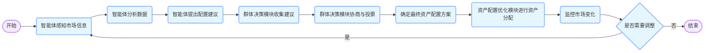

# 智能体群体决策在资产配置优化中的应用：提高组合效率

> 关键词：智能体群体决策、资产配置优化、组合效率、多智能体系统、金融投资

> 摘要：本文深入探讨了智能体群体决策在资产配置优化中的应用，旨在提高资产组合的效率。首先介绍了相关背景知识，包括目的范围、预期读者、文档结构和术语表。接着阐述了核心概念及其联系，通过文本示意图和Mermaid流程图进行直观展示。详细讲解了核心算法原理，并给出Python源代码示例。同时，给出了相关数学模型和公式，并举例说明。通过项目实战，展示了开发环境搭建、源代码实现与解读。分析了实际应用场景，推荐了学习资源、开发工具框架和相关论文著作。最后总结了未来发展趋势与挑战，并提供了常见问题解答和扩展阅读参考资料，为金融领域的资产配置优化提供了全面且深入的技术指导。

## 1. 背景介绍 
### 1.1 目的和范围
在金融投资领域，资产配置是实现投资目标、降低风险的关键环节。合理的资产配置能够平衡收益与风险，提高投资组合的效率。智能体群体决策作为一种新兴的技术手段，为资产配置优化提供了新的思路和方法。本文的目的在于探讨智能体群体决策在资产配置优化中的具体应用，分析其如何提高资产组合的效率。范围涵盖了智能体群体决策的基本概念、核心算法、数学模型，以及在实际资产配置项目中的应用案例。

### 1.2 预期读者
本文预期读者包括金融投资领域的从业者，如基金经理、投资顾问、分析师等，他们希望通过新技术提升资产配置的效果；计算机科学和人工智能领域的研究人员和开发者，对将智能体技术应用于金融领域感兴趣；以及对金融科技和资产配置优化有学习需求的学生和爱好者。

### 1.3 文档结构概述
本文将按照以下结构进行阐述：首先介绍核心概念与联系，包括智能体群体决策和资产配置优化的基本原理和它们之间的关联；接着详细讲解核心算法原理和具体操作步骤，并给出Python代码示例；然后介绍相关的数学模型和公式，并举例说明其应用；通过项目实战展示代码的实际应用和详细解释；分析智能体群体决策在资产配置中的实际应用场景；推荐相关的学习资源、开发工具框架和论文著作；最后总结未来发展趋势与挑战，提供常见问题解答和扩展阅读参考资料。

### 1.4 术语表
#### 1.4.1 核心术语定义
- **智能体（Agent）**：是一个能够感知环境，并根据感知到的信息进行决策和行动的实体。在资产配置中，智能体可以代表不同的投资策略、投资者或市场参与者。
- **智能体群体决策（Multi - Agent Group Decision - Making）**：多个智能体通过交互和协作，共同做出决策的过程。在资产配置中，不同的智能体可以根据各自的知识和经验，对资产的配置方案进行评估和决策。
- **资产配置优化（Asset Allocation Optimization）**：根据投资者的目标、风险承受能力和市场情况，将资金合理分配到不同的资产类别中，以实现收益最大化和风险最小化的过程。
- **资产组合效率（Portfolio Efficiency）**：衡量资产组合在收益和风险之间平衡程度的指标。高效的资产组合能够在给定风险水平下获得最大的收益，或在给定收益水平下承担最小的风险。

#### 1.4.2 相关概念解释
- **多智能体系统（Multi - Agent System，MAS）**：由多个智能体组成的系统，智能体之间可以进行通信、协作和竞争。在资产配置中，多智能体系统可以模拟不同投资者的行为和决策过程，从而为资产配置提供更全面的信息。
- **投资策略（Investment Strategy）**：投资者为实现投资目标而采用的方法和原则。常见的投资策略包括价值投资、成长投资、分散投资等。

#### 1.4.3 缩略词列表
- **MAS**：Multi - Agent System（多智能体系统）
- **MPT**：Modern Portfolio Theory（现代投资组合理论）

## 2. 核心概念与联系 

### 核心概念原理
#### 智能体群体决策原理
智能体群体决策基于多智能体系统，每个智能体具有一定的自主性和决策能力。智能体通过感知环境信息，根据自身的规则和目标进行决策，并与其他智能体进行交互。在资产配置中，不同的智能体可以代表不同的投资策略或投资者，它们根据市场数据、历史信息等进行分析和判断，然后通过协商、投票等方式达成群体决策。例如，一个智能体可能擅长分析股票市场的趋势，另一个智能体可能更关注宏观经济数据，它们通过交流和协作，共同确定资产的配置方案。

#### 资产配置优化原理
资产配置优化的核心思想是通过分散投资降低风险，同时根据投资者的风险偏好和收益目标，选择合适的资产组合。现代投资组合理论（MPT）为资产配置优化提供了理论基础，该理论认为通过合理的资产组合，可以在一定的风险水平下获得最大的预期收益。资产配置优化的过程通常包括确定投资目标、评估资产的风险和收益、选择合适的资产类别和权重等步骤。

### 架构的文本示意图
```plaintext
智能体群体决策系统
|
|-- 智能体1（代表投资策略1）
|   |-- 感知市场信息
|   |-- 分析数据
|   |-- 提出配置建议
|
|-- 智能体2（代表投资策略2）
|   |-- 感知市场信息
|   |-- 分析数据
|   |-- 提出配置建议
|
|--...
|
|-- 智能体n（代表投资策略n）
|   |-- 感知市场信息
|   |-- 分析数据
|   |-- 提出配置建议
|
|-- 群体决策模块
|   |-- 收集各智能体建议
|   |-- 协商与投票
|   |-- 确定最终资产配置方案
|
|-- 资产配置优化模块
|   |-- 根据最终方案进行资产分配
|   |-- 监控市场变化
|   |-- 动态调整资产配置
```

### Mermaid流程图


## 3. 核心算法原理 & 具体操作步骤 

### 核心算法原理
智能体群体决策在资产配置优化中常用的算法之一是基于遗传算法的群体决策算法。遗传算法是一种模拟自然选择和遗传机制的优化算法，它通过不断迭代，寻找最优的解决方案。在资产配置中，遗传算法可以用于寻找最优的资产配置方案。

#### 基本思想
遗传算法将资产配置方案表示为染色体，每个染色体由多个基因组成，每个基因代表一种资产的权重。通过初始化一组随机的染色体（即初始的资产配置方案），然后进行选择、交叉和变异操作，不断生成新的染色体。选择操作根据染色体的适应度（即资产组合的收益 - 风险指标）选择优良的染色体；交叉操作将优良染色体的部分基因进行交换，生成新的染色体；变异操作随机改变染色体的某些基因，增加种群的多样性。经过多次迭代，最终找到适应度最高的染色体，即最优的资产配置方案。

### 具体操作步骤
#### 步骤1：初始化种群
随机生成一组初始的资产配置方案，每个方案表示为一个染色体。例如，假设有三种资产（股票、债券、现金），每个染色体由三个基因组成，分别表示三种资产的权重，权重之和为1。

#### 步骤2：计算适应度
对于每个染色体，根据资产的历史数据和投资目标，计算其适应度。适应度可以用夏普比率（Sharpe Ratio）来衡量，夏普比率越高，表示资产组合在承担单位风险的情况下获得的收益越高。

#### 步骤3：选择操作
根据染色体的适应度，选择优良的染色体作为父代。常用的选择方法有轮盘赌选择法，即每个染色体被选中的概率与其适应度成正比。

#### 步骤4：交叉操作
从父代染色体中选择两个染色体，进行交叉操作。例如，采用单点交叉法，随机选择一个交叉点，将两个染色体在交叉点之后的基因进行交换，生成两个新的染色体。

#### 步骤5：变异操作
对新生成的染色体进行变异操作，随机改变某些基因的值。变异的目的是增加种群的多样性，避免算法陷入局部最优解。

#### 步骤6：迭代更新
重复步骤2 - 5，直到满足终止条件（如达到最大迭代次数或适应度不再提高）。

### Python源代码示例
```python
import numpy as np
import random

# 模拟资产的历史收益率和协方差矩阵
num_assets = 3
returns = np.array([0.1, 0.05, 0.02])
cov_matrix = np.array([[0.1, 0.02, 0.01],
                       [0.02, 0.05, 0.005],
                       [0.01, 0.005, 0.01]])

# 计算夏普比率
def calculate_sharpe_ratio(weights, returns, cov_matrix, risk_free_rate=0.02):
    portfolio_return = np.dot(weights, returns)
    portfolio_volatility = np.sqrt(np.dot(weights.T, np.dot(cov_matrix, weights)))
    sharpe_ratio = (portfolio_return - risk_free_rate) / portfolio_volatility
    return sharpe_ratio

# 初始化种群
def initialize_population(pop_size, num_assets):
    population = []
    for _ in range(pop_size):
        weights = np.random.rand(num_assets)
        weights = weights / np.sum(weights)
        population.append(weights)
    return population

# 选择操作（轮盘赌选择法）
def selection(population, returns, cov_matrix):
    fitness_values = [calculate_sharpe_ratio(weights, returns, cov_matrix) for weights in population]
    total_fitness = sum(fitness_values)
    selection_probs = [fitness / total_fitness for fitness in fitness_values]
    selected_indices = np.random.choice(len(population), size=len(population), p=selection_probs)
    selected_population = [population[i] for i in selected_indices]
    return selected_population

# 交叉操作（单点交叉）
def crossover(parent1, parent2):
    crossover_point = random.randint(1, len(parent1) - 1)
    child1 = np.concatenate((parent1[:crossover_point], parent2[crossover_point:]))
    child2 = np.concatenate((parent2[:crossover_point], parent1[crossover_point:]))
    child1 = child1 / np.sum(child1)
    child2 = child2 / np.sum(child2)
    return child1, child2

# 变异操作
def mutation(weights, mutation_rate=0.1):
    for i in range(len(weights)):
        if random.random() < mutation_rate:
            weights[i] = np.random.rand()
    weights = weights / np.sum(weights)
    return weights

# 遗传算法主函数
def genetic_algorithm(pop_size, num_assets, returns, cov_matrix, max_generations=100):
    population = initialize_population(pop_size, num_assets)
    best_fitness = -np.inf
    best_weights = None
    for _ in range(max_generations):
        selected_population = selection(population, returns, cov_matrix)
        new_population = []
        for i in range(0, len(selected_population), 2):
            parent1 = selected_population[i]
            parent2 = selected_population[i + 1]
            child1, child2 = crossover(parent1, parent2)
            child1 = mutation(child1)
            child2 = mutation(child2)
            new_population.extend([child1, child2])
        population = new_population
        current_fitness_values = [calculate_sharpe_ratio(weights, returns, cov_matrix) for weights in population]
        current_best_index = np.argmax(current_fitness_values)
        current_best_fitness = current_fitness_values[current_best_index]
        if current_best_fitness > best_fitness:
            best_fitness = current_best_fitness
            best_weights = population[current_best_index]
    return best_weights, best_fitness

# 运行遗传算法
pop_size = 50
best_weights, best_sharpe_ratio = genetic_algorithm(pop_size, num_assets, returns, cov_matrix)
print("最优资产配置权重:", best_weights)
print("最优夏普比率:", best_sharpe_ratio)
```

## 4. 数学模型和公式 & 详细讲解 & 举例说明 

### 夏普比率公式
夏普比率是衡量资产组合绩效的重要指标，其公式为：

$$Sharpe\ Ratio = \frac{R_p - R_f}{\sigma_p}$$

其中，$R_p$ 是资产组合的预期收益率，$R_f$ 是无风险利率，$\sigma_p$ 是资产组合的标准差（即波动率）。

#### 详细讲解
夏普比率反映了资产组合在承担单位风险的情况下获得的超额收益。夏普比率越高，说明资产组合的绩效越好。例如，当夏普比率为1时，表示资产组合每承担1单位的风险，可以获得1单位的超额收益。

#### 举例说明
假设一个资产组合的预期收益率为15%，无风险利率为3%，波动率为20%，则该资产组合的夏普比率为：

$$Sharpe\ Ratio = \frac{0.15 - 0.03}{0.2} = 0.6$$

### 资产组合预期收益率公式
资产组合的预期收益率是各资产预期收益率的加权平均值，公式为：

$$R_p = \sum_{i = 1}^{n} w_i R_i$$

其中，$R_p$ 是资产组合的预期收益率，$w_i$ 是第 $i$ 种资产的权重，$R_i$ 是第 $i$ 种资产的预期收益率，$n$ 是资产的种类数。

#### 详细讲解
该公式表明，资产组合的预期收益率取决于各资产的预期收益率和它们的权重。通过合理调整资产的权重，可以改变资产组合的预期收益率。

#### 举例说明
假设有三种资产，预期收益率分别为10%、5%、2%，权重分别为0.5、0.3、0.2，则资产组合的预期收益率为：

$$R_p = 0.5\times0.1 + 0.3\times0.05 + 0.2\times0.02 = 0.069 = 6.9\%$$

### 资产组合波动率公式
资产组合的波动率（标准差）计算公式为：

$$\sigma_p = \sqrt{\sum_{i = 1}^{n} \sum_{j = 1}^{n} w_i w_j \sigma_{ij}}$$

其中，$\sigma_p$ 是资产组合的波动率，$w_i$ 和 $w_j$ 分别是第 $i$ 种和第 $j$ 种资产的权重，$\sigma_{ij}$ 是第 $i$ 种和第 $j$ 种资产的协方差。

#### 详细讲解
资产组合的波动率不仅取决于各资产的波动率，还取决于资产之间的协方差。当资产之间的协方差为负时，资产组合的波动率会降低，从而实现风险分散的效果。

#### 举例说明
假设有两种资产，权重分别为0.6和0.4，资产1的波动率为0.2，资产2的波动率为0.1，资产1和资产2的协方差为 - 0.01，则资产组合的波动率为：

$$\sigma_p = \sqrt{0.6^2\times0.2^2 + 0.4^2\times0.1^2 + 2\times0.6\times0.4\times(-0.01)} \approx 0.113$$

## 5. 项目实战：代码实际案例和详细解释说明 

### 5.1  开发环境搭建
#### 安装Python
首先，需要安装Python编程语言。建议安装Python 3.7及以上版本，可以从Python官方网站（https://www.python.org/downloads/）下载适合自己操作系统的安装包进行安装。

#### 安装必要的库
在资产配置优化项目中，需要使用一些Python库，如NumPy、Pandas等。可以使用pip命令进行安装：
```bash
pip install numpy pandas
```

### 5.2  源代码详细实现和代码解读
以下是一个完整的资产配置优化项目的Python代码示例：

```python
import numpy as np
import pandas as pd
import matplotlib.pyplot as plt

# 读取资产历史数据
def read_data(file_path):
    data = pd.read_csv(file_path)
    returns = data.pct_change().dropna()
    return returns

# 计算资产的预期收益率和协方差矩阵
def calculate_stats(returns):
    expected_returns = returns.mean()
    cov_matrix = returns.cov()
    return expected_returns, cov_matrix

# 计算夏普比率
def calculate_sharpe_ratio(weights, expected_returns, cov_matrix, risk_free_rate=0.02):
    portfolio_return = np.dot(weights, expected_returns)
    portfolio_volatility = np.sqrt(np.dot(weights.T, np.dot(cov_matrix, weights)))
    sharpe_ratio = (portfolio_return - risk_free_rate) / portfolio_volatility
    return sharpe_ratio

# 随机生成资产配置方案
def generate_random_weights(num_assets):
    weights = np.random.rand(num_assets)
    weights = weights / np.sum(weights)
    return weights

# 蒙特卡罗模拟寻找最优资产配置
def monte_carlo_simulation(expected_returns, cov_matrix, num_simulations=10000, risk_free_rate=0.02):
    num_assets = len(expected_returns)
    results = []
    for _ in range(num_simulations):
        weights = generate_random_weights(num_assets)
        portfolio_return = np.dot(weights, expected_returns)
        portfolio_volatility = np.sqrt(np.dot(weights.T, np.dot(cov_matrix, weights)))
        sharpe_ratio = (portfolio_return - risk_free_rate) / portfolio_volatility
        results.append([portfolio_return, portfolio_volatility, sharpe_ratio, weights])
    results = np.array(results)
    max_sharpe_index = np.argmax(results[:, 2])
    optimal_weights = results[max_sharpe_index, 3]
    return optimal_weights

# 主函数
def main():
    file_path = 'asset_prices.csv'
    returns = read_data(file_path)
    expected_returns, cov_matrix = calculate_stats(returns)
    optimal_weights = monte_carlo_simulation(expected_returns, cov_matrix)
    print("最优资产配置权重:", optimal_weights)
    # 绘制有效前沿
    plt.figure(figsize=(10, 6))
    plt.scatter(results[:, 1], results[:, 0], c=results[:, 2], cmap='viridis')
    plt.colorbar(label='Sharpe Ratio')
    plt.xlabel('Volatility')
    plt.ylabel('Return')
    plt.title('Efficient Frontier')
    plt.show()

if __name__ == "__main__":
    main()
```

### 代码解读与分析
#### 读取资产历史数据
`read_data` 函数用于读取资产的历史价格数据，并计算其收益率。使用Pandas库的 `pct_change` 方法计算收益率，并去除缺失值。

#### 计算资产的预期收益率和协方差矩阵
`calculate_stats` 函数根据资产的收益率数据，计算其预期收益率和协方差矩阵。预期收益率是收益率的平均值，协方差矩阵反映了资产之间的相关性。

#### 计算夏普比率
`calculate_sharpe_ratio` 函数根据资产配置权重、预期收益率、协方差矩阵和无风险利率，计算资产组合的夏普比率。

#### 随机生成资产配置方案
`generate_random_weights` 函数随机生成一组资产配置权重，权重之和为1。

#### 蒙特卡罗模拟寻找最优资产配置
`monte_carlo_simulation` 函数通过蒙特卡罗模拟的方法，随机生成大量的资产配置方案，并计算每个方案的收益率、波动率和夏普比率。最后，选择夏普比率最高的方案作为最优资产配置方案。

#### 主函数
`main` 函数是程序的入口，它调用上述函数完成数据读取、统计计算、最优资产配置寻找和有效前沿绘制等任务。

## 6. 实际应用场景 
### 基金管理
在基金管理中，智能体群体决策可以用于优化基金的资产配置。不同的智能体可以代表不同的投资风格和策略，如价值投资、成长投资、量化投资等。通过智能体之间的交互和协作，可以综合考虑多种因素，制定出更合理的资产配置方案，提高基金的收益和风险控制能力。例如，一个价值投资智能体可能更关注股票的估值指标，而一个量化投资智能体可能更注重市场的统计规律，它们通过协商和投票，确定基金在不同资产上的投资比例。

### 个人投资
对于个人投资者来说，智能体群体决策可以提供个性化的资产配置建议。根据个人的投资目标、风险承受能力和投资经验，智能体可以模拟不同的投资策略，并进行群体决策，为投资者推荐最适合的资产配置方案。例如，一个年轻的投资者可能更倾向于高风险高收益的投资，智能体可以根据这一特点，为其配置更多的股票资产；而一个临近退休的投资者可能更注重资产的安全性，智能体则会推荐更多的债券和现金资产。

### 保险公司资产负债管理
保险公司需要对其资产和负债进行有效的管理，以确保在满足赔付需求的同时，实现资产的增值。智能体群体决策可以用于优化保险公司的资产配置，平衡资产的收益和流动性。不同的智能体可以代表不同的资产类别和投资策略，通过群体决策，确定保险公司在股票、债券、房地产等资产上的投资比例，以应对不同的市场情况和负债压力。

## 7. 工具和资源推荐
### 7.1 学习资源推荐
#### 7.1.1 书籍推荐
- 《智能体系统：原理与编程》：本书详细介绍了智能体系统的基本原理、设计方法和编程实现，是学习智能体技术的经典教材。
- 《现代投资组合理论与投资分析》：全面阐述了现代投资组合理论的基本概念、模型和方法，对于理解资产配置优化具有重要的指导意义。
- 《Python金融数据分析实战》：结合Python编程语言，介绍了金融数据的获取、处理、分析和可视化方法，是学习金融数据分析的实用书籍。

#### 7.1.2 在线课程
- Coursera上的“人工智能基础”课程：由知名高校教授授课，系统介绍了人工智能的基本概念、算法和应用，包括智能体技术。
- edX上的“金融工程与风险管理”课程：深入讲解了金融工程的基本原理和方法，以及如何运用这些方法进行资产配置和风险管理。
- 网易云课堂上的“Python量化投资实战”课程：通过实际案例，介绍了如何使用Python进行量化投资分析和资产配置优化。

#### 7.1.3 技术博客和网站
- Medium：一个知名的技术博客平台，上面有很多关于智能体技术、金融科技和资产配置优化的文章。
- Towards Data Science：专注于数据科学和机器学习领域的博客网站，提供了大量的技术文章和案例分析。
- 金融界网站：提供了丰富的金融市场数据、资讯和分析报告，对于了解金融市场动态和资产配置情况非常有帮助。

### 7.2 开发工具框架推荐
#### 7.2.1 IDE和编辑器
- PyCharm：一款专业的Python集成开发环境，具有代码编辑、调试、版本控制等功能，适合开发Python项目。
- Jupyter Notebook：一种交互式的开发环境，可以将代码、文本、图表等内容整合在一起，方便进行数据分析和实验。
- Visual Studio Code：一款轻量级的代码编辑器，支持多种编程语言和插件扩展，具有丰富的功能和良好的用户体验。

#### 7.2.2 调试和性能分析工具
- PDB：Python自带的调试工具，可以帮助开发者定位代码中的错误和问题。
- cProfile：Python的性能分析工具，可以分析代码的运行时间和资源消耗情况，帮助开发者优化代码性能。
- Py-Spy：一个用于分析Python程序性能的工具，可以实时监控程序的CPU使用情况和函数调用栈。

#### 7.2.3 相关框架和库
- NumPy：Python的科学计算库，提供了高效的数组操作和数学函数，是进行金融数据分析和资产配置优化的基础库。
- Pandas：用于数据处理和分析的Python库，提供了丰富的数据结构和数据操作方法，方便处理金融数据。
- Scikit - learn：一个机器学习库，提供了多种机器学习算法和工具，可用于构建智能体模型和进行资产配置优化。

### 7.3 相关论文著作推荐
#### 7.3.1 经典论文
- “Portfolio Selection” by Harry Markowitz：这篇论文提出了现代投资组合理论，奠定了资产配置优化的理论基础。
- “Multi - Agent Systems: A Modern Approach to Distributed Artificial Intelligence” by Gerhard Weiss：系统介绍了多智能体系统的基本概念、理论和方法。
- “The Sharpe Ratio” by William F. Sharpe：详细阐述了夏普比率的定义、计算方法和应用。

#### 7.3.2 最新研究成果
- 近年来，关于智能体群体决策在金融领域的应用研究不断涌现。可以通过学术数据库（如IEEE Xplore、ACM Digital Library、ScienceDirect等）搜索相关的研究论文，了解最新的研究动态和成果。

#### 7.3.3 应用案例分析
- 一些金融机构和研究机构会发布智能体群体决策在资产配置优化中的应用案例分析报告。可以关注这些报告，学习实际应用中的经验和方法。

## 8. 总结：未来发展趋势与挑战
### 未来发展趋势
#### 与深度学习的融合
未来，智能体群体决策可能会与深度学习技术相结合，进一步提高资产配置的准确性和效率。深度学习可以用于处理复杂的金融数据，提取更有价值的信息，为智能体的决策提供更强大的支持。例如，通过深度学习模型预测市场趋势，智能体可以根据预测结果调整资产配置方案。

#### 多领域交叉应用
智能体群体决策在资产配置优化中的应用可能会拓展到更多领域，如供应链金融、保险科技等。在供应链金融中，智能体可以模拟供应链中不同参与者的行为，优化资金的配置和风险管理；在保险科技中，智能体可以根据客户的风险特征和市场情况，制定个性化的保险产品和资产配置方案。

#### 强化学习的应用
强化学习可以使智能体在不断的交互和学习中，逐渐找到最优的决策策略。在资产配置优化中，强化学习可以用于训练智能体根据市场环境的变化，动态调整资产配置方案，以实现长期的收益最大化。

### 挑战
#### 数据质量和隐私问题
智能体群体决策需要大量的金融数据作为支持，但数据质量和隐私问题是面临的重要挑战。不准确或不完整的数据可能会导致智能体做出错误的决策，而数据隐私问题则需要在数据采集、存储和使用过程中加以解决。

#### 智能体的协作和协调
多个智能体之间的协作和协调是智能体群体决策的关键。不同的智能体可能具有不同的目标和策略，如何使它们在决策过程中有效地协作，避免冲突和矛盾，是需要解决的问题。

#### 模型的可解释性
智能体群体决策模型通常比较复杂，其决策过程和结果可能难以解释。在金融领域，模型的可解释性非常重要，因为投资者需要了解决策的依据和风险。因此，如何提高智能体群体决策模型的可解释性，是未来研究的一个重要方向。

## 9. 附录：常见问题与解答
### 问题1：智能体群体决策在资产配置优化中的优势是什么？
智能体群体决策在资产配置优化中的优势主要体现在以下几个方面：一是可以综合考虑多种因素和不同的投资策略，避免单一策略的局限性；二是通过智能体之间的交互和协作，可以提高决策的准确性和可靠性；三是能够实时感知市场变化，动态调整资产配置方案，提高资产组合的适应性和效率。

### 问题2：遗传算法在资产配置优化中的收敛速度如何？
遗传算法的收敛速度受到多种因素的影响，如种群大小、交叉率、变异率等。在实际应用中，可以通过调整这些参数来提高收敛速度。一般来说，适当增加种群大小和交叉率，减小变异率，可以加快算法的收敛速度，但也可能会导致算法陷入局部最优解。因此，需要在收敛速度和全局最优解之间进行平衡。

### 问题3：如何评估智能体群体决策在资产配置优化中的效果？
可以通过多种指标来评估智能体群体决策在资产配置优化中的效果，如夏普比率、收益率、波动率等。夏普比率反映了资产组合在承担单位风险的情况下获得的超额收益，是衡量资产组合绩效的重要指标；收益率和波动率则分别反映了资产组合的收益水平和风险程度。此外，还可以通过与传统的资产配置方法进行对比，评估智能体群体决策的优势和不足。

## 10. 扩展阅读 & 参考资料
### 扩展阅读
- 《人工智能：一种现代的方法》：全面介绍了人工智能的基本概念、算法和应用，对于深入理解智能体技术和群体决策具有重要的参考价值。
- 《金融科技前沿：技术驱动的金融创新》：探讨了金融科技的发展趋势和应用场景，包括智能体技术在金融领域的应用。
- 《数据驱动的金融风险管理》：介绍了如何利用数据和模型进行金融风险管理，对于资产配置优化中的风险控制具有重要的指导意义。

### 参考资料
- Markowitz, H. M. (1952). Portfolio Selection. The Journal of Finance, 7(1), 77 - 91.
- Weiss, G. (Ed.). (2013). Multi - Agent Systems: A Modern Approach to Distributed Artificial Intelligence. MIT Press.
- Sharpe, W. F. (1966). The Sharpe Ratio. The Journal of Portfolio Management, 21(1), 49 - 58.

作者：AI天才研究院/AI Genius Institute & 禅与计算机程序设计艺术 /Zen And The Art of Computer Programming