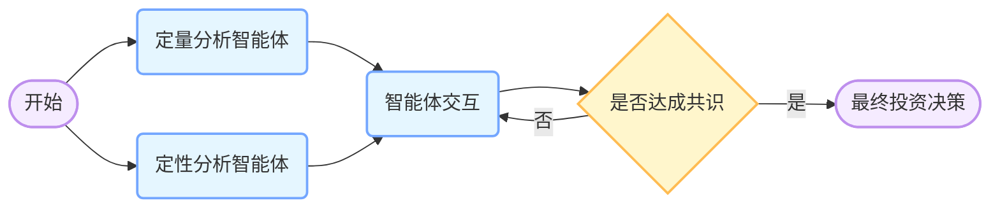

# 智能体群体决策：平衡定量与定性分析在价值投资中的权重

> 关键词：智能体群体决策、定量分析、定性分析、价值投资、权重平衡

> 摘要：本文聚焦于智能体群体决策在价值投资中对定量与定性分析权重的平衡问题。首先介绍了相关背景，包括目的、预期读者等。详细阐述了核心概念如智能体群体决策、定量分析、定性分析及其联系，并给出相应的文本示意图和Mermaid流程图。深入讲解了核心算法原理，用Python代码进行了详细说明。同时给出了相关的数学模型和公式，并举例分析。通过项目实战，展示了代码实现和解读。探讨了实际应用场景，推荐了学习资源、开发工具框架和相关论文著作。最后总结了未来发展趋势与挑战，提供了常见问题解答和扩展阅读参考资料，旨在为价值投资者在平衡定量与定性分析权重方面提供全面且深入的指导。

## 1. 背景介绍 
### 1.1 目的和范围
在价值投资领域，准确评估投资对象的价值是实现盈利的关键。传统的价值投资分析方法主要分为定量分析和定性分析两种。定量分析侧重于通过财务数据、统计指标等量化信息来评估投资对象的价值，而定性分析则更关注企业的战略、管理团队、行业前景等非量化因素。然而，单一使用定量或定性分析都存在局限性，难以全面、准确地评估投资对象的价值。

本文的目的在于探讨如何利用智能体群体决策的方法，平衡定量与定性分析在价值投资中的权重，以提高价值评估的准确性和投资决策的科学性。具体范围包括智能体群体决策的原理和算法、定量与定性分析的核心概念和方法、如何建立数学模型来确定两者的权重、实际项目中的应用案例以及相关工具和资源的推荐等。

### 1.2 预期读者
本文的预期读者主要包括以下几类人群：
1. **价值投资者**：希望通过更科学的方法平衡定量与定性分析，提高投资决策的准确性和成功率。
2. **金融分析师**：在进行投资分析和研究时，需要综合考虑各种因素，本文提供的方法和思路有助于他们更全面地评估投资对象。
3. **人工智能研究者**：对智能体群体决策在金融领域的应用感兴趣，希望了解相关的理论和实践经验。
4. **高校相关专业的学生**：学习金融投资、人工智能等专业的学生，可以通过本文了解跨学科领域的研究成果和应用案例。

### 1.3 文档结构概述
本文的结构如下：
1. **背景介绍**：阐述本文的目的和范围、预期读者、文档结构概述以及相关术语的定义。
2. **核心概念与联系**：介绍智能体群体决策、定量分析和定性分析的核心概念，以及它们之间的联系，并给出相应的文本示意图和Mermaid流程图。
3. **核心算法原理 & 具体操作步骤**：详细讲解智能体群体决策的核心算法原理，并用Python代码进行具体实现和解释。
4. **数学模型和公式 & 详细讲解 & 举例说明**：建立数学模型来确定定量与定性分析在价值投资中的权重，并给出详细的公式和举例说明。
5. **项目实战：代码实际案例和详细解释说明**：通过一个实际的项目案例，展示如何运用智能体群体决策方法平衡定量与定性分析的权重，并对代码进行详细解读。
6. **实际应用场景**：探讨智能体群体决策在价值投资中的实际应用场景，如股票投资、基金投资等。
7. **工具和资源推荐**：推荐相关的学习资源、开发工具框架和论文著作，帮助读者进一步深入学习和研究。
8. **总结：未来发展趋势与挑战**：总结本文的主要内容，分析智能体群体决策在价值投资中平衡定量与定性分析权重的未来发展趋势和面临的挑战。
9. **附录：常见问题与解答**：提供常见问题的解答，帮助读者更好地理解本文的内容。
10. **扩展阅读 & 参考资料**：列出相关的扩展阅读材料和参考资料，方便读者进一步查阅和研究。

### 1.4 术语表
#### 1.4.1 核心术语定义
1. **智能体群体决策**：多个智能体通过相互协作和交互，共同做出决策的过程。智能体可以是软件程序、机器人或人类等，它们具有一定的自主性和智能性，能够根据自身的知识和经验进行决策。
2. **定量分析**：通过对财务数据、统计指标等量化信息的分析，来评估投资对象的价值和风险。常见的定量分析方法包括财务比率分析、现金流折现分析等。
3. **定性分析**：关注企业的战略、管理团队、行业前景等非量化因素，通过对这些因素的评估来判断投资对象的价值和潜力。定性分析方法通常包括行业研究、企业访谈、专家评估等。
4. **价值投资**：一种投资策略，通过寻找被低估的投资对象，长期持有以获取价值回归带来的收益。价值投资强调对投资对象的内在价值进行深入分析和评估。

#### 1.4.2 相关概念解释
1. **权重平衡**：在价值投资中，确定定量分析和定性分析在评估投资对象价值时所占的比重，使得两者能够相互补充，提高评估的准确性和全面性。
2. **智能体交互**：智能体之间通过信息传递、协商等方式进行交流和协作的过程。在智能体群体决策中，智能体交互是实现决策优化的关键环节。
3. **数据挖掘**：从大量的数据中提取有价值的信息和知识的过程。在定量分析中，数据挖掘技术可以用于发现数据中的规律和趋势，为投资决策提供支持。

#### 1.4.3 缩略词列表
1. **AI**：Artificial Intelligence，人工智能
2. **ML**：Machine Learning，机器学习
3. **NLP**：Natural Language Processing，自然语言处理
4. **DCF**：Discounted Cash Flow，现金流折现

## 2. 核心概念与联系 
### 核心概念原理
#### 智能体群体决策
智能体群体决策是基于多智能体系统的一种决策方法。每个智能体具有自己的知识、目标和决策能力，它们通过相互协作和交互，共同完成决策任务。在价值投资中，智能体可以代表不同的分析方法、专家意见或投资策略。例如，一个智能体可以专门负责定量分析，另一个智能体可以专注于定性分析。多个智能体通过交流和协商，综合各自的分析结果，做出最终的投资决策。

智能体群体决策的优势在于能够充分利用多个智能体的知识和经验，提高决策的准确性和可靠性。同时，智能体之间的交互可以促进信息的共享和整合，发现单一智能体难以察觉的信息和规律。

#### 定量分析
定量分析是价值投资中常用的方法之一，它通过对财务数据、统计指标等量化信息的分析，来评估投资对象的价值和风险。常见的定量分析指标包括市盈率（PE）、市净率（PB）、净资产收益率（ROE）等。这些指标可以帮助投资者了解企业的盈利能力、偿债能力、估值水平等方面的情况。

定量分析的优点是数据客观、可量化，分析结果具有一定的可比性和准确性。然而，定量分析也存在局限性，它往往只关注企业的历史数据和财务指标，忽略了企业的未来发展潜力和非财务因素的影响。

#### 定性分析
定性分析则侧重于对企业的战略、管理团队、行业前景等非量化因素的评估。通过对这些因素的分析，投资者可以了解企业的核心竞争力、发展趋势和潜在风险。例如，一个具有优秀管理团队和创新战略的企业，即使当前的财务指标不太理想，也可能具有较高的投资价值。

定性分析的优点是能够考虑到企业的长期发展潜力和非财务因素的影响，提供更全面的投资视角。但定性分析也存在主观性较强、难以量化的问题，分析结果的可靠性在一定程度上取决于分析师的经验和判断能力。

### 架构的文本示意图
```plaintext
智能体群体决策
├── 定量分析智能体
│   ├── 财务数据收集
│   ├── 指标计算
│   ├── 量化评估
├── 定性分析智能体
│   ├── 行业研究
│   ├── 企业访谈
│   ├── 专家评估
├── 智能体交互
│   ├── 信息共享
│   ├── 协商决策
├── 最终投资决策
```

### Mermaid流程图


## 3. 核心算法原理 & 具体操作步骤 
### 核心算法原理
在智能体群体决策中，我们可以采用一种基于加权平均的方法来平衡定量与定性分析的权重。具体来说，每个智能体根据自己的分析结果给出一个评分，然后根据预先设定的权重对这些评分进行加权平均，得到最终的投资评分。

假设我们有 $n$ 个智能体，其中 $m$ 个负责定量分析，$n - m$ 个负责定性分析。第 $i$ 个智能体的评分记为 $s_i$，其对应的权重记为 $w_i$，且满足 $\sum_{i = 1}^{n} w_i = 1$。则最终的投资评分 $S$ 可以通过以下公式计算：

$$S = \sum_{i = 1}^{n} w_i s_i$$

### 具体操作步骤
1. **确定智能体集合**：根据投资分析的需求，确定参与决策的智能体集合，包括定量分析智能体和定性分析智能体。
2. **设定权重**：根据投资目标和经验，为每个智能体设定相应的权重。权重的设定可以根据不同的投资场景和投资者的偏好进行调整。
3. **智能体分析**：每个智能体根据自己的任务和方法，对投资对象进行分析，并给出评分。
4. **智能体交互**：智能体之间进行信息共享和协商，根据其他智能体的意见和信息，调整自己的评分。
5. **计算最终评分**：根据设定的权重，对每个智能体的评分进行加权平均，得到最终的投资评分。
6. **决策制定**：根据最终的投资评分，制定投资决策。例如，如果评分高于某个阈值，则可以考虑买入；如果评分低于某个阈值，则可以考虑卖出。

### Python源代码实现
```python
# 定义智能体评分和权重
quantitative_scores = [0.8, 0.7, 0.6]  # 定量分析智能体的评分
qualitative_scores = [0.9, 0.8]  # 定性分析智能体的评分
quantitative_weights = [0.2, 0.3, 0.2]  # 定量分析智能体的权重
qualitative_weights = [0.2, 0.1]  # 定性分析智能体的权重

# 合并评分和权重
scores = quantitative_scores + qualitative_scores
weights = quantitative_weights + qualitative_weights

# 计算最终评分
final_score = sum([score * weight for score, weight in zip(scores, weights)])

print(f"最终投资评分: {final_score}")
```

### 代码解释
1. **定义评分和权重**：首先，我们分别定义了定量分析智能体和定性分析智能体的评分和权重。
2. **合并评分和权重**：将定量分析和定性分析的评分和权重合并成一个列表，方便后续计算。
3. **计算最终评分**：使用列表推导式和 `sum` 函数，对每个智能体的评分和权重进行相乘并求和，得到最终的投资评分。
4. **输出结果**：将最终的投资评分打印输出。

## 4. 数学模型和公式 & 详细讲解 & 举例说明 
### 数学模型
在前面的算法原理中，我们已经给出了计算最终投资评分的公式：

$$S = \sum_{i = 1}^{n} w_i s_i$$

其中，$S$ 表示最终的投资评分，$n$ 表示智能体的数量，$w_i$ 表示第 $i$ 个智能体的权重，$s_i$ 表示第 $i$ 个智能体的评分。

### 详细讲解
这个公式的核心思想是通过加权平均的方法，将每个智能体的分析结果进行综合。权重 $w_i$ 反映了每个智能体在决策中的重要性，评分 $s_i$ 则表示每个智能体对投资对象的评估结果。通过调整权重的大小，可以灵活地平衡定量分析和定性分析在决策中的比重。

例如，如果我们更看重定量分析的结果，可以适当提高定量分析智能体的权重；如果我们认为定性分析对于投资决策更为关键，可以增加定性分析智能体的权重。

### 举例说明
假设我们有 3 个定量分析智能体和 2 个定性分析智能体，它们的评分和权重如下表所示：

| 智能体类型 | 评分 ($s_i$) | 权重 ($w_i$) |
| --- | --- | --- |
| 定量分析 1 | 0.8 | 0.2 |
| 定量分析 2 | 0.7 | 0.3 |
| 定量分析 3 | 0.6 | 0.2 |
| 定性分析 1 | 0.9 | 0.2 |
| 定性分析 2 | 0.8 | 0.1 |

根据上述公式，我们可以计算最终的投资评分：

$$
\begin{align*}
S &= 0.2 \times 0.8 + 0.3 \times 0.7 + 0.2 \times 0.6 + 0.2 \times 0.9 + 0.1 \times 0.8 \\
&= 0.16 + 0.21 + 0.12 + 0.18 + 0.08 \\
&= 0.75
\end{align*}
$$

通过这个例子，我们可以看到如何利用数学模型和公式来平衡定量与定性分析的权重，得到一个综合的投资评分。

## 5. 项目实战：代码实际案例和详细解释说明 
### 5.1 开发环境搭建
在进行项目实战之前，我们需要搭建相应的开发环境。以下是具体的步骤：
1. **安装Python**：建议安装Python 3.7及以上版本。可以从Python官方网站（https://www.python.org/downloads/）下载并安装。
2. **安装必要的库**：在本项目中，我们主要使用Python的基本库，无需额外安装其他库。如果需要进行数据处理和分析，可以安装 `pandas`、`numpy` 等库。可以使用以下命令进行安装：
```sh
pip install pandas numpy
```
3. **选择开发工具**：可以选择使用任何喜欢的Python开发工具，如PyCharm、Jupyter Notebook等。

### 5.2 源代码详细实现和代码解读
以下是一个完整的项目实战代码示例，用于演示如何利用智能体群体决策方法平衡定量与定性分析的权重：

```python
import pandas as pd

# 定义定量分析数据
quantitative_data = {
    '智能体编号': [1, 2, 3],
    '评分': [0.8, 0.7, 0.6],
    '权重': [0.2, 0.3, 0.2]
}
quantitative_df = pd.DataFrame(quantitative_data)

# 定义定性分析数据
qualitative_data = {
    '智能体编号': [4, 5],
    '评分': [0.9, 0.8],
    '权重': [0.2, 0.1]
}
qualitative_df = pd.DataFrame(qualitative_data)

# 合并定量和定性分析数据
combined_df = pd.concat([quantitative_df, qualitative_df], ignore_index=True)

# 计算最终评分
final_score = (combined_df['评分'] * combined_df['权重']).sum()

print(f"最终投资评分: {final_score}")
```

### 代码解读
1. **导入必要的库**：导入 `pandas` 库，用于数据处理和分析。
2. **定义定量分析数据**：使用字典定义定量分析智能体的评分和权重，并将其转换为 `pandas` 的 `DataFrame` 对象。
3. **定义定性分析数据**：同样，使用字典定义定性分析智能体的评分和权重，并转换为 `DataFrame` 对象。
4. **合并数据**：使用 `pd.concat` 函数将定量分析和定性分析的数据合并成一个 `DataFrame` 对象。
5. **计算最终评分**：将评分和权重相乘，并使用 `sum` 函数求和，得到最终的投资评分。
6. **输出结果**：将最终的投资评分打印输出。

### 5.3 代码解读与分析
通过上述代码，我们可以看到如何利用 `pandas` 库来处理和分析数据，实现智能体群体决策中定量与定性分析权重的平衡。`pandas` 库提供了强大的数据处理和分析功能，使得代码更加简洁和易于维护。

在实际应用中，我们可以根据具体的需求对代码进行扩展和优化。例如，可以从文件或数据库中读取定量和定性分析的数据，而不是手动定义；可以增加智能体之间的交互和协商机制，提高决策的准确性和可靠性。

## 6. 实际应用场景 
### 股票投资
在股票投资中，智能体群体决策可以帮助投资者平衡定量与定性分析的权重，做出更科学的投资决策。定量分析智能体可以通过分析公司的财务报表、估值指标等数据，评估公司的盈利能力、偿债能力和估值水平。定性分析智能体则可以通过研究公司的战略规划、管理团队、行业前景等因素，评估公司的核心竞争力和发展潜力。

例如，在选择投资某只股票时，定量分析智能体发现该公司的市盈率较低，财务状况良好，但定性分析智能体认为该公司所处的行业竞争激烈，未来发展前景不明朗。通过智能体群体决策，综合考虑定量和定性分析的结果，投资者可以更准确地评估该股票的投资价值，决定是否买入或卖出。

### 基金投资
在基金投资中，智能体群体决策同样具有重要的应用价值。定量分析智能体可以分析基金的历史业绩、风险指标等数据，评估基金的投资表现和风险水平。定性分析智能体则可以研究基金经理的投资风格、管理能力、基金公司的信誉等因素，评估基金的投资潜力和可持续性。

例如，在选择投资某只基金时，定量分析智能体发现该基金的过去一年收益率较高，但定性分析智能体认为该基金经理的投资风格过于激进，可能存在较大的风险。通过智能体群体决策，投资者可以综合考虑定量和定性分析的结果，选择更适合自己风险偏好和投资目标的基金。

### 债券投资
在债券投资中，智能体群体决策也可以发挥作用。定量分析智能体可以分析债券的票面利率、到期收益率、信用评级等数据，评估债券的收益和风险。定性分析智能体则可以研究债券发行主体的财务状况、行业前景、宏观经济环境等因素，评估债券的违约风险和市场前景。

例如，在选择投资某只债券时，定量分析智能体发现该债券的到期收益率较高，但定性分析智能体认为债券发行主体所处的行业面临较大的竞争压力，可能存在违约风险。通过智能体群体决策，投资者可以平衡定量和定性分析的结果，做出更明智的投资决策。

## 7. 工具和资源推荐
### 7.1 学习资源推荐
#### 7.1.1 书籍推荐
1. 《聪明的投资者》（The Intelligent Investor）：本杰明·格雷厄姆（Benjamin Graham）著，被誉为价值投资的圣经，详细介绍了价值投资的理念和方法。
2. 《证券分析》（Security Analysis）：本杰明·格雷厄姆和戴维·多德（David Dodd）著，经典的投资分析著作，对定量和定性分析方法进行了深入探讨。
3. 《人工智能：一种现代的方法》（Artificial Intelligence: A Modern Approach）：斯图尔特·罗素（Stuart Russell）和彼得·诺维格（Peter Norvig）著，全面介绍了人工智能的基本概念、算法和应用，对于理解智能体群体决策有很大帮助。

#### 7.1.2 在线课程
1. Coursera上的“机器学习”（Machine Learning）课程：由斯坦福大学教授吴恩达（Andrew Ng）讲授，是机器学习领域的经典课程，涵盖了机器学习的基本算法和应用。
2. edX上的“人工智能基础”（Fundamentals of Artificial Intelligence）课程：由哥伦比亚大学教授彼得·斯通（Peter Stone）讲授，介绍了人工智能的基本概念、技术和应用。
3. 中国大学MOOC上的“金融投资学”课程：由国内高校教授讲授，系统介绍了金融投资的基本理论和方法，包括价值投资和定量分析。

#### 7.1.3 技术博客和网站
1. Medium：一个技术博客平台，上面有很多关于人工智能、金融投资等领域的优秀文章。
2. Towards Data Science：专注于数据科学和机器学习领域的博客网站，提供了很多实用的技术文章和案例分析。
3. 雪球网：国内知名的投资社区，提供了丰富的股票、基金等投资信息和分析工具，还有很多投资者分享自己的投资经验和见解。

### 7.2 开发工具框架推荐
#### 7.2.1 IDE和编辑器
1. PyCharm：一款专业的Python集成开发环境，提供了丰富的代码编辑、调试、分析等功能，适合开发大型的Python项目。
2. Jupyter Notebook：一个交互式的开发环境，支持Python、R等多种编程语言，适合进行数据探索、模型训练和可视化等工作。
3. Visual Studio Code：一款轻量级的代码编辑器，支持多种编程语言和插件扩展，具有良好的代码编辑和调试功能。

#### 7.2.2 调试和性能分析工具
1. PDB：Python自带的调试器，可以帮助开发者逐行调试代码，查找和解决问题。
2. cProfile：Python的性能分析工具，可以统计代码的运行时间和函数调用次数，帮助开发者优化代码性能。
3. Py-Spy：一个轻量级的Python性能分析工具，可以实时监测Python程序的性能，找出性能瓶颈。

#### 7.2.3 相关框架和库
1. Pandas：一个强大的数据处理和分析库，提供了丰富的数据结构和函数，方便进行数据清洗、转换和分析。
2. Numpy：Python的数值计算库，提供了高效的多维数组对象和数学函数，是很多数据分析和机器学习库的基础。
3. Scikit-learn：一个常用的机器学习库，提供了丰富的机器学习算法和工具，包括分类、回归、聚类等算法。

### 7.3 相关论文著作推荐
#### 7.3.1 经典论文
1. “A Mathematical Theory of Communication”：克劳德·香农（Claude Shannon）著，奠定了信息论的基础，对于理解智能体之间的信息传递和交互有重要意义。
2. “The Efficient Market Hypothesis and Its Critics”：尤金·法玛（Eugene F. Fama）著，对有效市场假说进行了深入探讨，是金融投资领域的经典论文。
3. “Reinforcement Learning: An Introduction”：理查德·萨顿（Richard S. Sutton）和安德鲁·巴托（Andrew G. Barto）著，系统介绍了强化学习的基本概念、算法和应用，对于智能体决策和学习有很大帮助。

#### 7.3.2 最新研究成果
1. 可以关注顶级学术会议如NeurIPS（神经信息处理系统大会）、ICML（国际机器学习会议）、KDD（知识发现与数据挖掘会议）等，了解人工智能和机器学习领域的最新研究成果。
2. 查阅金融领域的顶级期刊如Journal of Finance、Review of Financial Studies等，了解价值投资和投资决策方面的最新研究进展。

#### 7.3.3 应用案例分析
1. 可以参考一些金融科技公司的研究报告和案例分析，了解智能体群体决策在实际投资中的应用情况和效果。
2. 关注一些投资机构的研究成果和投资策略，学习他们如何平衡定量与定性分析的权重，做出科学的投资决策。

## 8. 总结：未来发展趋势与挑战
### 未来发展趋势
1. **智能化程度不断提高**：随着人工智能技术的不断发展，智能体的智能水平将不断提高，能够更好地理解和处理复杂的信息，做出更准确的决策。例如，智能体可以利用深度学习算法进行数据分析和模式识别，提高定量和定性分析的准确性。
2. **多领域融合应用**：智能体群体决策将与更多领域进行融合应用，如区块链、物联网等。例如，在区块链技术的支持下，智能体之间的信息交互和决策过程可以更加安全、透明和可信。
3. **个性化投资服务**：根据投资者的风险偏好、投资目标和财务状况等因素，为投资者提供个性化的投资服务。智能体群体决策可以根据不同投资者的需求，灵活调整定量与定性分析的权重，制定更适合投资者的投资策略。

### 挑战
1. **数据质量和可靠性**：智能体群体决策依赖于大量的数据进行分析和决策，数据的质量和可靠性直接影响决策的准确性。因此，如何获取高质量、可靠的数据，并对数据进行有效的清洗和预处理，是一个重要的挑战。
2. **智能体交互和协作机制**：智能体之间的交互和协作机制是实现智能体群体决策的关键。如何设计有效的交互和协作机制，促进智能体之间的信息共享和协商，提高决策的效率和准确性，是需要解决的问题。
3. **伦理和法律问题**：随着智能体群体决策在金融投资等领域的广泛应用，伦理和法律问题也日益凸显。例如，智能体的决策是否符合道德和法律规范，如何保障投资者的权益等，都是需要关注和解决的问题。

## 9. 附录：常见问题与解答
### 问题1：如何确定定量分析和定性分析智能体的权重？
解答：权重的确定可以根据投资目标、经验和市场情况等因素进行调整。一般来说，如果投资者更看重短期的投资收益，可以适当提高定量分析智能体的权重；如果投资者更关注企业的长期发展潜力，可以增加定性分析智能体的权重。此外，还可以通过历史数据的回测和模拟实验，来优化权重的设置。

### 问题2：智能体群体决策的计算复杂度高吗？
解答：智能体群体决策的计算复杂度取决于智能体的数量、分析方法的复杂度和数据量等因素。在简单的情况下，计算复杂度较低，可以快速得到决策结果。但在复杂的情况下，如智能体数量较多、分析方法复杂或数据量较大时，计算复杂度可能会较高。可以通过优化算法和并行计算等方法来降低计算复杂度。

### 问题3：智能体群体决策能否完全替代人工决策？
解答：虽然智能体群体决策具有很多优势，如能够综合多个智能体的知识和经验、提高决策的准确性和可靠性等，但它不能完全替代人工决策。人工决策在处理复杂的、模糊的信息和考虑人类的情感、价值观等方面具有独特的优势。在实际应用中，智能体群体决策可以作为人工决策的辅助工具，为投资者提供更全面、准确的信息和建议。

## 10. 扩展阅读 & 参考资料
### 扩展阅读
1. 《机器学习实战》（Machine Learning in Action）：通过具体的案例和代码，介绍了机器学习的基本算法和应用，对于理解智能体群体决策中的数据分析和模型训练有很大帮助。
2. 《金融炼金术》（The Alchemy of Finance）：乔治·索罗斯（George Soros）著，介绍了他的投资哲学和方法，对于理解金融市场的复杂性和不确定性有一定的启示。
3. 《思考，快与慢》（Thinking, Fast and Slow）：丹尼尔·卡尼曼（Daniel Kahneman）著，探讨了人类思维的两种模式，对于理解投资者的决策行为和心理有重要意义。

### 参考资料
1. 相关学术论文和研究报告，可以通过学术数据库如IEEE Xplore、ACM Digital Library等进行查阅。
2. 金融投资领域的专业书籍和杂志，如《金融研究》、《投资研究》等。
3. 人工智能和机器学习领域的开源项目和代码库，如GitHub上的相关项目。

作者：AI天才研究院/AI Genius Institute & 禅与计算机程序设计艺术 /Zen And The Art of Computer Programming