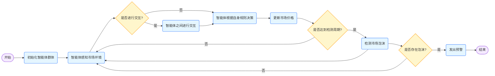

# 智能体群体在市场泡沫检测中的应用

> 关键词：智能体群体、市场泡沫检测、复杂系统、多智能体系统、金融市场分析

> 摘要：本文聚焦于智能体群体在市场泡沫检测中的应用。首先介绍了相关背景，包括研究目的、预期读者、文档结构和术语表。接着阐述了智能体群体、市场泡沫等核心概念及其联系，给出了原理和架构的文本示意图与 Mermaid 流程图。详细讲解了用于市场泡沫检测的核心算法原理，并使用 Python 代码进行说明。同时，介绍了相关的数学模型和公式，并举例说明。通过项目实战，展示了代码实际案例并进行详细解释。探讨了智能体群体在市场泡沫检测中的实际应用场景，推荐了学习资源、开发工具框架和相关论文著作。最后总结了未来发展趋势与挑战，并提供了常见问题解答和扩展阅读参考资料。旨在为研究者和从业者提供全面深入的关于智能体群体在市场泡沫检测中应用的知识和方法。

## 1. 背景介绍 
### 1.1 目的和范围
金融市场的稳定对于经济的健康发展至关重要，而市场泡沫的出现往往会打破这种稳定，给投资者和整个经济体系带来巨大风险。市场泡沫是指资产价格显著高于其内在价值的现象，当泡沫破裂时，资产价格会急剧下跌，引发金融危机。因此，准确地检测市场泡沫具有重要的现实意义。

本研究的目的在于探讨智能体群体在市场泡沫检测中的应用，通过构建智能体群体模型来模拟金融市场参与者的行为，从而更准确地识别市场泡沫的形成和发展过程。研究范围涵盖了智能体群体的基本概念、核心算法、数学模型以及在实际金融市场中的应用案例。

### 1.2 预期读者
本文的预期读者包括金融领域的研究者、从业者，如金融分析师、投资经理等，他们希望通过新的技术手段提高市场泡沫检测的准确性；计算机科学领域对人工智能和复杂系统应用感兴趣的研究人员和开发者，他们可以从金融市场的实际问题中获取新的研究灵感；以及对金融市场和人工智能交叉领域有学习需求的学生和爱好者。

### 1.3 文档结构概述
本文将按照以下结构进行组织：首先介绍核心概念，包括智能体群体和市场泡沫的定义、特点以及它们之间的联系，并给出相应的原理和架构示意图与流程图；接着详细阐述用于市场泡沫检测的核心算法原理和具体操作步骤，并用 Python 代码进行实现；然后介绍相关的数学模型和公式，并通过具体例子进行说明；之后通过项目实战展示代码的实际应用，包括开发环境搭建、源代码实现和代码解读；再探讨智能体群体在市场泡沫检测中的实际应用场景；推荐学习资源、开发工具框架和相关论文著作；最后总结未来发展趋势与挑战，提供常见问题解答和扩展阅读参考资料。

### 1.4 术语表
#### 1.4.1 核心术语定义
- **智能体群体（Agent Population）**：由多个智能体组成的集合，每个智能体具有一定的自主性、适应性和交互能力，能够根据自身的目标和环境信息做出决策和行动。在金融市场中，智能体可以代表不同类型的投资者，如散户、机构投资者等。
- **市场泡沫（Market Bubble）**：指资产价格在一段时间内持续大幅上涨，远远超过其内在价值的现象。市场泡沫的形成通常是由于投资者的过度乐观情绪、羊群效应等因素导致的。
- **多智能体系统（Multi - Agent System，MAS）**：由多个智能体组成的系统，智能体之间可以通过通信和交互来实现共同的目标或解决复杂的问题。在市场泡沫检测中，多智能体系统可以模拟金融市场中不同投资者之间的相互作用。

#### 1.4.2 相关概念解释
- **适应性（Adaptability）**：智能体能够根据环境的变化调整自己的行为和策略的能力。在金融市场中，投资者会根据市场行情的变化调整自己的投资组合。
- **羊群效应（Herding Effect）**：指投资者在决策时往往会受到其他投资者的影响，而忽略自己的信息和判断，从而导致市场上出现集体性的投资行为。羊群效应是市场泡沫形成的重要原因之一。
- **内在价值（Intrinsic Value）**：资产的真实价值，通常基于资产的基本面因素，如公司的盈利能力、现金流等进行评估。

#### 1.4.3 缩略词列表
- **MAS**：Multi - Agent System（多智能体系统）
- **AI**：Artificial Intelligence（人工智能）

## 2. 核心概念与联系 

### 智能体群体的概念和特点
智能体群体是由多个智能体组成的集合，每个智能体具有以下特点：
- **自主性**：智能体能够独立地感知环境信息，并根据自身的目标和规则做出决策和行动。例如，在金融市场中，每个投资者都有自己的投资目标和风险偏好，会根据市场行情自主地决定买卖股票。
- **适应性**：智能体可以根据环境的变化调整自己的行为和策略。当市场行情发生变化时，投资者会调整自己的投资组合，以适应市场的变化。
- **交互性**：智能体之间可以进行通信和交互，通过信息共享和合作来实现共同的目标或解决复杂的问题。在金融市场中，投资者会通过交流、获取他人的投资建议等方式来影响自己的决策。

### 市场泡沫的形成机制
市场泡沫的形成通常经历以下几个阶段：
- **潜伏期**：市场上出现一些利好消息，吸引了部分投资者的关注，资产价格开始缓慢上涨。此时，投资者对市场的预期逐渐改善，但大多数人还比较谨慎。
- **膨胀期**：随着资产价格的上涨，越来越多的投资者被吸引进入市场，形成了羊群效应。投资者的乐观情绪不断高涨，资产价格加速上涨，远远超过其内在价值。
- **破裂期**：当市场上出现一些负面消息或投资者的信心开始动摇时，部分投资者开始抛售资产，导致资产价格下跌。随着更多投资者的跟风抛售，资产价格急剧下跌，市场泡沫破裂。

### 智能体群体与市场泡沫检测的联系
智能体群体可以通过模拟金融市场中不同投资者的行为和交互，来研究市场泡沫的形成和发展过程。具体来说，智能体群体可以：
- **模拟投资者的决策过程**：通过设定智能体的投资目标、风险偏好和决策规则，模拟投资者在不同市场环境下的决策行为。
- **研究羊群效应**：智能体之间的交互可以模拟投资者之间的信息传播和模仿行为，从而研究羊群效应在市场泡沫形成中的作用。
- **检测市场泡沫**：通过分析智能体群体的行为和市场价格的变化，建立相应的指标和模型，来检测市场泡沫的形成和发展。

### 核心概念原理和架构的文本示意图
智能体群体在市场泡沫检测中的应用架构主要包括以下几个部分：
- **智能体层**：由多个智能体组成，每个智能体代表一个投资者，具有自己的属性和行为规则。
- **交互层**：智能体之间通过通信和交互来交换信息，影响彼此的决策。
- **市场环境层**：包括市场价格、宏观经济数据等信息，为智能体提供决策依据。
- **检测层**：通过分析智能体群体的行为和市场价格的变化，建立检测模型，判断市场是否存在泡沫。

### Mermaid 流程图


## 3. 核心算法原理 & 具体操作步骤 

### 核心算法原理
在市场泡沫检测中，我们可以使用基于智能体群体的仿真算法。该算法的核心思想是通过模拟智能体的行为和交互，来研究市场价格的动态变化，从而检测市场泡沫的形成。

具体来说，我们可以将智能体分为不同的类型，如基本面投资者和技术面投资者。基本面投资者根据资产的内在价值进行投资决策，而技术面投资者则根据市场价格的历史数据进行投资决策。智能体之间通过信息传播和模仿行为相互影响，形成羊群效应。

### 具体操作步骤
1. **初始化智能体群体**：设定智能体的数量、类型、初始资产和投资策略。
2. **模拟市场环境**：生成市场价格的初始值和宏观经济数据。
3. **智能体感知市场环境**：每个智能体根据自己的感知能力获取市场信息。
4. **智能体之间的交互**：智能体之间通过通信和模仿行为相互影响，更新自己的投资策略。
5. **智能体决策**：每个智能体根据自己的投资策略和市场信息做出投资决策，买卖资产。
6. **更新市场价格**：根据智能体的买卖行为，更新市场价格。
7. **检测市场泡沫**：定期分析智能体群体的行为和市场价格的变化，判断市场是否存在泡沫。

### Python 源代码实现
```python
import numpy as np

# 定义智能体类
class Agent:
    def __init__(self, agent_type, initial_asset):
        self.agent_type = agent_type  # 智能体类型，0 表示基本面投资者，1 表示技术面投资者
        self.asset = initial_asset  # 初始资产
        self.investment = 0  # 投资金额

    def perceive(self, market_price, intrinsic_value):
        # 智能体感知市场环境
        if self.agent_type == 0:
            # 基本面投资者根据内在价值决策
            if market_price < intrinsic_value:
                self.investment = self.asset * 0.5
            else:
                self.investment = -self.asset * 0.5
        else:
            # 技术面投资者根据市场价格趋势决策
            # 这里简单假设如果价格上涨则投资，下跌则卖出
            if market_price > market_price_history[-1]:
                self.investment = self.asset * 0.5
            else:
                self.investment = -self.asset * 0.5

    def interact(self, other_agents):
        # 智能体之间的交互
        # 简单模拟羊群效应，跟随其他智能体的投资决策
        total_investment = sum([agent.investment for agent in other_agents])
        if total_investment > 0:
            self.investment = self.asset * 0.5
        else:
            self.investment = -self.asset * 0.5

# 初始化智能体群体
num_agents = 100
agents = []
for i in range(num_agents):
    agent_type = np.random.randint(0, 2)
    initial_asset = np.random.uniform(1000, 10000)
    agents.append(Agent(agent_type, initial_asset))

# 模拟市场环境
market_price = 100
intrinsic_value = 80
market_price_history = [market_price]

# 模拟过程
num_steps = 100
for step in range(num_steps):
    # 智能体感知市场环境
    for agent in agents:
        agent.perceive(market_price, intrinsic_value)

    # 智能体之间的交互
    for i, agent in enumerate(agents):
        other_agents = agents[:i] + agents[i + 1:]
        agent.interact(other_agents)

    # 智能体决策
    total_investment = sum([agent.investment for agent in agents])

    # 更新市场价格
    market_price += total_investment * 0.01
    market_price_history.append(market_price)

    # 检测市场泡沫
    if market_price > intrinsic_value * 1.5:
        print(f"Step {step}: Market bubble detected!")

# 绘制市场价格变化曲线
import matplotlib.pyplot as plt
plt.plot(market_price_history)
plt.xlabel('Step')
plt.ylabel('Market Price')
plt.title('Market Price Evolution')
plt.show()
```

### 代码解释
1. **Agent 类**：定义了智能体的属性和方法。`__init__` 方法用于初始化智能体的类型和初始资产；`perceive` 方法用于智能体感知市场环境，根据不同的类型做出投资决策；`interact` 方法用于智能体之间的交互，模拟羊群效应。
2. **初始化智能体群体**：随机生成智能体的类型和初始资产，创建智能体列表。
3. **模拟市场环境**：设定市场价格的初始值和内在价值。
4. **模拟过程**：在每个时间步，智能体感知市场环境、进行交互、做出决策，然后更新市场价格。如果市场价格超过内在价值的 1.5 倍，则认为检测到市场泡沫。
5. **绘制市场价格变化曲线**：使用 `matplotlib` 库绘制市场价格随时间的变化曲线。

## 4. 数学模型和公式 & 详细讲解 & 举例说明 

### 智能体的投资决策模型
对于基本面投资者，其投资决策可以用以下公式表示：
$$
I_{f} = \begin{cases}
\alpha A, & \text{if } P < V \\
-\alpha A, & \text{if } P \geq V
\end{cases}
$$
其中，$I_{f}$ 是基本面投资者的投资金额，$\alpha$ 是投资比例（$0 < \alpha < 1$），$A$ 是智能体的资产，$P$ 是市场价格，$V$ 是资产的内在价值。

对于技术面投资者，其投资决策可以用以下公式表示：
$$
I_{t} = \begin{cases}
\beta A, & \text{if } \Delta P > 0 \\
-\beta A, & \text{if } \Delta P \leq 0
\end{cases}
$$
其中，$I_{t}$ 是技术面投资者的投资金额，$\beta$ 是投资比例（$0 < \beta < 1$），$\Delta P = P - P_{-1}$ 是市场价格的变化量，$P_{-1}$ 是上一时刻的市场价格。

### 市场价格更新模型
市场价格的更新可以根据智能体的总投资金额来计算：
$$
P_{t+1} = P_{t} + \gamma \sum_{i=1}^{n} I_{i}
$$
其中，$P_{t}$ 是时刻 $t$ 的市场价格，$P_{t+1}$ 是时刻 $t + 1$ 的市场价格，$\gamma$ 是价格调整系数，$n$ 是智能体的数量，$I_{i}$ 是第 $i$ 个智能体的投资金额。

### 市场泡沫检测指标
可以使用价格 - 内在价值比（Price - to - Intrinsic Value Ratio，PIVR）作为市场泡沫检测指标：
$$
\text{PIVR} = \frac{P}{V}
$$
当 $\text{PIVR}$ 超过一定阈值（如 1.5）时，认为市场存在泡沫。

### 举例说明
假设市场上有 100 个智能体，其中 50 个是基本面投资者，50 个是技术面投资者。每个智能体的初始资产为 5000 元，投资比例 $\alpha = \beta = 0.5$，价格调整系数 $\gamma = 0.01$，资产的内在价值 $V = 80$ 元，初始市场价格 $P_{0} = 100$ 元。

在第一个时间步，基本面投资者根据市场价格和内在价值的比较做出投资决策。由于 $P_{0} > V$，每个基本面投资者的投资金额为 $I_{f} = -0.5 \times 5000 = -2500$ 元。技术面投资者根据市场价格的变化做出投资决策，由于是第一个时间步，没有价格变化，假设他们不进行投资，即 $I_{t} = 0$ 元。

总投资金额为 $\sum_{i=1}^{100} I_{i} = 50 \times (-2500) + 50 \times 0 = -125000$ 元。

更新市场价格：$P_{1} = P_{0} + \gamma \sum_{i=1}^{100} I_{i} = 100 + 0.01 \times (-125000) = -1150$ 元（这里只是理论计算，实际中价格不会为负数）。

计算价格 - 内在价值比：$\text{PIVR} = \frac{P_{1}}{V} = \frac{-1150}{80} < 1$，说明市场没有泡沫。

随着时间的推移，智能体之间的交互和决策会不断影响市场价格，当 $\text{PIVR}$ 超过 1.5 时，就可以检测到市场泡沫。

## 5. 项目实战：代码实际案例和详细解释说明 

### 5.1  开发环境搭建
#### 操作系统
可以选择 Windows、Linux 或 macOS 操作系统，建议使用较新的版本以确保兼容性。

#### Python 安装
从 Python 官方网站（https://www.python.org/downloads/）下载并安装 Python 3.x 版本，建议使用 Python 3.7 及以上版本。

#### 依赖库安装
在命令行中使用 `pip` 工具安装所需的依赖库：
```sh
pip install numpy matplotlib
```
`numpy` 用于数值计算，`matplotlib` 用于绘制图形。

### 5.2  源代码详细实现和代码解读
```python
import numpy as np
import matplotlib.pyplot as plt

# 定义智能体类
class Agent:
    def __init__(self, agent_type, initial_asset):
        self.agent_type = agent_type  # 智能体类型，0 表示基本面投资者，1 表示技术面投资者
        self.asset = initial_asset  # 初始资产
        self.investment = 0  # 投资金额

    def perceive(self, market_price, intrinsic_value):
        # 智能体感知市场环境
        if self.agent_type == 0:
            # 基本面投资者根据内在价值决策
            if market_price < intrinsic_value:
                self.investment = self.asset * 0.5
            else:
                self.investment = -self.asset * 0.5
        else:
            # 技术面投资者根据市场价格趋势决策
            # 这里简单假设如果价格上涨则投资，下跌则卖出
            if market_price > market_price_history[-1]:
                self.investment = self.asset * 0.5
            else:
                self.investment = -self.asset * 0.5

    def interact(self, other_agents):
        # 智能体之间的交互
        # 简单模拟羊群效应，跟随其他智能体的投资决策
        total_investment = sum([agent.investment for agent in other_agents])
        if total_investment > 0:
            self.investment = self.asset * 0.5
        else:
            self.investment = -self.asset * 0.5

# 初始化智能体群体
num_agents = 100
agents = []
for i in range(num_agents):
    agent_type = np.random.randint(0, 2)
    initial_asset = np.random.uniform(1000, 10000)
    agents.append(Agent(agent_type, initial_asset))

# 模拟市场环境
market_price = 100
intrinsic_value = 80
market_price_history = [market_price]

# 模拟过程
num_steps = 100
for step in range(num_steps):
    # 智能体感知市场环境
    for agent in agents:
        agent.perceive(market_price, intrinsic_value)

    # 智能体之间的交互
    for i, agent in enumerate(agents):
        other_agents = agents[:i] + agents[i + 1:]
        agent.interact(other_agents)

    # 智能体决策
    total_investment = sum([agent.investment for agent in agents])

    # 更新市场价格
    market_price += total_investment * 0.01
    market_price_history.append(market_price)

    # 检测市场泡沫
    if market_price > intrinsic_value * 1.5:
        print(f"Step {step}: Market bubble detected!")

# 绘制市场价格变化曲线
plt.plot(market_price_history)
plt.xlabel('Step')
plt.ylabel('Market Price')
plt.title('Market Price Evolution')
plt.show()
```

### 代码解读与分析
#### 智能体类（Agent）
- `__init__` 方法：初始化智能体的类型和初始资产，并将投资金额初始化为 0。
- `perceive` 方法：根据智能体的类型，分别使用基本面和技术面的投资决策模型进行投资决策。
- `interact` 方法：模拟智能体之间的交互，通过计算其他智能体的总投资金额来决定自己的投资决策，体现了羊群效应。

#### 初始化智能体群体
使用 `np.random.randint` 和 `np.random.uniform` 函数随机生成智能体的类型和初始资产，创建智能体列表。

#### 模拟市场环境
设定市场价格的初始值和内在价值，并将初始市场价格添加到历史价格列表中。

#### 模拟过程
在每个时间步，依次进行智能体感知市场环境、智能体之间的交互、智能体决策、更新市场价格和检测市场泡沫的操作。

#### 绘制市场价格变化曲线
使用 `matplotlib` 库绘制市场价格随时间的变化曲线，方便直观地观察市场价格的动态变化。

通过对代码的分析，我们可以看到智能体群体的行为和交互如何影响市场价格的变化，以及如何通过检测市场价格与内在价值的关系来发现市场泡沫。

## 6. 实际应用场景 
### 金融机构风险管理
金融机构，如银行、证券公司等，需要对市场风险进行有效的管理。智能体群体在市场泡沫检测中的应用可以帮助金融机构提前发现市场泡沫，及时调整投资组合，降低风险。例如，当检测到市场泡沫时，金融机构可以减少对相关资产的投资，增加现金储备或投资于其他相对稳定的资产。

### 投资者决策辅助
对于个人投资者和机构投资者来说，准确判断市场是否存在泡沫是做出合理投资决策的关键。智能体群体模型可以为投资者提供一种新的分析工具，帮助他们更好地理解市场动态，把握投资时机。投资者可以根据模型的检测结果，决定是否买入、持有或卖出资产。

### 政策制定参考
政府和监管机构在制定金融政策时，需要考虑市场的稳定性和泡沫风险。智能体群体在市场泡沫检测中的应用可以为政策制定者提供参考，帮助他们及时采取措施防范和化解市场泡沫。例如，当检测到市场泡沫可能破裂时，政府可以采取宏观调控政策，如调整利率、加强监管等，以维护金融市场的稳定。

### 学术研究
智能体群体在市场泡沫检测中的应用为金融领域的学术研究提供了新的视角和方法。研究人员可以通过构建更复杂的智能体群体模型，深入研究市场泡沫的形成机制、影响因素和预测方法，推动金融理论的发展。

## 7. 工具和资源推荐
### 7.1 学习资源推荐
#### 7.1.1 书籍推荐
- 《多智能体系统：原理与编程》：本书系统地介绍了多智能体系统的基本概念、理论和编程方法，适合初学者入门。
- 《金融市场的复杂性》：探讨了金融市场的复杂性特征和建模方法，对理解市场泡沫的形成机制有很大帮助。
- 《Python 数据分析实战》：介绍了 Python 在数据分析领域的应用，包括数据处理、可视化和建模等方面，对于使用 Python 实现智能体群体模型很有帮助。

#### 7.1.2 在线课程
- Coursera 上的“人工智能基础”课程：涵盖了人工智能的基本概念和方法，包括智能体系统的相关内容。
- edX 上的“金融市场分析”课程：讲解了金融市场的基本原理和分析方法，对于理解市场泡沫检测的背景知识很有帮助。
- Udemy 上的“Python 机器学习实战”课程：介绍了 Python 在机器学习领域的应用，对于进一步优化智能体群体模型和市场泡沫检测算法有帮助。

#### 7.1.3 技术博客和网站
- Medium 上的“AI 与金融”博客：分享了人工智能在金融领域的最新应用和研究成果，包括智能体群体在市场泡沫检测中的应用。
- arXiv 网站：提供了大量的学术论文，涵盖了人工智能、金融等多个领域，可以查找关于智能体群体和市场泡沫检测的最新研究。
- 金融界网站：提供了丰富的金融市场数据和分析报告，对于验证智能体群体模型的有效性很有帮助。

### 7.2 开发工具框架推荐
#### 7.2.1 IDE和编辑器
- PyCharm：一款功能强大的 Python 集成开发环境，提供了代码编辑、调试、版本控制等功能，适合开发复杂的 Python 项目。
- Jupyter Notebook：一种交互式的开发环境，支持代码、文本、图表等多种形式的展示，适合进行数据分析和模型实验。
- Visual Studio Code：一款轻量级的代码编辑器，支持多种编程语言，并且有丰富的插件可以扩展功能，适合快速开发和调试代码。

#### 7.2.2 调试和性能分析工具
- pdb：Python 自带的调试工具，可以帮助开发者定位代码中的问题。
- cProfile：Python 的性能分析工具，可以分析代码的运行时间和函数调用情况，帮助优化代码性能。
- Py-Spy：一个简单易用的 Python 性能分析工具，可以实时监测 Python 程序的运行情况。

#### 7.2.3 相关框架和库
- Mesa：一个用于构建基于智能体的模型的 Python 框架，提供了丰富的工具和类库，方便开发者快速实现智能体群体模型。
- NetworkX：一个用于创建、操作和研究复杂网络的 Python 库，可以用于模拟智能体之间的交互网络。
- Scikit-learn：一个强大的机器学习库，提供了多种机器学习算法和工具，可用于对市场泡沫检测结果进行分析和预测。

### 7.3 相关论文著作推荐
#### 7.3.1 经典论文
- "Agent-Based Computational Economics: A Constructive Approach to Economic Theory"：该论文介绍了基于智能体的计算经济学的基本概念和方法，为智能体群体在金融市场中的应用奠定了理论基础。
- "Herd Behavior and Cascading in Capital Markets: A Review and Synthesis"：对金融市场中的羊群效应进行了全面的综述和分析，对于理解市场泡沫的形成机制有重要意义。
- "Detecting Financial Bubbles: A Survey of the Literature"：对市场泡沫检测的相关文献进行了系统的梳理和总结，介绍了各种市场泡沫检测方法和技术。

#### 7.3.2 最新研究成果
- 可以在学术数据库，如 IEEE Xplore、ACM Digital Library、ScienceDirect 等上搜索关于智能体群体在市场泡沫检测中的最新研究论文。这些论文通常会介绍一些新的算法、模型和应用案例。

#### 7.3.3 应用案例分析
- 一些金融机构和研究机构会发布关于智能体群体在市场泡沫检测中的应用案例分析报告。可以关注这些报告，了解实际应用中的经验和教训。

## 8. 总结：未来发展趋势与挑战
### 未来发展趋势
#### 模型的精细化和复杂化
未来的智能体群体模型将更加精细化和复杂化，考虑更多的因素和投资者行为。例如，模型可以引入更多类型的投资者，如量化投资者、高频交易者等；考虑投资者的情绪因素、信息传播的网络结构等，以更准确地模拟市场泡沫的形成和发展过程。

#### 与其他技术的融合
智能体群体模型将与其他技术，如大数据、人工智能、区块链等进行更深入的融合。大数据技术可以提供更丰富的市场数据，帮助模型进行更准确的分析和预测；人工智能技术可以用于优化模型的参数和算法，提高模型的性能；区块链技术可以保证数据的安全性和透明度，为市场泡沫检测提供更可靠的基础。

#### 实际应用的拓展
智能体群体在市场泡沫检测中的应用将不仅仅局限于金融市场，还将拓展到其他领域，如房地产市场、大宗商品市场等。同时，应用场景也将更加多样化，如风险预警、投资策略制定、政策评估等。

### 挑战
#### 数据的准确性和完整性
智能体群体模型的准确性依赖于大量的市场数据，而数据的准确性和完整性往往受到多种因素的影响，如数据采集误差、数据缺失等。如何获取准确、完整的市场数据，并对数据进行有效的预处理，是一个重要的挑战。

#### 模型的可解释性
随着模型的精细化和复杂化，模型的可解释性变得越来越重要。投资者和政策制定者需要理解模型的决策过程和结果，以便做出合理的决策。如何提高智能体群体模型的可解释性，是一个亟待解决的问题。

#### 计算资源的需求
复杂的智能体群体模型需要大量的计算资源来进行模拟和分析。如何优化模型的算法和计算效率，减少计算资源的需求，是一个挑战。

## 9. 附录：常见问题与解答
### 问题 1：智能体群体模型与传统的市场泡沫检测方法有什么区别？
传统的市场泡沫检测方法通常基于宏观经济数据和统计分析，如市盈率、市净率等指标。而智能体群体模型通过模拟市场参与者的行为和交互，从微观层面研究市场泡沫的形成机制，能够更全面地考虑市场的复杂性和不确定性。

### 问题 2：如何确定智能体的类型和参数？
智能体的类型可以根据实际情况进行划分，如基本面投资者、技术面投资者等。智能体的参数，如投资比例、风险偏好等，可以通过历史数据进行估计，也可以根据专家经验进行设定。在实际应用中，还可以使用优化算法对参数进行调整，以提高模型的准确性。

### 问题 3：智能体群体模型的计算复杂度如何？
智能体群体模型的计算复杂度主要取决于智能体的数量、交互规则和模拟时间步的数量。随着智能体数量的增加和模型复杂度的提高，计算复杂度会显著增加。为了降低计算复杂度，可以采用并行计算、分布式计算等技术。

### 问题 4：如何验证智能体群体模型的有效性？
可以使用历史数据对智能体群体模型进行验证，将模型的预测结果与实际市场情况进行对比。还可以进行敏感性分析，研究模型参数的变化对预测结果的影响，以评估模型的稳定性和可靠性。

## 10. 扩展阅读 & 参考资料
### 扩展阅读
- 《复杂经济学：经济思想的新框架》：探讨了复杂经济学的基本概念和方法，对于理解金融市场的复杂性和智能体群体模型的应用有很大帮助。
- 《行为金融学》：介绍了行为金融学的基本理论和研究成果，有助于理解投资者的行为和心理因素对市场泡沫的影响。

### 参考资料
- [1] Tesfatsion, L., & Judd, K. L. (Eds.). (2006). Handbook of computational economics: Agent-based computational economics. Elsevier.
- [2] Shiller, R. J. (2005). Irrational exuberance. Princeton University Press.
- [3] Lux, T., & Marchesi, M. (1999). Scaling and criticality in a stochastic multi-agent model of a financial market. Nature, 397(6719), 498-500.

作者：AI天才研究院/AI Genius Institute & 禅与计算机程序设计艺术 /Zen And The Art of Computer Programming