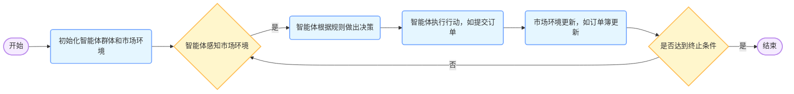

# 智能体群体在模拟市场微观结构中的应用

> 关键词：智能体群体、市场微观结构、模拟、金融市场、多智能体系统

> 摘要：本文深入探讨了智能体群体在模拟市场微观结构中的应用。首先介绍了相关背景，包括研究目的、预期读者、文档结构和术语表。接着阐述了核心概念与联系，给出了原理和架构的文本示意图及 Mermaid 流程图。详细讲解了核心算法原理，用 Python 代码进行了说明，并介绍了相关数学模型和公式。通过项目实战，展示了代码实现和详细解读。分析了实际应用场景，推荐了学习资源、开发工具框架和相关论文著作。最后总结了未来发展趋势与挑战，提供了常见问题解答和扩展阅读参考资料，旨在为研究和应用智能体群体模拟市场微观结构提供全面且深入的指导。

## 1. 背景介绍 
### 1.1 目的和范围
本研究的主要目的是深入探究智能体群体在模拟市场微观结构方面的应用。市场微观结构研究的是金融市场中资产交易的具体过程和机制，包括订单的提交、成交、价格形成等方面。传统的市场研究方法往往基于宏观层面的统计数据和简化的假设，难以准确反映市场中个体参与者的行为和交互对市场整体的影响。而智能体群体模拟为我们提供了一种全新的视角，通过构建具有不同行为特征和决策规则的智能体，模拟它们在市场中的交互和决策过程，从而更深入地理解市场微观结构的形成和演化机制。

本研究的范围涵盖了金融市场的多个领域，包括股票市场、期货市场、外汇市场等。我们将重点关注智能体群体模拟在市场价格形成、流动性提供、交易策略分析等方面的应用，并通过实际案例和实验验证其有效性和实用性。

### 1.2 预期读者
本文预期读者包括金融领域的研究人员、投资者、交易员，以及计算机科学领域对多智能体系统和复杂系统模拟感兴趣的学者和开发者。对于金融研究人员，本文提供了一种新的研究方法和工具，有助于他们深入理解市场微观结构的本质和规律；对于投资者和交易员，通过了解智能体群体模拟的结果，可以更好地制定投资策略和风险管理方案；对于计算机科学领域的读者，本文展示了多智能体系统在金融领域的具体应用，为他们的研究和开发提供了新的思路和方向。

### 1.3 文档结构概述
本文将按照以下结构进行组织：
- 核心概念与联系：介绍智能体群体和市场微观结构的核心概念，以及它们之间的联系，同时给出原理和架构的文本示意图和 Mermaid 流程图。
- 核心算法原理 & 具体操作步骤：详细讲解智能体群体模拟中使用的核心算法原理，并通过 Python 源代码进行具体说明。
- 数学模型和公式 & 详细讲解 & 举例说明：介绍相关的数学模型和公式，对其进行详细讲解，并通过具体例子进行说明。
- 项目实战：代码实际案例和详细解释说明：通过一个实际的项目案例，展示智能体群体模拟在市场微观结构中的应用，包括开发环境搭建、源代码实现和代码解读。
- 实际应用场景：分析智能体群体模拟在金融市场中的实际应用场景，如市场价格预测、交易策略优化等。
- 工具和资源推荐：推荐相关的学习资源、开发工具框架和论文著作，帮助读者进一步深入学习和研究。
- 总结：未来发展趋势与挑战：总结智能体群体在模拟市场微观结构中的应用现状，分析未来的发展趋势和面临的挑战。
- 附录：常见问题与解答：提供常见问题的解答，帮助读者解决在学习和应用过程中遇到的问题。
- 扩展阅读 & 参考资料：列出相关的扩展阅读材料和参考资料，方便读者进一步查阅和研究。

### 1.4 术语表
#### 1.4.1 核心术语定义
- **智能体（Agent）**：具有自主决策能力和行为能力的个体，可以感知环境信息，并根据自身的目标和规则做出决策和行动。在市场模拟中，智能体可以代表投资者、交易员、做市商等市场参与者。
- **智能体群体（Agent Population）**：由多个智能体组成的集合，这些智能体之间可以进行交互和通信，共同影响市场的状态和行为。
- **市场微观结构（Market Microstructure）**：研究金融市场中资产交易的具体过程和机制，包括订单的提交、成交、价格形成等方面，关注市场参与者的行为和交互对市场整体的影响。
- **多智能体系统（Multi - Agent System，MAS）**：由多个智能体组成的系统，智能体之间通过某种通信和协调机制进行交互和合作，以实现共同的目标或完成特定的任务。

#### 1.4.2 相关概念解释
- **订单簿（Order Book）**：记录市场中所有未成交订单的列表，包括买单和卖单的价格和数量信息。订单簿是市场价格形成的重要基础，反映了市场的供需关系。
- **流动性（Liquidity）**：指市场中资产能够以合理价格快速买卖的能力。流动性高的市场意味着投资者可以更容易地买卖资产，交易成本较低；反之，流动性低的市场则可能导致交易困难和较高的交易成本。
- **交易策略（Trading Strategy）**：投资者或交易员根据市场情况和自身目标制定的买卖资产的规则和方法。常见的交易策略包括趋势跟踪策略、均值回归策略、套利策略等。

#### 1.4.3 缩略词列表
- **MAS**：Multi - Agent System，多智能体系统
- **LOB**：Limit Order Book，限价订单簿

## 2. 核心概念与联系 

### 智能体群体的概念
智能体群体是由多个具有自主决策能力的智能体组成的集合。每个智能体都有自己的目标、规则和行为模式，它们可以感知周围的环境信息，并根据这些信息做出决策和行动。智能体之间可以通过某种通信和协调机制进行交互和合作，共同影响整个系统的状态和行为。

在市场模拟中，智能体可以代表不同类型的市场参与者，如投资者、交易员、做市商等。每个智能体都有自己的投资策略、风险偏好和信息处理能力，它们在市场中进行买卖交易，通过与其他智能体的交互影响市场的价格和流动性。

### 市场微观结构的概念
市场微观结构研究的是金融市场中资产交易的具体过程和机制。它关注的是市场参与者的行为和交互如何影响市场的价格形成、流动性提供和交易成本等方面。市场微观结构的主要组成部分包括订单簿、交易机制、市场参与者等。

订单簿是市场微观结构的核心，它记录了市场中所有未成交订单的信息，包括买单和卖单的价格和数量。交易机制规定了订单的匹配和成交规则，不同的交易机制会对市场的价格形成和流动性产生不同的影响。市场参与者包括投资者、交易员、做市商等，他们的行为和决策是市场微观结构形成和演化的关键因素。

### 智能体群体与市场微观结构的联系
智能体群体模拟为研究市场微观结构提供了一种有效的方法。通过构建具有不同行为特征和决策规则的智能体，模拟它们在市场中的交互和决策过程，可以更深入地理解市场微观结构的形成和演化机制。

具体来说，智能体群体可以模拟市场参与者的行为，如订单的提交、撤销和修改等。这些行为会影响订单簿的状态，进而影响市场的价格和流动性。通过分析智能体群体的模拟结果，可以研究不同市场参与者的行为对市场微观结构的影响，以及市场微观结构的变化对市场参与者行为的反馈作用。

### 原理和架构的文本示意图
智能体群体模拟市场微观结构的原理和架构可以用以下文本示意图表示：

- 智能体层：由多个智能体组成，每个智能体具有自己的目标、规则和行为模式。智能体可以感知市场环境信息，如价格、成交量、订单簿等，并根据这些信息做出决策和行动，如提交订单、撤销订单等。
- 市场环境层：包括订单簿、交易机制等，记录市场中所有未成交订单的信息，并根据交易机制对订单进行匹配和成交。市场环境层会根据智能体的行为不断更新状态，如价格的变化、订单簿的更新等。
- 交互层：负责智能体之间以及智能体与市场环境之间的交互和通信。智能体可以通过交互层获取市场环境信息，同时将自己的行为信息传递给市场环境和其他智能体。

### Mermaid 流程图


## 3. 核心算法原理 & 具体操作步骤 

### 核心算法原理
智能体群体模拟市场微观结构的核心算法主要包括智能体决策算法和市场环境更新算法。

#### 智能体决策算法
智能体决策算法是指智能体根据自身的目标、规则和感知到的市场环境信息做出决策的过程。常见的智能体决策算法包括基于规则的决策算法、基于机器学习的决策算法等。

基于规则的决策算法是指智能体根据预先设定的规则做出决策。例如，一个简单的投资者智能体可以根据股票价格的变化制定交易规则：当股票价格上涨超过一定比例时，卖出股票；当股票价格下跌超过一定比例时，买入股票。

基于机器学习的决策算法是指智能体通过学习历史数据和市场环境信息，自动调整自己的决策规则。例如，一个投资者智能体可以使用强化学习算法，通过不断与市场环境进行交互，学习最优的交易策略。

#### 市场环境更新算法
市场环境更新算法是指根据智能体的行为更新市场环境状态的过程。在市场模拟中，市场环境主要包括订单簿和价格。市场环境更新算法需要根据智能体提交的订单信息，更新订单簿的状态，并根据订单匹配规则确定成交价格和成交量，进而更新市场价格。

### 具体操作步骤
下面通过一个简单的 Python 代码示例，详细说明智能体群体模拟市场微观结构的具体操作步骤。

```python
import random

# 定义智能体类
class Agent:
    def __init__(self, id, cash, shares):
        self.id = id
        self.cash = cash
        self.shares = shares

    def make_decision(self, price):
        # 简单的决策规则：随机决定是否买入或卖出
        action = random.choice(['buy', 'sell', 'hold'])
        if action == 'buy':
            if self.cash > price:
                # 买入一股
                self.cash -= price
                self.shares += 1
                return ('buy', 1)
        elif action == 'sell':
            if self.shares > 0:
                # 卖出一股
                self.cash += price
                self.shares -= 1
                return ('sell', 1)
        return ('hold', 0)

# 定义市场环境类
class Market:
    def __init__(self, initial_price):
        self.price = initial_price
        self.buy_orders = []
        self.sell_orders = []

    def update_market(self, agents):
        for agent in agents:
            action, quantity = agent.make_decision(self.price)
            if action == 'buy':
                self.buy_orders.append(quantity)
            elif action == 'sell':
                self.sell_orders.append(quantity)

        # 简单的订单匹配规则：按价格优先、时间优先原则
        while self.buy_orders and self.sell_orders:
            buy_quantity = self.buy_orders.pop(0)
            sell_quantity = self.sell_orders.pop(0)
            trade_quantity = min(buy_quantity, sell_quantity)
            # 更新市场价格
            self.price += 0.1 if buy_quantity > sell_quantity else -0.1

        return self.price

# 初始化智能体群体和市场环境
agents = [Agent(i, 1000, 0) for i in range(10)]
market = Market(100)

# 模拟市场运行
for step in range(100):
    price = market.update_market(agents)
    print(f"Step {step}: Price = {price}")
```

### 代码解释
1. **智能体类（Agent）**：
    - `__init__` 方法：初始化智能体的 ID、现金和持有的股票数量。
    - `make_decision` 方法：根据当前市场价格，使用简单的随机决策规则决定是否买入、卖出或持有股票。如果决定买入且现金足够，则买入一股；如果决定卖出且持有股票，则卖出一股。

2. **市场环境类（Market）**：
    - `__init__` 方法：初始化市场的初始价格、买单列表和卖单列表。
    - `update_market` 方法：遍历所有智能体，调用它们的 `make_decision` 方法，根据决策结果更新订单簿。然后使用简单的订单匹配规则进行订单匹配，更新市场价格。

3. **模拟市场运行**：
    - 初始化智能体群体和市场环境。
    - 进行 100 步的市场模拟，每一步调用市场环境的 `update_market` 方法更新市场价格，并打印当前步骤的市场价格。

## 4. 数学模型和公式 & 详细讲解 & 举例说明 

### 市场价格形成模型
市场价格形成是市场微观结构研究的核心问题之一。在智能体群体模拟中，可以使用不同的数学模型来描述市场价格的形成过程。下面介绍一种简单的基于供需关系的市场价格形成模型。

假设市场中存在 $N$ 个智能体，每个智能体在每个时间步 $t$ 可以提交一个买单或卖单。设 $B_t$ 表示时间步 $t$ 的总买单数量，$S_t$ 表示时间步 $t$ 的总卖单数量。市场价格 $P_t$ 在时间步 $t$ 的更新公式可以表示为：

$$P_{t+1} = P_t + \alpha \times \frac{B_t - S_t}{B_t + S_t}$$

其中，$\alpha$ 是价格调整系数，用于控制价格调整的幅度。

### 详细讲解
这个公式的基本思想是，市场价格的变化取决于供需关系的平衡。当买单数量大于卖单数量时，市场处于供不应求的状态，价格会上涨；当买单数量小于卖单数量时，市场处于供过于求的状态，价格会下跌。价格调整系数 $\alpha$ 控制了价格调整的速度，$\alpha$ 越大，价格调整越快。

### 举例说明
假设初始市场价格 $P_0 = 100$，价格调整系数 $\alpha = 0.1$。在时间步 $t = 1$，总买单数量 $B_1 = 20$，总卖单数量 $S_1 = 10$。则根据上述公式，时间步 $t = 2$ 的市场价格为：

$$P_{2} = P_1 + \alpha \times \frac{B_1 - S_1}{B_1 + S_1} = 100 + 0.1 \times \frac{20 - 10}{20 + 10} = 100 + 0.1 \times \frac{1}{3} \approx 100.033$$

### 订单匹配模型
订单匹配是市场交易的核心环节，它决定了哪些订单可以成交以及成交价格。常见的订单匹配规则包括价格优先、时间优先等。下面介绍一种简单的基于价格优先、时间优先的订单匹配模型。

假设订单簿中存在买单列表 $B$ 和卖单列表 $S$，每个订单包含价格和数量信息。订单匹配的过程可以描述如下：

1. 对买单列表 $B$ 按价格从高到低排序，对卖单列表 $S$ 按价格从低到高排序。
2. 从买单列表的第一个订单和卖单列表的第一个订单开始，比较它们的价格。如果买单价格大于等于卖单价格，则可以成交。成交数量为买单数量和卖单数量的最小值。
3. 更新买单列表和卖单列表，去除已成交的订单或减少订单数量。
4. 重复步骤 2 和 3，直到买单列表或卖单列表为空。

### 数学公式表示
设买单列表 $B = [(P_{b1}, Q_{b1}), (P_{b2}, Q_{b2}), \cdots]$，卖单列表 $S = [(P_{s1}, Q_{s1}), (P_{s2}, Q_{s2}), \cdots]$，其中 $P_{bi}$ 和 $P_{si}$ 分别表示买单和卖单的价格，$Q_{bi}$ 和 $Q_{si}$ 分别表示买单和卖单的数量。

成交条件：$P_{bi} \geq P_{sj}$

成交数量：$Q_{t} = \min(Q_{bi}, Q_{sj})$

更新后的买单数量：$Q_{b i}^{\prime}=Q_{b i}-Q_{t}$

更新后的卖单数量：$Q_{s j}^{\prime}=Q_{s j}-Q_{t}$

### 举例说明
假设买单列表 $B = [(101, 5), (100, 3)]$，卖单列表 $S = [(100, 2), (102, 4)]$。

首先比较买单列表的第一个订单 $(101, 5)$ 和卖单列表的第一个订单 $(100, 2)$，由于 $101 \geq 100$，可以成交。成交数量为 $\min(5, 2) = 2$。

更新后的买单列表为 $[(101, 3), (100, 3)]$，卖单列表为 $[(102, 4)]$。

继续比较买单列表的第一个订单 $(101, 3)$ 和卖单列表的第一个订单 $(102, 4)$，由于 $101 < 102$，不能成交。

此时买单列表的第二个订单 $(100, 3)$ 和卖单列表的第一个订单 $(102, 4)$ 也不能成交，订单匹配过程结束。

## 5. 项目实战：代码实际案例和详细解释说明 

### 5.1  开发环境搭建
本项目使用 Python 语言进行开发，推荐使用 Anaconda 作为 Python 环境管理工具。以下是开发环境搭建的具体步骤：

1. **安装 Anaconda**：从 Anaconda 官方网站（https://www.anaconda.com/products/individual）下载适合自己操作系统的 Anaconda 安装包，并按照安装向导进行安装。

2. **创建虚拟环境**：打开 Anaconda Prompt（Windows）或终端（Linux/Mac），输入以下命令创建一个名为 `market_sim` 的虚拟环境：

```bash
conda create -n market_sim python=3.8
```

3. **激活虚拟环境**：输入以下命令激活虚拟环境：

```bash
conda activate market_sim
```

4. **安装必要的库**：本项目需要使用 `numpy`、`pandas` 等库，输入以下命令进行安装：

```bash
conda install numpy pandas
```

### 5.2  源代码详细实现和代码解读
以下是一个更复杂的智能体群体模拟市场微观结构的 Python 代码示例：

```python
import numpy as np
import pandas as pd

# 定义智能体类
class Agent:
    def __init__(self, id, cash, shares, risk_aversion):
        self.id = id
        self.cash = cash
        self.shares = shares
        self.risk_aversion = risk_aversion

    def make_decision(self, price, historical_prices):
        # 简单的基于均值回归的决策规则
        mean_price = np.mean(historical_prices)
        if price < mean_price * (1 - self.risk_aversion):
            # 价格低于均值一定比例，买入
            quantity = int(self.cash / price)
            if quantity > 0:
                self.cash -= quantity * price
                self.shares += quantity
                return ('buy', quantity)
        elif price > mean_price * (1 + self.risk_aversion):
            # 价格高于均值一定比例，卖出
            quantity = self.shares
            if quantity > 0:
                self.cash += quantity * price
                self.shares -= quantity
                return ('sell', quantity)
        return ('hold', 0)

# 定义市场环境类
class Market:
    def __init__(self, initial_price):
        self.price = initial_price
        self.historical_prices = [initial_price]
        self.buy_orders = []
        self.sell_orders = []

    def update_market(self, agents):
        # 智能体做出决策
        for agent in agents:
            action, quantity = agent.make_decision(self.price, self.historical_prices)
            if action == 'buy':
                self.buy_orders.append((self.price, quantity))
            elif action == 'sell':
                self.sell_orders.append((self.price, quantity))

        # 订单匹配
        self.buy_orders.sort(key=lambda x: x[0], reverse=True)
        self.sell_orders.sort(key=lambda x: x[0])
        while self.buy_orders and self.sell_orders:
            buy_order = self.buy_orders[0]
            sell_order = self.sell_orders[0]
            if buy_order[0] >= sell_order[0]:
                trade_quantity = min(buy_order[1], sell_order[1])
                # 更新订单簿
                if buy_order[1] == trade_quantity:
                    self.buy_orders.pop(0)
                else:
                    self.buy_orders[0] = (buy_order[0], buy_order[1] - trade_quantity)
                if sell_order[1] == trade_quantity:
                    self.sell_orders.pop(0)
                else:
                    self.sell_orders[0] = (sell_order[0], sell_order[1] - trade_quantity)
                # 更新市场价格
                self.price = (buy_order[0] + sell_order[0]) / 2
            else:
                break

        self.historical_prices.append(self.price)
        return self.price

# 初始化智能体群体和市场环境
agents = [Agent(i, 1000, 0, random.uniform(0.1, 0.3)) for i in range(50)]
market = Market(100)

# 模拟市场运行
prices = []
for step in range(200):
    price = market.update_market(agents)
    prices.append(price)

# 绘制价格走势图
import matplotlib.pyplot as plt
plt.plot(prices)
plt.xlabel('Time Step')
plt.ylabel('Price')
plt.title('Market Price Simulation')
plt.show()
```

### 5.3  代码解读与分析
1. **智能体类（Agent）**：
    - `__init__` 方法：初始化智能体的 ID、现金、持有的股票数量和风险厌恶系数。
    - `make_decision` 方法：根据当前市场价格和历史价格，使用基于均值回归的决策规则决定是否买入、卖出或持有股票。如果价格低于历史均值的一定比例，则买入；如果价格高于历史均值的一定比例，则卖出。

2. **市场环境类（Market）**：
    - `__init__` 方法：初始化市场的初始价格、历史价格列表、买单列表和卖单列表。
    - `update_market` 方法：遍历所有智能体，调用它们的 `make_decision` 方法，根据决策结果更新订单簿。然后对买单列表和卖单列表进行排序，按照价格优先、时间优先的原则进行订单匹配，更新市场价格和历史价格列表。

3. **模拟市场运行**：
    - 初始化智能体群体和市场环境。
    - 进行 200 步的市场模拟，每一步调用市场环境的 `update_market` 方法更新市场价格，并将价格记录下来。
    - 使用 `matplotlib` 库绘制市场价格走势图。

通过这个项目实战，我们可以更直观地观察到智能体群体的行为如何影响市场价格的形成和波动。

## 6. 实际应用场景 
### 市场价格预测
智能体群体模拟可以用于市场价格预测。通过构建具有不同行为特征和决策规则的智能体，模拟它们在市场中的交互和决策过程，可以得到市场价格的模拟数据。将这些模拟数据与历史市场数据进行对比和分析，可以发现市场价格的变化规律和趋势，从而对未来市场价格进行预测。

例如，在股票市场中，可以根据不同投资者的投资策略和风险偏好构建智能体，模拟它们在市场中的买卖行为，预测股票价格的走势。这种方法可以考虑到市场参与者的行为和心理因素，比传统的基于统计模型的价格预测方法更具现实意义。

### 交易策略优化
智能体群体模拟还可以用于交易策略优化。通过模拟不同交易策略在市场中的表现，可以评估这些策略的有效性和风险。根据模拟结果，可以对交易策略进行调整和优化，提高交易策略的盈利能力和稳定性。

例如，在期货市场中，可以模拟不同的套利策略、趋势跟踪策略等在市场中的表现，比较它们的收益率和风险指标。根据模拟结果，选择最优的交易策略，并对其参数进行优化，以适应不同的市场环境。

### 市场流动性分析
市场流动性是金融市场的重要指标之一，它影响着投资者的交易成本和市场的稳定性。智能体群体模拟可以用于市场流动性分析。通过模拟市场参与者的行为和交互，可以观察到市场流动性的变化情况，分析不同因素对市场流动性的影响。

例如，在外汇市场中，可以模拟不同做市商的行为，分析它们对市场流动性的提供作用。通过调整做市商的参数和策略，研究如何提高市场的流动性，降低交易成本。

### 风险管理
智能体群体模拟可以帮助金融机构和投资者进行风险管理。通过模拟不同市场情景下的资产价格波动和交易情况，可以评估投资组合的风险水平，制定相应的风险管理策略。

例如，在银行的信贷风险管理中，可以模拟不同信用等级的借款人在不同经济环境下的还款行为，评估信贷资产的违约风险。根据模拟结果，银行可以调整信贷政策，优化信贷资产组合，降低违约风险。

## 7. 工具和资源推荐
### 7.1 学习资源推荐
#### 7.1.1 书籍推荐
- 《金融市场微观结构理论》：本书系统地介绍了金融市场微观结构的基本理论和方法，包括订单簿、交易机制、价格形成等方面的内容，是学习市场微观结构的经典教材。
- 《多智能体系统导论》：本书全面介绍了多智能体系统的基本概念、理论和技术，包括智能体的建模、通信、协调和学习等方面的内容，对于理解智能体群体模拟的原理和方法有很大帮助。
- 《Python 金融数据分析实战》：本书结合 Python 编程语言，介绍了金融数据分析的基本方法和技术，包括数据获取、清洗、分析和可视化等方面的内容，适合初学者学习使用 Python 进行金融数据分析。

#### 7.1.2 在线课程
- Coursera 上的“Financial Markets”课程：由耶鲁大学教授 Robert Shiller 主讲，介绍了金融市场的基本概念、理论和实践，包括股票市场、债券市场、期货市场等方面的内容。
- edX 上的“Artificial Intelligence for Trading”课程：介绍了人工智能在金融交易中的应用，包括机器学习、深度学习等技术在交易策略开发、风险评估等方面的应用。
- Udemy 上的“Python for Finance: Investment Fundamentals & Data Analytics”课程：结合 Python 编程语言，介绍了金融投资的基本概念和数据分析方法，适合初学者学习。

#### 7.1.3 技术博客和网站
- QuantNet：是一个专注于金融量化分析的社区，提供了大量的金融量化分析教程、论文和案例，是金融量化分析爱好者的重要学习资源。
- Towards Data Science：是一个专注于数据科学和机器学习的博客平台，提供了大量的技术文章和教程，包括金融数据分析、人工智能在金融领域的应用等方面的内容。
- GitHub：是一个开源代码托管平台，上面有很多关于智能体群体模拟和金融市场分析的开源项目，可以参考和学习。

### 7.2 开发工具框架推荐
#### 7.2.1 IDE和编辑器
- PyCharm：是一款专门为 Python 开发设计的集成开发环境（IDE），提供了丰富的代码编辑、调试、测试等功能，适合大规模 Python 项目的开发。
- Jupyter Notebook：是一个交互式的编程环境，支持 Python、R 等多种编程语言，适合进行数据分析和可视化。可以方便地编写代码、运行代码、查看结果，并将代码和文档结合在一起。
- Visual Studio Code：是一款轻量级的代码编辑器，支持多种编程语言，具有丰富的插件和扩展功能。可以通过安装 Python 插件来进行 Python 开发，适合快速开发和调试小型项目。

#### 7.2.2 调试和性能分析工具
- pdb：是 Python 内置的调试工具，可以在代码中设置断点，逐步执行代码，查看变量的值和程序的执行流程，帮助调试代码。
- cProfile：是 Python 内置的性能分析工具，可以统计代码中各个函数的执行时间和调用次数，帮助找出代码中的性能瓶颈。
- Py-Spy：是一个第三方的性能分析工具，可以实时监控 Python 程序的性能，可视化展示函数的调用栈和执行时间，方便进行性能优化。

#### 7.2.3 相关框架和库
- Mesa：是一个用于构建多智能体系统的 Python 框架，提供了丰富的智能体建模和模拟工具，包括智能体类、环境类、调度器等。可以方便地构建复杂的智能体群体模拟模型。
- NumPy：是 Python 中用于科学计算的基础库，提供了高效的多维数组对象和各种数学函数，是进行金融数据分析和模拟的重要工具。
- Pandas：是 Python 中用于数据处理和分析的库，提供了高效的数据结构和数据操作方法，如 DataFrame 和 Series 等。可以方便地进行数据清洗、分析和可视化。

### 7.3 相关论文著作推荐
#### 7.3.1 经典论文
- “Market Microstructure and Asset Pricing: On the Compensation for Illiquidity in Stock Returns”：该论文研究了市场微观结构因素对股票收益率的影响，特别是流动性对股票收益率的补偿作用，是市场微观结构领域的经典论文之一。
- “Agent - Based Computational Economics: A Constructive Approach to Economic Theory”：该论文介绍了基于智能体的计算经济学的基本概念和方法，探讨了如何使用智能体群体模拟来研究经济系统的复杂性和演化，是智能体群体模拟在经济学领域应用的重要文献。
- “The Limits of Arbitrage”：该论文分析了套利行为在金融市场中的局限性，指出由于市场摩擦和风险等因素的存在，套利行为并不能完全消除市场的价格偏差，对理解金融市场的有效性和稳定性有重要意义。

#### 7.3.2 最新研究成果
- 近年来，随着人工智能和机器学习技术的发展，越来越多的研究将这些技术应用于智能体群体模拟和市场微观结构研究中。例如，使用深度学习算法训练智能体的决策策略，提高智能体的决策能力和适应性。可以关注相关领域的顶级学术期刊，如《Journal of Financial Economics》、《Review of Financial Studies》等，获取最新的研究成果。

#### 7.3.3 应用案例分析
- 一些金融机构和研究机构会发布关于智能体群体模拟在市场微观结构中的应用案例分析报告。例如，一些投资银行会使用智能体群体模拟来评估不同投资策略的风险和收益，制定投资组合优化方案。可以通过关注这些机构的官方网站和研究报告，了解实际应用案例和经验。

## 8. 总结：未来发展趋势与挑战
### 未来发展趋势
#### 与人工智能技术的深度融合
随着人工智能技术的不断发展，智能体群体模拟将与人工智能技术进行更深度的融合。例如，使用深度学习算法训练智能体的决策策略，使智能体能够更好地适应复杂多变的市场环境。同时，强化学习算法可以用于优化智能体的行为，提高智能体的学习能力和决策效率。

#### 考虑更多的市场因素
未来的智能体群体模拟将考虑更多的市场因素，如宏观经济指标、政策变化、投资者情绪等。这些因素会对市场参与者的行为和市场微观结构产生重要影响，将它们纳入模拟模型中可以更准确地反映市场的实际情况。

#### 跨学科研究的加强
智能体群体模拟涉及计算机科学、经济学、金融学等多个学科领域，未来的研究将加强跨学科的合作和交流。通过整合不同学科的理论和方法，可以开发出更完善的智能体群体模拟模型，为金融市场的研究和决策提供更有力的支持。

#### 实际应用的拓展
智能体群体模拟在金融市场中的应用将不断拓展。除了市场价格预测、交易策略优化、市场流动性分析和风险管理等领域，还可以应用于金融监管、金融创新等方面。例如，监管机构可以使用智能体群体模拟来评估金融政策的效果，预测金融风险的发生。

### 面临的挑战
#### 模型的准确性和可靠性
智能体群体模拟模型的准确性和可靠性是一个重要的挑战。由于市场环境的复杂性和不确定性，很难准确地描述市场参与者的行为和决策规则。同时，模型中的参数估计和校准也存在一定的难度，需要大量的历史数据和经验。

#### 计算资源的需求
智能体群体模拟通常需要大量的计算资源，特别是在模拟大规模市场和复杂智能体行为时。随着模拟规模的增大和模型复杂度的提高，计算时间和内存需求会急剧增加，这对计算资源的要求也越来越高。

#### 数据的获取和处理
智能体群体模拟需要大量的市场数据和投资者行为数据作为输入。然而，这些数据的获取和处理存在一定的困难。一方面，市场数据的质量和完整性可能存在问题；另一方面，投资者行为数据往往难以准确获取，需要通过问卷调查、实验等方式进行收集。

#### 伦理和法律问题
智能体群体模拟的应用可能会涉及到一些伦理和法律问题。例如，智能体的决策可能会对市场产生影响，甚至引发市场操纵等违法行为。因此，需要建立相应的伦理和法律规范，确保智能体群体模拟的合法、合规应用。

## 9. 附录：常见问题与解答
### 1. 智能体群体模拟和传统的市场研究方法有什么区别？
传统的市场研究方法往往基于宏观层面的统计数据和简化的假设，难以准确反映市场中个体参与者的行为和交互对市场整体的影响。而智能体群体模拟通过构建具有不同行为特征和决策规则的智能体，模拟它们在市场中的交互和决策过程，可以更深入地理解市场微观结构的形成和演化机制，考虑到更多的市场因素和个体差异。

### 2. 如何选择合适的智能体决策算法？
选择合适的智能体决策算法需要考虑多个因素，如模拟的目标、市场环境的复杂性、数据的可用性等。如果模拟的目标是简单的市场行为分析，可以使用基于规则的决策算法；如果市场环境复杂，需要智能体具有较强的学习和适应能力，可以使用基于机器学习的决策算法，如强化学习算法。

### 3. 智能体群体模拟的计算资源需求大吗？
智能体群体模拟的计算资源需求通常较大，特别是在模拟大规模市场和复杂智能体行为时。随着模拟规模的增大和模型复杂度的提高，计算时间和内存需求会急剧增加。可以通过优化算法、并行计算等方式来减少计算资源的需求。

### 4. 如何验证智能体群体模拟模型的准确性？
可以通过以下几种方式验证智能体群体模拟模型的准确性：
- 与历史市场数据进行对比：将模拟结果与历史市场数据进行对比，分析模拟结果与实际情况的相似度。
- 进行敏感性分析：改变模型中的参数和假设，观察模拟结果的变化，评估模型的稳定性和可靠性。
- 进行实验验证：设计实验，比较不同模型或策略在实验环境中的表现，验证模型的有效性。

### 5. 智能体群体模拟在实际金融市场中的应用前景如何？
智能体群体模拟在实际金融市场中具有广阔的应用前景。它可以用于市场价格预测、交易策略优化、市场流动性分析、风险管理等多个领域，为金融机构和投资者提供更准确的决策依据。随着技术的不断发展和模型的不断完善，智能体群体模拟将在金融市场中发挥越来越重要的作用。

## 10. 扩展阅读 & 参考资料
### 扩展阅读
- 《复杂经济学：经济思想的新框架》：本书介绍了复杂经济学的基本概念和方法，探讨了经济系统的复杂性和演化规律，与智能体群体模拟有密切的联系。
- 《算法交易与人工智能》：本书介绍了算法交易的基本原理和方法，以及人工智能技术在算法交易中的应用，包括智能体群体模拟在交易策略开发中的应用。
- 《金融科技前沿：技术驱动的金融创新》：本书介绍了金融科技的前沿技术和应用，包括区块链、人工智能、大数据等技术在金融领域的应用，为智能体群体模拟的发展提供了新的思路和方向。

### 参考资料
- Shiller, R. J. (2015). Finance and the Good Society. Princeton University Press.
- Tesfatsion, L., & Judd, K. L. (Eds.). (2006). Handbook of Computational Economics, Volume 2: Agent - Based Computational Economics. North - Holland.
- Campbell, J. Y., Lo, A. W., & MacKinlay, A. C. (1997). The Econometrics of Financial Markets. Princeton University Press.

作者：AI天才研究院/AI Genius Institute & 禅与计算机程序设计艺术 /Zen And The Art of Computer Programming