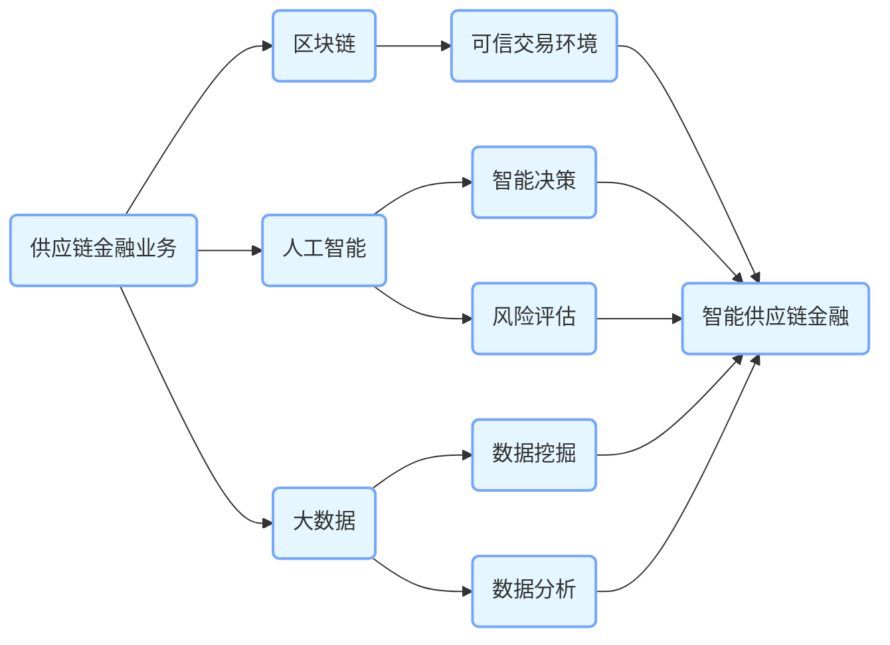

# 智能供应链金融解决方案

> 关键词：智能供应链金融、区块链、人工智能、大数据、金融科技、供应链管理、风险控制

> 摘要：本文聚焦于智能供应链金融解决方案，旨在深入剖析其核心概念、算法原理、数学模型等关键要素。首先介绍了智能供应链金融的背景，包括目的范围、预期读者等内容。接着详细阐述了核心概念与联系，通过文本示意图和 Mermaid 流程图呈现其架构。以 Python 代码讲解了核心算法原理和具体操作步骤，并给出相关数学模型和公式。通过项目实战展示了代码实现与解读。分析了智能供应链金融的实际应用场景，推荐了相关工具和资源。最后总结了其未来发展趋势与挑战，还包含常见问题解答和扩展阅读参考资料，为读者全面了解智能供应链金融解决方案提供深度的技术指导和实践参考。

## 1. 背景介绍 
### 1.1 目的和范围
智能供应链金融解决方案的目的在于解决传统供应链金融中存在的信息不对称、风险难以管控、融资效率低下等问题。通过引入先进的信息技术，如区块链、人工智能、大数据等，实现供应链金融业务的数字化、智能化转型，提高供应链的整体效率和竞争力。

其范围涵盖了供应链中的各个环节，包括供应商、制造商、分销商、零售商以及金融机构等。从原材料采购到产品销售的整个过程，都可以借助智能供应链金融解决方案实现资金的合理配置和高效流转。

### 1.2 预期读者
本文的预期读者包括金融机构从业者，如银行信贷人员、风险管理专家等，他们可以通过本文了解智能供应链金融的技术原理和实践方法，为开展相关业务提供参考；供应链企业管理人员，他们可以借助智能供应链金融解决方案优化企业的资金管理和供应链运作；技术开发者，包括软件开发工程师、数据分析师等，能够从本文中获取技术实现的思路和方法；以及对供应链金融和金融科技感兴趣的研究人员和学者。

### 1.3 文档结构概述
本文首先介绍智能供应链金融的背景知识，让读者对其有初步的了解。接着阐述核心概念与联系，通过示意图和流程图展示其架构。然后讲解核心算法原理和具体操作步骤，用 Python 代码进行详细说明。随后给出数学模型和公式，并举例说明。通过项目实战部分展示代码的实际应用和详细解读。分析实际应用场景，为读者提供实践参考。推荐相关的工具和资源，方便读者进一步学习和研究。最后总结未来发展趋势与挑战，解答常见问题，并提供扩展阅读和参考资料。

### 1.4 术语表
#### 1.4.1 核心术语定义
- **智能供应链金融**：是指将人工智能、区块链、大数据等新兴技术应用于供应链金融业务中，实现供应链金融业务的智能化决策、自动化操作和风险的有效管控。
- **区块链**：是一种分布式账本技术，具有去中心化、不可篡改、可追溯等特点，能够保证供应链金融中交易信息的真实性和安全性。
- **人工智能**：是研究、开发用于模拟、延伸和扩展人的智能的理论、方法、技术及应用系统的一门新的技术科学，在供应链金融中可用于风险评估、信用评级等。
- **大数据**：指无法在一定时间范围内用常规软件工具进行捕捉、管理和处理的数据集合，通过对供应链金融中大量数据的分析，可以挖掘潜在的风险和商机。

#### 1.4.2 相关概念解释
- **供应链金融**：是指金融机构围绕核心企业，管理上下游中小企业的资金流和物流，把单个企业的不可控风险转变为供应链企业整体的可控风险，通过立体获取各类信息，将风险控制在最低的金融服务。
- **金融科技**：是指技术带来的金融创新，它能创造新的业务模式、应用、流程或产品，从而对金融市场、金融机构或金融服务的提供方式造成重大影响。

#### 1.4.3 缩略词列表
- **AI**：Artificial Intelligence，人工智能
- **BC**：Blockchain，区块链
- **BD**：Big Data，大数据
- **SCF**：Supply Chain Finance，供应链金融
- **Fintech**：Financial Technology，金融科技

## 2. 核心概念与联系 
智能供应链金融是多个技术和业务概念的融合，其核心概念包括区块链、人工智能、大数据以及供应链金融本身。下面通过文本示意图和 Mermaid 流程图来展示它们之间的联系。

### 文本示意图
智能供应链金融以供应链金融业务为基础，区块链技术为其提供可信的交易环境和数据存储，保证交易信息的真实性和不可篡改。人工智能则用于对供应链中的各种数据进行分析和处理，实现智能决策和风险评估。大数据为整个系统提供丰富的数据资源，通过对海量数据的挖掘和分析，为区块链和人工智能提供支持。这三个技术相互协作，共同构成了智能供应链金融的核心架构。

### Mermaid 流程图

从流程图中可以看出，供应链金融业务是整个系统的基础，区块链、人工智能和大数据为其提供技术支持。区块链保证了交易的可信性，人工智能实现了智能决策和风险评估，大数据则通过挖掘和分析为整个系统提供数据支持。这些技术相互作用，最终实现智能供应链金融。

## 3. 核心算法原理 & 具体操作步骤 
### 核心算法原理
在智能供应链金融中，风险评估是一个重要的环节。这里我们以基于逻辑回归的风险评估算法为例进行讲解。逻辑回归是一种广泛应用于分类问题的算法，通过对输入特征进行线性组合，然后通过逻辑函数将其转换为概率值，从而判断样本属于某个类别的可能性。

逻辑回归的基本原理可以用以下公式表示：
$$z = \theta_0 + \theta_1x_1 + \theta_2x_2 + \cdots + \theta_nx_n$$
其中，$z$ 是线性组合的结果，$\theta_i$ 是模型的参数，$x_i$ 是输入特征。

然后通过逻辑函数将 $z$ 转换为概率值：
$$h_{\theta}(x) = \frac{1}{1 + e^{-z}}$$
$h_{\theta}(x)$ 表示样本属于正类的概率。

### 具体操作步骤
以下是使用 Python 实现基于逻辑回归的风险评估算法的具体步骤和代码：

```python
import numpy as np
from sklearn.linear_model import LogisticRegression
from sklearn.model_selection import train_test_split
from sklearn.metrics import accuracy_score

# 生成示例数据
# 假设我们有 100 个样本，每个样本有 5 个特征
X = np.random.randn(100, 5)
# 生成对应的标签，0 表示低风险，1 表示高风险
y = np.random.randint(0, 2, 100)

# 划分训练集和测试集
X_train, X_test, y_train, y_test = train_test_split(X, y, test_size=0.2, random_state=42)

# 创建逻辑回归模型
model = LogisticRegression()

# 训练模型
model.fit(X_train, y_train)

# 进行预测
y_pred = model.predict(X_test)

# 计算准确率
accuracy = accuracy_score(y_test, y_pred)
print(f"模型准确率: {accuracy}")
```

### 代码解释
1. **数据生成**：使用 `np.random.randn` 生成 100 个样本，每个样本有 5 个特征。使用 `np.random.randint` 生成对应的标签，0 表示低风险，1 表示高风险。
2. **数据划分**：使用 `train_test_split` 函数将数据划分为训练集和测试集，测试集占比 20%。
3. **模型创建**：创建一个逻辑回归模型。
4. **模型训练**：使用训练集数据对模型进行训练。
5. **模型预测**：使用训练好的模型对测试集数据进行预测。
6. **准确率计算**：使用 `accuracy_score` 函数计算模型的准确率。

## 4. 数学模型和公式 & 详细讲解 & 举例说明 
### 数学模型和公式
在智能供应链金融中，除了逻辑回归模型，还会用到其他的数学模型和公式。例如，在信用评级中，可以使用层次分析法（AHP）来确定各个评价指标的权重。

层次分析法的基本步骤如下：
1. **建立层次结构模型**：将问题分解为不同的层次，包括目标层、准则层和方案层。
2. **构造判断矩阵**：对同一层次的元素进行两两比较，确定它们的相对重要性，构造判断矩阵。
3. **计算权重向量**：通过求解判断矩阵的特征值和特征向量，得到各个元素的权重。
4. **一致性检验**：检验判断矩阵的一致性，确保权重的合理性。

判断矩阵 $A=(a_{ij})_{n\times n}$ 满足 $a_{ij}>0$，$a_{ji}=\frac{1}{a_{ij}}$，$a_{ii}=1$。

权重向量 $W=(w_1, w_2, \cdots, w_n)^T$ 满足：
$$AW = \lambda_{max}W$$
其中，$\lambda_{max}$ 是判断矩阵 $A$ 的最大特征值。

一致性指标 $CI$ 定义为：
$$CI = \frac{\lambda_{max} - n}{n - 1}$$
随机一致性指标 $RI$ 可以通过查表得到，不同阶数的判断矩阵有对应的 $RI$ 值。

一致性比率 $CR$ 定义为：
$$CR = \frac{CI}{RI}$$
当 $CR<0.1$ 时，认为判断矩阵具有满意的一致性。

### 详细讲解
层次分析法通过将复杂的问题分解为多个层次和元素，然后对元素进行两两比较，确定它们的相对重要性。判断矩阵反映了决策者对各个元素相对重要性的主观判断。通过求解判断矩阵的特征值和特征向量，可以得到各个元素的权重。一致性检验是为了确保判断矩阵的合理性，避免决策者的判断出现矛盾。

### 举例说明
假设我们要对供应链中的供应商进行信用评级，考虑的评价指标有产品质量、交货期、价格和服务水平。我们可以建立如下的层次结构模型：
- **目标层**：供应商信用评级
- **准则层**：产品质量、交货期、价格、服务水平
- **方案层**：各个供应商

构造判断矩阵如下：
$$A = \begin{bmatrix}
1 & 3 & 5 & 2 \\
\frac{1}{3} & 1 & 3 & \frac{1}{2} \\
\frac{1}{5} & \frac{1}{3} & 1 & \frac{1}{4} \\
\frac{1}{2} & 2 & 4 & 1
\end{bmatrix}$$

使用 Python 计算权重向量和一致性比率：

```python
import numpy as np

# 判断矩阵
A = np.array([[1, 3, 5, 2],
              [1/3, 1, 3, 1/2],
              [1/5, 1/3, 1, 1/4],
              [1/2, 2, 4, 1]])

# 计算特征值和特征向量
eigenvalues, eigenvectors = np.linalg.eig(A)

# 最大特征值
lambda_max = np.max(eigenvalues)

# 对应的特征向量
max_eigenvector = eigenvectors[:, np.argmax(eigenvalues)]

# 归一化权重向量
weights = max_eigenvector / np.sum(max_eigenvector)

# 阶数
n = A.shape[0]

# 一致性指标
CI = (lambda_max - n) / (n - 1)

# 随机一致性指标（4 阶判断矩阵）
RI = 0.9

# 一致性比率
CR = CI / RI

print(f"权重向量: {weights.real}")
print(f"一致性比率: {CR.real}")
```

在这个例子中，我们通过层次分析法计算了各个评价指标的权重，并进行了一致性检验。如果一致性比率 $CR<0.1$，则认为判断矩阵具有满意的一致性，权重是合理的。

## 5. 项目实战：代码实际案例和详细解释说明 
### 5.1  开发环境搭建
为了实现智能供应链金融的项目实战，我们需要搭建相应的开发环境。以下是具体的步骤：

#### 安装 Python
Python 是我们进行开发的主要编程语言，建议安装 Python 3.7 及以上版本。可以从 Python 官方网站（https://www.python.org/downloads/） 下载并安装。

#### 安装必要的库
我们需要安装一些必要的 Python 库，如 `numpy`、`pandas`、`scikit-learn`、`tensorflow` 等。可以使用 `pip` 命令进行安装：
```sh
pip install numpy pandas scikit-learn tensorflow
```

#### 数据库环境
如果需要存储和管理供应链金融的数据，可以选择合适的数据库，如 MySQL、MongoDB 等。安装并配置好数据库环境。

### 5.2  源代码详细实现和代码解读
以下是一个简单的智能供应链金融风险评估系统的代码实现：

```python
import numpy as np
import pandas as pd
from sklearn.model_selection import train_test_split
from sklearn.linear_model import LogisticRegression
from sklearn.metrics import accuracy_score

# 加载数据
data = pd.read_csv('supply_chain_data.csv')

# 提取特征和标签
X = data.drop('risk_label', axis=1).values
y = data['risk_label'].values

# 划分训练集和测试集
X_train, X_test, y_train, y_test = train_test_split(X, y, test_size=0.2, random_state=42)

# 创建逻辑回归模型
model = LogisticRegression()

# 训练模型
model.fit(X_train, y_train)

# 进行预测
y_pred = model.predict(X_test)

# 计算准确率
accuracy = accuracy_score(y_test, y_pred)
print(f"模型准确率: {accuracy}")
```

### 代码解读与分析
1. **数据加载**：使用 `pandas` 库的 `read_csv` 函数加载供应链金融数据，数据文件名为 `supply_chain_data.csv`。
2. **特征和标签提取**：使用 `drop` 方法提取特征，将 `risk_label` 列作为标签。
3. **数据划分**：使用 `train_test_split` 函数将数据划分为训练集和测试集，测试集占比 20%。
4. **模型创建**：创建一个逻辑回归模型。
5. **模型训练**：使用训练集数据对模型进行训练。
6. **模型预测**：使用训练好的模型对测试集数据进行预测。
7. **准确率计算**：使用 `accuracy_score` 函数计算模型的准确率。

在实际应用中，我们可以根据具体的需求对模型进行优化，如调整模型参数、使用更复杂的算法等。

## 6. 实际应用场景 
智能供应链金融解决方案在多个实际应用场景中都具有重要的价值：

### 供应商融资
供应商在向核心企业供货后，可能面临资金周转困难的问题。通过智能供应链金融解决方案，供应商可以将应收账款进行融资。金融机构可以借助区块链技术核实交易的真实性，通过人工智能和大数据分析供应商的信用状况和还款能力，从而快速、准确地为供应商提供融资服务。

### 经销商库存融资
经销商为了满足市场需求，需要保持一定的库存水平，这可能占用大量的资金。智能供应链金融解决方案可以帮助经销商以库存作为抵押物进行融资。金融机构可以通过物联网技术实时监控库存的状态和数量，通过数据分析评估库存的价值和风险，为经销商提供合理的融资额度。

### 核心企业产业链协同
核心企业可以通过智能供应链金融解决方案优化整个产业链的资金流。通过与金融机构合作，为上下游企业提供融资支持，提高产业链的整体竞争力。同时，核心企业可以借助大数据分析了解上下游企业的经营状况和需求，实现产业链的协同发展。

### 跨境供应链金融
在跨境贸易中，供应链金融面临着更多的挑战，如信息不对称、汇率风险等。智能供应链金融解决方案可以通过区块链技术实现跨境交易信息的共享和可信传递，通过人工智能和大数据分析汇率风险和信用风险，为跨境供应链金融提供有效的支持。

## 7. 工具和资源推荐
### 7.1 学习资源推荐
#### 7.1.1 书籍推荐
- 《供应链金融：新经济下的金融创新》：全面介绍了供应链金融的理论和实践，包括供应链金融的模式、风险控制、案例分析等内容。
- 《区块链：技术驱动金融》：深入讲解了区块链的技术原理和应用场景，对于理解智能供应链金融中区块链的应用有很大的帮助。
- 《Python 数据分析实战》：介绍了 Python 在数据分析领域的应用，包括数据处理、数据分析、数据可视化等内容，对于智能供应链金融中的数据处理和分析非常有用。

#### 7.1.2 在线课程
- Coursera 上的“供应链管理”课程：由知名大学的教授授课，系统地介绍了供应链管理的理论和方法。
- edX 上的“区块链技术与应用”课程：深入讲解了区块链的技术原理和应用场景，包括区块链在供应链金融中的应用。
- 网易云课堂上的“Python 数据分析从入门到精通”课程：适合初学者