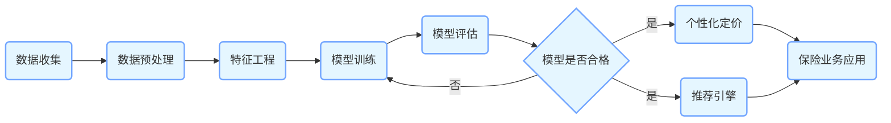

# 智能保险产品个性化定价与推荐引擎

> 关键词：智能保险、个性化定价、推荐引擎、大数据分析、机器学习

> 摘要：本文聚焦于智能保险产品的个性化定价与推荐引擎。随着保险行业的数字化转型，传统的定价和推荐方式已难以满足客户多样化的需求。通过利用大数据分析和机器学习等先进技术，构建智能的个性化定价与推荐引擎，能够为客户提供更精准的保险产品定价和更贴合其需求的推荐。文章详细介绍了相关核心概念、算法原理、数学模型，并通过项目实战展示了具体实现过程，探讨了实际应用场景，推荐了学习和开发所需的工具与资源，最后对未来发展趋势与挑战进行了总结。

## 1. 背景介绍 
### 1.1 目的和范围
本文章旨在深入探讨智能保险产品个性化定价与推荐引擎的相关技术和应用。随着保险市场的竞争日益激烈，客户对于保险产品的个性化需求不断增加。传统的保险定价和推荐方式往往基于一些通用的规则和统计数据，无法充分考虑每个客户的独特情况。因此，开发智能的个性化定价与推荐引擎具有重要的现实意义。本文将涵盖从核心概念的介绍到具体算法实现，再到实际应用案例的分析，以及相关工具和资源的推荐等方面，为读者全面呈现智能保险产品个性化定价与推荐引擎的全貌。

### 1.2 预期读者
本文预期读者包括保险行业的从业者，如保险产品经理、精算师、市场营销人员等，他们可以从本文中了解到如何利用先进技术提升保险产品的定价和推荐效率；计算机科学领域的研究人员和开发者，他们可以关注到机器学习、大数据分析等技术在保险行业的具体应用；以及对保险科技感兴趣的普通读者，他们可以通过本文了解保险行业的数字化转型趋势。

### 1.3 文档结构概述
本文将按照以下结构进行组织：首先介绍核心概念与联系，包括智能保险、个性化定价和推荐引擎的原理和架构；接着阐述核心算法原理和具体操作步骤，并使用Python代码进行详细说明；然后讲解相关的数学模型和公式，并通过举例进行说明；再通过项目实战展示代码的实际应用和详细解释；之后探讨智能保险产品个性化定价与推荐引擎的实际应用场景；推荐相关的学习和开发工具与资源；最后对未来发展趋势与挑战进行总结，并提供常见问题解答和扩展阅读参考资料。

### 1.4 术语表
#### 1.4.1 核心术语定义
- **智能保险**：利用先进的信息技术，如大数据、人工智能、物联网等，对保险业务进行全面的数字化改造，实现保险产品的精准定价、智能销售和高效理赔等功能。
- **个性化定价**：根据每个客户的具体特征和风险状况，为其量身定制保险产品的价格，而不是采用统一的定价策略。
- **推荐引擎**：一种基于数据分析和机器学习技术的系统，能够根据用户的历史行为、偏好和特征，为用户推荐符合其需求的产品或服务。
- **大数据分析**：对海量的数据进行收集、存储、处理和分析，以发现数据中的规律和价值，为决策提供支持。
- **机器学习**：让计算机通过数据学习模式和规律，从而自动进行预测和决策的技术。

#### 1.4.2 相关概念解释
- **风险评估**：对保险标的面临的各种风险进行识别、分析和评估，确定风险的大小和可能性，为保险定价提供依据。
- **特征工程**：从原始数据中提取和选择有价值的特征，以提高机器学习模型的性能。
- **模型训练**：使用历史数据对机器学习模型进行训练，使其学习到数据中的规律和模式。
- **模型评估**：使用测试数据对训练好的机器学习模型进行评估，衡量模型的性能和准确性。

#### 1.4.3 缩略词列表
- **AI**：人工智能（Artificial Intelligence）
- **ML**：机器学习（Machine Learning）
- **BI**：商业智能（Business Intelligence）
- **API**：应用程序编程接口（Application Programming Interface）

## 2. 核心概念与联系 

### 核心概念原理
#### 智能保险
智能保险是保险行业与信息技术深度融合的产物。它通过利用大数据、人工智能、物联网等技术，实现保险业务的数字化、智能化和自动化。例如，通过物联网设备收集保险标的的实时数据，如车辆的行驶数据、房屋的环境数据等，为风险评估和定价提供更准确的依据；利用人工智能技术对客户的需求进行分析和预测，为客户提供个性化的保险产品推荐。

#### 个性化定价
个性化定价的核心原理是根据每个客户的独特风险状况和特征，为其制定个性化的保险价格。传统的保险定价方式往往基于一些通用的风险因素，如年龄、性别、职业等，而个性化定价则可以考虑更多的因素，如客户的健康状况、驾驶习惯、消费行为等。通过对这些因素进行分析和评估，可以更准确地预测客户的风险概率，从而为其提供更合理的保险价格。

#### 推荐引擎
推荐引擎的工作原理是基于用户的历史行为、偏好和特征，使用机器学习算法对用户的需求进行建模和预测，从而为用户推荐符合其需求的保险产品。推荐引擎可以分为基于内容的推荐、基于协同过滤的推荐和基于深度学习的推荐等不同类型。基于内容的推荐是根据保险产品的特征和用户的偏好进行匹配；基于协同过滤的推荐是根据用户之间的相似性进行推荐；基于深度学习的推荐则是使用深度神经网络对用户的需求进行建模和预测。

### 架构的文本示意图
智能保险产品个性化定价与推荐引擎的架构主要包括数据层、处理层和应用层。

#### 数据层
数据层主要负责收集和存储与保险业务相关的数据，包括客户信息、保险产品信息、市场数据、风险数据等。这些数据可以来自多个渠道，如保险公司的业务系统、第三方数据提供商、物联网设备等。

#### 处理层
处理层是整个架构的核心，主要负责对数据进行清洗、转换、分析和建模。处理层包括数据预处理模块、特征工程模块、机器学习模型训练模块和模型评估模块等。数据预处理模块负责对原始数据进行清洗和转换，去除噪声和缺失值；特征工程模块负责从原始数据中提取和选择有价值的特征；机器学习模型训练模块使用历史数据对模型进行训练；模型评估模块使用测试数据对训练好的模型进行评估。

#### 应用层
应用层主要负责将处理层的结果应用到实际的保险业务中，包括个性化定价模块和推荐引擎模块。个性化定价模块根据客户的特征和风险状况，为其计算个性化的保险价格；推荐引擎模块根据用户的历史行为、偏好和特征，为其推荐符合其需求的保险产品。

### Mermaid 流程图


## 3. 核心算法原理 & 具体操作步骤 

### 核心算法原理
在智能保险产品个性化定价与推荐引擎中，常用的算法包括线性回归、逻辑回归、决策树、随机森林、支持向量机和深度学习等。

#### 线性回归
线性回归是一种用于预测连续数值的算法，它的基本原理是通过拟合一条直线来描述自变量和因变量之间的线性关系。在保险个性化定价中，可以使用线性回归来预测保险理赔金额与客户特征之间的关系。

#### 逻辑回归
逻辑回归是一种用于分类的算法，它的基本原理是通过对输入特征进行线性组合，然后使用逻辑函数将线性组合的结果映射到一个概率值上。在保险风险评估中，可以使用逻辑回归来预测客户发生保险事故的概率。

#### 决策树
决策树是一种基于树结构进行决策的算法，它的基本原理是通过对输入特征进行划分，构建一个决策树模型，每个内部节点表示一个特征上的测试，每个分支表示一个测试输出，每个叶节点表示一个类别或值。在保险产品推荐中，可以使用决策树来根据客户的特征和偏好进行分类和推荐。

#### 随机森林
随机森林是一种集成学习算法，它的基本原理是通过构建多个决策树模型，然后将这些决策树的结果进行综合，得到最终的预测结果。随机森林可以有效地减少过拟合问题，提高模型的准确性和稳定性。

#### 支持向量机
支持向量机是一种用于分类和回归的算法，它的基本原理是通过寻找一个最优的超平面，将不同类别的数据分开。在保险风险评估中，可以使用支持向量机来对客户进行分类，判断其是否属于高风险客户。

#### 深度学习
深度学习是一种基于神经网络的机器学习技术，它的基本原理是通过构建多层神经网络，自动学习数据中的复杂模式和特征。在保险个性化定价和推荐中，可以使用深度学习来处理大规模的复杂数据，提高模型的性能和准确性。

### 具体操作步骤
#### 数据收集
收集与保险业务相关的数据，包括客户信息、保险产品信息、市场数据、风险数据等。数据可以来自多个渠道，如保险公司的业务系统、第三方数据提供商、物联网设备等。

#### 数据预处理
对收集到的原始数据进行清洗和转换，去除噪声和缺失值。可以使用数据清洗工具和技术，如数据筛选、数据填充、数据标准化等。

#### 特征工程
从原始数据中提取和选择有价值的特征，以提高机器学习模型的性能。可以使用特征选择算法和技术，如相关性分析、卡方检验、主成分分析等。

#### 模型训练
使用历史数据对机器学习模型进行训练，使其学习到数据中的规律和模式。可以使用不同的机器学习算法，如线性回归、逻辑回归、决策树、随机森林、支持向量机和深度学习等。

#### 模型评估
使用测试数据对训练好的机器学习模型进行评估，衡量模型的性能和准确性。可以使用评估指标，如均方误差、准确率、召回率、F1值等。

#### 模型优化
根据模型评估的结果，对模型进行优化和调整，提高模型的性能和准确性。可以使用模型调优算法和技术，如网格搜索、随机搜索、贝叶斯优化等。

#### 应用部署
将训练好的模型部署到实际的保险业务中，实现个性化定价和推荐功能。可以使用应用程序编程接口（API）将模型集成到保险公司的业务系统中。

### Python源代码示例
```python
import pandas as pd
from sklearn.model_selection import train_test_split
from sklearn.linear_model import LinearRegression
from sklearn.metrics import mean_squared_error

# 数据收集和预处理
data = pd.read_csv('insurance_data.csv')
X = data.drop('claim_amount', axis=1)
y = data['claim_amount']

# 划分训练集和测试集
X_train, X_test, y_train, y_test = train_test_split(X, y, test_size=0.2, random_state=42)

# 模型训练
model = LinearRegression()
model.fit(X_train, y_train)

# 模型预测
y_pred = model.predict(X_test)

# 模型评估
mse = mean_squared_error(y_test, y_pred)
print(f"均方误差: {mse}")
```

## 4. 数学模型和公式 & 详细讲解 & 举例说明 

### 线性回归
#### 数学模型和公式
线性回归的数学模型可以表示为：
$$y = \beta_0 + \beta_1x_1 + \beta_2x_2 + \cdots + \beta_nx_n + \epsilon$$
其中，$y$ 是因变量，$x_1, x_2, \cdots, x_n$ 是自变量，$\beta_0, \beta_1, \beta_2, \cdots, \beta_n$ 是回归系数，$\epsilon$ 是误差项。

线性回归的目标是通过最小化误差项的平方和来估计回归系数，即：
$$\min_{\beta_0, \beta_1, \cdots, \beta_n} \sum_{i=1}^{m} (y_i - (\beta_0 + \beta_1x_{i1} + \beta_2x_{i2} + \cdots + \beta_nx_{in}))^2$$
其中，$m$ 是样本数量，$y_i$ 是第 $i$ 个样本的因变量值，$x_{i1}, x_{i2}, \cdots, x_{in}$ 是第 $i$ 个样本的自变量值。

#### 详细讲解
线性回归通过拟合一条直线来描述自变量和因变量之间的线性关系。回归系数 $\beta_0, \beta_1, \cdots, \beta_n$ 表示自变量对因变量的影响程度。误差项 $\epsilon$ 表示模型无法解释的随机误差。

#### 举例说明
假设我们要预测保险理赔金额 $y$ 与客户年龄 $x_1$ 和驾驶里程数 $x_2$ 之间的关系。我们收集了一些历史数据，使用线性回归模型进行训练，得到回归系数 $\beta_0 = 100$，$\beta_1 = 5$，$\beta_2 = 0.1$。那么，对于一个年龄为 30 岁，驾驶里程数为 10000 公里的客户，我们可以预测其保险理赔金额为：
$$y = 100 + 5 \times 30 + 0.1 \times 10000 = 1250$$

### 逻辑回归
#### 数学模型和公式
逻辑回归的数学模型可以表示为：
$$P(y = 1|x) = \frac{1}{1 + e^{-(\beta_0 + \beta_1x_1 + \beta_2x_2 + \cdots + \beta_nx_n)}}$$
其中，$P(y = 1|x)$ 是给定自变量 $x$ 时，因变量 $y$ 等于 1 的概率，$x_1, x_2, \cdots, x_n$ 是自变量，$\beta_0, \beta_1, \beta_2, \cdots, \beta_n$ 是回归系数。

逻辑回归的目标是通过最大化似然函数来估计回归系数，即：
$$\max_{\beta_0, \beta_1, \cdots, \beta_n} \prod_{i=1}^{m} P(y_i|x_i)^{y_i} (1 - P(y_i|x_i))^{1 - y_i}$$
其中，$m$ 是样本数量，$y_i$ 是第 $i$ 个样本的因变量值，$x_i$ 是第 $i$ 个样本的自变量值。

#### 详细讲解
逻辑回归通过使用逻辑函数将线性组合的结果映射到一个概率值上，用于分类问题。回归系数 $\beta_0, \beta_1, \cdots, \beta_n$ 表示自变量对因变量的影响程度。似然函数表示模型对训练数据的拟合程度，最大化似然函数可以得到最优的回归系数。

#### 举例说明
假设我们要预测客户是否会发生保险事故 $y$（$y = 1$ 表示发生，$y = 0$ 表示不发生）与客户年龄 $x_1$ 和驾驶经验 $x_2$ 之间的关系。我们收集了一些历史数据，使用逻辑回归模型进行训练，得到回归系数 $\beta_0 = -2$，$\beta_1 = 0.1$，$\beta_2 = 0.2$。对于一个年龄为 30 岁，驾驶经验为 5 年的客户，我们可以计算其发生保险事故的概率为：
$$P(y = 1|x) = \frac{1}{1 + e^{-(-2 + 0.1 \times 30 + 0.2 \times 5)}} \approx 0.73$$

### 决策树
#### 数学模型和公式
决策树的数学模型可以表示为一个树结构，每个内部节点表示一个特征上的测试，每个分支表示一个测试输出，每个叶节点表示一个类别或值。决策树的构建过程可以使用信息增益、基尼不纯度等指标来选择最优的特征进行划分。

信息增益的计算公式为：
$$IG(S, A) = H(S) - \sum_{v \in Values(A)} \frac{|S_v|}{|S|} H(S_v)$$
其中，$IG(S, A)$ 是特征 $A$ 对数据集 $S$ 的信息增益，$H(S)$ 是数据集 $S$ 的熵，$S_v$ 是数据集 $S$ 中特征 $A$ 取值为 $v$ 的子集，$|S|$ 和 $|S_v|$ 分别是数据集 $S$ 和子集 $S_v$ 的样本数量。

#### 详细讲解
决策树通过对输入特征进行划分，构建一个决策树模型，用于分类和回归问题。信息增益表示使用某个特征进行划分后，数据集的不确定性减少的程度。选择信息增益最大的特征进行划分，可以得到最优的决策树。

#### 举例说明
假设我们要根据客户的年龄、性别和收入来推荐保险产品。我们收集了一些历史数据，使用决策树算法进行训练。在构建决策树的过程中，我们首先计算每个特征的信息增益，选择信息增益最大的特征进行划分。假设年龄的信息增益最大，我们将数据集按照年龄进行划分，得到不同的子集，然后在每个子集中继续选择最优的特征进行划分，直到满足停止条件。

## 5. 项目实战：代码实际案例和详细解释说明 

### 5.1  开发环境搭建
#### 安装Python
首先，需要安装Python编程语言。可以从Python官方网站（https://www.python.org/downloads/）下载适合自己操作系统的Python安装包，并按照安装向导进行安装。

#### 安装必要的库
在智能保险产品个性化定价与推荐引擎的开发中，需要使用一些Python库，如Pandas、Scikit-learn、TensorFlow等。可以使用pip命令来安装这些库：
```sh
pip install pandas scikit-learn tensorflow
```

#### 数据准备
准备与保险业务相关的数据，包括客户信息、保险产品信息、市场数据、风险数据等。数据可以存储在CSV文件、数据库等中。

### 5.2  源代码详细实现和代码解读
```python
import pandas as pd
from sklearn.model_selection import train_test_split
from sklearn.ensemble import RandomForestRegressor
from sklearn.metrics import mean_squared_error

# 数据加载
data = pd.read_csv('insurance_data.csv')

# 特征选择和目标变量定义
X = data.drop('claim_amount', axis=1)
y = data['claim_amount']

# 划分训练集和测试集
X_train, X_test, y_train, y_test = train_test_split(X, y, test_size=0.2, random_state=42)

# 模型初始化
model = RandomForestRegressor(n_estimators=100, random_state=42)

# 模型训练
model.fit(X_train, y_train)

# 模型预测
y_pred = model.predict(X_test)

# 模型评估
mse = mean_squared_error(y_test, y_pred)
print(f"均方误差: {mse}")
```

#### 代码解读
1. **数据加载**：使用Pandas库的`read_csv`函数加载存储在CSV文件中的保险数据。
2. **特征选择和目标变量定义**：从数据集中选择除了`claim_amount`（保险理赔金额）之外的所有列作为特征，将`claim_amount`列作为目标变量。
3. **划分训练集和测试集**：使用`train_test_split`函数将数据集划分为训练集和测试集，其中测试集占总数据集的20%。
4. **模型初始化**：使用`RandomForestRegressor`类初始化一个随机森林回归模型，设置树的数量为100。
5. **模型训练**：使用训练集数据对随机森林回归模型进行训练。
6. **模型预测**：使用训练好的模型对测试集数据进行预测。
7. **模型评估**：使用`mean_squared_error`函数计算预测结果与真实结果之间的均方误差，评估模型的性能。

### 5.3  代码解读与分析
#### 随机森林回归模型
随机森林回归模型是一种集成学习模型，它通过构建多个决策树模型，然后将这些决策树的结果进行综合，得到最终的预测结果。随机森林回归模型具有较高的准确性和稳定性，能够有效地处理高维数据和非线性关系。

#### 均方误差评估指标
均方误差（Mean Squared Error，MSE）是一种常用的回归模型评估指标，它表示预测结果与真实结果之间的平均平方误差。均方误差越小，说明模型的预测结果越接近真实结果，模型的性能越好。

## 6. 实际应用场景 
### 保险产品个性化定价
保险公司可以根据客户的年龄、性别、职业、健康状况、驾驶习惯等特征，使用智能保险产品个性化定价与推荐引擎为客户提供个性化的保险价格。例如，对于年轻、驾驶经验不足的客户，保险公司可以根据其驾驶里程数、事故记录等数据，为其制定较高的车险价格；对于健康状况较好的客户，保险公司可以为其提供较低的健康险价格。

### 保险产品推荐
保险公司可以根据客户的历史购买记录、浏览行为、风险偏好等特征，使用智能保险产品个性化定价与推荐引擎为客户推荐符合其需求的保险产品。例如，对于有家庭的客户，保险公司可以推荐家庭财产险、人寿险等产品；对于经常出差的客户，保险公司可以推荐旅行意外险、交通意外险等产品。

### 风险评估和管理
保险公司可以使用智能保险产品个性化定价与推荐引擎对保险标的的风险进行评估和管理。例如，通过分析客户的健康数据、车辆行驶数据等，预测客户发生保险事故的概率，及时采取风险防范措施，降低保险公司的赔付风险。

### 市场营销和客户服务
保险公司可以使用智能保险产品个性化定价与推荐引擎进行市场营销和客户服务。例如，根据客户的特征和需求，为客户提供个性化的营销方案和服务，提高客户的满意度和忠诚度。

## 7. 工具和资源推荐
### 7.1 学习资源推荐
#### 7.1.1 书籍推荐
- 《Python机器学习》：本书详细介绍了Python在机器学习领域的应用，包括数据预处理、模型训练、模型评估等方面的内容。
- 《深度学习》：本书是深度学习领域的经典著作，介绍了深度学习的基本原理、算法和应用。
- 《保险精算学》：本书介绍了保险精算的基本原理和方法，包括风险评估、保险定价、理赔计算等方面的内容。

#### 7.1.2 在线课程
- Coursera上的“机器学习”课程：由斯坦福大学教授Andrew Ng主讲，是机器学习领域的经典课程。
- edX上的“深度学习”课程：由深度学习领域的知名学者授课，介绍了深度学习的最新进展和应用。
- 中国大学MOOC上的“保险学原理”课程：介绍了保险学的基本原理和知识，适合初学者学习。

#### 7.1.3 技术博客和网站
- Kaggle：是一个数据科学竞赛平台，上面有很多关于机器学习和数据分析的案例和教程。
- Medium：是一个技术博客平台，上面有很多关于人工智能、机器学习、保险科技等方面的文章。
- 保险科技网：是一个专注于保险科技领域的网站，提供保险科技的最新动态、技术应用和行业分析等内容。

### 7.2 开发工具框架推荐
#### 7.2.1 IDE和编辑器
- PyCharm：是一款专门为Python开发设计的集成开发环境，具有代码编辑、调试、测试等功能。
- Jupyter Notebook：是一个交互式的开发环境，适合进行数据分析和模型训练。
- Visual Studio Code：是一款轻量级的代码编辑器，支持多种编程语言和插件扩展。

#### 7.2.2 调试和性能分析工具
- Py-Spy：是一个Python性能分析工具，可以帮助开发者找出Python代码中的性能瓶颈。
- TensorBoard：是TensorFlow提供的一个可视化工具，可以帮助开发者可视化模型的训练过程和性能指标。
- Scikit-learn的`cross_val_score`函数：可以用于模型的交叉验证和性能评估。

#### 7.2.3 相关框架和库
- Pandas：是一个用于数据处理和分析的Python库，提供了丰富的数据结构和函数。
- Scikit-learn：是一个用于机器学习的Python库，提供了各种机器学习算法和工具。
- TensorFlow：是一个开源的深度学习框架，提供了丰富的深度学习模型和工具。

### 7.3 相关论文著作推荐
#### 7.3.1 经典论文
- “Gradient-Based Learning Applied to Document Recognition”：介绍了卷积神经网络在文档识别中的应用，是深度学习领域的经典论文。
- “A Decision-Theoretic Generalization of On-Line Learning and an Application to Boosting”：介绍了Boosting算法的基本原理和应用，是机器学习领域的经典论文。
- “An Introduction to Kernel-Based Learning Algorithms”：介绍了核方法在机器学习中的应用，是机器学习领域的经典论文。

#### 7.3.2 最新研究成果
- “Deep Learning for Insurance Pricing and Risk Assessment”：介绍了深度学习在保险定价和风险评估中的应用，是保险科技领域的最新研究成果。
- “Personalized Insurance Product Recommendation Based on Machine Learning”：介绍了基于机器学习的个性化保险产品推荐方法，是保险科技领域的最新研究成果。
- “Risk Assessment in Insurance Using Big Data and Machine Learning”：介绍了大数据和机器学习在保险风险评估中的应用，是保险科技领域的最新研究成果。

#### 7.3.3 应用案例分析
- “Case Study: How an Insurance Company Used Machine Learning to Improve Pricing Accuracy”：介绍了一家保险公司如何使用机器学习提高保险定价准确性的案例。
- “Case Study: Implementing a Personalized Insurance Product Recommendation System”：介绍了一家保险公司如何实现个性化保险产品推荐系统的案例。
- “Case Study: Using Big Data and AI to Transform the Insurance Industry”：介绍了大数据和人工智能如何改变保险行业的案例。

## 8. 总结：未来发展趋势与挑战
### 未来发展趋势
#### 融合更多新兴技术
未来，智能保险产品个性化定价与推荐引擎将融合更多新兴技术，如区块链、物联网、量子计算等。区块链技术可以提高数据的安全性和可信度，物联网技术可以收集更多的实时数据，量子计算技术可以提高模型的计算效率。

#### 实现更精准的个性化服务
随着数据的不断丰富和算法的不断优化，智能保险产品个性化定价与推荐引擎将能够实现更精准的个性化服务。保险公司可以根据客户的微小特征和需求，为其提供量身定制的保险产品和服务。

#### 拓展应用领域
智能保险产品个性化定价与推荐引擎将不仅仅应用于传统的保险业务，还将拓展到更多的领域，如健康管理、养老服务、农业保险等。

### 挑战
#### 数据隐私和安全问题
在智能保险产品个性化定价与推荐引擎的开发和应用中，需要处理大量的客户数据，这些数据涉及到客户的隐私和安全问题。如何保护客户的数据隐私和安全，是一个亟待解决的问题。

#### 算法可解释性问题
机器学习和深度学习算法往往是黑盒模型，难以解释其决策过程和结果。在保险行业，客户和监管机构往往需要了解保险定价和推荐的依据，因此如何提高算法的可解释性是一个重要的挑战。

#### 人才短缺问题
智能保险产品个性化定价与推荐引擎的开发和应用需要具备保险、数学、计算机科学等多学科知识的复合型人才。目前，这类人才相对短缺，如何培养和吸引更多的复合型人才是一个挑战。

## 9. 附录：常见问题与解答
### 1. 智能保险产品个性化定价与推荐引擎需要多少数据？
这取决于具体的应用场景和算法。一般来说，数据量越大，模型的性能和准确性越高。但同时，也需要注意数据的质量和多样性。

### 2. 如何评估智能保险产品个性化定价与推荐引擎的性能？
可以使用一些评估指标，如均方误差、准确率、召回率、F1值等。同时，也可以进行用户调研和实际业务测试，评估模型的实用性和效果。

### 3. 智能保险产品个性化定价与推荐引擎是否会取代保险业务员？
不会。智能保险产品个性化定价与推荐引擎可以为保险业务员提供更准确的客户信息和推荐建议，帮助他们更好地开展业务。但保险业务员的专业知识和服务能力仍然是不可替代的。

### 4. 如何确保智能保险产品个性化定价与推荐引擎的公平性？
在模型训练和评估过程中，需要考虑数据的公平性和模型的公正性。可以使用一些公平性评估指标和算法，如差异影响指数、平均绝对误差比等，来评估和优化模型的公平性。

## 10. 扩展阅读 & 参考资料
- 《人工智能时代的保险变革》
- 《大数据驱动的保险创新》
- 相关学术期刊：《保险研究》、《应用概率统计》、《计算机学报》等
- 保险公司官方网站和行业报告

作者：AI天才研究院/AI Genius Institute & 禅与计算机程序设计艺术 /Zen And The Art of Computer Programming