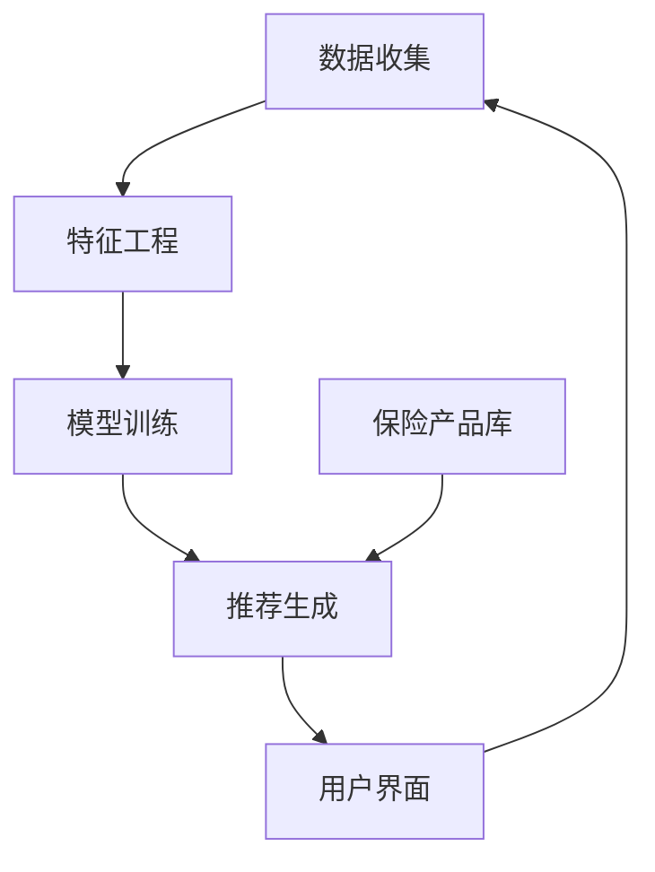

# 智能保险产品个性化推荐引擎

> 关键词：智能保险、个性化推荐引擎、算法原理、数学模型、实际应用场景

> 摘要：本文围绕智能保险产品个性化推荐引擎展开深入探讨。首先介绍了该推荐引擎产生的背景，包括目的、预期读者等内容。接着阐述了核心概念、算法原理、数学模型等基础知识。通过项目实战展示了开发环境搭建、代码实现及解读。分析了实际应用场景，推荐了相关的学习资源、开发工具框架和论文著作。最后总结了未来发展趋势与挑战，并给出常见问题解答和扩展阅读参考资料，旨在为相关从业者和研究者提供全面且深入的技术指导。

## 1. 背景介绍 
### 1.1 目的和范围
随着保险市场的不断发展，产品种类日益丰富，消费者面临着众多的选择。智能保险产品个性化推荐引擎的目的在于帮助消费者更精准地找到适合自己的保险产品，同时帮助保险公司提高销售效率和客户满意度。本文章的范围涵盖了智能保险产品个性化推荐引擎的核心概念、算法原理、数学模型、项目实战、实际应用场景等方面，全面介绍了该推荐引擎从理论到实践的各个环节。

### 1.2 预期读者
本文的预期读者包括保险行业的从业者，如保险销售人员、产品经理等，他们可以通过本文了解如何利用个性化推荐引擎提升业务效率和服务质量；计算机科学领域的开发者和研究人员，他们可以从中获取相关的技术思路和实现方法；对智能保险感兴趣的普通读者，通过阅读本文可以深入了解智能保险产品个性化推荐的背后原理。

### 1.3 文档结构概述
本文将按照以下结构进行阐述：首先介绍核心概念与联系，明确相关概念的定义和它们之间的关系；接着讲解核心算法原理和具体操作步骤，并给出 Python 代码示例；然后介绍数学模型和公式，通过具体例子进行详细说明；之后进行项目实战，包括开发环境搭建、源代码实现和代码解读；分析实际应用场景；推荐相关的工具和资源；最后总结未来发展趋势与挑战，给出常见问题解答和扩展阅读参考资料。

### 1.4 术语表
#### 1.4.1 核心术语定义
- **智能保险**：利用人工智能、大数据等技术，对保险业务进行智能化升级，包括风险评估、产品推荐、理赔处理等环节。
- **个性化推荐引擎**：根据用户的个人特征、行为数据等信息，为用户提供个性化的产品或服务推荐。
- **保险产品**：保险公司为满足不同客户需求而设计的各类保险方案，如人寿保险、健康保险、财产保险等。
- **特征工程**：对原始数据进行预处理、提取和转换，以获得更有价值的特征，用于模型训练。
- **协同过滤**：一种基于用户行为数据的推荐算法，通过寻找与目标用户行为相似的其他用户，来推荐他们喜欢的产品。

#### 1.4.2 相关概念解释
- **用户画像**：通过收集和分析用户的各种信息，构建出用户的特征模型，用于描述用户的兴趣、偏好、需求等。
- **冷启动问题**：在推荐系统中，当新用户或新产品进入系统时，由于缺乏足够的历史数据，难以进行准确的推荐。
- **召回算法**：从大量的候选物品中筛选出一部分可能符合用户兴趣的物品，为后续的排序提供候选集。
- **排序算法**：对召回的物品进行排序，确定它们的推荐优先级。

#### 1.4.3 缩略词列表
- **AI**：Artificial Intelligence，人工智能
- **ML**：Machine Learning，机器学习
- **CF**：Collaborative Filtering，协同过滤
- **LR**：Logistic Regression，逻辑回归
- **GBDT**：Gradient Boosting Decision Tree，梯度提升决策树

## 2. 核心概念与联系 
### 核心概念原理
智能保险产品个性化推荐引擎的核心原理是利用人工智能和大数据技术，对用户的各种信息进行收集、分析和处理，从而为用户提供个性化的保险产品推荐。具体来说，它包括以下几个关键步骤：
1. **数据收集**：收集用户的基本信息（如年龄、性别、职业等）、行为数据（如浏览记录、购买记录等）、社交数据等。
2. **特征工程**：对收集到的数据进行预处理、提取和转换，得到能够反映用户特征和需求的特征向量。
3. **模型训练**：使用机器学习或深度学习算法，对特征向量进行训练，建立用户兴趣模型和产品推荐模型。
4. **推荐生成**：根据用户的特征向量和模型，从保险产品库中筛选出符合用户需求的产品，并进行排序，生成个性化的推荐列表。

### 架构的文本示意图
智能保险产品个性化推荐引擎的架构主要包括以下几个部分：
1. **数据层**：负责收集和存储用户数据、保险产品数据等。
2. **特征工程层**：对数据进行预处理、特征提取和转换。
3. **模型层**：使用机器学习或深度学习算法进行模型训练和预测。
4. **推荐服务层**：根据模型的预测结果，生成个性化的推荐列表，并提供给用户。
5. **用户界面层**：用户与推荐引擎进行交互的界面，如网站、手机应用等。

### Mermaid 流程图


## 3. 核心算法原理 & 具体操作步骤 
### 协同过滤算法原理
协同过滤是一种常用的推荐算法，它基于用户的行为数据来发现用户之间的相似性，并根据相似用户的偏好来推荐产品。协同过滤算法可以分为基于用户的协同过滤和基于物品的协同过滤。

#### 基于用户的协同过滤
基于用户的协同过滤算法的基本思想是：找到与目标用户兴趣相似的其他用户，然后根据这些相似用户的购买历史来推荐产品给目标用户。具体步骤如下：
1. **计算用户之间的相似度**：可以使用余弦相似度、皮尔逊相关系数等方法来计算用户之间的相似度。
2. **找到与目标用户最相似的 K 个用户**：根据相似度排序，选择前 K 个用户。
3. **根据相似用户的购买历史来推荐产品**：统计 K 个相似用户购买过但目标用户未购买过的产品，根据产品的流行度或其他指标进行排序，推荐给目标用户。

#### 基于物品的协同过滤
基于物品的协同过滤算法的基本思想是：找到与目标用户喜欢的物品相似的其他物品，然后将这些相似物品推荐给目标用户。具体步骤如下：
1. **计算物品之间的相似度**：可以使用余弦相似度、调整余弦相似度等方法来计算物品之间的相似度。
2. **找到目标用户喜欢的物品**：根据目标用户的购买历史或浏览记录，确定目标用户喜欢的物品。
3. **根据物品相似度来推荐产品**：找到与目标用户喜欢的物品最相似的 K 个物品，推荐给目标用户。

### Python 代码实现
以下是一个简单的基于用户的协同过滤算法的 Python 代码示例：
```python
import numpy as np

# 用户-物品评分矩阵
ratings = np.array([
    [5, 3, 0, 1],
    [4, 0, 0, 1],
    [1, 1, 0, 5],
    [1, 0, 0, 4],
    [0, 1, 5, 4]
])

# 计算用户之间的余弦相似度
def cosine_similarity(user1, user2):
    dot_product = np.dot(user1, user2)
    norm_user1 = np.linalg.norm(user1)
    norm_user2 = np.linalg.norm(user2)
    if norm_user1 == 0 or norm_user2 == 0:
        return 0
    return dot_product / (norm_user1 * norm_user2)

# 找到与目标用户最相似的 K 个用户
def find_similar_users(target_user, ratings, K):
    num_users = ratings.shape[0]
    similarities = []
    for i in range(num_users):
        if i!= target_user:
            similarity = cosine_similarity(ratings[target_user], ratings[i])
            similarities.append((i, similarity))
    similarities.sort(key=lambda x: x[1], reverse=True)
    return similarities[:K]

# 根据相似用户的购买历史来推荐产品
def recommend_products(target_user, ratings, K):
    similar_users = find_similar_users(target_user, ratings, K)
    num_products = ratings.shape[1]
    product_scores = np.zeros(num_products)
    for user, similarity in similar_users:
        for i in range(num_products):
            if ratings[target_user][i] == 0:
                product_scores[i] += similarity * ratings[user][i]
    recommended_products = np.argsort(product_scores)[::-1]
    return recommended_products

# 目标用户
target_user = 0
# 相似用户数量
K = 2
recommended_products = recommend_products(target_user, ratings, K)
print("推荐的产品编号：", recommended_products)
```

### 具体操作步骤
1. **数据准备**：收集用户的行为数据，构建用户-物品评分矩阵。
2. **相似度计算**：使用余弦相似度等方法计算用户之间的相似度。
3. **相似用户查找**：找到与目标用户最相似的 K 个用户。
4. **产品推荐**：根据相似用户的购买历史，为目标用户推荐产品。

## 4. 数学模型和公式 & 详细讲解 & 举例说明 
### 余弦相似度公式
余弦相似度是一种常用的相似度计算方法，用于衡量两个向量之间的夹角余弦值。其公式如下：
$$
\text{cosine similarity}(A, B) = \frac{A \cdot B}{\|A\| \|B\|}
$$
其中，$A$ 和 $B$ 是两个向量，$A \cdot B$ 是它们的点积，$\|A\|$ 和 $\|B\|$ 分别是它们的模。

### 详细讲解
余弦相似度的取值范围是 $[-1, 1]$，值越接近 1 表示两个向量越相似，值越接近 -1 表示两个向量越不相似。在推荐系统中，我们可以将用户的行为数据表示为向量，然后使用余弦相似度来计算用户之间的相似度。

### 举例说明
假设有两个用户的行为数据向量分别为 $A = [1, 2, 3]$ 和 $B = [2, 4, 6]$，则它们的余弦相似度为：
$$
\begin{align*}
\text{cosine similarity}(A, B) &= \frac{A \cdot B}{\|A\| \|B\|}\\
&= \frac{1 \times 2 + 2 \times 4 + 3 \times 6}{\sqrt{1^2 + 2^2 + 3^2} \sqrt{2^2 + 4^2 + 6^2}}\\
&= \frac{2 + 8 + 18}{\sqrt{14} \sqrt{56}}\\
&= \frac{28}{\sqrt{14} \times 2\sqrt{14}}\\
&= 1
\end{align*}
$$
这表明两个用户的行为数据非常相似。

### 逻辑回归模型公式
逻辑回归是一种常用的分类算法，也可以用于推荐系统中的排序任务。其公式如下：
$$
P(y = 1|x) = \frac{1}{1 + e^{-(w_0 + w_1x_1 + w_2x_2 + \cdots + w_nx_n)}}
$$
其中，$P(y = 1|x)$ 是给定特征向量 $x$ 时，样本属于正类的概率，$w_0, w_1, w_2, \cdots, w_n$ 是模型的参数。

### 详细讲解
逻辑回归模型通过对特征向量进行线性组合，然后使用 sigmoid 函数将其转换为概率值。在推荐系统中，我们可以使用逻辑回归模型来预测用户对某个产品的点击概率或购买概率，从而对产品进行排序。

### 举例说明
假设我们有一个用户的特征向量 $x = [1, 2, 3]$，模型的参数 $w = [0.1, 0.2, 0.3]$，则用户对某个产品的点击概率为：
$$
\begin{align*}
P(y = 1|x) &= \frac{1}{1 + e^{-(0.1 + 0.2 \times 1 + 0.3 \times 2 + 0.4 \times 3)}}\\
&= \frac{1}{1 + e^{-(0.1 + 0.2 + 0.6 + 1.2)}}\\
&= \frac{1}{1 + e^{-2.1}}\\
&\approx 0.89
\end{align*}
$$
这表明用户有较高的概率点击该产品。

## 5. 项目实战：代码实际案例和详细解释说明 
### 5.1  开发环境搭建
#### 操作系统
推荐使用 Linux 或 macOS 操作系统，因为它们对 Python 和机器学习库的支持更好。

#### Python 环境
安装 Python 3.7 或更高版本，可以使用 Anaconda 来管理 Python 环境。

#### 相关库安装
安装以下必要的 Python 库：
```bash
pip install numpy pandas scikit-learn matplotlib
```

### 5.2  源代码详细实现和代码解读
以下是一个完整的智能保险产品个性化推荐引擎的 Python 代码示例：
```python
import numpy as np
import pandas as pd
from sklearn.model_selection import train_test_split
from sklearn.linear_model import LogisticRegression
from sklearn.metrics import accuracy_score

# 生成模拟数据
def generate_data(num_users, num_products):
    users = np.random.randint(0, 100, size=(num_users, 3))  # 用户特征
    products = np.random.randint(0, 100, size=(num_products, 3))  # 产品特征
    ratings = np.random.randint(0, 2, size=(num_users, num_products))  # 用户-产品评分
    return users, products, ratings

# 构建特征矩阵
def build_feature_matrix(users, products, ratings):
    num_users = users.shape[0]
    num_products = products.shape[0]
    features = []
    labels = []
    for i in range(num_users):
        for j in range(num_products):
            feature = np.concatenate((users[i], products[j]))
            features.append(feature)
            labels.append(ratings[i][j])
    features = np.array(features)
    labels = np.array(labels)
    return features, labels

# 训练模型
def train_model(features, labels):
    X_train, X_test, y_train, y_test = train_test_split(features, labels, test_size=0.2, random_state=42)
    model = LogisticRegression()
    model.fit(X_train, y_train)
    y_pred = model.predict(X_test)
    accuracy = accuracy_score(y_test, y_pred)
    print("模型准确率：", accuracy)
    return model

# 推荐产品
def recommend_products(user, products, model):
    num_products = products.shape[0]
    product_scores = []
    for i in range(num_products):
        feature = np.concatenate((user, products[i]))
        score = model.predict_proba([feature])[0][1]
        product_scores.append((i, score))
    product_scores.sort(key=lambda x: x[1], reverse=True)
    recommended_products = [x[0] for x in product_scores]
    return recommended_products

# 主函数
def main():
    num_users = 100
    num_products = 20
    users, products, ratings = generate_data(num_users, num_products)
    features, labels = build_feature_matrix(users, products, ratings)
    model = train_model(features, labels)
    target_user = users[0]
    recommended_products = recommend_products(target_user, products, model)
    print("推荐的产品编号：", recommended_products)

if __name__ == "__main__":
    main()
```

### 代码解读与分析
1. **数据生成**：`generate_data` 函数用于生成模拟的用户特征、产品特征和用户-产品评分数据。
2. **特征矩阵构建**：`build_feature_matrix` 函数将用户特征和产品特征组合成特征矩阵，并将用户-产品评分作为标签。
3. **模型训练**：`train_model` 函数使用逻辑回归模型对特征矩阵和标签进行训练，并计算模型的准确率。
4. **产品推荐**：`recommend_products` 函数根据训练好的模型，为目标用户推荐产品。
5. **主函数**：`main` 函数调用上述函数，完成数据生成、模型训练和产品推荐的整个流程。

## 6. 实际应用场景 
### 保险网站
在保险网站上，智能保险产品个性化推荐引擎可以根据用户的浏览记录、填写的信息等，为用户推荐适合的保险产品。例如，当用户在网站上浏览了健康保险产品时，推荐引擎可以推荐相关的医疗保险、重疾保险等产品。

### 保险 APP
在保险 APP 中，推荐引擎可以根据用户的使用习惯、地理位置等信息，为用户提供个性化的保险产品推荐。例如，当用户处于旅游状态时，推荐引擎可以推荐旅游保险产品。

### 保险销售客服
保险销售客服可以利用推荐引擎提供的个性化推荐结果，为客户提供更精准的保险方案。例如，当客服与客户沟通时，可以根据客户的需求和特征，推荐适合的保险产品。

### 保险市场调研
保险公司可以利用推荐引擎分析用户的需求和偏好，为新产品的开发和市场推广提供参考。例如，通过分析用户对不同保险产品的兴趣度，了解市场需求，开发更符合用户需求的保险产品。

## 7. 工具和资源推荐
### 7.1 学习资源推荐
#### 7.1.1 书籍推荐
- 《推荐系统实践》：介绍了推荐系统的基本原理、算法和实践经验。
- 《机器学习》：全面介绍了机器学习的基本概念、算法和应用。
- 《Python 机器学习实战》：通过实际案例介绍了如何使用 Python 实现机器学习算法。

#### 7.1.2 在线课程
- Coursera 上的“机器学习”课程：由 Andrew Ng 教授授课，是机器学习领域的经典课程。
- edX 上的“推荐系统”课程：系统介绍了推荐系统的原理、算法和实践。
- 阿里云天池平台上的“推荐系统实战”课程：通过实际案例介绍了推荐系统的开发和应用。

#### 7.1.3 技术博客和网站
- 知乎：有很多关于推荐系统和保险科技的技术文章和讨论。
- 博客园：有很多开发者分享的推荐系统实践经验和代码。
- 阿里云开发者社区：提供了丰富的推荐系统和机器学习相关的技术文章和案例。

### 7.2 开发工具框架推荐
#### 7.2.1 IDE和编辑器
- PyCharm：一款功能强大的 Python IDE，适合开发 Python 项目。
- Jupyter Notebook：一个交互式的开发环境，适合进行数据分析和模型实验。
- Visual Studio Code：一款轻量级的代码编辑器，支持多种编程语言和插件。

#### 7.2.2 调试和性能分析工具
- PySnooper：一个简单易用的 Python 调试工具，可以自动记录函数的执行过程。
- cProfile：Python 内置的性能分析工具，可以分析代码的执行时间和调用关系。
- TensorBoard：一个可视化工具，用于分析深度学习模型的训练过程和性能。

#### 7.2.3 相关框架和库
- Scikit-learn：一个常用的机器学习库，提供了丰富的机器学习算法和工具。
- TensorFlow：一个开源的深度学习框架，用于构建和训练深度学习模型。
- PyTorch：另一个流行的深度学习框架，具有简洁易用的特点。

### 7.3 相关论文著作推荐
#### 7.3.1 经典论文
- “Item-Based Collaborative Filtering Recommendation Algorithms”：介绍了基于物品的协同过滤算法。
- “Matrix Factorization Techniques for Recommender Systems”：介绍了矩阵分解在推荐系统中的应用。
- “Deep Neural Networks for YouTube Recommendations”：介绍了 YouTube 推荐系统中使用的深度学习方法。

#### 7.3.2 最新研究成果
- 在 arXiv 上搜索“Insurance Product Recommendation”，可以找到最新的保险产品推荐相关的研究论文。
- 在顶级学术会议（如 SIGKDD、RecSys 等）上查找推荐系统领域的最新研究成果。

#### 7.3.3 应用案例分析
- 可以参考一些保险科技公司的官方网站，了解他们在智能保险产品个性化推荐方面的应用案例。
- 在一些行业报告和研究机构的网站上，也可以找到相关的应用案例分析。

## 8. 总结：未来发展趋势与挑战
### 未来发展趋势
- **多模态数据融合**：未来的智能保险产品个性化推荐引擎将不仅利用用户的基本信息和行为数据，还会融合用户的语音、图像、视频等多模态数据，以更全面地了解用户的需求和偏好。
- **深度学习的广泛应用**：深度学习技术将在推荐引擎中得到更广泛的应用，如使用卷积神经网络（CNN）处理图像数据，使用循环神经网络（RNN）处理序列数据等，以提高推荐的准确性和个性化程度。
- **与区块链技术结合**：区块链技术的去中心化、不可篡改等特点可以为保险产品推荐提供更安全、可信的数据环境，同时也可以解决数据隐私和共享的问题。
- **实时推荐**：随着用户行为的实时变化，推荐引擎需要能够实时地为用户提供个性化的推荐，以提高用户的满意度和转化率。

### 挑战
- **数据隐私和安全**：智能保险产品个性化推荐引擎需要收集和处理大量的用户数据，如何保护用户的隐私和数据安全是一个重要的挑战。
- **冷启动问题**：新用户和新产品的冷启动问题仍然是推荐系统面临的难题，需要研究更有效的解决方法。
- **模型可解释性**：深度学习模型虽然在推荐性能上表现出色，但往往缺乏可解释性，如何提高模型的可解释性，让用户和业务人员更好地理解推荐结果，是一个需要解决的问题。
- **业务规则和推荐算法的融合**：在实际应用中，需要将业务规则和推荐算法相结合，以满足不同业务场景的需求，这对推荐引擎的设计和开发提出了更高的要求。

## 9. 附录：常见问题与解答
### 问题 1：智能保险产品个性化推荐引擎需要多少数据才能正常工作？
解答：这取决于具体的算法和模型。一般来说，数据量越大，推荐的准确性越高。但即使数据量较少，也可以通过一些方法（如特征工程、模型选择等）来提高推荐的效果。

### 问题 2：如何解决冷启动问题？
解答：可以采用以下方法解决冷启动问题：
- 利用用户的基本信息（如年龄、性别、职业等）进行简单的推荐。
- 让用户在注册时选择自己的兴趣标签，根据标签进行推荐。
- 使用基于内容的推荐算法，根据产品的特征进行推荐。

### 问题 3：如何评估智能保险产品个性化推荐引擎的性能？
解答：可以使用以下指标来评估推荐引擎的性能：
- **准确率**：推荐的产品中用户真正感兴趣的比例。
- **召回率**：用户感兴趣的产品中被推荐出来的比例。
- **F1 值**：综合考虑准确率和召回率的指标。
- **覆盖率**：推荐系统能够覆盖的产品范围。

### 问题 4：智能保险产品个性化推荐引擎会取代保险销售人员吗？
解答：不会。虽然推荐引擎可以为用户提供个性化的推荐，但保险销售过程中还需要保险销售人员与用户进行沟通，了解用户的具体需求，提供专业的建议和服务。推荐引擎可以辅助保险销售人员提高工作效率和服务质量。

## 10. 扩展阅读 & 参考资料
### 扩展阅读
- 《大数据时代》：介绍了大数据的概念、应用和影响。
- 《人工智能时代》：探讨了人工智能技术的发展和对社会的影响。
- 《数字化保险》：介绍了保险行业的数字化转型和创新。

### 参考资料
- 各保险公司的官方网站和行业报告。
- 相关的学术期刊和会议论文。
- 开源的推荐系统项目和代码库。

作者：AI天才研究院/AI Genius Institute & 禅与计算机程序设计艺术 /Zen And The Art of Computer Programming