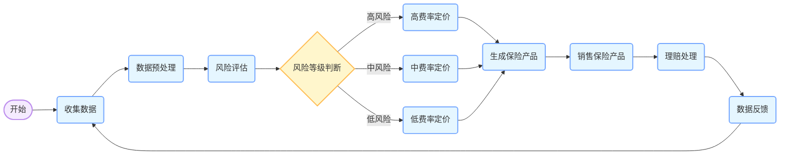

# 智能保险产品定价模型

> 关键词：智能保险、产品定价模型、风险评估、精算科学、机器学习

> 摘要：本文围绕智能保险产品定价模型展开深入探讨。首先介绍了该模型产生的背景、目的和适用范围，明确预期读者。接着详细阐述核心概念，包括保险定价的基本原理、风险评估的关键要素以及它们之间的联系，并通过文本示意图和Mermaid流程图进行直观展示。深入分析核心算法原理，运用Python代码进行详细讲解，同时给出相关数学模型和公式，并举例说明其应用。通过项目实战，介绍开发环境搭建、源代码实现和代码解读。探讨了智能保险产品定价模型在不同场景下的实际应用，推荐了学习资源、开发工具框架以及相关论文著作。最后总结了未来发展趋势与挑战，并对常见问题进行解答，提供扩展阅读和参考资料，旨在为保险行业的定价决策提供全面而深入的技术支持和理论指导。

## 1. 背景介绍 
### 1.1 目的和范围
在保险行业中，准确合理的产品定价至关重要。智能保险产品定价模型的目的在于利用先进的技术和数据分析方法，更精准地评估风险，为保险产品制定出公平、合理且具有竞争力的价格。其范围涵盖了各类保险产品，如人寿保险、健康保险、财产保险等。通过对大量数据的分析和处理，模型能够综合考虑多种因素，包括投保人的年龄、健康状况、职业、历史理赔记录等，从而为不同的客户群体制定个性化的保险费率。

### 1.2 预期读者
本文的预期读者主要包括保险行业的从业者，如精算师、保险产品开发人员、风险评估专家等，他们可以从本文中获取关于智能保险产品定价模型的最新技术和方法，以提升自身的业务能力和决策水平。同时，对于对保险科技感兴趣的研究人员和学生，本文也提供了一个全面了解该领域的技术指南，有助于他们深入研究相关课题。此外，一些关注保险行业发展的投资者和监管机构人员也可以通过本文了解智能保险定价的技术原理和市场趋势。

### 1.3 文档结构概述
本文将按照以下结构进行详细阐述：首先介绍核心概念，包括保险定价的基本原理、风险评估的关键要素以及它们之间的联系；接着深入分析核心算法原理，运用Python代码进行详细讲解；随后给出相关数学模型和公式，并举例说明其应用；通过项目实战，介绍开发环境搭建、源代码实现和代码解读；探讨该模型在不同场景下的实际应用；推荐学习资源、开发工具框架以及相关论文著作；最后总结未来发展趋势与挑战，解答常见问题，并提供扩展阅读和参考资料。

### 1.4 术语表
#### 1.4.1 核心术语定义
- **智能保险**：利用人工智能、大数据、机器学习等先进技术，对保险业务的各个环节进行智能化改造，以提高保险服务的效率和质量。
- **产品定价模型**：一种用于确定保险产品价格的数学模型，它综合考虑了多种因素，如风险水平、成本、利润目标等，以制定出合理的保险费率。
- **风险评估**：对投保人面临的风险进行量化分析和评估的过程，是保险定价的重要依据。
- **精算科学**：运用数学、统计学、概率论等方法，对保险业务中的风险、成本、利润等进行定量分析和预测的学科。
- **机器学习**：一门多领域交叉学科，涉及概率论、统计学、逼近论、凸分析、算法复杂度理论等多门学科。它专门研究计算机怎样模拟或实现人类的学习行为，以获取新的知识或技能，重新组织已有的知识结构使之不断改善自身的性能。

#### 1.4.2 相关概念解释
- **保险费率**：保险费与保险金额的比率，是保险人按单位保险金额向投保人收取保险费的标准。
- **纯保费**：用于支付保险赔款或给付保险金的那部分保费，它是根据保险标的的损失概率计算出来的。
- **附加保费**：用于弥补保险公司的经营成本、税费和利润等的那部分保费。
- **风险因子**：影响保险标的发生损失的可能性和损失程度的各种因素，如年龄、性别、健康状况、职业等。

#### 1.4.3 缩略词列表
- **AI**：Artificial Intelligence，人工智能
- **ML**：Machine Learning，机器学习
- **GLM**：Generalized Linear Model，广义线性模型
- **GAM**：Generalized Additive Model，广义相加模型
- **NN**：Neural Network，神经网络

## 2. 核心概念与联系 

### 保险定价的基本原理
保险定价的基本原理是基于风险评估和成本核算。保险公司需要根据投保人面临的风险水平来确定保险费率，以确保收取的保费能够覆盖可能发生的赔款和经营成本，并实现一定的利润目标。风险评估是保险定价的核心环节，它通过对各种风险因子的分析和评估，来确定投保人的风险等级。成本核算则包括纯保费和附加保费两部分，纯保费用于支付赔款，附加保费用于弥补经营成本和获取利润。

### 风险评估的关键要素
风险评估的关键要素包括投保人的个人特征、保险标的的特征以及外部环境因素等。个人特征如年龄、性别、健康状况、职业等，不同的个人特征会导致不同的风险水平。保险标的的特征如财产的类型、价值、使用情况等，也会影响风险的大小。外部环境因素如自然灾害、社会经济状况等，同样会对保险风险产生影响。

### 核心概念的联系
保险定价、风险评估和精算科学之间存在着密切的联系。风险评估是保险定价的基础，通过准确评估风险，保险公司可以制定出合理的保险费率。精算科学则为风险评估和保险定价提供了理论和方法支持，运用数学和统计学模型对风险和成本进行量化分析。智能保险产品定价模型则是在传统保险定价的基础上，引入了人工智能和机器学习技术，通过对大量数据的分析和学习，提高风险评估的准确性和保险定价的合理性。

### 文本示意图
```plaintext
智能保险产品定价模型
|-- 风险评估
|   |-- 个人特征（年龄、性别、健康状况、职业等）
|   |-- 保险标的特征（财产类型、价值、使用情况等）
|   |-- 外部环境因素（自然灾害、社会经济状况等）
|-- 保险定价
|   |-- 纯保费（基于风险评估）
|   |-- 附加保费（经营成本、利润等）
|-- 精算科学（数学和统计学模型支持）
|-- 人工智能和机器学习技术（数据挖掘、模型训练）
```

### Mermaid流程图


## 3. 核心算法原理 & 具体操作步骤 

### 广义线性模型（GLM）原理
广义线性模型是一种常用的保险定价模型，它通过对响应变量的均值与线性预测器之间的关系进行建模。GLM的基本形式可以表示为：
$$g(\mu_i) = \beta_0 + \beta_1x_{i1} + \beta_2x_{i2} + \cdots + \beta_px_{ip}$$
其中，$g(\cdot)$ 是链接函数，$\mu_i$ 是第 $i$ 个观测值的响应变量的均值，$\beta_0, \beta_1, \cdots, \beta_p$ 是模型的参数，$x_{i1}, x_{i2}, \cdots, x_{ip}$ 是第 $i$ 个观测值的解释变量。

### Python代码实现GLM
```python
import numpy as np
import statsmodels.api as sm

# 生成示例数据
np.random.seed(0)
n = 100
x1 = np.random.randn(n)
x2 = np.random.randn(n)
y = 2 + 3 * x1 + 4 * x2 + np.random.randn(n)

# 添加常数项
X = sm.add_constant(np.column_stack((x1, x2)))

# 拟合GLM模型
model = sm.GLM(y, X, family=sm.families.Gaussian())
result = model.fit()

# 输出模型结果
print(result.summary())
```

### 具体操作步骤
1. **数据准备**：收集与保险定价相关的数据，包括投保人的特征、保险标的的信息以及历史理赔记录等。对数据进行清洗和预处理，去除缺失值、异常值等。
2. **特征选择**：从数据中选择与保险风险密切相关的特征，作为模型的输入变量。可以使用相关性分析、特征重要性排序等方法进行特征选择。
3. **模型训练**：使用准备好的数据对GLM模型进行训练，估计模型的参数。可以使用最大似然估计等方法进行参数估计。
4. **模型评估**：使用测试数据对训练好的模型进行评估，计算模型的预测误差和性能指标，如均方误差、准确率等。
5. **模型优化**：根据模型评估的结果，对模型进行优化，调整模型的参数和结构，以提高模型的预测性能。
6. **定价应用**：将优化后的模型应用于实际的保险定价中，根据投保人的特征和风险评估结果，计算出合理的保险费率。

### 机器学习算法（如神经网络）原理
神经网络是一种强大的机器学习算法，它可以自动学习数据中的复杂模式和关系。在保险定价中，神经网络可以用于对风险进行预测和分类。神经网络由输入层、隐藏层和输出层组成，通过神经元之间的连接和权重调整，实现对数据的非线性映射。

### Python代码实现神经网络
```python
import tensorflow as tf
from tensorflow.keras.models import Sequential
from tensorflow.keras.layers import Dense

# 生成示例数据
np.random.seed(0)
n = 100
x = np.random.randn(n, 2)
y = np.sin(x[:, 0]) + np.cos(x[:, 1])

# 构建神经网络模型
model = Sequential()
model.add(Dense(10, input_dim=2, activation='relu'))
model.add(Dense(1, activation='linear'))

# 编译模型
model.compile(loss='mse', optimizer='adam')

# 训练模型
model.fit(x, y, epochs=100, batch_size=10, verbose=0)

# 进行预测
predictions = model.predict(x)
```

### 具体操作步骤
1. **数据准备**：同GLM模型的数据准备步骤，收集和预处理相关数据。
2. **数据划分**：将数据划分为训练集、验证集和测试集，用于模型的训练、调优和评估。
3. **模型构建**：根据问题的特点和数据的规模，选择合适的神经网络结构，如层数、神经元数量等。
4. **模型编译**：选择合适的损失函数和优化器，对模型进行编译。
5. **模型训练**：使用训练集对模型进行训练，调整模型的权重和偏置。
6. **模型评估**：使用验证集和测试集对模型进行评估，计算模型的性能指标。
7. **模型调优**：根据评估结果，调整模型的超参数，如学习率、批次大小等，以提高模型的性能。
8. **定价应用**：将训练好的模型应用于实际的保险定价中，根据投保人的特征进行风险预测和定价。

## 4. 数学模型和公式 & 详细讲解 & 举例说明 

### 纯保费计算模型
纯保费是保险定价的重要组成部分，它是根据保险标的的损失概率计算出来的。纯保费的计算公式为：
$$P_p = E(L)$$
其中，$P_p$ 表示纯保费，$E(L)$ 表示保险标的的期望损失。

### 详细讲解
期望损失是指在一定时期内，保险标的可能发生的损失的平均值。它可以通过对历史数据的分析和统计来估计。例如，对于人寿保险，期望损失可以根据死亡率表来计算；对于财产保险，期望损失可以根据财产的损失率和损失金额来计算。

### 举例说明
假设某保险公司承保了1000辆汽车，每辆汽车的保险金额为10万元。根据历史数据统计，在过去一年中，这1000辆汽车中有10辆发生了事故，平均每起事故的损失金额为2万元。则该汽车保险的期望损失为：
$$E(L) = \frac{10}{1000} \times 2 = 0.02 \text{（万元）}$$
因此，每辆汽车的纯保费为0.02万元，即200元。

### 附加保费计算模型
附加保费用于弥补保险公司的经营成本、税费和利润等。附加保费的计算公式为：
$$P_a = k \times P_p$$
其中，$P_a$ 表示附加保费，$k$ 表示附加保费系数，$P_p$ 表示纯保费。

### 详细讲解
附加保费系数是一个经验值，它根据保险公司的经营策略、市场竞争情况等因素来确定。一般来说，附加保费系数在0.2 - 0.5之间。

### 举例说明
假设上述汽车保险的附加保费系数为0.3，则每辆汽车的附加保费为：
$$P_a = 0.3 \times 200 = 60 \text{（元）}$$
因此，每辆汽车的总保费为纯保费和附加保费之和，即：
$$P = P_p + P_a = 200 + 60 = 260 \text{（元）}$$

### 风险调整因子模型
为了更准确地反映不同投保人的风险水平，保险定价模型中通常会引入风险调整因子。风险调整因子的计算公式为：
$$R = \prod_{i=1}^{n} r_i$$
其中，$R$ 表示风险调整因子，$r_i$ 表示第 $i$ 个风险因子的调整系数，$n$ 表示风险因子的数量。

### 详细讲解
风险调整因子是根据投保人的风险特征来确定的，不同的风险因子对应不同的调整系数。例如，对于年龄较大的投保人，其死亡率相对较高，因此年龄风险因子的调整系数可能会大于1；对于驾驶记录良好的投保人，其发生事故的概率相对较低，因此驾驶记录风险因子的调整系数可能会小于1。

### 举例说明
假设某投保人的年龄风险因子调整系数为1.2，驾驶记录风险因子调整系数为0.8，则该投保人的风险调整因子为：
$$R = 1.2 \times 0.8 = 0.96$$
如果该投保人的基础保费为260元，则调整后的保费为：
$$P' = R \times P = 0.96 \times 260 = 249.6 \text{（元）}$$

## 5. 项目实战：代码实际案例和详细解释说明 

### 5.1  开发环境搭建
#### 操作系统
建议使用Windows 10、Linux（如Ubuntu）或macOS等主流操作系统。

#### 编程语言和版本
使用Python 3.7及以上版本，Python具有丰富的科学计算和机器学习库，适合用于保险定价模型的开发。

#### 安装必要的库
可以使用pip命令安装以下必要的库：
```bash
pip install numpy pandas scikit-learn statsmodels tensorflow
```
- **numpy**：用于数值计算和数组操作。
- **pandas**：用于数据处理和分析。
- **scikit-learn**：提供了各种机器学习算法和工具。
- **statsmodels**：用于统计建模和分析。
- **tensorflow**：用于深度学习模型的开发和训练。

### 5.2  源代码详细实现和代码解读
#### 数据加载和预处理
```python
import pandas as pd
from sklearn.preprocessing import StandardScaler

# 加载数据
data = pd.read_csv('insurance_data.csv')

# 分离特征和标签
X = data.drop('claim_amount', axis=1)
y = data['claim_amount']

# 对特征进行标准化处理
scaler = StandardScaler()
X_scaled = scaler.fit_transform(X)
```
代码解读：
- 首先使用`pandas`库的`read_csv`函数加载保险数据文件。
- 然后将特征和标签分离，`claim_amount`作为标签，其余列作为特征。
- 最后使用`StandardScaler`对特征进行标准化处理，将特征数据转换为均值为0，标准差为1的标准正态分布，以提高模型的训练效果。

#### 模型训练和评估（以GLM为例）
```python
import statsmodels.api as sm

# 添加常数项
X_scaled = sm.add_constant(X_scaled)

# 拟合GLM模型
model = sm.GLM(y, X_scaled, family=sm.families.Gaussian())
result = model.fit()

# 输出模型结果
print(result.summary())

# 进行预测
predictions = result.predict(X_scaled)
```
代码解读：
- 使用`sm.add_constant`函数为特征矩阵添加常数项，以包含截距项。
- 构建GLM模型，指定响应变量`y`和特征矩阵`X_scaled`，并选择高斯分布作为响应变量的分布族。
- 使用`fit`方法对模型进行训练，得到模型的参数估计结果。
- 使用`summary`方法输出模型的详细统计信息，包括参数估计值、标准误差、p值等。
- 使用`predict`方法对训练数据进行预测，得到预测结果。

#### 模型训练和评估（以神经网络为例）
```python
from tensorflow.keras.models import Sequential
from tensorflow.keras.layers import Dense
from sklearn.model_selection import train_test_split

# 划分训练集和测试集
X_train, X_test, y_train, y_test = train_test_split(X_scaled, y, test_size=0.2, random_state=42)

# 构建神经网络模型
model = Sequential()
model.add(Dense(10, input_dim=X_train.shape[1], activation='relu'))
model.add(Dense(1, activation='linear'))

# 编译模型
model.compile(loss='mse', optimizer='adam')

# 训练模型
model.fit(X_train, y_train, epochs=100, batch_size=10, verbose=0)

# 评估模型
loss = model.evaluate(X_test, y_test)
print(f"Test loss: {loss}")

# 进行预测
predictions = model.predict(X_test)
```
代码解读：
- 使用`train_test_split`函数将数据划分为训练集和测试集，测试集占总数据的20%。
- 构建神经网络模型，包含一个输入层、一个隐藏层和一个输出层。隐藏层使用ReLU激活函数，输出层使用线性激活函数。
- 使用`compile`方法编译模型，指定损失函数为均方误差（MSE），优化器为Adam。
- 使用`fit`方法对模型进行训练，设置训练轮数为100，批次大小为10。
- 使用`evaluate`方法对模型在测试集上的性能进行评估，计算测试集的损失值。
- 使用`predict`方法对测试集进行预测，得到预测结果。

### 5.3  代码解读与分析
#### GLM模型分析
GLM模型的优点是模型结构简单，解释性强。通过输出的模型结果，可以直观地了解每个特征对响应变量的影响程度。例如，参数估计值的正负表示特征与响应变量的正相关或负相关关系，p值可以判断特征的显著性。然而，GLM模型的局限性在于它假设响应变量与特征之间存在线性关系，对于复杂的非线性关系可能无法很好地拟合。

#### 神经网络模型分析
神经网络模型的优点是能够自动学习数据中的复杂模式和非线性关系，具有较强的预测能力。通过调整神经网络的结构和超参数，可以提高模型的性能。然而，神经网络模型的解释性较差，难以理解模型的决策过程。此外，神经网络模型的训练时间较长，需要大量的计算资源。

## 6. 实际应用场景 
### 人寿保险
在人寿保险中，智能保险产品定价模型可以根据投保人的年龄、性别、健康状况、家族病史等因素，更准确地评估投保人的死亡风险，从而制定个性化的保险费率。例如，对于患有某些慢性疾病的投保人，模型可以根据疾病的严重程度和治疗情况，调整保险费率，以反映其较高的风险水平。

### 健康保险
健康保险的定价需要考虑投保人的健康状况、医疗费用支出等因素。智能保险产品定价模型可以通过分析投保人的健康记录、体检数据等信息，预测其未来可能发生的医疗费用，从而制定合理的保险费率。同时，模型还可以根据投保人的生活方式和健康管理行为，如运动、饮食等，给予一定的费率优惠，鼓励投保人保持健康的生活方式。

### 财产保险
在财产保险中，智能保险产品定价模型可以根据保险标的的类型、价值、使用情况、地理位置等因素，评估财产遭受损失的风险。例如，对于位于地震多发地区的房屋，模型可以根据地震的发生概率和可能造成的损失程度，提高保险费率。此外，模型还可以结合物联网技术，实时监测保险标的的状态，如车辆的行驶速度、行驶里程等，根据实际情况调整保险费率。

### 汽车保险
汽车保险的定价与驾驶员的驾驶行为、驾驶记录、车辆型号等因素密切相关。智能保险产品定价模型可以通过车载传感器收集驾驶员的驾驶数据，如急刹车、超速、疲劳驾驶等，评估驾驶员的风险水平。对于驾驶行为良好的驾驶员，给予较低的保险费率；对于驾驶行为危险的驾驶员，提高保险费率。同时，模型还可以考虑车辆的安全性能、维修成本等因素，制定更加合理的保险费率。

## 7. 工具和资源推荐
### 7.1 学习资源推荐
#### 7.1.1 书籍推荐
- 《精算数学》：介绍了精算科学的基本原理和方法，包括保险定价、风险评估、理赔模型等方面的内容。
- 《机器学习》（周志华著）：全面介绍了机器学习的基本概念、算法和应用，对于理解智能保险产品定价模型中的机器学习算法有很大帮助。
- 《深度学习》（Ian Goodfellow等著）：深入讲解了深度学习的原理、模型和应用，是学习神经网络等深度学习算法的经典教材。

#### 7.1.2 在线课程
- Coursera上的“Machine Learning”课程：由Andrew Ng教授授课，是机器学习领域的经典课程，涵盖了机器学习的基本算法和应用。
- edX上的“Deep Learning Specialization”课程：由深度学习领域的知名学者授课，系统介绍了深度学习的理论和实践。
- 中国大学MOOC上的“精算学原理”课程：介绍了精算学的基本概念、原理和方法，适合保险行业从业者和学生学习。

#### 7.1.3 技术博客和网站
- Towards Data Science：是一个专注于数据科学和机器学习的技术博客，提供了大量的技术文章和案例分析。
- Kaggle：是一个数据科学竞赛平台，上面有很多关于保险定价、风险评估等方面的数据集和竞赛项目，可以通过参与竞赛来提高自己的技术水平。
- Actuarial Outpost：是一个精算师社区，提供了精算科学领域的最新资讯、技术文章和讨论论坛。

### 7.2 开发工具框架推荐
#### 7.2.1 IDE和编辑器
- PyCharm：是一款专门为Python开发设计的集成开发环境（IDE），具有代码编辑、调试、版本控制等功能，适合开发复杂的Python项目。
- Jupyter Notebook：是一个交互式的开发环境，支持Python、R等多种编程语言，适合进行数据探索、模型实验和结果展示。
- Visual Studio Code：是一款轻量级的代码编辑器，具有丰富的插件和扩展功能，支持Python开发，也可以用于编写和调试保险定价模型的代码。

#### 7.2.2 调试和性能分析工具
- Py-Spy：是一个用于Python代码性能分析的工具，可以实时监测Python程序的CPU使用率、函数调用时间等信息，帮助开发者找出性能瓶颈。
- TensorBoard：是TensorFlow提供的一个可视化工具，用于监测和分析深度学习模型的训练过程，包括损失函数、准确率、模型结构等信息。
- Scikit-learn的GridSearchCV：是一个用于模型超参数调优的工具，可以通过网格搜索的方式找到最优的超参数组合，提高模型的性能。

#### 7.2.3 相关框架和库
- Scikit-learn：是一个功能强大的机器学习库，提供了各种机器学习算法和工具，如分类、回归、聚类、降维等，适合用于保险定价模型的开发。
- TensorFlow：是一个开源的深度学习框架，支持各种深度学习模型的开发和训练，如神经网络、卷积神经网络、循环神经网络等。
- PyTorch：是另一个流行的深度学习框架，具有动态图的特点，易于使用和调试，适合用于研究和开发新型的保险定价模型。

### 7.3 相关论文著作推荐
#### 7.3.1 经典论文
- “Generalized Linear Models”（John A. Nelder和Robert W. M. Wedderburn著）：介绍了广义线性模型的基本理论和方法，是广义线性模型领域的经典论文。
- “Backpropagation Applied to Handwritten Zip Code Recognition”（Yann LeCun等著）：首次提出了卷积神经网络（CNN）的概念，并将其应用于手写数字识别，为深度学习的发展奠定了基础。
- “Risk Assessment and Pricing in Insurance”（Hans Bühlmann著）：探讨了保险风险评估和定价的基本原理和方法，是保险精算领域的经典著作。

#### 7.3.2 最新研究成果
- 近年来，随着人工智能和机器学习技术的发展，越来越多的研究将这些技术应用于保险定价领域。例如，一些研究使用深度学习模型对保险风险进行预测和分类，取得了较好的效果。可以关注国际顶级学术期刊如《Journal of Risk and Insurance》、《Astin Bulletin》等，获取最新的研究成果。

#### 7.3.3 应用案例分析
- 一些保险公司和研究机构会发布关于智能保险产品定价模型的应用案例分析报告。可以通过保险公司的官方网站、行业研究报告等渠道获取这些案例，了解模型在实际应用中的效果和经验教训。

## 8. 总结：未来发展趋势与挑战
### 未来发展趋势
#### 数据驱动的定价
随着大数据技术的不断发展，保险公司将能够收集更多、更全面的数据，包括投保人的个人信息、行为数据、社交数据等。通过对这些数据的分析和挖掘，智能保险产品定价模型将能够更准确地评估风险，实现数据驱动的定价。

#### 个性化定价
消费者对于个性化保险产品的需求越来越高。未来，智能保险产品定价模型将能够根据每个投保人的独特特征和风险状况，制定个性化的保险费率。例如，根据驾驶员的驾驶习惯、健康状况、生活方式等因素，为其量身定制保险方案。

#### 融合新技术
智能保险产品定价模型将不断融合人工智能、区块链、物联网等新技术。例如，利用区块链技术实现保险数据的安全共享和不可篡改，利用物联网技术实时监测保险标的的状态，为保险定价提供更准确的依据。

#### 跨界合作
保险行业将与其他行业进行更多的跨界合作，如金融科技、医疗健康、汽车制造等。通过合作，保险公司可以获取更多的外部数据和资源，丰富智能保险产品定价模型的输入信息，提高定价的准确性和合理性。

### 挑战
#### 数据隐私和安全
在收集和使用大量数据的过程中，数据隐私和安全问题成为了一个重要的挑战。保险公司需要采取有效的措施，保护投保人的个人信息不被泄露和滥用。同时，还需要遵守相关的法律法规，确保数据的合法使用。

#### 模型解释性
智能保险产品定价模型中使用的一些机器学习和深度学习算法，如神经网络，具有较强的预测能力，但解释性较差。在保险行业中，模型的解释性非常重要，因为保险公司需要向投保人解释保险费率的计算依据。因此，如何提高模型的解释性是一个亟待解决的问题。

#### 技术人才短缺
智能保险产品定价模型的开发和应用需要具备多学科知识的技术人才，包括保险精算、数据分析、机器学习等方面的知识。目前，这类技术人才相对短缺，保险公司需要加大对人才的培养和引进力度。

#### 监管政策
随着智能保险产品定价模型的不断发展，监管政策也需要相应地进行调整和完善。监管机构需要制定合理的监管规则，确保模型的公平性、透明度和可靠性，保护消费者的合法权益。

## 9. 附录：常见问题与解答
### 问题1：智能保险产品定价模型与传统保险定价方法有什么区别？
解答：传统保险定价方法主要基于经验数据和精算假设，通过手工计算或简单的统计模型来确定保险费率。而智能保险产品定价模型则利用人工智能和机器学习技术，对大量的数据进行分析和学习，能够更准确地评估风险，实现个性化定价。同时，智能保险产品定价模型还可以实时更新和调整，适应市场变化和客户需求。

### 问题2：智能保险产品定价模型的准确性如何保证？
解答：为了保证智能保险产品定价模型的准确性，需要从以下几个方面入手：
- **数据质量**：确保收集的数据准确、完整、可靠，避免数据中的噪声和错误对模型的影响。
- **模型选择**：根据问题的特点和数据的规模，选择合适的模型结构和算法。
- **模型评估**：使用多种评估指标对模型进行评估，如均方误差、准确率、召回率等，确保模型在不同数据集上都具有较好的性能。
- **模型优化**：根据评估结果，对模型进行优化，调整模型的参数和结构，提高模型的准确性。
- **数据更新**：定期更新数据，使模型能够适应市场变化和客户需求的变化。

### 问题3：智能保险产品定价模型是否会增加投保人的保费？
解答：智能保险产品定价模型的目的是更准确地评估风险，为投保人制定公平、合理的保险费率。对于风险较低的投保人，模型可能会降低其保费；而对于风险较高的投保人，模型可能会提高其保费。因此，智能保险产品定价模型并不会一概而论地增加投保人的保费，而是根据投保人的实际风险状况进行差异化定价。

### 问题4：智能保险产品定价模型的开发和应用需要哪些技术和知识？
解答：智能保险产品定价模型的开发和应用需要具备以下技术和知识：
- **保险精算知识**：了解保险定价的基本原理和方法，掌握风险评估、纯保费计算、附加保费计算等精算概念。
- **数据分析和处理技术**：掌握数据清洗、特征工程、数据可视化等数据分析和处理技术，能够对大量的数据进行有效的处理和分析。
- **机器学习和深度学习算法**：了解常见的机器学习和深度学习算法，如广义线性模型、神经网络、决策树等，能够根据问题的特点选择合适的算法进行模型开发。
- **编程技能**：掌握Python等编程语言，能够使用相关的库和框架进行模型的开发和实现。
- **统计学知识**：了解统计学的基本概念和方法，如概率分布、假设检验、回归分析等，为模型的开发和评估提供理论支持。

## 10. 扩展阅读 & 参考资料
### 扩展阅读
- 《人工智能时代的保险创新》：探讨了人工智能技术在保险行业的应用和创新，包括智能保险产品定价、风险评估、理赔处理等方面的内容。
- 《保险科技：重塑保险行业的未来》：介绍了保险科技的发展趋势和应用案例，分析了保险科技对保险行业的影响和挑战。
- 《数据驱动的保险定价》：详细介绍了数据驱动的保险定价方法和技术，包括数据采集、数据挖掘、模型构建等方面的内容。

### 参考资料
- 保险公司的官方网站和年报，获取保险公司的业务数据和定价策略。
- 行业研究报告，如艾瑞咨询、易观智库等发布的保险行业研究报告，了解行业的发展趋势和市场动态。
- 学术期刊和会议论文，如《Journal of Risk and Insurance》、《Astin Bulletin》等，获取最新的学术研究成果和技术进展。

作者：AI天才研究院/AI Genius Institute & 禅与计算机程序设计艺术 /Zen And The Art of Computer Programming