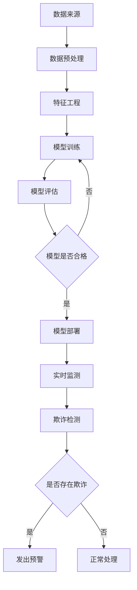

# 智能保险理赔欺诈预防系统

> 关键词：智能保险理赔、欺诈预防、数据挖掘、机器学习、深度学习、规则引擎、风险评估

> 摘要：本文围绕智能保险理赔欺诈预防系统展开深入探讨。首先介绍了该系统开发的背景、目的、预期读者和文档结构，对相关术语进行了详细解释。接着阐述了系统涉及的核心概念及其联系，包括数据来源、欺诈特征、风险评估模型等，并给出了相应的文本示意图和 Mermaid 流程图。然后详细讲解了核心算法原理，如机器学习中的决策树、随机森林，深度学习中的神经网络等，同时给出了 Python 源代码示例。在数学模型和公式部分，对风险评估公式、损失预测公式等进行了详细推导和举例说明。通过项目实战，介绍了开发环境搭建、源代码实现及代码解读。还列举了系统的实际应用场景，推荐了学习资源、开发工具框架和相关论文著作。最后总结了系统未来的发展趋势与挑战，并对常见问题进行了解答，提供了扩展阅读和参考资料。

## 1. 背景介绍 
### 1.1 目的和范围
保险理赔欺诈是保险行业面临的一个严重问题，它不仅会导致保险公司的经济损失，还会影响整个保险市场的健康发展。智能保险理赔欺诈预防系统的目的是利用先进的信息技术和数据分析方法，对保险理赔申请进行实时监测和分析，识别出可能存在的欺诈行为，从而降低保险公司的理赔风险，提高理赔效率，保障保险市场的公平和稳定。

本系统的范围涵盖了各类保险业务，包括人寿保险、健康保险、财产保险等。系统将对理赔申请中的各种信息进行收集、整理和分析，包括投保人信息、保险合同信息、理赔申请信息、医疗记录、事故现场照片等，通过多种技术手段对这些信息进行挖掘和分析，以识别出潜在的欺诈行为。

### 1.2 预期读者
本文的预期读者包括保险行业的从业者，如保险公司的理赔人员、风险管理人员、数据分析师等；信息技术领域的专业人士，如软件开发工程师、数据科学家、机器学习工程师等；以及对保险理赔欺诈预防感兴趣的研究人员和学者。

### 1.3 文档结构概述
本文将按照以下结构进行组织：
- 背景介绍：介绍系统的开发背景、目的、预期读者和文档结构。
- 核心概念与联系：阐述系统涉及的核心概念及其联系，包括数据来源、欺诈特征、风险评估模型等。
- 核心算法原理 & 具体操作步骤：详细讲解系统使用的核心算法原理，如机器学习算法、深度学习算法等，并给出具体的操作步骤和 Python 源代码示例。
- 数学模型和公式 & 详细讲解 & 举例说明：介绍系统中使用的数学模型和公式，如风险评估公式、损失预测公式等，并进行详细讲解和举例说明。
- 项目实战：通过一个实际的项目案例，介绍系统的开发环境搭建、源代码实现和代码解读。
- 实际应用场景：列举系统在保险行业中的实际应用场景。
- 工具和资源推荐：推荐一些学习和开发智能保险理赔欺诈预防系统的工具和资源，包括书籍、在线课程、技术博客、开发工具框架和相关论文著作等。
- 总结：未来发展趋势与挑战：总结智能保险理赔欺诈预防系统的未来发展趋势和面临的挑战。
- 附录：常见问题与解答：对一些常见问题进行解答。
- 扩展阅读 & 参考资料：提供一些扩展阅读的资料和参考资料。

### 1.4 术语表
#### 1.4.1 核心术语定义
- **保险理赔欺诈**：指投保人、被保险人或受益人故意制造虚假的保险事故，或者夸大损失程度，以获取保险金的行为。
- **智能保险理赔欺诈预防系统**：利用先进的信息技术和数据分析方法，对保险理赔申请进行实时监测和分析，识别出可能存在的欺诈行为的系统。
- **数据挖掘**：从大量的数据中提取有价值的信息和知识的过程。
- **机器学习**：让计算机通过数据学习模式和规律，从而进行预测和决策的技术。
- **深度学习**：一种基于人工神经网络的机器学习技术，能够自动从数据中学习复杂的特征和模式。
- **规则引擎**：一种基于规则的推理系统，能够根据预设的规则对输入的数据进行判断和决策。
- **风险评估**：对保险理赔申请中存在的欺诈风险进行评估和量化的过程。

#### 1.4.2 相关概念解释
- **数据预处理**：在进行数据分析之前，对原始数据进行清洗、转换和集成等操作，以提高数据的质量和可用性。
- **特征工程**：从原始数据中提取和选择有价值的特征，以提高机器学习模型的性能。
- **模型训练**：使用历史数据对机器学习模型进行训练，以学习数据中的模式和规律。
- **模型评估**：使用测试数据对训练好的机器学习模型进行评估，以衡量模型的性能和准确性。
- **模型部署**：将训练好的机器学习模型部署到实际生产环境中，以进行实时的欺诈检测和风险评估。

#### 1.4.3 缩略词列表
- **AI**：Artificial Intelligence，人工智能
- **ML**：Machine Learning，机器学习
- **DL**：Deep Learning，深度学习
- **ANN**：Artificial Neural Network，人工神经网络
- **DT**：Decision Tree，决策树
- **RF**：Random Forest，随机森林
- **SVM**：Support Vector Machine，支持向量机
- **LR**：Logistic Regression，逻辑回归
- **KNN**：K-Nearest Neighbors，K近邻算法

## 2. 核心概念与联系 
### 核心概念原理
智能保险理赔欺诈预防系统主要涉及以下几个核心概念：
- **数据来源**：系统的数据来源主要包括保险公司的内部数据和外部数据。内部数据包括投保人信息、保险合同信息、理赔申请信息等；外部数据包括医疗记录、事故现场照片、交通违章记录等。
- **欺诈特征**：欺诈特征是指能够反映保险理赔申请中存在欺诈行为的特征。常见的欺诈特征包括理赔申请时间异常、理赔金额过高、医疗记录异常、事故现场照片不符等。
- **风险评估模型**：风险评估模型是指用于对保险理赔申请中存在的欺诈风险进行评估和量化的模型。常见的风险评估模型包括机器学习模型、深度学习模型和规则引擎等。
- **预警机制**：预警机制是指当系统检测到保险理赔申请中存在潜在的欺诈行为时，能够及时发出预警信息的机制。预警信息可以通过短信、邮件、系统消息等方式发送给相关人员。

### 文本示意图
```plaintext
智能保险理赔欺诈预防系统
|
|-- 数据来源
|   |-- 内部数据
|   |   |-- 投保人信息
|   |   |-- 保险合同信息
|   |   |-- 理赔申请信息
|   |-- 外部数据
|       |-- 医疗记录
|       |-- 事故现场照片
|       |-- 交通违章记录
|
|-- 欺诈特征
|   |-- 理赔申请时间异常
|   |-- 理赔金额过高
|   |-- 医疗记录异常
|   |-- 事故现场照片不符
|
|-- 风险评估模型
|   |-- 机器学习模型
|   |   |-- 决策树
|   |   |-- 随机森林
|   |   |-- 支持向量机
|   |   |-- 逻辑回归
|   |   |-- K近邻算法
|   |-- 深度学习模型
|   |   |-- 人工神经网络
|   |-- 规则引擎
|
|-- 预警机制
|   |-- 短信预警
|   |-- 邮件预警
|   |-- 系统消息预警
```

### Mermaid 流程图


## 3. 核心算法原理 & 具体操作步骤 
### 决策树算法原理
决策树是一种基于树结构进行决策的机器学习算法。它通过对数据进行递归划分，将数据集划分为不同的子集，每个子集对应一个决策节点，最终形成一棵决策树。决策树的每个内部节点表示一个特征上的测试，每个分支表示一个测试输出，每个叶节点表示一个类别或值。

决策树的构建过程主要包括以下几个步骤：
1. **选择最优特征**：从所有特征中选择一个最优特征作为当前节点的划分特征。
2. **划分数据集**：根据选择的最优特征，将数据集划分为不同的子集。
3. **递归构建子树**：对每个子集递归地执行步骤 1 和步骤 2，直到满足终止条件。
4. **生成决策树**：当所有子集都满足终止条件时，生成最终的决策树。

### Python 代码实现
```python
from sklearn.datasets import load_iris
from sklearn.model_selection import train_test_split
from sklearn.tree import DecisionTreeClassifier
from sklearn.metrics import accuracy_score

# 加载数据集
iris = load_iris()
X = iris.data
y = iris.target

# 划分训练集和测试集
X_train, X_test, y_train, y_test = train_test_split(X, y, test_size=0.3, random_state=42)

# 创建决策树分类器
clf = DecisionTreeClassifier()

# 训练模型
clf.fit(X_train, y_train)

# 预测
y_pred = clf.predict(X_test)

# 评估模型
accuracy = accuracy_score(y_test, y_pred)
print(f"Accuracy: {accuracy}")
```

### 随机森林算法原理
随机森林是一种集成学习算法，它通过组合多个决策树来提高模型的性能。随机森林的基本思想是在训练过程中，从原始数据集中有放回地随机抽取多个子集，每个子集用于训练一棵决策树，最终通过对所有决策树的预测结果进行投票或平均来得到最终的预测结果。

随机森林的构建过程主要包括以下几个步骤：
1. **随机抽样**：从原始数据集中有放回地随机抽取多个子集，每个子集用于训练一棵决策树。
2. **构建决策树**：对每个子集分别构建一棵决策树。
3. **预测**：对于新的样本，将其输入到所有决策树中进行预测，最终通过对所有决策树的预测结果进行投票或平均来得到最终的预测结果。

### Python 代码实现
```python
from sklearn.datasets import load_iris
from sklearn.model_selection import train_test_split
from sklearn.ensemble import RandomForestClassifier
from sklearn.metrics import accuracy_score

# 加载数据集
iris = load_iris()
X = iris.data
y = iris.target

# 划分训练集和测试集
X_train, X_test, y_train, y_test = train_test_split(X, y, test_size=0.3, random_state=42)

# 创建随机森林分类器
clf = RandomForestClassifier()

# 训练模型
clf.fit(X_train, y_train)

# 预测
y_pred = clf.predict(X_test)

# 评估模型
accuracy = accuracy_score(y_test, y_pred)
print(f"Accuracy: {accuracy}")
```

### 神经网络算法原理
神经网络是一种模仿人类神经系统的机器学习算法，它由多个神经元组成，每个神经元接收输入信号，经过加权求和和非线性变换后输出一个信号。神经网络通过不断调整神经元之间的权重来学习数据中的模式和规律。

神经网络的训练过程主要包括以下几个步骤：
1. **初始化权重**：随机初始化神经网络中所有神经元之间的权重。
2. **前向传播**：将输入数据输入到神经网络中，通过神经元之间的加权求和和非线性变换，得到输出结果。
3. **计算损失**：根据输出结果和真实标签，计算损失函数的值。
4. **反向传播**：根据损失函数的值，通过反向传播算法计算每个神经元的梯度。
5. **更新权重**：根据梯度，更新神经网络中所有神经元之间的权重。
6. **重复步骤 2 - 5**：重复执行步骤 2 - 5，直到损失函数的值收敛或达到预设的迭代次数。

### Python 代码实现
```python
import tensorflow as tf
from tensorflow.keras.datasets import mnist
from tensorflow.keras.models import Sequential
from tensorflow.keras.layers import Dense, Flatten
from tensorflow.keras.utils import to_categorical

# 加载数据集
(X_train, y_train), (X_test, y_test) = mnist.load_data()

# 数据预处理
X_train = X_train / 255.0
X_test = X_test / 255.0
y_train = to_categorical(y_train)
y_test = to_categorical(y_test)

# 创建神经网络模型
model = Sequential([
    Flatten(input_shape=(28, 28)),
    Dense(128, activation='relu'),
    Dense(10, activation='softmax')
])

# 编译模型
model.compile(optimizer='adam',
              loss='categorical_crossentropy',
              metrics=['accuracy'])

# 训练模型
model.fit(X_train, y_train, epochs=5, batch_size=32)

# 评估模型
_, accuracy = model.evaluate(X_test, y_test)
print(f"Accuracy: {accuracy}")
```

## 4. 数学模型和公式 & 详细讲解 & 举例说明 
### 风险评估公式
风险评估公式用于对保险理赔申请中存在的欺诈风险进行评估和量化。常见的风险评估公式包括逻辑回归模型和决策树模型等。

#### 逻辑回归模型
逻辑回归模型是一种常用的分类模型，它通过对输入特征进行线性组合，然后通过逻辑函数将线性组合的结果映射到 [0, 1] 区间内，得到一个概率值。逻辑回归模型的数学公式如下：
$$P(y=1|x)=\frac{1}{1+e^{-(w_0 + w_1x_1 + w_2x_2 + \cdots + w_nx_n)}}$$
其中，$P(y=1|x)$ 表示在输入特征 $x$ 的条件下，输出为 1 的概率；$w_0, w_1, w_2, \cdots, w_n$ 是模型的参数；$x_1, x_2, \cdots, x_n$ 是输入特征。

#### 决策树模型
决策树模型是一种基于树结构进行决策的模型，它通过对输入特征进行递归划分，将数据集划分为不同的子集，每个子集对应一个决策节点，最终形成一棵决策树。决策树模型的数学公式可以表示为：
$$y = f(x)$$
其中，$y$ 是输出结果；$x$ 是输入特征；$f(x)$ 是决策树模型的决策函数。

### 损失预测公式
损失预测公式用于对保险理赔申请中的损失金额进行预测。常见的损失预测公式包括线性回归模型和神经网络模型等。

#### 线性回归模型
线性回归模型是一种常用的回归模型，它通过对输入特征进行线性组合，得到一个预测值。线性回归模型的数学公式如下：
$$y = w_0 + w_1x_1 + w_2x_2 + \cdots + w_nx_n$$
其中，$y$ 是预测值；$w_0, w_1, w_2, \cdots, w_n$ 是模型的参数；$x_1, x_2, \cdots, x_n$ 是输入特征。

#### 神经网络模型
神经网络模型是一种模仿人类神经系统的模型，它由多个神经元组成，每个神经元接收输入信号，经过加权求和和非线性变换后输出一个信号。神经网络模型的数学公式可以表示为：
$$y = f(Wx + b)$$
其中，$y$ 是输出结果；$x$ 是输入特征；$W$ 是神经网络的权重矩阵；$b$ 是神经网络的偏置向量；$f$ 是神经网络的激活函数。

### 举例说明
假设我们有一个保险理赔数据集，包含以下特征：投保人年龄、投保金额、理赔申请时间、理赔金额等。我们可以使用逻辑回归模型对保险理赔申请中存在的欺诈风险进行评估和量化。具体步骤如下：
1. **数据预处理**：对原始数据进行清洗、转换和集成等操作，以提高数据的质量和可用性。
2. **特征工程**：从原始数据中提取和选择有价值的特征，以提高模型的性能。
3. **模型训练**：使用历史数据对逻辑回归模型进行训练，以学习数据中的模式和规律。
4. **模型评估**：使用测试数据对训练好的逻辑回归模型进行评估，以衡量模型的性能和准确性。
5. **模型部署**：将训练好的逻辑回归模型部署到实际生产环境中，以进行实时的欺诈检测和风险评估。

以下是一个使用 Python 实现逻辑回归模型的示例代码：
```python
import pandas as pd
from sklearn.model_selection import train_test_split
from sklearn.linear_model import LogisticRegression
from sklearn.metrics import accuracy_score

# 加载数据集
data = pd.read_csv('insurance_claims.csv')

# 数据预处理
X = data.drop('fraudulent', axis=1)
y = data['fraudulent']

# 划分训练集和测试集
X_train, X_test, y_train, y_test = train_test_split(X, y, test_size=0.3, random_state=42)

# 创建逻辑回归模型
clf = LogisticRegression()

# 训练模型
clf.fit(X_train, y_train)

# 预测
y_pred = clf.predict(X_test)

# 评估模型
accuracy = accuracy_score(y_test, y_pred)
print(f"Accuracy: {accuracy}")
```

## 5. 项目实战：代码实际案例和详细解释说明 
### 5.1  开发环境搭建
#### 安装 Python
首先，需要安装 Python 环境。可以从 Python 官方网站（https://www.python.org/downloads/）下载并安装适合自己操作系统的 Python 版本。建议安装 Python 3.7 及以上版本。

#### 安装必要的库
在安装好 Python 后，需要安装一些必要的库，如 Pandas、NumPy、Scikit-learn、TensorFlow 等。可以使用以下命令来安装这些库：
```bash
pip install pandas numpy scikit-learn tensorflow
```

#### 安装开发工具
可以选择使用 PyCharm、Jupyter Notebook 等开发工具来进行项目开发。PyCharm 是一款专业的 Python 集成开发环境，提供了丰富的功能和工具；Jupyter Notebook 是一款交互式的开发环境，适合进行数据探索和模型训练。

### 5.2  源代码详细实现和代码解读
#### 数据加载和预处理
```python
import pandas as pd
from sklearn.preprocessing import StandardScaler

# 加载数据集
data = pd.read_csv('insurance_claims.csv')

# 分离特征和标签
X = data.drop('fraudulent', axis=1)
y = data['fraudulent']

# 数据标准化
scaler = StandardScaler()
X = scaler.fit_transform(X)
```
代码解读：
- 首先使用 Pandas 库的 `read_csv` 函数加载保险理赔数据集。
- 然后使用 `drop` 函数将标签列（`fraudulent`）从特征数据中分离出来。
- 最后使用 `StandardScaler` 对特征数据进行标准化处理，以提高模型的性能。

#### 模型训练和评估
```python
from sklearn.model_selection import train_test_split
from sklearn.ensemble import RandomForestClassifier
from sklearn.metrics import accuracy_score, confusion_matrix

# 划分训练集和测试集
X_train, X_test, y_train, y_test = train_test_split(X, y, test_size=0.3, random_state=42)

# 创建随机森林分类器
clf = RandomForestClassifier()

# 训练模型
clf.fit(X_train, y_train)

# 预测
y_pred = clf.predict(X_test)

# 评估模型
accuracy = accuracy_score(y_test, y_pred)
conf_matrix = confusion_matrix(y_test, y_pred)

print(f"Accuracy: {accuracy}")
print(f"Confusion Matrix:\n{conf_matrix}")
```
代码解读：
- 使用 `train_test_split` 函数将数据集划分为训练集和测试集，其中测试集占比为 30%。
- 创建一个随机森林分类器，并使用训练集数据对其进行训练。
- 使用训练好的模型对测试集数据进行预测。
- 使用 `accuracy_score` 函数计算模型的准确率，使用 `confusion_matrix` 函数计算混淆矩阵。

### 5.3  代码解读与分析
#### 数据预处理的重要性
数据预处理是机器学习项目中非常重要的一步，它可以提高数据的质量和可用性，从而提高模型的性能。在本项目中，我们对特征数据进行了标准化处理，使得所有特征具有相同的尺度，避免了某些特征对模型的影响过大。

#### 模型选择和评估
在本项目中，我们选择了随机森林分类器作为模型。随机森林是一种集成学习算法，它通过组合多个决策树来提高模型的性能。我们使用准确率和混淆矩阵来评估模型的性能，准确率可以直观地反映模型的分类效果，混淆矩阵可以更详细地展示模型在不同类别上的分类情况。

## 6. 实际应用场景 
### 人寿保险理赔欺诈预防
在人寿保险理赔中，欺诈行为主要包括故意隐瞒健康状况、制造虚假死亡证明等。智能保险理赔欺诈预防系统可以通过对投保人的健康记录、家族病史、理赔申请时间等信息进行分析，识别出可能存在的欺诈行为。例如，如果投保人在投保后不久就申请理赔，且理赔金额较高，系统可以自动发出预警信息，提醒理赔人员进行进一步的调查。

### 健康保险理赔欺诈预防
在健康保险理赔中，欺诈行为主要包括虚假医疗费用报销、过度医疗等。智能保险理赔欺诈预防系统可以通过对医疗记录、药品清单、检查报告等信息进行分析，识别出可能存在的欺诈行为。例如，如果医疗费用报销金额过高，且与病情不符，系统可以自动发出预警信息，提醒理赔人员进行进一步的核实。

### 财产保险理赔欺诈预防
在财产保险理赔中，欺诈行为主要包括故意制造保险事故、夸大损失程度等。智能保险理赔欺诈预防系统可以通过对事故现场照片、维修记录、警方报告等信息进行分析，识别出可能存在的欺诈行为。例如，如果事故现场照片显示车辆损失并不严重，但理赔申请中却要求高额的维修费用，系统可以自动发出预警信息，提醒理赔人员进行进一步的调查。

## 7. 工具和资源推荐
### 7.1 学习资源推荐
#### 7.1.1 书籍推荐
- 《Python 机器学习》：这本书详细介绍了使用 Python 进行机器学习的方法和技术，包括数据预处理、特征工程、模型训练和评估等方面的内容。
- 《深度学习》：这本书是深度学习领域的经典著作，由深度学习领域的三位先驱 Ian Goodfellow、Yoshua Bengio 和 Aaron Courville 合著，系统地介绍了深度学习的基本概念、算法和应用。
- 《数据挖掘：概念与技术》：这本书是数据挖掘领域的经典教材，详细介绍了数据挖掘的基本概念、算法和应用，包括关联规则挖掘、分类算法、聚类算法等方面的内容。

#### 7.1.2 在线课程
- Coursera 上的《机器学习》课程：由斯坦福大学教授 Andrew Ng 主讲，是机器学习领域的经典课程，系统地介绍了机器学习的基本概念、算法和应用。
- edX 上的《深度学习》课程：由 DeepLearning.AI 提供，是深度学习领域的权威课程，详细介绍了深度学习的基本概念、算法和应用，包括神经网络、卷积神经网络、循环神经网络等方面的内容。
- Kaggle 上的《机器学习微课程》：由 Kaggle 提供，是一系列短小精悍的机器学习课程，适合初学者快速入门机器学习。

#### 7.1.3 技术博客和网站
- Medium：一个汇聚了众多技术专家和开发者的博客平台，上面有很多关于机器学习、深度学习、数据挖掘等领域的优质文章。
- Towards Data Science：一个专注于数据科学领域的博客平台，上面有很多关于机器学习、深度学习、数据挖掘等领域的优质文章。
- Kaggle：一个数据科学竞赛平台，上面有很多关于机器学习、深度学习、数据挖掘等领域的数据集和竞赛项目，可以通过参与竞赛来提高自己的技术水平。

### 7.2 开发工具框架推荐
#### 7.2.1 IDE和编辑器
- PyCharm：一款专业的 Python 集成开发环境，提供了丰富的功能和工具，如代码编辑、调试、版本控制等。
- Jupyter Notebook：一款交互式的开发环境，适合进行数据探索和模型训练，支持 Python、R、Julia 等多种编程语言。
- Visual Studio Code：一款轻量级的代码编辑器，支持多种编程语言，提供了丰富的插件和扩展，可以方便地进行 Python 开发。

#### 7.2.2 调试和性能分析工具
- PySnooper：一个简单易用的 Python 调试工具，可以自动记录函数的调用过程和变量的值，方便进行调试。
- cProfile：Python 内置的性能分析工具，可以统计函数的调用次数、执行时间等信息，帮助开发者找出性能瓶颈。
- TensorBoard：TensorFlow 提供的可视化工具，可以可视化模型的训练过程、损失函数的变化曲线等信息，方便开发者进行模型调优。

#### 7.2.3 相关框架和库
- Pandas：一个强大的数据处理和分析库，提供了 DataFrame 和 Series 等数据结构，方便进行数据清洗、转换和分析。
- NumPy：一个基础的科学计算库，提供了多维数组对象和各种数学函数，是许多机器学习和深度学习库的基础。
- Scikit-learn：一个简单易用的机器学习库，提供了各种机器学习算法和工具，如分类、回归、聚类、降维等。
- TensorFlow：一个开源的深度学习框架，由 Google 开发，提供了各种深度学习模型和工具，如神经网络、卷积神经网络、循环神经网络等。
- PyTorch：一个开源的深度学习框架，由 Facebook 开发，提供了动态图机制，方便进行模型开发和调试。

### 7.3 相关论文著作推荐
#### 7.3.1 经典论文
- 《A Decision-Theoretic Generalization of On-Line Learning and an Application to Boosting》：这篇论文提出了 AdaBoost 算法，是集成学习领域的经典论文。
- 《ImageNet Classification with Deep Convolutional Neural Networks》：这篇论文提出了 AlexNet 模型，是卷积神经网络领域的经典论文，开启了深度学习在计算机视觉领域的广泛应用。
- 《Long Short-Term Memory》：这篇论文提出了 LSTM 模型，是循环神经网络领域的经典论文，解决了传统循环神经网络中的梯度消失和梯度爆炸问题。

#### 7.3.2 最新研究成果
- 《Attention Is All You Need》：这篇论文提出了 Transformer 模型，是自然语言处理领域的最新研究成果，具有很强的并行计算能力和长序列处理能力。
- 《Generative Adversarial Networks》：这篇论文提出了生成对抗网络（GAN），是生成模型领域的最新研究成果，具有很强的生成能力。
- 《BERT: Pre-training of Deep Bidirectional Transformers for Language Understanding》：这篇论文提出了 BERT 模型，是自然语言处理领域的最新研究成果，在多个自然语言处理任务上取得了优异的成绩。

#### 7.3.3 应用案例分析
- 《Fraud Detection in Insurance Claims Using Machine Learning Techniques》：这篇论文介绍了使用机器学习技术进行保险理赔欺诈检测的应用案例，详细分析了数据预处理、特征工程、模型训练和评估等方面的内容。
- 《Deep Learning for Insurance Fraud Detection》：这篇论文介绍了使用深度学习技术进行保险理赔欺诈检测的应用案例，详细分析了深度学习模型的设计和训练过程。
- 《Data Mining Techniques for Insurance Fraud Detection》：这篇论文介绍了使用数据挖掘技术进行保险理赔欺诈检测的应用案例，详细分析了关联规则挖掘、分类算法、聚类算法等数据挖掘技术在保险理赔欺诈检测中的应用。

## 8. 总结：未来发展趋势与挑战
### 未来发展趋势
#### 融合多种技术
未来的智能保险理赔欺诈预防系统将融合多种技术，如机器学习、深度学习、自然语言处理、计算机视觉等，以提高系统的欺诈检测能力和准确性。例如，通过自然语言处理技术对理赔申请文本进行分析，提取关键信息；通过计算机视觉技术对事故现场照片进行分析，识别车辆损失情况。

#### 实时监测和预警
未来的系统将具备实时监测和预警能力，能够在理赔申请提交后立即进行分析和评估，及时发现潜在的欺诈行为，并发出预警信息。这将大大提高保险公司的理赔效率和风险控制能力。

#### 个性化服务
未来的系统将能够根据不同的客户群体和保险产品，提供个性化的欺诈预防服务。例如，对于高风险客户群体，系统可以采用更加严格的欺诈检测策略；对于不同类型的保险产品，系统可以采用不同的特征和模型进行欺诈检测。

### 挑战
#### 数据质量和隐私问题
智能保险理赔欺诈预防系统需要大量的高质量数据来进行模型训练和评估。然而，数据质量和隐私问题是当前面临的主要挑战之一。一方面，数据中可能存在噪声、缺失值和异常值等问题，需要进行数据清洗和预处理；另一方面，数据隐私问题也需要得到重视，需要采取有效的措施来保护客户的隐私信息。

#### 模型可解释性问题
机器学习和深度学习模型通常是黑盒模型，难以解释其决策过程和结果。在保险理赔欺诈预防领域，模型的可解释性非常重要，因为理赔人员需要了解模型为什么会做出这样的决策，以便进行进一步的调查和核实。因此，如何提高模型的可解释性是当前面临的一个重要挑战。

#### 对抗性攻击问题
随着智能保险理赔欺诈预防系统的广泛应用，欺诈者也会采用各种手段来对抗系统的检测，如伪造数据、篡改信息等。如何应对对抗性攻击问题，提高系统的鲁棒性和安全性，是当前面临的一个重要挑战。

## 9. 附录：常见问题与解答
### 问题 1：智能保险理赔欺诈预防系统的准确率能达到多少？
解答：系统的准确率受到多种因素的影响，如数据质量、模型选择、特征工程等。一般来说，通过合理的数据预处理、特征工程和模型选择，系统的准确率可以达到 80% 以上。但是，在实际应用中，还需要结合人工审核和调查来进一步提高欺诈检测的准确性。

### 问题 2：系统需要哪些数据来进行欺诈检测？
解答：系统需要的数据主要包括保险公司的内部数据和外部数据。内部数据包括投保人信息、保险合同信息、理赔申请信息等；外部数据包括医疗记录、事故现场照片、交通违章记录等。通过对这些数据进行综合分析，可以提高欺诈检测的准确性。

### 问题 3：系统可以应用于哪些保险业务？
解答：系统可以应用于各类保险业务，包括人寿保险、健康保险、财产保险等。不同类型的保险业务可能需要不同的特征和模型来进行欺诈检测，但系统的基本原理和方法是相似的。

### 问题 4：系统的部署和维护成本高吗？
解答：系统的部署和维护成本取决于系统的规模和复杂度。一般来说，系统的部署需要一定的硬件和软件资源，维护成本主要包括数据更新、模型优化、系统升级等方面的费用。但是，通过合理的架构设计和技术选型，可以降低系统的部署和维护成本。

## 10. 扩展阅读 & 参考资料
### 扩展阅读
- 《人工智能：现代方法》：这本书系统地介绍了人工智能的基本概念、算法和应用，是人工智能领域的经典教材。
- 《大数据时代：生活、工作与思维的大变革》：这本书介绍了大数据的基本概念、技术和应用，探讨了大数据对社会和经济的影响。
- 《智能时代：大数据与智能革命重新定义未来》：这本书介绍了智能时代的基本特征和发展趋势，探讨了人工智能、大数据等技术对未来社会的影响。

### 参考资料
- 《保险欺诈防范与处理》：这本书详细介绍了保险欺诈的类型、手段和防范措施，是保险行业从业者的重要参考资料。
- 《机器学习实战》：这本书通过实际案例介绍了机器学习的基本概念、算法和应用，是机器学习初学者的入门书籍。
- 《深度学习实战》：这本书通过实际案例介绍了深度学习的基本概念、算法和应用，是深度学习初学者的入门书籍。

作者：AI天才研究院/AI Genius Institute & 禅与计算机程序设计艺术 /Zen And The Art of Computer Programming