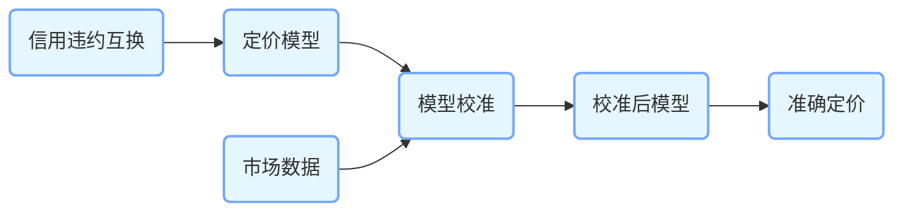

# 智能信用违约互换定价模型校准系统

> 关键词：智能信用违约互换、定价模型校准、信用风险、金融衍生品、系统开发

> 摘要：本文聚焦于智能信用违约互换定价模型校准系统，深入探讨了该系统相关的核心概念、算法原理、数学模型等内容。详细阐述了如何构建和实现该系统，包括开发环境搭建、源代码实现与解读。同时分析了系统在实际金融场景中的应用，推荐了学习、开发所需的工具和资源，最后对系统未来的发展趋势与挑战进行了总结，并给出常见问题解答和扩展阅读参考资料，旨在为金融科技领域专业人士和研究者提供全面且深入的技术指导。

## 1. 背景介绍 
### 1.1 目的和范围
信用违约互换（Credit Default Swap，CDS）作为一种重要的金融衍生品，在信用风险管理中发挥着关键作用。其定价的准确性直接影响到金融市场的稳定和参与者的利益。智能信用违约互换定价模型校准系统的目的在于通过先进的技术手段，对CDS定价模型进行精确校准，提高定价的准确性和可靠性。

本系统的范围涵盖了从数据采集、模型构建、校准算法实现到系统集成的整个过程。它能够处理不同类型的信用数据，支持多种常见的CDS定价模型，并提供直观的用户界面进行操作和结果展示。

### 1.2 预期读者
本文的预期读者主要包括金融科技领域的专业人士，如金融分析师、风险管理人员、量化交易员等，他们需要深入了解CDS定价和模型校准的技术细节，以更好地进行信用风险管理和投资决策。同时，也适合计算机科学和数学相关专业的研究者和学生，他们对金融领域的算法和系统开发感兴趣，希望通过本文学习如何将技术应用于金融实践。

### 1.3 文档结构概述
本文将按照以下结构进行阐述：首先介绍核心概念与联系，包括信用违约互换、定价模型和校准的基本原理，并给出相应的示意图和流程图；接着详细讲解核心算法原理和具体操作步骤，使用Python代码进行说明；然后介绍数学模型和公式，并通过实际例子进行解释；再通过项目实战展示系统的开发过程，包括环境搭建、源代码实现和代码解读；之后分析系统的实际应用场景；推荐相关的工具和资源；最后总结系统的未来发展趋势与挑战，给出常见问题解答和扩展阅读参考资料。

### 1.4 术语表
#### 1.4.1 核心术语定义
- **信用违约互换（Credit Default Swap，CDS）**：是一种金融衍生工具，买卖双方达成的一种合约，其中卖方在买方支付一定费用的前提下，在指定的信用事件发生时向买方提供赔偿。
- **定价模型**：用于确定信用违约互换合约价值的数学模型，常见的有结构化模型、简约模型等。
- **模型校准**：通过调整模型参数，使模型输出与市场观测数据相匹配的过程。

#### 1.4.2 相关概念解释
- **信用事件**：指导致信用违约互换合约触发赔偿的事件，如债务人违约、破产等。
- **违约概率**：指债务人在一定时间内发生违约的可能性，是CDS定价的重要输入参数。
- **回收率**：指在债务人违约后，债权人能够收回的债务比例。

#### 1.4.3 缩略词列表
- **CDS**：Credit Default Swap，信用违约互换
- **Merton模型**：Merton's Structural Model，默顿结构化模型
- **Hull - White模型**：Hull - White Interest Rate Model，赫尔 - 怀特利率模型

## 2. 核心概念与联系 
### 2.1 信用违约互换原理
信用违约互换的基本原理是将信用风险从一方转移到另一方。在CDS合约中，买方定期向卖方支付一定的费用（CDS利差），作为交换，卖方在指定的信用事件发生时向买方支付违约赔偿。

例如，一家银行持有一笔企业债券，为了降低该债券的信用风险，银行可以购买一份针对该企业的CDS合约。如果该企业发生违约，CDS卖方将向银行支付赔偿，从而弥补银行的损失。

### 2.2 定价模型概述
常见的CDS定价模型主要分为结构化模型和简约模型。

#### 2.2.1 结构化模型
结构化模型基于公司的资产价值和债务结构来推导违约概率。最著名的结构化模型是Merton模型，该模型假设公司的资产价值服从几何布朗运动，当资产价值低于债务价值时，公司发生违约。

#### 2.2.2 简约模型
简约模型不考虑公司的资产结构，而是直接对违约强度进行建模。常见的简约模型有Hull - White模型，该模型通过随机过程来描述违约强度的变化。

### 2.3 模型校准原理
模型校准的目的是找到一组最优的模型参数，使得模型的输出与市场观测数据尽可能接近。常用的校准方法包括最小二乘法、最大似然估计法等。

### 2.4 核心概念联系示意图


该示意图展示了信用违约互换、定价模型、模型校准之间的关系。市场数据作为输入，用于对定价模型进行校准，得到校准后的模型，从而实现对信用违约互换的准确定价。

## 3. 核心算法原理 & 具体操作步骤 
### 3.1 最小二乘法校准算法原理
最小二乘法是一种常用的模型校准方法，其基本思想是最小化模型预测值与市场观测值之间的误差平方和。

假设我们有一组市场观测数据 $(y_1, y_2, \cdots, y_n)$ 和模型预测值 $(f(x_1; \theta), f(x_2; \theta), \cdots, f(x_n; \theta))$，其中 $\theta$ 是模型参数。最小二乘法的目标是找到一组参数 $\theta^*$，使得误差平方和 $S(\theta)$ 最小：

$$S(\theta) = \sum_{i=1}^{n} (y_i - f(x_i; \theta))^2$$

### 3.2 Python代码实现最小二乘法校准
```python
import numpy as np
from scipy.optimize import least_squares

# 定义定价模型函数（示例）
def pricing_model(theta, x):
    """
    简单的线性定价模型示例
    :param theta: 模型参数
    :param x: 输入数据
    :return: 模型预测值
    """
    return theta[0] * x + theta[1]

# 定义误差函数
def error_function(theta, x, y):
    """
    误差函数，计算模型预测值与市场观测值之间的误差
    :param theta: 模型参数
    :param x: 输入数据
    :param y: 市场观测值
    :return: 误差值
    """
    return pricing_model(theta, x) - y

# 生成模拟市场数据
x_data = np.array([1, 2, 3, 4, 5])
y_data = np.array([2.1, 3.9, 6.2, 8.1, 10.0])

# 初始参数猜测
initial_theta = [1, 0]

# 使用最小二乘法进行校准
result = least_squares(error_function, initial_theta, args=(x_data, y_data))

# 输出校准后的参数
calibrated_theta = result.x
print("校准后的参数:", calibrated_theta)
```

### 3.3 具体操作步骤
1. **数据准备**：收集市场上的CDS利差数据和相关的信用数据，如违约概率、回收率等。
2. **选择定价模型**：根据实际情况选择合适的定价模型，如Merton模型或Hull - White模型。
3. **定义误差函数**：根据最小二乘法的原理，定义模型预测值与市场观测值之间的误差函数。
4. **初始参数猜测**：为模型参数提供一个初始猜测值。
5. **使用优化算法进行校准**：使用Python中的优化库（如`scipy.optimize`）对误差函数进行最小化，得到校准后的参数。

## 4. 数学模型和公式 & 详细讲解 & 举例说明 
### 4.1 Merton模型数学公式
Merton模型假设公司的资产价值 $V_t$ 服从几何布朗运动：

$$dV_t = \mu V_t dt + \sigma V_t dW_t$$

其中，$\mu$ 是资产的预期收益率，$\sigma$ 是资产的波动率，$W_t$ 是标准布朗运动。

公司在时间 $T$ 发生违约的条件是 $V_T < D$，其中 $D$ 是公司的债务价值。违约概率 $PD$ 可以通过以下公式计算：

$$PD = N\left(-\frac{\ln\left(\frac{V_0}{D}\right) + \left(\mu - \frac{\sigma^2}{2}\right)T}{\sigma\sqrt{T}}\right)$$

其中，$N(\cdot)$ 是标准正态分布的累积分布函数。

### 4.2 举例说明Merton模型应用
假设一家公司的初始资产价值 $V_0 = 100$，债务价值 $D = 80$，资产的预期收益率 $\mu = 0.1$，资产的波动率 $\sigma = 0.2$，时间期限 $T = 1$ 年。

首先，计算违约概率：

```python
import scipy.stats as stats
import numpy as np

V0 = 100
D = 80
mu = 0.1
sigma = 0.2
T = 1

d = - (np.log(V0 / D) + (mu - 0.5 * sigma**2) * T) / (sigma * np.sqrt(T))
PD = stats.norm.cdf(d)

print("违约概率:", PD)
```

### 4.3 CDS定价公式
CDS的定价可以通过计算预期现金流的现值来实现。假设CDS利差为 $s$，违约概率为 $PD$，回收率为 $R$，无风险利率为 $r$。

CDS买方的预期现金流现值 $PV_{buyer}$ 为：

$$PV_{buyer} = s \sum_{i=1}^{n} e^{-r t_i} (1 - PD_{t_i}) \Delta t_i$$

CDS卖方的预期现金流现值 $PV_{seller}$ 为：

$$PV_{seller} = (1 - R) \sum_{i=1}^{n} e^{-r t_i} PD_{t_i} \Delta t_i$$

在市场均衡状态下，$PV_{buyer} = PV_{seller}$，从而可以求解出CDS利差 $s$。

### 4.4 举例说明CDS定价
假设无风险利率 $r = 0.05$，违约概率 $PD = 0.1$，回收率 $R = 0.4$，时间期限为 5 年，每年支付一次CDS利差。

```python
import numpy as np

r = 0.05
PD = 0.1
R = 0.4
n = 5
dt = 1

# 计算CDS买方预期现金流现值
PV_buyer = 0
for i in range(1, n + 1):
    PV_buyer += np.exp(-r * i) * (1 - PD) * dt

# 计算CDS卖方预期现金流现值
PV_seller = (1 - R) * np.sum([np.exp(-r * i) * PD * dt for i in range(1, n + 1)])

# 求解CDS利差
s = PV_seller / PV_buyer

print("CDS利差:", s)
```

## 5. 项目实战：代码实际案例和详细解释说明 
### 5.1  开发环境搭建
#### 5.1.1 安装Python
首先，需要安装Python环境。可以从Python官方网站（https://www.python.org/downloads/）下载适合自己操作系统的Python版本。建议安装Python 3.7及以上版本。

#### 5.1.2 安装必要的库
使用以下命令安装项目所需的Python库：
```sh
pip install numpy scipy pandas matplotlib
```
- `numpy`：用于数值计算。
- `scipy`：提供优化算法等科学计算工具。
- `pandas`：用于数据处理和分析。
- `matplotlib`：用于数据可视化。

### 5.2  源代码详细实现和代码解读
```python
import numpy as np
import pandas as pd
from scipy.optimize import least_squares
import matplotlib.pyplot as plt

# 定义定价模型函数（这里使用简单的线性模型示例）
def pricing_model(theta, x):
    """
    简单的线性定价模型
    :param theta: 模型参数
    :param x: 输入数据
    :return: 模型预测值
    """
    return theta[0] * x + theta[1]

# 定义误差函数
def error_function(theta, x, y):
    """
    误差函数，计算模型预测值与市场观测值之间的误差
    :param theta: 模型参数
    :param x: 输入数据
    :param y: 市场观测值
    :return: 误差值
    """
    return pricing_model(theta, x) - y

# 生成模拟市场数据
np.random.seed(0)
x_data = np.linspace(0, 10, 100)
y_data = 2 * x_data + 1 + np.random.normal(0, 1, 100)

# 初始参数猜测
initial_theta = [1, 0]

# 使用最小二乘法进行校准
result = least_squares(error_function, initial_theta, args=(x_data, y_data))

# 输出校准后的参数
calibrated_theta = result.x
print("校准后的参数:", calibrated_theta)

# 绘制原始数据和校准后的模型曲线
plt.scatter(x_data, y_data, label='Market Data')
plt.plot(x_data, pricing_model(calibrated_theta, x_data), color='red', label='Calibrated Model')
plt.xlabel('X')
plt.ylabel('Y')
plt.title('Model Calibration')
plt.legend()
plt.show()
```

### 5.3  代码解读与分析
#### 5.3.1 导入必要的库
代码中导入了 `numpy`、`pandas`、`scipy.optimize` 和 `matplotlib.pyplot` 库，分别用于数值计算、数据处理、优化算法和数据可视化。

#### 5.3.2 定义定价模型和误差函数
`pricing_model` 函数定义了一个简单的线性定价模型，`error_function` 函数计算模型预测值与市场观测值之间的误差。

#### 5.3.3 生成模拟市场数据
使用 `numpy` 生成了一组模拟的市场数据，其中添加了一些随机噪声。

#### 5.3.4 初始参数猜测
为模型参数提供了一个初始猜测值。

#### 5.3.5 使用最小二乘法进行校准
使用 `scipy.optimize.least_squares` 函数对误差函数进行最小化，得到校准后的参数。

#### 5.3.6 绘制结果
使用 `matplotlib` 绘制原始数据和校准后的模型曲线，直观展示校准效果。

## 6. 实际应用场景 
### 6.1 金融机构信用风险管理
金融机构，如银行、保险公司等，持有大量的信用资产，面临着信用违约风险。通过使用智能信用违约互换定价模型校准系统，金融机构可以准确评估信用风险，合理定价CDS合约，从而有效管理信用风险。

例如，银行可以购买针对其贷款组合中高风险借款人的CDS合约，当借款人发生违约时，CDS卖方将提供赔偿，降低银行的损失。

### 6.2 投资组合优化
投资者在构建投资组合时，需要考虑信用风险对投资收益的影响。通过使用CDS进行信用风险对冲，投资者可以优化投资组合的风险 - 收益特征。

例如，投资者持有一组企业债券，可以同时购买针对这些企业的CDS合约，降低债券违约带来的损失，提高投资组合的稳定性。

### 6.3 信用评级机构评估
信用评级机构需要对企业的信用风险进行评估。智能信用违约互换定价模型校准系统可以为信用评级机构提供更准确的违约概率和信用利差估计，从而提高信用评级的准确性和可靠性。

## 7. 工具和资源推荐
### 7.1 学习资源推荐
#### 7.1.1 书籍推荐
- 《期权、期货及其他衍生品》（Options, Futures, and Other Derivatives），作者：John C. Hull。这本书是金融衍生品领域的经典教材，详细介绍了CDS等衍生品的定价和风险管理。
- 《信用风险建模与管理》（Credit Risk Modeling and Management），作者：Til Schuermann。该书系统地介绍了信用风险建模的理论和方法，包括CDS定价模型。

#### 7.1.2 在线课程
- Coursera上的“金融工程与风险管理”（Financial Engineering and Risk Management）课程，由哥伦比亚大学教授讲授，涵盖了金融衍生品定价和风险管理的相关知识。
- edX上的“信用风险分析与管理”（Credit Risk Analysis and Management）课程，深入介绍了信用风险的度量和管理方法。

#### 7.1.3 技术博客和网站
- 量化投资与金融科技（https://www.joinquant.com/）：提供了丰富的金融量化分析和编程教程，包括CDS定价模型的实现。
- 金融界（https://www.jrj.com.cn/）：提供金融市场的最新动态和研究报告，有助于了解CDS市场的发展趋势。

### 7.2 开发工具框架推荐
#### 7.2.1 IDE和编辑器
- PyCharm：是一款专业的Python集成开发环境，提供了丰富的代码编辑、调试和项目管理功能。
- Jupyter Notebook：是一个交互式的编程环境，适合进行数据探索和模型开发，方便展示代码和结果。

#### 7.2.2 调试和性能分析工具
- pdb：Python自带的调试工具，可以帮助开发者定位代码中的错误。
- cProfile：用于分析Python代码的性能，找出性能瓶颈。

#### 7.2.3 相关框架和库
- NumPy：用于高效的数值计算。
- SciPy：提供了优化算法、积分计算等科学计算工具。
- Pandas：用于数据处理和分析。

### 7.3 相关论文著作推荐
#### 7.3.1 经典论文
- Merton, R. C. (1974). "On the Pricing of Corporate Debt: The Risk Structure of Interest Rates". Journal of Finance, 29(2), 449 - 470. 该论文提出了著名的Merton结构化模型。
- Jarrow, R. A., & Turnbull, S. M. (1995). "Pricing Derivatives on Financial Securities Subject to Credit Risk". Journal of Finance, 50(1), 53 - 85. 该论文提出了一种基于无套利原理的信用衍生品定价方法。

#### 7.3.2 最新研究成果
- 可以通过IEEE Xplore、ACM Digital Library等学术数据库搜索关于智能信用违约互换定价模型校准的最新研究论文。

#### 7.3.3 应用案例分析
- 可以参考国际清算银行（BIS）、国际货币基金组织（IMF）等机构发布的金融稳定报告，其中包含了CDS在实际金融市场中的应用案例和分析。

## 8. 总结：未来发展趋势与挑战
### 8.1 未来发展趋势
#### 8.1.1 智能化与自动化
随着人工智能和机器学习技术的不断发展，智能信用违约互换定价模型校准系统将越来越智能化和自动化。系统可以自动收集和处理市场数据，实时调整模型参数，提高定价的准确性和效率。

#### 8.1.2 多模型融合
单一的定价模型往往存在局限性，未来的系统将采用多模型融合的方法，综合考虑不同模型的优点，提高定价的可靠性。

#### 8.1.3 与区块链技术结合
区块链技术具有去中心化、不可篡改等特点，可以提高CDS交易的透明度和安全性。未来的系统可能会与区块链技术结合，实现CDS交易的自动化和智能化。

### 8.2 挑战
#### 8.2.1 数据质量和可用性
模型校准需要大量准确的市场数据，但实际中数据质量和可用性可能存在问题。数据缺失、错误等问题会影响模型校准的准确性。

#### 8.2.2 模型复杂度和可解释性
随着模型的不断发展，模型的复杂度也在增加。复杂的模型虽然可以提高定价的准确性，但可能会降低模型的可解释性，给风险管理带来困难。

#### 8.2.3 监管要求
金融市场受到严格的监管，智能信用违约互换定价模型校准系统需要满足监管要求。如何在满足监管要求的前提下，实现系统的高效运行是一个挑战。

## 9. 附录：常见问题与解答
### 9.1 问：信用违约互换定价模型校准系统的准确性如何保证？
答：可以通过以下方法保证系统的准确性：
- 收集高质量的市场数据，包括CDS利差、违约概率、回收率等。
- 选择合适的定价模型，并进行合理的参数初始化。
- 使用有效的校准算法，如最小二乘法、最大似然估计法等。
- 对校准后的模型进行回测和验证，不断优化模型。

### 9.2 问：系统是否可以处理不同类型的信用数据？
答：是的，系统可以处理不同类型的信用数据，如企业财务数据、信用评级数据等。在实际应用中，需要根据数据的特点进行预处理和特征提取，以提高模型的性能。

### 9.3 问：如何选择合适的定价模型？
答：选择合适的定价模型需要考虑以下因素：
- 数据的可获取性：不同的定价模型需要不同类型的数据，如果某些数据难以获取，可能需要选择对数据要求较低的模型。
- 模型的复杂度：复杂的模型可能会提高定价的准确性，但也会增加计算成本和模型的可解释性难度。需要根据实际情况权衡模型的复杂度。
- 市场环境：不同的市场环境可能适合不同的定价模型。例如，在市场波动较大时，可能需要选择能够更好地捕捉市场变化的模型。

## 10. 扩展阅读 & 参考资料
- Hull, J. C. (2018). Options, Futures, and Other Derivatives (10th Edition). Pearson.
- Schuermann, T. (2014). Credit Risk Modeling and Management. Wiley.
- Merton, R. C. (1974). "On the Pricing of Corporate Debt: The Risk Structure of Interest Rates". Journal of Finance, 29(2), 449 - 470.
- Jarrow, R. A., & Turnbull, S. M. (1995). "Pricing Derivatives on Financial Securities Subject to Credit Risk". Journal of Finance, 50(1), 53 - 85.

作者：AI天才研究院/AI Genius Institute & 禅与计算机程序设计艺术 /Zen And The Art of Computer Programming