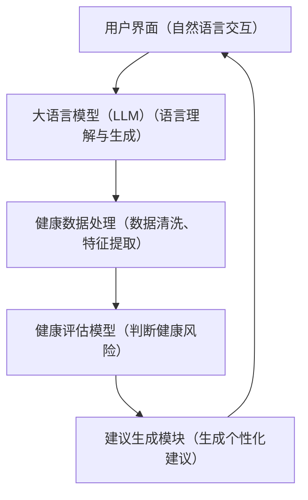

# 智能健康管理 AI Agent：LLM 驱动的个人健康助手

> 关键词：智能健康管理、AI Agent、大语言模型（LLM）、个人健康助手、健康数据处理

> 摘要：本文聚焦于智能健康管理 AI Agent，这一由大语言模型（LLM）驱动的个人健康助手。首先介绍了该技术产生的背景、目的、适用读者及文档结构等内容。接着深入阐述核心概念，包括其原理和架构，并通过文本示意图和 Mermaid 流程图进行清晰展示。详细讲解了核心算法原理，结合 Python 代码进行说明，同时给出数学模型和公式并举例。在项目实战部分，涵盖开发环境搭建、源代码实现及解读。还探讨了实际应用场景，推荐了相关学习资源、开发工具框架和论文著作。最后总结未来发展趋势与挑战，解答常见问题并提供扩展阅读与参考资料，旨在为读者全面呈现智能健康管理 AI Agent 的全貌。

## 1. 背景介绍 
### 1.1 目的和范围
在当今社会，人们对健康的关注度日益提高，同时随着信息技术的飞速发展，智能健康管理成为了一个热门领域。智能健康管理 AI Agent 的出现旨在利用先进的大语言模型（LLM）技术，为个人提供更加个性化、智能化的健康管理服务。

本文章的范围将围绕智能健康管理 AI Agent 展开，从核心概念、算法原理、数学模型、项目实战等多个方面进行详细介绍，帮助读者全面了解这一技术的原理、实现方法以及应用场景。

### 1.2 预期读者
本文预期读者包括对人工智能技术在健康管理领域应用感兴趣的技术爱好者、从事健康管理相关软件开发的程序员、关注智能健康产品的产品经理以及希望深入了解健康管理新技术的研究人员等。

### 1.3 文档结构概述
本文将按照以下结构进行阐述：首先介绍核心概念与联系，帮助读者建立对智能健康管理 AI Agent 的基本认知；接着讲解核心算法原理和具体操作步骤，通过 Python 代码详细说明；然后给出数学模型和公式并进行举例；在项目实战部分，详细介绍开发环境搭建、源代码实现和代码解读；之后探讨实际应用场景；再推荐相关的工具和资源；最后总结未来发展趋势与挑战，解答常见问题并提供扩展阅读与参考资料。

### 1.4 术语表
#### 1.4.1 核心术语定义
- **智能健康管理 AI Agent**：一种基于人工智能技术，利用大语言模型（LLM）驱动的软件程序，能够根据用户的健康数据和需求，提供个性化的健康管理建议和服务。
- **大语言模型（LLM）**：是一种基于深度学习的自然语言处理模型，具有强大的语言理解和生成能力，能够处理和生成自然语言文本。
- **健康数据**：包括个人的生理数据（如心率、血压、血糖等）、生活习惯数据（如饮食、运动、睡眠等）以及疾病史等相关信息。

#### 1.4.2 相关概念解释
- **个性化健康管理**：根据个人的健康状况、生活习惯、基因信息等因素，为每个人制定专属的健康管理方案，以达到预防疾病、促进健康的目的。
- **自然语言交互**：用户可以使用自然语言与智能健康管理 AI Agent 进行交流，就像与人类对话一样，方便快捷地获取健康信息和建议。

#### 1.4.3 缩略词列表
- **AI**：Artificial Intelligence，人工智能
- **LLM**：Large Language Model，大语言模型

## 2. 核心概念与联系 

### 核心概念原理
智能健康管理 AI Agent 的核心原理是基于大语言模型（LLM）的强大语言处理能力，结合健康数据的分析和处理技术，为用户提供个性化的健康管理服务。具体来说，它通过以下几个步骤实现：

1. **数据收集**：收集用户的健康数据，包括生理数据、生活习惯数据等。这些数据可以通过各种健康监测设备（如智能手环、智能手表、血糖仪等）以及用户的手动输入获取。
2. **数据处理**：对收集到的健康数据进行清洗、预处理和特征提取，将其转化为适合模型处理的格式。
3. **语言交互**：用户可以使用自然语言与 AI Agent 进行交流，提出健康相关的问题或需求。AI Agent 通过 LLM 对用户的输入进行理解和分析。
4. **健康评估**：根据用户的健康数据和交流内容，AI Agent 利用预设的算法和模型对用户的健康状况进行评估，判断用户是否存在健康风险。
5. **建议生成**：基于健康评估结果，AI Agent 使用 LLM 生成个性化的健康管理建议，如饮食建议、运动建议、就医建议等，并将这些建议以自然语言的形式反馈给用户。

### 架构的文本示意图
```plaintext
+---------------------+
|     用户界面       |
| （自然语言交互）    |
+---------------------+
         |
         v
+---------------------+
|  大语言模型（LLM）  |
| （语言理解与生成）  |
+---------------------+
         |
         v
+---------------------+
|    健康数据处理     |
| （数据清洗、特征提取）|
+---------------------+
         |
         v
+---------------------+
|    健康评估模型     |
| （判断健康风险）    |
+---------------------+
         |
         v
+---------------------+
|    建议生成模块     |
| （生成个性化建议）  |
+---------------------+
```

### Mermaid 流程图


## 3. 核心算法原理 & 具体操作步骤 

### 核心算法原理
智能健康管理 AI Agent 的核心算法主要涉及到健康数据的处理和分析、大语言模型的应用以及健康评估和建议生成等方面。下面我们将分别介绍这些算法的原理，并结合 Python 代码进行详细阐述。

#### 健康数据处理算法
健康数据处理的主要目的是将收集到的原始健康数据进行清洗、预处理和特征提取，以便后续的分析和建模。常见的健康数据处理算法包括数据清洗、归一化、特征选择等。

以下是一个简单的 Python 代码示例，用于对健康数据进行清洗和归一化：

```python
import numpy as np
from sklearn.preprocessing import MinMaxScaler

# 模拟健康数据
health_data = np.array([[120, 80, 70], [130, 85, 75], [110, 75, 65]])

# 数据清洗（这里简单假设没有缺失值等问题）
# 归一化处理
scaler = MinMaxScaler()
normalized_data = scaler.fit_transform(health_data)

print("原始健康数据：")
print(health_data)
print("归一化后的健康数据：")
print(normalized_data)
```

#### 大语言模型应用算法
大语言模型在智能健康管理 AI Agent 中主要用于语言理解和生成。用户通过自然语言与 AI Agent 交流，AI Agent 使用大语言模型对用户的输入进行理解，并生成相应的回复。

以下是一个使用 Hugging Face 的 Transformers 库调用预训练大语言模型（如 GPT - 2）的简单示例：

```python
from transformers import GPT2LMHeadModel, GPT2Tokenizer

# 加载预训练模型和分词器
tokenizer = GPT2Tokenizer.from_pretrained("gpt2")
model = GPT2LMHeadModel.from_pretrained("gpt2")

# 用户输入
user_input = "我最近总是失眠，该怎么办？"

# 对用户输入进行分词
input_ids = tokenizer.encode(user_input, return_tensors='pt')

# 生成回复
output = model.generate(input_ids, max_length=100, num_beams=5, no_repeat_ngram_size=2, early_stopping=True)

# 解码生成的回复
response = tokenizer.decode(output[0], skip_special_tokens=True)

print("用户输入：", user_input)
print("AI Agent 回复：", response)
```

#### 健康评估和建议生成算法
健康评估和建议生成算法根据用户的健康数据和交流内容，判断用户的健康状况，并生成相应的健康管理建议。这通常涉及到机器学习模型的训练和应用，如决策树、支持向量机等。

以下是一个简单的使用决策树模型进行健康评估的示例：

```python
from sklearn.datasets import load_iris
from sklearn.model_selection import train_test_split
from sklearn.tree import DecisionTreeClassifier

# 加载示例数据集（这里简单使用鸢尾花数据集模拟健康数据）
iris = load_iris()
X = iris.data
y = iris.target

# 划分训练集和测试集
X_train, X_test, y_train, y_test = train_test_split(X, y, test_size=0.2, random_state=42)

# 训练决策树模型
clf = DecisionTreeClassifier()
clf.fit(X_train, y_train)

# 预测测试集
y_pred = clf.predict(X_test)

print("测试集预测结果：", y_pred)
```

### 具体操作步骤
1. **数据收集**：使用各种健康监测设备或用户手动输入的方式收集健康数据。
2. **数据处理**：对收集到的健康数据进行清洗、预处理和特征提取，使用上述的健康数据处理算法。
3. **模型加载**：加载预训练的大语言模型和健康评估模型。
4. **用户交互**：用户通过自然语言与 AI Agent 进行交流，AI Agent 使用大语言模型对用户输入进行理解。
5. **健康评估**：根据用户的健康数据和交流内容，使用健康评估模型对用户的健康状况进行评估。
6. **建议生成**：基于健康评估结果，使用大语言模型生成个性化的健康管理建议，并反馈给用户。

## 4. 数学模型和公式 & 详细讲解 & 举例说明 

### 健康数据处理的数学模型和公式
#### 归一化公式
在健康数据处理中，归一化是一种常见的预处理方法，用于将数据缩放到一个特定的范围。常见的归一化方法是最小 - 最大归一化，其公式如下：

$$x_{norm}=\frac{x - x_{min}}{x_{max}-x_{min}}$$

其中，$x$ 是原始数据，$x_{min}$ 是数据的最小值，$x_{max}$ 是数据的最大值，$x_{norm}$ 是归一化后的数据。

举例说明：假设有一组健康数据 $[10, 20, 30]$，其中 $x_{min}=10$，$x_{max}=30$。对于数据点 $x = 20$，其归一化后的值为：

$$x_{norm}=\frac{20 - 10}{30 - 10}=\frac{10}{20}=0.5$$

#### 特征选择的信息增益公式
在特征选择中，信息增益是一种常用的方法，用于评估一个特征对分类的重要性。信息增益的计算公式如下：

$$IG(S, A)=H(S)-\sum_{v\in Values(A)}\frac{|S_v|}{|S|}H(S_v)$$

其中，$S$ 是数据集，$A$ 是特征，$Values(A)$ 是特征 $A$ 的取值集合，$S_v$ 是数据集 $S$ 中特征 $A$ 取值为 $v$ 的子集，$H(S)$ 是数据集 $S$ 的熵，其计算公式为：

$$H(S)=-\sum_{i = 1}^{n}p_i\log_2p_i$$

其中，$p_i$ 是数据集 $S$ 中第 $i$ 类样本的比例。

举例说明：假设有一个数据集 $S$ 包含 10 个样本，其中 6 个属于类别 1，4 个属于类别 2。则数据集 $S$ 的熵为：

$$H(S)=-\frac{6}{10}\log_2\frac{6}{10}-\frac{4}{10}\log_2\frac{4}{10}\approx0.971$$

假设特征 $A$ 有两个取值 $v_1$ 和 $v_2$，$S_{v_1}$ 包含 4 个样本，其中 3 个属于类别 1，1 个属于类别 2；$S_{v_2}$ 包含 6 个样本，其中 3 个属于类别 1，3 个属于类别 2。则：

$$H(S_{v_1})=-\frac{3}{4}\log_2\frac{3}{4}-\frac{1}{4}\log_2\frac{1}{4}\approx0.811$$

$$H(S_{v_2})=-\frac{3}{6}\log_2\frac{3}{6}-\frac{3}{6}\log_2\frac{3}{6}=1$$

$$IG(S, A)=0.971-(\frac{4}{10}\times0.811+\frac{6}{10}\times1)\approx0.971 - 0.924 = 0.047$$

### 健康评估模型的数学模型和公式
#### 决策树的基尼不纯度公式
决策树是一种常用的健康评估模型，基尼不纯度是决策树中常用的划分准则之一。基尼不纯度的计算公式如下：

$$Gini(S)=1-\sum_{i = 1}^{n}p_i^2$$

其中，$S$ 是数据集，$p_i$ 是数据集 $S$ 中第 $i$ 类样本的比例。

举例说明：假设有一个数据集 $S$ 包含 10 个样本，其中 6 个属于类别 1，4 个属于类别 2。则数据集 $S$ 的基尼不纯度为：

$$Gini(S)=1-(\frac{6}{10})^2-(\frac{4}{10})^2=1 - 0.36 - 0.16 = 0.48$$

#### 支持向量机的分类决策函数
支持向量机（SVM）也是一种常用的健康评估模型，其分类决策函数的公式如下：

$$f(x)=\text{sign}(\sum_{i = 1}^{n}\alpha_iy_iK(x_i, x)+b)$$

其中，$\alpha_i$ 是拉格朗日乘子，$y_i$ 是样本的类别标签，$K(x_i, x)$ 是核函数，$b$ 是偏置项。

举例说明：假设我们使用线性核函数 $K(x_i, x)=x_i^Tx$，并且已经训练得到了 $\alpha_i$ 和 $b$ 的值。对于一个新的样本 $x$，我们可以通过上述公式计算 $f(x)$ 的值，根据其正负来判断样本的类别。

## 5. 项目实战：代码实际案例和详细解释说明 

### 5.1  开发环境搭建
#### 安装 Python
首先，确保你已经安装了 Python 3.x 版本。你可以从 Python 官方网站（https://www.python.org/downloads/）下载并安装适合你操作系统的 Python 版本。

#### 安装必要的库
在项目中，我们需要使用一些 Python 库，如 `numpy`、`pandas`、`scikit - learn`、`transformers` 等。可以使用以下命令来安装这些库：

```sh
pip install numpy pandas scikit-learn transformers
```

#### 准备数据集
你可以使用一些公开的健康数据集，如 UCI 机器学习库中的健康相关数据集，或者使用自己收集的健康数据。将数据集保存为 CSV 或其他常见的数据格式。

### 5.2  源代码详细实现和代码解读
以下是一个完整的智能健康管理 AI Agent 的 Python 代码示例：

```python
import numpy as np
import pandas as pd
from sklearn.model_selection import train_test_split
from sklearn.tree import DecisionTreeClassifier
from transformers import GPT2LMHeadModel, GPT2Tokenizer

# 加载健康数据集
data = pd.read_csv('health_data.csv')

# 划分特征和标签
X = data.drop('label', axis=1).values
y = data['label'].values

# 划分训练集和测试集
X_train, X_test, y_train, y_test = train_test_split(X, y, test_size=0.2, random_state=42)

# 训练决策树模型
clf = DecisionTreeClassifier()
clf.fit(X_train, y_train)

# 加载预训练的大语言模型和分词器
tokenizer = GPT2Tokenizer.from_pretrained("gpt2")
model = GPT2LMHeadModel.from_pretrained("gpt2")

# 定义智能健康管理 AI Agent 类
class HealthManagementAgent:
    def __init__(self, clf, tokenizer, model):
        self.clf = clf
        self.tokenizer = tokenizer
        self.model = model

    def assess_health(self, health_data):
        # 健康评估
        prediction = self.clf.predict([health_data])
        return prediction[0]

    def generate_advice(self, health_status):
        # 生成健康建议
        input_text = f"健康状况为 {health_status}，请给出相应的健康建议。"
        input_ids = self.tokenizer.encode(input_text, return_tensors='pt')
        output = self.model.generate(input_ids, max_length=100, num_beams=5, no_repeat_ngram_size=2, early_stopping=True)
        advice = self.tokenizer.decode(output[0], skip_special_tokens=True)
        return advice

    def interact(self, health_data):
        # 用户交互
        health_status = self.assess_health(health_data)
        advice = self.generate_advice(health_status)
        return advice

# 创建 AI Agent 实例
agent = HealthManagementAgent(clf, tokenizer, model)

# 模拟用户健康数据
user_health_data = [120, 80, 70]

# 与 AI Agent 交互
advice = agent.interact(user_health_data)

print("用户健康数据：", user_health_data)
print("AI Agent 给出的健康建议：", advice)
```

### 5.3  代码解读与分析
#### 数据加载和预处理
```python
data = pd.read_csv('health_data.csv')
X = data.drop('label', axis=1).values
y = data['label'].values
X_train, X_test, y_train, y_test = train_test_split(X, y, test_size=0.2, random_state=42)
```
这部分代码用于加载健康数据集，并将数据集划分为特征和标签。然后使用 `train_test_split` 函数将数据集划分为训练集和测试集。

#### 模型训练
```python
clf = DecisionTreeClassifier()
clf.fit(X_train, y_train)
```
这部分代码使用决策树分类器对训练集进行训练。

#### 大语言模型加载
```python
tokenizer = GPT2Tokenizer.from_pretrained("gpt2")
model = GPT2LMHeadModel.from_pretrained("gpt2")
```
这部分代码加载预训练的 GPT - 2 大语言模型和分词器。

#### AI Agent 类定义
```python
class HealthManagementAgent:
    def __init__(self, clf, tokenizer, model):
        self.clf = clf
        self.tokenizer = tokenizer
        self.model = model

    def assess_health(self, health_data):
        prediction = self.clf.predict([health_data])
        return prediction[0]

    def generate_advice(self, health_status):
        input_text = f"健康状况为 {health_status}，请给出相应的健康建议。"
        input_ids = self.tokenizer.encode(input_text, return_tensors='pt')
        output = self.model.generate(input_ids, max_length=100, num_beams=5, no_repeat_ngram_size=2, early_stopping=True)
        advice = self.tokenizer.decode(output[0], skip_special_tokens=True)
        return advice

    def interact(self, health_data):
        health_status = self.assess_health(health_data)
        advice = self.generate_advice(health_status)
        return advice
```
这部分代码定义了一个 `HealthManagementAgent` 类，包含三个方法：`assess_health` 用于健康评估，`generate_advice` 用于生成健康建议，`interact` 用于与用户进行交互。

#### 与 AI Agent 交互
```python
agent = HealthManagementAgent(clf, tokenizer, model)
user_health_data = [120, 80, 70]
advice = agent.interact(user_health_data)
```
这部分代码创建了一个 `HealthManagementAgent` 实例，并模拟用户的健康数据与 AI Agent 进行交互，获取健康建议。

## 6. 实际应用场景 
### 个人健康管理
智能健康管理 AI Agent 可以作为个人的健康助手，帮助用户管理自己的健康。用户可以通过自然语言与 AI Agent 交流，查询自己的健康数据、了解健康知识、获取个性化的健康管理建议等。例如，用户可以询问“我最近血压有点高，应该注意什么？”AI Agent 可以根据用户的血压数据和相关知识，给出饮食、运动、药物等方面的建议。

### 远程医疗服务
在远程医疗场景中，智能健康管理 AI Agent 可以作为医生的辅助工具，帮助医生对患者的健康状况进行初步评估和诊断。患者可以通过智能设备收集自己的健康数据，并与 AI Agent 进行交流，AI Agent 将患者的健康信息和问题反馈给医生，医生可以根据这些信息进行远程诊断和治疗。

### 健康保险服务
健康保险公司可以利用智能健康管理 AI Agent 为客户提供个性化的健康管理服务，帮助客户改善健康状况，降低患病风险。例如，保险公司可以为客户提供健康监测设备，客户将健康数据上传到 AI Agent，AI Agent 根据数据为客户提供健康建议和干预措施。同时，保险公司可以根据客户的健康状况调整保险费率，激励客户保持健康的生活方式。

### 企业健康管理
企业可以使用智能健康管理 AI Agent 为员工提供健康管理服务，提高员工的健康水平和工作效率。AI Agent 可以为员工提供健康评估、健康建议、健康知识培训等服务，帮助员工预防疾病、改善生活习惯。例如，企业可以在办公场所设置健康监测设备，员工可以随时进行健康检测，并与 AI Agent 进行交流。

## 7. 工具和资源推荐
### 7.1 学习资源推荐
#### 7.1.1 书籍推荐
- 《Python 机器学习》：介绍了 Python 在机器学习领域的应用，包括数据处理、模型训练、评估等方面的知识。
- 《自然语言处理入门》：对自然语言处理的基本概念、算法和技术进行了详细介绍，适合初学者入门。
- 《健康信息学》：涵盖了健康信息的收集、处理、分析和应用等方面的内容，对于理解智能健康管理有很大帮助。

#### 7.1.2 在线课程
- Coursera 上的“机器学习”课程：由斯坦福大学教授 Andrew Ng 授课，是机器学习领域的经典课程。
- edX 上的“自然语言处理”课程：提供了自然语言处理的深入学习内容，包括大语言模型的应用。
- 中国大学 MOOC 上的“健康管理学”课程：介绍了健康管理的基本理论和方法。

#### 7.1.3 技术博客和网站
- Medium：有很多关于人工智能、机器学习和健康管理的技术文章。
- 机器之心：专注于人工智能领域的资讯和技术分享。
- 丁香园：提供了丰富的医学知识和健康资讯。

### 7.2 开发工具框架推荐
#### 7.2.1 IDE和编辑器
- PyCharm：是一款专业的 Python 集成开发环境，具有代码编辑、调试、版本控制等功能。
- Jupyter Notebook：适合进行数据分析和模型实验，支持 Python 代码的交互式运行。
- Visual Studio Code：轻量级的代码编辑器，支持多种编程语言，有丰富的插件扩展。

#### 7.2.2 调试和性能分析工具
- PDB：Python 自带的调试器，可以帮助开发者定位代码中的问题。
- cProfile：Python 内置的性能分析工具，用于分析代码的运行时间和性能瓶颈。
- TensorBoard：用于可视化深度学习模型的训练过程和性能指标。

#### 7.2.3 相关框架和库
- Scikit - learn：提供了丰富的机器学习算法和工具，方便进行数据处理、模型训练和评估。
- Transformers：Hugging Face 开发的自然语言处理库，包含了各种预训练的大语言模型。
- Pandas：用于数据处理和分析的 Python 库，提供了高效的数据结构和数据操作方法。

### 7.3 相关论文著作推荐
#### 7.3.1 经典论文
- “Attention Is All You Need”：介绍了 Transformer 架构，是大语言模型的基础。
- “A Survey on Machine Learning Techniques for Healthcare Data Analysis”：对机器学习在医疗数据分析中的应用进行了综述。
- “Natural Language Processing for Healthcare: A Survey”：探讨了自然语言处理在医疗领域的应用和挑战。

#### 7.3.2 最新研究成果
- 可以关注顶级学术会议如 ACL（Association for Computational Linguistics）、KDD（Knowledge Discovery and Data Mining）、NeurIPS（Neural Information Processing Systems）上发表的关于智能健康管理和大语言模型应用的最新研究论文。

#### 7.3.3 应用案例分析
- 可以查找一些实际的智能健康管理系统的案例分析报告，了解这些系统的设计思路、实现方法和应用效果。

## 8. 总结：未来发展趋势与挑战
### 未来发展趋势
#### 多模态数据融合
未来的智能健康管理 AI Agent 将不仅仅依赖于单一的健康数据，而是会融合多种模态的数据，如文本、图像、音频等。例如，结合医学影像数据（如 X 光、CT 等）和患者的症状描述，进行更准确的疾病诊断。

#### 个性化程度提升
随着技术的不断发展，AI Agent 将能够根据用户的基因信息、生活环境等更个性化的因素，提供更加精准的健康管理建议。例如，根据用户的基因数据，预测用户患某些疾病的风险，并制定个性化的预防方案。

#### 与物联网深度融合
智能健康管理 AI Agent 将与物联网技术深度融合，实现对用户健康数据的实时监测和动态管理。通过各种智能健康设备（如智能手环、智能床垫等），持续收集用户的健康数据，并及时反馈给 AI Agent，以便及时调整健康管理方案。

#### 与医疗系统的集成
未来的 AI Agent 将能够与医疗系统进行深度集成，实现与医生、医院的信息共享和协同工作。例如，AI Agent 可以将用户的健康信息直接传输给医生，医生可以根据这些信息进行远程诊断和治疗。

### 挑战
#### 数据隐私和安全问题
智能健康管理涉及到大量的个人健康数据，这些数据的隐私和安全至关重要。如何确保数据在收集、存储、传输和处理过程中的安全性，防止数据泄露和滥用，是一个亟待解决的问题。

#### 模型可解释性
大语言模型和机器学习模型通常是黑盒模型，其决策过程难以解释。在健康管理领域，模型的可解释性尤为重要，医生和患者需要了解模型的决策依据，以便做出合理的医疗决策。

#### 医学知识的准确性和更新
智能健康管理 AI Agent 需要具备准确的医学知识，并且这些知识需要及时更新。如何确保 AI Agent 中的医学知识的准确性和时效性，是一个挑战。

#### 法律和伦理问题
智能健康管理 AI Agent 的应用涉及到一系列的法律和伦理问题，如责任界定、医疗纠纷处理等。需要建立相应的法律法规和伦理准则，规范 AI Agent 的应用。

## 9. 附录：常见问题与解答
### 问题 1：智能健康管理 AI Agent 的建议是否可以替代医生的诊断？
解答：不可以。智能健康管理 AI Agent 的建议是基于数据和模型生成的，虽然可以提供一些参考和建议，但不能替代医生的专业诊断。医生具有丰富的临床经验和专业知识，能够根据患者的具体情况进行全面的评估和诊断。

### 问题 2：如何保证智能健康管理 AI Agent 中健康数据的准确性？
解答：可以通过以下几种方式保证健康数据的准确性：一是使用高质量的健康监测设备，确保数据采集的准确性；二是对采集到的数据进行清洗和预处理，去除错误和异常数据；三是建立数据验证机制，对数据的合理性进行检查。

### 问题 3：智能健康管理 AI Agent 是否会泄露用户的健康数据？
解答：开发方会采取一系列的安全措施来保护用户的健康数据，如数据加密、访问控制、安全审计等。但在实际应用中，仍然存在一定的数据泄露风险。用户在使用智能健康管理 AI Agent 时，应选择信誉良好的服务提供商，并注意保护自己的个人信息。

### 问题 4：如何提高智能健康管理 AI Agent 的性能？
解答：可以从以下几个方面提高 AI Agent 的性能：一是使用更强大的硬件设备，提高模型的计算速度；二是优化模型的结构和参数，提高模型的准确性和泛化能力；三是增加训练数据的数量和质量，提高模型的学习能力。

## 10. 扩展阅读 & 参考资料
### 扩展阅读
- 《人工智能时代的医疗革命》：探讨了人工智能在医疗领域的应用和发展趋势。
- 《健康大数据：从基础到应用》：介绍了健康大数据的收集、存储、分析和应用等方面的知识。
- 《自然语言处理实战：基于 Transformers 库》：详细介绍了 Transformers 库的使用方法和应用案例。

### 参考资料
- Hugging Face 官方文档：https://huggingface.co/docs
- Scikit - learn 官方文档：https://scikit - learn.org/stable/documentation.html
- Pandas 官方文档：https://pandas.pydata.org/docs/

作者：AI天才研究院/AI Genius Institute & 禅与计算机程序设计艺术 /Zen And The Art of Computer Programming