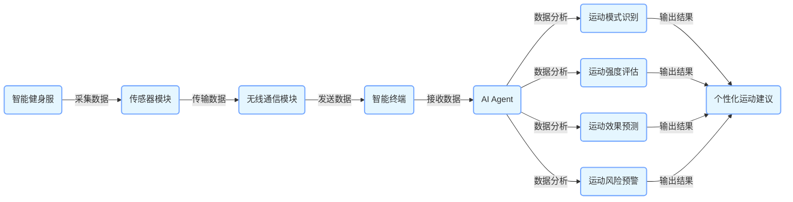

# 智能健身服：AI Agent的运动数据分析

> 关键词：智能健身服、AI Agent、运动数据分析、传感器技术、健康监测

> 摘要：本文围绕智能健身服与AI Agent的运动数据分析展开深入探讨。首先介绍了智能健身服和AI Agent的背景知识，包括其发展现状、研究目的和适用读者群体等。详细阐述了智能健身服和AI Agent的核心概念、工作原理及架构，并通过Mermaid流程图进行清晰展示。深入讲解了相关核心算法原理，结合Python源代码进行说明，同时给出了对应的数学模型和公式。通过项目实战，从开发环境搭建、源代码实现到代码解读进行了全面分析。探讨了智能健身服在不同场景下的实际应用，推荐了相关的学习资源、开发工具框架以及论文著作。最后总结了智能健身服未来的发展趋势与面临的挑战，并提供了常见问题解答和扩展阅读参考资料，旨在为读者全面呈现智能健身服中AI Agent运动数据分析的相关技术和应用。

## 1. 背景介绍 
### 1.1 目的和范围
智能健身服作为一种融合了先进传感器技术和信息技术的创新产品，旨在为用户提供更加个性化、精准的运动监测和指导。随着人们对健康和健身的关注度不断提高，智能健身服的市场需求也日益增长。本文章的目的在于深入探讨智能健身服中AI Agent（人工智能代理）对运动数据的分析技术，包括其原理、算法、实际应用等方面。范围涵盖了智能健身服的硬件技术、AI Agent的数据分析方法、相关数学模型以及实际项目案例等内容。

### 1.2 预期读者
本文预期读者包括对智能可穿戴设备、人工智能、运动健康监测等领域感兴趣的技术爱好者、研究人员、开发者，以及从事相关行业的专业人士。对于想要了解智能健身服技术原理和应用的健身爱好者和普通消费者也具有一定的参考价值。

### 1.3 文档结构概述
本文将按照以下结构进行阐述：首先介绍智能健身服和AI Agent的背景知识，包括术语表等内容；接着详细讲解核心概念、原理和架构，通过文本示意图和Mermaid流程图进行展示；然后深入探讨核心算法原理和具体操作步骤，结合Python源代码进行说明；随后给出相关数学模型和公式，并举例说明；通过项目实战，介绍开发环境搭建、源代码实现和代码解读；探讨智能健身服的实际应用场景；推荐相关的学习资源、开发工具框架和论文著作；最后总结未来发展趋势与挑战，提供常见问题解答和扩展阅读参考资料。

### 1.4 术语表
#### 1.4.1 核心术语定义
- **智能健身服**：集成了多种传感器（如加速度计、陀螺仪、心率传感器等），能够实时采集人体运动数据和生理数据，并通过无线通信技术将数据传输到智能终端进行处理和分析的功能性服装。
- **AI Agent**：人工智能代理，是一种能够感知环境、自主决策并采取行动以实现特定目标的智能实体。在智能健身服中，AI Agent可以对采集到的运动数据进行分析、处理和解读，为用户提供个性化的运动建议和指导。
- **运动数据分析**：对采集到的运动数据（如运动轨迹、速度、加速度、心率等）进行处理、挖掘和分析，以提取有价值的信息，如运动强度、运动效果、运动风险等。

#### 1.4.2 相关概念解释
- **传感器技术**：用于感知和测量物理量（如加速度、角速度、温度、压力等）的技术。在智能健身服中，传感器是采集运动数据和生理数据的关键部件。
- **无线通信技术**：实现设备之间无线数据传输的技术，如蓝牙、Wi-Fi等。在智能健身服中，无线通信技术用于将采集到的数据传输到智能终端。
- **机器学习**：一门多领域交叉学科，涉及概率论、统计学、逼近论、凸分析、算法复杂度理论等多门学科。它专门研究计算机怎样模拟或实现人类的学习行为，以获取新的知识或技能，重新组织已有的知识结构使之不断改善自身的性能。在智能健身服中，机器学习算法可用于对运动数据进行分类、预测和模式识别。

#### 1.4.3 缩略词列表
- **MEMS**：Micro-Electro-Mechanical Systems，微机电系统，常用于制造传感器。
- **HR**：Heart Rate，心率。
- **IMU**：Inertial Measurement Unit，惯性测量单元，通常包括加速度计和陀螺仪。

## 2. 核心概念与联系 
### 智能健身服的工作原理
智能健身服的核心在于其集成的各种传感器，这些传感器能够实时感知人体的运动状态和生理参数。加速度计可以测量人体的加速度，从而推断出运动的速度和方向；陀螺仪可以测量人体的角速度，用于检测运动的姿态和角度变化；心率传感器则可以实时监测人体的心率。这些传感器将采集到的数据通过无线通信模块传输到智能终端（如智能手机、智能手表等）。

### AI Agent的作用
AI Agent在智能健身服中扮演着数据分析和决策的角色。它接收来自智能健身服的运动数据，运用机器学习、深度学习等算法对数据进行处理和分析。通过对大量运动数据的学习和训练，AI Agent可以识别不同的运动模式，评估运动强度和效果，预测运动风险，并根据用户的个人信息（如年龄、性别、身体状况等）提供个性化的运动建议和指导。

### 核心概念架构示意图


### 文本解释
智能健身服作为数据采集的源头，通过传感器模块收集人体的运动和生理数据。这些数据经过无线通信模块传输到智能终端，AI Agent在智能终端上对数据进行分析。AI Agent的分析过程包括运动模式识别、运动强度评估、运动效果预测和运动风险预警等多个方面，最终根据这些分析结果生成个性化的运动建议。

## 3. 核心算法原理 & 具体操作步骤 
### 运动模式识别算法
运动模式识别是智能健身服中AI Agent的重要任务之一。常见的运动模式包括跑步、步行、游泳、骑自行车等。一种常用的运动模式识别算法是基于机器学习的分类算法，如支持向量机（SVM）、决策树、随机森林等。

以下是一个使用Python和Scikit-learn库实现的基于支持向量机的运动模式识别示例代码：

```python
import numpy as np
from sklearn import svm
from sklearn.model_selection import train_test_split
from sklearn.metrics import accuracy_score

# 模拟运动数据
# 假设每个样本有3个特征（加速度、角速度、心率）
# 假设有4种运动模式（0: 跑步，1: 步行，2: 游泳，3: 骑自行车）
X = np.random.rand(1000, 3)  # 1000个样本，每个样本3个特征
y = np.random.randint(0, 4, 1000)  # 对应的运动模式标签

# 划分训练集和测试集
X_train, X_test, y_train, y_test = train_test_split(X, y, test_size=0.2, random_state=42)

# 创建支持向量机分类器
clf = svm.SVC()

# 训练模型
clf.fit(X_train, y_train)

# 预测
y_pred = clf.predict(X_test)

# 计算准确率
accuracy = accuracy_score(y_test, y_pred)
print(f"运动模式识别准确率: {accuracy}")
```

### 具体操作步骤
1. **数据采集**：使用智能健身服的传感器采集运动数据，包括加速度、角速度、心率等。
2. **数据预处理**：对采集到的数据进行清洗、归一化等处理，以提高算法的性能。
3. **特征提取**：从预处理后的数据中提取有代表性的特征，如均值、方差、最大值、最小值等。
4. **模型训练**：使用训练数据集对机器学习模型进行训练，调整模型的参数以提高性能。
5. **模型评估**：使用测试数据集对训练好的模型进行评估，计算准确率、召回率、F1值等指标。
6. **预测和应用**：将训练好的模型应用到实际的运动数据中，进行运动模式识别，并根据识别结果提供相应的运动建议。

### 运动强度评估算法
运动强度评估可以帮助用户了解自己的运动负荷，合理安排运动计划。一种常用的运动强度评估方法是基于心率的评估方法。根据最大心率公式 $HR_{max}=220 - age$（其中 $age$ 为用户的年龄），可以计算出用户的最大心率。然后根据运动时的实际心率与最大心率的比例，将运动强度分为不同的等级，如低强度（$< 50\% HR_{max}$）、中等强度（$50\% - 70\% HR_{max}$）、高强度（$> 70\% HR_{max}$）。

以下是一个使用Python实现的基于心率的运动强度评估示例代码：

```python
def calculate_max_heart_rate(age):
    return 220 - age

def evaluate_exercise_intensity(heart_rate, max_heart_rate):
    intensity_ratio = heart_rate / max_heart_rate
    if intensity_ratio < 0.5:
        return "低强度"
    elif 0.5 <= intensity_ratio <= 0.7:
        return "中等强度"
    else:
        return "高强度"

# 示例数据
age = 30
heart_rate = 130

max_heart_rate = calculate_max_heart_rate(age)
intensity = evaluate_exercise_intensity(heart_rate, max_heart_rate)
print(f"运动强度: {intensity}")
```

### 具体操作步骤
1. **获取用户信息**：获取用户的年龄等基本信息。
2. **计算最大心率**：根据用户的年龄计算最大心率。
3. **采集心率数据**：使用智能健身服的心率传感器采集运动时的心率数据。
4. **评估运动强度**：根据采集到的心率数据和计算出的最大心率，评估运动强度。
5. **提供建议**：根据运动强度评估结果，为用户提供相应的运动建议，如是否需要调整运动强度等。

## 4. 数学模型和公式 & 详细讲解 & 举例说明 
### 运动轨迹计算模型
在智能健身服中，通过加速度计和陀螺仪可以测量人体的加速度和角速度，从而计算出人体的运动轨迹。运动轨迹的计算可以基于牛顿运动定律和积分原理。

假设加速度计测量的加速度为 $\vec{a}(t)$，陀螺仪测量的角速度为 $\vec{\omega}(t)$，初始位置为 $\vec{r}(0)$，初始速度为 $\vec{v}(0)$。则在时间 $t$ 时的速度 $\vec{v}(t)$ 和位置 $\vec{r}(t)$ 可以通过以下公式计算：

$$\vec{v}(t) = \vec{v}(0) + \int_{0}^{t} \vec{a}(\tau) d\tau$$

$$\vec{r}(t) = \vec{r}(0) + \int_{0}^{t} \vec{v}(\tau) d\tau$$

在实际应用中，由于传感器数据是离散的，通常使用数值积分方法（如欧拉法、梯形法等）来近似计算积分。

### 举例说明
假设加速度计在 $t = 0, 1, 2, 3$ 时刻测量的加速度分别为 $\vec{a}(0) = [0, 0, 0]$，$\vec{a}(1) = [1, 0, 0]$，$\vec{a}(2) = [2, 0, 0]$，$\vec{a}(3) = [3, 0, 0]$，初始速度 $\vec{v}(0) = [0, 0, 0]$，初始位置 $\vec{r}(0) = [0, 0, 0]$。使用欧拉法进行数值积分：

在 $t = 1$ 时刻：
$$\vec{v}(1) = \vec{v}(0) + \vec{a}(0) \times \Delta t = [0, 0, 0] + [0, 0, 0] \times 1 = [0, 0, 0]$$
$$\vec{r}(1) = \vec{r}(0) + \vec{v}(0) \times \Delta t = [0, 0, 0] + [0, 0, 0] \times 1 = [0, 0, 0]$$

在 $t = 2$ 时刻：
$$\vec{v}(2) = \vec{v}(1) + \vec{a}(1) \times \Delta t = [0, 0, 0] + [1, 0, 0] \times 1 = [1, 0, 0]$$
$$\vec{r}(2) = \vec{r}(1) + \vec{v}(1) \times \Delta t = [0, 0, 0] + [0, 0, 0] \times 1 = [0, 0, 0]$$

在 $t = 3$ 时刻：
$$\vec{v}(3) = \vec{v}(2) + \vec{a}(2) \times \Delta t = [1, 0, 0] + [2, 0, 0] \times 1 = [3, 0, 0]$$
$$\vec{r}(3) = \vec{r}(2) + \vec{v}(2) \times \Delta t = [0, 0, 0] + [1, 0, 0] \times 1 = [1, 0, 0]$$

### 运动能量消耗模型
运动能量消耗是评估运动效果的重要指标之一。一种常用的运动能量消耗计算模型是基于心率和运动时间的模型。根据相关研究，运动能量消耗 $E$ 可以通过以下公式计算：

$$E = MET \times m \times t$$

其中，$MET$（Metabolic Equivalent of Task，代谢当量）是一个表示运动强度的指标，不同的运动模式对应不同的 $MET$ 值；$m$ 是用户的体重（单位：kg）；$t$ 是运动时间（单位：小时）。

### 举例说明
假设用户的体重 $m = 60$ kg，进行跑步运动，跑步的 $MET$ 值为 8，运动时间 $t = 0.5$ 小时。则运动能量消耗为：

$$E = 8 \times 60 \times 0.5 = 240 \text{ kcal}$$

## 5. 项目实战：代码实际案例和详细解释说明 
### 5.1  开发环境搭建
#### 硬件环境
- **智能健身服**：选择一款集成了加速度计、陀螺仪、心率传感器等多种传感器的智能健身服。
- **智能终端**：如智能手机、智能手表等，支持蓝牙或Wi-Fi通信。
- **开发板**：如Arduino、Raspberry Pi等，用于数据采集和处理。

#### 软件环境
- **操作系统**：如Windows、Linux、macOS等。
- **开发语言**：Python，用于数据分析和算法实现。
- **开发工具**：PyCharm、Jupyter Notebook等，用于编写和调试Python代码。
- **相关库**：Scikit-learn、NumPy、Pandas等，用于机器学习、数据处理和分析。

### 5.2  源代码详细实现和代码解读
以下是一个完整的智能健身服运动数据分析项目的示例代码，包括数据采集、预处理、运动模式识别和运动强度评估等功能。

```python
import numpy as np
from sklearn import svm
from sklearn.model_selection import train_test_split
from sklearn.metrics import accuracy_score

# 模拟数据采集
def collect_data():
    # 这里模拟传感器采集的数据
    # 假设每个样本有3个特征（加速度、角速度、心率）
    # 假设有4种运动模式（0: 跑步，1: 步行，2: 游泳，3: 骑自行车）
    X = np.random.rand(1000, 3)  # 1000个样本，每个样本3个特征
    y = np.random.randint(0, 4, 1000)  # 对应的运动模式标签
    return X, y

# 数据预处理
def preprocess_data(X):
    # 数据归一化
    X_mean = np.mean(X, axis=0)
    X_std = np.std(X, axis=0)
    X_normalized = (X - X_mean) / X_std
    return X_normalized

# 运动模式识别
def recognize_exercise_pattern(X, y):
    # 划分训练集和测试集
    X_train, X_test, y_train, y_test = train_test_split(X, y, test_size=0.2, random_state=42)

    # 创建支持向量机分类器
    clf = svm.SVC()

    # 训练模型
    clf.fit(X_train, y_train)

    # 预测
    y_pred = clf.predict(X_test)

    # 计算准确率
    accuracy = accuracy_score(y_test, y