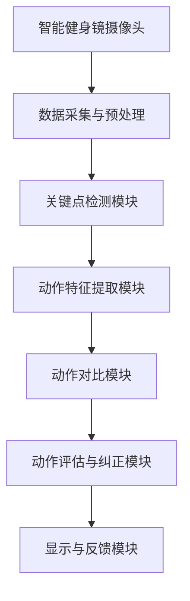

# 智能健身镜：AI Agent的动作纠正

> 关键词：智能健身镜、AI Agent、动作纠正、计算机视觉、机器学习

> 摘要：本文围绕智能健身镜中AI Agent的动作纠正技术展开深入探讨。详细介绍了智能健身镜的背景、核心概念、相关算法原理、数学模型，通过项目实战展示代码实现和解读，阐述其实际应用场景，推荐了学习资源、开发工具和相关论文，最后总结了该技术的未来发展趋势与挑战，并提供常见问题解答和参考资料，旨在帮助读者全面了解智能健身镜中AI Agent动作纠正技术的原理、应用和发展方向。

## 1. 背景介绍 
### 1.1 目的和范围
智能健身镜作为一种新兴的健身设备，融合了先进的人工智能技术，为用户提供了更加个性化、智能化的健身体验。本文的目的在于深入剖析智能健身镜中AI Agent的动作纠正功能，从技术原理、算法实现到实际应用等多个方面进行全面介绍。范围涵盖了该技术的核心概念、相关算法、数学模型、项目实战案例，以及实际应用场景和未来发展趋势等内容。

### 1.2 预期读者
本文预期读者包括对智能健身镜技术感兴趣的普通健身爱好者，希望了解该技术背后原理的技术人员，如程序员、软件架构师等，以及从事相关领域研究的科研人员和对新兴健身设备市场有研究需求的商业人士。

### 1.3 文档结构概述
本文将按照以下结构进行阐述：首先介绍智能健身镜及AI Agent动作纠正的核心概念与联系；接着详细讲解实现动作纠正的核心算法原理和具体操作步骤，并给出Python源代码示例；然后介绍相关的数学模型和公式，并举例说明；通过项目实战展示代码的实际案例和详细解释；阐述该技术的实际应用场景；推荐相关的学习资源、开发工具和论文著作；最后总结未来发展趋势与挑战，提供常见问题解答和参考资料。

### 1.4 术语表
#### 1.4.1 核心术语定义
- **智能健身镜**：一种集成了显示屏、摄像头、传感器和人工智能技术的健身设备，用户可以通过它进行健身训练，并获得实时的指导和反馈。
- **AI Agent**：人工智能代理，是一种能够感知环境、做出决策并采取行动的智能实体。在智能健身镜中，AI Agent负责分析用户的动作，与标准动作进行对比，并提供纠正建议。
- **动作纠正**：通过分析用户的健身动作，识别出动作中的错误或不规范之处，并提供相应的改进建议，以帮助用户达到更好的健身效果，减少受伤风险。
- **计算机视觉**：是一门研究如何使机器“看”的科学，通过摄像头等设备获取图像或视频数据，并对其进行处理、分析和理解，以提取有用的信息。在智能健身镜中，计算机视觉技术用于识别用户的动作姿态。
- **机器学习**：是一门多领域交叉学科，涉及概率论、统计学、逼近论、凸分析、算法复杂度理论等多门学科。它专门研究计算机怎样模拟或实现人类的学习行为，以获取新的知识或技能，重新组织已有的知识结构使之不断改善自身的性能。在动作纠正中，机器学习算法用于训练模型，以准确识别动作的正确性。

#### 1.4.2 相关概念解释
- **关键点检测**：在计算机视觉中，关键点检测是指在图像或视频中检测出特定对象的关键特征点，如人体的关节点。在智能健身镜中，通过关键点检测可以获取用户身体各部位的位置信息，用于动作分析。
- **动作模板**：是指预先定义好的标准健身动作的模型，包含了动作的各个阶段的关键点位置和姿态信息。AI Agent通过将用户的动作与动作模板进行对比，来判断用户动作的正确性。
- **实时反馈**：在用户进行健身训练时，智能健身镜能够及时地将动作分析结果和纠正建议反馈给用户，使用户能够实时调整自己的动作。

#### 1.4.3 缩略词列表
- **CNN**：Convolutional Neural Network，卷积神经网络，是一种专门为处理具有网格结构数据（如图像）而设计的深度学习模型。
- **RNN**：Recurrent Neural Network，循环神经网络，是一种用于处理序列数据的神经网络模型，在处理时间序列数据（如动作序列）方面具有优势。
- **OpenCV**：Open Source Computer Vision Library，开源计算机视觉库，提供了丰富的计算机视觉算法和工具，用于图像和视频处理。
- **TensorFlow**：一个开源的机器学习框架，广泛用于构建和训练深度学习模型。

## 2. 核心概念与联系 

### 核心概念原理
智能健身镜中的AI Agent动作纠正功能主要基于计算机视觉和机器学习技术。其原理如下：
- **数据采集**：通过智能健身镜上的摄像头采集用户的健身动作视频或图像数据。
- **关键点检测**：利用计算机视觉算法对采集到的数据进行处理，检测出人体的关键关节点，如头部、肩部、肘部、腕部、髋部、膝部和踝部等。这些关键点的位置信息可以反映出人体的姿态。
- **动作特征提取**：从关键点的位置和运动信息中提取出能够描述动作的特征，如关节角度、肢体长度比例、动作的速度和加速度等。
- **动作对比**：将提取的用户动作特征与预先定义好的标准动作模板进行对比，计算两者之间的相似度或差异度。
- **动作评估与纠正**：根据对比结果，对用户的动作进行评估，判断动作是否正确或规范。如果发现动作存在问题，AI Agent会提供相应的纠正建议，如调整关节角度、改变肢体位置等。

### 架构的文本示意图
```plaintext
+---------------------+
|  智能健身镜摄像头   |
+---------------------+
          |
          v
+---------------------+
|  数据采集与预处理   |
|  （图像/视频解码、  |
|   降噪、增强等）    |
+---------------------+
          |
          v
+---------------------+
|  关键点检测模块     |
|  （使用计算机视觉   |
|   算法检测关节点）  |
+---------------------+
          |
          v
+---------------------+
|  动作特征提取模块   |
|  （提取关节角度、   |
|   速度等特征）      |
+---------------------+
          |
          v
+---------------------+
|  动作对比模块       |
|  （与标准动作模板   |
|   对比）            |
+---------------------+
          |
          v
+---------------------+
|  动作评估与纠正模块 |
|  （判断动作正确性， |
|   提供纠正建议）    |
+---------------------+
          |
          v
+---------------------+
|  显示与反馈模块     |
|  （在镜面上显示纠   |
|   正建议）          |
+---------------------+
```

### Mermaid 流程图


## 3. 核心算法原理 & 具体操作步骤 

### 关键点检测算法原理
在智能健身镜中，常用的关键点检测算法是基于卷积神经网络（CNN）的方法，如OpenPose。OpenPose是一种实时多人二维姿态估计模型，它可以同时检测出多个人体的关键点。

OpenPose的工作原理如下：
- **特征提取**：使用卷积神经网络对输入的图像进行特征提取，得到特征图。
- **部分置信度图（PCMs）生成**：通过卷积层对特征图进行处理，生成部分置信度图。PCMs表示每个关键点在图像中各个位置出现的概率。
- **部分亲和场（PAFs）生成**：同样通过卷积层生成部分亲和场，PAFs用于表示相邻关键点之间的连接关系。
- **关键点检测与连接**：根据PCMs和PAFs，使用贪心算法或匈牙利算法等方法检测出关键点的位置，并将相邻的关键点连接起来，形成人体的姿态骨架。

### Python代码示例
```python
import cv2
import numpy as np
import time

# 加载OpenPose模型
proto_file = "pose_deploy_linevec_faster_4_stages.prototxt"
weights_file = "pose_iter_160000.caffemodel"
net = cv2.dnn.readNetFromCaffe(proto_file, weights_file)

# 定义关键点数量和连接关系
n_points = 18
POSE_PAIRS = [[1, 0], [1, 2], [1, 5], [2, 3], [3, 4], [5, 6], [6, 7], [1, 8], [8, 9], [9, 10], [1, 11], [11, 12], [12, 13], [0, 14], [0, 15], [14, 16], [15, 17]]

# 读取输入图像
image = cv2.imread("test_image.jpg")
frame_width = image.shape[1]
frame_height = image.shape[0]
threshold = 0.1

# 预处理图像
blob = cv2.dnn.blobFromImage(image, 1.0 / 255, (368, 368), (0, 0, 0), swapRB=False, crop=False)
net.setInput(blob)

# 前向传播
t = time.time()
output = net.forward()
print("Time Taken in forward pass = {}".format(time.time() - t))

# 检测关键点
points = []
for i in range(n_points):
    # 从输出中提取关键点的置信度图
    prob_map = output[0, i, :, :]
    prob_map = cv2.resize(prob_map, (frame_width, frame_height))

    # 找到置信度最大的点
    min_val, prob, min_loc, point = cv2.minMaxLoc(prob_map)

    if prob > threshold:
        cv2.circle(image, (int(point[0]), int(point[1])), 8, (0, 255, 255), thickness=-1, lineType=cv2.FILLED)
        cv2.putText(image, "{}".format(i), (int(point[0]), int(point[1])), cv2.FONT_HERSHEY_SIMPLEX, 1, (0, 0, 255), 2, lineType=cv2.LINE_AA)

        points.append((int(point[0]), int(point[1])))
    else:
        points.append(None)

# 绘制骨架
for pair in POSE_PAIRS:
    part_a = pair[0]
    part_b = pair[1]

    if points[part_a] and points[part_b]:
        cv2.line(image, points[part_a], points[part_b], (0, 255, 0), 2)

# 显示结果
cv2.imshow('Output-Keypoints', image)
cv2.waitKey(0)
cv2.destroyAllWindows()
```

### 具体操作步骤
1. **模型加载**：使用`cv2.dnn.readNetFromCaffe`函数加载OpenPose模型的配置文件和权重文件。
2. **图像读取与预处理**：使用`cv2.imread`函数读取输入图像，并使用`cv2.dnn.blobFromImage`函数对图像进行预处理，将其转换为适合模型输入的格式。
3. **前向传播**：将预处理后的图像输入到模型中，使用`net.forward`函数进行前向传播，得到输出结果。
4. **关键点检测**：从输出结果中提取每个关键点的置信度图，找到置信度最大的点作为关键点的位置。
5. **骨架绘制**：根据关键点的连接关系，使用`cv2.line`函数绘制人体的骨架。
6. **结果显示**：使用`cv2.imshow`函数显示检测结果，并使用`cv2.waitKey`和`cv2.destroyAllWindows`函数处理窗口事件。

## 4. 数学模型和公式 & 详细讲解 & 举例说明 

### 关节角度计算
关节角度是描述人体动作的重要特征之一。在智能健身镜中，可以通过关键点的坐标计算关节角度。

设三个关键点分别为 $A(x_1, y_1)$、$B(x_2, y_2)$ 和 $C(x_3, y_3)$，则 $\angle ABC$ 的计算公式为：

$$
\cos(\angle ABC) = \frac{\overrightarrow{BA} \cdot \overrightarrow{BC}}{\vert\overrightarrow{BA}\vert \vert\overrightarrow{BC}\vert}
$$

其中，$\overrightarrow{BA} = (x_1 - x_2, y_1 - y_2)$，$\overrightarrow{BC} = (x_3 - x_2, y_3 - y_2)$，$\vert\overrightarrow{BA}\vert$ 和 $\vert\overrightarrow{BC}\vert$ 分别为向量 $\overrightarrow{BA}$ 和 $\overrightarrow{BC}$ 的模，计算公式为：

$$
\vert\overrightarrow{BA}\vert = \sqrt{(x_1 - x_2)^2 + (y_1 - y_2)^2}
$$

$$
\vert\overrightarrow{BC}\vert = \sqrt{(x_3 - x_2)^2 + (y_3 - y_2)^2}
$$

最后，通过反余弦函数计算出角度：

$$
\angle ABC = \arccos(\cos(\angle ABC))
$$

### Python代码示例
```python
import math

def calculate_angle(A, B, C):
    BA = [A[0] - B[0], A[1] - B[1]]
    BC = [C[0] - B[0], C[1] - B[1]]

    dot_product = BA[0] * BC[0] + BA[1] * BC[1]
    magnitude_BA = math.sqrt(BA[0] ** 2 + BA[1] ** 2)
    magnitude_BC = math.sqrt(BC[0] ** 2 + BC[1] ** 2)

    cos_angle = dot_product / (magnitude_BA * magnitude_BC)
    angle = math.acos(cos_angle)
    angle_degrees = math.degrees(angle)

    return angle_degrees

# 示例关键点坐标
A = (100, 200)
B = (200, 300)
C = (300, 200)

angle = calculate_angle(A, B, C)
print(f"Angle ABC: {angle} degrees")
```

### 动作相似度计算
为了判断用户的动作与标准动作的相似度，可以使用动态时间规整（DTW）算法。DTW算法可以处理两个时间序列的长度不同的情况，通过寻找最优的匹配路径来计算两个序列之间的距离。

设两个动作序列分别为 $X = \{x_1, x_2, \cdots, x_m\}$ 和 $Y = \{y_1, y_2, \cdots, y_n\}$，其中 $x_i$ 和 $y_j$ 分别为第 $i$ 个和第 $j$ 个时间步的动作特征向量。

DTW算法的核心是构建一个代价矩阵 $D$，其中 $D(i, j)$ 表示 $X$ 的前 $i$ 个元素和 $Y$ 的前 $j$ 个元素之间的最小累积距离。代价矩阵的计算公式为：

$$
D(i, j) = d(x_i, y_j) + \min\{D(i-1, j), D(i, j-1), D(i-1, j-1)\}
$$

其中，$d(x_i, y_j)$ 表示 $x_i$ 和 $y_j$ 之间的距离，通常使用欧氏距离：

$$
d(x_i, y_j) = \sqrt{\sum_{k=1}^{d}(x_{i,k} - y_{j,k})^2}
$$

最后，$X$ 和 $Y$ 之间的DTW距离为 $D(m, n)$。

### Python代码示例
```python
import numpy as np

def dtw_distance(X, Y):
    m = len(X)
    n = len(Y)

    D = np.zeros((m + 1, n + 1))
    D[0, 1:] = np.inf
    D[1:, 0] = np.inf

    for i in range(1, m + 1):
        for j in range(1, n + 1):
            cost = np.linalg.norm(np.array(X[i - 1]) - np.array(Y[j - 1]))
            D[i, j] = cost + min(D[i - 1, j], D[i, j - 1], D[i - 1, j - 1])

    return D[m, n]

# 示例动作序列
X = [[1, 2], [3, 4], [5, 6]]
Y = [[2, 3], [4, 5], [6, 7], [8, 9]]

distance = dtw_distance(X, Y)
print(f"DTW distance: {distance}")
```

## 5. 项目实战：代码实际案例和详细解释说明 

### 5.1  开发环境搭建
- **操作系统**：推荐使用Ubuntu 18.04或更高版本，也可以使用Windows 10或macOS。
- **Python环境**：安装Python 3.6或更高版本。可以使用Anaconda来管理Python环境。
- **依赖库安装**：使用`pip`安装以下依赖库：
```sh
pip install opencv-python numpy tensorflow
```
- **模型下载**：从OpenPose的官方GitHub仓库下载预训练模型的配置文件和权重文件。

### 5.2  源代码详细实现和代码解读
```python
import cv2
import numpy as np
import tensorflow as tf

# 加载OpenPose模型
proto_file = "pose_deploy_linevec_faster_4_stages.prototxt"
weights_file = "pose_iter_160000.caffemodel"
net = cv2.dnn.readNetFromCaffe(proto_file, weights_file)

# 定义关键点数量和连接关系
n_points = 18
POSE_PAIRS = [[1, 0], [1, 2], [1, 5], [2, 3], [3, 4], [5, 6], [6, 7], [1, 8], [8, 9], [9, 10], [1, 11], [11, 12], [12, 13], [0, 14], [0, 15], [14, 16], [15, 17]]

# 加载标准动作模板
standard_action_template = np.load("standard_action_template.npy")

def calculate_angle(A, B, C):
    BA = [A[0] - B[0], A[1] - B[1]]
    BC = [C[0] - B[0], C[1] - B[1]]

    dot_product = BA[0] * BC[0] + BA[1] * BC[1]
    magnitude_BA = np.sqrt(BA[0] ** 2 + BA[1] ** 2)
    magnitude_BC = np.sqrt(BC[0] ** 2 + BC[1] ** 2)

    cos_angle = dot_product / (magnitude_BA * magnitude_BC)
    angle = np.arccos(cos_angle)
    angle_degrees = np.degrees(angle)

    return angle_degrees

def dtw_distance(X, Y):
    m = len(X)
    n = len(Y)

    D = np.zeros((m + 1, n + 1))
    D[0, 1:] = np.inf
    D[1:, 0] = np.inf

    for i in range(1, m + 1):
        for j in range(1, n + 1):
            cost = np.linalg.norm(np.array(X[i - 1]) - np.array(Y[j - 1]))
            D[i, j] = cost + min(D[i - 1, j], D[i, j - 1], D[i - 1, j - 1])

    return D[m, n]

# 打开摄像头
cap = cv2.VideoCapture(0)

while True:
    ret, frame = cap.read()
    if not ret:
        break

    frame_width = frame.shape[1]
    frame_height = frame.shape[0]
    threshold = 0.1

    # 预处理图像
    blob = cv2.dnn.blobFromImage(frame, 1.0 / 255, (368, 368), (0, 0, 0), swapRB=False, crop=False)
    net.setInput(blob)

    # 前向传播
    output = net.forward()

    # 检测关键点
    points = []
    for i in range(n_points):
        prob_map = output[0, i, :, :]
        prob_map = cv2.resize(prob_map, (frame_width, frame_height))

        min_val, prob, min_loc, point = cv2.minMaxLoc(prob_map)

        if prob > threshold:
            cv2.circle(frame, (int(point[0]), int(point[1])), 8, (0, 255, 255), thickness=-1, lineType=cv2.FILLED)
            cv2.putText(frame, "{}".format(i), (int(point[0]), int(point[1])), cv2.FONT_HERSHEY_SIMPLEX, 1, (0, 0, 255), 2, lineType=cv2.LINE_AA)

            points.append((int(point[0]), int(point[1])))
        else:
            points.append(None)

    # 绘制骨架
    for pair in POSE_PAIRS:
        part_a = pair[0]
        part_b = pair[1]

        if points[part_a] and points[part_b]:
            cv2.line(frame, points[part_a], points[part_b], (0, 255, 0), 2)

    # 提取动作特征（以肘关节角度为例）
    if points[2] and points[3] and points[4]:
        elbow_angle = calculate_angle(points[2], points[3], points[4])
        cv2.putText(frame, f"Elbow Angle: {elbow_angle:.2f} degrees", (10, 30), cv2.FONT_HERSHEY_SIMPLEX, 1, (0, 255, 0), 2, lineType=cv2.LINE_AA)

    # 动作对比
    current_action_features = []
    if all(points):
        for pair in POSE_PAIRS:
            part_a = pair[0]
            part_b = pair[1]
            if points[part_a] and points[part_b]:
                current_action_features.extend(points[part_a])
                current_action_features.extend(points[part_b])

        dtw_dist = dtw_distance([current_action_features], [standard_action_template])
        cv2.putText(frame, f"DTW Distance: {dtw_dist:.2f}", (10, 60), cv2.FONT_HERSHEY_SIMPLEX, 1, (0, 255, 0), 2, lineType=cv2.LINE_AA)

        if dtw_dist > 1000:
            cv2.putText(frame, "Incorrect Action", (10, 90), cv2.FONT_HERSHEY_SIMPLEX, 1, (0, 0, 255), 2, lineType=cv2.LINE_AA)
        else:
            cv2.putText(frame, "Correct Action", (10, 90), cv2.FONT_HERSHEY_SIMPLEX, 1, (0, 255, 0), 2, lineType=cv2.LINE_AA)

    # 显示结果
    cv2.imshow('Smart Fitness Mirror', frame)

    if cv2.waitKey(1) & 0xFF == ord('q'):
        break

# 释放摄像头并关闭窗口
cap.release()
cv2.destroyAllWindows()
```

### 5.3  代码解读与分析
- **模型加载**：使用`cv2.dnn.readNetFromCaffe`函数加载OpenPose模型的配置文件和权重文件。
- **关键点检测**：通过摄像头读取实时视频帧，对每一帧图像进行预处理后输入到OpenPose模型中，检测出人体的关键点，并绘制骨架。
- **动作特征提取**：以肘关节角度为例，使用`calculate_angle`函数计算肘关节的角度，并在图像上显示。
- **动作对比**：将当前动作的特征与标准动作模板进行对比，使用`dtw_distance`函数计算DTW距离。根据DTW距离判断动作是否正确，并在图像上显示相应的提示信息。
- **结果显示**：使用`cv2.imshow`函数显示处理后的图像，按`q`键退出程序。

## 6. 实际应用场景 
### 家庭健身
智能健身镜可以为家庭健身爱好者提供个性化的健身指导。用户可以在家中通过智能健身镜进行各种健身训练，如瑜伽、有氧运动、力量训练等。AI Agent会实时分析用户的动作，提供纠正建议，帮助用户正确地完成动作，避免因动作不规范而导致的受伤风险。

### 商业健身房
在商业健身房中，智能健身镜可以作为一种辅助健身设备，为教练和会员提供更好的服务。教练可以使用智能健身镜来评估会员的动作，制定更科学的训练计划。会员可以在没有教练指导的情况下，通过智能健身镜进行自主训练，提高训练效果。

### 康复训练
智能健身镜在康复训练领域也有很大的应用潜力。对于受伤或患病的患者，康复训练是恢复身体功能的重要环节。智能健身镜可以帮助患者进行正确的康复动作训练，实时监测动作的准确性和进度，为医生和康复师提供数据支持，以便调整治疗方案。

### 体育教学
在学校的体育教学中，智能健身镜可以作为一种教学辅助工具。教师可以利用智能健身镜展示标准的体育动作，让学生通过对比自己的动作与标准动作，及时发现问题并进行纠正。这有助于提高学生的体育技能水平，同时也减轻了教师的教学负担。

## 7. 工具和资源推荐
### 7.1 学习资源推荐
#### 7.1.1 书籍推荐
- 《计算机视觉：算法与应用》：本书全面介绍了计算机视觉的基本概念、算法和应用，对于理解智能健身镜中的关键点检测和动作分析技术有很大的帮助。
- 《Python机器学习实战》：通过大量的实例介绍了Python在机器学习领域的应用，包括数据预处理、模型训练和评估等方面的内容，有助于掌握动作纠正中使用的机器学习算法。
- 《深度学习》：由深度学习领域的三位顶尖专家编写，深入介绍了深度学习的原理、模型和应用，是学习深度学习的经典教材。

#### 7.1.2 在线课程
- Coursera上的“计算机视觉基础”课程：由知名高校的教授授课，系统地介绍了计算机视觉的基础知识和常用算法。
- edX上的“机器学习导论”课程：通过理论讲解和实践项目，帮助学习者掌握机器学习的基本概念和算法。
- 哔哩哔哩上的一些计算机视觉和机器学习相关的教程视频：这些视频通常由国内的技术专家或爱好者制作，内容生动易懂，适合初学者学习。

#### 7.1.3 技术博客和网站
- Medium：是一个汇集了众多技术专家和爱好者的博客平台，上面有很多关于计算机视觉、机器学习和人工智能的高质量文章。
- 机器之心：专注于人工智能领域的资讯和技术分享，提供了最新的研究成果、技术动态和应用案例。
- OpenCV官方文档：OpenCV是计算机视觉领域的重要库，其官方文档详细介绍了库的使用方法和各种算法的实现。

### 7.2 开发工具框架推荐
#### 7.2.1 IDE和编辑器
- PyCharm：是一款专门为Python开发设计的集成开发环境，具有代码编辑、调试、版本控制等功能，非常适合Python项目的开发。
- Visual Studio Code：是一款轻量级的代码编辑器，支持多种编程语言和插件扩展，可通过安装Python相关插件来进行Python开发。

#### 7.2.2 调试和性能分析工具
- TensorBoard：是TensorFlow提供的可视化工具，可以用于监控模型的训练过程、查看模型的结构和性能指标等。
- cProfile：是Python标准库中的性能分析工具，可以帮助开发者找出代码中的性能瓶颈。

#### 7.2.3 相关框架和库
- OpenCV：用于计算机视觉任务，如图像和视频处理、关键点检测等。
- TensorFlow：是一个开源的机器学习框架，可用于构建和训练深度学习模型。
- Scikit-learn：是一个简单易用的机器学习库，提供了各种机器学习算法和工具，如分类、回归、聚类等。

### 7.3 相关论文著作推荐
#### 7.3.1 经典论文
- “OpenPose: Realtime Multi-Person 2D Pose Estimation using Part Affinity Fields”：介绍了OpenPose算法的原理和实现，是关键点检测领域的经典论文。
- “Dynamic Time Warping Algorithm Review”：对动态时间规整（DTW）算法进行了详细的综述，包括算法的原理、变体和应用。

#### 7.3.2 最新研究成果
- 可以关注IEEE Transactions on Pattern Analysis and Machine Intelligence、ACM Transactions on Intelligent Systems and Technology等学术期刊，以及CVPR、ICCV、ECCV等计算机视觉领域的顶级会议，了解最新的研究成果。

#### 7.3.3 应用案例分析
- 一些科技媒体和研究机构会发布智能健身镜相关的应用案例分析报告，可以通过搜索相关关键词获取这些报告，了解智能健身镜在实际应用中的效果和问题。

## 8. 总结：未来发展趋势与挑战
### 未来发展趋势
- **功能多样化**：智能健身镜将不仅仅局限于动作纠正功能，还会集成更多的功能，如个性化训练计划制定、营养建议、社交互动等。用户可以通过智能健身镜与其他健身爱好者进行交流和比拼，增加健身的趣味性和动力。
- **硬件升级**：随着硬件技术的不断发展，智能健身镜的摄像头、传感器等硬件设备将不断升级，提高图像和数据采集的精度和稳定性。同时，智能健身镜的显示屏也将更加清晰、智能，提供更好的视觉体验。
- **融合更多技术**：智能健身镜将与虚拟现实（VR）、增强现实（AR）等技术进行融合，为用户带来更加沉浸式的健身体验。例如，用户可以在虚拟的场景中进行健身训练，与虚拟教练或其他用户进行互动。
- **数据驱动的个性化服务**：通过收集和分析用户的健身数据，智能健身镜可以为用户提供更加个性化的健身服务。例如，根据用户的身体状况、健身目标和运动习惯，制定专属的训练计划和饮食建议。

### 挑战
- **动作识别的准确性**：虽然目前的动作识别技术已经取得了很大的进展，但在复杂环境下（如多人同时运动、光线不佳等），动作识别的准确性仍然有待提高。需要进一步研究和改进算法，以提高动作识别的鲁棒性和准确性。
- **数据隐私和安全**：智能健身镜需要收集和处理用户的大量个人信息和健身数据，如身体特征、运动习惯等。如何保障这些数据的隐私和安全是一个重要的挑战。需要采取有效的数据加密、访问控制等技术手段，防止数据泄露和滥用。
- **用户体验的优化**：智能健身镜的用户体验直接影响用户的使用意愿和满意度。需要进一步优化产品的界面设计、交互方式和语音提示等，使产品更加易用、舒适和人性化。
- **市场竞争**：随着智能健身镜市场的不断发展，竞争也将日益激烈。如何在众多的竞争对手中脱颖而出，提供具有差异化的产品和服务，是企业面临的一个重要挑战。

## 9. 附录：常见问题与解答
### 问题1：智能健身镜的动作纠正功能准确吗？
答：智能健身镜的动作纠正功能的准确性取决于多个因素，如摄像头的质量、算法的性能和环境条件等。目前，大多数智能健身镜采用了先进的计算机视觉和机器学习算法，在正常环境下可以达到较高的准确性。但在复杂环境下，如多人同时运动、光线不佳等，动作识别的准确性可能会受到一定的影响。

### 问题2：智能健身镜适合哪些人群使用？
答：智能健身镜适合各种年龄段和健身水平的人群使用。对于初学者来说，智能健身镜可以提供详细的动作指导和纠正建议，帮助他们快速掌握正确的健身动作。对于有一定健身经验的人来说，智能健身镜可以为他们制定个性化的训练计划，提高训练效果。同时，智能健身镜也适用于康复训练和体育教学等领域。

### 问题3：智能健身镜需要连接网络吗？
答：部分智能健身镜需要连接网络才能使用一些高级功能，如在线课程学习、数据同步和社交互动等。但一些基本的动作纠正功能可以在离线状态下使用。具体是否需要连接网络取决于产品的功能和设计。

### 问题4：智能健身镜的价格贵吗？
答：智能健身镜的价格因品牌、功能和配置而异。一般来说，入门级的智能健身镜价格在几千元左右，而高端的智能健身镜价格可能会超过一万元。用户可以根据自己的需求和预算选择适合自己的产品。

## 10. 扩展阅读 & 参考资料
- OpenPose官方GitHub仓库：https://github.com/CMU-Perceptual-Computing-Lab/openpose
- TensorFlow官方文档：https://www.tensorflow.org/
- OpenCV官方文档：https://docs.opencv.org/
- 《计算机视觉：算法与应用》，Richard Szeliski著
- 《Python机器学习实战》，Sebastian Raschka著
- 《深度学习》，Ian Goodfellow、Yoshua Bengio和Aaron Courville著

作者：AI天才研究院/AI Genius Institute & 禅与计算机程序设计艺术 /Zen And The Art of Computer Programming