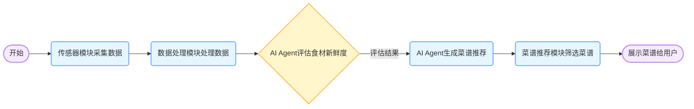

# 智能冰箱：AI Agent的食材新鲜度监测与菜谱推荐

> 关键词：智能冰箱、AI Agent、食材新鲜度监测、菜谱推荐、物联网

> 摘要：本文聚焦于智能冰箱领域，深入探讨了利用AI Agent实现食材新鲜度监测与菜谱推荐的技术。首先介绍了该研究的背景、目的、预期读者等信息，接着阐述了核心概念与联系，包括AI Agent、食材新鲜度监测和菜谱推荐的原理与架构。详细讲解了核心算法原理及具体操作步骤，运用Python代码进行了说明。同时给出了相关的数学模型和公式，并举例解释。通过项目实战，展示了代码的实际案例及详细解读。分析了该技术在日常生活中的实际应用场景，还推荐了学习资源、开发工具框架以及相关论文著作。最后总结了未来发展趋势与挑战，提供了常见问题解答和扩展阅读参考资料。

## 1. 背景介绍 
### 1.1 目的和范围
随着物联网和人工智能技术的飞速发展，智能家居设备逐渐走进人们的生活。智能冰箱作为智能家居的重要组成部分，其功能也在不断拓展和升级。本研究的目的在于开发一种基于AI Agent的智能冰箱系统，实现对冰箱内食材新鲜度的精准监测，并根据食材情况为用户提供个性化的菜谱推荐。范围涵盖了从食材新鲜度监测传感器的选型与数据采集，到AI Agent算法的设计与实现，再到菜谱推荐系统的构建与优化等多个方面。

### 1.2 预期读者
本文预期读者包括智能家居领域的开发者、研究人员，对人工智能和物联网技术在日常生活中应用感兴趣的爱好者，以及从事智能家电产品设计和开发的工程师等。

### 1.3 文档结构概述
本文首先介绍背景信息，为读者建立研究的整体框架。接着阐述核心概念与联系，让读者了解相关技术的基本原理和架构。核心算法原理和具体操作步骤部分，通过Python代码详细讲解实现思路。数学模型和公式部分，提供理论支持并举例说明。项目实战环节展示实际案例和代码解读。实际应用场景分析该技术在生活中的具体用途。工具和资源推荐为读者提供学习和开发的参考。最后总结未来发展趋势与挑战，解答常见问题并提供扩展阅读资料。

### 1.4 术语表
#### 1.4.1 核心术语定义
- **AI Agent**：人工智能代理，是一种能够感知环境、进行推理决策并采取行动以实现特定目标的智能实体。在本文中，AI Agent负责处理食材新鲜度监测数据，并根据数据生成菜谱推荐。
- **食材新鲜度监测**：通过各种传感器（如气体传感器、图像传感器等）对冰箱内食材的状态进行实时监测，评估食材的新鲜程度。
- **菜谱推荐**：根据冰箱内现有食材的种类、数量和新鲜度，结合用户的口味偏好、健康需求等因素，为用户推荐合适的菜谱。

#### 1.4.2 相关概念解释
- **物联网（IoT）**：将各种物理设备通过网络连接起来，实现设备之间的数据交换和远程控制。在智能冰箱中，物联网技术用于传感器数据的传输和冰箱与其他设备（如手机、云端服务器）的通信。
- **机器学习**：是一门多领域交叉学科，涉及概率论、统计学、逼近论、凸分析、算法复杂度理论等多门学科。它专门研究计算机怎样模拟或实现人类的学习行为，以获取新的知识或技能，重新组织已有的知识结构使之不断改善自身的性能。在本文中，机器学习算法用于对食材新鲜度进行评估和菜谱推荐。

#### 1.4.3 缩略词列表
- **AI**：Artificial Intelligence，人工智能
- **IoT**：Internet of Things，物联网
- **ML**：Machine Learning，机器学习

## 2. 核心概念与联系 
### 核心概念原理和架构

智能冰箱的AI Agent食材新鲜度监测与菜谱推荐系统主要由以下几个部分组成：

#### 传感器模块
传感器模块负责采集冰箱内食材的相关数据，包括温度、湿度、气体成分、图像等。不同类型的传感器可以提供不同方面的信息，例如：
- **温度传感器**：实时监测冰箱内的温度，确保食材处于适宜的保存环境。
- **气体传感器**：检测冰箱内的气体成分，如氧气、二氧化碳、乙烯等，这些气体的浓度变化可以反映食材的新鲜程度。
- **图像传感器**：拍摄冰箱内食材的照片，通过图像识别技术识别食材的种类和数量。

#### 数据处理模块
数据处理模块对传感器采集到的数据进行清洗、预处理和特征提取。例如，对图像数据进行降噪、归一化处理，提取图像中的颜色、形状等特征；对气体传感器数据进行滤波、校准，提取与食材新鲜度相关的特征。

#### AI Agent模块
AI Agent模块是整个系统的核心，它根据数据处理模块输出的特征数据，运用机器学习算法对食材的新鲜度进行评估，并根据评估结果和用户的偏好生成菜谱推荐。AI Agent可以通过学习历史数据和用户反馈不断优化自身的性能。

#### 菜谱推荐模块
菜谱推荐模块根据AI Agent生成的推荐结果，从菜谱数据库中筛选出合适的菜谱，并将菜谱信息展示给用户。菜谱数据库可以包含各种不同类型的菜谱，如家常菜、西餐、素食等，用户可以根据自己的需求进行选择。

### Mermaid流程图


## 3. 核心算法原理 & 具体操作步骤 
### 食材新鲜度评估算法
我们可以使用机器学习中的分类算法来评估食材的新鲜度。这里以逻辑回归算法为例，逻辑回归是一种常用的二分类算法，它可以根据输入的特征数据预测食材是否新鲜。

#### Python代码实现
```python
import numpy as np
from sklearn.linear_model import LogisticRegression
from sklearn.model_selection import train_test_split
from sklearn.metrics import accuracy_score

# 假设我们有一些样本数据，X是特征矩阵，y是标签向量
# 特征可以包括温度、气体浓度等，标签为0（不新鲜）或1（新鲜）
X = np.array([[20, 0.1, 0.05], [10, 0.05, 0.02], [30, 0.2, 0.1]])
y = np.array([0, 1, 0])

# 划分训练集和测试集
X_train, X_test, y_train, y_test = train_test_split(X, y, test_size=0.2, random_state=42)

# 创建逻辑回归模型
model = LogisticRegression()

# 训练模型
model.fit(X_train, y_train)

# 预测测试集
y_pred = model.predict(X_test)

# 计算准确率
accuracy = accuracy_score(y_test, y_pred)
print(f"模型准确率: {accuracy}")
```

### 具体操作步骤
1. **数据收集**：使用传感器模块收集冰箱内食材的相关数据，包括温度、湿度、气体成分等。
2. **数据预处理**：对收集到的数据进行清洗、归一化等预处理操作，以提高模型的性能。
3. **特征提取**：从预处理后的数据中提取与食材新鲜度相关的特征，如温度变化率、气体浓度变化趋势等。
4. **模型训练**：使用训练数据对逻辑回归模型进行训练，调整模型的参数以提高预测准确率。
5. **模型评估**：使用测试数据对训练好的模型进行评估，计算模型的准确率、召回率等指标。
6. **预测与应用**：将训练好的模型应用到实际场景中，对冰箱内的食材进行新鲜度评估，并根据评估结果进行相应的处理。

### 菜谱推荐算法
菜谱推荐可以使用基于内容的推荐算法。该算法根据冰箱内现有食材的种类和数量，以及菜谱所需的食材，计算菜谱与冰箱内食材的匹配度，从而推荐匹配度高的菜谱。

#### Python代码实现
```python
# 假设冰箱内的食材列表
fridge_ingredients = ["鸡蛋", "西红柿", "土豆"]

# 菜谱数据库，每个菜谱包含菜谱名称和所需食材列表
recipes = [
    {"name": "西红柿炒鸡蛋", "ingredients": ["鸡蛋", "西红柿"]},
    {"name": "土豆丝", "ingredients": ["土豆"]},
    {"name": "红烧肉", "ingredients": ["猪肉", "酱油", "冰糖"]}
]

# 计算每个菜谱与冰箱内食材的匹配度
matched_recipes = []
for recipe in recipes:
    match_count = 0
    for ingredient in recipe["ingredients"]:
        if ingredient in fridge_ingredients:
            match_count += 1
    match_ratio = match_count / len(recipe["ingredients"])
    matched_recipes.append({"name": recipe["name"], "match_ratio": match_ratio})

# 按匹配度排序并推荐前两个菜谱
matched_recipes.sort(key=lambda x: x["match_ratio"], reverse=True)
recommended_recipes = matched_recipes[:2]

print("推荐菜谱:")
for recipe in recommended_recipes:
    print(f"{recipe['name']}: 匹配度 {recipe['match_ratio']}")
```

### 具体操作步骤
1. **获取冰箱内食材信息**：通过图像识别或用户输入等方式获取冰箱内现有食材的种类和数量。
2. **构建菜谱数据库**：收集各种菜谱信息，包括菜谱名称、所需食材列表、烹饪步骤等。
3. **计算匹配度**：对于每个菜谱，计算其所需食材与冰箱内现有食材的匹配度。
4. **排序与推荐**：根据匹配度对菜谱进行排序，推荐匹配度高的菜谱给用户。

## 4. 数学模型和公式 & 详细讲解 & 举例说明 
### 逻辑回归模型
逻辑回归模型用于对食材的新鲜度进行分类预测。其基本原理是通过逻辑函数将线性回归的输出映射到[0, 1]区间，从而得到一个概率值。

#### 数学公式
逻辑回归的模型可以表示为：
$$P(y = 1|x) = \frac{1}{1 + e^{-(w_0 + w_1x_1 + w_2x_2 + \cdots + w_nx_n)}}$$
其中，$P(y = 1|x)$ 表示在输入特征 $x = [x_1, x_2, \cdots, x_n]$ 的条件下，样本属于正类（新鲜）的概率；$w_0, w_1, w_2, \cdots, w_n$ 是模型的参数。

#### 详细讲解
逻辑回归模型通过最大化似然函数来估计参数 $w$。似然函数可以表示为：
$$L(w) = \prod_{i = 1}^{m} P(y^{(i)}|x^{(i)})^{y^{(i)}} (1 - P(y^{(i)}|x^{(i)}))^{1 - y^{(i)}}$$
其中，$m$ 是样本数量，$y^{(i)}$ 是第 $i$ 个样本的标签，$x^{(i)}$ 是第 $i$ 个样本的特征向量。

为了方便计算，通常对似然函数取对数，得到对数似然函数：
$$\log L(w) = \sum_{i = 1}^{m} [y^{(i)} \log P(y^{(i)}|x^{(i)}) + (1 - y^{(i)}) \log (1 - P(y^{(i)}|x^{(i)}))]$$

然后使用梯度下降等优化算法来最大化对数似然函数，从而得到最优的参数 $w$。

#### 举例说明
假设我们有一个简单的数据集，包含两个特征 $x_1$ 和 $x_2$，以及对应的标签 $y$。我们可以使用逻辑回归模型来预测样本的标签。

```python
import numpy as np
from sklearn.linear_model import LogisticRegression

# 样本数据
X = np.array([[1, 2], [2, 3], [3, 4], [4, 5]])
y = np.array([0, 0, 1, 1])

# 创建逻辑回归模型
model = LogisticRegression()

# 训练模型
model.fit(X, y)

# 预测新样本
new_X = np.array([[5, 6]])
prediction = model.predict(new_X)
print(f"预测结果: {prediction}")
```

### 基于内容的菜谱推荐模型
基于内容的菜谱推荐模型通过计算菜谱与冰箱内食材的匹配度来进行推荐。

#### 数学公式
匹配度可以定义为菜谱所需食材与冰箱内现有食材的交集数量与菜谱所需食材总数的比值：
$$MatchRatio = \frac{|Ingredients_{recipe} \cap Ingredients_{fridge}|}{|Ingredients_{recipe}|}$$
其中，$Ingredients_{recipe}$ 是菜谱所需的食材列表，$Ingredients_{fridge}$ 是冰箱内现有食材的列表。

#### 详细讲解
该公式的核心思想是计算菜谱所需食材中有多少比例的食材可以在冰箱内找到。匹配度越高，说明该菜谱越适合使用冰箱内的现有食材来制作。

#### 举例说明
假设冰箱内有食材 ["鸡蛋", "西红柿", "土豆"]，菜谱 "西红柿炒鸡蛋" 所需食材为 ["鸡蛋", "西红柿"]。则该菜谱与冰箱内食材的匹配度为：
$$MatchRatio = \frac{|["鸡蛋", "西红柿"] \cap ["鸡蛋", "西红柿", "土豆"]|}{|["鸡蛋", "西红柿"]|} = \frac{2}{2} = 1$$

## 5. 项目实战：代码实际案例和详细解释说明 
### 5.1  开发环境搭建
#### 硬件环境
- **智能冰箱**：具备传感器模块（温度传感器、气体传感器、图像传感器等）和通信模块（Wi-Fi、蓝牙等）。
- **开发板**：如 Raspberry Pi，用于运行智能冰箱系统的软件。

#### 软件环境
- **操作系统**：Raspbian 或其他适合 Raspberry Pi 的操作系统。
- **编程语言**：Python 3.x
- **开发工具**：PyCharm 或 VS Code

#### 安装依赖库
```bash
pip install numpy scikit-learn opencv-python
```

### 5.2  源代码详细实现和代码解读
#### 食材新鲜度监测模块
```python
import numpy as np
from sklearn.linear_model import LogisticRegression

# 模拟传感器数据采集
def collect_sensor_data():
    # 这里可以添加实际的传感器数据采集代码
    temperature = 20
    gas_concentration = 0.1
    humidity = 0.5
    return np.array([temperature, gas_concentration, humidity]).reshape(1, -1)

# 加载训练好的逻辑回归模型
def load_model():
    # 这里可以添加模型加载代码，如从文件中加载模型
    X = np.array([[20, 0.1, 0.05], [10, 0.05, 0.02], [30, 0.2, 0.1]])
    y = np.array([0, 1, 0])
    model = LogisticRegression()
    model.fit(X, y)
    return model

# 评估食材新鲜度
def evaluate_freshness(model):
    data = collect_sensor_data()
    prediction = model.predict(data)
    if prediction[0] == 1:
        print("食材新鲜")
    else:
        print("食材不新鲜")

if __name__ == "__main__":
    model = load_model()
    evaluate_freshness(model)
```

#### 代码解读
- `collect_sensor_data` 函数模拟传感器数据的采集，实际应用中需要替换为真实的传感器数据采集代码。
- `load_model` 函数加载训练好的逻辑回归模型，这里为了简单起见，直接在代码中训练了一个模型。
- `evaluate_freshness` 函数使用加载的模型对采集到的传感器数据进行预测，判断食材是否新鲜。

#### 菜谱推荐模块
```python
# 假设冰箱内的食材列表
fridge_ingredients = ["鸡蛋", "西红柿", "土豆"]

# 菜谱数据库，每个菜谱包含菜谱名称和所需食材列表
recipes = [
    {"name": "西红柿炒鸡蛋", "ingredients": ["鸡蛋", "西红柿"]},
    {"name": "土豆丝", "ingredients": ["土豆"]},
    {"name": "红烧肉", "ingredients": ["猪肉", "酱油", "冰糖"]}
]

# 计算每个菜谱与冰箱内食材的匹配度
def calculate_match_ratio(recipe):
    match_count = 0
    for ingredient in recipe["ingredients"]:
        if ingredient in fridge_ingredients:
            match_count += 1
    match_ratio = match_count / len(recipe["ingredients"])
    return match_ratio

# 推荐菜谱
def recommend_recipes():
    matched_recipes = []
    for recipe in recipes:
        match_ratio = calculate_match_ratio(recipe)
        matched_recipes.append({"name": recipe["name"], "match_ratio": match_ratio})
    matched_recipes.sort(key=lambda x: x["match_ratio"], reverse=True)
    recommended_recipes = matched_recipes[:2]
    print("推荐菜谱:")
    for recipe in recommended_recipes:
        print(f"{recipe['name']}: 匹配度 {recipe['match_ratio']}")

if __name__ == "__main__":
    recommend_recipes()
```

#### 代码解读
- `calculate_match_ratio` 函数计算每个菜谱与冰箱内食材的匹配度。
- `recommend_recipes` 函数根据匹配度对菜谱进行排序，推荐匹配度高的菜谱给用户。

### 5.3  代码解读与分析
#### 食材新鲜度监测模块
- 该模块通过模拟传感器数据采集和逻辑回归模型预测，实现了对食材新鲜度的评估。在实际应用中，需要将传感器数据采集代码替换为真实的代码，确保数据的准确性。
- 逻辑回归模型的训练和加载可以根据实际情况进行优化，例如使用更多的样本数据进行训练，将模型保存到文件中以便后续加载使用。

#### 菜谱推荐模块
- 该模块使用基于内容的推荐算法，根据冰箱内现有食材和菜谱所需食材的匹配度进行推荐。代码简单易懂，但在实际应用中可以考虑更多的因素，如用户的口味偏好、健康需求等，以提高推荐的准确性和个性化程度。

## 6. 实际应用场景 
### 家庭场景
在家庭中，智能冰箱的食材新鲜度监测功能可以帮助用户及时了解冰箱内食材的状态，避免食用不新鲜的食材，保障家人的健康。菜谱推荐功能可以根据冰箱内的现有食材为用户提供烹饪建议，解决用户“不知道吃什么”的问题，同时减少食材的浪费。

### 餐饮行业场景
在餐饮行业中，智能冰箱可以实时监测食材的新鲜度，确保菜品的质量和安全。菜谱推荐功能可以根据库存食材为厨师提供菜品建议，优化菜单设计，提高食材的利用率。

### 超市配送场景
在超市配送环节，智能冰箱可以作为配送终端，实时监测食材在运输过程中的新鲜度。同时，根据配送的食材为用户提供相关的菜谱推荐，增加用户的购买欲望。

## 7. 工具和资源推荐
### 7.1 学习资源推荐
#### 7.1.1 书籍推荐
- 《Python机器学习》：本书详细介绍了Python在机器学习领域的应用，包括数据预处理、模型选择、算法实现等方面的内容，适合初学者入门。
- 《人工智能：一种现代的方法》：经典的人工智能教材，涵盖了人工智能的各个领域，包括搜索算法、知识表示、机器学习、自然语言处理等，对深入理解人工智能技术有很大帮助。

#### 7.1.2 在线课程
- Coursera上的《机器学习》课程：由斯坦福大学教授Andrew Ng主讲，是机器学习领域的经典课程，内容丰富，讲解详细。
- edX上的《人工智能基础》课程：介绍了人工智能的基本概念、算法和应用，适合对人工智能感兴趣的初学者。

#### 7.1.3 技术博客和网站
- 博客园：国内知名的技术博客平台，有很多关于人工智能、物联网等领域的技术文章。
- Medium：国外的技术博客平台，有很多国际知名的技术专家分享他们的经验和见解。

### 7.2 开发工具框架推荐
#### 7.2.1 IDE和编辑器
- PyCharm：专业的Python集成开发环境，具有代码编辑、调试、自动补全、代码分析等功能，适合Python项目的开发。
- VS Code：轻量级的代码编辑器，支持多种编程语言，有丰富的插件扩展功能，可以满足不同的开发需求。

#### 7.2.2 调试和性能分析工具
- Py-Spy：用于分析Python程序的性能，找出程序中的性能瓶颈。
- pdb：Python自带的调试工具，可以帮助开发者调试Python代码。

#### 7.2.3 相关框架和库
- Scikit-learn：用于机器学习的Python库，提供了丰富的机器学习算法和工具，如分类、回归、聚类等。
- OpenCV：用于计算机视觉的Python库，提供了图像和视频处理的功能，可用于图像识别、目标检测等任务。

### 7.3 相关论文著作推荐
#### 7.3.1 经典论文
- 《A Logical Calculus of the Ideas Immanent in Nervous Activity》：这篇论文提出了神经元模型，是神经网络领域的经典论文。
- 《Support-Vector Networks》：介绍了支持向量机算法，是机器学习领域的重要论文。

#### 7.3.2 最新研究成果
- 《Deep Learning for Freshness Prediction of Fruits and Vegetables Based on Hyperspectral Imaging》：利用深度学习技术基于高光谱成像预测果蔬新鲜度的研究。
- 《A Recipe Recommendation System Based on Food Ingredient and Nutritional Information》：基于食材和营养信息的菜谱推荐系统的研究。

#### 7.3.3 应用案例分析
- 《Smart Refrigerator Applications in the Internet of Things Era》：介绍了智能冰箱在物联网时代的应用案例和发展趋势。
- 《Case Studies of Recipe Recommendation Systems in Smart Homes》：智能家居中菜谱推荐系统的应用案例分析。

## 8. 总结：未来发展趋势与挑战
### 未来发展趋势
- **智能化程度不断提高**：随着人工智能技术的不断发展，智能冰箱的智能化程度将越来越高。例如，AI Agent可以学习用户的饮食习惯和偏好，提供更加个性化的菜谱推荐；可以自动调整冰箱的温度和湿度，以更好地保存不同种类的食材。
- **与其他智能家居设备的融合**：智能冰箱将与其他智能家居设备（如智能音箱、智能烤箱等）实现更加紧密的融合。用户可以通过语音指令控制冰箱的功能，冰箱也可以与其他设备协同工作，实现更加便捷的烹饪体验。
- **大数据和云计算的应用**：智能冰箱可以将采集到的大量数据上传到云端，利用大数据分析技术进行深度挖掘和分析。例如，分析用户的消费习惯和食材使用情况，为超市和供应商提供精准的市场预测和产品推荐。

### 挑战
- **数据安全和隐私问题**：智能冰箱采集的用户数据涉及到个人隐私和食品安全等重要问题。如何保障数据的安全和隐私，防止数据泄露和滥用，是智能冰箱发展面临的重要挑战。
- **传感器技术的局限性**：目前的传感器技术在精度、可靠性和成本等方面还存在一定的局限性。例如，气体传感器对某些气体的检测精度不够高，图像传感器在复杂光照条件下的识别效果不佳。需要进一步研发和改进传感器技术，提高其性能和适用性。
- **用户接受度和使用习惯**：智能冰箱作为一种新兴的智能家居设备，用户对其功能和使用方法还不够熟悉。如何提高用户的接受度，引导用户养成良好的使用习惯，是智能冰箱推广和普及的关键。

## 9. 附录：常见问题与解答
### 问题1：智能冰箱的食材新鲜度监测准确吗？
答：智能冰箱的食材新鲜度监测准确性取决于传感器的精度和算法的优化程度。目前的技术可以在一定程度上准确评估食材的新鲜度，但仍存在一定的误差。随着传感器技术和算法的不断发展，监测的准确性将不断提高。

### 问题2：菜谱推荐的依据是什么？
答：菜谱推荐主要依据冰箱内现有食材的种类和数量，同时可以结合用户的口味偏好、健康需求等因素进行个性化推荐。

### 问题3：智能冰箱的数据安全如何保障？
答：智能冰箱的数据安全可以通过多种方式保障，如采用加密技术对数据进行加密传输和存储，设置严格的访问权限控制，定期对系统进行安全漏洞检测和修复等。

### 问题4：智能冰箱的价格贵吗？
答：智能冰箱的价格相对传统冰箱会高一些，主要是因为其增加了传感器、AI Agent等智能模块。随着技术的普及和成本的降低，智能冰箱的价格将逐渐下降，更加亲民。

## 10. 扩展阅读 & 参考资料
### 扩展阅读
- 《智能家居技术与应用》：全面介绍了智能家居的相关技术和应用场景，对智能冰箱的发展有一定的参考价值。
- 《人工智能与未来生活》：探讨了人工智能技术对未来生活的影响，包括智能家电的发展趋势。

### 参考资料
- [Scikit-learn官方文档](https://scikit-learn.org/stable/documentation.html)
- [OpenCV官方文档](https://docs.opencv.org/master/)
- [智能家居行业报告](https://www.example.com/smart-home-report)

作者：AI天才研究院/AI Genius Institute & 禅与计算机程序设计艺术 /Zen And The Art of Computer Programming