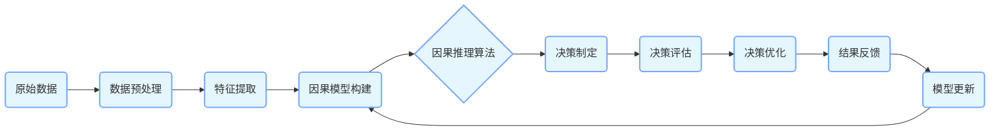

# 智能决策系统中多层次因果推理的实现方法

> 关键词：智能决策系统、多层次因果推理、因果模型、机器学习、贝叶斯网络

> 摘要：本文聚焦于智能决策系统中多层次因果推理的实现方法。首先介绍了相关背景知识，包括目的范围、预期读者等。接着阐述了核心概念与联系，详细说明了多层次因果推理的原理和架构。通过Python代码深入讲解了核心算法原理及具体操作步骤，同时给出了数学模型和公式并举例说明。以实际项目为例，展示了代码实现和详细解读。分析了多层次因果推理在不同领域的实际应用场景，推荐了学习资源、开发工具框架以及相关论文著作。最后总结了未来发展趋势与挑战，还提供了常见问题解答和扩展阅读参考资料，旨在为研究和应用智能决策系统中的多层次因果推理提供全面且深入的指导。

## 1. 背景介绍 
### 1.1 目的和范围
智能决策系统在当今复杂的社会和经济环境中扮演着至关重要的角色，它能够帮助人们在众多的选择中做出最优决策。而多层次因果推理作为智能决策系统的核心技术之一，能够深入挖掘数据背后的因果关系，从而为决策提供更可靠的依据。本文的目的在于详细探讨智能决策系统中多层次因果推理的实现方法，涵盖从理论原理到实际应用的各个方面。范围包括多层次因果推理的核心概念、算法原理、数学模型、项目实战、应用场景以及相关的工具和资源推荐等。

### 1.2 预期读者
本文预期读者主要包括人工智能领域的研究人员、软件开发者、数据科学家以及对智能决策系统和因果推理感兴趣的专业人士。这些读者具备一定的编程和数学基础，希望深入了解多层次因果推理在智能决策系统中的具体实现方法和应用。

### 1.3 文档结构概述
本文将按照以下结构进行组织：首先介绍多层次因果推理的背景知识，包括目的范围、预期读者和文档结构概述等。接着阐述核心概念与联系，通过文本示意图和Mermaid流程图展示其原理和架构。然后详细讲解核心算法原理及具体操作步骤，使用Python代码进行说明。之后给出数学模型和公式，并举例说明。再通过项目实战展示代码的实际实现和详细解读。分析多层次因果推理的实际应用场景，推荐相关的学习资源、开发工具框架和论文著作。最后总结未来发展趋势与挑战，提供常见问题解答和扩展阅读参考资料。

### 1.4 术语表
#### 1.4.1 核心术语定义
- **智能决策系统**：一种利用人工智能技术，结合数据处理、模型分析等方法，为决策者提供最优决策建议的系统。
- **多层次因果推理**：在不同层次上对因果关系进行推理和分析的过程，能够考虑到复杂系统中多种因素之间的因果联系。
- **因果模型**：用于描述变量之间因果关系的数学模型，如贝叶斯网络、结构因果模型等。
- **贝叶斯网络**：一种基于概率图模型的因果表示方法，通过有向无环图和条件概率表来描述变量之间的因果关系。
- **结构因果模型**：一种更一般化的因果模型，通过结构方程来描述变量之间的因果关系。

#### 1.4.2 相关概念解释
- **因果关系**：指一个事件（原因）的发生导致另一个事件（结果）的发生的关系。在多层次因果推理中，需要区分直接因果关系和间接因果关系。
- **层次结构**：表示因果关系在不同抽象层次上的组织方式，例如宏观层次和微观层次的因果关系。
- **推理算法**：用于从数据中推断因果关系的算法，如基于约束的算法、基于评分的算法等。

#### 1.4.3 缩略词列表
- **IDSS**：Intelligent Decision Support System，智能决策支持系统
- **BN**：Bayesian Network，贝叶斯网络
- **SCM**：Structural Causal Model，结构因果模型

## 2. 核心概念与联系 

### 核心概念原理
多层次因果推理的核心在于理解不同层次上的因果关系。在智能决策系统中，通常存在多个层次的变量，每个层次的变量之间存在着复杂的因果联系。例如，在一个企业的决策系统中，宏观层次的变量可能包括市场需求、行业竞争等，微观层次的变量可能包括产品质量、营销策略等。多层次因果推理需要考虑到这些不同层次变量之间的相互作用，从而准确地推断出因果关系。

其原理基于因果模型，通过对数据的分析和建模，找出变量之间的因果结构。常见的因果模型有贝叶斯网络和结构因果模型。贝叶斯网络通过有向无环图和条件概率表来表示变量之间的因果关系，结构因果模型则通过结构方程来描述变量之间的因果关系。

### 架构的文本示意图
```plaintext
智能决策系统
├── 数据层
│   ├── 原始数据
│   ├── 数据预处理
│   └── 特征提取
├── 因果模型层
│   ├── 贝叶斯网络
│   ├── 结构因果模型
│   └── 因果推理算法
├── 决策层
│   ├── 决策制定
│   ├── 决策评估
│   └── 决策优化
└── 反馈层
    ├── 结果反馈
    └── 模型更新
```

### Mermaid流程图


## 3. 核心算法原理 & 具体操作步骤 

### 贝叶斯网络结构学习算法原理
贝叶斯网络的结构学习是指从数据中推断出贝叶斯网络的有向无环图结构。常见的结构学习算法有基于约束的算法和基于评分的算法。这里我们以基于评分的算法为例进行讲解。

基于评分的算法的核心思想是定义一个评分函数，用于评估不同的贝叶斯网络结构的优劣，然后通过搜索算法找到评分最高的结构。常用的评分函数有贝叶斯信息准则（BIC）和最小描述长度（MDL）。

### Python代码实现
```python
import pandas as pd
from pgmpy.estimators import HillClimbSearch, BicScore

# 加载数据
data = pd.read_csv('data.csv')

# 创建评分器
bic = BicScore(data)

# 创建搜索器
est = HillClimbSearch(data)

# 搜索最优结构
best_model = est.estimate(scoring_method=bic)

# 打印最优结构
print(best_model.edges())
```

### 具体操作步骤
1. **数据加载**：使用`pandas`库加载数据，确保数据为CSV格式。
2. **评分器创建**：使用`pgmpy`库中的`BicScore`类创建评分器。
3. **搜索器创建**：使用`pgmpy`库中的`HillClimbSearch`类创建搜索器。
4. **结构搜索**：调用搜索器的`estimate`方法，传入评分器，搜索最优结构。
5. **结果输出**：打印最优结构的边。

## 4. 数学模型和公式 & 详细讲解 & 举例说明 

### 贝叶斯网络的概率公式
贝叶斯网络通过条件概率表来表示变量之间的因果关系。对于一个包含 $n$ 个变量 $X_1, X_2, \cdots, X_n$ 的贝叶斯网络，其联合概率分布可以表示为：

$$P(X_1, X_2, \cdots, X_n) = \prod_{i=1}^{n} P(X_i | Pa(X_i))$$

其中，$Pa(X_i)$ 表示变量 $X_i$ 的父节点集合。

### 详细讲解
这个公式的含义是，贝叶斯网络中所有变量的联合概率分布等于每个变量在其父节点条件下的条件概率的乘积。这是基于贝叶斯网络的条件独立性假设，即每个变量在给定其父节点的条件下，与其他非子孙节点条件独立。

### 举例说明
假设我们有一个简单的贝叶斯网络，包含三个变量 $A$、$B$ 和 $C$，其中 $A$ 是 $B$ 的父节点，$B$ 是 $C$ 的父节点。则其联合概率分布可以表示为：

$$P(A, B, C) = P(A) \times P(B | A) \times P(C | B)$$

假设 $P(A) = 0.5$，$P(B | A = 0) = 0.2$，$P(B | A = 1) = 0.8$，$P(C | B = 0) = 0.3$，$P(C | B = 1) = 0.7$。

当 $A = 1$，$B = 1$，$C = 1$ 时，其联合概率为：

$$P(A = 1, B = 1, C = 1) = P(A = 1) \times P(B = 1 | A = 1) \times P(C = 1 | B = 1) = 0.5 \times 0.8 \times 0.7 = 0.28$$

## 5. 项目实战：代码实际案例和详细解释说明 

### 5.1  开发环境搭建
#### 安装Python
首先需要安装Python，建议使用Python 3.7及以上版本。可以从Python官方网站（https://www.python.org/downloads/）下载安装包进行安装。

#### 安装必要的库
使用`pip`命令安装必要的库，包括`pandas`、`pgmpy`等。

```bash
pip install pandas pgmpy
```

### 5.2  源代码详细实现和代码解读
```python
import pandas as pd
from pgmpy.estimators import HillClimbSearch, BicScore
from pgmpy.models import BayesianNetwork
from pgmpy.inference import VariableElimination

# 加载数据
data = pd.read_csv('data.csv')

# 创建评分器
bic = BicScore(data)

# 创建搜索器
est = HillClimbSearch(data)

# 搜索最优结构
best_model = est.estimate(scoring_method=bic)

# 创建贝叶斯网络模型
model = BayesianNetwork(best_model.edges())

# 拟合数据
model.fit(data)

# 创建推理器
infer = VariableElimination(model)

# 进行因果推理
result = infer.query(variables=['target_variable'], evidence={'evidence_variable': 1})

# 打印推理结果
print(result)
```

### 代码解读与分析
1. **数据加载**：使用`pandas`库的`read_csv`函数加载数据。
2. **评分器和搜索器创建**：使用`pgmpy`库的`BicScore`类创建评分器，使用`HillClimbSearch`类创建搜索器。
3. **结构搜索**：调用搜索器的`estimate`方法，传入评分器，搜索最优结构。
4. **模型创建和拟合**：使用搜索到的最优结构创建贝叶斯网络模型，并使用`fit`方法拟合数据。
5. **推理器创建**：使用`VariableElimination`类创建推理器。
6. **因果推理**：调用推理器的`query`方法，传入目标变量和证据变量，进行因果推理。
7. **结果输出**：打印推理结果。

## 6. 实际应用场景 
### 医疗决策
在医疗领域，多层次因果推理可以帮助医生更准确地诊断疾病和制定治疗方案。例如，通过分析患者的症状、病史、基因数据等多个层次的信息，推断出疾病的因果关系，从而为医生提供更科学的决策依据。

### 金融风险评估
在金融领域，多层次因果推理可以用于评估金融风险。例如，通过分析宏观经济数据、行业数据、企业财务数据等多个层次的信息，推断出金融风险的因果关系，从而为金融机构提供更准确的风险评估和决策建议。

### 智能交通管理
在智能交通领域，多层次因果推理可以用于交通流量预测和交通拥堵治理。例如，通过分析交通流量数据、天气数据、道路状况数据等多个层次的信息，推断出交通拥堵的因果关系，从而为交通管理部门提供更有效的交通管理策略。

## 7. 工具和资源推荐
### 7.1 学习资源推荐
#### 7.1.1 书籍推荐
- 《因果推断：基础与学习算法》：全面介绍了因果推断的基本概念、方法和算法，是学习因果推理的经典教材。
- 《贝叶斯网络与决策图》：详细讲解了贝叶斯网络的理论和应用，对于理解贝叶斯网络在因果推理中的应用有很大帮助。

#### 7.1.2 在线课程
- Coursera上的“因果推理”课程：由知名教授授课，系统地介绍了因果推理的理论和方法。
- edX上的“人工智能中的因果推理”课程：结合实际案例，讲解了因果推理在人工智能领域的应用。

#### 7.1.3 技术博客和网站
- Causal Inference for the Brave and True：一个专门介绍因果推断的博客，提供了丰富的教程和案例。
- Judea Pearl的个人网站：Judea Pearl是因果推理领域的著名学者，他的网站上有很多关于因果推理的研究成果和论文。

### 7.2 开发工具框架推荐
#### 7.2.1 IDE和编辑器
- PyCharm：一款功能强大的Python集成开发环境，提供了代码编辑、调试、版本控制等功能。
- Jupyter Notebook：一种交互式的开发环境，适合进行数据探索和模型开发。

#### 7.2.2 调试和性能分析工具
- PDB：Python自带的调试器，可以帮助开发者定位和解决代码中的问题。
- cProfile：Python的性能分析工具，可以帮助开发者分析代码的性能瓶颈。

#### 7.2.3 相关框架和库
- pgmpy：一个用于概率图模型的Python库，支持贝叶斯网络、马尔可夫网络等多种模型的构建和推理。
- causal-learn：一个用于因果学习的Python库，提供了多种因果推理算法的实现。

### 7.3 相关论文著作推荐
#### 7.3.1 经典论文
- Judea Pearl的“Causality: Models, Reasoning, and Inference”：该论文奠定了因果推理的理论基础，提出了结构因果模型和因果图等重要概念。
- Peter Spirtes, Clark Glymour, and Richard Scheines的“Causation, Prediction, and Search”：详细介绍了基于约束的因果推理算法，是因果推理领域的经典之作。

#### 7.3.2 最新研究成果
- “Learning Causal Networks from Time-Series Data with Latent Variables”：提出了一种从时间序列数据中学习因果网络的方法，考虑了潜在变量的影响。
- “Causal Discovery from Multi-View Data”：研究了从多视图数据中进行因果发现的问题，提出了一种多视图因果发现算法。

#### 7.3.3 应用案例分析
- “Causal Inference in Healthcare: Applications and Challenges”：分析了因果推理在医疗领域的应用和挑战，提供了一些实际案例。
- “Causal Analysis in Finance: A Survey”：对因果分析在金融领域的应用进行了综述，介绍了一些成功的应用案例。

## 8. 总结：未来发展趋势与挑战
### 未来发展趋势
- **与深度学习的融合**：将多层次因果推理与深度学习相结合，能够更好地处理复杂的高维数据，提高因果推理的准确性和效率。
- **多源数据融合**：随着数据的不断丰富，多层次因果推理将更加注重多源数据的融合，包括文本、图像、视频等多种类型的数据。
- **实时因果推理**：在一些实时决策场景中，如智能交通、金融交易等，需要实时进行因果推理，未来的研究将更加关注实时因果推理算法的开发。

### 挑战
- **数据质量和缺失值处理**：因果推理对数据质量要求较高，数据中的噪声和缺失值会影响因果关系的推断。如何处理数据质量和缺失值是一个亟待解决的问题。
- **因果模型的可解释性**：虽然因果模型能够提供因果关系的推断，但很多模型的可解释性较差，难以被决策者理解和接受。提高因果模型的可解释性是一个重要的研究方向。
- **计算复杂度**：多层次因果推理通常需要处理大量的数据和复杂的模型，计算复杂度较高。如何降低计算复杂度，提高推理效率是一个挑战。

## 9. 附录：常见问题与解答
### 问题1：多层次因果推理与传统因果推理有什么区别？
答：多层次因果推理考虑了不同层次上的因果关系，能够更全面地分析复杂系统中的因果联系。而传统因果推理通常只考虑单一层次的因果关系。

### 问题2：如何选择合适的因果推理算法？
答：选择合适的因果推理算法需要考虑数据的特点、问题的复杂度和计算资源等因素。一般来说，基于约束的算法适用于数据量较小、变量之间关系较简单的情况；基于评分的算法适用于数据量较大、变量之间关系较复杂的情况。

### 问题3：因果推理结果的可靠性如何评估？
答：可以通过交叉验证、敏感性分析等方法评估因果推理结果的可靠性。交叉验证可以评估模型的泛化能力，敏感性分析可以分析模型对不同参数和假设的敏感性。

## 10. 扩展阅读 & 参考资料
- Pearl, Judea. Causality: Models, Reasoning, and Inference. Cambridge University Press, 2009.
- Spirtes, Peter, Clark Glymour, and Richard Scheines. Causation, Prediction, and Search. MIT Press, 2000.
- Peters, Jonas, Dominik Janzing, and Bernhard Schölkopf. Elements of Causal Inference: Foundations and Learning Algorithms. MIT Press, 2017.
- pgmpy官方文档：https://pgmpy.org/
- causal-learn官方文档：https://causal-learn.readthedocs.io/

作者：AI天才研究院/AI Genius Institute & 禅与计算机程序设计艺术 /Zen And The Art of Computer Programming