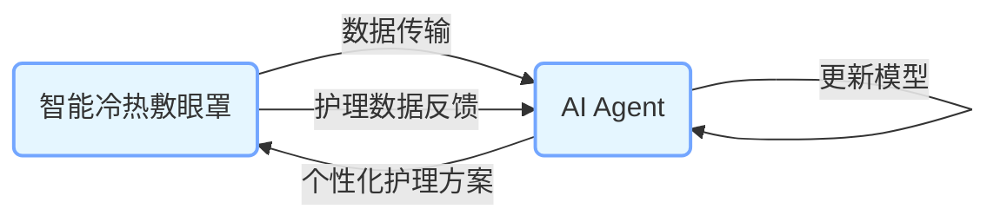

# 智能冷热敷眼罩：AI Agent的眼部护理定制

> 关键词：智能冷热敷眼罩、AI Agent、眼部护理定制、健康监测、个性化服务

> 摘要：本文聚焦于智能冷热敷眼罩借助AI Agent实现眼部护理定制这一前沿技术。首先介绍了相关背景，包括研究目的、预期读者等。接着阐述了核心概念与联系，如智能冷热敷眼罩和AI Agent的原理及架构。详细讲解了核心算法原理与具体操作步骤，并给出Python代码示例。通过数学模型和公式进一步分析其原理。结合项目实战，展示了代码实际案例及详细解释。探讨了该技术的实际应用场景，推荐了学习资源、开发工具框架和相关论文著作。最后总结了未来发展趋势与挑战，还提供了常见问题解答和扩展阅读参考资料，旨在全面深入地介绍智能冷热敷眼罩的AI Agent眼部护理定制技术。

## 1. 背景介绍 
### 1.1 目的和范围
随着现代生活节奏的加快，人们长时间使用电子设备，眼部疲劳、干涩、近视等问题日益严重。智能冷热敷眼罩作为一种新型的眼部护理设备，能够通过冷热交替的方式缓解眼部疲劳、促进血液循环。而引入AI Agent技术，可以根据用户的眼部状况、使用习惯等因素，为用户提供个性化的眼部护理方案。本文章的目的在于深入探讨智能冷热敷眼罩与AI Agent结合的技术原理、实现方法以及实际应用，范围涵盖了从核心概念的阐述到项目实战的展示，以及对未来发展趋势的展望。

### 1.2 预期读者
本文预期读者包括对智能硬件、人工智能、健康护理等领域感兴趣的技术爱好者、开发者、研究人员，以及关注眼部健康的普通消费者。技术爱好者可以从中了解智能冷热敷眼罩与AI Agent结合的前沿技术；开发者可以获取相关的算法原理和代码实现细节，用于实际项目开发；研究人员可以参考本文的研究思路和方法，开展更深入的研究；普通消费者则可以通过本文了解智能冷热敷眼罩的工作原理和优势，以便更好地选择和使用相关产品。

### 1.3 文档结构概述
本文将按照以下结构进行组织：首先介绍核心概念与联系，包括智能冷热敷眼罩和AI Agent的原理和架构；接着阐述核心算法原理与具体操作步骤，并给出Python代码示例；然后通过数学模型和公式详细讲解其原理，并举例说明；结合项目实战，展示代码实际案例及详细解释；探讨该技术的实际应用场景；推荐学习资源、开发工具框架和相关论文著作；最后总结未来发展趋势与挑战，提供常见问题解答和扩展阅读参考资料。

### 1.4 术语表
#### 1.4.1 核心术语定义
- **智能冷热敷眼罩**：一种具备冷热温度调节功能的眼罩设备，可通过内置的温度控制模块实现冷敷和热敷的切换，以达到缓解眼部疲劳、促进血液循环等护理效果。
- **AI Agent**：人工智能代理，是一种能够感知环境、自主决策并采取行动以实现特定目标的智能实体。在本文中，AI Agent用于分析用户的眼部状况和使用习惯，为智能冷热敷眼罩提供个性化的护理方案。
- **眼部护理定制**：根据用户的个体差异，如眼部疲劳程度、眼部疾病史、使用时间等因素，为用户量身定制的眼部护理方案，包括热敷温度、冷敷温度、护理时长等参数。

#### 1.4.2 相关概念解释
- **传感器技术**：用于采集智能冷热敷眼罩的相关数据，如温度、湿度、压力等，以及用户的眼部生理数据，如眼压、眼疲劳程度等。
- **机器学习算法**：AI Agent利用机器学习算法对采集到的数据进行分析和处理，以建立用户的眼部健康模型，从而实现个性化的护理方案推荐。
- **物联网技术**：智能冷热敷眼罩通过物联网技术与智能手机、云服务器等设备进行连接，实现数据的传输和共享，方便用户远程控制和管理。

#### 1.4.3 缩略词列表
- **AI**：Artificial Intelligence，人工智能
- **IoT**：Internet of Things，物联网
- **ML**：Machine Learning，机器学习

## 2. 核心概念与联系 
### 智能冷热敷眼罩原理
智能冷热敷眼罩主要由温度控制模块、传感器模块、电源模块和外壳组成。温度控制模块采用半导体制冷片或加热丝实现冷敷和热敷功能，通过调节电流的大小和方向来控制温度的高低。传感器模块用于采集眼罩内部的温度、湿度等环境数据，以及用户的眼部生理数据，如眼压、眼疲劳程度等。电源模块为眼罩提供电力支持，可采用充电电池或外接电源。外壳采用柔软舒适的材料，确保用户佩戴的舒适性。

### AI Agent原理
AI Agent是一种基于人工智能技术的智能实体，它通过感知环境、分析数据、做出决策并采取行动来实现特定的目标。在智能冷热敷眼罩中，AI Agent的主要功能是分析用户的眼部状况和使用习惯，为用户提供个性化的眼部护理方案。AI Agent通过传感器模块采集用户的眼部生理数据和使用环境数据，利用机器学习算法对这些数据进行分析和处理，建立用户的眼部健康模型。根据用户的眼部健康模型，AI Agent可以预测用户的眼部疲劳程度和可能出现的眼部问题，并为用户推荐合适的护理方案，如热敷温度、冷敷温度、护理时长等。

### 两者联系架构
智能冷热敷眼罩与AI Agent之间通过物联网技术进行连接，形成一个闭环的智能系统。传感器模块将采集到的数据传输给AI Agent，AI Agent对数据进行分析和处理后，为智能冷热敷眼罩提供个性化的护理方案。智能冷热敷眼罩根据AI Agent提供的方案调整温度和护理时长，实现对用户眼部的个性化护理。同时，智能冷热敷眼罩还可以将护理过程中的数据反馈给AI Agent，AI Agent根据反馈数据对用户的眼部健康模型进行更新和优化，进一步提高护理方案的准确性和有效性。

以下是该架构的Mermaid流程图：


## 3. 核心算法原理 & 具体操作步骤 
### 核心算法原理
AI Agent在智能冷热敷眼罩中主要采用机器学习算法来实现个性化的眼部护理方案推荐。常用的机器学习算法包括决策树、支持向量机、神经网络等。以神经网络为例，其原理是通过构建一个多层的神经网络模型，将用户的眼部生理数据和使用环境数据作为输入，经过神经网络的计算和处理，输出个性化的护理方案。神经网络模型的训练过程是通过大量的样本数据进行学习，调整神经网络的权重和偏置，使得模型的输出结果与实际的护理方案尽可能接近。

### 具体操作步骤
1. **数据采集**：通过传感器模块采集用户的眼部生理数据和使用环境数据，如眼压、眼疲劳程度、温度、湿度等。
2. **数据预处理**：对采集到的数据进行清洗、归一化等预处理操作，以提高数据的质量和可用性。
3. **模型训练**：使用预处理后的数据对神经网络模型进行训练，调整模型的权重和偏置，使得模型的输出结果与实际的护理方案尽可能接近。
4. **护理方案推荐**：将用户的实时数据输入到训练好的神经网络模型中，模型输出个性化的护理方案，如热敷温度、冷敷温度、护理时长等。
5. **方案执行**：智能冷热敷眼罩根据AI Agent提供的护理方案调整温度和护理时长，实现对用户眼部的个性化护理。
6. **数据反馈**：智能冷热敷眼罩将护理过程中的数据反馈给AI Agent，AI Agent根据反馈数据对用户的眼部健康模型进行更新和优化。

### Python代码示例
```python
import numpy as np
import tensorflow as tf
from tensorflow.keras.models import Sequential
from tensorflow.keras.layers import Dense

# 生成示例数据
# 假设输入数据包含眼压、眼疲劳程度、温度、湿度
# 输出数据为热敷温度、冷敷温度、护理时长
np.random.seed(0)
X = np.random.rand(100, 4)  # 100个样本，每个样本4个特征
y = np.random.rand(100, 3)  # 100个样本，每个样本3个输出

# 构建神经网络模型
model = Sequential([
    Dense(10, activation='relu', input_shape=(4,)),
    Dense(3)
])

# 编译模型
model.compile(optimizer='adam', loss='mse')

# 训练模型
model.fit(X, y, epochs=100, batch_size=10)

# 生成一个测试样本
test_sample = np.random.rand(1, 4)

# 进行预测
prediction = model.predict(test_sample)
print("预测的护理方案：", prediction)
```

## 4. 数学模型和公式 & 详细讲解 & 举例说明 
### 神经网络模型
神经网络模型是一种模仿人类神经系统的计算模型，由多个神经元组成。每个神经元接收多个输入信号，经过加权求和和非线性变换后输出一个信号。神经网络模型可以表示为：

$$
y = f(Wx + b)
$$

其中，$x$ 是输入向量，$W$ 是权重矩阵，$b$ 是偏置向量，$f$ 是激活函数。激活函数的作用是引入非线性因素，使得神经网络能够处理复杂的非线性问题。常用的激活函数包括Sigmoid函数、ReLU函数等。

### 损失函数
损失函数用于衡量模型的输出结果与实际结果之间的差异。在神经网络中，常用的损失函数是均方误差（Mean Squared Error，MSE）：

$$
MSE = \frac{1}{n} \sum_{i=1}^{n} (y_i - \hat{y}_i)^2
$$

其中，$n$ 是样本数量，$y_i$ 是实际结果，$\hat{y}_i$ 是模型的输出结果。

### 优化算法
优化算法用于调整神经网络的权重和偏置，使得损失函数的值最小化。常用的优化算法包括随机梯度下降（Stochastic Gradient Descent，SGD）、Adam等。以Adam算法为例，其更新公式为：

$$
m_t = \beta_1 m_{t-1} + (1 - \beta_1) g_t
$$

$$
v_t = \beta_2 v_{t-1} + (1 - \beta_2) g_t^2
$$

$$
\hat{m}_t = \frac{m_t}{1 - \beta_1^t}
$$

$$
\hat{v}_t = \frac{v_t}{1 - \beta_2^t}
$$

$$
\theta_{t+1} = \theta_t - \frac{\alpha}{\sqrt{\hat{v}_t} + \epsilon} \hat{m}_t
$$

其中，$m_t$ 和 $v_t$ 分别是一阶矩估计和二阶矩估计，$\beta_1$ 和 $\beta_2$ 是衰减率，$g_t$ 是梯度，$\alpha$ 是学习率，$\epsilon$ 是一个小的常数，$\theta_t$ 是第 $t$ 次迭代的参数。

### 举例说明
假设我们有一个简单的神经网络模型，输入层有2个神经元，隐藏层有3个神经元，输出层有1个神经元。输入向量 $x = [x_1, x_2]$，权重矩阵 $W_1$ 是一个 $3 \times 2$ 的矩阵，偏置向量 $b_1$ 是一个长度为3的向量，权重矩阵 $W_2$ 是一个 $1 \times 3$ 的矩阵，偏置向量 $b_2$ 是一个长度为1的向量。激活函数采用ReLU函数：

$$
f(x) = \max(0, x)
$$

则隐藏层的输出为：

$$
h = f(W_1x + b_1)
$$

输出层的输出为：

$$
y = W_2h + b_2
$$

假设输入向量 $x = [1, 2]$，权重矩阵 $W_1 = \begin{bmatrix} 0.1 & 0.2 \\ 0.3 & 0.4 \\ 0.5 & 0.6 \end{bmatrix}$，偏置向量 $b_1 = [0.1, 0.2, 0.3]$，权重矩阵 $W_2 = \begin{bmatrix} 0.7 & 0.8 & 0.9 \end{bmatrix}$，偏置向量 $b_2 = [0.4]$。则隐藏层的输入为：

$$
W_1x + b_1 = \begin{bmatrix} 0.1 & 0.2 \\ 0.3 & 0.4 \\ 0.5 & 0.6 \end{bmatrix} \begin{bmatrix} 1 \\ 2 \end{bmatrix} + \begin{bmatrix} 0.1 \\ 0.2 \\ 0.3 \end{bmatrix} = \begin{bmatrix} 0.1 \times 1 + 0.2 \times 2 + 0.1 \\ 0.3 \times 1 + 0.4 \times 2 + 0.2 \\ 0.5 \times 1 + 0.6 \times 2 + 0.3 \end{bmatrix} = \begin{bmatrix} 0.6 \\ 1.3 \\ 2 \end{bmatrix}
$$

隐藏层的输出为：

$$
h = f(W_1x + b_1) = \begin{bmatrix} \max(0, 0.6) \\ \max(0, 1.3) \\ \max(0, 2) \end{bmatrix} = \begin{bmatrix} 0.6 \\ 1.3 \\ 2 \end{bmatrix}
$$

输出层的输出为：

$$
y = W_2h + b_2 = \begin{bmatrix} 0.7 & 0.8 & 0.9 \end{bmatrix} \begin{bmatrix} 0.6 \\ 1.3 \\ 2 \end{bmatrix} + 0.4 = 0.7 \times 0.6 + 0.8 \times 1.3 + 0.9 \times 2 + 0.4 = 3.62
$$

## 5. 项目实战：代码实际案例和详细解释说明 
### 5.1  开发环境搭建
- **硬件环境**：智能冷热敷眼罩开发板、传感器模块（如温度传感器、压力传感器等）、电源模块。
- **软件环境**：Python 3.x、TensorFlow、Keras、Arduino IDE（如果使用Arduino开发板）。

### 5.2  源代码详细实现和代码解读
以下是一个完整的智能冷热敷眼罩AI Agent项目的Python代码示例：

```python
import numpy as np
import tensorflow as tf
from tensorflow.keras.models import Sequential
from tensorflow.keras.layers import Dense
import random

# 模拟传感器数据采集
def collect_sensor_data():
    # 假设采集到的眼压、眼疲劳程度、温度、湿度
    eye_pressure = random.uniform(10, 20)
    eye_fatigue = random.uniform(0, 1)
    temperature = random.uniform(20, 30)
    humidity = random.uniform(30, 70)
    return np.array([eye_pressure, eye_fatigue, temperature, humidity])

# 生成示例数据
np.random.seed(0)
X = np.random.rand(100, 4)  # 100个样本，每个样本4个特征
y = np.random.rand(100, 3)  # 100个样本，每个样本3个输出

# 构建神经网络模型
model = Sequential([
    Dense(10, activation='relu', input_shape=(4,)),
    Dense(3)
])

# 编译模型
model.compile(optimizer='adam', loss='mse')

# 训练模型
model.fit(X, y, epochs=100, batch_size=10)

# 主循环
while True:
    # 采集传感器数据
    sensor_data = collect_sensor_data()
    sensor_data = sensor_data.reshape(1, -1)
    
    # 进行预测
    prediction = model.predict(sensor_data)
    hot_temp, cold_temp, duration = prediction[0]
    
    print("当前传感器数据：", sensor_data)
    print("推荐的热敷温度：", hot_temp)
    print("推荐的冷敷温度：", cold_temp)
    print("推荐的护理时长：", duration)
    
    # 模拟智能冷热敷眼罩执行护理方案
    print("智能冷热敷眼罩开始执行护理方案...")
    
    # 模拟一定时间的护理过程
    import time
    time.sleep(duration)
    
    print("护理方案执行完毕。")
```

### 5.3  代码解读与分析
1. **数据采集**：`collect_sensor_data` 函数模拟了传感器数据的采集过程，返回一个包含眼压、眼疲劳程度、温度、湿度的数组。
2. **模型构建与训练**：使用Keras构建了一个简单的神经网络模型，包含一个输入层、一个隐藏层和一个输出层。使用均方误差作为损失函数，Adam算法作为优化器进行模型训练。
3. **主循环**：在主循环中，不断采集传感器数据，将数据输入到训练好的模型中进行预测，得到推荐的热敷温度、冷敷温度和护理时长。然后模拟智能冷热敷眼罩执行护理方案，等待一定时间后护理方案执行完毕。

## 6. 实际应用场景 
### 日常眼部护理
对于长时间使用电子设备的人群，如上班族、学生等，智能冷热敷眼罩可以根据用户的眼部疲劳程度和使用时间，为用户提供个性化的眼部护理方案。在工作或学习间隙，用户可以佩戴智能冷热敷眼罩进行冷敷或热敷，缓解眼部疲劳，促进血液循环。

### 眼部疾病辅助治疗
对于患有眼部疾病的人群，如青光眼、干眼症等，智能冷热敷眼罩可以作为辅助治疗工具。AI Agent可以根据用户的眼部疾病史和当前的眼部状况，为用户推荐合适的护理方案，如热敷温度、冷敷温度、护理时长等，帮助用户缓解眼部症状，促进眼部康复。

### 睡眠辅助
智能冷热敷眼罩还可以用于睡眠辅助。在睡前，用户可以佩戴智能冷热敷眼罩进行热敷，放松眼部肌肉，缓解眼部紧张情绪，帮助用户更快入睡，提高睡眠质量。

## 7. 工具和资源推荐
### 7.1 学习资源推荐
#### 7.1.1 书籍推荐
- 《Python深度学习》：由Francois Chollet所著，是一本介绍Python和深度学习的经典书籍，详细讲解了深度学习的基本原理和实践方法。
- 《机器学习》：由周志华所著，是国内机器学习领域的经典教材，全面介绍了机器学习的基本概念、算法和应用。
- 《人工智能：一种现代的方法》：由Stuart Russell和Peter Norvig所著，是人工智能领域的权威教材，涵盖了人工智能的各个方面，包括搜索算法、知识表示、机器学习、自然语言处理等。

#### 7.1.2 在线课程
- Coursera上的“深度学习专项课程”：由Andrew Ng教授授课，包括深度学习基础、卷积神经网络、循环神经网络等多个课程，是学习深度学习的优质课程。
- edX上的“人工智能导论”：由MIT教授授课，介绍了人工智能的基本概念、算法和应用，适合初学者入门。
- 中国大学MOOC上的“机器学习”：由清华大学教授授课，系统介绍了机器学习的基本原理和算法，内容丰富，讲解详细。

#### 7.1.3 技术博客和网站
- Medium：一个技术博客平台，上面有很多关于人工智能、机器学习、深度学习等领域的优质文章。
- Towards Data Science：专注于数据科学和机器学习领域的技术博客，提供了很多实用的技术文章和案例分析。
- 机器之心：国内知名的人工智能媒体，提供了人工智能领域的最新技术动态、研究成果和应用案例。

### 7.2 开发工具框架推荐
#### 7.2.1 IDE和编辑器
- PyCharm：一款专门为Python开发设计的集成开发环境，具有代码自动补全、调试、版本控制等功能，是Python开发者的首选工具。
- Jupyter Notebook：一个基于Web的交互式开发环境，支持Python、R等多种编程语言，适合进行数据分析、模型训练和可视化等工作。
- Visual Studio Code：一款轻量级的代码编辑器，支持多种编程语言和插件扩展，具有丰富的代码编辑和调试功能。

#### 7.2.2 调试和性能分析工具
- TensorBoard：TensorFlow的可视化工具，可以用于查看模型的训练过程、损失函数变化、参数分布等信息，帮助开发者调试和优化模型。
- Py-Spy：一个用于Python代码性能分析的工具，可以实时监控Python程序的CPU使用情况、函数调用时间等信息，帮助开发者找出性能瓶颈。
- cProfile：Python内置的性能分析工具，可以统计Python程序中各个函数的调用次数、执行时间等信息，帮助开发者优化代码性能。

#### 7.2.3 相关框架和库
- TensorFlow：Google开发的开源深度学习框架，具有高效的计算性能和丰富的工具库，支持多种深度学习模型的构建和训练。
- PyTorch：Facebook开发的开源深度学习框架，具有动态图机制和简洁的API，适合快速原型开发和研究。
- Scikit-learn：一个用于机器学习的Python库，提供了丰富的机器学习算法和工具，如分类、回归、聚类、降维等，适合初学者入门。

### 7.3 相关论文著作推荐
#### 7.3.1 经典论文
- 《Gradient-based learning applied to document recognition》：由Yann LeCun等人发表，介绍了卷积神经网络（CNN）的基本原理和应用，是深度学习领域的经典论文。
- 《Long Short-Term Memory》：由Sepp Hochreiter和Jürgen Schmidhuber发表，提出了长短期记忆网络（LSTM），解决了循环神经网络（RNN）中的梯度消失和梯度爆炸问题。
- 《Attention Is All You Need》：由Ashish Vaswani等人发表，提出了Transformer模型，是自然语言处理领域的重要突破。

#### 7.3.2 最新研究成果
- 关注顶级学术会议，如NeurIPS、ICML、CVPR等，这些会议上会发表很多人工智能领域的最新研究成果。
- 关注知名学术期刊，如Journal of Artificial Intelligence Research（JAIR）、Artificial Intelligence等，这些期刊上会发表高质量的人工智能研究论文。

#### 7.3.3 应用案例分析
- 阅读相关的行业报告和案例分析，了解智能冷热敷眼罩在实际应用中的效果和经验。例如，一些医疗健康领域的报告可能会介绍智能冷热敷眼罩在眼部疾病辅助治疗中的应用案例。

## 8. 总结：未来发展趋势与挑战
### 未来发展趋势
- **个性化定制更加精准**：随着传感器技术和机器学习算法的不断发展，AI Agent能够更准确地分析用户的眼部状况和使用习惯，为用户提供更加个性化的眼部护理方案。
- **与其他健康设备集成**：智能冷热敷眼罩可能会与其他健康设备，如智能手环、智能眼镜等进行集成，实现数据的共享和交互，为用户提供更加全面的健康管理服务。
- **智能化程度不断提高**：智能冷热敷眼罩将具备更多的智能化功能，如自动调节温度、自动识别用户身份、自动推荐护理方案等，提高用户的使用体验。
- **应用场景不断拓展**：除了日常眼部护理和眼部疾病辅助治疗，智能冷热敷眼罩还可能会应用于更多的领域，如美容、运动康复等。

### 挑战
- **数据隐私和安全问题**：智能冷热敷眼罩采集的用户眼部生理数据属于敏感信息，如何保障数据的隐私和安全是一个重要的挑战。
- **算法准确性和可靠性**：AI Agent的算法准确性和可靠性直接影响到个性化护理方案的质量，需要不断优化和改进算法，提高算法的准确性和可靠性。
- **硬件性能和功耗问题**：智能冷热敷眼罩需要具备一定的硬件性能来实现温度控制、数据采集和处理等功能，同时还需要考虑功耗问题，以保证设备的续航能力。
- **用户接受度问题**：智能冷热敷眼罩作为一种新型的眼部护理设备，用户对其认知和接受度还需要进一步提高。需要加强市场推广和宣传，提高用户对产品的了解和信任。

## 9. 附录：常见问题与解答
### 智能冷热敷眼罩的使用频率是多少？
智能冷热敷眼罩的使用频率应根据个人的眼部状况和需求来确定。一般来说，对于长时间使用电子设备的人群，建议每天使用1-2次，每次15-20分钟。对于患有眼部疾病的人群，应在医生的指导下使用。

### 智能冷热敷眼罩的温度范围是多少？
智能冷热敷眼罩的温度范围一般在10℃-50℃之间。冷敷温度通常在10℃-20℃之间，热敷温度通常在35℃-50℃之间。具体的温度范围可以根据个人的需求和舒适度进行调整。

### 智能冷热敷眼罩的电池续航时间是多久？
智能冷热敷眼罩的电池续航时间取决于电池容量和使用频率。一般来说，一次充满电后可以使用2-3次，每次使用15-20分钟。

### 智能冷热敷眼罩可以清洗吗？
智能冷热敷眼罩的外壳通常可以拆卸清洗，但需要注意避免水进入眼罩内部的电子元件。在清洗前，应先将眼罩断电，并按照说明书的要求进行清洗。

## 10. 扩展阅读 & 参考资料
### 扩展阅读
- 《智能硬件开发实战》：介绍了智能硬件的开发流程和技术，包括传感器技术、物联网技术、嵌入式系统开发等，适合对智能硬件开发感兴趣的读者阅读。
- 《人工智能时代的医疗变革》：探讨了人工智能在医疗领域的应用和发展趋势，包括智能诊断、智能治疗、健康管理等方面，为智能冷热敷眼罩的发展提供了广阔的思路。

### 参考资料
- 相关的专利文献和技术报告，了解智能冷热敷眼罩和AI Agent的最新技术进展。
- 智能冷热敷眼罩产品的用户手册和说明书，了解产品的使用方法和注意事项。

作者：AI天才研究院/AI Genius Institute & 禅与计算机程序设计艺术 /Zen And The Art of Computer Programming