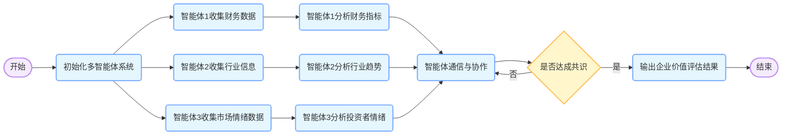

# 智能化企业价值计算：多智能体AI在价值投资中的新方法

> 关键词：智能化企业价值计算、多智能体AI、价值投资、新方法、金融科技

> 摘要：本文聚焦于智能化企业价值计算，深入探讨多智能体AI在价值投资领域的新应用方法。随着金融市场的日益复杂和数据量的爆炸式增长，传统的企业价值计算和投资方法面临诸多挑战。多智能体AI作为一种新兴技术，能够模拟多个智能个体之间的交互和协作，为企业价值计算和价值投资带来新的思路和解决方案。文章将详细介绍多智能体AI的核心概念、算法原理、数学模型，并结合实际项目案例进行分析，同时探讨其在不同应用场景中的表现，最后对未来发展趋势和挑战进行总结。

## 1. 背景介绍 
### 1.1 目的和范围
本文章的主要目的是全面介绍多智能体AI在智能化企业价值计算和价值投资中的新方法。随着金融科技的快速发展，投资者和金融机构需要更精准、高效的工具来评估企业价值和做出投资决策。多智能体AI为解决这些问题提供了新的途径。文章将涵盖多智能体AI的基本原理、相关算法、数学模型，以及如何将其应用于实际的企业价值计算和价值投资中。同时，还会分析其在不同市场环境和行业中的适用性和局限性。

### 1.2 预期读者
本文的预期读者包括金融领域的专业人士，如投资经理、分析师、交易员等，他们希望通过新的技术手段提升企业价值评估和投资决策的准确性。同时，也适合对人工智能在金融领域应用感兴趣的研究人员、学生以及科技创业者，帮助他们了解多智能体AI在价值投资中的应用前景和技术细节。

### 1.3 文档结构概述
本文将按照以下结构进行组织：首先介绍多智能体AI和企业价值计算的核心概念及其相互联系，并用示意图和流程图进行说明；接着详细阐述多智能体AI的核心算法原理，结合Python代码进行解释；然后介绍相关的数学模型和公式，并举例说明；之后通过实际项目案例展示多智能体AI在企业价值计算和价值投资中的应用；再探讨其实际应用场景；推荐相关的学习资源、开发工具和论文著作；最后对未来发展趋势和挑战进行总结，并提供常见问题解答和扩展阅读资料。

### 1.4 术语表
#### 1.4.1 核心术语定义
- **多智能体AI（Multi - Agent AI）**：由多个具有自主决策能力的智能体组成的系统，这些智能体可以相互通信、协作和竞争，以实现共同或各自的目标。
- **企业价值计算（Enterprise Value Calculation）**：评估企业整体价值的过程，考虑企业的资产、负债、现金流、市场竞争力等多个因素。
- **价值投资（Value Investing）**：一种投资策略，通过分析企业的内在价值，寻找被低估的股票进行投资，以期在长期获得回报。

#### 1.4.2 相关概念解释
- **智能体（Agent）**：在多智能体系统中，智能体是一个具有感知、决策和行动能力的实体。它可以根据自身的目标和环境信息做出决策，并采取相应的行动。
- **内在价值（Intrinsic Value）**：企业的真实价值，不依赖于市场价格，通常通过对企业的基本面分析来确定。

#### 1.4.3 缩略词列表
- **AI**：人工智能（Artificial Intelligence）
- **MDP**：马尔可夫决策过程（Markov Decision Process）

## 2. 核心概念与联系 

### 多智能体AI的原理
多智能体AI的核心思想是模拟多个智能个体在一个环境中的交互和协作。每个智能体都有自己的目标、知识和决策能力，它们通过与其他智能体和环境进行通信和交互来实现共同或各自的目标。智能体可以是软件程序、机器人或其他具有自主决策能力的实体。

在企业价值计算和价值投资中，多智能体AI可以模拟不同的市场参与者，如投资者、分析师、企业管理者等。每个智能体可以根据自己的专业知识和信息对企业价值进行评估，并与其他智能体进行交流和协作，以得出更准确的企业价值评估结果。

### 企业价值计算的方法
传统的企业价值计算方法包括资产基础法、收益法和市场法。资产基础法是通过评估企业的资产和负债来确定企业的价值；收益法是通过预测企业未来的现金流并折现来计算企业的价值；市场法是通过比较类似企业的市场价格来评估企业的价值。

然而，这些方法都存在一定的局限性。例如，资产基础法可能无法准确反映企业的无形资产价值；收益法对未来现金流的预测存在不确定性；市场法可能受到市场情绪和可比企业选择的影响。

### 多智能体AI与企业价值计算的联系
多智能体AI可以弥补传统企业价值计算方法的不足。通过模拟多个市场参与者的行为和决策，多智能体AI可以综合考虑更多的因素，如市场情绪、行业趋势、企业战略等，从而更准确地评估企业的价值。

例如，在多智能体AI系统中，一个智能体可以专门分析企业的财务报表，另一个智能体可以关注行业动态和市场趋势，还有一个智能体可以模拟投资者的情绪和行为。这些智能体之间相互交流和协作，共同得出企业的价值评估结果。

### 文本示意图
```plaintext
多智能体AI系统
|-- 智能体1（财务分析）
|   |-- 收集企业财务数据
|   |-- 分析财务指标
|   |-- 评估财务健康状况
|-- 智能体2（行业研究）
|   |-- 收集行业信息
|   |-- 分析行业趋势
|   |-- 评估行业竞争力
|-- 智能体3（市场情绪模拟）
|   |-- 收集市场情绪数据
|   |-- 分析投资者情绪
|   |-- 预测市场波动
|-- 智能体通信与协作
|   |-- 信息共享
|   |-- 协同决策
|-- 企业价值评估结果
```

### Mermaid流程图


## 3. 核心算法原理 & 具体操作步骤 

### 多智能体强化学习算法原理
多智能体强化学习是多智能体AI中常用的算法之一。在强化学习中，智能体通过与环境进行交互，不断尝试不同的行动，并根据环境反馈的奖励来调整自己的策略，以最大化长期累积奖励。

在多智能体强化学习中，每个智能体都有自己的奖励函数和策略。智能体之间可以通过通信和协作来共同优化整个系统的性能。例如，在企业价值计算中，每个智能体可以根据自己对企业价值的评估结果获得相应的奖励，然后通过与其他智能体的协作来调整自己的评估策略，以提高整个系统的评估准确性。

### Python代码实现
以下是一个简单的多智能体强化学习示例，用于模拟两个智能体在一个简单环境中的协作：

```python
import numpy as np

# 定义环境
class Environment:
    def __init__(self):
        self.state = np.random.randint(0, 2)  # 初始状态

    def step(self, action1, action2):
        # 根据智能体的行动更新状态
        if action1 == 1 and action2 == 1:
            reward1 = 1
            reward2 = 1
            self.state = 1
        else:
            reward1 = 0
            reward2 = 0
            self.state = 0
        return self.state, reward1, reward2

# 定义智能体
class Agent:
    def __init__(self):
        self.q_table = np.zeros((2, 2))  # Q表，用于存储每个状态下每个行动的价值
        self.epsilon = 0.1  # 探索率
        self.alpha = 0.1  # 学习率
        self.gamma = 0.9  # 折扣因子

    def choose_action(self, state):
        if np.random.uniform(0, 1) < self.epsilon:
            action = np.random.randint(0, 2)  # 探索
        else:
            action = np.argmax(self.q_table[state])  # 利用
        return action

    def update_q_table(self, state, action, reward, next_state):
        # 更新Q表
        q_value = self.q_table[state][action]
        max_q_next = np.max(self.q_table[next_state])
        new_q_value = q_value + self.alpha * (reward + self.gamma * max_q_next - q_value)
        self.q_table[state][action] = new_q_value

# 主循环
env = Environment()
agent1 = Agent()
agent2 = Agent()

for episode in range(1000):
    state = env.state
    action1 = agent1.choose_action(state)
    action2 = agent2.choose_action(state)
    next_state, reward1, reward2 = env.step(action1, action2)
    agent1.update_q_table(state, action1, reward1, next_state)
    agent2.update_q_table(state, action2, reward2, next_state)

print("智能体1的Q表：")
print(agent1.q_table)
print("智能体2的Q表：")
print(agent2.q_table)
```

### 具体操作步骤
1. **初始化**：初始化多智能体系统，包括每个智能体的参数（如Q表、学习率、折扣因子等）和环境的初始状态。
2. **智能体行动选择**：每个智能体根据当前环境状态选择一个行动。可以采用探索 - 利用策略，如epsilon - greedy策略。
3. **环境交互**：智能体将选择的行动发送给环境，环境根据行动更新状态，并返回奖励给每个智能体。
4. **Q表更新**：每个智能体根据环境反馈的奖励和下一个状态更新自己的Q表。
5. **重复步骤2 - 4**：不断重复上述步骤，直到达到预定的训练次数或满足终止条件。

## 4. 数学模型和公式 & 详细讲解 & 举例说明 

### 马尔可夫决策过程（MDP）
马尔可夫决策过程是强化学习的基础数学模型，用于描述智能体与环境之间的交互。一个MDP可以用一个五元组 $(S, A, P, R, \gamma)$ 表示，其中：
- $S$ 是状态空间，表示环境可能处于的所有状态。
- $A$ 是行动空间，表示智能体可以采取的所有行动。
- $P(s'|s, a)$ 是状态转移概率，表示在状态 $s$ 下采取行动 $a$ 后转移到状态 $s'$ 的概率。
- $R(s, a)$ 是奖励函数，表示在状态 $s$ 下采取行动 $a$ 所获得的即时奖励。
- $\gamma$ 是折扣因子，用于权衡即时奖励和未来奖励的重要性，取值范围为 $[0, 1]$。

### Q - learning算法
Q - learning是一种基于价值的强化学习算法，用于求解MDP的最优策略。Q - learning的核心是Q函数 $Q(s, a)$，表示在状态 $s$ 下采取行动 $a$ 的期望累积奖励。Q - learning算法通过不断更新Q函数来逼近最优Q函数 $Q^*(s, a)$。

Q - learning的更新公式为：
$$Q(s_t, a_t) \leftarrow Q(s_t, a_t) + \alpha [R(s_t, a_t) + \gamma \max_{a} Q(s_{t+1}, a) - Q(s_t, a_t)]$$
其中：
- $s_t$ 是当前状态。
- $a_t$ 是当前行动。
- $R(s_t, a_t)$ 是在状态 $s_t$ 下采取行动 $a_t$ 所获得的即时奖励。
- $s_{t+1}$ 是下一个状态。
- $\alpha$ 是学习率，控制每次更新的步长。
- $\gamma$ 是折扣因子。

### 举例说明
假设一个简单的MDP，状态空间 $S = \{0, 1\}$，行动空间 $A = \{0, 1\}$，状态转移概率和奖励函数如下：

| $s$ | $a$ | $s'$ | $P(s'|s, a)$ | $R(s, a)$ |
|-----|-----|------|--------------|-----------|
| 0   | 0   | 0    | 0.8          | 0         |
| 0   | 0   | 1    | 0.2          | 0         |
| 0   | 1   | 0    | 0.3          | 1         |
| 0   | 1   | 1    | 0.7          | 1         |
| 1   | 0   | 0    | 0.6          | 0         |
| 1   | 0   | 1    | 0.4          | 0         |
| 1   | 1   | 0    | 0.1          | 2         |
| 1   | 1   | 1    | 0.9          | 2         |

假设初始Q表为：
$$Q = \begin{bmatrix}
0 & 0 \\
0 & 0
\end{bmatrix}$$

学习率 $\alpha = 0.1$，折扣因子 $\gamma = 0.9$。

当前状态 $s_t = 0$，智能体选择行动 $a_t = 1$，环境转移到状态 $s_{t+1} = 1$，并返回奖励 $R(s_t, a_t) = 1$。

根据Q - learning更新公式：
$$Q(0, 1) \leftarrow Q(0, 1) + 0.1 [1 + 0.9 \max_{a} Q(1, a) - Q(0, 1)]$$
由于初始Q表中 $Q(1, 0) = Q(1, 1) = 0$，则 $\max_{a} Q(1, a) = 0$。
$$Q(0, 1) \leftarrow 0 + 0.1 [1 + 0.9 \times 0 - 0] = 0.1$$

更新后的Q表为：
$$Q = \begin{bmatrix}
0 & 0.1 \\
0 & 0
\end{bmatrix}$$

## 5. 项目实战：代码实际案例和详细解释说明 

### 5.1 开发环境搭建
- **操作系统**：推荐使用Linux或Windows操作系统。
- **Python版本**：建议使用Python 3.7及以上版本。
- **安装依赖库**：需要安装NumPy、Pandas、Scikit - learn等常用库，以及用于强化学习的OpenAI Gym库。可以使用以下命令进行安装：
```bash
pip install numpy pandas scikit-learn gym
```

### 5.2 源代码详细实现和代码解读
以下是一个基于多智能体强化学习的企业价值计算示例代码：

```python
import numpy as np
import pandas as pd
from sklearn.preprocessing import StandardScaler
import gym
from gym import spaces

# 定义企业价值计算环境
class EnterpriseValueEnv(gym.Env):
    def __init__(self):
        # 读取企业财务数据
        self.data = pd.read_csv('enterprise_data.csv')
        self.data = self.data.dropna()
        self.scaler = StandardScaler()
        self.data_scaled = self.scaler.fit_transform(self.data.iloc[:, :-1])
        self.labels = self.data.iloc[:, -1].values

        self.n_features = self.data_scaled.shape[1]
        self.n_agents = 2
        self.current_step = 0
        self.max_steps = len(self.data_scaled) - 1

        # 定义行动空间和观测空间
        self.action_space = spaces.Box(low=-1, high=1, shape=(self.n_agents,))
        self.observation_space = spaces.Box(low=-np.inf, high=np.inf, shape=(self.n_features,))

    def reset(self):
        self.current_step = 0
        return self.data_scaled[self.current_step]

    def step(self, actions):
        state = self.data_scaled[self.current_step]
        label = self.labels[self.current_step]

        # 简单的奖励函数，根据行动与真实价值的接近程度计算奖励
        reward1 = -np.abs(actions[0] - label)
        reward2 = -np.abs(actions[1] - label)

        self.current_step += 1
        done = self.current_step >= self.max_steps
        next_state = self.data_scaled[self.current_step] if not done else None

        return next_state, [reward1, reward2], done, {}

# 定义智能体
class Agent:
    def __init__(self, n_features, n_actions):
        self.n_features = n_features
        self.n_actions = n_actions
        self.q_table = np.zeros((n_features, n_actions))
        self.epsilon = 0.1
        self.alpha = 0.1
        self.gamma = 0.9

    def choose_action(self, state):
        if np.random.uniform(0, 1) < self.epsilon:
            action = np.random.uniform(-1, 1)
        else:
            action = np.argmax(self.q_table[state])
        return action

    def update_q_table(self, state, action, reward, next_state):
        q_value = self.q_table[state][action]
        max_q_next = np.max(self.q_table[next_state])
        new_q_value = q_value + self.alpha * (reward + self.gamma * max_q_next - q_value)
        self.q_table[state][action] = new_q_value

# 主循环
env = EnterpriseValueEnv()
agent1 = Agent(env.n_features, env.action_space.shape[0])
agent2 = Agent(env.n_features, env.action_space.shape[0])

for episode in range(100):
    state = env.reset()
    done = False
    while not done:
        action1 = agent1.choose_action(state)
        action2 = agent2.choose_action(state)
        next_state, rewards, done, _ = env.step([action1, action2])
        agent1.update_q_table(state, action1, rewards[0], next_state)
        agent2.update_q_table(state, action2, rewards[1], next_state)
        state = next_state

print("训练完成")
```

### 5.3 代码解读与分析
- **环境定义**：`EnterpriseValueEnv` 类继承自 `gym.Env`，定义了企业价值计算的环境。在 `__init__` 方法中，读取企业财务数据并进行标准化处理，定义了行动空间和观测空间。`reset` 方法用于重置环境状态，`step` 方法根据智能体的行动更新环境状态并返回奖励。
- **智能体定义**：`Agent` 类实现了一个简单的Q - learning智能体。`choose_action` 方法根据epsilon - greedy策略选择行动，`update_q_table` 方法根据Q - learning更新公式更新Q表。
- **主循环**：在主循环中，创建环境和智能体实例，进行多个回合的训练。每个回合中，智能体根据当前状态选择行动，与环境进行交互，获取奖励并更新Q表。

通过这种方式，智能体可以不断学习如何根据企业的财务数据评估企业的价值。

## 6. 实际应用场景 
### 股票投资决策
在股票投资中，多智能体AI可以帮助投资者更准确地评估企业的价值。不同的智能体可以分别关注企业的财务状况、行业竞争力、市场情绪等因素，通过协作和信息共享，得出更全面、准确的企业价值评估结果。投资者可以根据这些评估结果选择被低估的股票进行投资。

### 并购重组评估
在企业并购重组过程中，准确评估目标企业的价值至关重要。多智能体AI可以模拟不同利益相关者的决策过程，考虑各种复杂因素，如协同效应、整合成本等，为并购重组决策提供更科学的依据。

### 风险评估与管理
金融机构可以利用多智能体AI评估企业的信用风险和市场风险。智能体可以实时监测企业的财务指标、市场动态等信息，及时发现潜在的风险因素，并采取相应的风险管理措施。

### 投资组合优化
多智能体AI可以用于优化投资组合。不同的智能体可以负责分析不同的资产类别，根据市场情况和投资者的风险偏好，动态调整投资组合的配置，以实现投资收益的最大化和风险的最小化。

## 7. 工具和资源推荐
### 7.1 学习资源推荐
#### 7.1.1 书籍推荐
- 《强化学习：原理与Python实现》：详细介绍了强化学习的基本原理和Python实现方法，对于理解多智能体强化学习有很大帮助。
- 《人工智能：一种现代的方法》：全面介绍了人工智能的各个领域，包括多智能体系统，是人工智能领域的经典教材。
- 《价值投资：从格雷厄姆到巴菲特》：深入阐述了价值投资的理论和方法，对于理解企业价值计算和价值投资的基本概念非常有帮助。

#### 7.1.2 在线课程
- Coursera上的“强化学习专项课程”：由顶尖高校的教授授课，系统地介绍了强化学习的理论和实践。
- edX上的“人工智能基础”：涵盖了人工智能的多个方面，包括多智能体系统的基础知识。
- Udemy上的“价值投资实战课程”：通过实际案例讲解价值投资的方法和技巧。

#### 7.1.3 技术博客和网站
- Towards Data Science：提供了大量关于人工智能、机器学习和数据科学的技术文章和案例分析。
- Medium上的人工智能相关博客：有很多专业人士分享的多智能体AI和价值投资的最新研究成果和实践经验。
- 金融界网站：提供了丰富的金融市场数据和分析报告，对于了解企业价值计算和价值投资的实际应用场景有很大帮助。

### 7.2 开发工具框架推荐
#### 7.2.1 IDE和编辑器
- PyCharm：一款专业的Python集成开发环境，提供了丰富的代码编辑、调试和项目管理功能。
- Jupyter Notebook：一种交互式的开发环境，适合进行数据分析和模型实验，方便展示代码和结果。
- Visual Studio Code：一款轻量级的代码编辑器，支持多种编程语言和插件，具有良好的扩展性。

#### 7.2.2 调试和性能分析工具
- PDB：Python自带的调试工具，可以帮助开发者逐行调试代码，定位问题。
- TensorBoard：用于可视化深度学习模型的训练过程和性能指标，对于多智能体强化学习模型的调试和优化有很大帮助。
- cProfile：Python的性能分析工具，可以分析代码的运行时间和内存使用情况，帮助开发者优化代码性能。

#### 7.2.3 相关框架和库
- OpenAI Gym：一个用于开发和比较强化学习算法的工具包，提供了丰富的环境和接口，方便开发者进行强化学习实验。
- Stable Baselines：一个基于TensorFlow的强化学习库，提供了多种预训练的强化学习算法和模型，方便开发者快速实现和测试强化学习模型。
- Scikit - learn：一个常用的机器学习库，提供了多种机器学习算法和工具，可用于数据预处理、特征工程和模型评估等任务。

### 7.3 相关论文著作推荐
#### 7.3.1 经典论文
- “Multi - Agent Reinforcement Learning: A Selective Survey”：对多智能体强化学习的研究现状进行了全面的综述，介绍了多种多智能体强化学习算法和应用场景。
- “Value Investing: The Use of Historical Financial Statement Information to Separate Winners from Losers”：阐述了价值投资的理论基础和方法，通过实证研究证明了价值投资的有效性。
- “Markov Decision Processes”：奠定了马尔可夫决策过程的理论基础，是强化学习领域的经典论文。

#### 7.3.2 最新研究成果
- 每年在NeurIPS、ICML、AAAI等顶级人工智能会议上发表的关于多智能体AI和价值投资的研究论文，反映了该领域的最新研究进展。
- 金融学术期刊如《Journal of Finance》、《Review of Financial Studies》上发表的关于企业价值计算和价值投资的最新研究成果。

#### 7.3.3 应用案例分析
- 一些知名金融机构和投资公司发布的关于多智能体AI在价值投资中的应用案例分析报告，介绍了实际应用中的经验和教训。
- 开源项目中的多智能体AI在金融领域的应用案例，如GitHub上的相关项目。

## 8. 总结：未来发展趋势与挑战
### 未来发展趋势
- **与其他技术的融合**：多智能体AI将与区块链、物联网等技术深度融合，实现更高效、安全的金融交易和企业价值评估。例如，区块链技术可以提供不可篡改的企业数据，物联网技术可以实时收集企业的运营数据，为多智能体AI提供更准确的信息。
- **智能化投资顾问**：随着多智能体AI技术的不断发展，智能化投资顾问将逐渐普及。投资者可以通过智能化投资顾问获取个性化的投资建议，提高投资决策的准确性和效率。
- **跨领域应用**：多智能体AI在价值投资中的应用将拓展到其他领域，如医疗、能源、交通等。通过评估不同领域企业的价值，为投资者提供更多的投资机会。

### 挑战
- **数据质量和隐私问题**：多智能体AI需要大量的高质量数据进行训练，但金融数据往往存在噪声、缺失值等问题，影响模型的准确性。同时，数据隐私和安全也是一个重要的问题，如何在保护数据隐私的前提下利用数据进行训练是一个挑战。
- **模型可解释性**：多智能体AI模型通常比较复杂，难以解释其决策过程和结果。在金融领域，模型的可解释性非常重要，投资者需要了解模型是如何评估企业价值和做出投资决策的。
- **市场不确定性**：金融市场具有高度的不确定性，多智能体AI模型难以准确预测市场的变化。如何提高模型的鲁棒性和适应性，应对市场的不确定性是一个挑战。

## 9. 附录：常见问题与解答
### 问题1：多智能体AI与传统人工智能算法有什么区别？
多智能体AI由多个具有自主决策能力的智能体组成，这些智能体可以相互通信、协作和竞争。与传统人工智能算法相比，多智能体AI更强调智能体之间的交互和协作，能够模拟更复杂的现实场景。传统人工智能算法通常是单个模型进行决策，缺乏智能体之间的互动。

### 问题2：多智能体AI在企业价值计算中的准确性如何保证？
为了保证多智能体AI在企业价值计算中的准确性，可以采取以下措施：
- 收集高质量的数据，对数据进行清洗和预处理，减少噪声和缺失值的影响。
- 设计合理的奖励函数，激励智能体做出准确的评估。
- 采用合适的算法和模型，如多智能体强化学习算法，并进行充分的训练和调优。
- 对智能体的决策过程进行解释和验证，确保其合理性和可靠性。

### 问题3：多智能体AI在价值投资中的应用需要哪些技术基础？
多智能体AI在价值投资中的应用需要以下技术基础：
- 人工智能和机器学习基础知识，如强化学习、深度学习、机器学习算法等。
- 金融知识，包括企业价值计算方法、价值投资理论、金融市场分析等。
- 编程技能，掌握Python等编程语言，能够使用相关的开发工具和框架进行模型开发和实验。

### 问题4：如何评估多智能体AI模型在价值投资中的性能？
可以从以下几个方面评估多智能体AI模型在价值投资中的性能：
- 准确性：评估模型对企业价值的评估结果与实际价值的接近程度。
- 收益率：比较使用模型进行投资决策的收益率与市场平均收益率或其他投资策略的收益率。
- 风险控制：评估模型在控制投资风险方面的能力，如夏普比率、最大回撤等指标。
- 稳定性：观察模型在不同市场环境下的性能表现，评估其稳定性和适应性。

## 10. 扩展阅读 & 参考资料
### 扩展阅读
- 《金融科技前沿：人工智能在金融领域的应用》：深入探讨了人工智能在金融领域的各种应用，包括多智能体AI在价值投资中的应用。
- 《智能金融：技术驱动的金融创新》：介绍了金融科技的最新发展趋势和创新应用，为读者提供了更广阔的视野。

### 参考资料
- Sutton, R. S., & Barto, A. G. (2018). Reinforcement learning: An introduction. MIT press.
- Graham, B., & Dodd, D. (1934). Security analysis. McGraw - Hill.
- OpenAI Gym官方文档：https://gym.openai.com/docs/
- Stable Baselines官方文档：https://stable - baselines.readthedocs.io/en/master/

作者：AI天才研究院/AI Genius Institute & 禅与计算机程序设计艺术 /Zen And The Art of Computer Programming