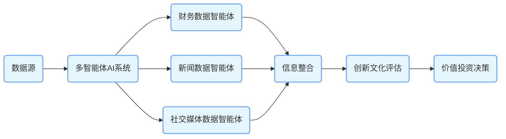

# 智能化公司创新文化评估：多智能体AI在价值投资中的角色

> 关键词：智能化公司、创新文化评估、多智能体AI、价值投资、人工智能、金融科技、企业评估

> 摘要：本文聚焦于智能化公司创新文化评估以及多智能体AI在价值投资中的角色。首先介绍相关背景，明确目的、预期读者等内容。接着阐述核心概念，包括创新文化、多智能体AI、价值投资等，并给出其联系和架构示意图。详细讲解多智能体AI的核心算法原理，结合Python代码进行说明。深入探讨相关数学模型和公式，并举例解释。通过项目实战，展示如何搭建开发环境、实现源代码并进行解读。分析多智能体AI在价值投资中的实际应用场景。推荐相关学习资源、开发工具框架以及论文著作。最后总结未来发展趋势与挑战，提供常见问题解答和扩展阅读参考资料，旨在为智能化公司创新文化评估及多智能体AI在价值投资中的应用提供全面且深入的指导。

## 1. 背景介绍 
### 1.1 目的和范围
在当今数字化和智能化快速发展的时代，智能化公司如雨后春笋般涌现。创新文化作为企业的核心竞争力之一，对于智能化公司的可持续发展至关重要。同时，价值投资作为一种重要的投资策略，投资者需要准确评估公司的价值和潜力。本研究的目的在于探索如何利用多智能体AI对智能化公司的创新文化进行有效评估，并明确多智能体AI在价值投资中所扮演的角色。

研究范围涵盖智能化公司创新文化的各个维度，包括创新理念、创新实践、创新人才培养等。同时，研究多智能体AI在价值投资的各个环节，如公司筛选、估值分析、投资决策等方面的应用。

### 1.2 预期读者
本文预期读者包括金融投资者，他们希望借助多智能体AI提高价值投资的准确性和收益；企业管理者，尤其是智能化公司的管理者，期望通过评估创新文化提升企业竞争力；人工智能领域的研究人员和开发者，对多智能体AI在金融领域的应用感兴趣；以及相关专业的学生，作为学习参考资料了解行业前沿动态。

### 1.3 文档结构概述
本文首先介绍相关背景知识，为后续内容奠定基础。接着阐述核心概念，明确各概念的原理和相互联系。详细讲解多智能体AI的核心算法原理和具体操作步骤，结合Python代码进行说明。深入探讨相关数学模型和公式，并举例解释。通过项目实战展示多智能体AI在智能化公司创新文化评估和价值投资中的具体应用。分析多智能体AI在实际应用场景中的作用。推荐相关学习资源、开发工具框架以及论文著作。最后总结未来发展趋势与挑战，提供常见问题解答和扩展阅读参考资料。

### 1.4 术语表
#### 1.4.1 核心术语定义
- **智能化公司**：指广泛应用人工智能、大数据、物联网等先进技术，实现业务流程自动化、智能化，具有创新驱动发展特征的企业。
- **创新文化**：企业在长期发展过程中形成的，鼓励创新、支持创新、包容失败的文化氛围和价值观念，包括创新理念、创新制度、创新实践等方面。
- **多智能体AI**：由多个智能体组成的人工智能系统，每个智能体具有一定的自主决策能力和交互能力，通过协作完成复杂任务。
- **价值投资**：一种投资策略，投资者通过分析公司的基本面，如财务状况、行业地位、竞争优势等，寻找被低估的股票进行投资，以获取长期稳定的收益。

#### 1.4.2 相关概念解释
- **智能体**：在人工智能领域，智能体是指能够感知环境、做出决策并采取行动的实体。智能体可以是软件程序、机器人等。
- **协作机制**：多智能体AI中智能体之间的合作方式和规则，确保智能体能够有效地协同工作，实现共同目标。
- **基本面分析**：价值投资中常用的分析方法，通过研究公司的财务报表、经营状况、行业趋势等因素，评估公司的内在价值。

#### 1.4.3 缩略词列表
- **AI**：Artificial Intelligence，人工智能
- **ML**：Machine Learning，机器学习
- **RL**：Reinforcement Learning，强化学习

## 2. 核心概念与联系 

### 核心概念原理
#### 智能化公司创新文化
智能化公司的创新文化是其在激烈市场竞争中脱颖而出的关键因素。创新文化体现在多个方面，如鼓励员工提出新想法、支持跨部门合作创新、为创新项目提供资源保障等。创新文化的形成需要企业长期的培育和引导，它能够激发员工的创新活力，提高企业的创新能力和竞争力。

#### 多智能体AI
多智能体AI由多个智能体组成，每个智能体具有一定的感知、决策和行动能力。智能体之间通过通信和协作机制，共同完成复杂任务。多智能体AI的优势在于能够充分利用各个智能体的特长，提高系统的整体性能和适应性。例如，在一个智能交通系统中，不同的智能体可以分别负责交通流量监测、信号灯控制、车辆调度等任务，通过协作实现交通的高效运行。

#### 价值投资
价值投资的核心思想是寻找被市场低估的股票，通过长期持有获取股票价值回归带来的收益。价值投资者通常会关注公司的基本面，如盈利能力、资产质量、现金流状况等。他们认为，只要公司的内在价值高于其市场价格，就具有投资价值。

### 架构的文本示意图
智能化公司创新文化评估与多智能体AI在价值投资中的应用架构可以描述如下：

首先，多智能体AI系统通过各种数据源收集智能化公司的相关信息，包括公司的财务报表、新闻报道、社交媒体数据等。这些信息被传递给不同的智能体，每个智能体负责处理和分析特定类型的信息。例如，一个智能体负责分析财务数据，评估公司的财务状况；另一个智能体负责分析新闻和社交媒体数据，了解公司的市场声誉和创新动态。

然后，各个智能体将分析结果进行整合，通过协作机制对智能化公司的创新文化进行评估。评估结果将作为价值投资的重要参考依据。投资者可以根据评估结果筛选出具有创新潜力和投资价值的公司，进行进一步的深入分析和投资决策。

### Mermaid流程图


## 3. 核心算法原理 & 具体操作步骤 

### 多智能体AI核心算法原理
多智能体AI中常用的算法包括强化学习、博弈论等。这里以强化学习为例，介绍多智能体AI的核心算法原理。

强化学习是一种通过智能体与环境进行交互，不断尝试和学习，以最大化累积奖励的机器学习方法。在多智能体环境中，每个智能体都有自己的目标和奖励函数，它们需要在与其他智能体的交互中学习如何做出最优决策。

#### Q - learning算法
Q - learning是一种经典的强化学习算法，用于求解最优策略。在多智能体环境中，每个智能体都有自己的Q表，用于记录在不同状态下采取不同行动的价值。

Q表的更新公式为：
$$Q(s, a) \leftarrow Q(s, a) + \alpha [r + \gamma \max_{a'} Q(s', a') - Q(s, a)]$$

其中，$Q(s, a)$ 表示在状态 $s$ 下采取行动 $a$ 的Q值，$\alpha$ 是学习率，$r$ 是即时奖励，$\gamma$ 是折扣因子，$s'$ 是下一个状态。

### 具体操作步骤
#### 步骤1：初始化
初始化每个智能体的Q表，将所有Q值初始化为0。同时，设置学习率 $\alpha$、折扣因子 $\gamma$ 等参数。

#### 步骤2：环境交互
每个智能体根据当前状态，从Q表中选择一个行动，并执行该行动。环境根据智能体的行动给出即时奖励和下一个状态。

#### 步骤3：Q表更新
根据Q - learning算法的更新公式，更新每个智能体的Q表。

#### 步骤4：重复步骤2和3
不断重复步骤2和3，直到智能体收敛到最优策略。

### Python源代码详细阐述
```python
import numpy as np

# 定义环境参数
num_states = 10
num_actions = 4
alpha = 0.1
gamma = 0.9
epsilon = 0.1
num_episodes = 1000

# 初始化Q表
Q = np.zeros((num_states, num_actions))

# 定义环境交互函数
def get_reward(state, action):
    # 简单示例，根据状态和行动返回奖励
    if state == 5 and action == 2:
        return 10
    else:
        return -1

# 定义epsilon - greedy策略
def epsilon_greedy(Q, state, epsilon):
    if np.random.uniform(0, 1) < epsilon:
        action = np.random.choice(num_actions)
    else:
        action = np.argmax(Q[state, :])
    return action

# 训练过程
for episode in range(num_episodes):
    state = np.random.randint(0, num_states)
    done = False
    while not done:
        action = epsilon_greedy(Q, state, epsilon)
        reward = get_reward(state, action)
        next_state = np.random.randint(0, num_states)  # 简单示例，随机生成下一个状态
        Q[state, action] = Q[state, action] + alpha * (reward + gamma * np.max(Q[next_state, :]) - Q[state, action])
        state = next_state
        if reward == 10:
            done = True

# 输出最终的Q表
print("Final Q table:")
print(Q)
```

在上述代码中，我们首先定义了环境参数，包括状态数、行动数、学习率、折扣因子等。然后初始化Q表为全0。定义了环境交互函数 `get_reward` 用于返回即时奖励，以及 `epsilon_greedy` 函数用于实现epsilon - greedy策略。在训练过程中，智能体不断与环境交互，根据Q - learning算法更新Q表，直到达到终止条件。最后输出最终的Q表。

## 4. 数学模型和公式 & 详细讲解 & 举例说明 

### 数学模型
在多智能体AI在智能化公司创新文化评估和价值投资中的应用中，我们可以使用多种数学模型，如线性回归模型、逻辑回归模型、神经网络模型等。这里以线性回归模型为例进行说明。

线性回归模型用于描述自变量和因变量之间的线性关系。在智能化公司创新文化评估中，我们可以将公司的创新文化指标作为自变量，公司的市场价值作为因变量，建立线性回归模型来评估创新文化对公司价值的影响。

### 数学公式
线性回归模型的一般形式为：
$$y = \beta_0 + \beta_1 x_1 + \beta_2 x_2 + \cdots + \beta_n x_n + \epsilon$$

其中，$y$ 是因变量，$x_1, x_2, \cdots, x_n$ 是自变量，$\beta_0, \beta_1, \cdots, \beta_n$ 是回归系数，$\epsilon$ 是误差项。

回归系数的估计通常使用最小二乘法，即最小化误差平方和：
$$\min_{\beta_0, \beta_1, \cdots, \beta_n} \sum_{i = 1}^{m} (y_i - (\beta_0 + \beta_1 x_{i1} + \beta_2 x_{i2} + \cdots + \beta_n x_{in}))^2$$

其中，$m$ 是样本数量，$y_i$ 是第 $i$ 个样本的因变量值，$x_{i1}, x_{i2}, \cdots, x_{in}$ 是第 $i$ 个样本的自变量值。

### 详细讲解
最小二乘法的原理是找到一组回归系数，使得预测值与实际值之间的误差平方和最小。通过对误差平方和求偏导数并令其等于0，可以得到回归系数的估计值。

具体来说，对于简单线性回归模型 $y = \beta_0 + \beta_1 x + \epsilon$，回归系数的估计公式为：
$$\hat{\beta}_1 = \frac{\sum_{i = 1}^{m} (x_i - \bar{x})(y_i - \bar{y})}{\sum_{i = 1}^{m} (x_i - \bar{x})^2}$$
$$\hat{\beta}_0 = \bar{y} - \hat{\beta}_1 \bar{x}$$

其中，$\bar{x}$ 和 $\bar{y}$ 分别是自变量和因变量的样本均值。

### 举例说明
假设我们要研究智能化公司的研发投入（自变量 $x$）与公司市值（因变量 $y$）之间的关系。我们收集了以下数据：

| 研发投入（万元） | 公司市值（亿元） |
| --- | --- |
| 100 | 5 |
| 200 | 8 |
| 300 | 12 |
| 400 | 15 |
| 500 | 20 |

首先，计算样本均值：
$$\bar{x} = \frac{100 + 200 + 300 + 400 + 500}{5} = 300$$
$$\bar{y} = \frac{5 + 8 + 12 + 15 + 20}{5} = 12$$

然后，计算分子和分母：
$$\sum_{i = 1}^{5} (x_i - \bar{x})(y_i - \bar{y}) = (100 - 300)(5 - 12) + (200 - 300)(8 - 12) + (300 - 300)(12 - 12) + (400 - 300)(15 - 12) + (500 - 300)(20 - 12) = 2800$$
$$\sum_{i = 1}^{5} (x_i - \bar{x})^2 = (100 - 300)^2 + (200 - 300)^2 + (300 - 300)^2 + (400 - 300)^2 + (500 - 300)^2 = 200000$$

最后，计算回归系数：
$$\hat{\beta}_1 = \frac{2800}{200000} = 0.014$$
$$\hat{\beta}_0 = 12 - 0.014 \times 300 = 7.8$$

得到线性回归方程为：$y = 7.8 + 0.014 x$。这意味着研发投入每增加1万元，公司市值预计增加0.014亿元。

## 5. 项目实战：代码实际案例和详细解释说明 

### 5.1 开发环境搭建
#### 安装Python
首先，需要安装Python开发环境。可以从Python官方网站（https://www.python.org/downloads/） 下载适合自己操作系统的Python版本，并按照安装向导进行安装。

#### 安装必要的库
在本项目中，我们需要使用一些Python库，如 `numpy`、`pandas`、`scikit - learn` 等。可以使用以下命令进行安装：
```sh
pip install numpy pandas scikit-learn
```

### 5.2 源代码详细实现和代码解读
#### 数据准备
假设我们已经收集了智能化公司的相关数据，包括创新文化指标、财务指标等。我们将使用 `pandas` 库来读取和处理数据。

```python
import pandas as pd

# 读取数据
data = pd.read_csv('company_data.csv')

# 分离自变量和因变量
X = data.drop('market_value', axis = 1)
y = data['market_value']
```

在上述代码中，我们使用 `pandas` 的 `read_csv` 函数读取CSV文件中的数据。然后，使用 `drop` 方法分离出自变量 `X` 和因变量 `y`。

#### 数据预处理
在进行模型训练之前，需要对数据进行预处理，如数据标准化、缺失值处理等。

```python
from sklearn.preprocessing import StandardScaler
from sklearn.impute import SimpleImputer

# 处理缺失值
imputer = SimpleImputer(strategy='mean')
X = imputer.fit_transform(X)

# 数据标准化
scaler = StandardScaler()
X = scaler.fit_transform(X)
```

在上述代码中，我们使用 `SimpleImputer` 来处理缺失值，将缺失值用均值填充。然后，使用 `StandardScaler` 对数据进行标准化处理，使得数据的均值为0，标准差为1。

#### 模型训练
我们使用线性回归模型进行训练。

```python
from sklearn.linear_model import LinearRegression
from sklearn.model_selection import train_test_split

# 划分训练集和测试集
X_train, X_test, y_train, y_test = train_test_split(X, y, test_size = 0.2, random_state = 42)

# 训练模型
model =