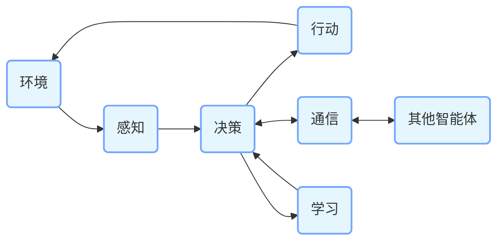

# 智能化公司扩张战略评估：多智能体AI的新视角

> 关键词：智能化公司、扩张战略评估、多智能体AI、决策支持、战略规划

> 摘要：本文聚焦于智能化公司的扩张战略评估，引入多智能体AI的全新视角。随着科技的飞速发展，智能化公司面临着日益复杂的市场环境和竞争压力，传统的战略评估方法已难以满足需求。多智能体AI凭借其分布式、自主性和协作性等特点，为智能化公司的扩张战略评估提供了更全面、准确和高效的解决方案。文章深入探讨了多智能体AI的核心概念、算法原理、数学模型，并通过项目实战展示其在实际应用中的价值，分析了其实际应用场景，推荐了相关的工具和资源，最后对未来发展趋势与挑战进行了总结，旨在为智能化公司的战略决策提供有力的理论支持和实践指导。

## 1. 背景介绍 
### 1.1 目的和范围
在当今数字化时代，智能化公司如雨后春笋般涌现，市场竞争愈发激烈。公司的扩张战略对于其生存和发展至关重要，合理的扩张战略能够帮助公司开拓新市场、提升竞争力，实现可持续发展。然而，传统的战略评估方法往往基于静态数据和单一视角，难以应对复杂多变的市场环境和多元化的决策需求。

本文章的目的在于引入多智能体AI的新视角，为智能化公司的扩张战略评估提供一种创新的方法和思路。通过多智能体AI的分布式计算、自主决策和协作机制，能够更全面地考虑市场因素、竞争态势、公司内部资源等多方面信息，从而为公司的扩张战略提供更准确、科学的评估和决策支持。

本文的范围涵盖了多智能体AI的基本概念、核心算法、数学模型，以及其在智能化公司扩张战略评估中的实际应用。通过理论分析和项目实战相结合的方式，深入探讨多智能体AI在战略评估中的优势和价值。

### 1.2 预期读者
本文预期读者包括智能化公司的管理层、战略规划人员、市场分析人员、技术研发人员，以及对人工智能和战略管理领域感兴趣的学者和研究人员。对于公司管理层和战略规划人员，本文将提供一种新的战略评估方法和决策工具，帮助他们制定更科学合理的扩张战略；对于技术研发人员，本文将介绍多智能体AI的核心算法和实现细节，为他们的技术创新提供参考；对于学者和研究人员，本文将为相关领域的学术研究提供新的思路和方向。

### 1.3 文档结构概述
本文共分为十个部分，具体结构如下：
1. 背景介绍：阐述文章的目的、范围、预期读者和文档结构概述，以及相关术语的定义和解释。
2. 核心概念与联系：介绍多智能体AI的核心概念、原理和架构，通过文本示意图和Mermaid流程图进行直观展示。
3. 核心算法原理 & 具体操作步骤：详细讲解多智能体AI的核心算法原理，并使用Python源代码进行具体操作步骤的阐述。
4. 数学模型和公式 & 详细讲解 & 举例说明：介绍多智能体AI的数学模型和公式，进行详细讲解并举例说明。
5. 项目实战：代码实际案例和详细解释说明：通过一个实际项目案例，展示多智能体AI在智能化公司扩张战略评估中的具体应用，包括开发环境搭建、源代码实现和代码解读。
6. 实际应用场景：分析多智能体AI在智能化公司扩张战略评估中的实际应用场景，如市场分析、竞争态势评估、资源分配等。
7. 工具和资源推荐：推荐与多智能体AI和战略评估相关的学习资源、开发工具框架和论文著作。
8. 总结：未来发展趋势与挑战：总结多智能体AI在智能化公司扩张战略评估中的应用现状，分析未来发展趋势和面临的挑战。
9. 附录：常见问题与解答：解答读者在阅读过程中可能遇到的常见问题。
10. 扩展阅读 & 参考资料：提供相关的扩展阅读材料和参考资料，方便读者进一步深入学习和研究。

### 1.4 术语表
#### 1.4.1 核心术语定义
- **智能化公司**：指利用现代信息技术和人工智能技术，实现业务流程自动化、决策智能化的公司。
- **扩张战略**：指公司为了实现增长和发展，通过开拓新市场、扩大生产规模、并购等方式，扩大公司业务范围和市场份额的战略。
- **多智能体AI**：指由多个智能体组成的人工智能系统，每个智能体具有自主决策能力，能够通过协作实现共同目标。
- **智能体**：指具有感知、决策和行动能力的个体，能够根据环境信息自主做出决策并执行相应的行动。
- **战略评估**：指对公司的战略规划进行分析、评价和选择的过程，以确保战略的可行性、有效性和适应性。

#### 1.4.2 相关概念解释
- **分布式计算**：指将计算任务分配到多个计算节点上进行并行处理的计算方式，能够提高计算效率和处理能力。
- **自主决策**：指智能体根据自身的目标和环境信息，独立做出决策的能力。
- **协作机制**：指多个智能体之间通过通信和协调，实现共同目标的机制。
- **市场环境**：指影响公司业务活动的各种外部因素的总和，包括市场需求、竞争态势、政策法规等。

#### 1.4.3 缩略词列表
- **AI**：Artificial Intelligence，人工智能
- **MAS**：Multi-Agent System，多智能体系统

## 2. 核心概念与联系 
### 2.1 多智能体AI的核心概念
多智能体AI是一种由多个智能体组成的人工智能系统。每个智能体具有独立的感知、决策和行动能力，能够根据自身的目标和环境信息自主做出决策并执行相应的行动。多个智能体之间通过通信和协作机制，实现共同的目标。

智能体是多智能体AI的基本组成单元，它可以是软件程序、机器人或其他具有自主决策能力的实体。智能体具有以下特点：
- **自主性**：智能体能够独立地感知环境信息，根据自身的目标和规则自主做出决策，无需外部干预。
- **反应性**：智能体能够对环境中的变化做出及时的反应，调整自己的行为以适应环境的变化。
- **社会性**：智能体能够与其他智能体进行通信和协作，共同完成任务。
- **学习性**：智能体能够通过学习不断提高自己的决策能力和行为表现。

### 2.2 多智能体AI的原理
多智能体AI的原理基于分布式计算和自主决策的思想。多个智能体分布在不同的计算节点上，通过网络进行通信和协作。每个智能体根据自身的目标和环境信息，独立做出决策并执行相应的行动。在协作过程中，智能体之间通过信息共享和协调，实现共同的目标。

多智能体AI的工作流程主要包括以下几个步骤：
1. **感知**：智能体通过传感器或其他方式获取环境信息。
2. **决策**：智能体根据自身的目标和环境信息，运用决策算法做出决策。
3. **行动**：智能体根据决策结果执行相应的行动。
4. **通信**：智能体与其他智能体进行通信，共享信息和协调行动。
5. **学习**：智能体通过学习不断提高自己的决策能力和行为表现。

### 2.3 多智能体AI的架构
多智能体AI的架构主要包括以下几个部分：
- **智能体层**：由多个智能体组成，每个智能体具有独立的感知、决策和行动能力。
- **通信层**：负责智能体之间的通信和信息共享，实现智能体之间的协作。
- **协调层**：负责协调智能体之间的行动，确保智能体之间的协作能够实现共同的目标。
- **学习层**：负责智能体的学习和进化，提高智能体的决策能力和行为表现。

### 2.4 文本示意图
多智能体AI的架构可以用以下文本示意图表示：

```plaintext
----------------------
|       应用层       |
----------------------
|       协调层       |
----------------------
|       通信层       |
----------------------
|       智能体层     |
----------------------
|       学习层       |
----------------------
```

### 2.5 Mermaid流程图


该流程图展示了多智能体AI中一个智能体的工作流程。智能体首先从环境中感知信息，然后根据感知到的信息进行决策，根据决策结果执行行动，行动又会对环境产生影响。同时，智能体通过通信与其他智能体进行信息共享和协调，并且通过学习不断改进自己的决策能力。

## 3. 核心算法原理 & 具体操作步骤 
### 3.1 核心算法原理
多智能体AI中涉及到多种核心算法，这里主要介绍基于强化学习的多智能体决策算法。强化学习是一种通过智能体与环境进行交互，不断尝试和学习，以最大化累积奖励的机器学习方法。

在多智能体环境中，每个智能体的决策不仅受到自身的奖励影响，还受到其他智能体的行为影响。因此，多智能体强化学习需要考虑智能体之间的协作和竞争关系。

一种常见的多智能体强化学习算法是深度Q网络（Deep Q-Network，DQN）的扩展——多智能体深度Q网络（Multi-Agent Deep Q-Network，MADQN）。MADQN通过神经网络来近似智能体的动作价值函数，每个智能体根据自己的局部观察和全局状态信息来选择动作，以最大化自己的累积奖励。

### 3.2 具体操作步骤
下面使用Python代码详细阐述MADQN算法的具体操作步骤：

```python
import numpy as np
import torch
import torch.nn as nn
import torch.optim as optim

# 定义神经网络模型
class QNetwork(nn.Module):
    def __init__(self, input_dim, output_dim):
        super(QNetwork, self).__init__()
        self.fc1 = nn.Linear(input_dim, 64)
        self.fc2 = nn.Linear(64, 64)
        self.fc3 = nn.Linear(64, output_dim)

    def forward(self, x):
        x = torch.relu(self.fc1(x))
        x = torch.relu(self.fc2(x))
        return self.fc3(x)

# 定义多智能体强化学习类
class MADQN:
    def __init__(self, num_agents, input_dim, output_dim, learning_rate, gamma):
        self.num_agents = num_agents
        self.input_dim = input_dim
        self.output_dim = output_dim
        self.learning_rate = learning_rate
        self.gamma = gamma

        # 为每个智能体创建一个Q网络
        self.q_networks = [QNetwork(input_dim, output_dim) for _ in range(num_agents)]
        self.optimizers = [optim.Adam(q_network.parameters(), lr=learning_rate) for q_network in self.q_networks]

    def select_action(self, observations, epsilon):
        actions = []
        for i in range(self.num_agents):
            if np.random.uniform(0, 1) < epsilon:
                # 随机选择动作
                action = np.random.randint(0, self.output_dim)
            else:
                # 根据Q网络选择动作
                observation = torch.FloatTensor(observations[i]).unsqueeze(0)
                q_values = self.q_networks[i](observation)
                action = torch.argmax(q_values).item()
            actions.append(action)
        return actions

    def update(self, observations, actions, rewards, next_observations, dones):
        for i in range(self.num_agents):
            observation = torch.FloatTensor(observations[i]).unsqueeze(0)
            action = torch.LongTensor([actions[i]]).unsqueeze(0)
            reward = torch.FloatTensor([rewards[i]]).unsqueeze(0)
            next_observation = torch.FloatTensor(next_observations[i]).unsqueeze(0)
            done = torch.FloatTensor([dones[i]]).unsqueeze(0)

            # 计算目标Q值
            next_q_values = self.q_networks[i](next_observation)
            max_next_q_value = torch.max(next_q_values).unsqueeze(0)
            target_q_value = reward + (1 - done) * self.gamma * max_next_q_value

            # 计算当前Q值
            q_values = self.q_networks[i](observation)
            current_q_value = q_values.gather(1, action)

            # 计算损失
            loss = nn.MSELoss()(current_q_value, target_q_value.detach())

            # 更新Q网络
            self.optimizers[i].zero_grad()
            loss.backward()
            self.optimizers[i].step()

# 示例使用
if __name__ == "__main__":
    num_agents = 2
    input_dim = 10
    output_dim = 5
    learning_rate = 0.001
    gamma = 0.99
    epsilon = 0.1

    madqn = MADQN(num_agents, input_dim, output_dim, learning_rate, gamma)

    # 模拟一次环境交互
    observations = [np.random.randn(input_dim) for _ in range(num_agents)]
    actions = madqn.select_action(observations, epsilon)
    rewards = [np.random.randn() for _ in range(num_agents)]
    next_observations = [np.random.randn(input_dim) for _ in range(num_agents)]
    dones = [False for _ in range(num_agents)]

    madqn.update(observations, actions, rewards, next_observations, dones)
```

### 3.3 代码解释
1. **QNetwork类**：定义了一个简单的三层全连接神经网络，用于近似智能体的动作价值函数。
2. **MADQN类**：实现了多智能体深度Q网络算法。
    - `__init__`方法：初始化多智能体的Q网络和优化器。
    - `select_action`方法：根据当前观察和epsilon-greedy策略选择动作。
    - `update`方法：根据环境交互的结果更新Q网络的参数。
3. **示例使用部分**：模拟了一次环境交互，并调用`update`方法更新Q网络。

## 4. 数学模型和公式 & 详细讲解 & 举例说明 
### 4.1 多智能体强化学习的数学模型
多智能体强化学习可以用马尔可夫决策过程（Markov Decision Process，MDP）的扩展——多智能体马尔可夫决策过程（Multi-Agent Markov Decision Process，MMDP）来描述。

一个MMDP可以用一个元组 $\langle S, A_1, A_2, \cdots, A_n, P, R_1, R_2, \cdots, R_n, \gamma \rangle$ 表示，其中：
- $S$ 是环境的状态空间。
- $A_i$ 是智能体 $i$ 的动作空间，$i = 1, 2, \cdots, n$。
- $P: S \times A_1 \times A_2 \times \cdots \times A_n \times S \to [0, 1]$ 是状态转移概率函数，表示在当前状态 $s \in S$ 下，所有智能体采取动作 $a_1 \in A_1, a_2 \in A_2, \cdots, a_n \in A_n$ 后，转移到下一个状态 $s' \in S$ 的概率。
- $R_i: S \times A_1 \times A_2 \times \cdots \times A_n \to \mathbb{R}$ 是智能体 $i$ 的奖励函数，表示在当前状态 $s \in S$ 下，所有智能体采取动作 $a_1 \in A_1, a_2 \in A_2, \cdots, a_n \in A_n$ 后，智能体 $i$ 获得的奖励。
- $\gamma \in [0, 1]$ 是折扣因子，用于衡量未来奖励的重要性。

### 4.2 动作价值函数和贝尔曼方程
在多智能体强化学习中，每个智能体的目标是最大化自己的累积奖励。智能体 $i$ 的动作价值函数 $Q_i(s, a_1, a_2, \cdots, a_n)$ 表示在状态 $s$ 下，所有智能体采取动作 $a_1, a_2, \cdots, a_n$ 后，智能体 $i$ 的期望累积奖励。

动作价值函数满足贝尔曼方程：
$$
Q_i(s, a_1, a_2, \cdots, a_n) = R_i(s, a_1, a_2, \cdots, a_n) + \gamma \sum_{s' \in S} P(s' | s, a_1, a_2, \cdots, a_n) \max_{a_1', a_2', \cdots, a_n'} Q_i(s', a_1', a_2', \cdots, a_n')
$$

### 4.3 多智能体深度Q网络的目标函数
在多智能体深度Q网络中，我们使用神经网络来近似动作价值函数。目标是最小化预测的Q值与目标Q值之间的均方误差。

对于智能