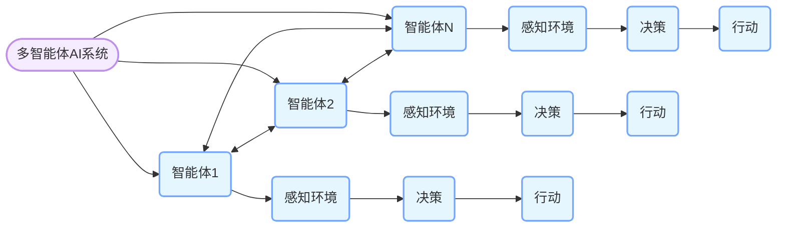

# 智能化护城河持久性评估：多智能体AI的新视角

> 关键词：智能化护城河、持久性评估、多智能体AI、竞争优势、技术趋势

> 摘要：本文聚焦于智能化护城河持久性评估，从多智能体AI的新视角展开深入探讨。首先介绍了智能化护城河的背景，明确研究目的和范围，为读者界定预期阅读群体和文档结构。详细阐述了核心概念及其联系，包括智能化护城河和多智能体AI的原理与架构，并通过Mermaid流程图直观呈现。深入剖析核心算法原理，运用Python代码详细说明具体操作步骤，同时给出相关数学模型和公式并举例解释。通过项目实战案例，展示代码实现过程并进行详细解读分析。探讨了智能化护城河持久性评估在实际中的应用场景，推荐了学习资源、开发工具框架以及相关论文著作。最后总结了未来发展趋势与挑战，解答常见问题，并提供扩展阅读和参考资料，旨在为相关领域的研究和实践提供全面且深入的指导。

## 1. 背景介绍 
### 1.1 目的和范围
在当今数字化时代，企业的竞争优势很大程度上依赖于其智能化水平。智能化护城河是指企业通过独特的智能化技术、数据资产和业务模式所构建的一种难以被竞争对手模仿和超越的优势地位。然而，随着技术的快速发展和市场环境的不断变化，这种护城河的持久性面临着诸多挑战。本研究的目的在于从多智能体AI的新视角出发，建立一套科学有效的智能化护城河持久性评估方法，帮助企业更好地了解自身的竞争优势，并制定相应的战略决策。研究范围涵盖了不同行业的智能化企业，重点关注多智能体AI技术在智能化护城河评估中的应用。

### 1.2 预期读者
本文预期读者包括企业战略规划者、技术研发人员、投资分析师以及对智能化竞争和多智能体AI技术感兴趣的学者和研究人员。对于企业战略规划者来说，本文提供的评估方法有助于他们识别企业智能化护城河的持久性，从而制定更具前瞻性的战略；技术研发人员可以从多智能体AI的角度获取新的技术思路和应用场景；投资分析师可以利用评估结果进行更准确的投资决策；学者和研究人员则可以在本文的基础上开展进一步的学术研究。

### 1.3 文档结构概述
本文将按照以下结构进行阐述：首先介绍智能化护城河和多智能体AI的核心概念及其联系，通过文本示意图和Mermaid流程图进行直观展示；接着详细讲解核心算法原理和具体操作步骤，并给出Python源代码；然后介绍相关的数学模型和公式，并通过具体例子进行说明；之后通过项目实战案例，展示代码的实际实现过程并进行详细解读；探讨智能化护城河持久性评估的实际应用场景；推荐相关的学习资源、开发工具框架和论文著作；最后总结未来发展趋势与挑战，解答常见问题，并提供扩展阅读和参考资料。

### 1.4 术语表
#### 1.4.1 核心术语定义
- **智能化护城河**：企业通过智能化技术、数据资产和业务模式所形成的一种可持续的竞争优势，使得竞争对手难以在短期内模仿和超越。
- **多智能体AI**：由多个智能体组成的系统，每个智能体具有一定的自主决策能力，它们之间可以相互协作、竞争和交互，以实现共同的目标。
- **持久性评估**：对智能化护城河在未来一段时间内保持有效性和竞争力的评估过程。

#### 1.4.2 相关概念解释
- **智能体**：具有感知、决策和行动能力的实体，可以是软件程序、机器人或其他具有自主行为的设备。
- **竞争优势**：企业在市场竞争中相对于竞争对手所具有的优势，包括成本优势、差异化优势等。
- **数据资产**：企业所拥有的各种数据资源，包括客户数据、业务数据等，这些数据可以为企业的智能化决策提供支持。

#### 1.4.3 缩略词列表
- **AI**：Artificial Intelligence，人工智能
- **MAS**：Multi-Agent System，多智能体系统

## 2. 核心概念与联系 
### 智能化护城河的原理与架构
智能化护城河的形成主要依赖于三个方面：智能化技术、数据资产和业务模式。智能化技术包括机器学习、深度学习、自然语言处理等，这些技术可以帮助企业实现自动化决策、智能预测和个性化服务。数据资产是智能化护城河的重要基础，企业通过收集、整理和分析大量的数据，可以发现潜在的商业机会和客户需求。业务模式则是将智能化技术和数据资产转化为实际商业价值的途径，例如通过智能化的供应链管理、客户关系管理等提高企业的运营效率和客户满意度。

下面是智能化护城河的原理与架构的文本示意图：
```plaintext
智能化护城河
|-- 智能化技术
|   |-- 机器学习
|   |-- 深度学习
|   |-- 自然语言处理
|-- 数据资产
|   |-- 客户数据
|   |-- 业务数据
|   |-- 市场数据
|-- 业务模式
|   |-- 智能化供应链管理
|   |-- 智能化客户关系管理
|   |-- 个性化服务
```

### 多智能体AI的原理与架构
多智能体AI系统由多个智能体组成，每个智能体具有一定的感知、决策和行动能力。智能体之间通过通信机制进行信息交互和协作，以实现共同的目标。多智能体AI的架构可以分为集中式架构和分布式架构。在集中式架构中，有一个中央控制器负责协调所有智能体的行为；而在分布式架构中，智能体之间通过自主协商和合作来完成任务。

下面是多智能体AI的原理与架构的Mermaid流程图：


### 智能化护城河与多智能体AI的联系
多智能体AI可以为智能化护城河的持久性评估提供新的视角和方法。一方面，多智能体AI可以模拟不同企业之间的竞争行为，通过智能体之间的交互和竞争，评估智能化护城河在不同市场环境下的稳定性。另一方面，多智能体AI可以对智能化技术、数据资产和业务模式进行综合分析，识别出影响智能化护城河持久性的关键因素，并提供相应的优化建议。

## 3. 核心算法原理 & 具体操作步骤 
### 核心算法原理
在智能化护城河持久性评估中，我们可以采用多智能体强化学习算法。强化学习是一种通过智能体与环境进行交互，不断学习最优策略的机器学习方法。在多智能体强化学习中，多个智能体在同一环境中进行学习和交互，以实现共同的目标。

具体来说，我们可以将每个企业看作一个智能体，智能体的状态包括企业的智能化技术水平、数据资产规模、业务模式竞争力等。智能体的动作包括技术创新、数据收集和业务模式调整等。智能体的奖励函数可以根据企业的市场份额、利润等指标来定义。通过不断地与环境进行交互，智能体可以学习到最优的竞争策略，从而评估智能化护城河的持久性。

### 具体操作步骤
以下是使用Python实现多智能体强化学习算法进行智能化护城河持久性评估的具体步骤和代码示例：

```python
import numpy as np
import random

# 定义智能体类
class Agent:
    def __init__(self, state_size, action_size):
        self.state_size = state_size
        self.action_size = action_size
        # 初始化Q表
        self.q_table = np.zeros((state_size, action_size))

    def act(self, state):
        # 以一定的概率进行随机探索
        if np.random.rand() <= 0.1:
            return random.randrange(self.action_size)
        # 选择Q值最大的动作
        act_values = self.q_table[state]
        return np.argmax(act_values)

    def learn(self, state, action, reward, next_state):
        # 更新Q表
        gamma = 0.9  # 折扣因子
        alpha = 0.1  # 学习率
        target = reward + gamma * np.max(self.q_table[next_state])
        self.q_table[state, action] = (1 - alpha) * self.q_table[state, action] + alpha * target

# 定义环境类
class Environment:
    def __init__(self, num_agents, state_size, action_size):
        self.num_agents = num_agents
        self.state_size = state_size
        self.action_size = action_size
        self.agents = [Agent(state_size, action_size) for _ in range(num_agents)]

    def step(self, actions):
        rewards = []
        next_states = []
        for i in range(self.num_agents):
            state = random.randint(0, self.state_size - 1)
            action = actions[i]
            # 简单模拟奖励计算
            reward = random.randint(-1, 1)
            next_state = random.randint(0, self.state_size - 1)
            self.agents[i].learn(state, action, reward, next_state)
            rewards.append(reward)
            next_states.append(next_state)
        return rewards, next_states

# 主训练循环
if __name__ == "__main__":
    num_agents = 3
    state_size = 5
    action_size = 3
    env = Environment(num_agents, state_size, action_size)
    num_episodes = 100
    for episode in range(num_episodes):
        states = [random.randint(0, state_size - 1) for _ in range(num_agents)]
        for _ in range(10):
            actions = [agent.act(state) for agent, state in zip(env.agents, states)]
            rewards, next_states = env.step(actions)
            states = next_states
        print(f"Episode {episode} finished.")
```

### 代码解释
1. **Agent类**：定义了智能体的基本属性和方法。`__init__`方法初始化智能体的状态大小、动作大小和Q表。`act`方法根据当前状态选择动作，以一定的概率进行随机探索。`learn`方法根据当前状态、动作、奖励和下一个状态更新Q表。
2. **Environment类**：定义了环境的基本属性和方法。`__init__`方法初始化环境的智能体数量、状态大小、动作大小和智能体列表。`step`方法根据智能体的动作计算奖励和下一个状态，并调用智能体的`learn`方法进行学习。
3. **主训练循环**：在主训练循环中，我们创建了一个环境对象，并进行了多个回合的训练。每个回合中，智能体根据当前状态选择动作，环境根据动作计算奖励和下一个状态，智能体根据奖励和下一个状态更新Q表。

## 4. 数学模型和公式 & 详细讲解 & 举例说明 
### 数学模型
在多智能体强化学习中，我们可以使用马尔可夫决策过程（MDP）来描述智能体与环境的交互过程。马尔可夫决策过程由一个四元组 $(S, A, P, R)$ 组成，其中：
- $S$ 是状态空间，表示智能体可能处于的所有状态。
- $A$ 是动作空间，表示智能体可以采取的所有动作。
- $P$ 是状态转移概率函数，表示在状态 $s$ 采取动作 $a$ 后转移到状态 $s'$ 的概率，即 $P(s'|s, a)$。
- $R$ 是奖励函数，表示在状态 $s$ 采取动作 $a$ 后转移到状态 $s'$ 所获得的奖励，即 $R(s, a, s')$。

### 数学公式
在多智能体强化学习中，我们使用Q学习算法来更新智能体的Q表。Q学习算法的更新公式如下：
$$
Q(s, a) \leftarrow (1 - \alpha)Q(s, a) + \alpha [r + \gamma \max_{a'} Q(s', a')]
$$
其中：
- $Q(s, a)$ 表示在状态 $s$ 采取动作 $a$ 的Q值。
- $\alpha$ 是学习率，控制Q值更新的速度。
- $r$ 是在状态 $s$ 采取动作 $a$ 后获得的奖励。
- $\gamma$ 是折扣因子，用于权衡当前奖励和未来奖励的重要性。
- $s'$ 是在状态 $s$ 采取动作 $a$ 后转移到的下一个状态。

### 详细讲解
Q学习算法的核心思想是通过不断地与环境进行交互，智能体可以学习到每个状态-动作对的最优Q值。在每次交互中，智能体根据当前状态选择一个动作，环境根据动作返回一个奖励和下一个状态。智能体根据奖励和下一个状态更新当前状态-动作对的Q值。通过多次迭代，Q表逐渐收敛到最优值，智能体可以根据Q表选择最优的动作。

### 举例说明
假设我们有一个简单的环境，状态空间 $S = \{s_1, s_2\}$，动作空间 $A = \{a_1, a_2\}$。初始时，Q表的值都为0。在某一时刻，智能体处于状态 $s_1$，选择了动作 $a_1$，获得了奖励 $r = 1$，并转移到了状态 $s_2$。假设学习率 $\alpha = 0.1$，折扣因子 $\gamma = 0.9$。

根据Q学习算法的更新公式，我们可以更新 $Q(s_1, a_1)$ 的值：
$$
Q(s_1, a_1) \leftarrow (1 - 0.1) \times 0 + 0.1 \times [1 + 0.9 \times \max_{a'} Q(s_2, a')]
$$
由于 $Q(s_2, a')$ 初始值都为0，所以 $\max_{a'} Q(s_2, a') = 0$，则：
$$
Q(s_1, a_1) \leftarrow 0.1 \times 1 = 0.1
$$

通过不断地与环境进行交互，Q表的值会不断更新，最终收敛到最优值。

## 5. 项目实战：代码实际案例和详细解释说明 
### 5.1  开发环境搭建
为了实现智能化护城河持久性评估的项目，我们需要搭建相应的开发环境。以下是具体的搭建步骤：

#### 安装Python
首先，我们需要安装Python。建议使用Python 3.7及以上版本。可以从Python官方网站（https://www.python.org/downloads/）下载并安装Python。

#### 安装必要的库
我们需要安装一些必要的Python库，包括NumPy、Pandas等。可以使用以下命令进行安装：
```sh
pip install numpy pandas
```

#### 安装开发工具
可以选择使用Visual Studio Code、PyCharm等开发工具来编写和调试代码。这些开发工具都提供了丰富的功能和插件，可以提高开发效率。

### 5.2  源代码详细实现和代码解读
以下是一个完整的智能化护城河持久性评估的项目实战代码示例：

```python
import numpy as np
import pandas as pd

# 定义智能体类
class Agent:
    def __init__(self, state_size, action_size):
        self.state_size = state_size
        self.action_size = action_size
        self.q_table = np.zeros((state_size, action_size))

    def act(self, state):
        if np.random.rand() <= 0.1:
            return np.random.choice(self.action_size)
        act_values = self.q_table[state]
        return np.argmax(act_values)

    def learn(self, state, action, reward, next_state):
        gamma = 0.9
        alpha = 0.1
        target = reward + gamma * np.max(self.q_table[next_state])
        self.q_table[state, action] = (1 - alpha) * self.q_table[state, action] + alpha * target

# 定义环境类
class Environment:
    def __init__(self, num_agents, state_size, action_size):
        self.num_agents = num_agents
        self.state_size = state_size
        self.action_size = action_size
        self.agents = [Agent(state_size, action_size) for _ in range(num_agents)]

    def step(self, actions):
        rewards = []
        next_states = []
        for i in range(self.num_agents):
            state = np.random.randint(0, self.state_size)
            action = actions[i]
            # 模拟奖励计算
            reward = np.random.randint(-1, 2)
            next_state = np.random.randint(0, self.state_size)
            self.agents[i].learn(state, action, reward, next_state)
            rewards.append(reward)
            next_states.append(next_state)
        return rewards, next_states

# 主训练循环
def train(num_agents, state_size, action_size, num_episodes):
    env = Environment(num_agents, state_size, action_size)
    for episode in range(num_episodes):
        states = [np.random.randint(0, state_size) for _ in range(num_agents)]
        total_rewards = [0] * num_agents
        for _ in range(100):
            actions = [agent.act(state) for agent, state in zip(env.agents, states)]
            rewards, next_states = env.step(actions)
            for i in range(num_agents):
                total_rewards[i] += rewards[i]
            states = next_states
        print(f"Episode {episode}: Total rewards = {total_rewards}")

if __name__ == "__main__":
    num_agents = 5
    state_size = 10
    action_size = 3
    num_episodes = 200
    train(num_agents, state_size, action_size, num_episodes)
```

### 代码解读
1. **Agent类**：
    - `__init__`方法：初始化智能体的状态大小、动作大小和Q表。
    - `act`方法：根据当前状态选择动作，以一定的概率进行随机探索。
    - `learn`方法：根据当前状态、动作、奖励和下一个状态更新Q表。

2. **Environment类**：
    - `__init__`方法：初始化环境的智能体数量、状态大小、动作大小和智能体列表。
    - `step`方法：根据智能体的动作计算奖励和下一个状态，并调用智能体的`learn`方法进行学习。

3. **train函数**：
    - 主训练循环，进行多个回合的训练。在每个回合中，智能体根据当前状态选择动作，环境根据动作计算奖励和下一个状态，智能体根据奖励和下一个状态更新Q表。

### 5.3  代码解读与分析
通过上述代码，我们实现了一个简单的多智能体强化学习系统，用于模拟智能化企业之间的竞争行为。在训练过程中，智能体通过不断地与环境进行交互，学习到最优的竞争策略。通过观察每个回合的总奖励，我们可以评估智能化护城河的持久性。如果某个智能体的总奖励持续增加，说明该智能体所代表的企业具有较强的智能化护城河，其竞争优势较为持久。

## 6. 实际应用场景 
### 企业战略规划
企业可以利用智能化护城河持久性评估方法，识别自身的竞争优势和劣势，制定相应的战略规划。例如，如果评估结果显示企业的智能化技术水平较高，但数据资产规模较小，企业可以加大数据收集和分析的投入，以增强智能化护城河的持久性。

### 投资决策
投资分析师可以使用智能化护城河持久性评估结果，评估企业的投资价值。具有较强智能化护城河且持久性较高的企业，通常具有较高的投资价值。通过对不同企业的评估结果进行比较，投资分析师可以做出更准确的投资决策。

### 行业竞争分析
行业研究机构可以利用智能化护城河持久性评估方法，分析行业内企业的竞争格局。通过对不同企业的智能化护城河进行评估，可以了解行业内的竞争态势，预测行业的发展趋势。

## 7. 工具和资源推荐
### 7.1 学习资源推荐
#### 7.1.1 书籍推荐
- 《人工智能：一种现代的方法》：全面介绍了人工智能的基本概念、算法和应用，是人工智能领域的经典教材。
- 《强化学习：原理与Python实现》：详细介绍了强化学习的原理和算法，并提供了Python代码示例，适合初学者学习。
- 《多智能体系统：原理与编程》：深入探讨了多智能体系统的原理和编程方法，对于理解多智能体AI非常有帮助。

#### 7.1.2 在线课程
- Coursera上的“人工智能基础”课程：由知名教授授课，系统介绍了人工智能的基础知识和应用。
- edX上的“强化学习”课程：提供了丰富的案例和实践项目，帮助学员深入掌握强化学习算法。
- Udemy上的“多智能体系统开发”课程：通过实际项目，教授学员如何开发多智能体系统。

#### 7.1.3 技术博客和网站
- Towards Data Science：提供了大量关于人工智能、机器学习和数据科学的技术文章和案例分析。
- Medium：有许多人工智能领域的专家和学者分享他们的研究成果和实践经验。
- OpenAI官方博客：发布了OpenAI的最新研究成果和技术进展。

### 7.2 开发工具框架推荐
#### 7.2.1 IDE和编辑器
- Visual Studio Code：功能强大的开源代码编辑器，支持多种编程语言和插件。
- PyCharm：专业的Python集成开发环境，提供了丰富的调试和代码分析工具。
- Jupyter Notebook：交互式的开发环境，适合进行数据分析和机器学习实验。

#### 7.2.2 调试和性能分析工具
- TensorBoard：用于可视化深度学习模型的训练过程和性能指标。
- cProfile：Python内置的性能分析工具，可以帮助开发者找出代码中的性能瓶颈。
- Py-Spy：用于实时监控Python程序的性能，提供CPU使用率、函数调用次数等信息。

#### 7.2.3 相关框架和库
- TensorFlow：开源的深度学习框架，提供了丰富的深度学习模型和工具。
- PyTorch：另一个流行的深度学习框架，具有动态图机制，适合快速开发和实验。
- OpenAI Gym：用于开发和比较强化学习算法的工具包，提供了多种环境和基准测试。

### 7.3 相关论文著作推荐
#### 7.3.1 经典论文
- “Reinforcement Learning: An Introduction”：强化学习领域的经典论文，系统介绍了强化学习的基本概念和算法。
- “Multi-Agent Systems: A Modern Approach to Distributed Artificial Intelligence”：多智能体系统领域的经典著作，全面介绍了多智能体系统的理论和应用。
- “Competitive Advantage: Creating and Sustaining Superior Performance”：战略管理领域的经典著作，提出了竞争优势的概念和分析方法。

#### 7.3.2 最新研究成果
- 关注顶级学术会议如NeurIPS、ICML、AAAI等的最新论文，了解多智能体AI和智能化竞争领域的最新研究进展。
- 查阅相关学术期刊如Journal of Artificial Intelligence Research、Artificial Intelligence等的最新文章。

#### 7.3.3 应用案例分析
- 一些商业媒体和研究机构会发布企业智能化竞争的应用案例分析报告，可以从中了解实际企业在智能化护城河建设和评估方面的经验和做法。

## 8. 总结：未来发展趋势与挑战
### 未来发展趋势
- **技术融合**：多智能体AI将与其他人工智能技术如深度学习、知识图谱等深度融合，为智能化护城河持久性评估提供更强大的技术支持。
- **行业应用拓展**：智能化护城河持久性评估方法将在更多行业得到应用，帮助企业更好地应对市场竞争。
- **个性化评估**：未来的评估方法将更加注重个性化，根据不同企业的特点和需求，提供定制化的评估方案。

### 挑战
- **数据质量和安全**：智能化护城河持久性评估依赖于大量的数据，数据的质量和安全是一个重要的挑战。企业需要加强数据管理和保护，确保数据的准确性和安全性。
- **模型可解释性**：多智能体AI模型通常比较复杂，模型的可解释性是一个难题。在实际应用中，需要提高模型的可解释性，以便企业能够理解评估结果并做出合理的决策。
- **竞争环境变化**：市场竞争环境不断变化，智能化护城河的持久性也会受到影响。如何及时调整评估方法，适应竞争环境的变化，是未来需要解决的问题。

## 9. 附录：常见问题与解答
### 问题1：多智能体AI与传统人工智能有什么区别？
多智能体AI由多个具有自主决策能力的智能体组成，智能体之间可以相互协作、竞争和交互。而传统人工智能通常是单个智能体进行决策和学习。多智能体AI更适合处理复杂的、动态的环境，能够模拟多个实体之间的交互行为。

### 问题2：智能化护城河持久性评估的准确性如何保证？
为了保证评估的准确性，需要使用高质量的数据，并选择合适的评估模型和算法。同时，需要对模型进行不断的验证和优化，根据实际情况调整评估参数。此外，还可以结合专家的经验和意见，提高评估的准确性。

### 问题3：多智能体强化学习算法的收敛速度如何提高？
可以通过调整学习率、折扣因子等参数，优化奖励函数，增加训练数据等方法来提高多智能体强化学习算法的收敛速度。此外，还可以采用一些加速算法，如异步优势演员-评论家（A3C）算法等。

## 10. 扩展阅读 & 参考资料
### 扩展阅读
- 《创新者的窘境》：探讨了企业在面对技术变革时的困境和应对策略，对于理解智能化护城河的持久性具有一定的启示作用。
- 《大数据时代》：介绍了大数据的概念、技术和应用，有助于了解数据资产在智能化护城河中所起的作用。

### 参考资料
- Russell, S. J., & Norvig, P. (2010). Artificial Intelligence: A Modern Approach. Pearson Education.
- Sutton, R. S., & Barto, A. G. (2018). Reinforcement Learning: An Introduction. MIT Press.
- Weiss, G. (Ed.). (1999). Multiagent Systems: A Modern Approach to Distributed Artificial Intelligence. MIT Press.

作者：AI天才研究院/AI Genius Institute & 禅与计算机程序设计艺术 /Zen And The Art of Computer Programming