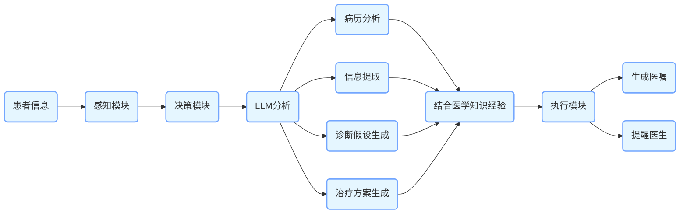

# 智能医疗诊断AI Agent：LLM在临床决策支持中的应用

> 关键词：智能医疗诊断、AI Agent、大语言模型（LLM）、临床决策支持、医疗AI应用

> 摘要：本文聚焦于智能医疗诊断AI Agent中LLM在临床决策支持方面的应用。首先介绍相关背景知识，包括目的范围、预期读者等内容。接着阐述核心概念与联系，深入剖析AI Agent和LLM的原理与架构。通过Python源代码详细讲解核心算法原理和具体操作步骤，并给出数学模型和公式。结合项目实战，展示代码实际案例并进行详细解释说明。探讨其实际应用场景，推荐相关工具和资源。最后总结未来发展趋势与挑战，提供常见问题解答及扩展阅读参考资料，旨在全面呈现LLM在临床决策支持领域的重要价值和应用潜力。

## 1. 背景介绍 
### 1.1 目的和范围
智能医疗诊断领域正处于快速发展阶段，利用先进的人工智能技术辅助临床决策具有重要的现实意义。本文章的目的在于深入探讨大语言模型（LLM）在智能医疗诊断AI Agent中应用于临床决策支持的相关技术和方法。范围涵盖了从LLM和AI Agent的基本概念，到核心算法原理、数学模型，再到实际项目案例和应用场景等多个方面，旨在为读者全面呈现这一领域的技术全貌和发展趋势。

### 1.2 预期读者
本文预期读者包括医疗领域的专业人员，如医生、护士、医学研究人员等，他们可以通过本文了解AI技术在临床决策支持中的应用，为其实际工作提供新的思路和方法。同时，计算机科学领域的研究人员、程序员、软件架构师等也适合阅读，他们可以从技术实现的角度深入学习LLM在医疗领域的应用，促进跨学科的交流与合作。此外，对智能医疗和AI技术感兴趣的普通读者也能通过本文初步了解相关知识。

### 1.3 文档结构概述
本文首先介绍背景信息，让读者了解文章的目的、预期读者和文档结构。接着阐述核心概念与联系，明确AI Agent和LLM的原理和架构。然后详细讲解核心算法原理和具体操作步骤，给出相应的Python源代码。之后介绍数学模型和公式，并举例说明。通过项目实战展示代码实际案例并进行详细解释。探讨实际应用场景，推荐相关的工具和资源。最后总结未来发展趋势与挑战，提供常见问题解答和扩展阅读参考资料。

### 1.4 术语表
#### 1.4.1 核心术语定义
- **智能医疗诊断AI Agent**：是一种能够模拟人类智能，在医疗诊断场景中自主执行任务、与环境交互并做出决策的智能体。它结合了人工智能技术和医疗领域知识，旨在辅助医疗人员进行更准确、高效的诊断和决策。
- **大语言模型（LLM）**：是基于深度学习的语言模型，具有大量的参数和强大的语言理解与生成能力。它通过在大规模文本数据上进行训练，能够学习到语言的模式和规律，从而实现文本生成、问答、推理等多种自然语言处理任务。
- **临床决策支持**：是指利用信息技术和医学知识，为临床医生提供相关的医学信息、诊断建议、治疗方案等支持，以帮助他们做出更科学、合理的临床决策。

#### 1.4.2 相关概念解释
- **自然语言处理（NLP）**：是人工智能的一个重要分支，主要研究如何让计算机理解和处理人类语言。NLP技术包括文本分类、情感分析、机器翻译、信息提取等多个方面，在智能医疗诊断中，NLP可以用于处理医疗文本数据，如病历、医嘱等。
- **深度学习**：是一种基于人工神经网络的机器学习方法，通过构建多层神经网络模型，自动从大量数据中学习特征和模式。深度学习在图像识别、语音识别、自然语言处理等领域取得了显著的成果，是LLM的核心技术之一。

#### 1.4.3 缩略词列表
- **LLM**：Large Language Model（大语言模型）
- **AI**：Artificial Intelligence（人工智能）
- **NLP**：Natural Language Processing（自然语言处理）

## 2. 核心概念与联系 

### 智能医疗诊断AI Agent原理
智能医疗诊断AI Agent的核心在于其能够感知医疗环境中的信息，进行推理和决策，并采取相应的行动。它通常由感知模块、决策模块和执行模块组成。感知模块负责收集患者的各种信息，如症状、体征、检查报告等；决策模块利用这些信息进行分析和推理，结合医学知识和经验，给出诊断和治疗建议；执行模块则将决策结果转化为具体的行动，如生成医嘱、提醒医生等。

### 大语言模型（LLM）原理
LLM基于Transformer架构，通过自注意力机制学习文本中的上下文信息。它在大规模的文本语料上进行预训练，学习到丰富的语言知识和语义表示。在预训练完成后，可以通过微调等方式将其应用到特定的任务中，如医疗文本生成、问答等。

### 两者联系
智能医疗诊断AI Agent可以利用LLM强大的语言理解和生成能力，处理医疗文本信息，辅助决策模块进行推理。LLM可以对患者的病历进行分析，提取关键信息，生成诊断假设和治疗方案。同时，AI Agent可以为LLM提供具体的医疗场景和任务需求，引导LLM进行更准确的推理和决策。

### 文本示意图
```plaintext
智能医疗诊断AI Agent
├── 感知模块
│   ├── 收集患者信息（症状、体征、检查报告等）
├── 决策模块
│   ├── 利用LLM分析信息
│   │   ├── 病历分析
│   │   ├── 信息提取
│   │   ├── 诊断假设生成
│   │   ├── 治疗方案生成
│   ├── 结合医学知识和经验
├── 执行模块
│   ├── 生成医嘱
│   ├── 提醒医生
```

### Mermaid流程图


## 3. 核心算法原理 & 具体操作步骤 

### 核心算法原理
在智能医疗诊断AI Agent中使用LLM进行临床决策支持的核心算法主要基于文本生成和问答系统。以下是一个简化的算法流程：
1. **数据预处理**：将患者的病历、检查报告等文本数据进行清洗、分词等预处理操作，以便LLM能够更好地理解和处理。
2. **特征提取**：使用预训练的LLM对预处理后的文本进行编码，提取文本的特征表示。
3. **推理和决策**：基于提取的特征，结合医学知识和规则，进行推理和决策，生成诊断假设和治疗方案。
4. **结果生成**：将推理和决策的结果转换为自然语言文本，输出给医生。

### Python源代码详细阐述
```python
import torch
from transformers import AutoTokenizer, AutoModelForCausalLM

# 加载预训练的LLM模型和分词器
tokenizer = AutoTokenizer.from_pretrained("gpt2")
model = AutoModelForCausalLM.from_pretrained("gpt2")

# 定义数据预处理函数
def preprocess_text(text):
    # 简单的清洗操作，去除多余的空格和换行符
    text = text.strip().replace('\n', ' ')
    return text

# 定义特征提取函数
def extract_features(text):
    # 对文本进行分词
    input_ids = tokenizer.encode(text, return_tensors='pt')
    # 使用LLM模型提取特征
    with torch.no_grad():
        outputs = model(input_ids)
    # 取最后一层的隐藏状态作为特征
    features = outputs.last_hidden_state
    return features

# 定义推理和决策函数（简化示例）
def infer_and_decide(features):
    # 这里简单返回一个固定的诊断假设和治疗方案
    diagnosis = "初步诊断：感冒"
    treatment = "治疗方案：多喝水，休息，必要时服用退烧药"
    return diagnosis, treatment

# 定义结果生成函数
def generate_result(diagnosis, treatment):
    result = f"诊断结果：{diagnosis}\n治疗方案：{treatment}"
    return result

# 示例数据
patient_text = "患者出现头痛、发热、咳嗽等症状，体温38.5℃。"

# 数据预处理
preprocessed_text = preprocess_text(patient_text)

# 特征提取
features = extract_features(preprocessed_text)

# 推理和决策
diagnosis, treatment = infer_and_decide(features)

# 结果生成
result = generate_result(diagnosis, treatment)

print(result)
```

### 具体操作步骤
1. **安装依赖库**：使用`pip install transformers torch`安装所需的库。
2. **加载模型和分词器**：根据需要选择合适的预训练LLM模型，如`gpt2`，并使用`AutoTokenizer`和`AutoModelForCausalLM`加载模型和分词器。
3. **数据预处理**：对患者的文本数据进行清洗和处理，使其适合LLM的输入。
4. **特征提取**：将预处理后的文本输入到LLM模型中，提取文本的特征表示。
5. **推理和决策**：基于提取的特征，结合医学知识和规则，进行推理和决策，生成诊断假设和治疗方案。
6. **结果生成**：将推理和决策的结果转换为自然语言文本，输出给医生。

## 4. 数学模型和公式 & 详细讲解 & 举例说明 

### 数学模型
在使用LLM进行临床决策支持时，主要涉及到文本的概率建模。LLM通过学习文本序列的概率分布来进行文本生成和推理。假设我们有一个文本序列 $x = (x_1, x_2, \cdots, x_n)$，LLM的目标是学习条件概率 $P(x_{t+1} | x_1, x_2, \cdots, x_t)$，即给定前面的文本 $x_1, x_2, \cdots, x_t$，预测下一个词 $x_{t+1}$ 的概率。

### 公式
LLM通常使用自回归模型，其概率计算公式如下：
$$P(x) = \prod_{t=1}^{n} P(x_t | x_1, x_2, \cdots, x_{t-1})$$

### 详细讲解
这个公式表示文本序列 $x$ 的概率等于每个词在给定前面词的条件下的概率的乘积。在训练过程中，LLM通过最大化训练数据的对数似然来学习这个概率分布：
$$\mathcal{L} = \sum_{i=1}^{N} \log P(x^{(i)})$$
其中 $N$ 是训练数据的样本数，$x^{(i)}$ 是第 $i$ 个训练样本。

### 举例说明
假设我们有一个简单的文本序列 "患者 出现 头痛"，LLM在预测下一个词时，会计算每个可能的词在给定 "患者 出现 头痛" 条件下的概率。例如，预测下一个词为 "发热" 的概率 $P(\text{发热} | \text{患者}, \text{出现}, \text{头痛})$。通过学习大量的文本数据，LLM可以更准确地预测下一个词，从而实现文本生成和推理。

## 5. 项目实战：代码实际案例和详细解释说明 

### 5.1  开发环境搭建
#### 操作系统
可以选择Windows、Linux或macOS等常见的操作系统。这里以Ubuntu 20.04为例进行说明。

#### 编程语言和版本
使用Python 3.8及以上版本。可以通过以下命令检查Python版本：
```bash
python3 --version
```

#### 安装依赖库
使用`pip`安装所需的库，包括`transformers`、`torch`等：
```bash
pip install transformers torch
```

### 5.2  源代码详细实现和代码解读
```python
import torch
from transformers import AutoTokenizer, AutoModelForCausalLM

# 加载预训练的LLM模型和分词器
tokenizer = AutoTokenizer.from_pretrained("gpt2")
model = AutoModelForCausalLM.from_pretrained("gpt2")

# 定义数据预处理函数
def preprocess_text(text):
    # 简单的清洗操作，去除多余的空格和换行符
    text = text.strip().replace('\n', ' ')
    return text

# 定义特征提取函数
def extract_features(text):
    # 对文本进行分词
    input_ids = tokenizer.encode(text, return_tensors='pt')
    # 使用LLM模型提取特征
    with torch.no_grad():
        outputs = model(input_ids)
    # 取最后一层的隐藏状态作为特征
    features = outputs.last_hidden_state
    return features

# 定义推理和决策函数（简化示例）
def infer_and_decide(features):
    # 这里简单返回一个固定的诊断假设和治疗方案
    diagnosis = "初步诊断：感冒"
    treatment = "治疗方案：多喝水，休息，必要时服用退烧药"
    return diagnosis, treatment

# 定义结果生成函数
def generate_result(diagnosis, treatment):
    result = f"诊断结果：{diagnosis}\n治疗方案：{treatment}"
    return result

# 示例数据
patient_text = "患者出现头痛、发热、咳嗽等症状，体温38.5℃。"

# 数据预处理
preprocessed_text = preprocess_text(patient_text)

# 特征提取
features = extract_features(preprocessed_text)

# 推理和决策
diagnosis, treatment = infer_and_decide(features)

# 结果生成
result = generate_result(diagnosis, treatment)

print(result)
```
#### 代码解读
1. **导入库**：导入`torch`和`transformers`库中的相关模块，用于模型的加载和处理。
2. **加载模型和分词器**：使用`AutoTokenizer`和`AutoModelForCausalLM`从预训练的模型中加载分词器和语言模型。
3. **数据预处理**：`preprocess_text`函数对输入的文本进行简单的清洗操作，去除多余的空格和换行符。
4. **特征提取**：`extract_features`函数将预处理后的文本进行分词，并输入到LLM模型中，提取最后一层的隐藏状态作为特征。
5. **推理和决策**：`infer_and_decide`函数根据提取的特征，简单返回一个固定的诊断假设和治疗方案。在实际应用中，需要结合医学知识和规则进行更复杂的推理。
6. **结果生成**：`generate_result`函数将诊断假设和治疗方案组合成自然语言文本，方便医生查看。
7. **示例数据处理**：定义一个示例患者文本，经过预处理、特征提取、推理和决策、结果生成等步骤，最终输出诊断结果和治疗方案。

### 5.3  代码解读与分析
#### 优点
- **简单易用**：使用预训练的LLM模型，不需要从头开始训练，降低了开发成本和难度。
- **灵活性**：可以根据不同的任务需求，选择不同的预训练模型，并进行微调。
- **语言处理能力**：LLM具有强大的语言理解和生成能力，能够处理各种医疗文本数据。

#### 缺点
- **缺乏医学知识**：当前的代码示例中，推理和决策部分只是简单返回固定的结果，缺乏真正的医学知识和规则。在实际应用中，需要结合医学知识库和专家系统进行更准确的推理。
- **数据质量要求高**：LLM的性能依赖于训练数据的质量和规模。在医疗领域，数据的隐私和安全问题也需要考虑。
- **可解释性差**：LLM是一种黑盒模型，其决策过程难以解释，这在医疗领域可能会影响医生的信任和使用。

## 6. 实际应用场景 
### 辅助诊断
智能医疗诊断AI Agent可以利用LLM对患者的病历、检查报告等文本信息进行分析，提取关键特征，生成诊断假设。医生可以参考这些假设，进行进一步的检查和诊断，提高诊断的准确性和效率。例如，对于一些复杂的疾病，AI Agent可以快速分析大量的医疗数据，为医生提供可能的诊断方向。

### 治疗方案推荐
根据患者的诊断结果和个体信息，AI Agent可以利用LLM结合医学知识和临床指南，生成个性化的治疗方案。这些方案可以考虑患者的年龄、性别、病史、过敏史等因素，为医生提供更科学、合理的治疗建议。例如，对于癌症患者，AI Agent可以根据患者的肿瘤类型、分期等信息，推荐合适的治疗方法，如手术、化疗、放疗等。

### 医学知识问答
医生在临床工作中可能会遇到各种医学问题，AI Agent可以利用LLM作为一个智能问答系统，为医生提供相关的医学知识和信息。医生可以输入问题，AI Agent通过对大量医学文献和知识库的学习，快速给出准确的回答。例如，医生可以询问某种药物的副作用、某种疾病的治疗进展等问题。

### 医疗风险评估
AI Agent可以利用LLM对患者的病情和治疗过程进行监测和分析，评估医疗风险。例如，通过分析患者的生命体征、实验室检查结果等数据，预测患者发生并发症的风险，提前采取预防措施。对于手术后的患者，AI Agent可以监测其恢复情况，及时发现潜在的问题。

## 7. 工具和资源推荐
### 7.1 学习资源推荐
#### 7.1.1 书籍推荐
- 《深度学习》（Deep Learning）：由Ian Goodfellow、Yoshua Bengio和Aaron Courville合著，是深度学习领域的经典教材，介绍了深度学习的基本原理、算法和应用。
- 《自然语言处理入门》：由何晗编写，适合初学者了解自然语言处理的基本概念、技术和方法。
- 《医学信息学》：介绍了医学信息学的基本理论、方法和应用，包括医疗数据管理、临床决策支持系统等内容。

#### 7.1.2 在线课程
- Coursera上的“Deep Learning Specialization”：由Andrew Ng教授授课，全面介绍了深度学习的各个方面，包括神经网络、卷积神经网络、循环神经网络等。
- edX上的“Natural Language Processing with Deep Learning”：介绍了自然语言处理中深度学习的应用，包括词嵌入、语言模型、机器翻译等内容。
- 中国大学MOOC上的“医学信息学”：由国内知名高校的教授授课，系统介绍了医学信息学的相关知识。

#### 7.1.3 技术博客和网站
- Hugging Face博客：提供了关于大语言模型和自然语言处理的最新研究成果和技术应用。
- Medium上的AI和医疗相关博客：有很多专业人士分享的关于智能医疗和AI技术的文章。
- 丁香园：是医疗领域的专业网站，提供了丰富的医学知识和临床经验分享。

### 7.2 开发工具框架推荐
#### 7.2.1 IDE和编辑器
- PyCharm：是一款专业的Python集成开发环境，具有强大的代码编辑、调试和项目管理功能。
- Visual Studio Code：是一款轻量级的代码编辑器，支持多种编程语言和插件扩展，适合快速开发和调试。

#### 7.2.2 调试和性能分析工具
- PyTorch Profiler：可以帮助开发者分析PyTorch模型的性能瓶颈，优化代码性能。
- TensorBoard：是TensorFlow的可视化工具，也可以用于PyTorch模型的可视化和性能分析。

#### 7.2.3 相关框架和库
- Transformers：由Hugging Face开发，提供了丰富的预训练语言模型和工具，方便开发者进行自然语言处理任务。
- PyTorch：是一个开源的深度学习框架，具有高效的计算能力和丰富的工具库，广泛应用于自然语言处理、计算机视觉等领域。
- scikit-learn：是一个用于机器学习的Python库，提供了各种机器学习算法和工具，可用于数据预处理、模型选择和评估等任务。

### 7.3 相关论文著作推荐
#### 7.3.1 经典论文
- “Attention Is All You Need”：提出了Transformer架构，是大语言模型的基础。
- “BERT: Pre-training of Deep Bidirectional Transformers for Language Understanding”：介绍了BERT模型，在自然语言处理领域取得了显著的成果。

#### 7.3.2 最新研究成果
- 关注顶级学术会议如ACL（Association for Computational Linguistics）、EMNLP（Conference on Empirical Methods in Natural Language Processing）等上关于医疗自然语言处理和大语言模型应用的最新研究论文。

#### 7.3.3 应用案例分析
- 查看相关的医疗AI应用案例研究报告，了解LLM在临床决策支持中的实际应用效果和挑战。

## 8. 总结：未来发展趋势与挑战
### 未来发展趋势
#### 多模态融合
未来的智能医疗诊断AI Agent将不仅仅局限于文本数据，还会融合图像、语音等多模态数据。例如，结合医学影像（如X光、CT、MRI等）和患者的症状描述，进行更全面、准确的诊断。多模态融合可以充分利用不同数据源的信息，提高诊断的准确性和可靠性。

#### 个性化医疗
随着基因测序技术的发展和医疗数据的积累，智能医疗诊断AI Agent将能够根据患者的个体基因信息、生活习惯、环境因素等，提供更加个性化的医疗服务。例如，为患者制定个性化的治疗方案，预测疾病的发生风险，实现精准医疗。

#### 与医疗物联网的结合
医疗物联网（IoT）可以实时收集患者的生命体征、健康数据等信息。智能医疗诊断AI Agent可以与医疗物联网设备相结合，实现对患者的实时监测和预警。例如，通过穿戴式设备收集患者的心率、血压、睡眠等数据，AI Agent可以及时发现异常情况，并提醒医生进行干预。

#### 强化学习在临床决策中的应用
强化学习可以通过与环境的交互，不断优化决策策略。在临床决策支持中，强化学习可以用于学习最佳的治疗方案和决策路径。例如，通过模拟不同的治疗方案对患者病情的影响，选择最优的治疗策略，提高治疗效果。

### 挑战
#### 数据隐私和安全
医疗数据包含大量患者的敏感信息，如个人身份、疾病史、基因信息等。在使用AI技术处理医疗数据时，必须确保数据的隐私和安全。需要采取严格的数据加密、访问控制、匿名化等措施，防止数据泄露和滥用。

#### 模型可解释性
LLM是一种黑盒模型，其决策过程难以解释。在医疗领域，医生需要了解AI Agent的决策依据，以便做出合理的临床决策。因此，提高模型的可解释性是一个重要的挑战。可以采用特征重要性分析、决策树等方法，解释模型的决策过程。

#### 医学知识的融合
虽然LLM具有强大的语言处理能力，但缺乏真正的医学知识。如何将医学知识和临床经验融入到AI Agent中，是实现准确临床决策支持的关键。需要建立医学知识库和专家系统，与LLM进行结合，提高AI Agent的医学推理能力。

#### 法律和伦理问题
智能医疗诊断AI Agent的应用涉及到一系列法律和伦理问题，如责任界定、医疗纠纷、人工智能的道德准则等。需要制定相应的法律法规和伦理准则，规范AI技术在医疗领域的应用，保障患者的权益和安全。

## 9. 附录：常见问题与解答
### 问题1：智能医疗诊断AI Agent可以完全替代医生吗？
解答：目前智能医疗诊断AI Agent还不能完全替代医生。虽然AI Agent可以辅助医生进行诊断和决策，提供有价值的信息和建议，但医疗决策还需要考虑患者的个体差异、医生的临床经验和人文关怀等因素。医生在医疗过程中起着至关重要的作用，AI Agent只是一种辅助工具。

### 问题2：LLM在医疗领域的应用存在哪些局限性？
解答：LLM在医疗领域的应用存在一些局限性。例如，缺乏真正的医学知识，需要结合医学知识库和专家系统；数据质量要求高，医疗数据的隐私和安全问题需要解决；模型可解释性差，难以让医生理解其决策过程；在处理复杂的医疗问题时，可能存在准确性不足的问题。

### 问题3：如何确保智能医疗诊断AI Agent的准确性和可靠性？
解答：为了确保智能医疗诊断AI Agent的准确性和可靠性，需要采取以下措施：使用高质量的医疗数据进行训练和验证；结合医学知识和临床经验，提高模型的医学推理能力；进行严格的测试和评估，不断优化模型性能；建立有效的质量控制和监督机制，确保AI Agent的输出结果符合医学规范和标准。

### 问题4：智能医疗诊断AI Agent的应用会对医疗行业产生哪些影响？
解答：智能医疗诊断AI Agent的应用将对医疗行业产生多方面的影响。一方面，它可以提高医疗效率，减少误诊率，改善患者的治疗效果；另一方面，它也会带来一些挑战，如医生的职业发展、医疗服务模式的变革等。总体来说，智能医疗诊断AI Agent的应用将推动医疗行业向智能化、精准化方向发展。

## 10. 扩展阅读 & 参考资料
### 扩展阅读
- 《人工智能时代的医疗革命》：探讨了人工智能技术在医疗领域的应用和发展趋势，以及对医疗行业的影响。
- 《医疗大数据与人工智能》：介绍了医疗大数据的特点和应用，以及人工智能技术在医疗大数据分析中的应用。

### 参考资料
- Hugging Face官方文档：https://huggingface.co/docs
- PyTorch官方文档：https://pytorch.org/docs/stable/index.html
- 相关学术期刊和会议论文，如《Journal of the American Medical Informatics Association》、ACL、EMNLP等。

作者：AI天才研究院/AI Genius Institute & 禅与计算机程序设计艺术 /Zen And The Art of Computer Programming