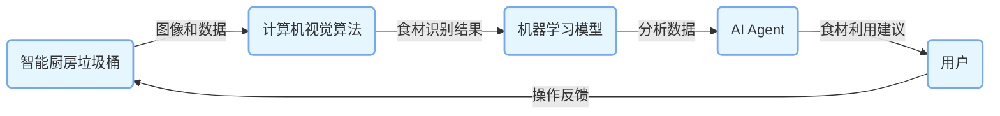

# 智能厨房垃圾桶：AI Agent的食材利用建议

> 关键词：智能厨房垃圾桶、AI Agent、食材利用建议、人工智能、厨房管理

> 摘要：本文聚焦于智能厨房垃圾桶与AI Agent相结合的创新应用，探讨了如何通过这一技术为用户提供食材利用建议。首先介绍了相关背景，包括目的、预期读者、文档结构和术语表。接着阐述了核心概念及联系，给出了原理和架构的示意图与流程图。详细讲解了核心算法原理并通过Python代码示例说明，同时介绍了相关数学模型和公式。通过项目实战展示了代码实现和解读，分析了实际应用场景。推荐了学习资源、开发工具框架以及相关论文著作。最后总结了未来发展趋势与挑战，并提供了常见问题解答和扩展阅读参考资料，旨在帮助读者全面了解智能厨房垃圾桶与AI Agent在食材利用方面的应用。

## 1. 背景介绍 
### 1.1 目的和范围
随着人们生活水平的提高，厨房中的食材种类日益丰富，但同时也面临着食材浪费的问题。智能厨房垃圾桶结合AI Agent技术，旨在通过对垃圾桶内丢弃食材的识别和分析，为用户提供合理的食材利用建议，减少食材浪费，提高厨房资源的利用效率。本文的范围涵盖了智能厨房垃圾桶与AI Agent的基本原理、算法实现、实际应用案例以及相关工具和资源的推荐。

### 1.2 预期读者
本文预期读者包括对智能家居、人工智能、厨房管理等领域感兴趣的技术爱好者、科研人员、智能家居开发者以及关注环保和资源利用的普通消费者。

### 1.3 文档结构概述
本文将按照以下结构进行阐述：首先介绍核心概念与联系，包括智能厨房垃圾桶和AI Agent的原理及架构；接着详细讲解核心算法原理和具体操作步骤，并给出Python代码示例；然后介绍相关的数学模型和公式，并举例说明；通过项目实战展示代码的实际实现和解读；分析实际应用场景；推荐学习资源、开发工具框架和相关论文著作；最后总结未来发展趋势与挑战，提供常见问题解答和扩展阅读参考资料。

### 1.4 术语表
#### 1.4.1 核心术语定义
- **智能厨房垃圾桶**：具备智能识别、数据处理和通信功能的厨房垃圾桶，能够对丢弃的食材进行识别和分析。
- **AI Agent**：人工智能代理，是一种能够感知环境、做出决策并采取行动的智能实体，在本文中用于根据垃圾桶数据提供食材利用建议。
- **食材利用建议**：根据垃圾桶内丢弃食材的信息，为用户提供的关于如何更好地利用剩余食材、避免浪费的建议。

#### 1.4.2 相关概念解释
- **计算机视觉**：是一门研究如何使机器“看”的科学，通过摄像头等设备获取图像或视频信息，并进行处理和分析，以实现目标识别、分类等任务。在智能厨房垃圾桶中，计算机视觉技术用于识别丢弃的食材。
- **机器学习**：是一门多领域交叉学科，涉及概率论、统计学、逼近论、凸分析、算法复杂度理论等多门学科。它专门研究计算机怎样模拟或实现人类的学习行为，以获取新的知识或技能，重新组织已有的知识结构使之不断改善自身的性能。在本文中，机器学习算法用于对食材识别和利用建议的生成。

#### 1.4.3 缩略词列表
- **AI**：Artificial Intelligence，人工智能
- **CV**：Computer Vision，计算机视觉
- **ML**：Machine Learning，机器学习

## 2. 核心概念与联系 
### 核心概念原理
智能厨房垃圾桶主要由硬件和软件两部分组成。硬件部分包括垃圾桶本体、摄像头、传感器等设备，用于获取垃圾桶内丢弃食材的图像和相关数据。软件部分则包括计算机视觉算法、机器学习模型等，用于对图像进行处理和分析，识别出丢弃的食材种类和数量。

AI Agent是一个智能决策系统，它接收智能厨房垃圾桶提供的数据，结合自身的知识库和算法，为用户生成食材利用建议。AI Agent的知识库中包含了各种食材的特性、烹饪方法、搭配建议等信息，通过对这些信息的分析和推理，为用户提供个性化的建议。

### 架构的文本示意图
```plaintext
智能厨房垃圾桶
|-- 硬件部分
|   |-- 垃圾桶本体
|   |-- 摄像头
|   |-- 传感器
|-- 软件部分
|   |-- 计算机视觉算法
|   |-- 机器学习模型

AI Agent
|-- 数据接收模块
|-- 知识库
|-- 推理引擎
|-- 建议生成模块

用户
|-- 智能厨房垃圾桶交互
|-- AI Agent交互
```

### Mermaid 流程图


## 3. 核心算法原理 & 具体操作步骤 
### 核心算法原理
#### 食材识别算法
食材识别主要基于计算机视觉技术，常用的方法是卷积神经网络（Convolutional Neural Network，CNN）。CNN是一种专门用于处理具有网格结构数据（如图像）的深度学习模型，它通过卷积层、池化层和全连接层等组件，自动提取图像的特征，并进行分类。

以下是一个简单的基于PyTorch的CNN食材识别模型示例：
```python
import torch
import torch.nn as nn

class FoodClassifier(nn.Module):
    def __init__(self, num_classes):
        super(FoodClassifier, self).__init__()
        self.conv1 = nn.Conv2d(3, 16, kernel_size=3, padding=1)
        self.relu1 = nn.ReLU()
        self.pool1 = nn.MaxPool2d(2)
        self.conv2 = nn.Conv2d(16, 32, kernel_size=3, padding=1)
        self.relu2 = nn.ReLU()
        self.pool2 = nn.MaxPool2d(2)
        self.fc1 = nn.Linear(32 * 56 * 56, 128)
        self.relu3 = nn.ReLU()
        self.fc2 = nn.Linear(128, num_classes)

    def forward(self, x):
        x = self.pool1(self.relu1(self.conv1(x)))
        x = self.pool2(self.relu2(self.conv2(x)))
        x = x.view(-1, 32 * 56 * 56)
        x = self.relu3(self.fc1(x))
        x = self.fc2(x)
        return x
```

#### 食材利用建议生成算法
食材利用建议生成主要基于规则引擎和机器学习算法。规则引擎根据知识库中的规则，对识别出的食材进行匹配和推理，生成初步的建议。机器学习算法则通过对大量历史数据的学习，对规则引擎生成的建议进行优化和调整，提高建议的准确性和个性化程度。

以下是一个简单的规则引擎示例：
```python
# 知识库
knowledge_base = {
    "西红柿": ["西红柿炒蛋", "西红柿汤"],
    "鸡蛋": ["西红柿炒蛋", "鸡蛋羹"],
    "土豆": ["土豆丝", "土豆炖牛肉"]
}

def generate_suggestions(foods):
    suggestions = []
    for food in foods:
        if food in knowledge_base:
            suggestions.extend(knowledge_base[food])
    return list(set(suggestions))
```

### 具体操作步骤
1. **数据采集**：智能厨房垃圾桶通过摄像头拍摄垃圾桶内丢弃食材的图像，并通过传感器获取相关数据。
2. **图像预处理**：对采集到的图像进行预处理，包括图像缩放、归一化、裁剪等操作，以提高图像的质量和特征提取的效果。
3. **食材识别**：将预处理后的图像输入到CNN模型中，进行食材识别，得到食材的种类和数量。
4. **数据传输**：将识别结果传输到AI Agent中。
5. **建议生成**：AI Agent根据知识库和机器学习算法，对识别结果进行分析和推理，生成食材利用建议。
6. **建议反馈**：将生成的建议反馈给用户，用户可以根据建议进行相应的操作。

## 4. 数学模型和公式 & 详细讲解 & 举例说明 
### 卷积神经网络的数学模型
卷积神经网络主要由卷积层、池化层和全连接层组成。以下是各层的数学模型和公式：

#### 卷积层
卷积层是CNN的核心层，它通过卷积操作提取图像的特征。卷积操作可以表示为：
$$
y_{i,j}^l = \sum_{m=0}^{M-1} \sum_{n=0}^{N-1} x_{i+m,j+n}^{l-1} \cdot w_{m,n}^l + b^l
$$
其中，$y_{i,j}^l$ 是第 $l$ 层卷积层的输出特征图在位置 $(i,j)$ 处的值，$x_{i+m,j+n}^{l-1}$ 是第 $l-1$ 层输入特征图在位置 $(i+m,j+n)$ 处的值，$w_{m,n}^l$ 是卷积核在位置 $(m,n)$ 处的权重，$b^l$ 是偏置。

#### 池化层
池化层用于对特征图进行下采样，减少特征图的尺寸，提高计算效率。常用的池化操作是最大池化，其公式为：
$$
y_{i,j}^l = \max_{m=0}^{M-1} \max_{n=0}^{N-1} x_{i \cdot s + m,j \cdot s + n}^{l-1}
$$
其中，$y_{i,j}^l$ 是第 $l$ 层池化层的输出特征图在位置 $(i,j)$ 处的值，$x_{i \cdot s + m,j \cdot s + n}^{l-1}$ 是第 $l-1$ 层输入特征图在位置 $(i \cdot s + m,j \cdot s + n)$ 处的值，$s$ 是池化步长。

#### 全连接层
全连接层将卷积层和池化层提取的特征进行整合，输出最终的分类结果。全连接层的计算公式为：
$$
y^l = \sum_{k=0}^{K-1} x_k^{l-1} \cdot w_k^l + b^l
$$
其中，$y^l$ 是第 $l$ 层全连接层的输出，$x_k^{l-1}$ 是第 $l-1$ 层输入的特征向量的第 $k$ 个元素，$w_k^l$ 是权重，$b^l$ 是偏置。

### 举例说明
假设我们有一个 $3 \times 3$ 的输入图像 $x$ 和一个 $2 \times 2$ 的卷积核 $w$，偏置 $b = 1$。输入图像和卷积核的值如下：
$$
x = \begin{bmatrix}
1 & 2 & 3 \\
4 & 5 & 6 \\
7 & 8 & 9
\end{bmatrix}, \quad
w = \begin{bmatrix}
1 & 2 \\
3 & 4
\end{bmatrix}
$$
卷积操作的计算过程如下：
$$
y_{0,0} = \sum_{m=0}^{1} \sum_{n=0}^{1} x_{0+m,0+n} \cdot w_{m,n} + b = 1 \times 1 + 2 \times 2 + 4 \times 3 + 5 \times 4 + 1 = 38
$$
$$
y_{0,1} = \sum_{m=0}^{1} \sum_{n=0}^{1} x_{0+m,1+n} \cdot w_{m,n} + b = 2 \times 1 + 3 \times 2 + 5 \times 3 + 6 \times 4 + 1 = 49
$$
$$
y_{1,0} = \sum_{m=0}^{1} \sum_{n=0}^{1} x_{1+m,0+n} \cdot w_{m,n} + b = 4 \times 1 + 5 \times 2 + 7 \times 3 + 8 \times 4 + 1 = 74
$$
$$
y_{1,1} = \sum_{m=0}^{1} \sum_{n=0}^{1} x_{1+m,1+n} \cdot w_{m,n} + b = 5 \times 1 + 6 \times 2 + 8 \times 3 + 9 \times 4 + 1 = 85
$$
最终的输出特征图为：
$$
y = \begin{bmatrix}
38 & 49 \\
74 & 85
\end{bmatrix}
$$

## 5. 项目实战：代码实际案例和详细解释说明 
### 5.1  开发环境搭建
#### 硬件环境
- 智能厨房垃圾桶（配备摄像头和传感器）
- 计算机（具备GPU加速能力更佳）

#### 软件环境
- Python 3.7 及以上版本
- PyTorch 深度学习框架
- OpenCV 计算机视觉库
- Flask Web框架（用于搭建服务端）

### 5.2  源代码详细实现和代码解读
#### 食材识别部分
```python
import torch
import torchvision.transforms as transforms
from PIL import Image
from model import FoodClassifier  # 导入前面定义的模型

# 加载模型
model = FoodClassifier(num_classes=10)  # 假设共有10类食材
model.load_state_dict(torch.load('food_classifier.pth'))
model.eval()

# 图像预处理
transform = transforms.Compose([
    transforms.Resize((224, 224)),
    transforms.ToTensor(),
    transforms.Normalize(mean=[0.485, 0.456, 0.406], std=[0.229, 0.224, 0.225])
])

def recognize_food(image_path):
    image = Image.open(image_path).convert('RGB')
    image = transform(image).unsqueeze(0)
    with torch.no_grad():
        output = model(image)
        _, predicted = torch.max(output.data, 1)
    return predicted.item()
```
代码解读：
- 首先导入必要的库和模型。
- 加载预训练的模型并将其设置为评估模式。
- 定义图像预处理的操作，包括调整大小、转换为张量和归一化。
- `recognize_food` 函数用于识别图像中的食材，返回预测的类别索引。

#### 建议生成部分
```python
# 知识库
knowledge_base = {
    "西红柿": ["西红柿炒蛋", "西红柿汤"],
    "鸡蛋": ["西红柿炒蛋", "鸡蛋羹"],
    "土豆": ["土豆丝", "土豆炖牛肉"]
}

def generate_suggestions(foods):
    suggestions = []
    for food in foods:
        if food in knowledge_base:
            suggestions.extend(knowledge_base[food])
    return list(set(suggestions))
```
代码解读：
- 定义知识库，包含食材和对应的烹饪建议。
- `generate_suggestions` 函数根据输入的食材列表生成建议，去除重复的建议。

#### 服务端部分
```python
from flask import Flask, request, jsonify
import json

app = Flask(__name__)

@app.route('/recognize', methods=['POST'])
def recognize():
    image_path = request.json.get('image_path')
    food_index = recognize_food(image_path)
    # 假设这里有一个索引到食材名称的映射
    food_name = ['西红柿', '鸡蛋', '土豆',...][food_index]
    suggestions = generate_suggestions([food_name])
    return jsonify({'food': food_name, 'suggestions': suggestions})

if __name__ == '__main__':
    app.run(debug=True)
```
代码解读：
- 使用Flask框架搭建服务端。
- 定义 `/recognize` 接口，接收图像路径，调用食材识别和建议生成函数，返回识别结果和建议。

### 5.3  代码解读与分析
- **食材识别部分**：通过加载预训练的CNN模型，对输入的图像进行预处理和预测，得到食材的类别索引。该部分的关键在于模型的训练和图像预处理的操作，以提高识别的准确性。
- **建议生成部分**：根据知识库中的规则，对识别出的食材生成烹饪建议。该部分的可扩展性较强，可以通过不断更新知识库来增加更多的建议。
- **服务端部分**：使用Flask框架搭建服务端，提供接口供客户端调用。该部分的优点是简单易用，可以方便地与其他系统进行集成。

## 6. 实际应用场景 
### 家庭厨房
在家庭厨房中，智能厨房垃圾桶结合AI Agent可以帮助用户更好地管理食材，减少浪费。例如，当用户丢弃一些食材时，系统可以及时提供这些食材的利用建议，如烹饪方法、搭配建议等。用户可以根据建议进行烹饪，充分利用剩余的食材。

### 餐厅厨房
在餐厅厨房中，智能厨房垃圾桶可以实时监测食材的使用情况，帮助厨师合理安排菜品的制作。当某种食材即将过期或剩余较多时，系统可以提供相应的菜品建议，避免食材的浪费。同时，通过对垃圾桶数据的分析，餐厅可以优化采购计划，降低成本。

### 学校食堂
在学校食堂中，智能厨房垃圾桶可以帮助食堂管理人员了解学生的饮食偏好和浪费情况。通过分析垃圾桶内丢弃的食材种类和数量，食堂可以调整菜品的种类和分量，提高学生的满意度，减少食材的浪费。

## 7. 工具和资源推荐
### 7.1 学习资源推荐
#### 7.1.1 书籍推荐
- 《深度学习》（Deep Learning）：由Ian Goodfellow、Yoshua Bengio和Aaron Courville所著，是深度学习领域的经典教材，涵盖了神经网络、卷积神经网络、循环神经网络等内容。
- 《Python计算机视觉编程》（Programming Computer Vision with Python）：介绍了如何使用Python和OpenCV进行计算机视觉编程，包括图像预处理、特征提取、目标检测等方面的内容。
- 《人工智能：一种现代的方法》（Artificial Intelligence: A Modern Approach）：是人工智能领域的权威教材，全面介绍了人工智能的各个方面，包括搜索算法、知识表示、机器学习等。

#### 7.1.2 在线课程
- Coursera上的“深度学习专项课程”（Deep Learning Specialization）：由吴恩达教授授课，包括神经网络和深度学习、改善深层神经网络、结构化机器学习项目等多个课程，是学习深度学习的优质资源。
- edX上的“计算机视觉基础”（Foundations of Computer Vision）：介绍了计算机视觉的基本概念和算法，包括图像滤波、特征提取、立体视觉等内容。
- 中国大学MOOC上的“人工智能基础”：由国内知名高校的教授授课，涵盖了人工智能的基本概念、搜索算法、机器学习等方面的内容。

#### 7.1.3 技术博客和网站
- Medium：是一个技术博客平台，上面有很多关于人工智能、计算机视觉等领域的优秀文章。
- Towards Data Science：专注于数据科学和机器学习领域的博客，提供了很多实用的教程和案例。
- OpenCV官方文档：是学习OpenCV的重要资源，提供了详细的文档和示例代码。

### 7.2 开发工具框架推荐
#### 7.2.1 IDE和编辑器
- PyCharm：是一款专门用于Python开发的集成开发环境，具有代码编辑、调试、版本控制等功能，适合专业开发者使用。
- Jupyter Notebook：是一个交互式的开发环境，支持Python、R等多种编程语言，适合数据科学家和研究人员进行数据分析和模型开发。
- Visual Studio Code：是一款轻量级的代码编辑器，支持多种编程语言和插件扩展，具有良好的用户体验。

#### 7.2.2 调试和性能分析工具
- PyTorch Profiler：是PyTorch提供的性能分析工具，可以帮助开发者分析模型的运行时间、内存使用等情况，优化模型性能。
- TensorBoard：是TensorFlow提供的可视化工具，也可以与PyTorch结合使用，用于可视化模型的训练过程、损失曲线等信息。
- cProfile：是Python标准库中的性能分析工具，可以分析Python代码的运行时间和函数调用情况。

#### 7.2.3 相关框架和库
- PyTorch：是一个开源的深度学习框架，具有动态图、易于使用等优点，广泛应用于计算机视觉、自然语言处理等领域。
- OpenCV：是一个开源的计算机视觉库，提供了丰富的图像处理和计算机视觉算法，如特征提取、目标检测、图像分割等。
- Flask：是一个轻量级的Web框架，适合快速搭建Web服务，用于开发智能厨房垃圾桶的服务端。

### 7.3 相关论文著作推荐
#### 7.3.1 经典论文
- LeCun, Y., Bottou, L., Bengio, Y., & Haffner, P. (1998). Gradient-based learning applied to document recognition. Proceedings of the IEEE, 86(11), 2278-2324. 这篇论文介绍了卷积神经网络的经典模型LeNet，是卷积神经网络领域的开山之作。
- Krizhevsky, A., Sutskever, I., & Hinton, G. E. (2012). ImageNet classification with deep convolutional neural networks. Advances in neural information processing systems, 25. 这篇论文介绍了AlexNet模型，在2012年的ImageNet图像分类竞赛中取得了显著的成绩，推动了深度学习在计算机视觉领域的发展。

#### 7.3.2 最新研究成果
- 通过搜索学术数据库（如IEEE Xplore、ACM Digital Library等），可以找到关于智能厨房管理、食材识别、人工智能在厨房领域应用等方面的最新研究成果。

#### 7.3.3 应用案例分析
- 可以关注一些智能家居、环保等领域的行业报告和案例分析，了解智能厨房垃圾桶和AI Agent在实际应用中的效果和经验。

## 8. 总结：未来发展趋势与挑战
### 未来发展趋势
- **功能集成化**：智能厨房垃圾桶将与更多的厨房设备进行集成，如智能冰箱、智能炉灶等，实现厨房设备的互联互通和协同工作。例如，智能冰箱可以实时监测食材的库存情况，当某种食材即将过期时，智能厨房垃圾桶可以根据冰箱提供的信息，为用户提供更精准的食材利用建议。
- **个性化服务**：随着人工智能技术的不断发展，AI Agent将能够根据用户的饮食习惯、健康状况、口味偏好等因素，为用户提供更加个性化的食材利用建议。例如，对于患有糖尿病的用户，系统可以提供低糖、低热量的食材利用方案。
- **数据共享与分析**：智能厨房垃圾桶产生的大量数据将被共享和分析，为食品供应商、餐饮企业等提供决策支持。例如，通过分析不同地区、不同季节的食材丢弃情况，食品供应商可以优化采购计划和配送策略。

### 挑战
- **数据准确性**：智能厨房垃圾桶的食材识别和数据采集的准确性是影响系统性能的关键因素。由于食材的外观、形状、颜色等因素的多样性，以及环境光照、遮挡等因素的影响，食材识别的准确性可能会受到一定的影响。
- **隐私保护**：智能厨房垃圾桶涉及到用户的个人饮食信息和隐私，如何保护用户的隐私是一个重要的挑战。在数据采集、存储和传输过程中，需要采取有效的安全措施，确保用户的隐私不被泄露。
- **成本问题**：智能厨房垃圾桶和AI Agent的开发和部署需要一定的成本，包括硬件设备、软件开发、数据存储等方面的成本。如何降低成本，提高系统的性价比，是推广应用的关键。

## 9. 附录：常见问题与解答
### 问题1：智能厨房垃圾桶的食材识别准确率有多高？
解答：食材识别的准确率受到多种因素的影响，如模型的训练数据、图像的质量、食材的种类等。一般来说，经过良好训练的模型在常见食材上的识别准确率可以达到80%以上，但在一些特殊情况下，准确率可能会有所下降。

### 问题2：如何保证用户的隐私安全？
解答：在设计智能厨房垃圾桶和AI Agent系统时，会采取多种安全措施来保护用户的隐私。例如，对采集到的数据进行加密处理，只在必要的情况下使用和共享数据，并且严格遵守相关的隐私法规和政策。

### 问题3：智能厨房垃圾桶的成本高吗？
解答：智能厨房垃圾桶的成本主要包括硬件设备和软件开发两部分。目前，市场上的智能厨房垃圾桶价格相对较高，但随着技术的不断发展和规模的扩大，成本有望逐渐降低。

## 10. 扩展阅读 & 参考资料
### 扩展阅读
- 《智能家居技术与应用》：介绍了智能家居的相关技术和应用场景，包括智能厨房、智能安防等方面的内容。
- 《人工智能与未来生活》：探讨了人工智能对未来生活的影响，包括智能家居、智能医疗等领域的发展趋势。

### 参考资料
- 相关的学术论文和研究报告
- 智能厨房垃圾桶和AI Agent的相关专利
- 各大科技公司和研究机构发布的技术文档和白皮书

作者：AI天才研究院/AI Genius Institute & 禅与计算机程序设计艺术 /Zen And The Art of Computer Programming