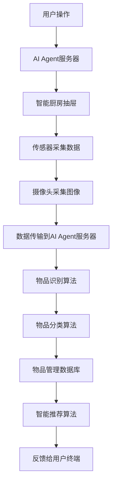

# 智能厨房抽屉：AI Agent的物品管理系统

> 关键词：智能厨房抽屉、AI Agent、物品管理系统、物联网、机器学习

> 摘要：本文围绕智能厨房抽屉的AI Agent物品管理系统展开。首先介绍了该系统的背景，包括目的、预期读者等。接着阐述了核心概念与联系，分析了核心算法原理并给出Python代码示例，详细讲解了数学模型和公式。通过项目实战展示了系统的开发环境搭建、源代码实现与解读。探讨了实际应用场景，推荐了相关的学习资源、开发工具框架以及论文著作。最后总结了未来发展趋势与挑战，解答常见问题并提供扩展阅读和参考资料，旨在全面深入地剖析智能厨房抽屉的AI Agent物品管理系统，为相关领域的研究和开发提供有价值的参考。

## 1. 背景介绍 
### 1.1 目的和范围
随着智能家居的快速发展，人们对于厨房智能化的需求也日益增长。智能厨房抽屉的AI Agent物品管理系统旨在解决传统厨房物品管理混乱、查找不便等问题。该系统的范围涵盖了厨房抽屉内物品的识别、分类、存储管理以及智能推荐等功能。通过利用先进的AI技术和物联网技术，实现对厨房抽屉内物品的自动化管理，提高用户的厨房使用体验。

### 1.2 预期读者
本文的预期读者包括智能家居领域的开发者、研究人员，对AI技术在厨房场景应用感兴趣的技术爱好者，以及希望提升厨房管理效率的普通消费者。开发者可以从本文中获取系统的设计思路、算法实现和代码示例，用于实际项目的开发；研究人员可以了解该领域的最新进展和研究方向；普通消费者可以通过本文了解智能厨房抽屉物品管理系统的功能和优势，为选择智能家居产品提供参考。

### 1.3 文档结构概述
本文将按照以下结构进行详细阐述：首先介绍核心概念与联系，包括系统的架构和原理；接着讲解核心算法原理和具体操作步骤，并给出Python代码示例；然后介绍数学模型和公式，并通过举例说明；通过项目实战展示系统的开发过程和代码实现；探讨系统的实际应用场景；推荐相关的工具和资源；总结未来发展趋势与挑战；解答常见问题并提供扩展阅读和参考资料。

### 1.4 术语表
#### 1.4.1 核心术语定义
- **AI Agent（人工智能代理）**：是一种能够感知环境、自主决策并采取行动以实现特定目标的智能实体。在本系统中，AI Agent负责对厨房抽屉内物品进行管理和决策。
- **智能厨房抽屉**：配备了传感器、摄像头等设备，能够与AI Agent进行通信，实现对抽屉内物品的识别和管理的厨房抽屉。
- **物品管理系统**：用于对厨房抽屉内物品进行识别、分类、存储和查询的系统，通过AI Agent实现自动化管理。

#### 1.4.2 相关概念解释
- **物联网（IoT）**：通过各种信息传感器、射频识别技术、全球定位系统、红外感应器、激光扫描器等各种装置与技术，实时采集任何需要监控、连接、互动的物体或过程，采集其声、光、热、电、力学、化学、生物、位置等各种需要的信息，通过各类可能的网络接入，实现物与物、物与人的泛在连接，实现对物品和过程的智能化感知、识别和管理。在本系统中，智能厨房抽屉通过物联网技术与AI Agent进行通信。
- **机器学习**：是一门多领域交叉学科，涉及概率论、统计学、逼近论、凸分析、算法复杂度理论等多门学科。它专门研究计算机怎样模拟或实现人类的学习行为，以获取新的知识或技能，重新组织已有的知识结构使之不断改善自身的性能。在本系统中，机器学习算法用于物品的识别和分类。

#### 1.4.3 缩略词列表
- **AI**：Artificial Intelligence，人工智能
- **IoT**：Internet of Things，物联网
- **ML**：Machine Learning，机器学习

## 2. 核心概念与联系 

### 核心概念原理
智能厨房抽屉的AI Agent物品管理系统主要基于物联网和人工智能技术。系统由智能厨房抽屉、传感器、摄像头、AI Agent服务器等部分组成。传感器和摄像头负责采集抽屉内物品的信息，如物品的位置、外观、重量等，并将这些信息传输到AI Agent服务器。AI Agent服务器利用机器学习算法对采集到的信息进行处理和分析，实现物品的识别、分类和管理。同时，AI Agent服务器还可以根据用户的需求和历史数据，为用户提供智能推荐，如食材搭配建议、食谱推荐等。

### 架构的文本示意图
```plaintext
+----------------------+
|      用户终端       |
|  (手机APP、Web界面)  |
+----------------------+
           |
           |  网络通信
           v
+----------------------+
|    AI Agent服务器    |
|  (物品识别、分类、  |
|   管理、推荐算法)    |
+----------------------+
           |
           |  网络通信
           v
+----------------------+
|    智能厨房抽屉      |
|  (传感器、摄像头)    |
+----------------------+
```

### Mermaid流程图


## 3. 核心算法原理 & 具体操作步骤 

### 核心算法原理
本系统主要涉及物品识别、物品分类和智能推荐三个核心算法。

#### 物品识别算法
物品识别算法采用卷积神经网络（Convolutional Neural Network，CNN）。CNN是一种专门用于处理具有网格结构数据（如图像）的深度学习模型。它通过卷积层、池化层和全连接层等结构，自动提取图像的特征，并进行分类。在本系统中，CNN用于识别厨房抽屉内的物品。

#### 物品分类算法
物品分类算法基于支持向量机（Support Vector Machine，SVM）。SVM是一种二分类模型，通过寻找一个最优的超平面，将不同类别的数据分开。在本系统中，SVM用于将识别出的物品进行分类，如食材、餐具等。

#### 智能推荐算法
智能推荐算法采用协同过滤算法。协同过滤算法基于用户的历史行为数据，寻找与当前用户兴趣相似的其他用户，并根据这些用户的行为为当前用户提供推荐。在本系统中，协同过滤算法用于根据用户的物品使用记录和偏好，为用户提供食材搭配建议和食谱推荐。

### 具体操作步骤
#### 步骤1：数据采集
使用传感器和摄像头采集厨房抽屉内物品的信息，包括物品的位置、外观、重量等。

#### 步骤2：数据预处理
对采集到的数据进行预处理，如图像的裁剪、缩放、归一化等，以提高算法的准确性。

#### 步骤3：物品识别
使用CNN模型对预处理后的图像进行识别，得到物品的类别。

#### 步骤4：物品分类
使用SVM模型对识别出的物品进行分类，得到物品的具体类别。

#### 步骤5：物品管理
将分类后的物品信息存储到数据库中，并进行管理，如物品的添加、删除、修改等。

#### 步骤6：智能推荐
使用协同过滤算法根据用户的历史数据和偏好，为用户提供食材搭配建议和食谱推荐。

### Python源代码示例
```python
import tensorflow as tf
from sklearn.svm import SVC
import pandas as pd
from sklearn.model_selection import train_test_split
from sklearn.metrics.pairwise import cosine_similarity

# 物品识别：使用TensorFlow构建CNN模型
def build_cnn_model():
    model = tf.keras.Sequential([
        tf.keras.layers.Conv2D(32, (3, 3), activation='relu', input_shape=(100, 100, 3)),
        tf.keras.layers.MaxPooling2D((2, 2)),
        tf.keras.layers.Conv2D(64, (3, 3), activation='relu'),
        tf.keras.layers.MaxPooling2D((2, 2)),
        tf.keras.layers.Flatten(),
        tf.keras.layers.Dense(64, activation='relu'),
        tf.keras.layers.Dense(10, activation='softmax')
    ])
    model.compile(optimizer='adam',
                  loss='sparse_categorical_crossentropy',
                  metrics=['accuracy'])
    return model

# 物品分类：使用SVM模型
def build_svm_model(X_train, y_train):
    svm = SVC()
    svm.fit(X_train, y_train)
    return svm

# 智能推荐：协同过滤算法
def collaborative_filtering(user_history, item_matrix):
    user_similarity = cosine_similarity(user_history, item_matrix)
    recommended_items = []
    for i in range(len(user_similarity[0])):
        if user_similarity[0][i] > 0.5:
            recommended_items.append(i)
    return recommended_items

# 主函数
if __name__ == "__main__":
    # 数据采集和预处理（这里省略具体代码）
    # 物品识别
    cnn_model = build_cnn_model()
    # 假设已经有训练好的数据
    X_train_images =...
    y_train_images =...
    cnn_model.fit(X_train_images, y_train_images, epochs=10)

    # 物品分类
    X_train_features =...
    y_train_features =...
    svm_model = build_svm_model(X_train_features, y_train_features)

    # 智能推荐
    user_history =...
    item_matrix =...
    recommended_items = collaborative_filtering(user_history, item_matrix)
    print("Recommended items:", recommended_items)
```

## 4. 数学模型和公式 & 详细讲解 & 举例说明 

### 卷积神经网络（CNN）
#### 数学模型和公式
卷积神经网络主要由卷积层、池化层和全连接层组成。

##### 卷积层
卷积层的核心操作是卷积运算。对于输入图像 $X$ 和卷积核 $W$，卷积运算的公式为：
$$(X * W)_{i,j} = \sum_{m=0}^{M-1} \sum_{n=0}^{N-1} X_{i+m,j+n} W_{m,n}$$
其中，$M$ 和 $N$ 是卷积核的大小，$(X * W)_{i,j}$ 是卷积结果在位置 $(i,j)$ 处的值。

##### 池化层
池化层的主要作用是降采样，常用的池化方法是最大池化。对于输入特征图 $X$，最大池化的公式为：
$$P_{i,j} = \max_{m,n \in R_{i,j}} X_{m,n}$$
其中，$R_{i,j}$ 是池化区域，$P_{i,j}$ 是池化结果在位置 $(i,j)$ 处的值。

##### 全连接层
全连接层将卷积层和池化层的输出进行连接，并进行线性变换。对于输入向量 $x$ 和权重矩阵 $W$，偏置向量 $b$，全连接层的输出 $y$ 的公式为：
$$y = Wx + b$$

#### 详细讲解
卷积层通过卷积核在输入图像上滑动，提取图像的局部特征。不同的卷积核可以提取不同类型的特征，如边缘、纹理等。池化层通过降采样减少特征图的尺寸，降低计算量，同时增强模型的鲁棒性。全连接层将卷积层和池化层提取的特征进行整合，并进行分类。

#### 举例说明
假设输入图像的大小为 $32 \times 32 \times 3$（高度 $\times$ 宽度 $\times$ 通道数），卷积核的大小为 $3 \times 3 \times 3$，步长为 1，填充为 0。则卷积层的输出特征图的大小为 $(32 - 3 + 1) \times (32 - 3 + 1) \times$ 卷积核的数量。如果使用 16 个卷积核，则输出特征图的大小为 $30 \times 30 \times 16$。

### 支持向量机（SVM）
#### 数学模型和公式
支持向量机的目标是寻找一个最优的超平面，将不同类别的数据分开。对于线性可分的数据，超平面的方程为：
$$w^T x + b = 0$$
其中，$w$ 是超平面的法向量，$b$ 是偏置项。支持向量机的优化目标是最大化间隔，即：
$$\max_{w,b} \frac{2}{\|w\|}$$
$$s.t. \quad y_i (w^T x_i + b) \geq 1, \quad i = 1,2,\cdots,n$$
其中，$y_i$ 是样本的标签，$x_i$ 是样本的特征向量，$n$ 是样本的数量。

#### 详细讲解
支持向量机通过寻找一个最优的超平面，使得不同类别的数据之间的间隔最大。在训练过程中，支持向量机只关注那些离超平面最近的样本，这些样本被称为支持向量。通过调整超平面的参数 $w$ 和 $b$，使得间隔最大化。

#### 举例说明
假设我们有一个二维数据集，包含两个类别的数据点。支持向量机的目标是找到一条直线，将这两个类别的数据点分开，并且使得直线到最近的数据点的距离最大。这条直线就是最优超平面。

### 协同过滤算法
#### 数学模型和公式
协同过滤算法主要基于用户的历史行为数据，通过计算用户之间的相似度来进行推荐。常用的相似度计算方法是余弦相似度，公式为：
$$sim(u,v) = \frac{\sum_{i \in I_{u,v}} r_{u,i} r_{v,i}}{\sqrt{\sum_{i \in I_u} r_{u,i}^2} \sqrt{\sum_{i \in I_v} r_{v,i}^2}}$$
其中，$sim(u,v)$ 是用户 $u$ 和用户 $v$ 之间的相似度，$r_{u,i}$ 是用户 $u$ 对物品 $i$ 的评分，$I_{u,v}$ 是用户 $u$ 和用户 $v$ 共同评分的物品集合，$I_u$ 和 $I_v$ 分别是用户 $u$ 和用户 $v$ 评分的物品集合。

#### 详细讲解
协同过滤算法首先计算用户之间的相似度，然后找到与当前用户兴趣相似的其他用户。根据这些相似用户的评分记录，为当前用户推荐未评分的物品。

#### 举例说明
假设我们有三个用户 $A$、$B$、$C$，他们对三个物品 $1$、$2$、$3$ 的评分如下：
| 用户 | 物品 1 | 物品 2 | 物品 3 |
| ---- | ---- | ---- | ---- |
| A | 5 | 3 | 1 |
| B | 4 | 2 | 0 |
| C | 1 | 0 | 5 |

计算用户 $A$ 和用户 $B$ 之间的余弦相似度：
$$sim(A,B) = \frac{5 \times 4 + 3 \times 2 + 1 \times 0}{\sqrt{5^2 + 3^2 + 1^2} \sqrt{4^2 + 2^2 + 0^2}} \approx 0.96$$

如果相似度大于某个阈值，如 0.8，则认为用户 $A$ 和用户 $B$ 兴趣相似。根据用户 $B$ 的评分记录，为用户 $A$ 推荐物品。

## 5. 项目实战：代码实际案例和详细解释说明 

### 5.1  开发环境搭建
#### 硬件环境
- 智能厨房抽屉：配备传感器和摄像头，用于采集物品信息。
- 服务器：用于运行AI Agent服务器，推荐使用具有较高计算性能的服务器，如阿里云ECS实例。

#### 软件环境
- 操作系统：推荐使用Linux系统，如Ubuntu 18.04。
- 编程语言：Python 3.7及以上版本。
- 深度学习框架：TensorFlow 2.x，用于构建和训练CNN模型。
- 机器学习库：Scikit-learn，用于构建和训练SVM模型。
- 数据库：MySQL，用于存储物品信息和用户历史数据。

#### 安装步骤
1. 安装Python：可以从Python官方网站下载安装包，按照提示进行安装。
2. 安装TensorFlow：使用pip命令进行安装：
```bash
pip install tensorflow
```
3. 安装Scikit-learn：使用pip命令进行安装：
```bash
pip install scikit-learn
```
4. 安装MySQL：可以参考MySQL官方文档进行安装和配置。

### 5.2  源代码详细实现和代码解读
```python
import tensorflow as tf
from sklearn.svm import SVC
import pandas as pd
from sklearn.model_selection import train_test_split
from sklearn.metrics.pairwise import cosine_similarity
import mysql.connector

# 连接数据库
def connect_to_database():
    mydb = mysql.connector.connect(
        host="localhost",
        user="your_username",
        password="your_password",
        database="kitchen_items"
    )
    return mydb

# 物品识别：使用TensorFlow构建CNN模型
def build_cnn_model():
    model = tf.keras.Sequential([
        tf.keras.layers.Conv2D(32, (3, 3), activation='relu', input_shape=(100, 100, 3)),
        tf.keras.layers.MaxPooling2D((2, 2)),
        tf.keras.layers.Conv2D(64, (3, 3), activation='relu'),
        tf.keras.layers.MaxPooling2D((2, 2)),
        tf.keras.layers.Flatten(),
        tf.keras.layers.Dense(64, activation='relu'),
        tf.keras.layers.Dense(10, activation='softmax')
    ])
    model.compile(optimizer='adam',
                  loss='sparse_categorical_crossentropy',
                  metrics=['accuracy'])
    return model

# 物品分类：使用SVM模型
def build_svm_model(X_train, y_train):
    svm = SVC()
    svm.fit(X_train, y_train)
    return svm

# 智能推荐：协同过滤算法
def collaborative_filtering(user_history, item_matrix):
    user_similarity = cosine_similarity(user_history, item_matrix)
    recommended_items = []
    for i in range(len(user_similarity[0])):
        if user_similarity[0][i] > 0.5:
            recommended_items.append(i)
    return recommended_items

# 物品信息存储到数据库
def save_item_info(mydb, item_name, item_category):
    mycursor = mydb.cursor()
    sql = "INSERT INTO items (name, category) VALUES (%s, %s)"
    val = (item_name, item_category)
    mycursor.execute(sql, val)
    mydb.commit()

# 主函数
if __name__ == "__main__":
    # 连接数据库
    mydb = connect_to_database()

    # 数据采集和预处理（这里省略具体代码）
    # 物品识别
    cnn_model = build_cnn_model()
    # 假设已经有训练好的数据
    X_train_images =...
    y_train_images =...
    cnn_model.fit(X_train_images, y_train_images, epochs=10)

    # 物品分类
    X_train_features =...
    y_train_features =...
    svm_model = build_svm_model(X_train_features, y_train_features)

    # 假设采集到一张新的物品图像
    new_image =...
    new_image = tf.expand_dims(new_image, axis=0)
    item_prediction = cnn_model.predict(new_image)
    item_name =...  # 根据预测结果得到物品名称

    # 提取物品特征
    item_features =...
    item_category = svm_model.predict([item_features])[0]

    # 物品信息存储到数据库
    save_item_info(mydb, item_name, item_category)

    # 智能推荐
    user_history =...
    item_matrix =...
    recommended_items = collaborative_filtering(user_history, item_matrix)
    print("Recommended items:", recommended_items)
```

### 5.3  代码解读与分析
#### 数据库连接
`connect_to_database` 函数用于连接MySQL数据库，需要根据实际情况修改数据库的用户名、密码和数据库名。

#### 物品识别
`build_cnn_model` 函数构建了一个简单的CNN模型，用于物品识别。模型包含卷积层、池化层和全连接层，使用 `adam` 优化器和 `sparse_categorical_crossentropy` 损失函数。

#### 物品分类
`build_svm_model` 函数构建了一个SVM模型，用于物品分类。使用 `fit` 方法对模型进行训练。

#### 智能推荐
`collaborative_filtering` 函数实现了协同过滤算法，根据用户的历史数据和物品矩阵计算用户之间的相似度，并推荐相似度较高的物品。

#### 物品信息存储
`save_item_info` 函数将识别和分类后的物品信息存储到数据库中。

#### 主函数
主函数首先连接数据库，然后进行物品识别、分类和存储，最后进行智能推荐。

## 6. 实际应用场景 
### 家庭厨房
在家庭厨房中，智能厨房抽屉的AI Agent物品管理系统可以帮助用户更好地管理厨房物品。用户可以通过手机APP或Web界面查看抽屉内物品的信息，包括物品的名称、数量、保质期等。系统还可以根据用户的历史使用记录和偏好，为用户提供食材搭配建议和食谱推荐，帮助用户更方便地烹饪美食。

### 餐厅厨房
在餐厅厨房中，该系统可以提高厨房管理的效率。厨师可以快速查找所需的食材和餐具，减少寻找物品的时间。同时，系统可以实时监控食材的库存情况，及时提醒厨师采购食材，避免因食材短缺而影响餐厅的正常运营。

### 食品加工厂
在食品加工厂中，智能厨房抽屉的AI Agent物品管理系统可以用于原材料的管理。系统可以对原材料进行识别和分类，记录原材料的来源、生产日期、保质期等信息。通过对原材料的实时监控，确保食品加工的质量和安全。

## 7. 工具和资源推荐
### 7.1 学习资源推荐
#### 7.1.1 书籍推荐
- 《深度学习》（Deep Learning）：由Ian Goodfellow、Yoshua Bengio和Aaron Courville所著，是深度学习领域的经典教材，涵盖了深度学习的基本概念、算法和应用。
- 《Python机器学习》（Python Machine Learning）：由Sebastian Raschka所著，介绍了Python在机器学习中的应用，包括数据预处理、模型选择、评估和优化等内容。
- 《人工智能：一种现代的方法》（Artificial Intelligence: A Modern Approach）：由Stuart Russell和Peter Norvig所著，是人工智能领域的权威教材，全面介绍了人工智能的各个方面。

#### 7.1.2 在线课程
- Coursera上的《深度学习专项课程》（Deep Learning Specialization）：由Andrew Ng教授授课，包括神经网络和深度学习、改善深层神经网络、结构化机器学习项目、卷积神经网络、序列模型等课程。
- edX上的《人工智能导论》（Introduction to Artificial Intelligence）：由麻省理工学院（MIT）提供，介绍了人工智能的基本概念、算法和应用。
- 网易云课堂上的《Python数据分析与机器学习实战》：由黄永昌老师授课，通过实际案例介绍了Python在数据分析和机器学习中的应用。

#### 7.1.3 技术博客和网站
- Medium：是一个技术博客平台，有很多关于人工智能、机器学习和深度学习的优质文章。
- Towards Data Science：是一个专注于数据科学和机器学习的技术博客，提供了很多实用的教程和案例。
- Kaggle：是一个数据科学竞赛平台，上面有很多数据集和优秀的解决方案，可以学习到很多实际应用的经验。

### 7.2 开发工具框架推荐
#### 7.2.1 IDE和编辑器
- PyCharm：是一款专门为Python开发设计的集成开发环境（IDE），具有代码编辑、调试、版本控制等功能。
- Jupyter Notebook：是一个交互式的开发环境，适合进行数据分析和机器学习实验，支持Python、R等多种编程语言。
- Visual Studio Code：是一款轻量级的代码编辑器，支持多种编程语言，有丰富的插件可以扩展功能。

#### 7.2.2 调试和性能分析工具
- TensorBoard：是TensorFlow提供的一个可视化工具，可以用于监控模型的训练过程、可视化模型的结构和性能指标等。
- Scikit-learn的`GridSearchCV`：用于模型的参数调优，可以自动搜索最优的参数组合。
- cProfile：是Python的一个性能分析工具，可以分析代码的执行时间和函数调用次数，帮助优化代码性能。

#### 7.2.3 相关框架和库
- TensorFlow：是一个开源的深度学习框架，支持多种深度学习模型的构建和训练，具有高效、灵活等特点。
- PyTorch：是另一个流行的深度学习框架，具有动态图的特点，适合快速开发和实验。
- Scikit-learn：是一个开源的机器学习库，提供了丰富的机器学习算法和工具，如分类、回归、聚类等。

### 7.3 相关论文著作推荐
#### 7.3.1 经典论文
- 《Gradient-Based Learning Applied to Document Recognition》：由Yann LeCun等人发表，介绍了卷积神经网络（CNN）在手写字符识别中的应用，是CNN领域的经典论文。
- 《Support-Vector Networks》：由Corinna Cortes和Vladimir Vapnik发表，介绍了支持向量机（SVM）的基本原理和算法，是SVM领域的经典论文。
- 《Item-Based Collaborative Filtering Recommendation Algorithms》：由Badrul Sarwar等人发表，介绍了基于物品的协同过滤算法，是协同过滤领域的经典论文。

#### 7.3.2 最新研究成果
- 《Attention Is All You Need》：提出了Transformer模型，是自然语言处理领域的重要突破，在机器翻译、文本生成等任务中取得了很好的效果。
- 《Masked Autoencoders Are Scalable Vision Learners》：提出了Masked Autoencoder（MAE）模型，是计算机视觉领域的最新研究成果，在图像分类、目标检测等任务中表现出色。

#### 7.3.3 应用案例分析
- 《Smart Kitchen: A Review of Technologies and Applications》：对智能厨房的技术和应用进行了综述，介绍了智能厨房的发展现状和未来趋势。
- 《AI-Enabled Smart Kitchen for Personalized Cooking and Nutrition Management》：介绍了基于人工智能的智能厨房系统在个性化烹饪和营养管理方面的应用。

## 8. 总结：未来发展趋势与挑战
### 未来发展趋势
#### 智能化程度不断提高
随着人工智能技术的不断发展，智能厨房抽屉的AI Agent物品管理系统的智能化程度将不断提高。系统将能够更好地理解用户的需求，提供更加个性化的服务。例如，根据用户的健康状况和饮食偏好，为用户提供更加精准的食材搭配建议和食谱推荐。

#### 与其他智能家居设备的集成
智能厨房抽屉的AI Agent物品管理系统将与其他智能家居设备进行集成，实现更加智能化的家居控制。例如，与智能冰箱、智能烤箱等设备进行联动，实现食材的自动采购、烹饪过程的自动控制等功能。

#### 大数据和云计算的应用
大数据和云计算技术将在智能厨房抽屉的AI Agent物品管理系统中得到广泛应用。通过收集和分析大量的用户数据，系统可以不断优化自身的算法和模型，提高服务的质量和效率。同时，云计算技术可以提供强大的计算能力，支持系统的大规模部署和运行。

### 挑战
#### 数据隐私和安全问题
智能厨房抽屉的AI Agent物品管理系统需要收集和处理大量的用户数据，如物品信息、用户偏好等。这些数据涉及用户的隐私和安全问题，需要采取有效的措施进行保护。例如，采用加密技术对数据进行加密存储和传输，建立严格的访问控制机制等。

#### 算法的准确性和可靠性
物品识别、分类和智能推荐等算法的准确性和可靠性直接影响系统的性能和用户体验。需要不断优化算法，提高算法的准确性和可靠性。例如，采用更先进的深度学习模型和算法，增加训练数据的数量和质量等。

#### 硬件设备的成本和稳定性
智能厨房抽屉需要配备传感器、摄像头等硬件设备，这些设备的成本和稳定性是影响系统推广和应用的重要因素。需要降低硬件设备的成本，提高硬件设备的稳定性和可靠性。例如，采用更先进的传感器技术和制造工艺，优化硬件设备的设计和布局等。

## 9. 附录：常见问题与解答
### 问题1：智能厨房抽屉的AI Agent物品管理系统需要联网吗？
解答：是的，该系统需要联网。因为系统需要将采集到的物品信息传输到AI Agent服务器进行处理和分析，同时也需要从服务器获取智能推荐等服务。

### 问题2：系统的物品识别准确率如何？
解答：系统的物品识别准确率取决于多种因素，如训练数据的质量和数量、采用的算法和模型等。一般来说，通过不断优化算法和增加训练数据，可以提高物品识别的准确率。

### 问题3：系统是否支持多种语言？
解答：目前系统的默认语言可能是英语，但可以通过开发相应的语言包来支持多种语言。在实际应用中，可以根据用户的需求进行定制。

### 问题4：系统的硬件设备容易安装和维护吗？
解答：系统的硬件设备通常设计得比较简单，易于安装和维护。一般来说，用户可以按照说明书进行自行安装。如果遇到问题，可以联系厂家的技术支持人员进行解决。

## 10. 扩展阅读 & 参考资料
### 扩展阅读
- 《智能家居技术与应用》：介绍了智能家居的各种技术和应用场景，对智能厨房抽屉的AI Agent物品管理系统有更深入的了解。
- 《人工智能的未来》：探讨了人工智能的发展趋势和未来挑战，为智能厨房抽屉的AI Agent物品管理系统的未来发展提供了思路。

### 参考资料
- 相关技术文档和官方网站：如TensorFlow官方文档、Scikit-learn官方文档等。
- 学术论文和研究报告：如IEEE Xplore、ACM Digital Library等学术数据库中的相关论文。

作者：AI天才研究院/AI Genius Institute & 禅与计算机程序设计艺术 /Zen And The Art of Computer Programming