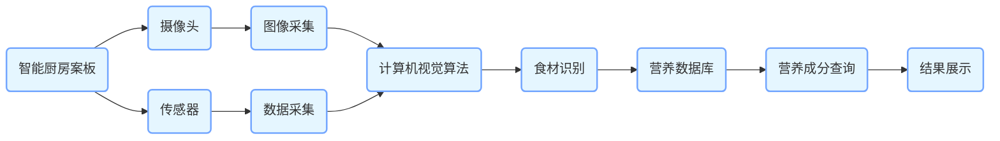

# 智能厨房案板：AI Agent的食材营养分析

> 关键词：智能厨房案板、AI Agent、食材营养分析、计算机视觉、数据分析

> 摘要：本文围绕智能厨房案板中AI Agent的食材营养分析展开。介绍了智能厨房案板的背景及相关概念，详细阐述了AI Agent进行食材营养分析的核心原理、算法和数学模型。通过项目实战给出具体代码案例及解释，探讨了其实际应用场景。同时推荐了学习、开发相关的工具和资源，最后总结了未来发展趋势与挑战，并对常见问题进行解答，为智能厨房案板领域的研究和应用提供全面的技术参考。

## 1. 背景介绍 
### 1.1 目的和范围
随着人们对健康饮食的关注度不断提高，了解食材的营养成分变得至关重要。智能厨房案板结合AI Agent技术，旨在为用户提供便捷、准确的食材营养分析服务。本文的范围涵盖了智能厨房案板中AI Agent食材营养分析的核心原理、算法实现、实际应用等方面，旨在深入剖析这一新兴技术的各个环节。
### 1.2 预期读者
本文预期读者包括对智能厨房设备、人工智能、食品营养等领域感兴趣的技术人员、研究人员、开发者，以及关注健康饮食、智能家居的普通消费者。
### 1.3 文档结构概述
本文首先介绍相关背景知识，包括目的、读者和文档结构等。接着阐述核心概念与联系，展示其原理和架构。然后详细讲解核心算法原理和具体操作步骤，并给出Python源代码。随后介绍数学模型和公式，通过举例说明其应用。项目实战部分给出代码实际案例和详细解释。之后探讨实际应用场景，推荐相关工具和资源。最后总结未来发展趋势与挑战，解答常见问题，并提供扩展阅读和参考资料。
### 1.4 术语表
#### 1.4.1 核心术语定义
- **智能厨房案板**：集成了多种传感器和计算设备，能够对放置在其上的食材进行识别和分析的厨房工具。
- **AI Agent**：人工智能代理，是一种能够感知环境、做出决策并采取行动的智能实体，在本文中用于食材营养分析。
- **食材营养分析**：通过对食材的特征进行识别和分析，确定其营养成分和含量的过程。
#### 1.4.2 相关概念解释
- **计算机视觉**：让计算机从图像或视频中获取有意义信息的技术，在智能厨房案板中用于食材识别。
- **数据分析**：对收集到的数据进行处理、分析和解释的过程，用于确定食材的营养成分。
#### 1.4.3 缩略词列表
- **CNN**：Convolutional Neural Network，卷积神经网络，用于图像识别。
- **API**：Application Programming Interface，应用程序编程接口，用于与外部数据进行交互。

## 2. 核心概念与联系 

### 核心概念原理
智能厨房案板的食材营养分析主要基于计算机视觉和数据分析技术。AI Agent通过摄像头等传感器获取食材的图像信息，利用计算机视觉算法对图像进行处理和分析，识别出食材的种类。然后，通过与营养数据库进行匹配，获取该食材的营养成分信息。

### 架构示意图


该架构展示了智能厨房案板中AI Agent进行食材营养分析的主要流程。首先，摄像头和传感器分别采集食材的图像和其他相关数据。然后，计算机视觉算法对这些数据进行处理，识别出食材的种类。接着，通过查询营养数据库获取该食材的营养成分信息。最后，将结果展示给用户。

## 3. 核心算法原理 & 具体操作步骤 

### 核心算法原理
在食材营养分析中，核心的算法是食材识别算法，常用的是卷积神经网络（CNN）。CNN是一种专门用于处理具有网格结构数据（如图像）的深度学习模型，它通过卷积层、池化层和全连接层等组件，自动提取图像的特征，并进行分类。

### 具体操作步骤
1. **数据收集**：收集大量不同种类食材的图像数据，并进行标注，标注信息包括食材的名称。
2. **数据预处理**：对收集到的图像数据进行预处理，包括图像的缩放、裁剪、归一化等操作，以提高模型的训练效果。
3. **模型训练**：使用预处理后的图像数据对CNN模型进行训练，调整模型的参数，使其能够准确地识别不同种类的食材。
4. **模型评估**：使用测试数据集对训练好的模型进行评估，计算模型的准确率、召回率等指标，评估模型的性能。
5. **营养信息查询**：当模型识别出食材的种类后，通过API或本地数据库查询该食材的营养成分信息。

### Python源代码实现
```python
import tensorflow as tf
from tensorflow.keras import layers, models
import numpy as np
import os

# 数据收集和预处理
def load_data(data_dir):
    images = []
    labels = []
    class_names = os.listdir(data_dir)
    for i, class_name in enumerate(class_names):
        class_dir = os.path.join(data_dir, class_name)
        for img_name in os.listdir(class_dir):
            img_path = os.path.join(class_dir, img_name)
            img = tf.keras.preprocessing.image.load_img(img_path, target_size=(224, 224))
            img = tf.keras.preprocessing.image.img_to_array(img)
            img = img / 255.0
            images.append(img)
            labels.append(i)
    images = np.array(images)
    labels = np.array(labels)
    return images, labels, class_names

# 构建CNN模型
def build_model(num_classes):
    model = models.Sequential([
        layers.Conv2D(32, (3, 3), activation='relu', input_shape=(224, 224, 3)),
        layers.MaxPooling2D((2, 2)),
        layers.Conv2D(64, (3, 3), activation='relu'),
        layers.MaxPooling2D((2, 2)),
        layers.Conv2D(128, (3, 3), activation='relu'),
        layers.MaxPooling2D((2, 2)),
        layers.Flatten(),
        layers.Dense(128, activation='relu'),
        layers.Dense(num_classes, activation='softmax')
    ])
    model.compile(optimizer='adam',
                  loss='sparse_categorical_crossentropy',
                  metrics=['accuracy'])
    return model

# 训练模型
def train_model(model, images, labels, epochs=10):
    model.fit(images, labels, epochs=epochs)
    return model

# 预测食材种类
def predict_food(model, image):
    image = np.expand_dims(image, axis=0)
    predictions = model.predict(image)
    predicted_class = np.argmax(predictions[0])
    return predicted_class

# 主函数
if __name__ == "__main__":
    data_dir = 'path/to/your/data'
    images, labels, class_names = load_data(data_dir)
    num_classes = len(class_names)
    model = build_model(num_classes)
    model = train_model(model, images, labels)

    # 示例预测
    test_image = images[0]
    predicted_class = predict_food(model, test_image)
    print(f"Predicted food: {class_names[predicted_class]}")
```

### 代码解释
1. **load_data函数**：用于加载和预处理图像数据，将图像缩放为224x224的大小，并进行归一化处理。
2. **build_model函数**：构建CNN模型，包括卷积层、池化层和全连接层，使用`adam`优化器和`sparse_categorical_crossentropy`损失函数。
3. **train_model函数**：对模型进行训练，指定训练的轮数。
4. **predict_food函数**：对输入的图像进行预测，返回预测的食材种类。
5. **主函数**：调用上述函数完成数据加载、模型构建、训练和预测的过程。

## 4. 数学模型和公式 & 详细讲解 & 举例说明 

### 卷积神经网络中的数学模型
#### 卷积操作
卷积操作是CNN的核心操作之一，其数学公式为：
$$
y_{i,j}^l = \sum_{m=0}^{M-1}\sum_{n=0}^{N-1} x_{i+m,j+n}^{l-1} \cdot w_{m,n}^l + b^l
$$
其中，$y_{i,j}^l$ 是第 $l$ 层卷积层在位置 $(i,j)$ 的输出，$x_{i+m,j+n}^{l-1}$ 是第 $l-1$ 层在位置 $(i+m,j+n)$ 的输入，$w_{m,n}^l$ 是第 $l$ 层的卷积核在位置 $(m,n)$ 的权重，$b^l$ 是第 $l$ 层的偏置，$M$ 和 $N$ 是卷积核的大小。

#### 池化操作
池化操作用于减少特征图的尺寸，常用的池化操作是最大池化。最大池化的数学公式为：
$$
y_{i,j}^l = \max_{m=0}^{M-1}\max_{n=0}^{N-1} x_{i \cdot s + m,j \cdot s + n}^{l-1}
$$
其中，$y_{i,j}^l$ 是第 $l$ 层池化层在位置 $(i,j)$ 的输出，$x_{i \cdot s + m,j \cdot s + n}^{l-1}$ 是第 $l-1$ 层在位置 $(i \cdot s + m,j \cdot s + n)$ 的输入，$s$ 是池化的步长，$M$ 和 $N$ 是池化窗口的大小。

#### 全连接层
全连接层将卷积层和池化层提取的特征进行整合，其数学公式为：
$$
y_j^l = \sum_{i=0}^{N-1} x_i^{l-1} \cdot w_{i,j}^l + b_j^l
$$
其中，$y_j^l$ 是第 $l$ 层全连接层在位置 $j$ 的输出，$x_i^{l-1}$ 是第 $l-1$ 层在位置 $i$ 的输入，$w_{i,j}^l$ 是第 $l$ 层的权重，$b_j^l$ 是第 $l$ 层的偏置，$N$ 是第 $l-1$ 层的神经元数量。

### 举例说明
假设我们有一个输入图像的大小为 $32 \times 32 \times 3$（高度 $\times$ 宽度 $\times$ 通道数），使用一个大小为 $3 \times 3$ 的卷积核进行卷积操作，步长为 1，填充为 0。卷积核的数量为 16。

1. **卷积操作**：
   - 输入特征图的大小为 $32 \times 32 \times 3$。
   - 卷积核的大小为 $3 \times 3 \times 3$（考虑输入通道数），有 16 个卷积核。
   - 输出特征图的大小为 $(32 - 3 + 1) \times (32 - 3 + 1) \times 16 = 30 \times 30 \times 16$。

2. **池化操作**：
   - 假设使用 $2 \times 2$ 的最大池化，步长为 2。
   - 输入特征图的大小为 $30 \times 30 \times 16$。
   - 输出特征图的大小为 $(30 / 2) \times (30 / 2) \times 16 = 15 \times 15 \times 16$。

3. **全连接层**：
   - 假设将池化层的输出展平后有 $15 \times 15 \times 16 = 3600$ 个神经元。
   - 全连接层有 128 个神经元。
   - 输出层有 10 个神经元（假设进行 10 分类任务）。

通过上述数学模型和操作，CNN可以自动提取图像的特征，并进行分类。

## 5. 项目实战：代码实际案例和详细解释说明 

### 5.1  开发环境搭建
#### 操作系统
建议使用Linux或Windows操作系统，本文以Ubuntu 20.04为例进行说明。

#### 编程语言和库
- **Python**：版本 3.7 及以上。
- **TensorFlow**：用于构建和训练深度学习模型。
- **NumPy**：用于数值计算。
- **OpenCV**：用于图像处理。

#### 安装步骤
1. 安装Python：
```bash
sudo apt update
sudo apt install python3 python3-pip
```
2. 安装TensorFlow、NumPy和OpenCV：
```bash
pip3 install tensorflow numpy opencv-python
```

### 5.2  源代码详细实现和代码解读
```python
import tensorflow as tf
from tensorflow.keras import layers, models
import numpy as np
import cv2
import os

# 数据收集和预处理
def load_data(data_dir):
    images = []
    labels = []
    class_names = os.listdir(data_dir)
    for i, class_name in enumerate(class_names):
        class_dir = os.path.join(data_dir, class_name)
        for img_name in os.listdir(class_dir):
            img_path = os.path.join(class_dir, img_name)
            img = cv2.imread(img_path)
            img = cv2.resize(img, (224, 224))
            img = img / 255.0
            images.append(img)
            labels.append(i)
    images = np.array(images)
    labels = np.array(labels)
    return images, labels, class_names

# 构建CNN模型
def build_model(num_classes):
    model = models.Sequential([
        layers.Conv2D(32, (3, 3), activation='relu', input_shape=(224, 224, 3)),
        layers.MaxPooling2D((2, 2)),
        layers.Conv2D(64, (3, 3), activation='relu'),
        layers.MaxPooling2D((2, 2)),
        layers.Conv2D(128, (3, 3), activation='relu'),
        layers.MaxPooling2D((2, 2)),
        layers.Flatten(),
        layers.Dense(128, activation='relu'),
        layers.Dense(num_classes, activation='softmax')
    ])
    model.compile(optimizer='adam',
                  loss='sparse_categorical_crossentropy',
                  metrics=['accuracy'])
    return model

# 训练模型
def train_model(model, images, labels, epochs=10):
    model.fit(images, labels, epochs=epochs)
    return model

# 预测食材种类
def predict_food(model, image):
    image = cv2.resize(image, (224, 224))
    image = image / 255.0
    image = np.expand_dims(image, axis=0)
    predictions = model.predict(image)
    predicted_class = np.argmax(predictions[0])
    return predicted_class

# 主函数
if __name__ == "__main__":
    data_dir = 'path/to/your/data'
    images, labels, class_names = load_data(data_dir)
    num_classes = len(class_names)
    model = build_model(num_classes)
    model = train_model(model, images, labels)

    # 从摄像头获取图像进行预测
    cap = cv2.VideoCapture(0)
    while True:
        ret, frame = cap.read()
        if not ret:
            break
        predicted_class = predict_food(model, frame)
        predicted_food = class_names[predicted_class]
        cv2.putText(frame, f"Predicted: {predicted_food}", (10, 30), cv2.FONT_HERSHEY_SIMPLEX, 1, (0, 255, 0), 2)
        cv2.imshow('Food Recognition', frame)
        if cv2.waitKey(1) & 0xFF == ord('q'):
            break
    cap.release()
    cv2.destroyAllWindows()
```

### 5.3  代码解读与分析
1. **数据收集和预处理**：
   - `load_data`函数用于加载和预处理图像数据，将图像缩放为224x224的大小，并进行归一化处理。
2. **模型构建**：
   - `build_model`函数构建CNN模型，包括卷积层、池化层和全连接层，使用`adam`优化器和`sparse_categorical_crossentropy`损失函数。
3. **模型训练**：
   - `train_model`函数对模型进行训练，指定训练的轮数。
4. **预测**：
   - `predict_food`函数对输入的图像进行预测，返回预测的食材种类。
5. **主函数**：
   - 调用上述函数完成数据加载、模型构建、训练和预测的过程。使用`cv2.VideoCapture`从摄像头获取图像，实时进行食材识别，并在图像上显示预测结果。

## 6. 实际应用场景 
### 健康饮食管理
智能厨房案板可以帮助用户了解食材的营养成分，根据个人的健康需求和饮食计划，合理搭配食材，实现健康饮食管理。例如，对于需要控制糖分摄入的用户，案板可以提醒避免使用高糖食材。
### 个性化食谱推荐
根据识别出的食材和用户的口味偏好，AI Agent可以推荐个性化的食谱。用户可以根据案板提供的食谱进行烹饪，增加饮食的多样性。
### 食材库存管理
智能厨房案板可以记录放置在其上的食材信息，帮助用户管理食材库存。当食材快过期时，案板可以提醒用户及时使用。
### 烹饪教学
结合食谱推荐，案板可以提供详细的烹饪步骤和指导，帮助用户学习烹饪技巧。用户可以通过案板上的显示屏观看烹饪视频，按照步骤进行操作。

## 7. 工具和资源推荐
### 7.1 学习资源推荐
#### 7.1.1 书籍推荐
- 《深度学习》（Deep Learning）：由Ian Goodfellow、Yoshua Bengio和Aaron Courville撰写，是深度学习领域的经典教材，涵盖了CNN等深度学习模型的原理和应用。
- 《Python深度学习》（Deep Learning with Python）：由Francois Chollet撰写，以Python和Keras为工具，介绍了深度学习的基本概念和实践。
#### 7.1.2 在线课程
- Coursera上的“深度学习专项课程”（Deep Learning Specialization）：由Andrew Ng教授授课，系统地介绍了深度学习的各个方面。
- edX上的“人工智能基础”（Fundamentals of Artificial Intelligence）：涵盖了人工智能的基本概念和算法，包括计算机视觉和机器学习。
#### 7.1.3 技术博客和网站
- TensorFlow官方博客：提供了TensorFlow的最新技术和应用案例。
- Medium上的Towards Data Science：发布了大量关于数据分析、机器学习和深度学习的文章。
### 7.2 开发工具框架推荐
#### 7.2.1 IDE和编辑器
- PyCharm：是一款专门为Python开发设计的集成开发环境，提供了代码编辑、调试、版本控制等功能。
- Jupyter Notebook：是一个交互式的开发环境，适合进行数据探索和模型实验。
#### 7.2.2 调试和性能分析工具
- TensorBoard：是TensorFlow的可视化工具，可以帮助用户监控模型的训练过程和性能。
- cProfile：是Python的内置性能分析工具，可以分析代码的执行时间和内存使用情况。
#### 7.2.3 相关框架和库
- TensorFlow：是一个开源的深度学习框架，提供了丰富的工具和接口，用于构建和训练深度学习模型。
- Keras：是一个高级神经网络API，基于TensorFlow等后端，简化了模型的构建和训练过程。
- OpenCV：是一个开源的计算机视觉库，提供了各种图像和视频处理的算法和工具。
### 7.3 相关论文著作推荐
#### 7.3.1 经典论文
- 《Gradient-based learning applied to document recognition》：介绍了LeNet-5卷积神经网络，是CNN领域的经典论文。
- 《ImageNet Classification with Deep Convolutional Neural Networks》：提出了AlexNet模型，开启了深度学习在计算机视觉领域的热潮。
#### 7.3.2 最新研究成果
- 关注顶级学术会议如CVPR（计算机视觉与模式识别会议）、ICCV（国际计算机视觉会议）等的最新研究成果，了解智能厨房案板和食材营养分析领域的前沿技术。
#### 7.3.3 应用案例分析
- 查阅相关的行业报告和研究论文，了解智能厨房案板在实际应用中的案例和效果，为自己的项目提供参考。

## 8. 总结：未来发展趋势与挑战
### 未来发展趋势
- **多模态融合**：未来的智能厨房案板可能会结合多种传感器，如气味传感器、重量传感器等，实现多模态的食材分析，提供更全面的营养信息。
- **智能化交互**：通过语音识别、手势识别等技术，实现更加智能化的交互方式，用户可以更方便地与案板进行沟通和操作。
- **个性化服务**：根据用户的健康数据、饮食偏好等信息，提供更加个性化的食材推荐和营养建议。
- **云服务集成**：将智能厨房案板与云服务集成，实现数据的存储和共享，用户可以在不同设备上查看和管理自己的饮食信息。

### 挑战
- **数据质量和多样性**：要提高食材识别和营养分析的准确性，需要大量高质量、多样化的图像和营养数据。数据的收集和标注是一个挑战。
- **模型性能和效率**：在保证模型准确性的同时，需要提高模型的推理速度和效率，以满足实时性的需求。
- **隐私和安全**：智能厨房案板会收集用户的饮食信息，如何保障用户的隐私和数据安全是一个重要的问题。
- **用户接受度**：用户对智能厨房案板这种新兴产品的接受度和使用习惯需要培养，如何设计出符合用户需求和使用习惯的产品是一个挑战。

## 9. 附录：常见问题与解答
### 问题1：智能厨房案板的识别准确率如何？
解答：智能厨房案板的识别准确率取决于多个因素，如模型的训练数据、算法的选择和优化等。一般来说，经过良好训练的模型可以达到较高的识别准确率，但在复杂的场景下，如食材的摆放方式、光照条件等，准确率可能会受到一定影响。

### 问题2：如何更新营养数据库？
解答：可以通过网络连接，定期从营养数据提供商的服务器上下载最新的营养数据，更新本地的数据库。也可以提供用户手动更新的功能，让用户自己上传最新的营养数据。

### 问题3：智能厨房案板是否可以识别混合食材？
解答：目前大多数智能厨房案板主要针对单一食材进行识别，对于混合食材的识别还存在一定的挑战。未来可以通过更复杂的计算机视觉算法和数据分析技术，提高对混合食材的识别能力。

### 问题4：智能厨房案板的价格如何？
解答：智能厨房案板的价格因品牌、功能和性能而异。目前市场上的产品价格范围较广，从几百元到数千元不等。随着技术的发展和市场的竞争，价格可能会逐渐下降。

## 10. 扩展阅读 & 参考资料
### 扩展阅读
- 《智能家居：原理、设计与应用》：介绍了智能家居的整体架构和技术，对智能厨房案板的发展有一定的参考价值。
- 《食品营养学》：深入讲解了食品的营养成分和营养价值，有助于理解食材营养分析的原理和意义。

### 参考资料
- TensorFlow官方文档：https://www.tensorflow.org/
- OpenCV官方文档：https://opencv.org/releases/
- 营养数据提供商的网站，如美国农业部的营养数据库：https://fdc.nal.usda.gov/

作者：AI天才研究院/AI Genius Institute & 禅与计算机程序设计艺术 /Zen And The Art of Computer Programming