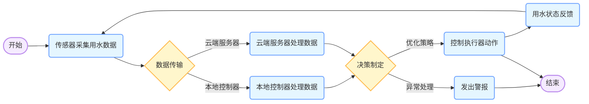

# 智能厨房水槽：AI Agent的用水优化控制

> 关键词：智能厨房水槽、AI Agent、用水优化控制、传感器技术、机器学习算法

> 摘要：本文聚焦于智能厨房水槽中AI Agent的用水优化控制技术。首先介绍了该研究的背景、目的、预期读者和文档结构等信息。接着阐述了核心概念及联系，包括智能厨房水槽和AI Agent的原理与架构。详细讲解了核心算法原理及操作步骤，通过Python代码进行说明，并给出了相关的数学模型和公式。在项目实战部分，给出了开发环境搭建、源代码实现及解读。分析了实际应用场景，推荐了学习资源、开发工具框架和相关论文著作。最后总结了未来发展趋势与挑战，解答了常见问题，并提供了扩展阅读和参考资料，旨在为智能厨房水槽用水优化控制技术的发展提供全面的技术指导和理论支持。

## 1. 背景介绍 
### 1.1 目的和范围
随着全球水资源的日益紧张和人们环保意识的不断提高，如何实现家庭用水的高效利用成为了亟待解决的问题。智能厨房水槽作为家庭用水的重要组成部分，其用水优化控制具有重要的现实意义。本文的目的在于探讨如何利用AI Agent技术实现智能厨房水槽的用水优化控制，通过对水槽用水过程的实时监测和智能决策，降低水资源的浪费，提高用水效率。

本文的研究范围主要涵盖智能厨房水槽用水优化控制的核心概念、算法原理、数学模型、项目实战、实际应用场景以及相关的工具和资源等方面。旨在为相关领域的研究人员、开发者和爱好者提供全面、深入的技术指导和理论支持。

### 1.2 预期读者
本文的预期读者包括但不限于以下几类人群：
- **研究人员**：对智能厨房、人工智能、水资源管理等领域感兴趣的科研工作者，希望通过本文了解智能厨房水槽用水优化控制的最新研究进展和技术方法。
- **开发者**：从事智能硬件开发、软件开发、嵌入式系统开发等相关工作的技术人员，期望借助本文提供的技术方案和代码示例，开发出高效、智能的智能厨房水槽产品。
- **智能家居爱好者**：关注智能家居发展趋势，对智能厨房水槽的用水优化控制功能有兴趣的普通消费者，通过本文可以了解该技术的原理和应用场景，为家庭用水的智能化管理提供参考。
- **水资源管理人员**：负责水资源规划、管理和节约利用的专业人员，通过本文可以了解智能厨房水槽用水优化控制技术在水资源管理中的应用前景和潜力。

### 1.3 文档结构概述
本文将按照以下结构进行组织：
- **核心概念与联系**：介绍智能厨房水槽和AI Agent的核心概念，阐述它们之间的联系，并给出原理和架构的文本示意图及Mermaid流程图。
- **核心算法原理 & 具体操作步骤**：详细讲解实现用水优化控制的核心算法原理，通过Python源代码展示具体的操作步骤。
- **数学模型和公式 & 详细讲解 & 举例说明**：建立用水优化控制的数学模型，给出相关公式，并通过具体例子进行详细讲解。
- **项目实战：代码实际案例和详细解释说明**：介绍项目开发环境的搭建，给出源代码的详细实现和代码解读，分析代码的功能和运行机制。
- **实际应用场景**：探讨智能厨房水槽用水优化控制技术在不同场景下的实际应用。
- **工具和资源推荐**：推荐学习该技术所需的书籍、在线课程、技术博客和网站，以及开发工具框架和相关论文著作。
- **总结：未来发展趋势与挑战**：总结智能厨房水槽用水优化控制技术的发展现状，分析未来的发展趋势和面临的挑战。
- **附录：常见问题与解答**：解答读者在阅读本文过程中可能遇到的常见问题。
- **扩展阅读 & 参考资料**：提供相关的扩展阅读材料和参考资料，方便读者进一步深入研究。

### 1.4 术语表
#### 1.4.1 核心术语定义
- **智能厨房水槽**：集成了传感器、控制器和通信模块等多种技术，能够实时监测水槽的用水状态，并根据用户需求和环境条件进行智能控制的厨房水槽设备。
- **AI Agent**：人工智能代理，是一种能够感知环境、自主决策并执行相应动作的智能实体。在本文中，AI Agent用于实现智能厨房水槽的用水优化控制。
- **用水优化控制**：通过对水槽用水过程的实时监测和分析，运用智能算法和决策策略，实现水资源的合理分配和高效利用，降低水资源浪费的控制方法。
- **传感器技术**：利用各种传感器设备，如水流传感器、水位传感器、温度传感器等，实时采集水槽的用水数据，为用水优化控制提供数据支持的技术。
- **机器学习算法**：一类通过对大量数据进行学习和分析，自动发现数据中的规律和模式，并根据这些规律和模式进行预测和决策的算法。在本文中，机器学习算法用于实现用水行为的预测和优化策略的制定。

#### 1.4.2 相关概念解释
- **物联网（IoT）**：将各种物理设备通过网络连接起来，实现设备之间的信息交互和远程控制的技术。智能厨房水槽作为物联网设备的一种，通过物联网技术与其他设备进行通信和协同工作。
- **云计算**：一种基于互联网的计算模式，通过将计算任务分布在大量的计算机构成的资源池上，使用户可以按需获取计算能力、存储空间和软件服务。在智能厨房水槽用水优化控制中，云计算可以用于数据存储、处理和分析。
- **大数据**：指海量、高增长率和多样化的信息资产，通过对大数据的分析和挖掘，可以发现隐藏在数据中的有价值信息和知识。在智能厨房水槽用水优化控制中，大数据可以用于分析用户的用水习惯和行为模式。

#### 1.4.3 缩略词列表
- **AI**：Artificial Intelligence，人工智能
- **IoT**：Internet of Things，物联网
- **ML**：Machine Learning，机器学习
- **CPU**：Central Processing Unit，中央处理器
- **GPU**：Graphics Processing Unit，图形处理器
- **RAM**：Random Access Memory，随机存取存储器

## 2. 核心概念与联系 
### 核心概念原理
#### 智能厨房水槽原理
智能厨房水槽的核心原理是通过集成多种传感器来实时感知水槽的用水状态。例如，水流传感器可以测量水的流量，水位传感器可以监测水槽内的水位高度，温度传感器可以检测水的温度。这些传感器将采集到的数据传输给控制器，控制器根据预设的规则和算法对数据进行处理和分析，然后控制水泵、水龙头等执行器的开关和调节，以实现对水槽用水的精确控制。

#### AI Agent原理
AI Agent是一种具有自主决策能力的智能实体。它通过感知环境中的信息，对这些信息进行处理和分析，然后根据自身的目标和策略做出决策，并执行相应的动作。在智能厨房水槽用水优化控制中，AI Agent可以根据传感器采集到的用水数据，如流量、水位、温度等，结合用户的用水习惯和环境条件，预测未来的用水需求，并制定最优的用水策略，控制水槽的用水行为。

### 架构的文本示意图
智能厨房水槽的用水优化控制系统主要由以下几个部分组成：
- **传感器层**：包括水流传感器、水位传感器、温度传感器等，负责实时采集水槽的用水数据。
- **数据传输层**：将传感器采集到的数据传输给控制器或云端服务器。可以采用有线或无线通信方式，如以太网、Wi-Fi、蓝牙等。
- **控制器层**：对传感器数据进行处理和分析，根据预设的规则和算法做出决策，控制执行器的动作。可以是嵌入式控制器，如单片机、ARM开发板等，也可以是云端服务器。
- **执行器层**：包括水泵、水龙头等设备，根据控制器的指令执行相应的动作，实现对水槽用水的控制。
- **用户界面层**：为用户提供与智能厨房水槽交互的界面，用户可以通过手机APP、触摸屏等设备查看水槽的用水状态，设置用水参数和策略。

### Mermaid流程图


## 3. 核心算法原理 & 具体操作步骤 
### 核心算法原理
实现智能厨房水槽用水优化控制的核心算法主要包括用水行为预测算法和优化策略制定算法。

#### 用水行为预测算法
用水行为预测算法的目的是根据历史用水数据预测未来的用水需求。常用的方法有时间序列分析、机器学习算法等。例如，我们可以使用基于长短期记忆网络（LSTM）的时间序列预测模型来预测未来的水流量。LSTM是一种特殊的循环神经网络（RNN），能够处理序列数据中的长期依赖关系，非常适合用于时间序列预测。

#### 优化策略制定算法
优化策略制定算法根据用水行为预测结果和用户的用水需求，制定最优的用水策略。常见的优化目标包括最小化用水量、最小化用水成本等。可以使用线性规划、动态规划等优化算法来求解最优策略。例如，我们可以使用线性规划算法来求解在满足用户用水需求的前提下，最小化用水量的用水策略。

### 具体操作步骤及Python源代码
#### 用水行为预测（基于LSTM）
```python
import numpy as np
import pandas as pd
from keras.models import Sequential
from keras.layers import LSTM, Dense

# 生成示例数据
data = np.array([i for i in range(100)])
sequence_length = 10
X = []
y = []
for i in range(len(data) - sequence_length):
    X.append(data[i:i+sequence_length])
    y.append(data[i+sequence_length])
X = np.array(X)
y = np.array(y)

# 划分训练集和测试集
train_size = int(len(X) * 0.8)
X_train, X_test = X[:train_size], X[train_size:]
y_train, y_test = y[:train_size], y[train_size:]

# 调整输入数据的形状以适应LSTM模型
X_train = np.reshape(X_train, (X_train.shape[0], X_train.shape[1], 1))
X_test = np.reshape(X_test, (X_test.shape[0], X_test.shape[1], 1))

# 构建LSTM模型
model = Sequential()
model.add(LSTM(50, input_shape=(sequence_length, 1)))
model.add(Dense(1))
model.compile(optimizer='adam', loss='mse')

# 训练模型
model.fit(X_train, y_train, epochs=100, batch_size=32, verbose=1)

# 进行预测
predictions = model.predict(X_test)
```

#### 优化策略制定（基于线性规划）
```python
from scipy.optimize import linprog

# 定义目标函数系数（最小化用水量）
c = [1]

# 定义不等式约束条件
A_ub = [[-1]]  # 用水需求下限
b_ub = [-10]  # 用水需求下限值
A_eq = None
b_eq = None

# 定义变量的边界
x_bounds = (0, None)

# 求解线性规划问题
res = linprog(c, A_ub=A_ub, b_ub=b_ub, bounds=[x_bounds])

# 输出最优解
print("最优用水量:", res.x[0])
```

## 4. 数学模型和公式 & 详细讲解 & 举例说明 
### 用水行为预测的数学模型
#### 时间序列模型
时间序列模型可以表示为：
$$
y_t = f(y_{t-1}, y_{t-2}, \cdots, y_{t-p}, \epsilon_t)
$$
其中，$y_t$ 表示时间 $t$ 的用水数据（如流量、水位等），$p$ 是时间序列的阶数，$\epsilon_t$ 是随机误差项。

在基于LSTM的时间序列预测模型中，LSTM网络通过学习输入序列 $[y_{t-1}, y_{t-2}, \cdots, y_{t-p}]$ 与输出 $y_t$ 之间的映射关系，来预测未来的用水数据。

### 优化策略制定的数学模型
#### 线性规划模型
线性规划模型的一般形式为：
$$
\begin{aligned}
\min_{x} &\quad c^T x \\
\text{s.t.} &\quad A_{ub} x \leq b_{ub} \\
&\quad A_{eq} x = b_{eq} \\
&\quad l \leq x \leq u
\end{aligned}
$$
其中，$x$ 是决策变量向量，$c$ 是目标函数系数向量，$A_{ub}$ 和 $b_{ub}$ 是不等式约束条件的系数矩阵和常数向量，$A_{eq}$ 和 $b_{eq}$ 是等式约束条件的系数矩阵和常数向量，$l$ 和 $u$ 是变量的上下界。

在智能厨房水槽用水优化控制中，决策变量 $x$ 可以表示用水量，目标函数 $\min_{x} c^T x$ 表示最小化用水量，不等式约束条件 $A_{ub} x \leq b_{ub}$ 可以表示用水需求的上限和下限。

### 举例说明
假设我们要预测未来一天的水流量，历史水流量数据如下：
| 时间 | 水流量（升/分钟） |
| ---- | ---- |
| 1 | 10 |
| 2 | 12 |
| 3 | 15 |
| 4 | 13 |
| 5 | 14 |

我们可以使用基于LSTM的时间序列预测模型来预测第6天的水流量。首先，将历史数据转换为适合LSTM模型输入的格式，然后训练模型并进行预测。

对于优化策略制定，假设用户的用水需求下限为10升，我们要在满足这个需求的前提下最小化用水量。使用线性规划模型，目标函数系数 $c = [1]$，不等式约束条件 $A_{ub} = [[-1]]$，$b_{ub} = [-10]$，通过求解线性规划问题，得到最优用水量。

## 5. 项目实战：代码实际案例和详细解释说明 
### 5.1  开发环境搭建
#### 硬件环境
- **智能厨房水槽**：选择具有传感器接口和控制接口的智能厨房水槽，确保可以连接水流传感器、水位传感器、水泵、水龙头等设备。
- **开发板**：选择一款性能稳定、易于开发的开发板，如树莓派（Raspberry Pi）。树莓派具有丰富的GPIO接口，可以方便地连接传感器和执行器。
- **传感器**：包括水流传感器、水位传感器、温度传感器等，根据实际需求选择合适的传感器型号。
- **执行器**：水泵、水龙头等，选择具有控制接口的执行器，以便实现远程控制。

#### 软件环境
- **操作系统**：在开发板上安装Linux操作系统，如Raspbian。
- **编程语言**：选择Python作为开发语言，Python具有丰富的库和工具，适合用于数据处理、机器学习和硬件控制。
- **开发框架**：使用Flask框架搭建Web服务器，实现与手机APP或网页的通信。使用Keras框架构建LSTM模型，进行用水行为预测。

### 5.2  源代码详细实现和代码解读
#### 传感器数据采集
```python
import RPi.GPIO as GPIO
import time

# 定义水流传感器引脚
FLOW_SENSOR_PIN = 17

# 初始化GPIO
GPIO.setmode(GPIO.BCM)
GPIO.setup(FLOW_SENSOR_PIN, GPIO.IN, pull_up_down=GPIO.PUD_UP)

# 定义全局变量
pulse_count = 0

# 定义中断处理函数
def count_pulses(channel):
    global pulse_count
    pulse_count += 1

# 绑定中断事件
GPIO.add_event_detect(FLOW_SENSOR_PIN, GPIO.FALLING, callback=count_pulses)

try:
    while True:
        # 每隔1秒读取一次脉冲数
        time.sleep(1)
        # 计算水流量
        flow_rate = pulse_count / 7.5  # 假设每7.5个脉冲表示1升水
        print("水流量:", flow_rate, "升/分钟")
        pulse_count = 0
except KeyboardInterrupt:
    print("程序终止")
finally:
    GPIO.cleanup()
```
**代码解读**：
- 首先，导入RPi.GPIO库和time库，用于GPIO控制和时间延迟。
- 定义水流传感器的引脚，并初始化GPIO。
- 定义一个全局变量 `pulse_count` 用于记录脉冲数。
- 定义中断处理函数 `count_pulses`，当水流传感器检测到下降沿时，脉冲数加1。
- 绑定中断事件，当水流传感器引脚状态发生变化时，调用中断处理函数。
- 在主循环中，每隔1秒读取一次脉冲数，并计算水流量。最后，在程序终止时清理GPIO资源。

#### 用水行为预测
```python
import numpy as np
import pandas as pd
from keras.models import load_model

# 加载训练好的LSTM模型
model = load_model('lstm_model.h5')

# 读取历史用水数据
data = pd.read_csv('water_flow_data.csv')
flow_data = data['flow_rate'].values

# 准备输入数据
sequence_length = 10
last_sequence = flow_data[-sequence_length:]
last_sequence = np.reshape(last_sequence, (1, sequence_length, 1))

# 进行预测
prediction = model.predict(last_sequence)
print("预测水流量:", prediction[0][0], "升/分钟")
```
**代码解读**：
- 导入必要的库，包括NumPy、Pandas和Keras。
- 加载训练好的LSTM模型。
- 读取历史用水数据，并提取水流量数据。
- 准备输入数据，取最后10个时间步的水流量数据作为输入。
- 调整输入数据的形状以适应LSTM模型的输入要求。
- 使用加载的模型进行预测，并输出预测结果。

#### 优化策略制定和执行
```python
from scipy.optimize import linprog
import RPi.GPIO as GPIO

# 定义水泵控制引脚
PUMP_PIN = 18

# 初始化GPIO
GPIO.setmode(GPIO.BCM)
GPIO.setup(PUMP_PIN, GPIO.OUT)

# 定义目标函数系数（最小化用水量）
c = [1]

# 定义不等式约束条件
A_ub = [[-1]]  # 用水需求下限
b_ub = [-10]  # 用水需求下限值
A_eq = None
b_eq = None

# 定义变量的边界
x_bounds = (0, None)

# 求解线性规划问题
res = linprog(c, A_ub=A_ub, b_ub=b_ub, bounds=[x_bounds])

# 输出最优解
optimal_flow = res.x[0]
print("最优用水量:", optimal_flow, "升/分钟")

# 根据最优用水量控制水泵
if optimal_flow > 0:
    GPIO.output(PUMP_PIN, GPIO.HIGH)
else:
    GPIO.output(PUMP_PIN, GPIO.LOW)
```
**代码解读**：
- 导入必要的库，包括SciPy的linprog函数和RPi.GPIO库。
- 定义水泵控制引脚，并初始化GPIO。
- 定义线性规划模型的目标函数系数、不等式约束条件和变量边界。
- 使用linprog函数求解线性规划问题，得到最优用水量。
- 根据最优用水量控制水泵的开关状态，如果最优用水量大于0，则打开水泵，否则关闭水泵。

### 5.3  代码解读与分析
#### 传感器数据采集代码分析
该代码通过GPIO中断机制实时采集水流传感器的脉冲数，并根据脉冲数计算水流量。中断处理函数的使用可以确保在传感器状态发生变化时及时响应，提高数据采集的准确性。每隔1秒读取一次脉冲数的时间间隔可以根据实际需求进行调整。

#### 用水行为预测代码分析
该代码使用训练好的LSTM模型对未来的水流量进行预测。通过读取历史用水数据并提取最后10个时间步的数据作为输入，调整输入数据的形状以适应LSTM模型的要求，最后使用模型进行预测。需要注意的是，模型的训练需要使用大量的历史数据，并且需要根据实际情况调整模型的参数。

#### 优化策略制定和执行代码分析
该代码使用线性规划算法求解最优用水量，并根据最优用水量控制水泵的开关状态。线性规划模型的定义需要根据实际的用水需求和约束条件进行调整。在实际应用中，还可以考虑更多的约束条件，如用水成本、用水时间等。

## 6. 实际应用场景 
### 家庭厨房
在家庭厨房中，智能厨房水槽的用水优化控制可以帮助用户合理使用水资源，降低水费支出。例如，通过用水行为预测算法，AI Agent可以根据用户的历史用水习惯预测未来的用水需求，提前调整水龙头的水流大小，避免浪费。同时，在用户洗碗、洗菜等过程中，根据水槽内的水位和水流量，自动控制水泵的开关，确保用水的高效利用。

### 商业厨房
在商业厨房中，如餐厅、酒店等场所，智能厨房水槽的用水优化控制可以显著降低运营成本。商业厨房的用水量大，通过实时监测和优化用水，可以有效减少水资源的浪费。例如，在餐厅高峰期，根据客流量和菜品需求，AI Agent可以动态调整水槽的用水策略，确保满足用水需求的同时，最大限度地节约水资源。

### 公共厨房
在学校、工厂等公共厨房中，智能厨房水槽的用水优化控制可以提高用水管理的效率和公平性。通过对不同区域、不同时间段的用水情况进行监测和分析，AI Agent可以制定合理的用水分配方案，避免个别区域或人员过度用水。同时，在公共厨房的清洁和维护过程中，根据实际需求控制水的使用，提高清洁效果的同时降低用水量。

## 7. 工具和资源推荐
### 7.1 学习资源推荐
#### 7.1.1 书籍推荐
- 《Python机器学习实战》：本书详细介绍了Python在机器学习领域的应用，包括数据预处理、模型选择、评估和优化等方面的内容，适合初学者入门。
- 《深度学习》：由深度学习领域的三位顶级专家Ian Goodfellow、Yoshua Bengio和Aaron Courville撰写，全面介绍了深度学习的基本原理、算法和应用，是深度学习领域的经典著作。
- 《智能硬件开发实战》：本书介绍了智能硬件的开发流程和技术，包括传感器应用、嵌入式系统开发、物联网通信等方面的内容，适合从事智能硬件开发的人员阅读。

#### 7.1.2 在线课程
- Coursera上的“机器学习”课程：由斯坦福大学教授Andrew Ng讲授，是机器学习领域最经典的在线课程之一，涵盖了机器学习的基本概念、算法和应用。
- edX上的“深度学习微硕士项目”：由多个知名高校联合推出，提供了深度学习领域的系统学习课程，包括神经网络、卷积神经网络、循环神经网络等内容。
- 中国大学MOOC上的“物联网技术与应用”课程：介绍了物联网的基本概念、技术体系和应用案例，适合对物联网感兴趣的初学者。

#### 7.1.3 技术博客和网站
- 博客园：国内知名的技术博客平台，有大量关于人工智能、机器学习、智能硬件等领域的技术文章和经验分享。
- Medium：国外知名的技术博客平台，有很多优秀的技术文章和深度分析，涵盖了各个技术领域。
- 开源中国：国内最大的开源技术社区，提供了丰富的开源项目和技术资源，适合开发者交流和学习。

### 7.2 开发工具框架推荐
#### 7.2.1 IDE和编辑器
- PyCharm：一款专门为Python开发设计的集成开发环境，具有代码编辑、调试、版本控制等功能，适合Python开发者使用。
- Visual Studio Code：一款轻量级的代码编辑器，支持多种编程语言，具有丰富的插件扩展功能，适合快速开发和调试。
- Jupyter Notebook：一种交互式的开发环境，适合进行数据分析、机器学习模型的开发和测试，支持Python、R等多种编程语言。

#### 7.2.2 调试和性能分析工具
- pdb：Python自带的调试工具，可以在代码中设置断点，逐行调试代码，方便查找和解决问题。
- TensorBoard：TensorFlow提供的可视化工具，可以用于可视化训练过程中的损失函数、准确率等指标，帮助开发者分析模型的性能。
- cProfile：Python标准库中的性能分析工具，可以统计代码的执行时间和函数调用次数，帮助开发者找出代码中的性能瓶颈。

#### 7.2.3 相关框架和库
- Keras：一个高级神经网络API，支持多种深度学习模型的构建和训练，简单易用，适合初学者快速上手。
- TensorFlow：一个开源的深度学习框架，具有强大的计算能力和丰富的工具集，广泛应用于工业界和学术界。
- Scikit-learn：一个用于机器学习的Python库，提供了丰富的机器学习算法和工具，如分类、回归、聚类等，适合进行数据挖掘和分析。

### 7.3 相关论文著作推荐
#### 7.3.1 经典论文
- “Long Short-Term Memory”：由Sepp Hochreiter和Jürgen Schmidhuber于1997年发表，介绍了长短期记忆网络（LSTM）的基本原理和结构，是LSTM领域的经典论文。
- “Gradient-Based Learning Applied to Document Recognition”：由Yann LeCun等人于1998年发表，介绍了卷积神经网络（CNN）在手写字符识别中的应用，开创了卷积神经网络的先河。
- “Reinforcement Learning: An Introduction”：由Richard S. Sutton和Andrew G. Barto撰写，是强化学习领域的经典教材，全面介绍了强化学习的基本概念、算法和应用。

#### 7.3.2 最新研究成果
- 关注顶级学术会议，如NeurIPS（神经信息处理系统大会）、ICML（国际机器学习会议）、CVPR（计算机视觉与模式识别会议）等，这些会议上会发布人工智能、机器学习等领域的最新研究成果。
- 查阅知名学术期刊，如Journal of Artificial Intelligence Research（JAIR）、Artificial Intelligence等，这些期刊发表了很多高质量的学术论文。

#### 7.3.3 应用案例分析
- 《智能物联网应用案例集》：本书收集了多个智能物联网领域的应用案例，包括智能家居、智能交通、智能医疗等方面，通过实际案例介绍了智能物联网技术的应用场景和实现方法。
- 相关企业的官方网站和技术博客，如谷歌、亚马逊、华为等公司的官方网站，会发布一些关于智能产品和技术的应用案例和技术分享。

## 8. 总结：未来发展趋势与挑战
### 未来发展趋势
#### 智能化程度不断提高
随着人工智能技术的不断发展，智能厨房水槽的智能化程度将不断提高。AI Agent将具备更强的学习和决策能力，能够根据用户的个性化需求和环境变化，实时调整用水策略，实现更加精准的用水优化控制。

#### 与其他智能家居设备的集成
智能厨房水槽将与其他智能家居设备，如智能洗碗机、智能净水器等进行深度集成，实现设备之间的协同工作和信息共享。例如，智能厨房水槽可以根据洗碗机的工作状态自动调整水的供应，提高整体的用水效率。

#### 大数据和云计算的应用
大数据和云计算技术将在智能厨房水槽用水优化控制中得到更广泛的应用。通过收集和分析大量的用水数据，AI Agent可以更好地了解用户的用水习惯和行为模式，提供更加个性化的用水建议和优化策略。同时，云计算可以提供强大的计算能力和存储空间，支持复杂的算法和模型的运行。

#### 环保和节能意识的增强
随着人们环保和节能意识的不断增强，智能厨房水槽的用水优化控制将更加注重环保和节能。未来的智能厨房水槽将采用更加先进的节水技术和材料，进一步降低水资源的消耗，实现可持续发展。

### 挑战
#### 数据安全和隐私问题
智能厨房水槽在运行过程中会收集大量的用户用水数据，这些数据包含了用户的个人信息和用水习惯等敏感信息。因此，如何保障数据的安全和隐私是一个重要的挑战。需要采用先进的加密技术和安全机制，防止数据泄露和滥用。

#### 算法的准确性和可靠性
用水行为预测和优化策略制定的准确性和可靠性直接影响到智能厨房水槽的用水优化效果。由于用水行为受到多种因素的影响，如季节、天气、用户习惯等，如何提高算法的准确性和可靠性是一个亟待解决的问题。需要不断改进算法模型，增加数据量和特征维度，提高模型的泛化能力。

#### 硬件成本和兼容性
智能厨房水槽的硬件设备，如传感器、控制器、执行器等，需要具备高性能和稳定性。然而，目前这些硬件设备的成本较高，限制了智能厨房水槽的普及和推广。同时，不同品牌和型号的硬件设备之间可能存在兼容性问题，需要解决硬件设备的标准化和互操作性问题。

#### 用户接受度和使用习惯
智能厨房水槽作为一种新型的智能家居设备，用户对其功能和操作方式可能存在一定的陌生感和抵触情绪。如何提高用户的接受度，引导用户养成良好的使用习惯，是智能厨房水槽推广应用的关键。需要加强用户教育和培训，提供优质的用户体验和售后服务。

## 9. 附录：常见问题与解答
### 1. 智能厨房水槽的用水优化控制能节约多少水资源？
智能厨房水槽的用水优化控制能节约的水资源量因用户的用水习惯、使用场景等因素而异。一般来说，通过合理的用水策略和智能控制，可以节约10% - 30%的水资源。

### 2. 智能厨房水槽的安装复杂吗？
智能厨房水槽的安装相对传统水槽会复杂一些，需要专业的技术人员进行安装。安装过程中需要连接传感器、控制器、执行器等设备，并进行调试和设置。不过，一些智能厨房水槽产品提供了详细的安装说明和视频教程，也可以通过联系厂家的售后服务人员获得安装指导。

### 3. 智能厨房水槽的维护成本高吗？
智能厨房水槽的维护成本主要包括传感器、控制器等设备的更换和维修费用。一般来说，这些设备的使用寿命较长，只要正常使用和维护，维护成本不会太高。同时，一些厂家提供了质保服务和售后服务，可以降低用户的维护成本。

### 4. 智能厨房水槽的用水优化控制算法会不断更新吗？
是的，随着人工智能技术的不断发展和数据的不断积累，智能厨房水槽的用水优化控制算法会不断更新和优化。厂家会定期对算法进行升级，以提高用水优化控制的效果和性能。

### 5. 智能厨房水槽可以与手机APP连接吗？
大多数智能厨房水槽都支持与手机APP连接。通过手机APP，用户可以实时查看水槽的用水状态，设置用水参数和策略，接收异常警报等信息，实现远程控制和管理。

## 10. 扩展阅读 & 参考资料
### 扩展阅读
- 《智能家居技术与应用》：本书全面介绍了智能家居的技术体系、应用场景和发展趋势，对智能厨房水槽的相关技术和应用有更深入的探讨。
- 《水资源管理与可持续发展》：探讨了水资源管理的理论和方法，以及如何实现水资源的可持续利用，对于理解智能厨房水槽用水优化控制的意义和价值有很大帮助。
- 《人工智能原理与应用》：系统介绍了人工智能的基本原理、算法和应用，有助于读者深入理解AI Agent在智能厨房水槽中的应用原理和技术。

### 参考资料
- 相关的技术标准和规范，如智能家居设备的通信协议标准、传感器的技术标准等。
- 厂家提供的智能厨房水槽产品说明书和技术文档。
- 学术期刊和会议上发表的关于智能厨房、人工智能、水资源管理等领域的研究论文。

作者：AI天才研究院/AI Genius Institute & 禅与计算机程序设计艺术 /Zen And The Art of Computer Programming