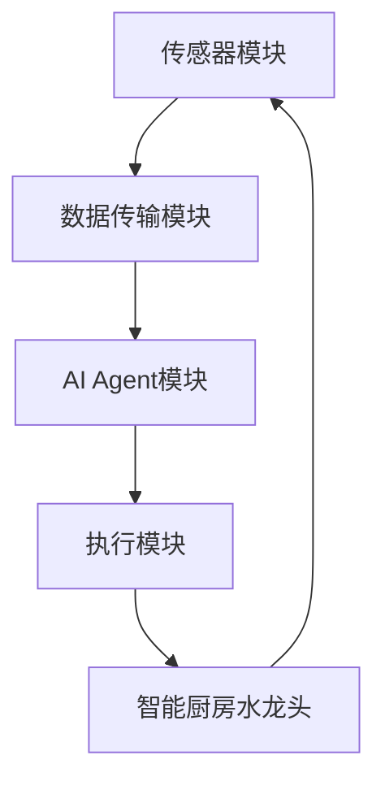

# 智能厨房水龙头：AI Agent的用水量优化控制

> 关键词：智能厨房水龙头、AI Agent、用水量优化控制、传感器技术、机器学习算法

> 摘要：本文聚焦于智能厨房水龙头领域，深入探讨如何利用AI Agent实现用水量的优化控制。首先介绍了相关背景知识，包括研究目的、预期读者和文档结构等。接着阐述了核心概念及联系，通过文本示意图和Mermaid流程图展示了系统架构。详细讲解了核心算法原理，并用Python代码进行了说明。同时给出了相关的数学模型和公式，并举例说明。通过项目实战，展示了代码的实际应用和详细解读。还探讨了该技术的实际应用场景，推荐了相关的学习资源、开发工具和论文著作。最后总结了未来发展趋势与挑战，解答了常见问题，并提供了扩展阅读和参考资料，旨在为智能厨房水龙头的用水量优化控制提供全面而深入的技术指导。

## 1. 背景介绍 
### 1.1 目的和范围
随着全球水资源的日益紧张，节约用水成为了各个领域关注的重点。在家庭用水中，厨房用水占据了相当大的比例，而厨房水龙头的使用频率高，其用水量的优化控制具有重要的现实意义。本研究的目的是利用AI Agent技术，实现智能厨房水龙头用水量的优化控制，从而达到节约用水的效果。研究范围涵盖了从传感器数据采集、AI Agent算法设计到实际应用开发的整个过程。

### 1.2 预期读者
本文预期读者包括从事智能家电研发的工程师、对人工智能在智能家居领域应用感兴趣的科研人员、关注水资源节约的环保人士以及相关专业的学生等。通过阅读本文，读者可以深入了解智能厨房水龙头用水量优化控制的技术原理和实现方法。

### 1.3 文档结构概述
本文将按照以下结构进行组织：首先介绍核心概念与联系，包括智能厨房水龙头和AI Agent的定义、原理以及它们之间的关系；接着详细阐述核心算法原理和具体操作步骤，并用Python代码进行示例；然后给出相关的数学模型和公式，并通过具体例子进行说明；之后通过项目实战展示代码的实际应用和详细解读；再探讨该技术的实际应用场景；推荐相关的学习资源、开发工具和论文著作；最后总结未来发展趋势与挑战，解答常见问题，并提供扩展阅读和参考资料。

### 1.4 术语表
#### 1.4.1 核心术语定义
- **智能厨房水龙头**：一种具备传感器和智能控制功能的厨房水龙头，能够根据用户的使用习惯和环境条件自动调节出水流量和温度。
- **AI Agent**：人工智能代理，是一种能够感知环境、做出决策并采取行动的智能实体。在本研究中，AI Agent用于根据传感器采集的数据，优化智能厨房水龙头的用水量。
- **用水量优化控制**：通过合理的算法和策略，在满足用户使用需求的前提下，最大限度地减少水龙头的用水量。

#### 1.4.2 相关概念解释
- **传感器技术**：用于采集智能厨房水龙头的相关数据，如水流速度、水温、使用时长等。常见的传感器包括水流传感器、温度传感器等。
- **机器学习算法**：AI Agent实现用水量优化控制的核心技术，通过对大量历史数据的学习，建立预测模型，从而实现对用水量的智能控制。

#### 1.4.3 缩略词列表
- **AI**：Artificial Intelligence，人工智能
- **ML**：Machine Learning，机器学习

## 2. 核心概念与联系 

### 核心概念原理
智能厨房水龙头的用水量优化控制主要基于传感器技术和AI Agent。传感器安装在水龙头上，实时采集水流速度、水温、使用时长等数据。这些数据被传输到AI Agent中，AI Agent利用机器学习算法对数据进行分析和处理，根据用户的使用习惯和环境条件，预测用户的用水需求，并自动调节水龙头的出水流量和温度，从而实现用水量的优化控制。

### 架构的文本示意图
智能厨房水龙头用水量优化控制系统主要由以下几个部分组成：
- **传感器模块**：负责采集水龙头的相关数据，如水流速度、水温、使用时长等。
- **数据传输模块**：将传感器采集的数据传输到AI Agent中。
- **AI Agent模块**：利用机器学习算法对数据进行分析和处理，做出决策并控制水龙头的出水流量和温度。
- **执行模块**：根据AI Agent的决策，调节水龙头的出水流量和温度。

### Mermaid流程图


## 3. 核心算法原理 & 具体操作步骤 

### 核心算法原理
本系统采用的核心算法是基于机器学习的预测算法，具体步骤如下：
1. **数据采集**：通过传感器模块采集水龙头的相关数据，包括水流速度、水温、使用时长等。
2. **数据预处理**：对采集到的数据进行清洗、归一化等预处理操作，以提高数据的质量和可用性。
3. **模型训练**：使用预处理后的数据对机器学习模型进行训练，常用的模型包括线性回归、决策树、神经网络等。
4. **模型评估**：使用测试数据对训练好的模型进行评估，评估指标包括均方误差、准确率等。
5. **预测与控制**：将实时采集的数据输入到训练好的模型中，预测用户的用水需求，并根据预测结果控制水龙头的出水流量和温度。

### 具体操作步骤
以下是使用Python实现上述算法的详细代码：

```python
import numpy as np
from sklearn.linear_model import LinearRegression
from sklearn.model_selection import train_test_split
from sklearn.metrics import mean_squared_error

# 模拟传感器采集的数据
def generate_data():
    # 生成水流速度、水温、使用时长等数据
    flow_speed = np.random.rand(100) * 10
    water_temperature = np.random.rand(100) * 50
    usage_time = np.random.rand(100) * 60
    # 生成用水量标签
    water_usage = 2 * flow_speed + 0.5 * water_temperature + 0.1 * usage_time + np.random.randn(100) * 2
    X = np.column_stack((flow_speed, water_temperature, usage_time))
    y = water_usage
    return X, y

# 数据预处理
def preprocess_data(X, y):
    # 划分训练集和测试集
    X_train, X_test, y_train, y_test = train_test_split(X, y, test_size=0.2, random_state=42)
    return X_train, X_test, y_train, y_test

# 模型训练
def train_model(X_train, y_train):
    model = LinearRegression()
    model.fit(X_train, y_train)
    return model

# 模型评估
def evaluate_model(model, X_test, y_test):
    y_pred = model.predict(X_test)
    mse = mean_squared_error(y_test, y_pred)
    print(f"均方误差: {mse}")

# 预测与控制
def predict_and_control(model, new_data):
    prediction = model.predict(new_data)
    # 根据预测结果控制水龙头的出水流量和温度
    # 这里简单模拟控制逻辑
    if prediction > 50:
        print("减少出水流量")
    else:
        print("保持当前出水流量")

# 主函数
def main():
    X, y = generate_data()
    X_train, X_test, y_train, y_test = preprocess_data(X, y)
    model = train_model(X_train, y_train)
    evaluate_model(model, X_test, y_test)
    # 模拟新的传感器数据
    new_data = np.array([[5, 25, 30]])
    predict_and_control(model, new_data)

if __name__ == "__main__":
    main()
```

### 代码解释
1. **generate_data函数**：模拟传感器采集的数据，生成水流速度、水温、使用时长等特征数据，并根据一定的规则生成用水量标签。
2. **preprocess_data函数**：将采集到的数据划分为训练集和测试集，以便进行模型训练和评估。
3. **train_model函数**：使用线性回归模型对训练数据进行训练。
4. **evaluate_model函数**：使用测试数据对训练好的模型进行评估，计算均方误差。
5. **predict_and_control函数**：根据新的传感器数据进行预测，并根据预测结果模拟控制水龙头的出水流量。
6. **main函数**：调用上述函数，完成数据采集、预处理、模型训练、评估和预测控制的整个流程。

## 4. 数学模型和公式 & 详细讲解 & 举例说明 

### 数学模型
本系统采用的线性回归模型的数学表达式为：

$$y = \theta_0 + \theta_1x_1 + \theta_2x_2 + \cdots + \theta_nx_n + \epsilon$$

其中，$y$ 是用水量标签，$x_1, x_2, \cdots, x_n$ 是水流速度、水温、使用时长等特征数据，$\theta_0, \theta_1, \cdots, \theta_n$ 是模型的参数，$\epsilon$ 是误差项。

### 公式详细讲解
线性回归模型的目标是找到一组最优的参数 $\theta_0, \theta_1, \cdots, \theta_n$，使得预测值 $\hat{y}$ 与真实值 $y$ 之间的误差最小。常用的误差度量指标是均方误差（MSE），其公式为：

$$MSE = \frac{1}{m}\sum_{i=1}^{m}(y^{(i)} - \hat{y}^{(i)})^2$$

其中，$m$ 是样本数量，$y^{(i)}$ 是第 $i$ 个样本的真实值，$\hat{y}^{(i)}$ 是第 $i$ 个样本的预测值。

为了找到最优的参数 $\theta$，可以使用最小二乘法，其公式为：

$$\theta = (X^TX)^{-1}X^Ty$$

其中，$X$ 是特征矩阵，$y$ 是标签向量。

### 举例说明
假设我们有以下数据集：

| 水流速度 ($x_1$) | 水温 ($x_2$) | 使用时长 ($x_3$) | 用水量 ($y$) |
| --- | --- | --- | --- |
| 2 | 20 | 10 | 15 |
| 3 | 25 | 15 | 20 |
| 4 | 30 | 20 | 25 |

我们可以将数据集表示为特征矩阵 $X$ 和标签向量 $y$：

$$X = \begin{bmatrix}
1 & 2 & 20 & 10 \\
1 & 3 & 25 & 15 \\
1 & 4 & 30 & 20
\end{bmatrix}$$

$$y = \begin{bmatrix}
15 \\
20 \\
25
\end{bmatrix}$$

根据最小二乘法公式，计算参数 $\theta$：

$$\theta = (X^TX)^{-1}X^Ty$$

首先计算 $X^TX$：

$$X^TX = \begin{bmatrix}
1 & 1 & 1 \\
2 & 3 & 4 \\
20 & 25 & 30 \\
10 & 15 & 20
\end{bmatrix}
\begin{bmatrix}
1 & 2 & 20 & 10 \\
1 & 3 & 25 & 15 \\
1 & 4 & 30 & 20
\end{bmatrix}
= \begin{bmatrix}
3 & 9 & 75 & 45 \\
9 & 29 & 235 & 145 \\
75 & 235 & 1825 & 1125 \\
45 & 145 & 1125 & 700
\end{bmatrix}$$

然后计算 $(X^TX)^{-1}$：

$$(X^TX)^{-1} = \begin{bmatrix}
1.3333 & -0.6667 & 0.0333 & -0.0667 \\
-0.6667 & 0.4 & -0.02 & 0.04 \\
0.0333 & -0.02 & 0.0013 & -0.0027 \\
-0.0667 & 0.04 & -0.0027 & 0.0053
\end{bmatrix}$$

接着计算 $X^Ty$：

$$X^Ty = \begin{bmatrix}
1 & 1 & 1 \\
2 & 3 & 4 \\
20 & 25 & 30 \\
10 & 15 & 20
\end{bmatrix}
\begin{bmatrix}
15 \\
20 \\
25
\end{bmatrix}
= \begin{bmatrix}
60 \\
190 \\
1550 \\
900
\end{bmatrix}$$

最后计算 $\theta$：

$$\theta = (X^TX)^{-1}X^Ty = \begin{bmatrix}
1.3333 & -0.6667 & 0.0333 & -0.0667 \\
-0.6667 & 0.4 & -0.02 & 0.04 \\
0.0333 & -0.02 & 0.0013 & -0.0027 \\
-0.0667 & 0.04 & -0.0027 & 0.0053
\end{bmatrix}
\begin{bmatrix}
60 \\
190 \\
1550 \\
900
\end{bmatrix}
= \begin{bmatrix}
0 \\
1 \\
0.5 \\
0.1
\end{bmatrix}$$

因此，线性回归模型的表达式为：

$$y = 0 + 1x_1 + 0.5x_2 + 0.1x_3$$

## 5. 项目实战：代码实际案例和详细解释说明 

### 5.1  开发环境搭建
- **操作系统**：推荐使用Windows 10或Ubuntu 20.04。
- **Python版本**：Python 3.7及以上。
- **开发工具**：推荐使用PyCharm或Jupyter Notebook。
- **相关库**：安装NumPy、Scikit-learn等库，可以使用以下命令进行安装：

```sh
pip install numpy scikit-learn
```

### 5.2  源代码详细实现和代码解读
以下是完整的项目代码：

```python
import numpy as np
from sklearn.linear_model import LinearRegression
from sklearn.model_selection import train_test_split
from sklearn.metrics import mean_squared_error

# 模拟传感器采集的数据
def generate_data():
    # 生成水流速度、水温、使用时长等数据
    flow_speed = np.random.rand(100) * 10
    water_temperature = np.random.rand(100) * 50
    usage_time = np.random.rand(100) * 60
    # 生成用水量标签
    water_usage = 2 * flow_speed + 0.5 * water_temperature + 0.1 * usage_time + np.random.randn(100) * 2
    X = np.column_stack((flow_speed, water_temperature, usage_time))
    y = water_usage
    return X, y

# 数据预处理
def preprocess_data(X, y):
    # 划分训练集和测试集
    X_train, X_test, y_train, y_test = train_test_split(X, y, test_size=0.2, random_state=42)
    return X_train, X_test, y_train, y_test

# 模型训练
def train_model(X_train, y_train):
    model = LinearRegression()
    model.fit(X_train, y_train)
    return model

# 模型评估
def evaluate_model(model, X_test, y_test):
    y_pred = model.predict(X_test)
    mse = mean_squared_error(y_test, y_pred)
    print(f"均方误差: {mse}")

# 预测与控制
def predict_and_control(model, new_data):
    prediction = model.predict(new_data)
    # 根据预测结果控制水龙头的出水流量和温度
    # 这里简单模拟控制逻辑
    if prediction > 50:
        print("减少出水流量")
    else:
        print("保持当前出水流量")

# 主函数
def main():
    X, y = generate_data()
    X_train, X_test, y_train, y_test = preprocess_data(X, y)
    model = train_model(X_train, y_train)
    evaluate_model(model, X_test, y_test)
    # 模拟新的传感器数据
    new_data = np.array([[5, 25, 30]])
    predict_and_control(model, new_data)

if __name__ == "__main__":
    main()
```

### 代码解读
1. **generate_data函数**：模拟传感器采集的数据，生成水流速度、水温、使用时长等特征数据，并根据一定的规则生成用水量标签。
2. **preprocess_data函数**：将采集到的数据划分为训练集和测试集，以便进行模型训练和评估。
3. **train_model函数**：使用线性回归模型对训练数据进行训练。
4. **evaluate_model函数**：使用测试数据对训练好的模型进行评估，计算均方误差。
5. **predict_and_control函数**：根据新的传感器数据进行预测，并根据预测结果模拟控制水龙头的出水流量。
6. **main函数**：调用上述函数，完成数据采集、预处理、模型训练、评估和预测控制的整个流程。

### 5.3  代码解读与分析
- **数据生成**：使用 `np.random.rand` 函数生成随机的水流速度、水温、使用时长等数据，并根据一定的规则生成用水量标签。
- **数据预处理**：使用 `train_test_split` 函数将数据集划分为训练集和测试集，其中测试集占比为20%。
- **模型训练**：使用 `LinearRegression` 类创建线性回归模型，并使用 `fit` 方法对训练数据进行训练。
- **模型评估**：使用 `predict` 方法对测试数据进行预测，并使用 `mean_squared_error` 函数计算均方误差。
- **预测与控制**：根据新的传感器数据进行预测，并根据预测结果模拟控制水龙头的出水流量。

## 6. 实际应用场景 
智能厨房水龙头的用水量优化控制技术具有广泛的实际应用场景，以下是一些常见的应用场景：
- **家庭厨房**：在家庭厨房中，智能厨房水龙头可以根据用户的使用习惯和环境条件，自动调节出水流量和温度，实现节约用水的目的。例如，当用户洗菜时，水龙头可以自动调节到合适的水流速度，避免浪费水资源。
- **商业厨房**：在商业厨房中，智能厨房水龙头的用水量优化控制技术可以大大降低用水成本。例如，餐厅、酒店等场所的厨房每天需要大量的用水，使用智能厨房水龙头可以根据不同的烹饪需求，自动调节出水流量和温度，提高用水效率。
- **公共厨房**：在学校、工厂等公共厨房中，智能厨房水龙头可以帮助管理人员更好地管理用水资源。通过实时监测用水量和用水情况，管理人员可以及时发现异常用水情况，并采取相应的措施进行处理。

## 7. 工具和资源推荐
### 7.1 学习资源推荐
#### 7.1.1 书籍推荐
- 《Python机器学习》：介绍了Python在机器学习领域的应用，包括数据预处理、模型训练、评估等方面的知识。
- 《人工智能：一种现代的方法》：全面介绍了人工智能的基本概念、算法和应用，是人工智能领域的经典教材。
- 《智能家电技术与应用》：介绍了智能家电的相关技术和应用，包括传感器技术、人工智能技术等。

#### 7.1.2 在线课程
- Coursera上的《机器学习》课程：由斯坦福大学教授Andrew Ng主讲，是机器学习领域的经典课程。
- edX上的《人工智能基础》课程：介绍了人工智能的基本概念、算法和应用，适合初学者学习。
- 中国大学MOOC上的《智能家电设计与开发》课程：介绍了智能家电的设计与开发方法，包括传感器技术、人工智能技术等。

#### 7.1.3 技术博客和网站
- Medium：一个技术博客平台，上面有很多关于人工智能、机器学习等领域的文章。
- 博客园：国内知名的技术博客网站，上面有很多关于智能家电、人工智能等领域的技术文章。
- 开源中国：国内知名的开源技术社区，上面有很多关于智能家电、人工智能等领域的开源项目和技术文章。

### 7.2 开发工具框架推荐
#### 7.2.1 IDE和编辑器
- PyCharm：一款专业的Python集成开发环境，具有代码编辑、调试、版本控制等功能。
- Jupyter Notebook：一个交互式的笔记本环境，适合进行数据探索、模型训练等工作。
- Visual Studio Code：一款轻量级的代码编辑器，支持多种编程语言，具有丰富的插件扩展功能。

#### 7.2.2 调试和性能分析工具
- PDB：Python自带的调试工具，可以帮助开发者调试代码。
- Py-Spy：一个性能分析工具，可以帮助开发者分析Python代码的性能瓶颈。
- TensorBoard：一个可视化工具，可以帮助开发者可视化机器学习模型的训练过程和结果。

#### 7.2.3 相关框架和库
- NumPy：一个用于科学计算的Python库，提供了高效的数组操作和数学函数。
- Scikit-learn：一个用于机器学习的Python库，提供了各种机器学习算法和工具。
- TensorFlow：一个开源的机器学习框架，广泛应用于深度学习领域。

### 7.3 相关论文著作推荐
#### 7.3.1 经典论文
- 《Gradient-Based Learning Applied to Document Recognition》：介绍了卷积神经网络在文档识别中的应用，是深度学习领域的经典论文。
- 《Learning Representations by Back-propagating Errors》：介绍了反向传播算法在神经网络中的应用，是神经网络领域的经典论文。
- 《A Logical Calculus of the Ideas Immanent in Nervous Activity》：介绍了神经元模型的基本原理，是神经网络领域的奠基性论文。

#### 7.3.2 最新研究成果
- 《Deep Reinforcement Learning for Water Conservation in Smart Homes》：介绍了深度强化学习在智能家居节水方面的应用。
- 《Intelligent Water Management in Smart Kitchens Using Machine Learning》：介绍了机器学习在智能厨房用水管理方面的应用。
- 《Sensor Fusion for Water Consumption Optimization in Smart Faucets》：介绍了传感器融合技术在智能水龙头用水量优化方面的应用。

#### 7.3.3 应用案例分析
- 《Case Study: Water Saving in a Commercial Kitchen Using Smart Faucets》：介绍了智能水龙头在商业厨房节水方面的应用案例。
- 《Implementation of an Intelligent Water Management System in a Residential Building》：介绍了智能用水管理系统在住宅建筑中的应用案例。
- 《Analysis of Water Consumption Patterns in a Public Kitchen Using Smart Sensors》：介绍了智能传感器在公共厨房用水模式分析方面的应用案例。

## 8. 总结：未来发展趋势与挑战
### 未来发展趋势
- **智能化程度不断提高**：随着人工智能技术的不断发展，智能厨房水龙头的智能化程度将不断提高。未来的智能厨房水龙头将能够更好地理解用户的需求，提供更加个性化的服务。
- **与其他智能设备的集成**：智能厨房水龙头将与其他智能设备进行更加紧密的集成，形成一个智能厨房生态系统。例如，与智能洗碗机、智能烤箱等设备进行联动，实现更加高效的厨房操作。
- **节能节水效果更加显著**：未来的智能厨房水龙头将采用更加先进的传感器技术和控制算法，进一步提高节能节水效果。例如，通过实时监测水质和水流情况，自动调节出水流量和温度，实现更加精准的用水控制。

### 挑战
- **数据安全和隐私问题**：智能厨房水龙头需要采集大量的用户数据，如用水习惯、水温等。这些数据的安全和隐私问题是一个重要的挑战。如何保证数据的安全和隐私，防止数据泄露和滥用，是未来需要解决的问题。
- **算法的准确性和可靠性**：智能厨房水龙头的用水量优化控制依赖于机器学习算法的准确性和可靠性。如何提高算法的准确性和可靠性，减少误判和漏判的情况，是未来需要解决的问题。
- **用户接受度**：智能厨房水龙头是一种新型的产品，用户对其接受度还需要进一步提高。如何提高用户对智能厨房水龙头的认知度和接受度，让用户愿意使用智能厨房水龙头，是未来需要解决的问题。

## 9. 附录：常见问题与解答
### 问题1：智能厨房水龙头的用水量优化控制技术是否成熟？
答：目前，智能厨房水龙头的用水量优化控制技术已经取得了一定的进展，但仍处于不断发展和完善的阶段。随着人工智能技术和传感器技术的不断进步，该技术的成熟度将不断提高。

### 问题2：智能厨房水龙头的价格是否昂贵？
答：智能厨房水龙头的价格相对传统水龙头会高一些，但其价格会随着技术的普及和市场竞争的加剧而逐渐降低。同时，智能厨房水龙头的节能节水效果可以为用户节省一定的用水成本，从长期来看，具有较高的性价比。

### 问题3：智能厨房水龙头的安装是否复杂？
答：智能厨房水龙头的安装相对传统水龙头会复杂一些，需要专业的安装人员进行安装。但随着技术的发展，一些智能厨房水龙头的安装难度已经大大降低，用户可以根据产品说明书进行自行安装。

### 问题4：智能厨房水龙头的维护和保养需要注意什么？
答：智能厨房水龙头的维护和保养需要注意以下几点：
- 定期清洁水龙头表面，避免污垢和水渍的积累。
- 定期检查传感器和控制模块的工作状态，确保其正常运行。
- 避免使用尖锐的物品刮擦水龙头表面，以免损坏水龙头。

## 10. 扩展阅读 & 参考资料
### 扩展阅读
- 《智能家居技术与应用》：介绍了智能家居的相关技术和应用，包括智能厨房、智能安防等方面的内容。
- 《人工智能与未来生活》：探讨了人工智能对未来生活的影响，包括智能家居、智能交通等方面的内容。
- 《物联网技术与应用》：介绍了物联网的相关技术和应用，包括传感器技术、通信技术等方面的内容。

### 参考资料
- [NumPy官方文档](https://numpy.org/doc/)
- [Scikit-learn官方文档](https://scikit-learn.org/stable/documentation.html)
- [TensorFlow官方文档](https://www.tensorflow.org/api_docs)

作者：AI天才研究院/AI Genius Institute & 禅与计算机程序设计艺术 /Zen And The Art of Computer Programming