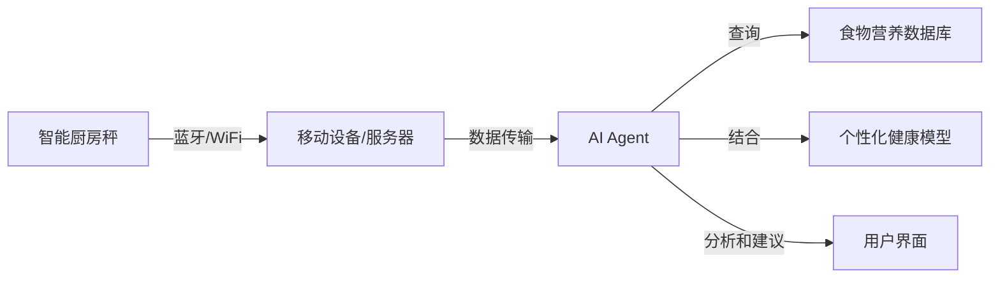

# 智能厨房秤：AI Agent的营养摄入分析与建议

> 关键词：智能厨房秤、AI Agent、营养摄入分析、营养建议、健康管理

> 摘要：本文围绕智能厨房秤结合AI Agent实现营养摄入分析与建议展开。首先介绍了该技术的背景，包括目的、预期读者等。详细阐述了核心概念及联系，给出原理和架构的示意图与流程图。深入讲解了核心算法原理及操作步骤，并通过Python代码进行说明。运用数学模型和公式对营养分析进行量化，结合实际案例展示代码实现及解读。探讨了该技术在健康管理、饮食规划等方面的实际应用场景。推荐了相关的学习资源、开发工具和论文著作。最后总结了未来发展趋势与挑战，还提供了常见问题解答和扩展阅读参考资料，旨在为读者全面呈现智能厨房秤与AI Agent在营养领域的应用。

## 1. 背景介绍 
### 1.1 目的和范围
随着人们对健康生活的关注度不断提高，合理的营养摄入成为维持身体健康的关键因素。传统的厨房秤仅能测量食材的重量，无法提供关于食材营养成分以及个人营养摄入情况的信息。智能厨房秤结合AI Agent技术，旨在为用户提供更加全面、个性化的营养摄入分析和建议。本文章的范围涵盖了智能厨房秤与AI Agent结合的核心原理、算法实现、实际应用场景等方面，帮助读者深入了解该技术如何助力健康饮食管理。

### 1.2 预期读者
本文预期读者包括对健康饮食管理感兴趣的普通消费者，希望了解智能厨房秤如何帮助他们更好地控制营养摄入；软件开发人员和技术爱好者，关注智能硬件与AI技术结合的实现方式和开发思路；以及健康管理领域的专业人士，探索利用新技术提升营养评估和建议的精准度。

### 1.3 文档结构概述
本文将按照以下结构进行阐述：首先介绍核心概念与联系，让读者了解智能厨房秤和AI Agent在营养分析中的作用和相互关系；接着详细讲解核心算法原理及具体操作步骤，并给出Python代码示例；然后通过数学模型和公式对营养分析进行量化；再通过项目实战展示代码的实际应用和详细解释；之后探讨该技术的实际应用场景；推荐相关的工具和资源；最后总结未来发展趋势与挑战，提供常见问题解答和扩展阅读参考资料。

### 1.4 术语表
#### 1.4.1 核心术语定义
- **智能厨房秤**：具备数据传输和处理功能的厨房秤，能够与其他设备进行通信，将测量的食材重量信息传输给AI Agent进行分析。
- **AI Agent**：人工智能代理，是一种能够感知环境、做出决策并采取行动的智能实体。在本文中，AI Agent接收智能厨房秤传来的食材重量信息，结合数据库中的营养数据进行分析，并给出营养摄入建议。
- **营养摄入分析**：对个体在一定时间内摄入的各种营养素（如蛋白质、脂肪、碳水化合物、维生素、矿物质等）的量进行计算和评估，以判断其是否符合健康标准。
- **营养建议**：根据营养摄入分析结果，为个体提供的关于饮食调整的具体建议，包括食物种类、摄入量等方面的指导。

#### 1.4.2 相关概念解释
- **食物营养数据库**：存储各种食物营养成分信息的数据库，包括每种食物每100克所含的蛋白质、脂肪、碳水化合物、维生素、矿物质等营养素的含量。AI Agent通过查询该数据库，结合智能厨房秤测量的食材重量，计算出个体的营养摄入情况。
- **个性化健康模型**：根据个体的年龄、性别、身高、体重、身体活动水平等因素建立的健康模型，用于确定个体的营养需求和健康目标。AI Agent结合个性化健康模型，为用户提供更加精准的营养建议。

#### 1.4.3 缩略词列表
- **AI**：Artificial Intelligence，人工智能
- **BMI**：Body Mass Index，身体质量指数

## 2. 核心概念与联系 

### 核心概念原理
智能厨房秤与AI Agent结合的核心原理是通过智能厨房秤获取食材的重量信息，将其传输给AI Agent。AI Agent根据这些重量信息，查询食物营养数据库，计算出用户摄入的各种营养素的量。同时，AI Agent结合用户的个性化健康模型，对营养摄入情况进行评估，判断是否满足用户的营养需求。如果不满足，AI Agent会根据评估结果给出相应的营养建议，帮助用户调整饮食结构，实现健康的营养摄入。

### 架构的文本示意图
```plaintext
智能厨房秤 <---- 蓝牙/WiFi ----> 移动设备/服务器
移动设备/服务器 <---- 数据传输 ----> AI Agent
AI Agent <---- 查询 ----> 食物营养数据库
AI Agent <---- 结合 ----> 个性化健康模型
AI Agent ---- 分析和建议 ----> 用户界面
```

### Mermaid流程图


## 3. 核心算法原理 & 具体操作步骤 

### 核心算法原理
核心算法主要包括以下几个步骤：
1. **数据收集**：智能厨房秤测量食材的重量，并将数据传输给AI Agent。
2. **营养成分计算**：AI Agent根据食材重量和食物营养数据库，计算出用户摄入的各种营养素的量。
3. **营养评估**：AI Agent结合用户的个性化健康模型，对营养摄入情况进行评估，判断是否满足用户的营养需求。
4. **建议生成**：如果营养摄入不满足需求，AI Agent根据评估结果生成相应的营养建议。

### 具体操作步骤及Python代码实现

```python
# 模拟食物营养数据库
food_nutrition_db = {
    "苹果": {
        "蛋白质": 0.3,
        "脂肪": 0.2,
        "碳水化合物": 13.8,
        "维生素C": 4.6
    },
    "鸡蛋": {
        "蛋白质": 13.3,
        "脂肪": 8.8,
        "碳水化合物": 2.8,
        "维生素A": 234
    }
}

# 模拟个性化健康模型
def personalized_health_model(age, gender, height, weight, activity_level):
    # 这里简单返回一个示例的营养需求，实际中需要更复杂的计算
    if gender == "男":
        protein_need = 60
        fat_need = 50
        carb_need = 300
    else:
        protein_need = 50
        fat_need = 40
        carb_need = 250
    return {
        "蛋白质": protein_need,
        "脂肪": fat_need,
        "碳水化合物": carb_need
    }

# 营养成分计算函数
def calculate_nutrition(food_weight_dict):
    total_nutrition = {
        "蛋白质": 0,
        "脂肪": 0,
        "碳水化合物": 0
    }
    for food, weight in food_weight_dict.items():
        if food in food_nutrition_db:
            for nutrient, value in food_nutrition_db[food].items():
                if nutrient in total_nutrition:
                    total_nutrition[nutrient] += value * weight / 100
    return total_nutrition

# 营养评估函数
def evaluate_nutrition(total_nutrition, health_need):
    evaluation = {}
    for nutrient, value in total_nutrition.items():
        if value < health_need[nutrient]:
            evaluation[nutrient] = "不足"
        elif value > health_need[nutrient]:
            evaluation[nutrient] = "过量"
        else:
            evaluation[nutrient] = "合适"
    return evaluation

# 建议生成函数
def generate_suggestion(evaluation, health_need, total_nutrition):
    suggestions = []
    for nutrient, status in evaluation.items():
        if status == "不足":
            deficit = health_need[nutrient] - total_nutrition[nutrient]
            if nutrient == "蛋白质":
                # 假设鸡蛋是补充蛋白质的良好来源
                egg_weight = deficit / food_nutrition_db["鸡蛋"]["蛋白质"] * 100
                suggestions.append(f"建议补充约{egg_weight:.2f}克鸡蛋以增加{nutrient}摄入")
            elif nutrient == "碳水化合物":
                # 假设米饭是补充碳水化合物的良好来源
                # 这里简单假设米饭每100克含碳水化合物77克
                rice_weight = deficit / 77 * 100
                suggestions.append(f"建议补充约{rice_weight:.2f}克米饭以增加{nutrient}摄入")
    return suggestions

# 主函数
def main():
    # 模拟智能厨房秤测量的食材重量
    food_weight_dict = {
        "苹果": 200,
        "鸡蛋": 100
    }
    # 模拟用户信息
    age = 30
    gender = "男"
    height = 175
    weight = 70
    activity_level = "中等"
    # 计算营养需求
    health_need = personalized_health_model(age, gender, height, weight, activity_level)
    # 计算营养摄入
    total_nutrition = calculate_nutrition(food_weight_dict)
    # 评估营养摄入
    evaluation = evaluate_nutrition(total_nutrition, health_need)
    # 生成建议
    suggestions = generate_suggestion(evaluation, health_need, total_nutrition)

    print("营养需求：", health_need)
    print("营养摄入：", total_nutrition)
    print("营养评估：", evaluation)
    print("营养建议：", suggestions)

if __name__ == "__main__":
    main()
```

## 4. 数学模型和公式 & 详细讲解 & 举例说明 

### 营养成分计算
设某食材 $i$ 的重量为 $w_i$（单位：克），该食材每100克中营养素 $j$ 的含量为 $n_{ij}$（单位：克或毫克等），则摄入该食材所获得的营养素 $j$ 的量 $N_j$ 可以通过以下公式计算：

$$N_j=\sum_{i = 1}^{m}\frac{w_i\times n_{ij}}{100}$$

其中 $m$ 为摄入的食材种类数。

例如，用户摄入了200克苹果和100克鸡蛋，苹果每100克含蛋白质0.3克，鸡蛋每100克含蛋白质13.3克，则摄入的蛋白质总量为：

$$N_{蛋白质}=\frac{200\times0.3}{100}+\frac{100\times13.3}{100}=0.6 + 13.3 = 13.9\text{克}$$

### 营养评估
设个体对营养素 $j$ 的需求为 $R_j$，实际摄入的营养素 $j$ 的量为 $N_j$，则营养评估可以通过比较 $N_j$ 和 $R_j$ 来进行：
- 当 $N_j < R_j$ 时，营养素 $j$ 摄入不足；
- 当 $N_j > R_j$ 时，营养素 $j$ 摄入过量；
- 当 $N_j = R_j$ 时，营养素 $j$ 摄入合适。

### 建议生成
如果某种营养素 $j$ 摄入不足，设其缺口为 $\Delta N_j=R_j - N_j$。若有食物 $k$ 是补充该营养素的良好来源，其每100克中营养素 $j$ 的含量为 $n_{kj}$，则需要补充该食物的重量 $W_k$ 可以通过以下公式计算：

$$W_k=\frac{\Delta N_j}{n_{kj}}\times100$$

例如，若用户蛋白质摄入不足，缺口为5克，鸡蛋每100克含蛋白质13.3克，则需要补充鸡蛋的重量为：

$$W_{鸡蛋}=\frac{5}{13.3}\times100\approx37.59\text{克}$$

## 5. 项目实战：代码实际案例和详细解释说明 

### 5.1  开发环境搭建
#### 硬件环境
- **智能厨房秤**：选择支持蓝牙或WiFi通信的智能厨房秤，确保能够将测量数据传输到移动设备或服务器。
- **移动设备**：如智能手机或平板电脑，用于接收智能厨房秤的数据，并与AI Agent进行交互。
- **服务器**：如果需要处理大量数据或提供更强大的计算能力，可以使用云服务器。

#### 软件环境
- **操作系统**：移动设备可以使用iOS或Android系统，服务器可以使用Linux系统。
- **开发语言**：Python是一个不错的选择，因为它具有丰富的库和易于学习的语法。
- **开发框架**：可以使用Flask或Django等Web框架来搭建服务器端应用，使用React Native或Flutter等框架来开发移动应用。

### 5.2  源代码详细实现和代码解读

```python
# 模拟食物营养数据库
food_nutrition_db = {
    "苹果": {
        "蛋白质": 0.3,
        "脂肪": 0.2,
        "碳水化合物": 13.8,
        "维生素C": 4.6
    },
    "鸡蛋": {
        "蛋白质": 13.3,
        "脂肪": 8.8,
        "碳水化合物": 2.8,
        "维生素A": 234
    }
}

# 模拟个性化健康模型
def personalized_health_model(age, gender, height, weight, activity_level):
    # 这里简单返回一个示例的营养需求，实际中需要更复杂的计算
    if gender == "男":
        protein_need = 60
        fat_need = 50
        carb_need = 300
    else:
        protein_need = 50
        fat_need = 40
        carb_need = 250
    return {
        "蛋白质": protein_need,
        "脂肪": fat_need,
        "碳水化合物": carb_need
    }

# 营养成分计算函数
def calculate_nutrition(food_weight_dict):
    total_nutrition = {
        "蛋白质": 0,
        "脂肪": 0,
        "碳水化合物": 0
    }
    for food, weight in food_weight_dict.items():
        if food in food_nutrition_db:
            for nutrient, value in food_nutrition_db[food].items():
                if nutrient in total_nutrition:
                    total_nutrition[nutrient] += value * weight / 100
    return total_nutrition

# 营养评估函数
def evaluate_nutrition(total_nutrition, health_need):
    evaluation = {}
    for nutrient, value in total_nutrition.items():
        if value < health_need[nutrient]:
            evaluation[nutrient] = "不足"
        elif value > health_need[nutrient]:
            evaluation[nutrient] = "过量"
        else:
            evaluation[nutrient] = "合适"
    return evaluation

# 建议生成函数
def generate_suggestion(evaluation, health_need, total_nutrition):
    suggestions = []
    for nutrient, status in evaluation.items():
        if status == "不足":
            deficit = health_need[nutrient] - total_nutrition[nutrient]
            if nutrient == "蛋白质":
                # 假设鸡蛋是补充蛋白质的良好来源
                egg_weight = deficit / food_nutrition_db["鸡蛋"]["蛋白质"] * 100
                suggestions.append(f"建议补充约{egg_weight:.2f}克鸡蛋以增加{nutrient}摄入")
            elif nutrient == "碳水化合物":
                # 假设米饭是补充碳水化合物的良好来源
                # 这里简单假设米饭每100克含碳水化合物77克
                rice_weight = deficit / 77 * 100
                suggestions.append(f"建议补充约{rice_weight:.2f}克米饭以增加{nutrient}摄入")
    return suggestions

# 主函数
def main():
    # 模拟智能厨房秤测量的食材重量
    food_weight_dict = {
        "苹果": 200,
        "鸡蛋": 100
    }
    # 模拟用户信息
    age = 30
    gender = "男"
    height = 175
    weight = 70
    activity_level = "中等"
    # 计算营养需求
    health_need = personalized_health_model(age, gender, height, weight, activity_level)
    # 计算营养摄入
    total_nutrition = calculate_nutrition(food_weight_dict)
    # 评估营养摄入
    evaluation = evaluate_nutrition(total_nutrition, health_need)
    # 生成建议
    suggestions = generate_suggestion(evaluation, health_need, total_nutrition)

    print("营养需求：", health_need)
    print("营养摄入：", total_nutrition)
    print("营养评估：", evaluation)
    print("营养建议：", suggestions)

if __name__ == "__main__":
    main()
```

### 代码解读与分析
1. **食物营养数据库**：`food_nutrition_db` 是一个字典，存储了常见食物的营养成分信息。在实际应用中，可以使用更完整的数据库，如美国农业部的食物营养数据库。
2. **个性化健康模型**：`personalized_health_model` 函数根据用户的年龄、性别、身高、体重和活动水平计算用户的营养需求。这里只是一个简单的示例，实际中需要使用更复杂的公式和算法。
3. **营养成分计算**：`calculate_nutrition` 函数根据智能厨房秤测量的食材重量和食物营养数据库，计算用户摄入的各种营养素的量。
4. **营养评估**：`evaluate_nutrition` 函数将实际摄入的营养素量与营养需求进行比较，判断每种营养素的摄入状态（不足、过量或合适）。
5. **建议生成**：`generate_suggestion` 函数根据营养评估结果，为用户生成相应的营养建议。这里只是简单地根据不足的营养素推荐了鸡蛋和米饭，实际中可以根据更多的食物选择和用户的口味偏好进行个性化推荐。
6. **主函数**：`main` 函数模拟了整个流程，包括获取食材重量、计算营养需求、计算营养摄入、评估营养摄入和生成建议，并将结果打印输出。

## 6. 实际应用场景 
### 健康管理
智能厨房秤结合AI Agent的营养摄入分析与建议功能可以帮助用户更好地管理自己的健康。用户可以通过测量每餐的食材重量，了解自己的营养摄入情况，及时调整饮食结构，避免营养过剩或不足。例如，对于患有糖尿病的用户，可以通过该系统控制碳水化合物的摄入量；对于想要减肥的用户，可以控制热量摄入，增加蛋白质和膳食纤维的摄入。

### 饮食规划
该技术可以为用户提供个性化的饮食规划。根据用户的营养需求和口味偏好，AI Agent可以生成一周或一个月的饮食计划，包括每餐的食物种类和摄入量。用户可以按照饮食计划购买食材，使用智能厨房秤进行烹饪，确保摄入的营养均衡。

### 健身训练
对于健身爱好者来说，合理的营养摄入是达到健身目标的关键。智能厨房秤和AI Agent可以帮助他们根据训练计划和身体状况，精确控制蛋白质、碳水化合物和脂肪的摄入量，促进肌肉生长和恢复，提高训练效果。

### 儿童营养管理
儿童正处于生长发育阶段，需要充足的营养支持。家长可以使用智能厨房秤和AI Agent来关注孩子的营养摄入情况，确保孩子摄入足够的蛋白质、维生素和矿物质等营养素，促进孩子的健康成长。

## 7. 工具和资源推荐
### 7.1 学习资源推荐
#### 7.1.1 书籍推荐
- 《营养圣经》：全面介绍了营养学的基础知识和各种营养素的作用，帮助读者了解营养与健康的关系。
- 《Python数据分析实战》：介绍了如何使用Python进行数据分析，包括数据处理、可视化和机器学习等方面的内容，对于开发智能厨房秤和AI Agent系统有很大的帮助。

#### 7.1.2 在线课程
- Coursera上的“Applied Data Science with Python”：该课程介绍了如何使用Python进行数据科学应用开发，包括数据处理、机器学习和深度学习等方面的内容。
- edX上的“Nutrition Science for Everyone”：该课程由专业的营养师授课，介绍了营养学的基本概念和最新研究成果，帮助学习者了解营养与健康的关系。

#### 7.1.3 技术博客和网站
- Medium：上面有很多关于人工智能、数据分析和营养学的技术博客和文章，可以帮助读者了解最新的技术动态和研究成果。
- 丁香园：专注于医学和健康领域的网站，提供了丰富的营养知识和健康建议。

### 7.2 开发工具框架推荐
#### 7.2.1 IDE和编辑器
- PyCharm：一款专业的Python集成开发环境，提供了丰富的代码编辑、调试和测试功能，适合开发智能厨房秤和AI Agent系统。
- Visual Studio Code：一款轻量级的代码编辑器，支持多种编程语言和插件，具有良好的扩展性和用户体验。

#### 7.2.2 调试和性能分析工具
- Py-Spy：一个用于Python代码性能分析的工具，可以帮助开发者找出代码中的性能瓶颈。
-pdb：Python自带的调试器，可以帮助开发者调试代码中的错误。

#### 7.2.3 相关框架和库
- Flask：一个轻量级的Python Web框架，适合快速开发服务器端应用。
- Pandas：一个用于数据处理和分析的Python库，提供了丰富的数据结构和函数，方便开发者处理和分析营养数据。
- Scikit-learn：一个用于机器学习的Python库，提供了各种机器学习算法和工具，可用于开发个性化健康模型。

### 7.3 相关论文著作推荐
#### 7.3.1 经典论文
- “Diet Quality and Mortality in a Prospective Cohort of US Adults”：该论文研究了饮食质量与美国成年人死亡率之间的关系，为营养评估和建议提供了重要的理论依据。
- “A Systematic Review of the Association between Diet and Mental Health”：该论文系统地回顾了饮食与心理健康之间的关联，为营养与健康的研究提供了新的视角。

#### 7.3.2 最新研究成果
- 关注顶级学术期刊如《The Lancet》、《Journal of Nutrition》等上发表的关于营养与健康的最新研究成果，了解该领域的前沿动态。

#### 7.3.3 应用案例分析
- 可以查阅一些关于智能健康设备在营养管理方面的应用案例分析，了解其他开发者是如何将智能硬件与AI技术结合，实现营养摄入分析与建议功能的。

## 8. 总结：未来发展趋势与挑战
### 未来发展趋势
- **更精准的个性化服务**：随着技术的不断发展，AI Agent将能够结合更多的个人信息，如基因数据、运动数据等，为用户提供更加精准的个性化营养建议。
- **与其他健康设备的集成**：智能厨房秤可能会与其他健康设备，如智能手环、智能体脂秤等进行集成，实现更全面的健康管理。用户可以通过一个平台获取所有的健康数据和建议。
- **智能食谱推荐**：AI Agent可以根据用户的营养需求和口味偏好，生成个性化的智能食谱，并提供详细的烹饪步骤和食材采购清单，方便用户进行健康饮食。
- **社交互动功能**：增加社交互动功能，让用户可以与朋友、家人或其他健康爱好者分享自己的营养摄入情况和健康成果，互相鼓励和监督，提高用户的参与度和积极性。

### 挑战
- **数据准确性和完整性**：食物营养数据库的准确性和完整性直接影响到营养分析和建议的质量。需要不断更新和完善食物营养数据库，以确保数据的准确性。
- **用户隐私保护**：智能厨房秤和AI Agent系统会收集用户的个人信息和饮食数据，如何保护用户的隐私是一个重要的挑战。需要采取严格的安全措施，确保用户数据不被泄露。
- **技术成本**：开发和维护智能厨房秤和AI Agent系统需要投入大量的技术成本，包括硬件研发、软件开发、数据存储和处理等方面。如何降低技术成本，提高系统的性价比，是一个需要解决的问题。
- **用户接受度**：部分用户可能对新技术存在疑虑或不信任，需要加强对用户的宣传和教育，提高用户对智能厨房秤和AI Agent系统的接受度。

## 9. 附录：常见问题与解答
### 智能厨房秤的测量精度如何保证？
智能厨房秤的测量精度主要取决于其传感器的质量和校准情况。在购买智能厨房秤时，建议选择品牌信誉好、传感器精度高的产品。同时，定期对厨房秤进行校准，可以保证测量的准确性。

### AI Agent给出的营养建议是否适用于所有人？
AI Agent给出的营养建议是基于用户提供的个人信息和食物营养数据库计算得出的，具有一定的个性化。但由于每个人的身体状况和健康需求都有所不同，营养建议仅供参考。在实际应用中，建议咨询专业的营养师或医生，以获得更准确的建议。

### 智能厨房秤和AI Agent系统的数据安全如何保障？
开发团队会采取多种安全措施来保障数据安全，如数据加密、访问控制、定期备份等。同时，遵守相关的法律法规和隐私政策，确保用户数据不被泄露。

### 如何更新食物营养数据库？
可以通过官方网站或移动应用程序进行食物营养数据库的更新。开发团队会定期收集和整理最新的食物营养数据，并将其更新到数据库中。

## 10. 扩展阅读 & 参考资料
### 扩展阅读
- 《智能硬件开发实战》：介绍了智能硬件的开发流程和技术，包括传感器应用、通信协议等方面的内容，对于开发智能厨房秤有很大的帮助。
- 《人工智能算法原理与实现》：深入讲解了人工智能算法的原理和实现方法，对于理解AI Agent在营养分析中的应用有重要的参考价值。

### 参考资料
- 美国农业部食物营养数据库：https://fdc.nal.usda.gov/
- 世界卫生组织营养指南：https://www.who.int/nutrition/guidelines

作者：AI天才研究院/AI Genius Institute & 禅与计算机程序设计艺术 /Zen And The Art of Computer Programming