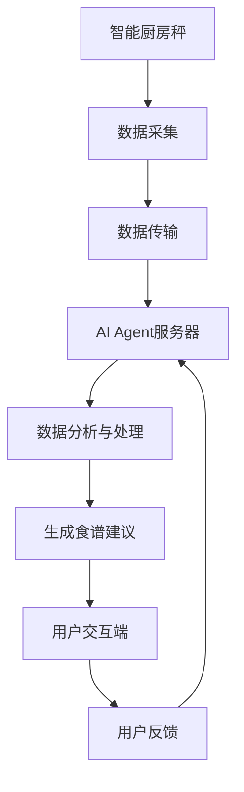

# 智能厨房秤：AI Agent的食谱创新助手

> 关键词：智能厨房秤、AI Agent、食谱创新、烹饪助手、传感器技术、机器学习

> 摘要：本文围绕智能厨房秤作为AI Agent的食谱创新助手展开深入探讨。首先介绍了智能厨房秤及AI Agent的背景信息，包括其目的、预期读者等内容。接着详细阐述了智能厨房秤与AI Agent的核心概念、联系及相关原理架构，通过Mermaid流程图清晰展示其工作流程。深入讲解了核心算法原理并给出Python源代码示例，同时介绍了相关数学模型和公式。通过项目实战，展示了智能厨房秤在实际开发中的环境搭建、代码实现及解读。还探讨了其实际应用场景，推荐了学习、开发工具及相关论文著作等资源。最后总结了智能厨房秤未来的发展趋势与挑战，并给出常见问题解答及参考资料。

## 1. 背景介绍 
### 1.1 目的和范围
智能厨房秤作为一种新兴的厨房设备，正逐渐改变人们的烹饪方式。其目的在于通过先进的传感器技术和智能化的功能，为用户提供更加精准、便捷的烹饪体验。结合AI Agent（人工智能代理），智能厨房秤能够实现食谱创新、个性化烹饪建议等功能。本文的范围将涵盖智能厨房秤与AI Agent的基本概念、技术原理、实际应用以及未来发展等多个方面，旨在全面介绍智能厨房秤作为AI Agent的食谱创新助手的相关知识。

### 1.2 预期读者
本文预期读者包括对智能厨房设备感兴趣的消费者、从事智能家居领域研究的科研人员、相关企业的技术开发者以及希望了解烹饪技术与人工智能结合应用的爱好者等。

### 1.3 文档结构概述
本文将按照以下结构进行阐述：首先介绍背景信息，包括目的、预期读者和文档结构等；接着详细讲解智能厨房秤与AI Agent的核心概念及联系，通过文本示意图和Mermaid流程图展示其原理架构；然后深入探讨核心算法原理和具体操作步骤，并给出Python源代码；再介绍相关的数学模型和公式；通过项目实战展示代码实际案例及详细解释；探讨实际应用场景；推荐学习、开发工具及相关论文著作等资源；最后总结未来发展趋势与挑战，给出常见问题解答及参考资料。

### 1.4 术语表
#### 1.4.1 核心术语定义
- **智能厨房秤**：具备智能化功能的厨房秤，能够通过传感器采集数据，并与其他设备或系统进行交互，实现多种功能。
- **AI Agent**：人工智能代理，是一种能够感知环境、做出决策并采取行动的智能实体。
- **食谱创新**：通过对食材、烹饪方法等进行创新组合，创造出新的食谱。

#### 1.4.2 相关概念解释
- **传感器技术**：智能厨房秤中用于采集重量、温度等数据的技术，常见的传感器有称重传感器、温度传感器等。
- **机器学习**：AI Agent实现智能决策的重要技术，通过对大量数据的学习和分析，使系统能够自动改进性能。

#### 1.4.3 缩略词列表
- **AI**：Artificial Intelligence，人工智能
- **IoT**：Internet of Things，物联网

## 2. 核心概念与联系 

### 智能厨房秤的概念
智能厨房秤是传统厨房秤的智能化升级，它不仅能够精确测量食材的重量，还具备多种附加功能。智能厨房秤通常配备高精度的称重传感器，能够实时获取食材的重量信息。同时，它还可能集成其他传感器，如温度传感器，用于监测烹饪过程中的温度变化。智能厨房秤可以通过无线通信技术（如蓝牙、Wi-Fi等）与其他设备（如智能手机、平板电脑等）进行连接，实现数据的传输和共享。

### AI Agent的概念
AI Agent是一种能够感知环境、做出决策并采取行动的智能实体。在智能厨房的场景中，AI Agent可以通过与智能厨房秤等设备进行交互，获取食材的相关信息，如重量、种类等。然后，AI Agent利用机器学习等技术对这些信息进行分析和处理，结合用户的口味偏好、健康需求等因素，为用户提供个性化的食谱建议和烹饪指导。

### 两者的联系
智能厨房秤为AI Agent提供了重要的数据来源，通过采集食材的重量、温度等信息，AI Agent能够更准确地了解烹饪过程和食材状态。而AI Agent则为智能厨房秤赋予了智能决策的能力，使智能厨房秤不仅仅是一个简单的称重工具，而是能够根据用户的需求和实际情况，提供更加个性化、智能化的烹饪服务。

### 原理和架构的文本示意图
智能厨房秤与AI Agent的系统架构主要包括以下几个部分：
1. **智能厨房秤端**：包含称重传感器、温度传感器等硬件设备，负责采集食材的重量、温度等数据。同时，智能厨房秤还具备通信模块，用于将采集到的数据传输到其他设备或系统。
2. **数据传输层**：通过蓝牙、Wi-Fi等无线通信技术，将智能厨房秤采集到的数据传输到云端服务器或用户的移动设备。
3. **AI Agent服务器端**：在云端服务器上运行AI Agent程序，接收来自智能厨房秤的数据，并进行分析和处理。AI Agent利用机器学习算法对数据进行学习和建模，结合用户的偏好和历史数据，生成个性化的食谱建议和烹饪指导。
4. **用户交互端**：用户可以通过智能手机、平板电脑等移动设备与AI Agent进行交互，查看食谱建议、烹饪指导等信息，并可以对AI Agent进行设置和调整。

### Mermaid流程图


## 3. 核心算法原理 & 具体操作步骤 

### 核心算法原理
智能厨房秤与AI Agent结合的核心算法主要包括数据处理算法和机器学习算法。

#### 数据处理算法
数据处理算法主要用于对智能厨房秤采集到的数据进行预处理，包括数据清洗、数据归一化等操作。数据清洗的目的是去除采集数据中的噪声和异常值，提高数据的质量。数据归一化则是将不同范围的数据转换到相同的范围内，以便于后续的机器学习算法处理。

以下是一个简单的数据清洗和归一化的Python代码示例：
```python
import numpy as np

def data_cleaning(data):
    # 去除异常值（假设异常值为小于0或大于1000的值）
    cleaned_data = []
    for value in data:
        if value >= 0 and value <= 1000:
            cleaned_data.append(value)
    return np.array(cleaned_data)

def data_normalization(data):
    # 数据归一化
    min_value = np.min(data)
    max_value = np.max(data)
    normalized_data = (data - min_value) / (max_value - min_value)
    return normalized_data
```

#### 机器学习算法
机器学习算法主要用于根据用户的口味偏好、健康需求等因素，生成个性化的食谱建议。常见的机器学习算法包括决策树、神经网络等。

以下是一个简单的基于决策树的食谱推荐的Python代码示例：
```python
from sklearn.tree import DecisionTreeClassifier
from sklearn.model_selection import train_test_split
import pandas as pd

# 假设我们有一个包含食材信息和用户口味偏好的数据集
data = pd.read_csv('recipe_data.csv')
X = data.drop('recipe', axis=1)
y = data['recipe']

# 划分训练集和测试集
X_train, X_test, y_train, y_test = train_test_split(X, y, test_size=0.2, random_state=42)

# 创建决策树分类器
clf = DecisionTreeClassifier()

# 训练模型
clf.fit(X_train, y_train)

# 预测食谱
new_data = [[1, 2, 3, 4]]  # 新的食材信息
predicted_recipe = clf.predict(new_data)
print("预测的食谱：", predicted_recipe)
```

### 具体操作步骤
1. **数据采集**：智能厨房秤通过称重传感器和其他传感器采集食材的重量、温度等数据。
2. **数据传输**：将采集到的数据通过无线通信技术传输到AI Agent服务器。
3. **数据预处理**：在AI Agent服务器上，对传输过来的数据进行清洗和归一化等预处理操作。
4. **模型训练**：使用机器学习算法对预处理后的数据进行训练，建立食谱推荐模型。
5. **食谱推荐**：根据用户的口味偏好、健康需求等因素，利用训练好的模型生成个性化的食谱建议。
6. **用户交互**：将食谱建议推送给用户，用户可以通过移动设备查看和选择食谱，并可以对AI Agent进行反馈和调整。

## 4. 数学模型和公式 & 详细讲解 & 举例说明 

### 数据归一化公式
数据归一化的目的是将不同范围的数据转换到相同的范围内，常见的归一化方法是线性归一化，其公式如下：
$$
x_{norm} = \frac{x - x_{min}}{x_{max} - x_{min}}
$$
其中，$x$ 是原始数据，$x_{min}$ 是数据的最小值，$x_{max}$ 是数据的最大值，$x_{norm}$ 是归一化后的数据。

**举例说明**：假设我们有一组数据 $[10, 20, 30, 40, 50]$，其中 $x_{min} = 10$，$x_{max} = 50$。对于数据 $x = 20$，其归一化后的值为：
$$
x_{norm} = \frac{20 - 10}{50 - 10} = \frac{10}{40} = 0.25
$$

### 决策树算法原理
决策树是一种基于树结构进行决策的机器学习算法。决策树的每个内部节点是一个属性上的测试，每个分支是一个测试输出，每个叶节点是一个类别或值。决策树的构建过程主要包括特征选择、树的生成和树的剪枝等步骤。

#### 信息熵
信息熵是衡量数据不确定性的指标，其公式如下：
$$
H(X) = -\sum_{i=1}^{n} p(x_i) \log_2 p(x_i)
$$
其中，$X$ 是一个随机变量，$p(x_i)$ 是 $X$ 取值为 $x_i$ 的概率。

#### 信息增益
信息增益是衡量特征对分类的重要性的指标，其公式如下：
$$
IG(X, A) = H(X) - H(X|A)
$$
其中，$IG(X, A)$ 是特征 $A$ 对随机变量 $X$ 的信息增益，$H(X)$ 是 $X$ 的信息熵，$H(X|A)$ 是在已知特征 $A$ 的条件下 $X$ 的条件熵。

**举例说明**：假设我们有一个包含天气、温度等特征和是否打球的数据集，我们要选择一个特征来构建决策树的根节点。我们可以计算每个特征的信息增益，选择信息增益最大的特征作为根节点。

## 5. 项目实战：代码实际案例和详细解释说明 

### 5.1  开发环境搭建
1. **硬件设备**：选择一款支持蓝牙或Wi-Fi通信的智能厨房秤，如小米智能厨房秤等。
2. **开发平台**：选择Python作为开发语言，使用Anaconda或Miniconda来管理Python环境。
3. **开发工具**：选择PyCharm作为集成开发环境（IDE）。
4. **相关库和框架**：安装`pandas`、`numpy`、`scikit-learn`等库，用于数据处理和机器学习。

### 5.2  源代码详细实现和代码解读
以下是一个简单的智能厨房秤与AI Agent结合的项目示例代码：
```python
import bluetooth
import pandas as pd
from sklearn.tree import DecisionTreeClassifier
from sklearn.model_selection import train_test_split

# 蓝牙连接智能厨房秤
def connect_to_scale():
    nearby_devices = bluetooth.discover_devices()
    for addr in nearby_devices:
        if bluetooth.lookup_name(addr) == "SmartKitchenScale":  # 假设智能厨房秤的名称为SmartKitchenScale
            sock = bluetooth.BluetoothSocket(bluetooth.RFCOMM)
            sock.connect((addr, 1))  # 假设端口号为1
            return sock
    return None

# 接收智能厨房秤的数据
def receive_data(sock):
    data = sock.recv(1024)
    return data.decode('utf-8')

# 数据预处理
def data_preprocessing(data):
    # 假设数据格式为 "weight,temperature"
    weight, temperature = data.split(',')
    weight = float(weight)
    temperature = float(temperature)
    processed_data = [[weight, temperature]]
    return processed_data

# 食谱推荐
def recipe_recommendation(processed_data):
    # 加载数据集
    data = pd.read_csv('recipe_data.csv')
    X = data.drop('recipe', axis=1)
    y = data['recipe']

    # 划分训练集和测试集
    X_train, X_test, y_train, y_test = train_test_split(X, y, test_size=0.2, random_state=42)

    # 创建决策树分类器
    clf = DecisionTreeClassifier()

    # 训练模型
    clf.fit(X_train, y_train)

    # 预测食谱
    predicted_recipe = clf.predict(processed_data)
    return predicted_recipe

# 主函数
def main():
    sock = connect_to_scale()
    if sock is not None:
        data = receive_data(sock)
        processed_data = data_preprocessing(data)
        recipe = recipe_recommendation(processed_data)
        print("预测的食谱：", recipe)
        sock.close()
    else:
        print("无法连接到智能厨房秤")

if __name__ == "__main__":
    main()
```

### 5.3  代码解读与分析
1. **蓝牙连接部分**：`connect_to_scale` 函数通过蓝牙发现附近的设备，并尝试连接到名称为 "SmartKitchenScale" 的智能厨房秤。
2. **数据接收部分**：`receive_data` 函数从智能厨房秤接收数据，并将其解码为字符串。
3. **数据预处理部分**：`data_preprocessing` 函数将接收到的数据进行处理，提取出重量和温度信息，并将其转换为适合机器学习模型输入的格式。
4. **食谱推荐部分**：`recipe_recommendation` 函数加载数据集，使用决策树算法进行模型训练，并根据预处理后的数据预测食谱。
5. **主函数部分**：`main` 函数调用上述函数，完成蓝牙连接、数据接收、数据预处理和食谱推荐等操作。

## 6. 实际应用场景 
### 家庭烹饪
在家庭烹饪场景中，智能厨房秤作为AI Agent的食谱创新助手可以为用户提供个性化的食谱建议。用户可以将食材放在智能厨房秤上，AI Agent根据食材的重量、种类等信息，结合用户的口味偏好和健康需求，为用户推荐适合的食谱。同时，智能厨房秤还可以实时监测烹饪过程中的重量和温度变化，为用户提供烹饪指导，帮助用户做出更加美味、健康的菜肴。

### 餐饮行业
在餐饮行业中，智能厨房秤可以帮助厨师更加精准地控制食材的用量，提高菜品的质量和稳定性。AI Agent可以根据餐厅的菜单和顾客的反馈，不断优化食谱，创新菜品。同时，智能厨房秤还可以与餐厅的管理系统进行集成，实现食材库存的实时监控和管理，提高餐厅的运营效率。

### 健康管理
对于关注健康的人群，智能厨房秤可以帮助他们控制饮食的热量和营养摄入。AI Agent可以根据用户的身体状况和健康目标，为用户制定个性化的饮食计划，并提供相应的食谱建议。用户可以通过智能厨房秤准确地称量食材的重量，确保饮食的准确性和科学性。

## 7. 工具和资源推荐
### 7.1 学习资源推荐
#### 7.1.1 书籍推荐
- 《Python机器学习实战》：介绍了Python在机器学习领域的应用，包括数据处理、模型训练、算法实现等内容。
- 《人工智能：一种现代的方法》：全面介绍了人工智能的基本概念、算法和应用，是人工智能领域的经典教材。

#### 7.1.2 在线课程
- Coursera上的“机器学习”课程：由斯坦福大学的Andrew Ng教授主讲，是机器学习领域的经典课程。
- edX上的“人工智能基础”课程：介绍了人工智能的基本概念、算法和应用，适合初学者学习。

#### 7.1.3 技术博客和网站
- 机器之心：提供人工智能领域的最新技术、研究成果和应用案例等信息。
- 开源中国：提供开源技术的相关信息和社区交流平台。

### 7.2 开发工具框架推荐
#### 7.2.1 IDE和编辑器
- PyCharm：一款专业的Python集成开发环境，提供代码编辑、调试、版本控制等功能。
- Visual Studio Code：一款轻量级的代码编辑器，支持多种编程语言，具有丰富的插件扩展功能。

#### 7.2.2 调试和性能分析工具
- Py-Spy：一款Python性能分析工具，可以帮助开发者找出代码中的性能瓶颈。
- PDB：Python自带的调试工具，可以帮助开发者调试代码。

#### 7.2.3 相关框架和库
- Pandas：用于数据处理和分析的Python库，提供了高效的数据结构和数据操作方法。
- Scikit-learn：用于机器学习的Python库，提供了多种机器学习算法和工具。

### 7.3 相关论文著作推荐
#### 7.3.1 经典论文
- “A Decision-Theoretic Approach to Classification and Regression