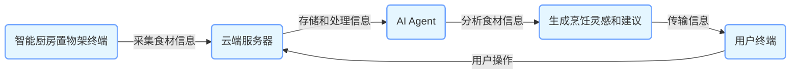

# 智能厨房置物架：AI Agent的烹饪灵感激发

> 关键词：智能厨房置物架、AI Agent、烹饪灵感、人工智能、物联网、智能烹饪、厨房管理

> 摘要：本文围绕智能厨房置物架与AI Agent结合以激发烹饪灵感这一主题展开。详细介绍了智能厨房置物架和AI Agent的核心概念及其联系，阐述了相关核心算法原理和具体操作步骤，运用数学模型和公式进行深入分析并举例说明。通过项目实战给出代码实际案例和详细解释，探讨了该技术在实际中的应用场景。同时推荐了学习、开发相关的工具和资源，总结了未来发展趋势与挑战，并提供常见问题解答和扩展阅读参考资料，旨在为相关领域的研究和应用提供全面且深入的技术指导。

## 1. 背景介绍 
### 1.1 目的和范围
随着人们生活水平的提高，对于厨房体验和烹饪质量的要求也日益提升。传统的厨房置物架仅仅起到存放物品的作用，而智能厨房置物架结合AI Agent的技术能够为用户提供更多的功能和服务，如根据置物架上的食材推荐烹饪食谱、提供烹饪步骤指导等，激发用户的烹饪灵感。本文的目的在于详细介绍智能厨房置物架与AI Agent结合的技术原理、实现方法以及实际应用，范围涵盖了从核心概念到项目实战的各个方面。

### 1.2 预期读者
本文预期读者包括对智能家居、人工智能、烹饪技术感兴趣的技术爱好者，从事相关领域研究和开发的专业人员，以及希望提升厨房智能化水平的普通消费者。

### 1.3 文档结构概述
本文将首先介绍智能厨房置物架和AI Agent的核心概念及其联系，然后阐述核心算法原理和具体操作步骤，接着运用数学模型和公式进行分析并举例说明。通过项目实战展示代码实际案例和详细解释，探讨实际应用场景。之后推荐相关的工具和资源，总结未来发展趋势与挑战，最后提供常见问题解答和扩展阅读参考资料。

### 1.4 术语表
#### 1.4.1 核心术语定义
- **智能厨房置物架**：具备感知、通信和计算能力的厨房置物架，能够实时监测置物架上物品的种类、数量和状态等信息，并与其他设备进行数据交互。
- **AI Agent**：人工智能代理，是一种能够感知环境、进行推理和决策，并采取行动以实现特定目标的智能实体。在本文中，AI Agent主要用于分析智能厨房置物架上的食材信息，为用户提供烹饪灵感和建议。
- **物联网（IoT）**：通过各种信息传感器、射频识别技术、全球定位系统、红外感应器、激光扫描器等各种装置与技术，实时采集任何需要监控、连接、互动的物体或过程，采集其声、光、热、电、力学、化学、生物、位置等各种需要的信息，通过各类可能的网络接入，实现物与物、物与人的泛在连接，实现对物品和过程的智能化感知、识别和管理。

#### 1.4.2 相关概念解释
- **烹饪灵感激发**：指通过分析食材信息、用户偏好、烹饪历史等数据，为用户提供新颖、合适的烹饪食谱和建议，帮助用户创造出美味的菜肴。
- **智能烹饪**：利用人工智能、物联网等技术，实现烹饪过程的自动化、智能化，包括食材准备、烹饪参数控制、烹饪过程监测等。

#### 1.4.3 缩略词列表
- **IoT**：Internet of Things（物联网）
- **AI**：Artificial Intelligence（人工智能）

## 2. 核心概念与联系 

### 核心概念原理
智能厨房置物架主要基于物联网技术实现对食材的管理。它通过安装在置物架上的传感器，如重量传感器、RFID（射频识别）传感器等，实时获取食材的信息，包括食材的种类、数量、保质期等。这些信息通过网络传输到云端服务器进行处理和存储。

AI Agent则是基于人工智能技术，通过对云端服务器上的食材信息进行分析和挖掘，结合用户的烹饪历史、口味偏好等数据，为用户提供个性化的烹饪灵感和建议。AI Agent可以采用多种人工智能算法，如机器学习、深度学习等，来实现对食材信息的分析和处理。

### 架构的文本示意图
智能厨房置物架与AI Agent的架构主要包括以下几个部分：
1. **智能厨房置物架终端**：由各种传感器组成，负责采集食材信息，并将信息通过网络传输到云端服务器。
2. **云端服务器**：负责接收、存储和处理来自智能厨房置物架终端的食材信息，同时运行AI Agent程序，为用户提供烹饪灵感和建议。
3. **用户终端**：如手机、平板电脑等，用户可以通过用户终端与云端服务器进行交互，获取烹饪灵感和建议，并对智能厨房置物架进行控制。

### Mermaid 流程图


## 3. 核心算法原理 & 具体操作步骤 

### 核心算法原理
在智能厨房置物架与AI Agent的系统中，核心算法主要包括食材识别算法和烹饪推荐算法。

#### 食材识别算法
食材识别算法主要用于根据传感器采集到的信息，准确识别出置物架上的食材种类。这里我们可以采用机器学习中的分类算法，如支持向量机（SVM）。以下是一个简单的Python代码示例，用于演示如何使用SVM进行食材识别：

```python
import numpy as np
from sklearn import svm

# 示例数据：特征向量和对应的标签
X = np.array([[1, 2], [2, 3], [3, 1], [4, 2]])  # 特征向量
y = np.array([0, 0, 1, 1])  # 标签，0表示一种食材，1表示另一种食材

# 创建SVM分类器
clf = svm.SVC()

# 训练模型
clf.fit(X, y)

# 预测新的食材
new_food = np.array([[3, 2]])
prediction = clf.predict(new_food)
print("预测的食材类别：", prediction)
```

#### 烹饪推荐算法
烹饪推荐算法主要根据识别出的食材信息，结合用户的烹饪历史和口味偏好，为用户推荐合适的烹饪食谱。这里我们可以采用基于内容的推荐算法，以下是一个简单的Python代码示例：

```python
# 示例数据：食材列表和对应的食谱列表
ingredients = ["西红柿", "鸡蛋", "土豆"]
recipes = [
    {"name": "西红柿炒鸡蛋", "ingredients": ["西红柿", "鸡蛋"]},
    {"name": "土豆丝", "ingredients": ["土豆"]},
    {"name": "西红柿鸡蛋汤", "ingredients": ["西红柿", "鸡蛋"]}
]

# 推荐食谱
recommended_recipes = []
for recipe in recipes:
    recipe_ingredients = recipe["ingredients"]
    if all(ingredient in ingredients for ingredient in recipe_ingredients):
        recommended_recipes.append(recipe["name"])

print("推荐的食谱：", recommended_recipes)
```

### 具体操作步骤
1. **数据采集**：智能厨房置物架上的传感器实时采集食材的信息，如重量、RFID标签信息等。
2. **数据传输**：采集到的食材信息通过网络传输到云端服务器。
3. **食材识别**：云端服务器使用食材识别算法对采集到的信息进行处理，识别出食材的种类。
4. **烹饪推荐**：AI Agent根据识别出的食材信息，结合用户的烹饪历史和口味偏好，使用烹饪推荐算法为用户推荐合适的烹饪食谱。
5. **信息反馈**：推荐的烹饪食谱信息通过网络传输到用户终端，用户可以在用户终端上查看和选择食谱。

## 4. 数学模型和公式 & 详细讲解 & 举例说明 

### 食材识别算法的数学模型
在食材识别算法中，我们使用的支持向量机（SVM）的数学模型可以表示为：

$$
\min_{w,b,\xi} \frac{1}{2}w^Tw + C\sum_{i=1}^{n}\xi_i
$$

$$
\text{s.t. } y_i(w^T\phi(x_i) + b) \geq 1 - \xi_i, \xi_i \geq 0, i = 1, \cdots, n
$$

其中，$w$ 是权重向量，$b$ 是偏置项，$\xi_i$ 是松弛变量，$C$ 是惩罚参数，$\phi(x_i)$ 是将输入特征 $x_i$ 映射到高维空间的函数，$y_i$ 是样本的标签。

详细讲解：支持向量机的目标是找到一个最优的超平面，将不同类别的样本分开。通过最小化目标函数，同时满足约束条件，可以得到最优的超平面。惩罚参数 $C$ 用于控制分类错误和模型复杂度之间的平衡。

举例说明：假设我们有一个二维的数据集，包含两种不同类别的样本。通过SVM算法，我们可以找到一个最优的直线（二维空间中的超平面），将这两种样本分开。

### 烹饪推荐算法的数学模型
在烹饪推荐算法中，基于内容的推荐算法可以使用余弦相似度来计算食材和食谱之间的相似度。余弦相似度的计算公式为：

$$
\text{sim}(A, B) = \frac{A \cdot B}{\|A\| \|B\|}
$$

其中，$A$ 和 $B$ 分别是食材向量和食谱的食材向量，$\cdot$ 表示向量的点积，$\|A\|$ 和 $\|B\|$ 分别表示向量 $A$ 和 $B$ 的模。

详细讲解：余弦相似度用于衡量两个向量之间的夹角余弦值，值越接近1表示两个向量越相似。在烹饪推荐中，我们可以将食材和食谱表示为向量，通过计算余弦相似度来找到与现有食材最匹配的食谱。

举例说明：假设我们有两种食材 “西红柿” 和 “鸡蛋”，以及一个食谱 “西红柿炒鸡蛋”，我们可以将食材和食谱表示为向量，然后计算它们之间的余弦相似度。如果相似度较高，则说明这个食谱适合当前的食材。

## 5. 项目实战：代码实际案例和详细解释说明 

### 5.1  开发环境搭建
- **硬件环境**：需要一个智能厨房置物架，安装有重量传感器、RFID传感器等，以及一台服务器用于运行云端程序。
- **软件环境**：操作系统可以选择Linux，如Ubuntu。开发语言选择Python，需要安装相关的库，如`numpy`、`sklearn`等。可以使用`pip`进行库的安装：

```bash
pip install numpy sklearn
```

### 5.2  源代码详细实现和代码解读
以下是一个完整的项目实战代码示例，实现了智能厨房置物架与AI Agent的基本功能：

```python
import numpy as np
from sklearn import svm

# 示例数据：特征向量和对应的标签
X = np.array([[1, 2], [2, 3], [3, 1], [4, 2]])  # 特征向量
y = np.array([0, 0, 1, 1])  # 标签，0表示一种食材，1表示另一种食材

# 创建SVM分类器
clf = svm.SVC()

# 训练模型
clf.fit(X, y)

# 模拟传感器采集到的新食材特征
new_food_features = np.array([[3, 2]])

# 食材识别
predicted_food_class = clf.predict(new_food_features)
print("预测的食材类别：", predicted_food_class)

# 示例数据：食材列表和对应的食谱列表
ingredients = ["西红柿", "鸡蛋", "土豆"]
recipes = [
    {"name": "西红柿炒鸡蛋", "ingredients": ["西红柿", "鸡蛋"]},
    {"name": "土豆丝", "ingredients": ["土豆"]},
    {"name": "西红柿鸡蛋汤", "ingredients": ["西红柿", "鸡蛋"]}
]

# 烹饪推荐
recommended_recipes = []
for recipe in recipes:
    recipe_ingredients = recipe["ingredients"]
    if all(ingredient in ingredients for ingredient in recipe_ingredients):
        recommended_recipes.append(recipe["name"])

print("推荐的食谱：", recommended_recipes)
```

代码解读：
1. **食材识别部分**：首先定义了示例数据 $X$ 和 $y$，用于训练SVM分类器。然后使用`fit`方法训练模型，接着模拟传感器采集到的新食材特征，使用`predict`方法进行食材识别。
2. **烹饪推荐部分**：定义了食材列表和食谱列表，通过遍历食谱列表，检查每个食谱的食材是否都在现有食材列表中，如果是则将该食谱添加到推荐食谱列表中。

### 5.3  代码解读与分析
- **优点**：代码结构简单，易于理解和实现。使用了常见的机器学习算法和基本的Python数据结构，适合初学者学习和实践。
- **缺点**：示例数据比较简单，实际应用中需要更多的真实数据进行训练和测试。同时，没有考虑用户的烹饪历史和口味偏好，推荐的食谱可能不够个性化。

## 6. 实际应用场景 
### 家庭厨房
在家庭厨房中，智能厨房置物架与AI Agent的结合可以为用户提供更加便捷和个性化的烹饪体验。用户可以通过手机或其他终端设备查看置物架上的食材信息，获取烹饪灵感和建议。例如，当用户不知道如何处理剩余的食材时，系统可以根据现有食材推荐合适的食谱。

### 餐厅厨房
在餐厅厨房中，智能厨房置物架可以帮助厨师更好地管理食材库存，及时了解食材的使用情况和保质期。AI Agent可以根据餐厅的菜单和食材库存，为厨师提供烹饪计划和建议，提高厨房的工作效率。

### 智能厨房体验店
在智能厨房体验店中，智能厨房置物架与AI Agent的结合可以向顾客展示智能厨房的先进技术和功能。顾客可以亲自体验系统的操作，感受智能厨房带来的便捷和乐趣。

## 7. 工具和资源推荐
### 7.1 学习资源推荐
#### 7.1.1 书籍推荐
- 《机器学习》（周志华）：介绍了机器学习的基本概念、算法和应用，是机器学习领域的经典教材。
- 《Python机器学习实战》（Sebastian Raschka）：通过实际案例介绍了如何使用Python实现机器学习算法，适合初学者。
- 《智能家居技术与应用》：全面介绍了智能家居的相关技术和应用，包括智能厨房的实现方法。

#### 7.1.2 在线课程
- Coursera上的“机器学习”课程（Andrew Ng教授）：是一门非常经典的机器学习课程，涵盖了机器学习的各个方面。
- edX上的“人工智能基础”课程：介绍了人工智能的基本概念、算法和应用，适合初学者。
- 中国大学MOOC上的“物联网技术与应用”课程：详细介绍了物联网的相关技术和应用，包括智能厨房的物联网实现。

#### 7.1.3 技术博客和网站
- 博客园：有很多技术博客分享了人工智能、物联网等领域的技术文章和经验。
- 知乎：可以在知乎上搜索相关的技术问题和讨论，获取更多的知识和见解。
- IEEE Xplore：提供了大量的学术论文和技术报告，涵盖了人工智能、物联网等领域的最新研究成果。

### 7.2 开发工具框架推荐
#### 7.2.1 IDE和编辑器
- PyCharm：是一款专业的Python集成开发环境，提供了丰富的功能和插件，适合Python开发。
- Visual Studio Code：是一款轻量级的代码编辑器，支持多种编程语言，具有丰富的插件生态系统。
- Jupyter Notebook：是一个交互式的开发环境，适合进行数据分析和机器学习实验。

#### 7.2.2 调试和性能分析工具
- pdb：Python自带的调试工具，可以帮助开发者调试Python代码。
- cProfile：Python的性能分析工具，可以分析代码的运行时间和函数调用情况。
- TensorBoard：是TensorFlow的可视化工具，可以用于可视化机器学习模型的训练过程和性能指标。

#### 7.2.3 相关框架和库
- Scikit-learn：是一个常用的机器学习库，提供了丰富的机器学习算法和工具，适合进行数据挖掘和分析。
- TensorFlow：是一个开源的机器学习框架，广泛应用于深度学习领域，提供了高效的计算和模型训练功能。
- PyTorch：是另一个流行的深度学习框架，具有简洁的API和动态图机制，适合快速开发和实验。

### 7.3 相关论文著作推荐
#### 7.3.1 经典论文
- “Support-Vector Networks”（Cortes and Vapnik, 1995）：介绍了支持向量机的基本原理和算法，是支持向量机领域的经典论文。
- “A Survey on Content-Based Recommendation Systems”（Adomavicius and Tuzhilin, 2005）：对基于内容的推荐系统进行了全面的综述和分析。

#### 7.3.2 最新研究成果
- 在IEEE Transactions on Smart Grid、ACM Transactions on Sensor Networks等期刊上可以找到关于智能厨房、物联网等领域的最新研究成果。

#### 7.3.3 应用案例分析
- 可以在ACM SIGKDD、IEEE ICDM等会议的论文集中找到智能厨房和人工智能应用的案例分析，了解实际应用中的技术和方法。

## 8. 总结：未来发展趋势与挑战
### 未来发展趋势
- **更加智能化**：智能厨房置物架和AI Agent将不断发展，具备更强大的智能分析和决策能力，能够根据用户的实时需求和环境变化提供更加个性化的烹饪建议。
- **与其他智能家居设备的融合**：智能厨房置物架将与其他智能家居设备，如智能冰箱、智能炉灶等进行深度融合，实现整个厨房的智能化管理和控制。
- **健康饮食管理**：结合用户的健康数据和饮食需求，智能厨房置物架和AI Agent可以提供更加健康、营养的烹饪建议，帮助用户实现健康饮食管理。

### 挑战
- **数据隐私和安全**：智能厨房置物架和AI Agent需要收集和处理大量的用户数据，如食材信息、烹饪历史、健康数据等，如何保障数据的隐私和安全是一个重要的挑战。
- **技术标准和互操作性**：目前智能厨房领域缺乏统一的技术标准和规范，不同品牌和厂商的设备之间可能存在互操作性问题，影响用户的使用体验。
- **用户接受度**：智能厨房置物架和AI Agent作为新兴技术，用户对其功能和使用方法可能存在一定的认知障碍，如何提高用户的接受度和使用意愿也是一个挑战。

## 9. 附录：常见问题与解答
### 问题1：智能厨房置物架的传感器精度如何保证？
解答：可以通过定期校准传感器、选择高质量的传感器产品、优化传感器的安装位置和环境等方法来保证传感器的精度。同时，可以采用多传感器融合的技术，提高数据的准确性和可靠性。

### 问题2：AI Agent的推荐结果不准确怎么办？
解答：可以通过不断收集和更新用户的烹饪历史和口味偏好数据，优化AI Agent的推荐算法。同时，可以让用户对推荐结果进行反馈，根据用户的反馈调整推荐策略。

### 问题3：智能厨房置物架与现有厨房设备如何兼容？
解答：可以通过采用开放的通信协议和接口标准，实现智能厨房置物架与现有厨房设备的兼容。同时，可以开发相应的适配器和中间件，解决不同设备之间的通信和数据交互问题。

## 10. 扩展阅读 & 参考资料
- [智能家居行业发展报告]
- [人工智能算法原理与应用]
- [物联网技术标准与规范]
- 相关的学术期刊和会议论文

作者：AI天才研究院/AI Genius Institute & 禅与计算机程序设计艺术 /Zen And The Art of Computer Programming