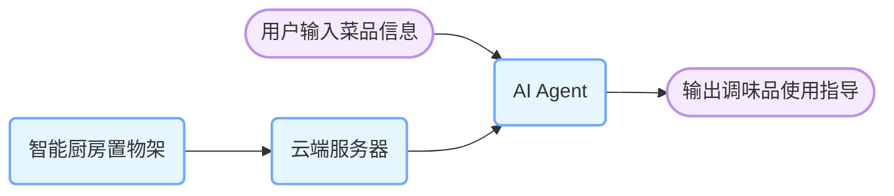

# 智能厨房置物架：AI Agent的调味品使用指导

> 关键词：智能厨房置物架、AI Agent、调味品使用指导、智能家居、人工智能应用

> 摘要：本文聚焦于智能厨房置物架结合AI Agent实现调味品使用指导的创新应用。详细介绍了该系统的背景、核心概念、算法原理、数学模型，通过项目实战展示代码实现与解读，探讨了实际应用场景，推荐了相关学习资源、开发工具和论文著作。最后对未来发展趋势与挑战进行总结，并提供常见问题解答和扩展阅读参考资料，旨在为相关领域的研究和开发提供全面且深入的技术指导。

## 1. 背景介绍 
### 1.1 目的和范围
在现代生活中，厨房的智能化发展越来越受到人们的关注。智能厨房置物架结合AI Agent提供调味品使用指导的系统，旨在提升用户在烹饪过程中的体验，帮助用户更科学、合理地使用调味品。该系统的范围涵盖了从调味品的识别、存储管理到根据不同菜品提供精准使用建议的全过程。通过智能化的手段，解决用户在烹饪时对调味品用量和搭配的困惑，同时提高厨房的管理效率。

### 1.2 预期读者
本文预期读者包括智能家居领域的开发者、人工智能研究人员、对智能厨房感兴趣的爱好者以及相关行业的从业者。开发者可以从本文中获取系统设计和实现的技术细节，研究人员可以了解到该领域的最新应用和发展趋势，爱好者可以对智能厨房置物架和AI Agent的结合有更深入的认识，从业者则可以借鉴相关经验用于实际业务拓展。

### 1.3 文档结构概述
本文首先介绍系统的背景信息，让读者了解系统的目的和适用人群。接着阐述核心概念与联系，包括智能厨房置物架和AI Agent的原理及架构。然后详细讲解核心算法原理和具体操作步骤，并通过Python代码进行说明。随后介绍数学模型和公式，以及实际的举例。项目实战部分展示了开发环境搭建、源代码实现和代码解读。接着探讨系统的实际应用场景，推荐相关的工具和资源。最后总结未来发展趋势与挑战，提供常见问题解答和扩展阅读参考资料。

### 1.4 术语表
#### 1.4.1 核心术语定义
- **智能厨房置物架**：一种具备智能化功能的厨房置物设备，能够对放置其上的调味品进行识别、管理和信息记录。
- **AI Agent**：人工智能代理，是一种能够感知环境、做出决策并执行相应动作的智能实体。在本系统中，AI Agent负责分析菜品信息，结合置物架上的调味品数据，为用户提供使用指导。
- **调味品使用指导**：根据不同的菜品和用户的口味偏好，为用户提供关于每种调味品的使用种类、用量和使用时机的建议。

#### 1.4.2 相关概念解释
- **物联网（IoT）**：通过各种信息传感器、射频识别技术、全球定位系统等技术，实时采集任何需要监控、连接、互动的物体或过程，采集其声、光、热、电、力学、化学、生物、位置等各种需要的信息，通过各类可能的网络接入，实现物与物、物与人的泛在连接，实现对物品和过程的智能化感知、识别和管理。智能厨房置物架可通过物联网技术与其他设备进行数据交互。
- **机器学习**：一门多领域交叉学科，涉及概率论、统计学、逼近论、凸分析、算法复杂度理论等多门学科。它专门研究计算机怎样模拟或实现人类的学习行为，以获取新的知识或技能，重新组织已有的知识结构使之不断改善自身的性能。在本系统中，机器学习算法可用于对用户的口味偏好进行建模和预测。

#### 1.4.3 缩略词列表
- **IoT**：Internet of Things（物联网）
- **AI**：Artificial Intelligence（人工智能）

## 2. 核心概念与联系 

### 核心概念原理
#### 智能厨房置物架原理
智能厨房置物架主要基于传感器技术和物联网技术。置物架上安装有多种传感器，如重量传感器、RFID（射频识别）传感器等。重量传感器可以实时监测调味品瓶的重量变化，从而判断调味品的使用情况和剩余量。RFID传感器则可以识别调味品的种类和相关信息，例如品牌、保质期等。这些传感器将采集到的数据通过物联网传输到云端服务器进行处理和分析。

#### AI Agent原理
AI Agent是系统的智能决策核心。它通过与云端服务器连接，获取置物架上调味品的信息以及用户输入的菜品信息。AI Agent内部集成了机器学习模型和知识库，机器学习模型可以根据大量的烹饪数据和用户的历史使用记录，学习不同菜品与调味品之间的搭配规律以及用户的口味偏好。知识库则存储了各种菜品的标准调味品配方和使用建议。AI Agent根据这些信息，为用户提供个性化的调味品使用指导。

### 架构示意图


### 联系说明
智能厨房置物架负责采集调味品的相关数据，并将其上传到云端服务器。AI Agent从云端服务器获取这些数据，同时结合用户输入的菜品信息，利用自身的机器学习模型和知识库进行分析和决策。最终，AI Agent将生成的调味品使用指导反馈给用户。整个系统形成了一个闭环，通过数据的流通和智能决策，实现了智能化的调味品使用指导功能。

## 3. 核心算法原理 & 具体操作步骤 

### 核心算法原理
本系统主要涉及到两个核心算法：菜品与调味品匹配算法和用户口味偏好建模算法。

#### 菜品与调味品匹配算法
该算法的目的是根据用户输入的菜品信息，从知识库中找到最适合的调味品搭配。算法的基本步骤如下：
1. 对用户输入的菜品名称进行语义分析，提取关键信息。
2. 根据关键信息在知识库中搜索相关的菜品配方，获取标准的调味品搭配列表。
3. 结合智能厨房置物架上实际可用的调味品，对标准搭配列表进行筛选和调整。

以下是使用Python实现的简单示例代码：
```python
# 模拟知识库
knowledge_base = {
    "西红柿炒鸡蛋": ["盐", "糖", "生抽", "食用油"],
    "红烧肉": ["酱油", "料酒", "冰糖", "八角", "桂皮"]
}

def match_condiments(dish_name, available_condiments):
    if dish_name in knowledge_base:
        standard_condiments = knowledge_base[dish_name]
        matched_condiments = [condiment for condiment in standard_condiments if condiment in available_condiments]
        return matched_condiments
    else:
        return []

# 示例使用
dish = "西红柿炒鸡蛋"
available = ["盐", "糖", "食用油", "醋"]
result = match_condiments(dish, available)
print(result)
```

#### 用户口味偏好建模算法
该算法用于根据用户的历史使用记录，建立用户的口味偏好模型。算法的基本步骤如下：
1. 收集用户每次使用调味品的记录，包括使用的种类、用量和对应的菜品。
2. 对收集到的数据进行预处理，例如归一化处理。
3. 使用机器学习算法（如决策树、神经网络等）对处理后的数据进行训练，得到用户口味偏好模型。

以下是使用Python和Scikit-learn库实现的简单示例代码：
```python
import numpy as np
from sklearn.tree import DecisionTreeClassifier

# 模拟用户历史使用记录
X = np.array([[1, 2, 3], [2, 3, 4], [3, 4, 5]])  # 调味品用量特征
y = np.array([0, 1, 0])  # 用户对菜品的喜好标签

# 创建决策树分类器
clf = DecisionTreeClassifier()

# 训练模型
clf.fit(X, y)

# 预测新的使用情况
new_usage = np.array([[4, 5, 6]])
prediction = clf.predict(new_usage)
print(prediction)
```

### 具体操作步骤
1. 用户通过智能厨房置物架的交互界面或手机应用输入要烹饪的菜品名称。
2. 智能厨房置物架将当前放置的调味品信息上传到云端服务器。
3. AI Agent从云端服务器获取菜品信息和调味品信息。
4. AI Agent首先使用菜品与调味品匹配算法，找出适合该菜品的可用调味品。
5. 然后，AI Agent根据用户的历史使用记录，使用用户口味偏好建模算法对匹配结果进行调整，得到个性化的调味品使用建议。
6. AI Agent将最终的使用建议反馈给用户，用户可以在交互界面或手机应用上查看。

## 4. 数学模型和公式 & 详细讲解 & 举例说明 

### 菜品与调味品匹配的数学模型
假设我们有一个菜品集合 $D = \{d_1, d_2, \cdots, d_n\}$ 和一个调味品集合 $C = \{c_1, c_2, \cdots, c_m\}$。每个菜品 $d_i$ 都有一个对应的标准调味品集合 $S_i \subseteq C$。

设 $A \subseteq C$ 为智能厨房置物架上实际可用的调味品集合。我们定义匹配度函数 $M(d_i, A)$ 来衡量菜品 $d_i$ 与可用调味品集合 $A$ 的匹配程度：

$$M(d_i, A) = \frac{|S_i \cap A|}{|S_i|}$$

其中，$|S_i \cap A|$ 表示标准调味品集合 $S_i$ 与可用调味品集合 $A$ 的交集的元素个数，$|S_i|$ 表示标准调味品集合 $S_i$ 的元素个数。

例如，对于菜品“西红柿炒鸡蛋”，其标准调味品集合 $S = \{"盐", "糖", "生抽", "食用油"\}$，可用调味品集合 $A = \{"盐", "糖", "食用油", "醋"\}$。则 $S \cap A = \{"盐", "糖", "食用油"\}$，$|S \cap A| = 3$，$|S| = 4$，所以匹配度 $M = \frac{3}{4} = 0.75$。

### 用户口味偏好建模的数学模型
假设我们有 $N$ 条用户历史使用记录，每条记录包含 $k$ 种调味品的用量 $x_{i1}, x_{i2}, \cdots, x_{ik}$ 和用户对菜品的喜好标签 $y_i$（$y_i \in \{0, 1\}$，0 表示不喜欢，1 表示喜欢），其中 $i = 1, 2, \cdots, N$。

我们可以将这些数据看作一个矩阵 $X \in \mathbb{R}^{N \times k}$ 和一个向量 $y \in \mathbb{R}^{N}$。

以决策树算法为例，决策树的目标是找到一系列的决策规则，将输入空间 $\mathbb{R}^{k}$ 划分为不同的区域，使得每个区域内的样本具有相同或相似的标签。决策树的构建过程可以通过信息增益、基尼不纯度等指标来选择最优的划分特征和划分点。

例如，假设我们有以下三条用户历史使用记录：
| 盐用量 | 糖用量 | 生抽用量 | 喜好标签 |
| ---- | ---- | ---- | ---- |
| 1 | 2 | 3 | 0 |
| 2 | 3 | 4 | 1 |
| 3 | 4 | 5 | 0 |

我们可以使用这些数据训练一个决策树模型，然后根据新的调味品用量预测用户的喜好。

## 5. 项目实战：代码实际案例和详细解释说明 

### 5.1  开发环境搭建
#### 硬件环境
- 智能厨房置物架：选择合适的传感器（如重量传感器、RFID传感器）进行安装，并确保其能够正常工作。
- 服务器：可以选择云服务器（如阿里云、腾讯云等）或本地服务器，用于存储数据和运行AI Agent程序。

#### 软件环境
- 操作系统：可以选择Linux系统（如Ubuntu），具有良好的稳定性和开源生态。
- 编程语言：Python，具有丰富的机器学习和物联网开发库。
- 数据库：MySQL，用于存储用户信息、菜品信息、调味品信息和用户历史使用记录等。
- 开发框架：Flask，用于搭建Web服务，实现与用户的交互和数据的传输。

### 5.2  源代码详细实现和代码解读
#### 整体架构
我们将项目分为三个主要部分：智能厨房置物架数据采集模块、AI Agent决策模块和Web服务模块。

#### 智能厨房置物架数据采集模块
```python
import random
import time

# 模拟传感器数据采集
def collect_sensor_data():
    # 模拟重量传感器数据
    weight = random.uniform(100, 500)
    # 模拟RFID传感器数据，假设返回调味品名称
    condiment_name = random.choice(["盐", "糖", "生抽", "食用油"])
    return weight, condiment_name

# 循环采集数据并上传到服务器
while True:
    weight, condiment_name = collect_sensor_data()
    # 这里可以添加代码将数据上传到服务器
    print(f"采集到数据：调味品 {condiment_name}，重量 {weight} 克")
    time.sleep(5)
```
代码解读：该模块模拟了智能厨房置物架上传感器的数据采集过程。`collect_sensor_data` 函数随机生成重量和调味品名称，模拟传感器的实际采集。然后通过一个无限循环，每隔5秒采集一次数据并打印出来。在实际应用中，需要添加代码将数据上传到服务器。

#### AI Agent决策模块
```python
# 模拟知识库
knowledge_base = {
    "西红柿炒鸡蛋": ["盐", "糖", "生抽", "食用油"],
    "红烧肉": ["酱油", "料酒", "冰糖", "八角", "桂皮"]
}

# 模拟用户历史使用记录
user_history = [
    {"dish": "西红柿炒鸡蛋", "condiments": ["盐", "糖", "食用油"]},
    {"dish": "红烧肉", "condiments": ["酱油", "料酒", "冰糖"]}
]

def match_condiments(dish_name, available_condiments):
    if dish_name in knowledge_base:
        standard_condiments = knowledge_base[dish_name]
        matched_condiments = [condiment for condiment in standard_condiments if condiment in available_condiments]
        return matched_condiments
    else:
        return []

def get_user_preference(dish_name):
    user_used_condiments = []
    for record in user_history:
        if record["dish"] == dish_name:
            user_used_condiments = record["condiments"]
            break
    return user_used_condiments

def provide_guidance(dish_name, available_condiments):
    matched = match_condiments(dish_name, available_condiments)
    preference = get_user_preference(dish_name)
    # 结合匹配结果和用户偏好，这里简单合并
    guidance = list(set(matched + preference))
    return guidance

# 示例使用
dish = "西红柿炒鸡蛋"
available = ["盐", "糖", "食用油", "醋"]
result = provide_guidance(dish, available)
print(result)
```
代码解读：该模块实现了AI Agent的核心决策功能。`match_condiments` 函数根据菜品名称和可用调味品列表，从知识库中找出匹配的调味品。`get_user_preference` 函数根据用户历史使用记录，获取用户对该菜品使用过的调味品。`provide_guidance` 函数将匹配结果和用户偏好结合，生成最终的使用建议。

#### Web服务模块
```python
from flask import Flask, request, jsonify

app = Flask(__name__)

# 模拟AI Agent决策函数
def provide_guidance(dish_name, available_condiments):
    # 这里可以调用实际的AI Agent决策函数
    return ["盐", "糖", "食用油"]

@app.route('/get_guidance', methods=['POST'])
def get_guidance():
    data = request.get_json()
    dish_name = data.get('dish_name')
    available_condiments = data.get('available_condiments')
    guidance = provide_guidance(dish_name, available_condiments)
    return jsonify({"guidance": guidance})

if __name__ == '__main__':
    app.run(debug=True)
```
代码解读：该模块使用Flask框架搭建了一个Web服务，提供了一个 `/get_guidance` 的接口，用于接收用户输入的菜品名称和可用调味品列表，并返回调味品使用建议。用户可以通过发送POST请求到该接口来获取指导信息。

### 5.3  代码解读与分析
#### 智能厨房置物架数据采集模块
该模块的主要作用是模拟传感器数据的采集。在实际应用中，需要根据具体的传感器型号和接口，编写相应的驱动程序来获取真实的传感器数据。同时，需要添加数据上传的功能，将采集到的数据发送到服务器进行处理。

#### AI Agent决策模块
该模块的核心是菜品与调味品匹配和用户口味偏好的处理。目前的实现比较简单，知识库和用户历史使用记录都是模拟数据。在实际应用中，需要使用真实的数据进行训练和更新，同时可以采用更复杂的机器学习算法来提高决策的准确性。

#### Web服务模块
该模块提供了一个简单的Web接口，方便用户与系统进行交互。在实际应用中，需要考虑接口的安全性和性能，例如添加身份验证、数据加密等功能，同时可以进行性能优化，提高接口的响应速度。

## 6. 实际应用场景 
### 家庭厨房
在家庭厨房中，智能厨房置物架和AI Agent的调味品使用指导系统可以帮助家庭成员更好地烹饪。例如，新手厨师可以根据系统提供的建议，准确地使用调味品，做出美味的菜品。同时，系统可以根据家庭成员的口味偏好，提供个性化的使用指导，满足不同人的需求。此外，系统还可以提醒用户调味品的剩余量，及时进行补充，避免在烹饪过程中出现调料不足的情况。

### 餐厅厨房
在餐厅厨房中，该系统可以提高厨师的工作效率和菜品质量的稳定性。厨师可以快速获取每种菜品的标准调味品使用建议，减少因个人经验差异导致的菜品口味不一致问题。同时，系统可以实时监控调味品的库存情况，帮助餐厅进行库存管理，降低成本。

### 智能厨房体验店
在智能厨房体验店中，该系统可以作为展示智能厨房技术的亮点。顾客可以亲身体验智能厨房置物架和AI Agent的功能，了解其如何为烹饪带来便利和创新。这有助于推广智能厨房产品，提高消费者对智能家居的认知和接受度。

## 7. 工具和资源推荐
### 7.1 学习资源推荐
#### 7.1.1 书籍推荐
- 《Python机器学习实战》：这本书详细介绍了Python在机器学习领域的应用，包括各种机器学习算法的原理和实现，对于学习用户口味偏好建模等算法非常有帮助。
- 《智能家居技术与应用》：涵盖了智能家居的各个方面，包括智能厨房的设计和实现，有助于了解智能厨房置物架的相关技术和应用场景。
- 《人工智能：现代方法》：经典的人工智能教材，介绍了人工智能的基本概念、算法和应用，对于理解AI Agent的原理和设计有很大的帮助。

#### 7.1.2 在线课程
- Coursera上的“机器学习”课程：由斯坦福大学教授Andrew Ng主讲，是机器学习领域的经典课程，系统地介绍了机器学习的基本理论和算法。
- edX上的“人工智能基础”课程：提供了人工智能的基础知识和实践经验，帮助学习者快速入门人工智能领域。
- 阿里云开发者社区的“物联网开发实战”课程：详细介绍了物联网的开发流程和技术，对于智能厨房置物架的数据采集和传输有很好的指导作用。

#### 7.1.3 技术博客和网站
- Medium：上面有很多关于人工智能、智能家居的技术文章和案例分享，可以及时了解行业的最新动态和发展趋势。
- 开源中国：提供了丰富的开源项目和技术文章，对于开发者来说是一个很好的学习和交流平台。
- 物联网智库：专注于物联网领域的研究和报道，提供了大量的物联网技术和应用案例，对于智能厨房置物架的开发有很大的参考价值。

### 7.2 开发工具框架推荐
#### 7.2.1 IDE和编辑器
- PyCharm：专业的Python集成开发环境，提供了丰富的代码编辑、调试和分析功能，适合Python项目的开发。
- Visual Studio Code：轻量级的代码编辑器，支持多种编程语言和插件扩展，具有良好的开发体验。
- Jupyter Notebook：交互式的开发环境，适合进行数据分析和机器学习模型的开发和调试。

#### 7.2.2 调试和性能分析工具
- PDB：Python自带的调试工具，可以帮助开发者定位代码中的问题。
- cProfile：Python的性能分析工具，可以分析代码的运行时间和函数调用情况，帮助优化代码性能。
- Chrome DevTools：浏览器的调试工具，可以用于调试Web服务的前端页面和接口。

#### 7.2.3 相关框架和库
- Scikit-learn：Python的机器学习库，提供了各种机器学习算法的实现，方便进行用户口味偏好建模等任务。
- Flask：轻量级的Python Web框架，用于搭建Web服务，实现与用户的交互和数据的传输。
- MQTT：物联网通信协议，用于智能厨房置物架与服务器之间的数据传输。

### 7.3 相关论文著作推荐
#### 7.3.1 经典论文
- “A Survey on Artificial Intelligence in Smart Homes”：对智能家居领域中人工智能的应用进行了全面的综述，分析了各种智能设备和系统的发展现状和趋势。
- “Machine Learning for IoT Data Analysis: A Survey”：介绍了机器学习在物联网数据分析中的应用，对于智能厨房置物架的数据处理和分析有很好的参考价值。
- “The Future of Smart Kitchens: A Review”：探讨了智能厨房的未来发展方向和面临的挑战，为智能厨房置物架的研究和开发提供了宏观的指导。

#### 7.3.2 最新研究成果
- 关注IEEE Transactions on Smart Grid、ACM Transactions on Sensor Networks等学术期刊，这些期刊经常发表智能家居和物联网领域的最新研究成果。
- 参加相关的学术会议，如ACM SIGKDD、IEEE INFOCOM等，了解最新的技术动态和研究进展。

#### 7.3.3 应用案例分析
- 可以在IEEE Xplore、ACM Digital Library等数据库中搜索智能厨房相关的应用案例，分析其他项目的设计思路和实现方法，从中获取灵感和经验。

## 8. 总结：未来发展趋势与挑战
### 未来发展趋势
#### 个性化定制
随着人工智能技术的不断发展，系统将能够更加精准地了解用户的口味偏好和烹饪习惯，提供更加个性化的调味品使用指导。例如，根据用户的健康状况和饮食需求，推荐低钠、低糖等特殊的调味品搭配。

#### 多设备协同
智能厨房置物架将与其他智能厨房设备（如智能炉灶、智能烤箱等）进行更加紧密的协同工作。例如，当用户开始烹饪时，智能厨房置物架可以根据炉灶的烹饪模式和菜品信息，自动调整调味品的使用建议。

#### 语音交互
语音交互技术将在智能厨房中得到更广泛的应用。用户可以通过语音指令输入菜品信息，获取调味品使用指导，使操作更加便捷。

#### 大数据和云计算
利用大数据和云计算技术，系统可以收集和分析更多的用户数据和烹饪数据，不断优化算法和模型，提高决策的准确性和智能化水平。

### 挑战
#### 数据隐私和安全
智能厨房置物架和AI Agent系统需要收集和处理大量的用户数据，包括用户的口味偏好、烹饪习惯等。如何保护这些数据的隐私和安全，防止数据泄露和滥用，是一个重要的挑战。

#### 传感器精度和可靠性
智能厨房置物架的功能依赖于传感器的精度和可靠性。如果传感器出现故障或数据不准确，将影响系统的正常运行和决策的准确性。因此，需要提高传感器的质量和稳定性。

#### 算法复杂度和性能
随着系统功能的不断增加和数据量的不断增大，算法的复杂度也会相应提高。如何在保证算法准确性的前提下，提高系统的性能和响应速度，是一个需要解决的问题。

#### 用户接受度
智能厨房置物架和AI Agent的调味品使用指导系统是一种新兴的技术，用户对其接受度和使用习惯的培养需要一定的时间。如何提高用户的认知和接受度，推广智能厨房产品，是一个挑战。

## 9. 附录：常见问题与解答
### 问题1：智能厨房置物架需要哪些传感器？
答：智能厨房置物架通常需要重量传感器来监测调味品的剩余量，RFID传感器来识别调味品的种类和信息。此外，还可以根据需求安装其他传感器，如温度传感器、湿度传感器等，以监测厨房环境。

### 问题2：AI Agent的决策准确性如何保证？
答：为了保证AI Agent的决策准确性，需要使用大量的真实数据进行训练和更新。同时，可以采用多种机器学习算法进行融合，提高模型的泛化能力。此外，还可以结合用户的反馈信息，不断优化算法和模型。

### 问题3：系统是否支持多种语言？
答：系统可以通过添加多语言支持模块来实现多种语言的显示和交互。在开发过程中，可以使用国际化和本地化的技术，将系统的文本信息进行翻译和适配。

### 问题4：智能厨房置物架的安装复杂吗？
答：智能厨房置物架的安装复杂度取决于具体的产品设计和功能。一般来说，简单的智能厨房置物架可以通过简单的组装和连接完成安装。而对于一些功能复杂的产品，可能需要专业的技术人员进行安装和调试。

### 问题5：系统如何处理用户的异常输入？
答：系统可以在用户输入时进行合法性检查，对于异常输入给出相应的提示信息。例如，如果用户输入的菜品名称不存在于知识库中，可以提示用户重新输入或提供相关的推荐菜品。

## 10. 扩展阅读 & 参考资料
### 扩展阅读
- 《智能家居：技术、应用与发展趋势》：进一步深入探讨智能家居的各个方面，包括智能厨房的最新技术和应用案例。
- 《人工智能算法导论》：详细介绍人工智能算法的原理和实现，对于理解AI Agent的核心算法有很大的帮助。
- 《物联网技术与应用案例》：提供了更多物联网技术在不同领域的应用案例，拓宽对智能厨房置物架技术应用的思路。

### 参考资料
- 相关的技术文档和官方网站，如Python官方文档、Scikit-learn官方文档、Flask官方文档等。
- 行业报告和研究机构的研究成果，如Gartner、IDC等发布的智能家居市场研究报告。
- 学术论文和会议论文，如IEEE Transactions on Smart Grid、ACM SIGKDD等发表的相关论文。

作者：AI天才研究院/AI Genius Institute & 禅与计算机程序设计艺术 /Zen And The Art of Computer Programming