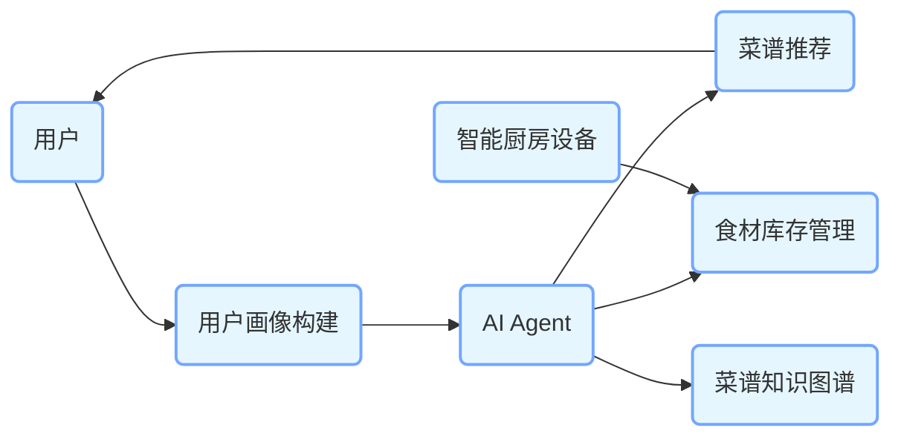

# 智能厨房：AI Agent的菜谱推荐与烹饪指导

> 关键词：智能厨房、AI Agent、菜谱推荐、烹饪指导、人工智能应用

> 摘要：本文围绕智能厨房中AI Agent的菜谱推荐与烹饪指导展开。详细阐述了相关核心概念、算法原理、数学模型，通过项目实战展示了代码实现及解读。探讨了其实际应用场景，推荐了学习资源、开发工具框架和相关论文著作。最后总结了未来发展趋势与挑战，并提供常见问题解答和扩展阅读参考。旨在为读者全面介绍智能厨房中AI Agent的应用，助力该领域的研究与实践。

## 1. 背景介绍 
### 1.1 目的和范围
随着科技的飞速发展，人工智能逐渐渗透到生活的各个领域，智能厨房便是其中一个极具潜力的应用场景。本文的目的在于深入探讨如何利用AI Agent实现智能厨房中的菜谱推荐与烹饪指导功能。范围涵盖了从核心概念的理解，到算法原理的剖析，再到实际项目的开发与应用，以及相关资源的推荐等方面，为读者构建一个全面的知识体系。

### 1.2 预期读者
本文预期读者包括对人工智能在智能家居领域应用感兴趣的技术爱好者、从事智能厨房相关项目开发的程序员和软件架构师、研究人工智能算法在实际场景应用的科研人员，以及希望了解智能厨房发展趋势的行业从业者。

### 1.3 文档结构概述
本文将按照以下结构展开：首先介绍核心概念与联系，帮助读者建立对智能厨房中AI Agent的基本认识；接着详细阐述核心算法原理和具体操作步骤，通过Python代码进行说明；然后介绍相关的数学模型和公式，并举例说明；再通过项目实战展示代码的实际应用和详细解释；之后探讨实际应用场景；推荐相关的工具和资源；最后总结未来发展趋势与挑战，提供常见问题解答和扩展阅读参考。

### 1.4 术语表
#### 1.4.1 核心术语定义
- **AI Agent（人工智能代理）**：是一种能够感知环境、根据自身的目标和知识进行决策，并采取行动以实现目标的智能实体。在智能厨房中，AI Agent可以感知用户的需求、厨房的食材信息等，为用户推荐合适的菜谱并提供烹饪指导。
- **菜谱推荐**：根据用户的个人偏好、食材库存、健康状况等因素，为用户推荐合适的菜谱。
- **烹饪指导**：在用户烹饪过程中，为用户提供详细的步骤说明、时间提醒、火候控制等指导信息。

#### 1.4.2 相关概念解释
- **智能厨房**：利用物联网、人工智能等技术，将厨房中的各种设备连接起来，实现设备的智能化控制和管理，为用户提供更加便捷、高效、个性化的烹饪体验。
- **机器学习**：是一门多领域交叉学科，涉及概率论、统计学、逼近论、凸分析、算法复杂度理论等多门学科。它专门研究计算机怎样模拟或实现人类的学习行为，以获取新的知识或技能，重新组织已有的知识结构使之不断改善自身的性能。在菜谱推荐中，机器学习算法可以用于分析用户的历史数据，预测用户的偏好。

#### 1.4.3 缩略词列表
- **AI**：Artificial Intelligence，人工智能
- **ML**：Machine Learning，机器学习
- **IoT**：Internet of Things，物联网

## 2. 核心概念与联系 

### 核心概念原理
在智能厨房中，AI Agent的菜谱推荐与烹饪指导功能主要基于以下几个核心概念：

#### 用户画像
用户画像是根据用户的基本信息、饮食习惯、健康状况、烹饪技能等因素构建的用户模型。通过分析用户画像，AI Agent可以了解用户的偏好和需求，从而为用户推荐合适的菜谱。例如，如果用户是素食主义者，AI Agent会推荐素食菜谱；如果用户有高血压，AI Agent会推荐低盐菜谱。

#### 食材库存管理
食材库存管理是指对厨房中的食材进行实时监测和管理。通过物联网技术，智能厨房设备可以感知食材的种类、数量、保质期等信息，并将这些信息传输给AI Agent。AI Agent根据食材库存信息，为用户推荐可以使用现有食材制作的菜谱。

#### 菜谱知识图谱
菜谱知识图谱是一种结构化的知识表示方法，它将菜谱的各种信息（如食材、步骤、烹饪方法、口味等）以图的形式表示出来。通过菜谱知识图谱，AI Agent可以快速检索和推理出符合用户需求的菜谱。例如，如果用户输入了“鸡肉”和“红烧”两个关键词，AI Agent可以通过菜谱知识图谱找到所有红烧鸡肉的菜谱。

### 架构的文本示意图
```plaintext
用户 -> 用户画像构建 -> AI Agent
                            |
                            |-> 菜谱推荐 -> 用户
                            |
                            |-> 食材库存管理 <- 智能厨房设备
                            |
                            |-> 菜谱知识图谱
```

### Mermaid流程图


## 3. 核心算法原理 & 具体操作步骤 

### 核心算法原理
在智能厨房的菜谱推荐与烹饪指导中，常用的算法包括协同过滤算法、基于内容的推荐算法和深度学习算法。下面以协同过滤算法为例进行详细介绍。

协同过滤算法是一种基于用户行为数据的推荐算法，它的基本思想是：如果两个用户对某些物品的评价相似，那么他们对其他物品的评价也可能相似。在菜谱推荐中，协同过滤算法可以根据用户的历史菜谱浏览记录、收藏记录、烹饪记录等数据，找到与当前用户兴趣相似的其他用户，然后将这些相似用户喜欢的菜谱推荐给当前用户。

### 具体操作步骤
#### 数据收集
收集用户的历史菜谱浏览记录、收藏记录、烹饪记录等数据，以及菜谱的相关信息（如食材、步骤、口味等）。

#### 数据预处理
对收集到的数据进行清洗、归一化等处理，以便后续的算法计算。

#### 相似度计算
计算用户之间的相似度，可以使用皮尔逊相关系数、余弦相似度等方法。

#### 推荐生成
根据用户之间的相似度，找到与当前用户兴趣相似的其他用户，然后将这些相似用户喜欢的菜谱推荐给当前用户。

### Python源代码详细阐述
```python
import numpy as np

# 定义用户-菜谱评分矩阵
user_recipe_matrix = np.array([
    [5, 3, 0, 1],
    [4, 0, 0, 1],
    [1, 1, 0, 5],
    [1, 0, 0, 4],
    [0, 1, 5, 4]
])

# 计算用户之间的余弦相似度
def cosine_similarity(user1, user2):
    dot_product = np.dot(user1, user2)
    norm_user1 = np.linalg.norm(user1)
    norm_user2 = np.linalg.norm(user2)
    return dot_product / (norm_user1 * norm_user2)

# 计算所有用户之间的相似度矩阵
num_users = user_recipe_matrix.shape[0]
similarity_matrix = np.zeros((num_users, num_users))
for i in range(num_users):
    for j in range(num_users):
        similarity_matrix[i][j] = cosine_similarity(user_recipe_matrix[i], user_recipe_matrix[j])

# 为指定用户推荐菜谱
def recommend_recipes(user_id, top_n=3):
    # 找到与当前用户最相似的其他用户
    similar_users = np.argsort(similarity_matrix[user_id])[::-1][1:top_n+1]
    # 初始化推荐菜谱列表
    recommended_recipes = []
    # 遍历相似用户的评分
    for similar_user in similar_users:
        for recipe_id, rating in enumerate(user_recipe_matrix[similar_user]):
            if rating > 0 and user_recipe_matrix[user_id][recipe_id] == 0:
                recommended_recipes.append(recipe_id)
    return recommended_recipes

# 为用户0推荐菜谱
user_id = 0
recommended_recipes = recommend_recipes(user_id)
print(f"为用户{user_id}推荐的菜谱ID：{recommended_recipes}")
```

## 4. 数学模型和公式 & 详细讲解 & 举例说明 

### 数学模型
在协同过滤算法中，常用的数学模型是用户-物品评分矩阵。假设我们有 $m$ 个用户和 $n$ 个物品，那么用户-物品评分矩阵 $R$ 是一个 $m \times n$ 的矩阵，其中 $R_{i,j}$ 表示用户 $i$ 对物品 $j$ 的评分。

### 公式
#### 余弦相似度公式
余弦相似度是一种常用的相似度计算方法，它的公式为：
$$
\cos(\vec{u}, \vec{v}) = \frac{\vec{u} \cdot \vec{v}}{\|\vec{u}\| \|\vec{v}\|}
$$
其中，$\vec{u}$ 和 $\vec{v}$ 分别表示两个用户的评分向量，$\vec{u} \cdot \vec{v}$ 表示向量的点积，$\|\vec{u}\|$ 和 $\|\vec{v}\|$ 分别表示向量的模。

#### 推荐分数公式
推荐分数可以根据用户之间的相似度和其他用户对物品的评分来计算，公式为：
$$
\text{推荐分数}_{i,j} = \sum_{k=1}^{m} \text{相似度}_{i,k} \times R_{k,j}
$$
其中，$\text{推荐分数}_{i,j}$ 表示为用户 $i$ 推荐物品 $j$ 的分数，$\text{相似度}_{i,k}$ 表示用户 $i$ 和用户 $k$ 之间的相似度，$R_{k,j}$ 表示用户 $k$ 对物品 $j$ 的评分。

### 详细讲解
余弦相似度公式通过计算两个向量之间的夹角余弦值来衡量它们的相似度。当两个向量的夹角为 $0$ 度时，余弦值为 $1$，表示两个向量完全相同；当两个向量的夹角为 $90$ 度时，余弦值为 $0$，表示两个向量完全不相关。

推荐分数公式通过将其他用户对物品的评分乘以与当前用户的相似度，然后求和得到推荐分数。相似度越高的用户对推荐分数的影响越大。

### 举例说明
假设我们有三个用户 $A$、$B$、$C$ 和三个物品 $X$、$Y$、$Z$，用户-物品评分矩阵如下：
$$
R = \begin{bmatrix}
5 & 3 & 0 \\
4 & 0 & 1 \\
1 & 1 & 5
\end{bmatrix}
$$
我们要为用户 $A$ 推荐物品，首先计算用户 $A$ 与用户 $B$、$C$ 的余弦相似度：
- 用户 $A$ 的评分向量为 $\vec{A} = [5, 3, 0]$
- 用户 $B$ 的评分向量为 $\vec{B} = [4, 0, 1]$
- 用户 $C$ 的评分向量为 $\vec{C} = [1, 1, 5]$

计算用户 $A$ 与用户 $B$ 的余弦相似度：
$$
\cos(\vec{A}, \vec{B}) = \frac{\vec{A} \cdot \vec{B}}{\|\vec{A}\| \|\vec{B}\|} = \frac{5 \times 4 + 3 \times 0 + 0 \times 1}{\sqrt{5^2 + 3^2 + 0^2} \sqrt{4^2 + 0^2 + 1^2}} \approx 0.87
$$

计算用户 $A$ 与用户 $C$ 的余弦相似度：
$$
\cos(\vec{A}, \vec{C}) = \frac{\vec{A} \cdot \vec{C}}{\|\vec{A}\| \|\vec{C}\|} = \frac{5 \times 1 + 3 \times 1 + 0 \times 5}{\sqrt{5^2 + 3^2 + 0^2} \sqrt{1^2 + 1^2 + 5^2}} \approx 0.27
$$

假设我们要为用户 $A$ 推荐物品 $Z$，根据推荐分数公式计算推荐分数：
$$
\text{推荐分数}_{A,Z} = \cos(\vec{A}, \vec{B}) \times R_{B,Z} + \cos(\vec{A}, \vec{C}) \times R_{C,Z} = 0.87 \times 1 + 0.27 \times 5 \approx 2.22
$$

根据推荐分数，我们可以为用户 $A$ 推荐物品 $Z$。

## 5. 项目实战：代码实际案例和详细解释说明 

### 5.1  开发环境搭建
#### 操作系统
建议使用 Linux 或 macOS 操作系统，因为它们对 Python 开发环境的支持更好。

#### Python 版本
建议使用 Python 3.7 及以上版本。

#### 安装依赖库
在项目中，我们需要使用以下依赖库：
- `numpy`：用于数值计算
- `pandas`：用于数据处理
- `scikit-learn`：用于机器学习算法

可以使用以下命令安装这些依赖库：
```sh
pip install numpy pandas scikit-learn
```

### 5.2  源代码详细实现和代码解读
```python
import numpy as np
import pandas as pd
from sklearn.metrics.pairwise import cosine_similarity

# 读取用户-菜谱评分数据
data = pd.read_csv('user_recipe_ratings.csv')

# 创建用户-菜谱评分矩阵
user_recipe_matrix = data.pivot(index='user_id', columns='recipe_id', values='rating').fillna(0)

# 计算用户之间的相似度矩阵
user_similarity = cosine_similarity(user_recipe_matrix)

# 为指定用户推荐菜谱
def recommend_recipes(user_id, top_n=3):
    # 获取当前用户在矩阵中的索引
    user_index = user_recipe_matrix.index.get_loc(user_id)
    # 找到与当前用户最相似的其他用户
    similar_users = np.argsort(user_similarity[user_index])[::-1][1:top_n+1]
    # 初始化推荐菜谱列表
    recommended_recipes = []
    # 遍历相似用户的评分
    for similar_user_index in similar_users:
        similar_user_id = user_recipe_matrix.index[similar_user_index]
        for recipe_id, rating in user_recipe_matrix.loc[similar_user_id].items():
            if rating > 0 and user_recipe_matrix.loc[user_id, recipe_id] == 0:
                recommended_recipes.append(recipe_id)
    return recommended_recipes

# 为用户1推荐菜谱
user_id = 1
recommended_recipes = recommend_recipes(user_id)
print(f"为用户{user_id}推荐的菜谱ID：{recommended_recipes}")
```

### 代码解读与分析
#### 数据读取
使用 `pandas` 库的 `read_csv` 函数读取用户-菜谱评分数据，存储在 `data` 变量中。

#### 用户-菜谱评分矩阵创建
使用 `pandas` 库的 `pivot` 函数将数据转换为用户-菜谱评分矩阵，缺失值用 $0$ 填充。

#### 相似度计算
使用 `scikit-learn` 库的 `cosine_similarity` 函数计算用户之间的余弦相似度矩阵。

#### 菜谱推荐
定义 `recommend_recipes` 函数，根据用户之间的相似度为指定用户推荐菜谱。具体步骤如下：
1. 获取当前用户在矩阵中的索引。
2. 找到与当前用户最相似的其他用户。
3. 遍历相似用户的评分，将当前用户未评分且相似用户评分大于 $0$ 的菜谱添加到推荐列表中。

最后，调用 `recommend_recipes` 函数为用户 $1$ 推荐菜谱，并打印推荐结果。

## 6. 实际应用场景 
### 家庭厨房
在家庭厨房中，AI Agent的菜谱推荐与烹饪指导功能可以为家庭成员提供个性化的菜谱推荐。例如，根据家庭成员的口味偏好、健康状况和食材库存，为他们推荐合适的菜谱。在烹饪过程中，AI Agent可以通过语音提示、视频教程等方式为用户提供详细的烹饪指导，帮助用户轻松制作出美味的菜肴。

### 餐厅厨房
在餐厅厨房中，AI Agent可以根据餐厅的菜品特色、顾客的订单信息和食材库存，为厨师推荐合适的菜谱。同时，AI Agent可以实时监测烹饪过程，提供火候控制、时间提醒等指导信息，提高菜品的质量和烹饪效率。

### 智能厨房设备制造商
智能厨房设备制造商可以将AI Agent的菜谱推荐与烹饪指导功能集成到智能厨房设备中，为用户提供更加智能化的烹饪体验。例如，智能炉灶可以根据AI Agent的指导自动调节火候，智能烤箱可以根据菜谱自动设置烤制时间和温度。

## 7. 工具和资源推荐
### 7.1 学习资源推荐
#### 7.1.1 书籍推荐
- 《人工智能：一种现代的方法》：全面介绍了人工智能的基本概念、算法和应用，是人工智能领域的经典教材。
- 《Python机器学习实战》：通过实际案例介绍了Python在机器学习中的应用，适合初学者入门。
- 《推荐系统实践》：详细介绍了推荐系统的原理、算法和应用，是推荐系统领域的权威书籍。

#### 7.1.2 在线课程
- Coursera上的“机器学习”课程：由斯坦福大学教授Andrew Ng主讲，是机器学习领域的经典课程。
- edX上的“人工智能基础”课程：介绍了人工智能的基本概念、算法和应用，适合初学者入门。
- Udemy上的“Python数据分析实战”课程：通过实际案例介绍了Python在数据分析中的应用，适合想要学习数据分析的读者。

#### 7.1.3 技术博客和网站
- 博客园：国内知名的技术博客网站，有很多关于人工智能、机器学习和推荐系统的技术文章。
- 知乎：国内知名的知识问答社区，有很多关于人工智能和智能厨房的讨论和分享。
- Medium：国外知名的技术博客平台，有很多关于人工智能和机器学习的前沿技术文章。

### 7.2 开发工具框架推荐
#### 7.2.1 IDE和编辑器
- PyCharm：是一款专门为Python开发设计的集成开发环境，具有代码编辑、调试、版本控制等功能，适合专业的Python开发者。
- Jupyter Notebook：是一款基于Web的交互式开发环境，适合数据科学家和机器学习工程师进行数据探索和模型开发。
- Visual Studio Code：是一款轻量级的代码编辑器，支持多种编程语言和插件扩展，适合初学者和快速开发。

#### 7.2.2 调试和性能分析工具
- PDB：是Python自带的调试工具，可以帮助开发者定位代码中的错误。
- cProfile：是Python自带的性能分析工具，可以帮助开发者分析代码的性能瓶颈。
- TensorBoard：是TensorFlow的可视化工具，可以帮助开发者可视化模型的训练过程和性能指标。

#### 7.2.3 相关框架和库
- TensorFlow：是Google开发的开源机器学习框架，支持深度学习、强化学习等多种机器学习算法。
- PyTorch：是Facebook开发的开源深度学习框架，具有动态图、易于使用等特点。
- Scikit-learn：是Python的机器学习库，提供了丰富的机器学习算法和工具，适合初学者和快速开发。

### 7.3 相关论文著作推荐
#### 7.3.1 经典论文
- “Item-based Collaborative Filtering Recommendation Algorithms”：介绍了基于物品的协同过滤推荐算法，是推荐系统领域的经典论文。
- “Deep Learning”：由Yoshua Bengio、Ian Goodfellow和Aaron Courville撰写，是深度学习领域的权威综述论文。
- “Recommender Systems Handbook”：是推荐系统领域的权威著作，全面介绍了推荐系统的原理、算法和应用。

#### 7.3.2 最新研究成果
- 在ACM SIGKDD、NeurIPS、ICML等顶级学术会议上发表的关于人工智能、机器学习和推荐系统的最新研究成果。
- 在《Journal of Artificial Intelligence Research》、《Artificial Intelligence》等顶级学术期刊上发表的关于人工智能和机器学习的最新研究成果。

#### 7.3.3 应用案例分析
- 《智能厨房：从概念到现实》：介绍了智能厨房的发展现状和应用案例，适合想要了解智能厨房应用的读者。
- 《人工智能在智能家居中的应用》：介绍了人工智能在智能家居领域的应用案例，包括智能厨房、智能安防等方面。

## 8. 总结：未来发展趋势与挑战
### 未来发展趋势
#### 个性化推荐更加精准
随着用户数据的不断积累和机器学习算法的不断发展，AI Agent的菜谱推荐将更加精准地满足用户的个性化需求。例如，根据用户的实时健康状况、运动情况等因素，为用户推荐更加健康、营养的菜谱。

#### 多模态交互更加自然
未来的智能厨房将支持更加自然的多模态交互方式，如语音交互、手势交互、眼神交互等。用户可以通过语音指令告诉AI Agent自己的需求，AI Agent可以通过语音、图像等方式为用户提供更加直观、便捷的烹饪指导。

#### 与物联网深度融合
智能厨房将与物联网技术深度融合，实现厨房设备的智能化控制和管理。例如，智能冰箱可以自动检测食材的库存和保质期，并将信息反馈给AI Agent；智能炉灶可以根据AI Agent的指导自动调节火候。

### 挑战
#### 数据隐私和安全问题
智能厨房需要收集大量的用户数据，如用户的个人信息、饮食习惯、健康状况等。如何保护这些数据的隐私和安全，是智能厨房发展面临的重要挑战。

#### 算法的可解释性问题
深度学习等复杂算法在智能厨房的菜谱推荐和烹饪指导中取得了很好的效果，但这些算法往往缺乏可解释性。如何提高算法的可解释性，让用户更好地理解推荐结果和烹饪指导，是需要解决的问题。

#### 技术标准和规范问题
目前，智能厨房领域缺乏统一的技术标准和规范，不同品牌的智能厨房设备之间难以实现互联互通。如何制定统一的技术标准和规范，促进智能厨房产业的健康发展，是需要解决的问题。

## 9. 附录：常见问题与解答
### 问题1：AI Agent的菜谱推荐是否考虑了食材的季节性？
解答：是的，在实际应用中，AI Agent可以考虑食材的季节性因素。通过收集和分析不同季节的食材信息，AI Agent可以在菜谱推荐时优先推荐当季的食材，以保证菜品的新鲜度和口感。

### 问题2：如果用户对推荐的菜谱不满意怎么办？
解答：如果用户对推荐的菜谱不满意，可以通过反馈机制向AI Agent提供反馈信息，如不喜欢的菜谱类型、口味偏好等。AI Agent会根据用户的反馈信息调整推荐策略，为用户提供更加符合需求的菜谱。

### 问题3：智能厨房设备的互联互通需要满足哪些条件？
解答：智能厨房设备的互联互通需要满足以下条件：
1. 设备支持物联网技术，能够通过网络进行数据传输。
2. 设备遵循统一的通信协议和接口标准，以便不同品牌的设备之间能够相互通信和交互。
3. 具备相应的云平台或中间件，用于实现设备的集中管理和控制。

## 10. 扩展阅读 & 参考资料
### 扩展阅读
- 《智能家居：未来生活的新趋势》：介绍了智能家居的发展现状和未来趋势，包括智能厨房、智能安防、智能照明等方面。
- 《人工智能与未来社会》：探讨了人工智能对未来社会的影响，包括就业、教育、医疗等方面。

### 参考资料
- [1] 周志华. 机器学习. 清华大学出版社, 2016.
- [2] 李航. 统计学习方法（第2版）. 清华大学出版社, 2019.
- [3] [TensorFlow官方文档](https://www.tensorflow.org/)
- [4] [PyTorch官方文档](https://pytorch.org/)
- [5] [Scikit-learn官方文档](https://scikit-learn.org/)

作者：AI天才研究院/AI Genius Institute & 禅与计算机程序设计艺术 /Zen And The Art of Computer Programming