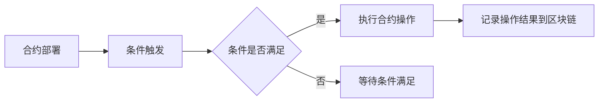

# 智能合约技术在法律服务领域的应用前景

> 关键词：智能合约技术、法律服务领域、应用前景、区块链、法律自动化

> 摘要：本文深入探讨了智能合约技术在法律服务领域的应用前景。首先介绍了智能合约的背景知识，包括其概念、原理和架构。接着详细阐述了智能合约在法律服务中的核心算法原理和具体操作步骤，并用 Python 代码进行了说明。通过数学模型和公式进一步解释了智能合约的运行机制。结合项目实战，展示了智能合约在法律服务中的具体实现和代码解读。分析了智能合约在法律服务领域的实际应用场景，推荐了相关的学习资源、开发工具和论文著作。最后总结了智能合约技术在法律服务领域的未来发展趋势与挑战，并对常见问题进行了解答。旨在为法律从业者和技术人员提供全面的参考，推动智能合约技术在法律服务领域的广泛应用。

## 1. 背景介绍 
### 1.1 目的和范围
本部分旨在全面且深入地剖析智能合约技术在法律服务领域的应用前景。具体范围涵盖智能合约的核心概念、实现原理、在法律服务中的具体应用场景、相关的数学模型、项目实战案例以及未来的发展趋势和挑战等方面。通过对这些内容的研究，为法律从业者、技术开发者以及相关研究人员提供一个清晰的认识，以便更好地把握智能合约技术在法律服务领域的发展方向。

### 1.2 预期读者
本文预期读者主要包括以下几类人群：
- 法律从业者：如律师、法官、法律研究员等，他们可以通过本文了解智能合约技术如何辅助法律工作，提高工作效率和服务质量。
- 技术开发者：包括区块链开发者、软件工程师等，能够从文中获取智能合约在法律服务领域的具体应用需求，为开发相关产品提供思路。
- 企业管理人员：关注法律合规和数字化转型的企业管理人员，了解智能合约技术在降低法律风险、优化业务流程方面的作用。
- 学术研究人员：对区块链技术和法律交叉领域感兴趣的研究人员，为他们的学术研究提供参考和启发。

### 1.3 文档结构概述
本文将按照以下结构进行阐述：
- 核心概念与联系：介绍智能合约的基本概念、原理和架构，通过文本示意图和 Mermaid 流程图进行直观展示。
- 核心算法原理 & 具体操作步骤：详细讲解智能合约的核心算法原理，并使用 Python 源代码进行说明。
- 数学模型和公式 & 详细讲解 & 举例说明：运用数学模型和公式解释智能合约的运行机制，并给出具体的应用示例。
- 项目实战：代码实际案例和详细解释说明：通过实际项目案例，展示智能合约在法律服务中的具体实现过程，并对代码进行详细解读。
- 实际应用场景：分析智能合约在法律服务领域的具体应用场景，如合同管理、证据保全、纠纷解决等。
- 工具和资源推荐：推荐与智能合约开发和法律服务相关的学习资源、开发工具和论文著作。
- 总结：未来发展趋势与挑战：总结智能合约技术在法律服务领域的发展趋势，分析面临的挑战和应对策略。
- 附录：常见问题与解答：对读者可能关心的常见问题进行解答。
- 扩展阅读 & 参考资料：提供相关的扩展阅读材料和参考资料，方便读者进一步深入研究。

### 1.4 术语表
#### 1.4.1 核心术语定义
- 智能合约（Smart Contract）：一种基于区块链技术的数字化合约，它以代码形式编写，能够自动执行合约条款，无需第三方干预。
- 区块链（Blockchain）：一种分布式账本技术，由多个节点组成，通过密码学算法保证数据的不可篡改和透明性。
- 去中心化（Decentralization）：指系统不依赖于单一的中心节点，而是由多个节点共同参与管理和决策，提高系统的可靠性和安全性。
- 哈希函数（Hash Function）：一种将任意长度的输入数据转换为固定长度输出的函数，常用于数据的完整性验证和加密。
- 智能合约虚拟机（Smart Contract Virtual Machine）：一种用于执行智能合约代码的虚拟环境，如以太坊的以太坊虚拟机（EVM）。

#### 1.4.2 相关概念解释
- 智能合约与传统合约的区别：传统合约通常以纸质或电子文档形式存在，需要人工执行和监督；而智能合约以代码形式存在于区块链上，能够自动执行合约条款，减少人为干预和错误。
- 区块链的共识机制：为了保证区块链网络中数据的一致性和安全性，需要一种共识机制来让各个节点达成共识。常见的共识机制包括工作量证明（PoW）、权益证明（PoS）等。
- 智能合约的可扩展性：指智能合约在处理大量交易和复杂业务逻辑时的能力，可扩展性是智能合约技术发展的重要挑战之一。

#### 1.4.3 缩略词列表
- EVM：Ethereum Virtual Machine，以太坊虚拟机
- PoW：Proof of Work，工作量证明
- PoS：Proof of Stake，权益证明
- DApp：Decentralized Application，去中心化应用

## 2. 核心概念与联系 

### 2.1 智能合约的概念
智能合约是一种自我执行的数字化合约，它将合约条款以代码的形式编写，并部署到区块链上。当满足预设的条件时，智能合约会自动执行相应的操作，无需第三方的干预。智能合约的核心思想是将法律规则和业务逻辑转化为计算机代码，通过区块链的分布式账本技术保证合约的不可篡改和透明性。

### 2.2 智能合约的原理
智能合约的运行基于区块链的分布式账本和共识机制。当一个智能合约被部署到区块链上时，它会被复制到每个节点上。当触发合约的条件满足时，各个节点会根据合约代码执行相应的操作，并将结果记录在区块链上。由于区块链的不可篡改特性，一旦操作被记录，就无法被修改，保证了合约的执行结果的可靠性。

### 2.3 智能合约的架构
智能合约的架构主要包括以下几个部分：
- 合约代码：实现合约条款和业务逻辑的代码。
- 合约数据：存储合约相关的数据，如合约参与方的信息、合约状态等。
- 区块链网络：提供合约的存储和执行环境，保证合约的不可篡改和透明性。
- 智能合约虚拟机：用于执行合约代码的虚拟环境。

### 2.4 文本示意图
```plaintext
+---------------------+
|     智能合约代码    |
+---------------------+
|     智能合约数据    |
+---------------------+
|     区块链网络      |
+---------------------+
|  智能合约虚拟机    |
+---------------------+
```

### 2.5 Mermaid 流程图


## 3. 核心算法原理 & 具体操作步骤 

### 3.1 核心算法原理
智能合约的核心算法主要包括哈希函数、加密算法和共识算法。

#### 3.1.1 哈希函数
哈希函数用于将任意长度的输入数据转换为固定长度的输出，通常用于数据的完整性验证和加密。常见的哈希函数有 SHA-256、MD5 等。在智能合约中，哈希函数用于对合约代码和数据进行哈希计算，确保数据的完整性。

以下是使用 Python 实现 SHA-256 哈希计算的示例代码：
```python
import hashlib

data = "Hello, World!"
hash_object = hashlib.sha256(data.encode())
hex_dig = hash_object.hexdigest()
print(hex_dig)
```

#### 3.1.2 加密算法
加密算法用于保护智能合约中的敏感数据，确保数据的安全性。常见的加密算法有 RSA、AES 等。在智能合约中，加密算法可以用于对合约参与方的身份信息和交易数据进行加密。

以下是使用 Python 实现 AES 加密和解密的示例代码：
```python
from Crypto.Cipher import AES
from Crypto.Util.Padding import pad, unpad
import os

# 生成密钥
key = os.urandom(16)
cipher = AES.new(key, AES.MODE_CBC)

# 待加密的数据
data = "Hello, World!".encode()
padded_data = pad(data, AES.block_size)

# 加密数据
ciphertext = cipher.encrypt(padded_data)
iv = cipher.iv

# 解密数据
decipher = AES.new(key, AES.MODE_CBC, iv)
decrypted_data = decipher.decrypt(ciphertext)
unpadded_data = unpad(decrypted_data, AES.block_size)

print(unpadded_data.decode())
```

#### 3.1.3 共识算法
共识算法用于保证区块链网络中各个节点对数据的一致性和安全性达成共识。常见的共识算法有工作量证明（PoW）、权益证明（PoS）等。在智能合约中，共识算法确保合约的执行结果在各个节点上是一致的。

### 3.2 具体操作步骤
#### 3.2.1 合约编写
使用智能合约编程语言（如 Solidity）编写合约代码，实现合约条款和业务逻辑。

以下是一个简单的 Solidity 智能合约示例：
```solidity
pragma solidity ^0.8.0;

contract SimpleContract {
    uint public value;

    constructor(uint _value) {
        value = _value;
    }

    function setValue(uint _newValue) public {
        value = _newValue;
    }
}
```

#### 3.2.2 合约部署
将编写好的合约代码部署到区块链网络上。部署过程通常需要支付一定的费用（如以太坊的 Gas 费用）。

#### 3.2.3 合约调用
当满足合约的触发条件时，通过区块链网络调用合约的函数，执行相应的操作。

#### 3.2.4 合约监控
监控合约的执行状态和结果，确保合约按照预期执行。

## 4. 数学模型和公式 & 详细讲解 & 举例说明 

### 4.1 哈希函数的数学模型
哈希函数可以表示为一个映射 $H: X \rightarrow Y$，其中 $X$ 是输入数据的集合，$Y$ 是固定长度的输出数据的集合。哈希函数具有以下特性：
- 确定性：对于相同的输入，哈希函数总是产生相同的输出。
- 快速计算：哈希函数的计算速度应该足够快。
- 抗碰撞性：很难找到两个不同的输入 $x_1$ 和 $x_2$，使得 $H(x_1) = H(x_2)$。

例如，SHA-256 哈希函数的输出长度为 256 位，它将任意长度的输入数据映射到一个 256 位的二进制字符串。

### 4.2 加密算法的数学模型
加密算法可以分为对称加密算法和非对称加密算法。

#### 4.2.1 对称加密算法
对称加密算法使用相同的密钥进行加密和解密。设明文为 $P$，密钥为 $K$，加密函数为 $E$，解密函数为 $D$，则加密过程可以表示为 $C = E(P, K)$，解密过程可以表示为 $P = D(C, K)$。

例如，AES 是一种常见的对称加密算法，它使用固定长度的密钥（如 128 位、192 位或 256 位）对数据进行加密和解密。

#### 4.2.2 非对称加密算法
非对称加密算法使用一对密钥，即公钥 $K_p$ 和私钥 $K_s$。加密过程使用公钥，解密过程使用私钥。设明文为 $P$，加密函数为 $E$，解密函数为 $D$，则加密过程可以表示为 $C = E(P, K_p)$，解密过程可以表示为 $P = D(C, K_s)$。

例如，RSA 是一种常见的非对称加密算法，它基于大整数分解的困难性。

### 4.3 共识算法的数学模型
以工作量证明（PoW）为例，其数学模型可以描述为以下过程：
设区块链网络中的一个节点需要找到一个满足特定条件的随机数 $n$，使得哈希函数 $H(B, n)$ 的结果小于某个阈值 $T$，其中 $B$ 是当前区块的信息。节点通过不断尝试不同的随机数 $n$ 来满足这个条件，一旦找到满足条件的随机数，就可以将该区块添加到区块链上。

### 4.4 举例说明
假设我们有一个简单的智能合约，用于记录两个用户之间的交易。合约代码如下：
```solidity
pragma solidity ^0.8.0;

contract TransactionContract {
    address public sender;
    address public receiver;
    uint public amount;
    bool public isCompleted;

    constructor(address _sender, address _receiver, uint _amount) {
        sender = _sender;
        receiver = _receiver;
        amount = _amount;
        isCompleted = false;
    }

    function completeTransaction() public {
        require(msg.sender == sender, "Only the sender can complete the transaction.");
        isCompleted = true;
    }
}
```

在这个合约中，我们使用了以太坊的地址类型（`address`）来表示用户的身份，使用 `uint` 类型来表示交易金额，使用 `bool` 类型来表示交易是否完成。合约的构造函数用于初始化合约的状态，`completeTransaction` 函数用于完成交易。

当用户调用 `completeTransaction` 函数时，合约会检查调用者是否为发送方，如果是，则将 `isCompleted` 标志设置为 `true`，表示交易完成。这个过程可以通过哈希函数和加密算法来保证数据的完整性和安全性，通过共识算法来保证合约的执行结果在各个节点上是一致的。

## 5. 项目实战：代码实际案例和详细解释说明 

### 5.1  开发环境搭建
#### 5.1.1 安装 Node.js 和 npm
Node.js 是一个基于 Chrome V8 引擎的 JavaScript 运行环境，npm 是 Node.js 的包管理工具。可以从 Node.js 官方网站（https://nodejs.org/）下载并安装 Node.js，安装完成后，npm 会自动安装。

#### 5.1.2 安装 Truffle
Truffle 是一个流行的以太坊开发框架，用于开发、测试和部署智能合约。可以使用 npm 安装 Truffle：
```bash
npm install -g truffle
```

#### 5.1.3 安装 Ganache
Ganache 是一个本地以太坊开发网络，用于模拟以太坊区块链环境。可以从 Ganache 官方网站（https://www.trufflesuite.com/ganache）下载并安装 Ganache。

### 5.2  源代码详细实现和代码解读
#### 5.2.1 创建 Truffle 项目
使用 Truffle 创建一个新的项目：
```bash
truffle init
```

#### 5.2.2 编写智能合约
在 `contracts` 目录下创建一个新的 Solidity 文件，例如 `LegalContract.sol`，代码如下：
```solidity
pragma solidity ^0.8.0;

contract LegalContract {
    address public client;
    address public lawyer;
    uint public fee;
    bool public isCompleted;

    constructor(address _client, address _lawyer, uint _fee) {
        client = _client;
        lawyer = _lawyer;
        fee = _fee;
        isCompleted = false;
    }

    function payFee() public payable {
        require(msg.sender == client, "Only the client can pay the fee.");
        require(msg.value == fee, "The paid amount must match the fee.");
        payable(lawyer).transfer(msg.value);
        isCompleted = true;
    }
}
```

#### 5.2.3 编写迁移脚本
在 `migrations` 目录下创建一个新的迁移脚本文件，例如 `2_deploy_legal_contract.js`，代码如下：
```javascript
const LegalContract = artifacts.require("LegalContract");

module.exports = function (deployer) {
    const client = "0xYourClientAddress";
    const lawyer = "0xYourLawyerAddress";
    const fee = 1000000000000000000; // 1 Ether

    deployer.deploy(LegalContract, client, lawyer, fee);
};
```

#### 5.2.4 部署智能合约
启动 Ganache，然后在终端中运行以下命令部署智能合约：
```bash
truffle migrate --network development
```

### 5.3  代码解读与分析
#### 5.3.1 智能合约代码解读
- `client` 和 `lawyer`：分别表示合约的客户端和律师的地址。
- `fee`：表示律师的服务费用。
- `isCompleted`：表示合约是否完成的标志。
- `constructor`：合约的构造函数，用于初始化合约的状态。
- `payFee`：客户端支付费用的函数，要求调用者必须是客户端，支付的金额必须等于服务费用。支付成功后，将费用转移给律师，并将 `isCompleted` 标志设置为 `true`。

#### 5.3.2 迁移脚本代码解读
- `LegalContract`：通过 `artifacts.require` 引入智能合约。
- `deployer.deploy`：使用 `deployer` 对象部署智能合约，并传入客户端地址、律师地址和服务费用作为参数。

#### 5.3.3 部署过程分析
- 启动 Ganache 后，Truffle 会连接到 Ganache 提供的本地以太坊网络。
- 运行 `truffle migrate` 命令时，Truffle 会根据迁移脚本将智能合约部署到以太坊网络上。
- 部署成功后，智能合约会获得一个唯一的地址，可以通过该地址调用合约的函数。

## 6. 实际应用场景 
### 6.1 合同管理
智能合约可以用于自动化合同管理流程。在传统的合同管理中，合同的签订、执行和监督需要人工干预，容易出现错误和纠纷。而智能合约可以将合同条款以代码的形式编写，并自动执行合约条款。例如，当满足合同约定的条件时，智能合约可以自动支付款项、交付货物等。这样可以提高合同管理的效率，减少人为错误和纠纷。

### 6.2 证据保全
在法律诉讼中，证据的保全和真实性是非常重要的。智能合约可以利用区块链的不可篡改特性，将证据以加密的形式存储在区块链上。一旦证据被存储，就无法被修改或删除，保证了证据的真实性和完整性。例如，在知识产权保护领域，创作者可以将作品的版权信息和创作时间等证据存储在区块链上，当发生侵权纠纷时，可以通过区块链上的证据来证明自己的权益。

### 6.3 纠纷解决
智能合约可以用于自动化纠纷解决流程。在传统的纠纷解决中，需要通过法院或仲裁机构进行调解和裁决，过程繁琐且耗时。而智能合约可以根据预设的规则自动处理纠纷。例如，在保险理赔领域，智能合约可以根据保险条款和理赔条件自动判断是否给予理赔，并自动支付理赔款项。这样可以提高纠纷解决的效率，降低成本。

### 6.4 法律合规
智能合约可以帮助企业和组织实现法律合规。通过将法律规则和合规要求以代码的形式编写到智能合约中，企业和组织可以在业务操作过程中自动遵守法律规定。例如，在金融领域，智能合约可以根据反洗钱和反恐融资等法规要求，对交易进行实时监控和审查，确保交易的合规性。

### 6.5 产权登记
智能合约可以用于产权登记，如房地产产权、知识产权等。通过将产权信息存储在区块链上，并使用智能合约进行产权转移和变更的管理，可以提高产权登记的效率和准确性，减少产权纠纷。例如，在房地产交易中，智能合约可以自动验证买卖双方的身份和产权信息，当满足交易条件时，自动完成产权转移和款项支付。

## 7. 工具和资源推荐
### 7.1 学习资源推荐
#### 7.1.1 书籍推荐
- 《区块链：技术驱动金融》：这本书全面介绍了区块链的技术原理和应用场景，包括智能合约的相关知识。
- 《Solidity实战：以太坊智能合约开发指南》：详细介绍了 Solidity 编程语言和以太坊智能合约的开发方法。
- 《精通以太坊》：深入讲解了以太坊的底层技术和智能合约开发的高级技巧。

#### 7.1.2 在线课程
- Coursera 上的“区块链基础”课程：由专业的教授授课，系统地介绍了区块链的基本概念和技术。
- Udemy 上的“以太坊和 Solidity：完整的开发者指南”课程：通过实际项目案例，详细讲解了以太坊智能合约的开发过程。
- edX 上的“区块链技术与应用”课程：结合实际应用场景，介绍了区块链技术在各个领域的应用，包括智能合约在法律服务领域的应用。

#### 7.1.3 技术博客和网站
- Ethereum 官方博客：提供了以太坊最新的技术动态和开发文档。
- Medium 上的区块链相关博客：有很多区块链开发者和研究者分享的技术文章和经验。
- 巴比特：国内知名的区块链资讯平台，提供了丰富的区块链技术和应用的相关文章。

### 7.2 开发工具框架推荐
#### 7.2.1 IDE和编辑器
- Visual Studio Code：一款功能强大的代码编辑器，支持多种编程语言和插件，有很多与区块链开发相关的插件可供选择。
- Remix：以太坊官方推荐的在线智能合约开发 IDE，无需安装，可直接在浏览器中使用。
- Truffle Suite：一套用于以太坊智能合约开发、测试和部署的工具集，提供了丰富的命令行工具和开发框架。

#### 7.2.2 调试和性能分析工具
- Ganache：本地以太坊开发网络，用于模拟以太坊区块链环境，方便开发者进行智能合约的调试和测试。
- Truffle Debugger：Truffle 提供的调试工具，可用于调试智能合约代码。
- Solidity Linter：用于检查 Solidity 代码的语法错误和代码风格问题，提高代码的质量。

#### 7.2.3 相关框架和库
- Web3.js：以太坊官方提供的 JavaScript 库，用于与以太坊区块链进行交互。
- OpenZeppelin：一套用于开发安全智能合约的库，提供了很多常用的智能合约模板和工具。
- Truffle Boxes：Truffle 提供的项目模板，包含了常见的智能合约开发场景和示例代码。

### 7.3 相关论文著作推荐
#### 7.3.1 经典论文
- “Bitcoin: A Peer-to-Peer Electronic Cash System”：比特币的白皮书，介绍了比特币的基本原理和区块链的概念。
- “Ethereum: A Next-Generation Smart Contract and Decentralized Application Platform”：以太坊的白皮书，详细阐述了以太坊的智能合约和去中心化应用平台的设计理念。
- “The Future of the Law: How Technology Will Reshape the Legal Profession”：探讨了技术对法律行业的影响，包括智能合约在法律服务领域的应用前景。

#### 7.3.2 最新研究成果
- 可以关注顶级学术期刊如《Journal of Law and Technology》、《Harvard Journal of Law and Technology》等，获取智能合约在法律服务领域的最新研究成果。
- 参加国际学术会议如 IEEE International Conference on Blockchain and Cryptocurrency 等，了解行业内的最新动态和研究进展。

#### 7.3.3 应用案例分析
- 可以通过研究实际的智能合约应用案例，了解智能合约在法律服务领域的具体应用情况和效果。例如，一些区块链技术公司发布的智能合约在合同管理、证据保全等方面的应用案例。

## 8. 总结：未来发展趋势与挑战
### 8.1 未来发展趋势
#### 8.1.1 与人工智能的融合
智能合约与人工智能的融合将是未来的一个重要发展趋势。人工智能可以为智能合约提供更强大的数据分析和决策能力，例如通过机器学习算法对合同条款进行自动审查和风险评估。智能合约则可以为人工智能提供可信的执行环境，确保人工智能模型的输出能够按照预设的规则得到执行。

#### 8.1.2 跨链互操作性
随着区块链技术的发展，不同的区块链网络之间的互操作性将变得越来越重要。智能合约需要能够在不同的区块链网络之间进行交互和执行，实现跨链的合同管理和交易。这将促进区块链生态系统的发展，扩大智能合约的应用范围。

#### 8.1.3 行业标准化
为了促进智能合约在法律服务领域的广泛应用，行业标准化将是必不可少的。制定统一的智能合约标准和规范，包括合约语言、接口、安全机制等方面的标准，可以提高智能合约的兼容性和可移植性，降低开发成本和风险。

#### 8.1.4 法律监管的完善
随着智能合约的应用越来越广泛，法律监管也将逐渐完善。政府和监管机构将制定相关的法律法规，对智能合约的合法性、合规性和安全性进行监管。这将为智能合约的发展提供更加稳定和可靠的法律环境。

### 8.2 挑战
#### 8.2.1 技术瓶颈
智能合约技术仍然面临一些技术瓶颈，如可扩展性、性能和安全性等方面的问题。在处理大量交易和复杂业务逻辑时，智能合约的性能可能会受到影响。同时，智能合约的安全性也是一个重要的问题，一旦合约代码存在漏洞，可能会导致严重的安全事故。

#### 8.2.2 法律合规问题
智能合约的法律地位和合规性仍然存在一些争议。由于智能合约是一种新兴的技术，现有的法律法规可能无法完全适用于智能合约。在智能合约的应用过程中，需要解决法律解释、合同有效性、纠纷解决等方面的法律问题。

#### 8.2.3 人才短缺
智能合约的开发和应用需要具备区块链技术、编程语言、法律知识等多方面的专业人才。目前，这类复合型人才相对短缺，制约了智能合约技术在法律服务领域的发展。

#### 8.2.4 社会认知度低
智能合约作为一种新兴的技术，社会认知度相对较低。很多法律从业者和企业对智能合约的了解还不够深入，对其应用前景和价值存在疑虑。提高社会对智能合约的认知度，需要加强宣传和推广。

## 9. 附录：常见问题与解答
### 9.1 智能合约是否具有法律效力？
智能合约的法律效力在不同的国家和地区可能存在差异。在一些国家和地区，已经开始承认智能合约的法律效力，只要智能合约符合法律规定的合同成立要件，如当事人的合意、合同的内容合法等，就可以被认定为具有法律效力。然而，由于智能合约是一种新兴的技术，相关的法律法规还在不断完善中，在实际应用中可能还需要根据具体情况进行判断。

### 9.2 智能合约是否安全？
智能合约的安全性取决于多个因素，包括合约代码的质量、区块链平台的安全性等。如果合约代码存在漏洞，可能会导致安全问题，如合约被篡改、资金被盗取等。为了提高智能合约的安全性，开发者需要采用安全的编程实践，对合约代码进行严格的测试和审计。同时，选择安全可靠的区块链平台也是非常重要的。

### 9.3 智能合约能否替代律师？
智能合约不能完全替代律师。虽然智能合约可以自动化执行一些合同条款和业务逻辑，但在法律事务中，还需要律师提供专业的法律意见和服务。例如，在合同起草、法律解释、纠纷解决等方面，律师的专业知识和经验仍然是不可或缺的。智能合约可以与律师的服务相结合，提高法律服务的效率和质量。

### 9.4 如何学习智能合约开发？
学习智能合约开发可以从以下几个方面入手：
- 学习区块链基础知识，了解区块链的原理和架构。
- 学习智能合约编程语言，如 Solidity。
- 实践项目，通过实际的项目案例来加深对智能合约开发的理解和掌握。
- 参考相关的学习资源，如书籍、在线课程、技术博客等。

## 10. 扩展阅读 & 参考资料
### 10.1 扩展阅读
- 《区块链革命：比特币底层技术如何改变货币、商业和世界》：进一步深入探讨了区块链技术对各个行业的影响和变革。
- 《法律的未来：数字时代的法治变革》：分析了数字技术对法律行业的挑战和机遇，以及法律行业的未来发展趋势。
- 《智能合约：从理论到实践》：详细介绍了智能合约的理论基础和实际应用案例。

### 10.2 参考资料
- Ethereum 官方文档：https://ethereum.org/
- Truffle 官方文档：https://www.trufflesuite.com/docs
- Solidity 官方文档：https://docs.soliditylang.org/

作者：AI天才研究院/AI Genius Institute & 禅与计算机程序设计艺术 /Zen And The Art of Computer Programming