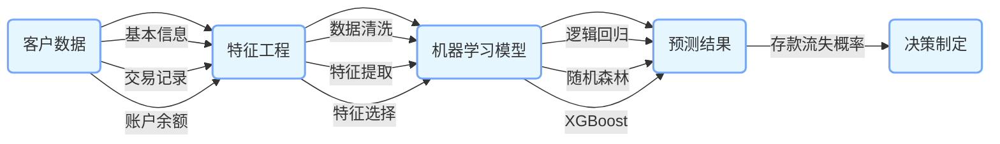

# 智能商业银行存款流失预测

> 关键词：智能商业银行、存款流失预测、机器学习、数据分析、风险预警

> 摘要：本文聚焦于智能商业银行存款流失预测这一关键问题。随着金融市场竞争的加剧，准确预测存款流失对于商业银行的稳定运营和风险管理至关重要。文章从背景介绍入手，阐述了研究目的、预期读者和文档结构。详细讲解了核心概念、算法原理、数学模型，并通过实际案例展示了如何进行存款流失预测的项目实战。同时，探讨了该技术在实际中的应用场景，推荐了相关的学习资源、开发工具和论文著作。最后总结了未来发展趋势与挑战，并提供了常见问题解答和扩展阅读参考资料，旨在为商业银行和相关研究人员提供全面的技术指导和决策支持。

## 1. 背景介绍 
### 1.1 目的和范围
在当今金融市场环境下，商业银行面临着日益激烈的竞争。存款作为商业银行的重要资金来源，其流失情况直接影响银行的资金流动性、盈利能力和稳定性。因此，准确预测存款流失对于商业银行制定合理的营销策略、优化资产配置、加强风险管理具有重要意义。

本文章的范围涵盖了从数据收集、预处理到模型构建、评估以及实际应用的整个智能商业银行存款流失预测流程。旨在介绍相关的核心概念、算法原理和数学模型，并通过实际案例展示如何利用这些技术实现准确的存款流失预测。

### 1.2 预期读者
本文的预期读者包括商业银行的管理人员、金融分析师、数据科学家、机器学习工程师以及对金融科技和数据分析感兴趣的研究人员。商业银行管理人员可以通过本文了解存款流失预测的重要性和方法，为银行的决策提供依据；金融分析师可以借助相关技术更深入地分析银行的财务状况和风险；数据科学家和机器学习工程师可以从文章中获取具体的算法实现和项目实战经验；而对金融科技和数据分析感兴趣的研究人员则可以将其作为进一步研究的参考资料。

### 1.3 文档结构概述
本文将按照以下结构进行组织：
- 核心概念与联系：介绍智能商业银行存款流失预测涉及的核心概念，并通过文本示意图和 Mermaid 流程图展示其架构和联系。
- 核心算法原理 & 具体操作步骤：详细讲解用于存款流失预测的核心算法原理，并使用 Python 源代码进行具体阐述。
- 数学模型和公式 & 详细讲解 & 举例说明：介绍相关的数学模型和公式，并通过具体例子进行详细讲解。
- 项目实战：代码实际案例和详细解释说明：通过实际项目案例，展示如何搭建开发环境、实现源代码并进行代码解读和分析。
- 实际应用场景：探讨智能商业银行存款流失预测在实际中的应用场景。
- 工具和资源推荐：推荐相关的学习资源、开发工具框架和论文著作。
- 总结：未来发展趋势与挑战：总结智能商业银行存款流失预测的未来发展趋势和面临的挑战。
- 附录：常见问题与解答：提供常见问题的解答。
- 扩展阅读 & 参考资料：提供扩展阅读的相关资料和参考书目。

### 1.4 术语表
#### 1.4.1 核心术语定义
- **智能商业银行**：指运用先进的信息技术和数据分析手段，实现业务智能化、自动化和精细化管理的商业银行。
- **存款流失**：指客户将在商业银行的存款全部或部分取出，导致银行存款余额减少的现象。
- **存款流失预测**：通过对历史数据和相关信息的分析，运用机器学习等技术手段，预测客户未来是否会发生存款流失的行为。
- **特征工程**：指从原始数据中提取和选择有价值的特征，以提高模型的预测性能。
- **机器学习模型**：一种基于数据学习模式和规律的算法模型，用于解决分类、回归等问题。

#### 1.4.2 相关概念解释
- **数据挖掘**：从大量数据中发现有价值的信息和知识的过程，包括数据预处理、特征提取、模型构建等步骤。
- **风险管理**：商业银行通过识别、评估和控制风险，以保障银行的稳健运营和资产安全。
- **客户细分**：根据客户的特征和行为，将客户划分为不同的群体，以便银行制定个性化的营销策略。

#### 1.4.3 缩略词列表
- **ML**：Machine Learning，机器学习
- **RF**：Random Forest，随机森林
- **LR**：Logistic Regression，逻辑回归
- **XGBoost**：eXtreme Gradient Boosting，极端梯度提升

## 2. 核心概念与联系 
### 核心概念原理
智能商业银行存款流失预测主要基于数据驱动的方法，通过对大量的客户数据进行分析和挖掘，找出与存款流失相关的特征和模式，然后利用机器学习模型对客户未来的存款流失可能性进行预测。

核心概念包括客户数据、特征工程、机器学习模型和预测结果。客户数据是指商业银行收集的关于客户的各种信息，如客户基本信息、交易记录、账户余额等。特征工程是对客户数据进行预处理和特征提取的过程，目的是将原始数据转化为适合机器学习模型输入的特征。机器学习模型是根据特征数据进行训练和学习的算法，常见的模型包括逻辑回归、随机森林、XGBoost 等。预测结果是机器学习模型根据训练好的模型对新客户数据进行预测得到的存款流失可能性。

### 架构的文本示意图
```plaintext
+-------------------+
|    客户数据       |
+-------------------+
|  - 基本信息       |
|  - 交易记录       |
|  - 账户余额       |
+-------------------+
         |
         v
+-------------------+
|    特征工程       |
+-------------------+
|  - 数据清洗       |
|  - 特征提取       |
|  - 特征选择       |
+-------------------+
         |
         v
+-------------------+
|  机器学习模型    |
+-------------------+
|  - 逻辑回归       |
|  - 随机森林       |
|  - XGBoost        |
+-------------------+
         |
         v
+-------------------+
|   预测结果        |
+-------------------+
|  - 存款流失概率   |
+-------------------+
```

### Mermaid 流程图


## 3. 核心算法原理 & 具体操作步骤 
### 逻辑回归算法原理
逻辑回归是一种常用的分类算法，用于预测二分类问题，如存款流失（是/否）。其基本原理是通过逻辑函数将线性回归的输出映射到概率值范围 $[0, 1]$。

逻辑函数（也称为 Sigmoid 函数）的定义为：
$$\sigma(z) = \frac{1}{1 + e^{-z}}$$
其中，$z$ 是线性回归的输出，即 $z = w_0 + w_1x_1 + w_2x_2 + \cdots + w_nx_n$，$w_i$ 是模型的权重，$x_i$ 是输入特征。

逻辑回归的目标是找到一组最优的权重 $w$，使得模型对训练数据的预测概率尽可能接近真实标签。通常使用最大似然估计来求解最优权重，即最大化似然函数：
$$L(w) = \prod_{i=1}^{N} P(y_i|x_i; w)^{y_i} (1 - P(y_i|x_i; w))^{1 - y_i}$$
其中，$N$ 是训练数据的数量，$y_i$ 是第 $i$ 个样本的真实标签，$P(y_i|x_i; w)$ 是模型对第 $i$ 个样本的预测概率。

为了方便计算，通常对似然函数取对数，得到对数似然函数：
$$\ell(w) = \sum_{i=1}^{N} [y_i \log P(y_i|x_i; w) + (1 - y_i) \log (1 - P(y_i|x_i; w))]$$
然后使用梯度下降等优化算法来最大化对数似然函数，从而得到最优的权重 $w$。

### Python 代码实现
```python
import numpy as np
from sklearn.linear_model import LogisticRegression
from sklearn.model_selection import train_test_split
from sklearn.metrics import accuracy_score

# 生成示例数据
np.random.seed(0)
X = np.random.randn(100, 5)
y = np.random.randint(0, 2, 100)

# 划分训练集和测试集
X_train, X_test, y_train, y_test = train_test_split(X, y, test_size=0.2, random_state=42)

# 创建逻辑回归模型
model = LogisticRegression()

# 训练模型
model.fit(X_train, y_train)

# 预测
y_pred = model.predict(X_test)

# 计算准确率
accuracy = accuracy_score(y_test, y_pred)
print(f"Accuracy: {accuracy}")
```
### 具体操作步骤
1. **数据准备**：收集和整理与存款流失相关的客户数据，包括客户基本信息、交易记录、账户余额等。对数据进行清洗和预处理，如处理缺失值、异常值和进行数据编码。
2. **特征工程**：从原始数据中提取有价值的特征，如客户的存款期限、存款金额、交易频率等。可以使用统计方法、相关性分析等进行特征选择，去除无关或冗余的特征。
3. **模型选择**：根据数据特点和问题需求，选择合适的机器学习模型，如逻辑回归、随机森林、XGBoost 等。
4. **模型训练**：将处理好的训练数据输入到选择的模型中进行训练，通过调整模型的参数，使得模型对训练数据的拟合效果最优。
5. **模型评估**：使用测试数据对训练好的模型进行评估，常用的评估指标包括准确率、召回率、F1 值等。根据评估结果对模型进行调整和优化。
6. **预测应用**：将训练好的模型应用到新的客户数据上，预测客户的存款流失可能性。根据预测结果，商业银行可以制定相应的营销策略和风险管理措施。

## 4. 数学模型和公式 & 详细讲解 & 举例说明 
### 逻辑回归的数学模型和公式
逻辑回归的数学模型可以表示为：
$$P(y = 1|x) = \frac{1}{1 + e^{-(w_0 + w_1x_1 + w_2x_2 + \cdots + w_nx_n)}}$$
其中，$P(y = 1|x)$ 表示在输入特征 $x$ 的条件下，样本属于正类（存款流失）的概率，$w_0$ 是截距，$w_1, w_2, \cdots, w_n$ 是特征的权重。

为了求解模型的权重 $w$，通常使用最大似然估计。假设训练数据中有 $N$ 个样本，每个样本的特征向量为 $x_i$，真实标签为 $y_i$，则似然函数为：
$$L(w) = \prod_{i=1}^{N} P(y_i|x_i; w)^{y_i} (1 - P(y_i|x_i; w))^{1 - y_i}$$
取对数后得到对数似然函数：
$$\ell(w) = \sum_{i=1}^{N} [y_i \log P(y_i|x_i; w) + (1 - y_i) \log (1 - P(y_i|x_i; w))]$$
使用梯度下降法来最大化对数似然函数，梯度下降法的更新公式为：
$$w_{j} := w_{j} + \alpha \frac{\partial \ell(w)}{\partial w_{j}}$$
其中，$\alpha$ 是学习率，$\frac{\partial \ell(w)}{\partial w_{j}}$ 是对数似然函数关于权重 $w_j$ 的偏导数。

### 详细讲解
逻辑回归的核心思想是通过逻辑函数将线性回归的输出映射到概率值范围 $[0, 1]$，从而实现二分类问题的预测。对数似然函数的最大化等价于最小化负对数似然函数，也就是交叉熵损失函数。梯度下降法是一种常用的优化算法，通过不断迭代更新权重，使得对数似然函数的值逐渐增大，从而找到最优的权重。

### 举例说明
假设我们有一个简单的二分类问题，有两个特征 $x_1$ 和 $x_2$，以及对应的标签 $y$。我们使用逻辑回归模型进行预测，模型的参数初始化为 $w_0 = 0$，$w_1 = 0.1$，$w_2 = 0.2$。对于一个新的样本 $x = [1, 2]$，我们可以计算其属于正类的概率：
$$z = w_0 + w_1x_1 + w_2x_2 = 0 + 0.1\times1 + 0.2\times2 = 0.5$$
$$P(y = 1|x) = \frac{1}{1 + e^{-0.5}} \approx 0.62$$
如果设定阈值为 0.5，则该样本被预测为正类。

## 5. 项目实战：代码实际案例和详细解释说明 
### 5.1  开发环境搭建
#### 操作系统
建议使用 Linux 或 macOS 操作系统，因为它们对 Python 和相关数据科学库的支持较好。如果使用 Windows 操作系统，也可以通过安装 Anaconda 来搭建开发环境。

#### Python 环境
安装 Python 3.7 或更高版本。可以通过 Anaconda 来安装 Python，Anaconda 是一个流行的 Python 数据科学发行版，包含了许多常用的科学计算和数据分析库。

#### 安装必要的库
使用以下命令安装必要的库：
```sh
pip install numpy pandas scikit-learn xgboost matplotlib seaborn
```
### 5.2  源代码详细实现和代码解读
```python
import pandas as pd
import numpy as np
from sklearn.model_selection import train_test_split
from sklearn.preprocessing import StandardScaler
from sklearn.linear_model import LogisticRegression
from sklearn.ensemble import RandomForestClassifier
from xgboost import XGBClassifier
from sklearn.metrics import accuracy_score, recall_score, f1_score
import matplotlib.pyplot as plt
import seaborn as sns

# 加载数据
data = pd.read_csv('bank_deposit_data.csv')

# 数据预处理
# 处理缺失值
data = data.dropna()

# 分离特征和标签
X = data.drop('deposit_loss', axis=1)
y = data['deposit_loss']

# 划分训练集和测试集
X_train, X_test, y_train, y_test = train_test_split(X, y, test_size=0.2, random_state=42)

# 特征缩放
scaler = StandardScaler()
X_train_scaled = scaler.fit_transform(X_train)
X_test_scaled = scaler.transform(X_test)

# 模型训练和评估
models = {
    'Logistic Regression': LogisticRegression(),
    'Random Forest': RandomForestClassifier(),
    'XGBoost': XGBClassifier()
}

results = {}
for model_name, model in models.items():
    model.fit(X_train_scaled, y_train)
    y_pred = model.predict(X_test_scaled)
    accuracy = accuracy_score(y_test, y_pred)
    recall = recall_score(y_test, y_pred)
    f1 = f1_score(y_test, y_pred)
    results[model_name] = {
        'Accuracy': accuracy,
        'Recall': recall,
        'F1 Score': f1
    }

# 输出结果
for model_name, metrics in results.items():
    print(f"{model_name}:")
    for metric, value in metrics.items():
        print(f"  {metric}: {value:.4f}")

# 可视化结果
metrics_df = pd.DataFrame(results).T
plt.figure(figsize=(10, 6))
sns.heatmap(metrics_df, annot=True, fmt='.4f', cmap='YlGnBu')
plt.title('Model Performance Metrics')
plt.show()
```
### 代码解读与分析
1. **数据加载**：使用 `pandas` 库的 `read_csv` 函数加载存储在 `bank_deposit_data.csv` 文件中的客户数据。
2. **数据预处理**：
    - 处理缺失值：使用 `dropna` 函数删除包含缺失值的行。
    - 分离特征和标签：将数据集中的特征和存款流失标签分离。
    - 划分训练集和测试集：使用 `train_test_split` 函数将数据集划分为训练集和测试集，测试集占比为 20%。
    - 特征缩放：使用 `StandardScaler` 对特征进行标准化处理，使得特征具有相同的尺度，有助于提高模型的性能。
3. **模型训练和评估**：
    - 定义模型：定义了三种不同的机器学习模型，包括逻辑回归、随机森林和 XGBoost。
    - 训练模型：使用训练集数据对每个模型进行训练。
    - 预测：使用训练好的模型对测试集数据进行预测。
    - 评估：使用准确率、召回率和 F1 值等指标对模型的性能进行评估。
4. **结果输出和可视化**：
    - 输出结果：将每个模型的评估指标输出到控制台。
    - 可视化结果：使用 `seaborn` 库的 `heatmap` 函数将模型的评估指标可视化，方便比较不同模型的性能。

## 6. 实际应用场景 
### 营销策略制定
商业银行可以根据存款流失预测结果，对可能流失的客户进行精准营销。例如，对于预测有较高存款流失可能性的客户，可以推出个性化的优惠活动，如提高存款利率、赠送礼品等，以吸引客户继续存款。对于忠诚度较高的客户，可以提供更优质的服务，增强客户的满意度和忠诚度。

### 风险管理
存款流失会对商业银行的资金流动性和盈利能力产生影响。通过准确预测存款流失，银行可以提前做好资金安排，合理调整资产配置，降低流动性风险。同时，对于可能出现大规模存款流失的情况，银行可以制定应急预案，防范系统性风险。

### 客户细分和服务优化
根据存款流失预测结果，商业银行可以对客户进行细分。对于不同类型的客户，提供不同的服务和产品。例如，对于高价值客户，可以提供专属的理财顾问服务；对于年轻客户，可以推出创新的金融产品和服务，满足他们的个性化需求。通过客户细分和服务优化，提高客户的满意度和忠诚度，减少存款流失。

## 7. 工具和资源推荐
### 7.1 学习资源推荐
#### 7.1.1 书籍推荐
- 《Python 数据分析实战》：本书介绍了使用 Python 进行数据分析的基本方法和技巧，包括数据清洗、数据可视化、机器学习等内容，适合初学者入门。
- 《机器学习实战》：通过实际案例介绍了机器学习的基本算法和应用，包括分类、回归、聚类等，有助于读者深入理解机器学习的原理和实践。
- 《深度学习》：由深度学习领域的三位顶尖专家编写，全面介绍了深度学习的理论和实践，适合有一定机器学习基础的读者深入学习。

#### 7.1.2 在线课程
- Coursera 上的《机器学习》课程：由斯坦福大学教授 Andrew Ng 主讲，是机器学习领域的经典课程，系统介绍了机器学习的基本概念、算法和应用。
- edX 上的《数据科学基础》课程：涵盖了数据科学的各个方面，包括数据收集、数据清洗、数据分析和机器学习等，适合初学者学习。
- Kaggle 上的《微课程》：提供了一系列关于数据科学和机器学习的微课程，内容丰富，实践性强，可以帮助读者快速掌握相关技能。

#### 7.1.3 技术博客和网站
- Medium：是一个知名的技术博客平台，上面有许多关于数据科学、机器学习和金融科技的优秀文章。
- Towards Data Science：专注于数据科学和机器学习领域的技术博客，提供了大量的技术文章和案例分析。
- Kaggle：是一个数据科学竞赛平台，上面有许多数据科学和机器学习的开源代码和数据集，可以供读者学习和参考。

### 7.2 开发工具框架推荐
#### 7.2.1 IDE和编辑器
- PyCharm：是一款专业的 Python 集成开发环境，提供了丰富的代码编辑、调试和项目管理功能，适合大型项目的开发。
- Jupyter Notebook：是一个交互式的开发环境，支持 Python、R 等多种编程语言，适合数据探索和模型实验。
- Visual Studio Code：是一款轻量级的代码编辑器，支持多种编程语言和插件，具有良好的扩展性和用户体验。

#### 7.2.2 调试和性能分析工具
- IPython：是一个增强的 Python 交互式解释器，提供了丰富的调试和分析功能，如代码自动补全、代码调试等。
- TensorBoard：是 TensorFlow 提供的可视化工具，可以用于可视化模型的训练过程、评估指标和网络结构等。
- Scikit-learn 的 `GridSearchCV`：用于模型参数调优，可以通过网格搜索的方式找到最优的模型参数。

#### 7.2.3 相关框架和库
- Scikit-learn：是一个常用的机器学习库，提供了丰富的机器学习算法和工具，如分类、回归、聚类等。
- XGBoost：是一个高效的梯度提升库，在数据科学竞赛中广泛应用，具有良好的性能和可扩展性。
- TensorFlow 和 PyTorch：是深度学习领域的两大主流框架，提供了丰富的深度学习模型和工具，适合开发复杂的深度学习模型。

### 7.3 相关论文著作推荐
#### 7.3.1 经典论文
- 《The Elements of Statistical Learning》：由 Trevor Hastie、Robert Tibshirani 和 Jerome Friedman 编写，是统计学习领域的经典著作，系统介绍了统计学习的基本理论和方法。
- 《Pattern Recognition and Machine Learning》：由 Christopher Bishop 编写，全面介绍了模式识别和机器学习的基本概念、算法和应用。
- 《Gradient Boosting Machines, a Tutorial》：详细介绍了梯度提升算法的原理和应用，是理解和使用梯度提升算法的重要参考资料。

#### 7.3.2 最新研究成果
- 《Deep Learning for Financial Forecasting: A Systematic Literature Review》：对深度学习在金融预测领域的应用进行了系统的文献综述，介绍了最新的研究成果和发展趋势。
- 《Machine Learning in Banking: A Survey》：对机器学习在银行业的应用进行了全面的调查和分析，包括风险评估、客户细分、存款流失预测等方面。
- 《Predicting Customer Churn in the Banking Industry Using Machine Learning Techniques》：研究了如何使用机器学习技术预测银行业的客户流失问题，提出了一些有效的方法和模型。

#### 7.3.3 应用案例分析
- 《Case Studies in Data Science for Banking》：通过实际案例介绍了数据科学在银行业的应用，包括风险评估、市场营销、客户服务等方面，具有很强的实践指导意义。
- 《Machine Learning Applications in Banking: Real-World Examples》：提供了一些机器学习在银行业的实际应用案例，如信用评分、欺诈检测、存款流失预测等，帮助读者更好地理解和应用机器学习技术。

## 8. 总结：未来发展趋势与挑战
### 未来发展趋势
- **智能化和自动化**：随着人工智能技术的不断发展，智能商业银行存款流失预测将更加智能化和自动化。银行可以利用自动化工具和算法，实现数据的自动收集、处理和分析，提高预测的效率和准确性。
- **多源数据融合**：除了传统的客户数据，银行还可以融合社交媒体数据、宏观经济数据等多源数据，以更全面地了解客户的行为和需求，提高存款流失预测的准确性。
- **深度学习的应用**：深度学习具有强大的特征提取和模式识别能力，未来将在智能商业银行存款流失预测中得到更广泛的应用。例如，使用卷积神经网络（CNN）和循环神经网络（RNN）对时间序列数据进行分析，以更好地预测客户的存款流失趋势。
- **可解释性模型**：随着监管要求的提高和客户对透明度的需求增加，可解释性模型将越来越受到关注。银行需要开发能够解释预测结果的模型，以便更好地向客户和监管机构解释决策依据。

### 挑战
- **数据质量和安全**：准确的存款流失预测依赖于高质量的数据。然而，银行的数据可能存在缺失值、异常值和错误数据等问题，需要进行有效的数据清洗和预处理。同时，银行需要加强数据安全保护，防止客户数据泄露和滥用。
- **模型选择和优化**：面对众多的机器学习模型，如何选择合适的模型并进行优化是一个挑战。不同的模型在不同的数据集和问题上表现不同，需要进行大量的实验和比较，以找到最优的模型。
- **业务理解和融合**：存款流失预测不仅仅是一个技术问题，还需要深入理解银行业务和客户行为。银行需要将技术与业务相结合，将预测结果转化为实际的营销策略和风险管理措施。
- **监管合规**：金融行业受到严格的监管，银行在使用人工智能和机器学习技术进行存款流失预测时，需要遵守相关的法律法规和监管要求，确保模型的公平性、透明度和可解释性。

## 9. 附录：常见问题与解答
### 问题 1：数据预处理的重要性是什么？
数据预处理是智能商业银行存款流失预测的重要步骤。原始数据可能存在缺失值、异常值和错误数据等问题，这些问题会影响模型的训练和预测效果。通过数据预处理，可以清洗数据、处理缺失值、进行数据编码和特征缩放等操作，提高数据的质量和可用性，从而提高模型的性能。

### 问题 2：如何选择合适的机器学习模型？
选择合适的机器学习模型需要考虑多个因素，包括数据的特点、问题的类型、模型的复杂度和可解释性等。一般来说，可以先尝试一些简单的模型，如逻辑回归，然后逐步尝试更复杂的模型，如随机森林和 XGBoost。同时，可以使用交叉验证等方法对不同的模型进行评估和比较，选择性能最优的模型。

### 问题 3：如何提高模型的预测准确性？
提高模型的预测准确性可以从以下几个方面入手：
- **数据质量**：确保数据的准确性和完整性，进行有效的数据清洗和预处理。
- **特征工程**：从原始数据中提取有价值的特征，进行特征选择和特征组合，以提高特征的质量。
- **模型选择和优化**：选择合适的机器学习模型，并进行模型参数调优，以找到最优的模型。
- **集成学习**：可以使用集成学习方法，如随机森林和 XGBoost，将多个弱模型组合成一个强模型，提高模型的预测准确性。

### 问题 4：如何评估模型的性能？
评估模型的性能可以使用多种指标，常见的指标包括准确率、召回率、F1 值、ROC 曲线和 AUC 值等。准确率表示模型预测正确的样本占总样本的比例；召回率表示模型正确预测为正类的样本占实际正类样本的比例；F1 值是准确率和召回率的调和平均值；ROC 曲线是一种可视化工具，用于展示模型在不同阈值下的性能；AUC 值是 ROC 曲线下的面积，用于衡量模型的整体性能。

## 10. 扩展阅读 & 参考资料
### 扩展阅读
- 《金融科技前沿：人工智能与机器学习》：深入介绍了人工智能和机器学习在金融领域的应用，包括风险评估、投资决策、客户服务等方面。
- 《数据驱动的银行转型》：探讨了如何利用数据科学和人工智能技术推动银行的数字化转型，提高银行的竞争力和服务质量。
- 《智能金融：重塑金融服务的未来》：介绍了智能金融的概念、技术和应用，包括智能投顾、智能客服、智能风控等方面。

### 参考资料
- 《Python 数据科学手册》
- 《机器学习：一种概率视角》
- 《深度学习入门：基于 Python 的理论与实现》

作者：AI天才研究院/AI Genius Institute & 禅与计算机程序设计艺术 /Zen And The Art of Computer Programming