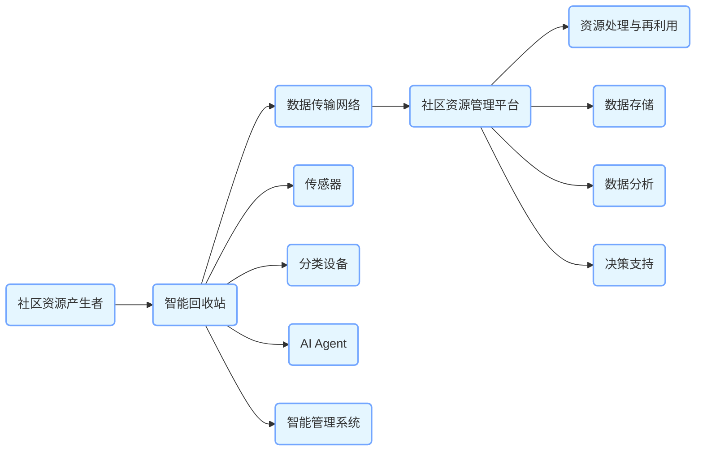

# 智能回收站：AI Agent的社区资源循环利用管理

> 关键词：智能回收站、AI Agent、社区资源循环利用、管理系统、资源回收

> 摘要：本文围绕智能回收站中AI Agent在社区资源循环利用管理的应用展开。详细介绍了相关背景，包括目的、预期读者、文档结构和术语等。阐述了核心概念及联系，给出了原理和架构的示意图与流程图。深入讲解了核心算法原理，并用Python代码详细说明具体操作步骤。通过数学模型和公式进一步分析其内在逻辑，还结合实际案例进行举例。在项目实战部分，从开发环境搭建到源代码实现及解读进行了全面剖析。探讨了实际应用场景，推荐了学习、开发相关的工具和资源，最后总结了未来发展趋势与挑战，并给出常见问题解答和扩展阅读参考资料，旨在为社区资源循环利用管理提供全面的技术方案和思路。

## 1. 背景介绍 
### 1.1 目的和范围
在当今社会，资源的可持续利用和环境保护已成为全球关注的焦点。社区作为人们生活的基本单元，每天都会产生大量的可回收资源。然而，传统的回收站管理方式存在效率低下、资源分类不准确等问题，导致资源无法得到充分的循环利用。本项目的目的是设计和实现一个基于AI Agent的智能回收站管理系统，以提高社区资源循环利用的效率和质量。

本项目的范围主要涵盖以下几个方面：
- 设计智能回收站的硬件架构，包括传感器、分类设备等。
- 开发基于AI Agent的资源分类和管理算法。
- 建立社区资源循环利用管理系统的软件平台，实现数据的收集、分析和管理。
- 进行实际的社区应用测试，验证系统的可行性和有效性。

### 1.2 预期读者
本文的预期读者主要包括以下几类人群：
- 从事人工智能、计算机科学、环境科学等领域的研究人员和开发者，他们可以从本文中获取关于AI Agent在资源管理领域的应用思路和技术实现方法。
- 社区管理人员和环保工作者，他们可以了解如何利用智能技术提高社区资源循环利用的管理水平。
- 对可持续发展和环保事业感兴趣的普通读者，他们可以通过本文了解智能回收站的工作原理和意义。

### 1.3 文档结构概述
本文将按照以下结构进行组织：
- 背景介绍：介绍项目的目的、范围、预期读者和文档结构。
- 核心概念与联系：阐述智能回收站、AI Agent和社区资源循环利用管理的核心概念，并给出它们之间的联系。
- 核心算法原理 & 具体操作步骤：详细讲解AI Agent在资源分类和管理中的核心算法原理，并给出具体的操作步骤和Python代码实现。
- 数学模型和公式 & 详细讲解 & 举例说明：建立智能回收站管理系统的数学模型，给出相关公式，并通过具体例子进行说明。
- 项目实战：代码实际案例和详细解释说明：介绍项目的开发环境搭建、源代码实现和代码解读。
- 实际应用场景：探讨智能回收站在社区中的实际应用场景。
- 工具和资源推荐：推荐相关的学习资源、开发工具和研究论文。
- 总结：未来发展趋势与挑战：总结项目的成果，分析未来的发展趋势和面临的挑战。
- 附录：常见问题与解答：解答读者可能遇到的常见问题。
- 扩展阅读 & 参考资料：提供相关的扩展阅读资料和参考文献。

### 1.4 术语表
#### 1.4.1 核心术语定义
- **智能回收站**：一种配备了传感器、分类设备和智能管理系统的回收站，能够自动识别和分类回收物品，并实现资源的高效管理。
- **AI Agent**：人工智能代理，是一种能够感知环境、做出决策并执行行动的智能实体。在本项目中，AI Agent用于实现资源的分类和管理。
- **社区资源循环利用管理**：对社区内产生的可回收资源进行收集、分类、处理和再利用的全过程管理。

#### 1.4.2 相关概念解释
- **传感器技术**：用于感知回收站中的物品信息，如重量、形状、材质等。常见的传感器包括重量传感器、光学传感器、红外传感器等。
- **机器学习算法**：用于训练AI Agent进行资源分类和管理。常见的机器学习算法包括决策树、支持向量机、神经网络等。
- **数据挖掘技术**：用于从回收站收集的数据中挖掘有价值的信息，如资源分布规律、用户行为模式等。

#### 1.4.3 缩略词列表
- **AI**：Artificial Intelligence，人工智能
- **ML**：Machine Learning，机器学习
- **DM**：Data Mining，数据挖掘

## 2. 核心概念与联系 

### 核心概念原理
#### 智能回收站
智能回收站是一种集成了多种技术的现代化回收设备。它的核心原理是通过传感器感知回收物品的各种特征，如重量、形状、颜色、材质等。例如，重量传感器可以测量物品的重量，光学传感器可以识别物品的颜色和表面特征，红外传感器可以检测物品的材质。这些传感器将收集到的数据传输到智能管理系统中，系统根据预设的算法对物品进行分类和处理。

#### AI Agent
AI Agent是一种具有自主决策能力的智能实体。在智能回收站中，AI Agent的主要任务是根据传感器收集到的数据，对回收物品进行准确的分类和管理。它通过机器学习算法进行训练，学习不同类型物品的特征和分类规则。当有新的物品进入回收站时，AI Agent会根据其特征判断其所属的类别，并指导分类设备将其放置到相应的区域。

#### 社区资源循环利用管理
社区资源循环利用管理是一个综合性的过程，包括资源的收集、分类、处理和再利用。智能回收站作为社区资源收集的重要环节，通过AI Agent的准确分类，可以提高资源的回收效率和质量。同时，管理系统可以对回收数据进行分析，了解社区内资源的分布规律和用户的回收行为，为制定合理的资源循环利用策略提供依据。

### 架构的文本示意图
```plaintext
+---------------------+
| 社区资源产生者      |
| （居民、商户等）    |
+---------------------+
          |
          v
+---------------------+
| 智能回收站          |
| - 传感器            |
| - 分类设备          |
| - AI Agent          |
| - 智能管理系统      |
+---------------------+
          |
          v
+---------------------+
| 数据传输网络        |
| （有线或无线）      |
+---------------------+
          |
          v
+---------------------+
| 社区资源管理平台    |
| - 数据存储          |
| - 数据分析          |
| - 决策支持          |
+---------------------+
          |
          v
+---------------------+
| 资源处理与再利用    |
| （回收企业等）      |
+---------------------+
```

### Mermaid流程图


这个流程图展示了智能回收站在社区资源循环利用管理中的整个流程。首先，社区资源产生者将可回收物品投入智能回收站。智能回收站中的传感器收集物品信息，AI Agent根据这些信息进行分类决策，分类设备将物品分类放置。数据通过数据传输网络传输到社区资源管理平台，平台进行数据存储、分析，并提供决策支持。最后，经过分类的资源被送往资源处理与再利用环节。

## 3. 核心算法原理 & 具体操作步骤 

### 核心算法原理
在智能回收站中，AI Agent进行资源分类的核心算法可以采用机器学习中的决策树算法。决策树是一种基于树结构进行决策的算法，它通过对训练数据的学习，构建一棵决策树，每个内部节点表示一个特征上的测试，每个分支表示一个测试输出，每个叶节点表示一个类别。

决策树算法的基本步骤如下：
1. **特征选择**：从传感器收集到的物品特征中选择最具有区分度的特征作为决策树的划分依据。常见的特征选择方法有信息增益、信息增益比、基尼指数等。
2. **决策树构建**：根据选择的特征，递归地将训练数据划分为不同的子集，直到每个子集只包含同一类别的物品，或者达到预设的终止条件。
3. **决策树剪枝**：为了防止决策树过拟合，需要对构建好的决策树进行剪枝处理，去除一些不必要的节点。
4. **分类预测**：对于新的物品，根据其特征值，从决策树的根节点开始，按照测试条件进行分支选择，直到到达叶节点，叶节点所代表的类别即为该物品的分类结果。

### 具体操作步骤及Python代码实现
以下是一个使用Python和Scikit-learn库实现决策树分类的示例代码：

```python
import numpy as np
from sklearn.datasets import make_classification
from sklearn.model_selection import train_test_split
from sklearn.tree import DecisionTreeClassifier
from sklearn.metrics import accuracy_score

# 生成示例数据
X, y = make_classification(n_samples=1000, n_features=10, n_informative=5, n_classes=3, random_state=42)

# 划分训练集和测试集
X_train, X_test, y_train, y_test = train_test_split(X, y, test_size=0.2, random_state=42)

# 创建决策树分类器
clf = DecisionTreeClassifier(criterion='gini', max_depth=5)

# 训练模型
clf.fit(X_train, y_train)

# 进行预测
y_pred = clf.predict(X_test)

# 计算准确率
accuracy = accuracy_score(y_test, y_pred)
print(f"模型准确率: {accuracy}")
```

### 代码解释
1. **数据生成**：使用`make_classification`函数生成一个包含1000个样本、10个特征、3个类别的分类数据集。
2. **数据划分**：使用`train_test_split`函数将数据集划分为训练集和测试集，其中测试集占总数据的20%。
3. **模型创建**：创建一个决策树分类器`DecisionTreeClassifier`，使用基尼指数作为特征选择的标准，最大深度设置为5。
4. **模型训练**：使用训练集数据对决策树分类器进行训练。
5. **模型预测**：使用训练好的模型对测试集数据进行预测。
6. **准确率计算**：使用`accuracy_score`函数计算模型的预测准确率。

通过以上步骤，我们可以实现一个简单的基于决策树算法的资源分类模型。在实际应用中，需要根据具体的传感器数据和分类需求对模型进行调整和优化。

## 4. 数学模型和公式 & 详细讲解 & 举例说明 

### 信息熵和信息增益
在决策树算法中，信息熵和信息增益是常用的特征选择指标。

#### 信息熵
信息熵是用来衡量一个随机变量不确定性的指标。对于一个离散随机变量 $X$，其取值为 $x_1, x_2, \cdots, x_n$，对应的概率为 $p_1, p_2, \cdots, p_n$，则 $X$ 的信息熵定义为：

$$H(X) = -\sum_{i=1}^{n} p_i \log_2 p_i$$

信息熵越大，说明随机变量的不确定性越大；信息熵越小，说明随机变量的不确定性越小。

#### 信息增益
信息增益是指在使用某个特征进行划分后，数据集的信息熵减少的量。假设数据集 $D$ 被特征 $A$ 划分为 $k$ 个子集 $D_1, D_2, \cdots, D_k$，每个子集的样本数为 $|D_1|, |D_2|, \cdots, |D_k|$，则特征 $A$ 对数据集 $D$ 的信息增益定义为：

$$Gain(D, A) = H(D) - \sum_{i=1}^{k} \frac{|D_i|}{|D|} H(D_i)$$

其中，$H(D)$ 是数据集 $D$ 的信息熵，$H(D_i)$ 是子集 $D_i$ 的信息熵。信息增益越大，说明使用该特征进行划分后，数据集的不确定性减少得越多，该特征的区分能力越强。

### 基尼指数
基尼指数也是一种常用的特征选择指标，它衡量的是数据集的不纯度。对于一个数据集 $D$，其基尼指数定义为：

$$Gini(D) = 1 - \sum_{i=1}^{n} p_i^2$$

其中，$p_i$ 是数据集 $D$ 中第 $i$ 类样本的比例。基尼指数越小，说明数据集的纯度越高。

在使用特征 $A$ 对数据集 $D$ 进行划分后，得到 $k$ 个子集 $D_1, D_2, \cdots, D_k$，则特征 $A$ 对数据集 $D$ 的基尼指数增益定义为：

$$GiniIndex(D, A) = Gini(D) - \sum_{i=1}^{k} \frac{|D_i|}{|D|} Gini(D_i)$$

基尼指数增益越大，说明使用该特征进行划分后，数据集的纯度提高得越多，该特征的区分能力越强。

### 举例说明
假设我们有一个包含 10 个样本的数据集 $D$，其中有 6 个正例和 4 个反例。则数据集 $D$ 的信息熵为：

$$H(D) = -\frac{6}{10} \log_2 \frac{6}{10} - \frac{4}{10} \log_2 \frac{4}{10} \approx 0.971$$

假设我们使用特征 $A$ 对数据集 $D$ 进行划分，得到两个子集 $D_1$ 和 $D_2$，其中 $D_1$ 包含 4 个正例和 1 个反例，$D_2$ 包含 2 个正例和 3 个反例。则子集 $D_1$ 和 $D_2$ 的信息熵分别为：

$$H(D_1) = -\frac{4}{5} \log_2 \frac{4}{5} - \frac{1}{5} \log_2 \frac{1}{5} \approx 0.722$$

$$H(D_2) = -\frac{2}{5} \log_2 \frac{2}{5} - \frac{3}{5} \log_2 \frac{3}{5} \approx 0.971$$

特征 $A$ 对数据集 $D$ 的信息增益为：

$$Gain(D, A) = H(D) - \frac{5}{10} H(D_1) - \frac{5}{10} H(D_2) \approx 0.971 - \frac{5}{10} \times 0.722 - \frac{5}{10} \times 0.971 = 0.125$$

通过计算信息增益，我们可以评估特征 $A$ 对数据集 $D$ 的区分能力。在决策树构建过程中，我们会选择信息增益最大的特征作为当前节点的划分特征。

## 5. 项目实战：代码实际案例和详细解释说明 

### 5.1  开发环境搭建
#### 硬件环境
- **传感器**：选择合适的传感器来收集回收物品的信息，如重量传感器、光学传感器、红外传感器等。确保传感器的精度和稳定性满足系统要求。
- **分类设备**：根据回收站的规模和需求，选择合适的分类设备，如传送带、机械臂等。
- **服务器**：选择一台性能稳定的服务器来运行智能管理系统和AI Agent。服务器需要具备足够的计算资源和存储空间。

#### 软件环境
- **操作系统**：选择合适的操作系统，如Linux（Ubuntu、CentOS等）或Windows Server。
- **编程语言**：选择Python作为主要的编程语言，因为Python具有丰富的机器学习和数据分析库，如Scikit-learn、TensorFlow等。
- **数据库**：选择合适的数据库来存储回收数据，如MySQL、PostgreSQL等。

#### 开发工具
- **集成开发环境（IDE）**：选择PyCharm或Jupyter Notebook作为开发工具，它们提供了方便的代码编辑、调试和运行功能。
- **版本控制工具**：使用Git进行代码版本控制，方便团队协作和代码管理。

### 5.2  源代码详细实现和代码解读
以下是一个简单的智能回收站管理系统的Python代码示例：

```python
import sqlite3
import random
import time

# 连接数据库
conn = sqlite3.connect('recycle_bin.db')
c = conn.cursor()

# 创建数据表
c.execute('''CREATE TABLE IF NOT EXISTS recycle_items
             (id INTEGER PRIMARY KEY AUTOINCREMENT,
              item_type TEXT,
              weight REAL,
              timestamp TEXT)''')

# 模拟传感器数据
def simulate_sensor_data():
    item_types = ['plastic', 'metal', 'paper']
    item_type = random.choice(item_types)
    weight = random.uniform(0.1, 5.0)
    timestamp = time.strftime("%Y-%m-%d %H:%M:%S")
    return item_type, weight, timestamp

# 插入数据到数据库
def insert_data(item_type, weight, timestamp):
    c.execute("INSERT INTO recycle_items (item_type, weight, timestamp) VALUES (?,?,?)",
              (item_type, weight, timestamp))
    conn.commit()

# 主循环
while True:
    item_type, weight, timestamp = simulate_sensor_data()
    insert_data(item_type, weight, timestamp)
    print(f"插入数据：类型 - {item_type}, 重量 - {weight} kg, 时间 - {timestamp}")
    time.sleep(5)

# 关闭数据库连接
conn.close()
```

### 代码解读
1. **数据库连接和表创建**：使用`sqlite3`库连接到数据库`recycle_bin.db`，并创建一个名为`recycle_items`的数据表，用于存储回收物品的信息。
2. **模拟传感器数据**：定义`simulate_sensor_data`函数，模拟传感器收集到的物品信息，包括物品类型、重量和时间戳。
3. **数据插入**：定义`insert_data`函数，将模拟的传感器数据插入到数据库中。
4. **主循环**：使用`while True`循环不断模拟传感器数据，并将数据插入到数据库中，每隔5秒插入一次。
5. **数据库关闭**：在程序结束时，关闭数据库连接。

### 5.3  代码解读与分析
这个代码示例实现了一个简单的智能回收站数据收集系统。通过模拟传感器数据，并将数据存储到数据库中，我们可以记录回收物品的信息。在实际应用中，需要将模拟传感器数据的部分替换为真实的传感器数据采集代码。同时，可以对数据库中的数据进行分析和处理，实现资源的分类和管理。

例如，可以使用机器学习算法对数据库中的数据进行训练，建立资源分类模型。然后，在新的物品进入回收站时，根据传感器收集到的信息，使用训练好的模型进行分类预测，并指导分类设备将物品放置到相应的区域。

## 6. 实际应用场景 
### 社区回收站
在社区中设置智能回收站，可以方便居民投放可回收物品。智能回收站通过AI Agent的准确分类，提高了资源的回收效率和质量。同时，管理系统可以对回收数据进行分析，了解社区内资源的分布规律和居民的回收行为，为社区的环保宣传和资源管理提供依据。

### 学校和企业
学校和企业每天都会产生大量的可回收资源，如纸张、塑料瓶等。智能回收站可以帮助学校和企业实现资源的有效管理和循环利用，减少垃圾排放，降低运营成本。同时，也可以提高师生和员工的环保意识。

### 公共场所
在公共场所，如商场、公园、车站等设置智能回收站，可以方便公众投放可回收物品，提高公众的环保参与度。智能回收站的智能化管理可以提高资源的回收效率，减少人工管理的成本。

### 资源回收企业
资源回收企业可以利用智能回收站收集的大量数据，了解市场需求和资源分布情况，优化回收流程和资源配置。同时，智能回收站的准确分类可以提高回收资源的质量，为资源的再利用提供更好的基础。

## 7. 工具和资源推荐
### 7.1 学习资源推荐
#### 7.1.1 书籍推荐
- 《Python机器学习实战》：本书介绍了Python在机器学习领域的应用，包括决策树、支持向量机、神经网络等算法的实现和应用。
- 《人工智能：一种现代的方法》：这是一本经典的人工智能教材，全面介绍了人工智能的基本概念、算法和应用。
- 《数据挖掘：概念与技术》：本书详细介绍了数据挖掘的基本概念、算法和应用，对于理解智能回收站中的数据处理和分析有很大帮助。

#### 7.1.2 在线课程
- Coursera上的“机器学习”课程：由斯坦福大学教授Andrew Ng主讲，是一门非常经典的机器学习课程，涵盖了机器学习的基本概念、算法和应用。
- edX上的“人工智能基础”课程：该课程介绍了人工智能的基本概念、算法和应用，适合初学者学习。
- 中国大学MOOC上的“Python数据分析与应用”课程：该课程介绍了Python在数据分析领域的应用，包括数据处理、可视化和机器学习等方面。

#### 7.1.3 技术博客和网站
- 机器学习算法杂货铺：该博客介绍了各种机器学习算法的原理和实现，对于深入理解机器学习算法有很大帮助。
- 人工智能前沿技术：该网站关注人工智能领域的最新研究成果和应用案例，提供了丰富的学习资源。
- 开源中国：该网站是国内知名的开源技术社区，提供了大量的开源项目和技术文章，对于学习和实践开源技术有很大帮助。

### 7.2 开发工具框架推荐
#### 7.2.1 IDE和编辑器
- PyCharm：是一款专门为Python开发设计的集成开发环境，提供了丰富的代码编辑、调试和运行功能。
- Jupyter Notebook：是一个交互式的开发环境，适合进行数据分析和机器学习实验。
- Visual Studio Code：是一款轻量级的代码编辑器，支持多种编程语言，具有丰富的插件扩展功能。

#### 7.2.2 调试和性能分析工具
- PDB：是Python自带的调试工具，可以帮助开发者定位和解决代码中的问题。
- cProfile：是Python的性能分析工具，可以分析代码的运行时间和内存使用情况。
- TensorBoard：是TensorFlow的可视化工具，可以帮助开发者可视化模型的训练过程和性能指标。

#### 7.2.3 相关框架和库
- Scikit-learn：是一个常用的机器学习库，提供了各种机器学习算法的实现和工具，如分类、回归、聚类等。
- TensorFlow：是一个开源的深度学习框架，广泛应用于图像识别、自然语言处理等领域。
- Pandas：是一个用于数据处理和分析的Python库，提供了高效的数据结构和数据操作方法。

### 7.3 相关论文著作推荐
#### 7.3.1 经典论文
- 《决策树的归纳》：该论文介绍了决策树算法的基本原理和实现方法，是决策树算法的经典文献。
- 《支持向量机的最优边界分类器》：该论文介绍了支持向量机算法的基本原理和实现方法，是支持向量机算法的经典文献。
- 《神经网络和深度学习》：该论文介绍了神经网络和深度学习的基本概念、算法和应用，是神经网络和深度学习领域的经典文献。

#### 7.3.2 最新研究成果
- 《基于深度学习的智能垃圾分类方法研究》：该论文研究了基于深度学习的智能垃圾分类方法，提高了垃圾分类的准确率和效率。
- 《AI Agent在资源管理中的应用研究》：该论文探讨了AI Agent在资源管理中的应用，提出了一种基于AI Agent的资源管理模型。
- 《社区资源循环利用管理系统的设计与实现》：该论文介绍了社区资源循环利用管理系统的设计和实现方法，为智能回收站的开发提供了参考。

#### 7.3.3 应用案例分析
- 《某社区智能回收站的应用案例分析》：该案例分析了某社区智能回收站的应用效果，包括资源回收效率、居民参与度等方面的分析。
- 《学校智能回收站的应用实践》：该案例介绍了学校智能回收站的应用实践，包括系统设计、实施过程和应用效果等方面的介绍。
- 《企业智能回收站的效益评估》：该案例对企业智能回收站的效益进行了评估，包括经济效益、环境效益和社会效益等方面的评估。

## 8. 总结：未来发展趋势与挑战
### 未来发展趋势
#### 智能化程度不断提高
随着人工智能技术的不断发展，智能回收站的智能化程度将不断提高。AI Agent将具备更强的学习和决策能力，能够更准确地识别和分类回收物品。同时，智能回收站将与物联网技术相结合，实现设备的远程监控和管理，提高系统的运行效率和可靠性。

#### 数据驱动的管理决策
智能回收站将收集大量的回收数据，通过数据分析和挖掘技术，可以深入了解社区内资源的分布规律、用户的回收行为和市场需求。这些数据将为资源循环利用管理提供有力的支持，帮助管理者制定更加科学合理的决策。

#### 与其他系统的集成
智能回收站将与社区的其他系统，如物业管理系统、环保监测系统等进行集成，实现数据的共享和交互。通过与其他系统的协同工作，可以提高社区的整体管理水平和资源利用效率。

#### 绿色可持续发展理念的普及
随着人们环保意识的不断提高，绿色可持续发展理念将得到更广泛的普及。智能回收站作为社区资源循环利用的重要工具，将得到更多的关注和支持。同时，智能回收站的应用也将促进绿色消费和低碳生活方式的推广。

### 挑战
#### 技术难题
虽然人工智能技术在智能回收站中取得了一定的应用成果，但仍然面临一些技术难题。例如，如何提高物品识别的准确率和速度，如何处理复杂环境下的传感器数据等。此外，智能回收站的硬件设备也需要不断升级和改进，以满足系统的性能要求。

#### 数据安全和隐私保护
智能回收站收集的大量数据涉及用户的个人信息和回收行为，数据安全和隐私保护成为一个重要的问题。需要采取有效的技术手段和管理措施，确保数据的安全存储和传输，防止数据泄露和滥用。

#### 成本问题
智能回收站的建设和运营成本较高，包括硬件设备的采购、安装和维护，软件系统的开发和升级，以及人员培训等方面的费用。如何降低成本，提高系统的性价比，是智能回收站推广应用的关键问题。

#### 用户接受度
智能回收站的推广应用需要用户的积极参与和配合。然而，部分用户可能对智能回收站的使用方法和效果存在疑虑，或者缺乏环保意识，不愿意主动参与资源回收。如何提高用户的接受度和参与度，是智能回收站面临的另一个挑战。

## 9. 附录：常见问题与解答
### 1. 智能回收站的分类准确率能达到多少？
智能回收站的分类准确率取决于多种因素，如传感器的精度、AI Agent的训练数据和算法等。一般来说，经过优化的智能回收站的分类准确率可以达到80%以上。随着技术的不断发展，分类准确率还将不断提高。

### 2. 智能回收站需要人工干预吗？
在正常情况下，智能回收站可以自动完成物品的识别和分类，不需要人工干预。但是，在一些特殊情况下，如传感器故障、分类设备异常等，可能需要人工进行处理。此外，为了保证系统的正常运行，还需要定期对智能回收站进行维护和保养。

### 3. 智能回收站收集的数据有什么用途？
智能回收站收集的数据可以用于多个方面。首先，可以通过数据分析了解社区内资源的分布规律和用户的回收行为，为制定合理的资源循环利用策略提供依据。其次，这些数据可以为资源回收企业提供市场需求信息，优化回收流程和资源配置。此外，数据还可以用于科研和教学，推动资源循环利用技术的发展。

### 4. 智能回收站的建设成本高吗？
智能回收站的建设成本相对较高，主要包括硬件设备的采购、安装和调试费用，软件系统的开发和定制费用，以及场地租赁和装修费用等。但是，从长期来看，智能回收站可以提高资源回收效率，降低人工管理成本，具有较好的经济效益和环境效益。同时，随着技术的不断发展和规模效应的显现，智能回收站的建设成本也将逐渐降低。

### 5. 如何提高用户对智能回收站的接受度？
提高用户对智能回收站的接受度可以从以下几个方面入手：
- 加强环保宣传教育，提高用户的环保意识和资源回收意识。
- 优化智能回收站的设计和使用体验，使操作更加简单方便。
- 建立激励机制，如积分兑换、奖励等，鼓励用户积极参与资源回收。
- 加强与用户的沟通和互动，及时解决用户在使用过程中遇到的问题和困难。

## 10. 扩展阅读 & 参考资料
### 扩展阅读
- 《循环经济与可持续发展》：本书介绍了循环经济的基本概念、理论和实践，对于理解资源循环利用的重要性和意义有很大帮助。
- 《物联网技术与应用》：该书籍介绍了物联网的基本概念、技术和应用，对于了解智能回收站与物联网技术的结合有很大帮助。
- 《人工智能的未来》：本书探讨了人工智能的发展趋势和未来应用前景，对于关注智能回收站未来发展的读者有一定的参考价值。

### 参考资料
- 相关的学术期刊和会议论文，如《Journal of Artificial Intelligence Research》、《Proceedings of the ACM SIGKDD Conference on Knowledge Discovery and Data Mining》等。
- 政府部门和环保组织发布的相关政策和报告，如《国家循环经济发展战略及近期行动计划》、《中国城市生活垃圾处理行业发展报告》等。
- 智能回收站相关的技术文档和产品说明书，如传感器的技术参数、分类设备的操作手册等。

作者：AI天才研究院/AI Genius Institute & 禅与计算机程序设计艺术 /Zen And The Art of Computer Programming