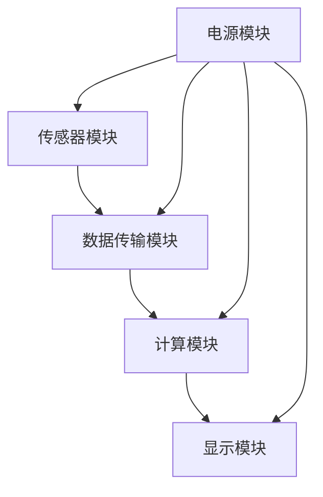

# 智能园艺手套：AI Agent的土壤状况检测

> 关键词：智能园艺手套、AI Agent、土壤状况检测、传感器技术、机器学习

> 摘要：本文聚焦于智能园艺手套结合AI Agent进行土壤状况检测这一前沿技术。详细阐述了该技术的背景、核心概念、算法原理、数学模型，通过项目实战展示了代码实现及解读。探讨了其实际应用场景，推荐了相关学习资源、开发工具和论文著作。最后对该技术的未来发展趋势与挑战进行总结，并提供常见问题解答和扩展阅读参考资料，旨在为相关领域的研究和实践提供全面且深入的指导。

## 1. 背景介绍 
### 1.1 目的和范围
智能园艺手套结合AI Agent进行土壤状况检测的目的在于为园艺工作者和爱好者提供一种便捷、准确且高效的土壤检测方式。传统的土壤检测方法往往需要专业的设备和复杂的操作流程，且检测结果的获取存在一定的延迟。而智能园艺手套的出现，将传感器技术与人工智能相结合，能够实时、快速地获取土壤的各项指标信息，如湿度、酸碱度、肥力等。本文章的范围涵盖了从智能园艺手套的核心概念、工作原理、算法实现到实际应用场景等多个方面，旨在全面介绍这一新兴技术。

### 1.2 预期读者
本文的预期读者包括园艺领域的专业人士，如园艺师、农业科研人员等，他们可以通过了解该技术，改进现有的园艺种植方法，提高作物产量和质量。同时，也适合对人工智能、传感器技术感兴趣的技术爱好者，他们可以从中学习到如何将AI技术应用于实际的检测场景中。此外，对于从事智能穿戴设备研发的工程师和科研人员，本文也能为他们提供一些新的思路和参考。

### 1.3 文档结构概述
本文首先介绍智能园艺手套结合AI Agent进行土壤状况检测的背景信息，包括目的、预期读者和文档结构概述等内容。接着阐述核心概念与联系，通过文本示意图和Mermaid流程图展示其原理和架构。然后详细讲解核心算法原理和具体操作步骤，并使用Python源代码进行说明。随后介绍数学模型和公式，结合具体例子进行详细讲解。通过项目实战部分，展示代码实际案例并进行详细解释。再探讨实际应用场景，推荐相关的工具和资源。最后总结未来发展趋势与挑战，提供常见问题解答和扩展阅读参考资料。

### 1.4 术语表
#### 1.4.1 核心术语定义
- **智能园艺手套**：一种集成了多种传感器和计算模块的穿戴设备，用于实时检测土壤的各项状况信息，并通过内置的AI Agent进行数据分析和处理。
- **AI Agent**：人工智能代理，是一种能够感知环境、做出决策并采取行动的智能实体。在智能园艺手套中，AI Agent负责对传感器采集到的数据进行分析和处理，以提供准确的土壤状况评估和建议。
- **土壤状况检测**：对土壤的物理、化学和生物学特性进行测量和分析的过程，包括土壤湿度、酸碱度、肥力等指标的检测。

#### 1.4.2 相关概念解释
- **传感器技术**：传感器是一种能够将物理量、化学量等转换为电信号的装置。在智能园艺手套中，传感器用于采集土壤的各项信息，如湿度传感器用于测量土壤的水分含量，酸碱度传感器用于测量土壤的pH值等。
- **机器学习**：机器学习是一门多领域交叉学科，涉及概率论、统计学、逼近论、凸分析、算法复杂度理论等多门学科。它专门研究计算机怎样模拟或实现人类的学习行为，以获取新的知识或技能，重新组织已有的知识结构使之不断改善自身的性能。在智能园艺手套中，机器学习算法用于对传感器采集到的数据进行分析和处理，以实现对土壤状况的准确评估和预测。

#### 1.4.3 缩略词列表
- **AI**：Artificial Intelligence，人工智能
- **pH**：Potential of Hydrogen，酸碱度

## 2. 核心概念与联系 

### 核心概念原理
智能园艺手套结合AI Agent进行土壤状况检测的核心原理是利用手套上集成的各种传感器实时采集土壤的各项信息，如湿度、酸碱度、肥力等。这些传感器将采集到的物理量转换为电信号，然后通过数据传输模块将信号传输到手套内置的计算模块中。计算模块中的AI Agent对这些数据进行分析和处理，利用机器学习算法建立土壤状况的模型，根据模型对土壤的健康状况进行评估，并提供相应的种植建议。

### 架构的文本示意图
智能园艺手套的架构主要包括以下几个部分：
1. **传感器模块**：负责采集土壤的各项信息，如湿度传感器、酸碱度传感器、肥力传感器等。
2. **数据传输模块**：将传感器采集到的数据传输到计算模块中，常见的数据传输方式包括蓝牙、Wi-Fi等。
3. **计算模块**：内置AI Agent，对传感器采集到的数据进行分析和处理，利用机器学习算法建立土壤状况模型，并进行评估和预测。
4. **显示模块**：将AI Agent分析处理后的结果显示给用户，如土壤湿度、酸碱度、肥力等级等信息。
5. **电源模块**：为智能园艺手套的各个模块提供电力支持。

### Mermaid流程图


## 3. 核心算法原理 & 具体操作步骤 

### 核心算法原理
智能园艺手套中AI Agent使用的核心算法主要是机器学习算法，如决策树、支持向量机、神经网络等。以决策树算法为例，决策树是一种基于树结构进行决策的算法，它通过对训练数据的学习，构建一棵决策树模型。在进行土壤状况检测时，将传感器采集到的数据作为输入，输入到决策树模型中，决策树模型根据树的节点进行判断，最终输出土壤的健康状况评估结果。

### Python源代码详细阐述
以下是一个使用Python实现简单决策树算法进行土壤湿度分类的示例代码：
```python
import numpy as np
from sklearn.tree import DecisionTreeClassifier
from sklearn.model_selection import train_test_split
from sklearn.metrics import accuracy_score

# 生成示例数据
# 假设我们有土壤湿度数据和对应的分类标签（0：干燥，1：湿润）
humidity_data = np.array([10, 20, 30, 40, 50, 60, 70, 80, 90, 100]).reshape(-1, 1)
labels = np.array([0, 0, 0, 0, 1, 1, 1, 1, 1, 1])

# 划分训练集和测试集
X_train, X_test, y_train, y_test = train_test_split(humidity_data, labels, test_size=0.2, random_state=42)

# 创建决策树分类器
clf = DecisionTreeClassifier()

# 训练模型
clf.fit(X_train, y_train)

# 进行预测
y_pred = clf.predict(X_test)

# 计算准确率
accuracy = accuracy_score(y_test, y_pred)
print("预测准确率：", accuracy)
```
### 具体操作步骤
1. **数据采集**：使用智能园艺手套上的传感器采集土壤的各项信息，如湿度、酸碱度、肥力等。
2. **数据预处理**：对采集到的数据进行清洗、归一化等预处理操作，以提高数据的质量和可用性。
3. **模型训练**：使用预处理后的数据对机器学习模型进行训练，如决策树、支持向量机、神经网络等。
4. **模型评估**：使用测试数据对训练好的模型进行评估，计算模型的准确率、召回率等指标，以评估模型的性能。
5. **实时检测**：将训练好的模型部署到智能园艺手套的计算模块中，实时采集土壤信息并进行检测，输出土壤的健康状况评估结果和种植建议。

## 4. 数学模型和公式 & 详细讲解 & 举例说明 

### 决策树算法的数学模型和公式
决策树算法的核心是构建一棵决策树，决策树由节点和边组成。节点分为内部节点和叶节点，内部节点表示一个特征的判断条件，叶节点表示一个分类结果。决策树的构建过程可以使用信息增益、基尼指数等指标来选择最优的特征进行划分。

#### 信息增益
信息增益是用来衡量一个特征对分类结果的影响程度的指标，其计算公式为：
$$IG(D, A) = H(D) - H(D|A)$$
其中，$IG(D, A)$ 表示特征 $A$ 对数据集 $D$ 的信息增益，$H(D)$ 表示数据集 $D$ 的信息熵，$H(D|A)$ 表示在特征 $A$ 已知的情况下，数据集 $D$ 的条件熵。

信息熵的计算公式为：
$$H(D) = -\sum_{i=1}^{n}p_i\log_2p_i$$
其中，$p_i$ 表示数据集 $D$ 中第 $i$ 类样本的比例，$n$ 表示数据集 $D$ 中类别的数量。

条件熵的计算公式为：
$$H(D|A) = \sum_{v\in Values(A)}\frac{|D^v|}{|D|}H(D^v)$$
其中，$Values(A)$ 表示特征 $A$ 的取值集合，$D^v$ 表示特征 $A$ 取值为 $v$ 的样本子集，$|D^v|$ 表示 $D^v$ 的样本数量，$|D|$ 表示数据集 $D$ 的样本数量。

#### 详细讲解
信息增益的本质是通过比较数据集在特征 $A$ 划分前后的信息熵的变化，来衡量特征 $A$ 对分类结果的影响程度。信息增益越大，说明特征 $A$ 对分类结果的影响越大，越适合作为划分特征。

### 举例说明
假设我们有一个数据集 $D$，包含 10 个样本，分为两类（类别 1 和类别 2），其中类别 1 有 6 个样本，类别 2 有 4 个样本。现在有一个特征 $A$，其取值有两个（取值 1 和取值 2），特征 $A$ 取值为 1 的样本有 5 个，其中类别 1 有 3 个，类别 2 有 2 个；特征 $A$ 取值为 2 的样本有 5 个，其中类别 1 有 3 个，类别 2 有 2 个。

首先计算数据集 $D$ 的信息熵：
$$p_1 = \frac{6}{10} = 0.6, p_2 = \frac{4}{10} = 0.4$$
$$H(D) = -0.6\log_20.6 - 0.4\log_20.4 \approx 0.971$$

然后计算特征 $A$ 取值为 1 的样本子集 $D^1$ 的信息熵：
$$p_{11} = \frac{3}{5} = 0.6, p_{12} = \frac{2}{5} = 0.4$$
$$H(D^1) = -0.6\log_20.6 - 0.4\log_20.4 \approx 0.971$$

特征 $A$ 取值为 2 的样本子集 $D^2$ 的信息熵：
$$p_{21} = \frac{3}{5} = 0.6, p_{22} = \frac{2}{5} = 0.4$$
$$H(D^2) = -0.6\log_20.6 - 0.4\log_20.4 \approx 0.971$$

接着计算条件熵：
$$H(D|A) = \frac{5}{10}H(D^1) + \frac{5}{10}H(D^2) = 0.5\times0.971 + 0.5\times0.971 = 0.971$$

最后计算信息增益：
$$IG(D, A) = H(D) - H(D|A) = 0.971 - 0.971 = 0$$

从计算结果可以看出，特征 $A$ 对数据集 $D$ 的信息增益为 0，说明特征 $A$ 对分类结果没有影响，不适合作为划分特征。

## 5. 项目实战：代码实际案例和详细解释说明 

### 5.1  开发环境搭建
#### 硬件环境
- 智能园艺手套：选择一款集成了湿度传感器、酸碱度传感器等多种传感器的智能园艺手套。
- 开发板：如Arduino、Raspberry Pi等，用于处理传感器采集到的数据。
- 电脑：用于编写和调试代码。

#### 软件环境
- Python：安装Python 3.x版本，用于编写机器学习算法和数据处理代码。
- 相关库：安装NumPy、Pandas、Scikit-learn等库，用于数据处理和机器学习模型的训练。
- 开发工具：选择一款适合Python开发的IDE，如PyCharm、Jupyter Notebook等。

### 5.2  源代码详细实现和代码解读
以下是一个完整的智能园艺手套土壤状况检测项目的代码示例：
```python
import numpy as np
import pandas as pd
from sklearn.model_selection import train_test_split
from sklearn.tree import DecisionTreeClassifier
from sklearn.metrics import accuracy_score

# 模拟传感器采集的数据
# 假设我们采集了土壤湿度、酸碱度和肥力数据
humidity = np.random.randint(0, 100, 100)
ph = np.random.uniform(3, 10, 100)
fertility = np.random.randint(0, 10, 100)

# 生成对应的分类标签（0：不适宜种植，1：适宜种植）
labels = []
for i in range(100):
    if humidity[i] > 30 and 6 < ph[i] < 8 and fertility[i] > 5:
        labels.append(1)
    else:
        labels.append(0)

# 创建数据集
data = pd.DataFrame({
    'humidity': humidity,
    'ph': ph,
    'fertility': fertility,
    'label': labels
})

# 划分特征和标签
X = data[['humidity', 'ph', 'fertility']]
y = data['label']

# 划分训练集和测试集
X_train, X_test, y_train, y_test = train_test_split(X, y, test_size=0.2, random_state=42)

# 创建决策树分类器
clf = DecisionTreeClassifier()

# 训练模型
clf.fit(X_train, y_train)

# 进行预测
y_pred = clf.predict(X_test)

# 计算准确率
accuracy = accuracy_score(y_test, y_pred)
print("预测准确率：", accuracy)

# 模拟实时检测
new_humidity = 50
new_ph = 7
new_fertility = 7
new_data = np.array([[new_humidity, new_ph, new_fertility]])
prediction = clf.predict(new_data)
if prediction[0] == 1:
    print("当前土壤状况适宜种植。")
else:
    print("当前土壤状况不适宜种植。")
```
### 代码解读与分析
1. **数据模拟**：使用NumPy库生成模拟的土壤湿度、酸碱度和肥力数据，并根据一定的规则生成对应的分类标签。
2. **数据集创建**：使用Pandas库将模拟的数据创建成一个DataFrame对象，方便后续的数据处理和分析。
3. **特征和标签划分**：将DataFrame对象中的特征（湿度、酸碱度、肥力）和标签（适宜种植或不适宜种植）进行划分。
4. **训练集和测试集划分**：使用Scikit-learn库的`train_test_split`函数将数据集划分为训练集和测试集，比例为8:2。
5. **模型创建和训练**：使用Scikit-learn库的`DecisionTreeClassifier`类创建一个决策树分类器，并使用训练集对模型进行训练。
6. **模型预测和评估**：使用训练好的模型对测试集进行预测，并使用`accuracy_score`函数计算预测的准确率。
7. **实时检测模拟**：模拟实时采集的土壤数据，将其输入到训练好的模型中进行预测，并输出预测结果。

## 6. 实际应用场景 
### 家庭园艺
对于家庭园艺爱好者来说，智能园艺手套可以帮助他们实时了解土壤的状况，根据检测结果合理浇水、施肥和调整土壤酸碱度，从而提高植物的生长质量和成活率。例如，当手套检测到土壤湿度较低时，会提醒用户及时浇水；当检测到土壤肥力不足时，会建议用户添加适当的肥料。

### 农业生产
在农业生产中，智能园艺手套可以用于大面积农田的土壤状况检测。农民可以使用手套快速、准确地获取土壤的各项指标信息，根据检测结果制定科学的种植方案，合理使用化肥和农药，提高农作物的产量和质量。同时，手套还可以帮助农民及时发现土壤中的问题，如土壤污染、酸碱度异常等，采取相应的措施进行治理。

### 园艺科研
在园艺科研领域，智能园艺手套可以为科研人员提供大量的土壤数据，帮助他们深入研究土壤的特性和植物的生长规律。科研人员可以使用手套对不同地区、不同类型的土壤进行检测，分析土壤因素对植物生长的影响，为园艺种植技术的改进和创新提供依据。

## 7. 工具和资源推荐
### 7.1 学习资源推荐
#### 7.1.1 书籍推荐
- 《机器学习》（周志华著）：这本书是机器学习领域的经典教材，全面介绍了机器学习的基本概念、算法和应用，适合初学者和有一定基础的读者阅读。
- 《Python机器学习》（Sebastian Raschka著）：本书以Python为工具，详细介绍了机器学习的各种算法和应用，通过大量的实例代码帮助读者更好地理解和掌握机器学习技术。
- 《传感器技术基础》（何道清编著）：该书系统地介绍了传感器的基本原理、分类、特性和应用，对于学习传感器技术的读者来说是一本很好的参考书籍。

#### 7.1.2 在线课程
- Coursera上的“Machine Learning”课程（Andrew Ng教授授课）：这是一门非常经典的机器学习在线课程，由斯坦福大学的Andrew Ng教授授课，课程内容涵盖了机器学习的基本概念、算法和应用，适合初学者学习。
- edX上的“Introduction to Artificial Intelligence”课程：该课程介绍了人工智能的基本概念、技术和应用，包括机器学习、自然语言处理、计算机视觉等方面的内容，对于想要了解人工智能领域的读者来说是一个不错的选择。
- 中国大学MOOC上的“传感器原理及应用”课程：该课程详细介绍了传感器的原理、分类和应用，通过实验和案例分析帮助学生更好地理解和掌握传感器技术。

#### 7.1.3 技术博客和网站
- Medium：这是一个技术博客平台，上面有很多关于人工智能、传感器技术等领域的优秀文章，读者可以从中学习到最新的技术和研究成果。
- Towards Data Science：该网站专注于数据科学和机器学习领域的技术分享和交流，提供了很多实用的教程和案例分析。
- 传感器技术网：这是一个专业的传感器技术网站，提供了传感器的最新产品信息、技术文章和行业动态等内容，对于学习传感器技术的读者来说是一个很好的资源平台。

### 7.2 开发工具框架推荐
#### 7.2.1 IDE和编辑器
- PyCharm：这是一款专业的Python集成开发环境，具有代码编辑、调试、自动补全、版本控制等功能，适合Python开发者使用。
- Jupyter Notebook：这是一个基于Web的交互式开发环境，支持Python、R等多种编程语言，适合数据科学家和机器学习工程师进行数据探索和模型开发。
- Visual Studio Code：这是一款轻量级的代码编辑器，支持多种编程语言和插件扩展，具有丰富的功能和良好的用户体验，适合初学者和有一定经验的开发者使用。

#### 7.2.2 调试和性能分析工具
- PDB：这是Python自带的调试工具，可以帮助开发者在代码中设置断点、单步执行、查看变量值等，方便进行代码调试。
- cProfile：这是Python的性能分析工具，可以帮助开发者分析代码的性能瓶颈，找出运行时间较长的函数和代码段，进行优化。
- TensorBoard：这是TensorFlow的可视化工具，可以帮助开发者可视化模型的训练过程、损失函数变化、模型结构等信息，方便进行模型调试和优化。

#### 7.2.3 相关框架和库
- Scikit-learn：这是一个常用的机器学习库，提供了丰富的机器学习算法和工具，如分类、回归、聚类等算法，以及数据预处理、模型评估等工具。
- TensorFlow：这是一个开源的深度学习框架，由Google开发，提供了丰富的深度学习模型和工具，如神经网络、卷积神经网络、循环神经网络等，适合进行大规模的深度学习模型开发。
- Keras：这是一个高级神经网络API，基于TensorFlow、Theano等后端，提供了简单易用的接口，适合快速搭建和训练深度学习模型。

### 7.3 相关论文著作推荐
#### 7.3.1 经典论文
- “A Decision-Theoretic Generalization of On-Line Learning and an Application to Boosting”（Yoav Freund和Robert E. Schapire著）：这篇论文提出了AdaBoost算法，是机器学习领域的经典论文之一，对后续的集成学习算法发展产生了重要影响。
- “Gradient-Based Learning Applied to Document Recognition”（Yann LeCun, Léon Bottou, Yoshua Bengio, and Patrick Haffner著）：这篇论文介绍了卷积神经网络（CNN）在手写数字识别中的应用，是CNN领域的经典论文之一，推动了深度学习在计算机视觉领域的发展。
- “Learning Representations by Back-propagating Errors”（David E. Rumelhart, Geoffrey E. Hinton, and Ronald J. Williams著）：这篇论文提出了反向传播算法，是神经网络领域的经典论文之一，为神经网络的训练提供了有效的方法。

#### 7.3.2 最新研究成果
- 可以关注IEEE Transactions on Pattern Analysis and Machine Intelligence、Journal of Artificial Intelligence Research等顶级学术期刊，以及NeurIPS、ICML、CVPR等国际学术会议，获取人工智能、机器学习领域的最新研究成果。

#### 7.3.3 应用案例分析
- 可以参考一些实际的智能园艺项目案例，如一些农业科技公司发布的智能园艺解决方案，了解智能园艺手套在实际应用中的效果和经验。

## 8. 总结：未来发展趋势与挑战
### 未来发展趋势
- **功能集成化**：未来的智能园艺手套将集成更多的传感器和功能，不仅可以检测土壤的湿度、酸碱度、肥力等指标，还可以检测土壤中的微生物群落、重金属含量等信息，为用户提供更全面的土壤状况评估。
- **智能化程度提高**：随着人工智能技术的不断发展，智能园艺手套中的AI Agent将具有更强的学习和推理能力，能够根据不同的植物品种和生长阶段，提供更加个性化的种植建议。
- **与其他设备的互联互通**：智能园艺手套将与其他智能设备，如智能灌溉系统、智能施肥系统等进行互联互通，实现自动化的园艺种植管理。用户可以通过手机APP等终端设备远程监控和控制园艺种植过程。

### 挑战
- **传感器精度和稳定性**：传感器的精度和稳定性是影响智能园艺手套检测结果准确性的关键因素。目前，传感器技术还存在一定的局限性，如传感器的精度容易受到环境因素的影响，传感器的稳定性需要进一步提高。
- **数据安全和隐私保护**：智能园艺手套采集的土壤数据包含了用户的种植信息和土壤环境信息，这些数据的安全和隐私保护是一个重要的问题。需要采取有效的措施，如数据加密、访问控制等，确保数据的安全和隐私。
- **成本问题**：智能园艺手套的研发和生产成本较高，导致产品价格相对较贵，限制了其在市场上的推广和应用。需要进一步降低成本，提高产品的性价比，以满足更多用户的需求。

## 9. 附录：常见问题与解答
### 问题1：智能园艺手套的检测结果准确吗？
答：智能园艺手套的检测结果的准确性受到多种因素的影响，如传感器的精度、数据处理算法的准确性等。一般来说，经过严格校准和测试的智能园艺手套可以提供较为准确的检测结果。但是，由于土壤环境的复杂性和多样性，检测结果可能会存在一定的误差。为了提高检测结果的准确性，建议定期对传感器进行校准，并结合其他检测方法进行验证。

### 问题2：智能园艺手套可以检测哪些土壤指标？
答：智能园艺手套通常可以检测土壤的湿度、酸碱度、肥力等指标。一些高端的智能园艺手套还可以检测土壤中的微生物群落、重金属含量等信息。不同型号的智能园艺手套检测的指标可能会有所不同，用户可以根据自己的需求选择合适的产品。

### 问题3：智能园艺手套的电池续航能力如何？
答：智能园艺手套的电池续航能力取决于手套的型号和使用情况。一般来说，智能园艺手套的电池续航时间可以达到数小时至数十小时不等。为了延长电池续航时间，建议在不使用手套时及时关闭电源，并避免长时间连续使用。

### 问题4：智能园艺手套可以与手机APP连接吗？
答：大多数智能园艺手套都支持与手机APP连接。通过手机APP，用户可以实时查看土壤的检测结果、接收种植建议、设置提醒等功能。同时，手机APP还可以实现数据的存储和分析，方便用户对种植过程进行管理和记录。

## 10. 扩展阅读 & 参考资料
### 扩展阅读
- 《智能穿戴设备技术与应用》：这本书全面介绍了智能穿戴设备的技术原理、应用场景和发展趋势，对于了解智能园艺手套等智能穿戴设备有很大的帮助。
- 《农业物联网技术与应用》：该书介绍了农业物联网的基本概念、技术和应用，包括传感器技术、数据传输技术、云计算技术等，对于理解智能园艺手套在农业领域的应用有一定的参考价值。

### 参考资料
- 相关的学术论文和研究报告，如IEEE、ACM等学术数据库中的论文。
- 智能园艺手套的产品说明书和技术文档。
- 互联网上的相关技术博客和论坛，如Stack Overflow、GitHub等。

作者：AI天才研究院/AI Genius Institute & 禅与计算机程序设计艺术 /Zen And The Art of Computer Programming