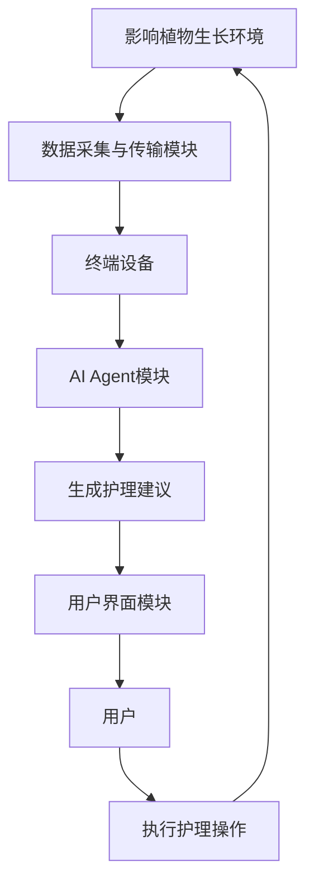

# 智能园艺手套：AI Agent的植物护理指导

> 关键词：智能园艺手套、AI Agent、植物护理指导、传感器技术、数据分析

> 摘要：本文聚焦于智能园艺手套结合AI Agent实现植物护理指导这一前沿技术。详细介绍了智能园艺手套的背景，包括其目的、适用读者、文档结构和相关术语。深入阐述了核心概念、算法原理、数学模型，通过Python代码进行算法演示。给出项目实战案例，从开发环境搭建到代码实现与解读。探讨了实际应用场景，推荐了学习资源、开发工具和相关论文。最后总结未来发展趋势与挑战，并提供常见问题解答和参考资料，旨在为智能园艺领域的研究和实践提供全面且深入的技术指引。

## 1. 背景介绍 
### 1.1 目的和范围
智能园艺手套的研发目的在于为园艺爱好者和专业园艺工作者提供一种便捷、智能的植物护理解决方案。传统的园艺护理主要依赖于人工经验和简单的工具，缺乏对植物生长环境和健康状况的实时、精准监测与指导。而智能园艺手套集成了多种传感器和AI Agent技术，能够实时采集植物生长环境的各项参数，并通过AI算法进行分析，为用户提供个性化的植物护理建议。

本文的范围涵盖了智能园艺手套的核心概念、算法原理、数学模型、项目实战、实际应用场景等方面，旨在全面介绍这一创新技术的原理、实现方法和应用价值。

### 1.2 预期读者
本文预期读者包括园艺爱好者、专业园艺工作者、计算机科学与人工智能领域的研究人员和开发者、相关专业的学生等。对于园艺爱好者和专业工作者，本文可以帮助他们了解智能园艺手套的功能和使用方法，提升植物护理的效率和质量；对于计算机科学与人工智能领域的人员，本文提供了一个跨学科应用的案例，有助于拓展技术应用场景和创新思路；对于学生而言，本文可以作为学习相关知识和技术的参考资料。

### 1.3 文档结构概述
本文将按照以下结构进行阐述：首先介绍智能园艺手套的背景信息，包括目的、预期读者和文档结构；接着详细讲解核心概念与联系，通过文本示意图和Mermaid流程图展示其原理和架构；然后深入探讨核心算法原理和具体操作步骤，并使用Python代码进行详细阐述；随后介绍数学模型和公式，并举例说明；通过项目实战部分展示代码实际案例和详细解释；分析实际应用场景；推荐相关的学习资源、开发工具和论文著作；最后总结未来发展趋势与挑战，提供常见问题解答和参考资料。

### 1.4 术语表
#### 1.4.1 核心术语定义
- **智能园艺手套**：一种集成了多种传感器和计算模块的手套，能够实时采集植物生长环境的参数，并通过AI Agent进行分析和处理，为用户提供植物护理指导。
- **AI Agent**：人工智能代理，是一种能够感知环境、做出决策并采取行动的智能实体。在智能园艺手套中，AI Agent根据传感器采集的数据，分析植物的生长状况和需求，提供相应的护理建议。
- **传感器**：用于检测物理量、化学量或生物量的装置，在智能园艺手套中，传感器可以检测土壤湿度、温度、光照强度、养分含量等参数。
- **数据分析**：对采集到的数据进行清洗、处理、分析和挖掘的过程，以提取有价值的信息和知识。在智能园艺手套中，数据分析用于评估植物的生长状况和预测未来的需求。

#### 1.4.2 相关概念解释
- **物联网（IoT）**：通过各种信息传感器、射频识别技术、全球定位系统等技术和装置，实时采集任何需要监控、连接、互动的物体或过程的信息，通过各类可能的网络接入，实现物与物、物与人的泛在连接，实现对物品和过程的智能化感知、识别和管理。智能园艺手套可以看作是物联网在园艺领域的一个应用实例。
- **机器学习**：一门多领域交叉学科，涉及概率论、统计学、逼近论、凸分析、算法复杂度理论等多门学科。它专门研究计算机怎样模拟或实现人类的学习行为，以获取新的知识或技能，重新组织已有的知识结构使之不断改善自身的性能。在智能园艺手套中，机器学习算法可以用于分析传感器数据，预测植物的生长状况和需求。

#### 1.4.3 缩略词列表
- **AI**：Artificial Intelligence，人工智能
- **IoT**：Internet of Things，物联网
- **ML**：Machine Learning，机器学习

## 2. 核心概念与联系 
智能园艺手套的核心概念是将传感器技术、数据分析和AI Agent相结合，实现对植物生长环境的实时监测和个性化的护理指导。其原理和架构可以通过以下文本示意图和Mermaid流程图进行展示。

### 文本示意图
智能园艺手套主要由以下几个部分组成：
- **传感器模块**：集成了多种传感器，如土壤湿度传感器、温度传感器、光照强度传感器、养分传感器等，用于实时采集植物生长环境的各项参数。
- **数据采集与传输模块**：负责将传感器采集到的数据进行处理和转换，并通过无线通信技术（如蓝牙、Wi-Fi等）传输到智能手机或其他终端设备。
- **AI Agent模块**：运行在终端设备上的AI算法，根据接收到的传感器数据，分析植物的生长状况和需求，生成个性化的护理建议。
- **用户界面模块**：提供一个直观的界面，让用户可以查看传感器数据、护理建议和历史记录等信息，并与智能园艺手套进行交互。

### Mermaid流程图


该流程图展示了智能园艺手套的工作流程：传感器模块采集植物生长环境的数据，数据采集与传输模块将数据传输到终端设备，AI Agent模块对数据进行分析并生成护理建议，用户通过用户界面模块查看建议并执行护理操作，护理操作又会影响植物的生长环境，形成一个闭环的反馈系统。

## 3. 核心算法原理 & 具体操作步骤 
### 核心算法原理
智能园艺手套的核心算法主要包括数据预处理、特征提取、模型训练和护理建议生成等步骤。以下是使用Python代码详细阐述这些步骤的实现方法。

#### 数据预处理
数据预处理的目的是清洗和转换传感器采集到的数据，去除噪声和异常值，使数据更适合后续的分析和处理。以下是一个简单的数据预处理示例：
```python
import numpy as np

# 模拟传感器采集到的数据
sensor_data = np.array([10, 12, 15, 999, 13, 11])

# 去除异常值
threshold = 100
cleaned_data = sensor_data[sensor_data < threshold]

print("原始数据:", sensor_data)
print("清洗后的数据:", cleaned_data)
```
#### 特征提取
特征提取是从清洗后的数据中提取有代表性的特征，用于后续的模型训练。例如，可以计算数据的均值、方差、最大值、最小值等统计特征。以下是一个特征提取的示例：
```python
# 计算统计特征
mean_value = np.mean(cleaned_data)
std_value = np.std(cleaned_data)
max_value = np.max(cleaned_data)
min_value = np.min(cleaned_data)

print("均值:", mean_value)
print("标准差:", std_value)
print("最大值:", max_value)
print("最小值:", min_value)
```
#### 模型训练
模型训练是使用机器学习算法对提取的特征进行训练，建立植物生长状况和护理需求之间的关系模型。这里以简单的线性回归模型为例：
```python
from sklearn.linear_model import LinearRegression
from sklearn.model_selection import train_test_split

# 模拟特征数据和对应的护理需求标签
X = np.array([[10], [12], [15], [13], [11]])
y = np.array([1, 2, 3, 2, 1])

# 划分训练集和测试集
X_train, X_test, y_train, y_test = train_test_split(X, y, test_size=0.2, random_state=42)

# 创建线性回归模型
model = LinearRegression()

# 训练模型
model.fit(X_train, y_train)

# 预测测试集数据
y_pred = model.predict(X_test)

print("预测结果:", y_pred)
```
#### 护理建议生成
护理建议生成是根据训练好的模型和实时采集到的传感器数据，生成具体的护理建议。例如，如果模型预测植物需要浇水，则生成“请给植物浇水”的建议。以下是一个简单的护理建议生成示例：
```python
# 模拟实时传感器数据
current_data = np.array([[14]])

# 使用训练好的模型进行预测
prediction = model.predict(current_data)

# 根据预测结果生成护理建议
if prediction > 2:
    advice = "请给植物浇水"
else:
    advice = "植物水分充足，无需浇水"

print("护理建议:", advice)
```

### 具体操作步骤
1. **传感器数据采集**：使用智能园艺手套上的传感器实时采集植物生长环境的各项参数。
2. **数据传输**：将采集到的数据通过无线通信技术传输到终端设备。
3. **数据预处理**：对传输到终端设备的数据进行清洗和转换，去除噪声和异常值。
4. **特征提取**：从清洗后的数据中提取有代表性的特征。
5. **模型训练**：使用机器学习算法对提取的特征进行训练，建立植物生长状况和护理需求之间的关系模型。
6. **护理建议生成**：根据训练好的模型和实时采集到的传感器数据，生成具体的护理建议。
7. **用户交互**：通过用户界面模块将护理建议展示给用户，并允许用户进行交互和反馈。

## 4. 数学模型和公式 & 详细讲解 & 举例说明 
### 线性回归模型
线性回归是一种简单而常用的机器学习模型，用于建立自变量和因变量之间的线性关系。在智能园艺手套中，可以使用线性回归模型来预测植物的护理需求。

#### 数学模型
线性回归模型的数学表达式为：
$$y = \beta_0 + \beta_1x_1 + \beta_2x_2 + \cdots + \beta_nx_n + \epsilon$$
其中，$y$ 是因变量（如植物的护理需求），$x_1, x_2, \cdots, x_n$ 是自变量（如土壤湿度、温度、光照强度等），$\beta_0, \beta_1, \cdots, \beta_n$ 是模型的参数，$\epsilon$ 是误差项。

#### 模型训练
线性回归模型的训练目标是找到一组最优的参数 $\beta_0, \beta_1, \cdots, \beta_n$，使得模型的预测值与真实值之间的误差最小。常用的误差度量方法是均方误差（Mean Squared Error, MSE），其数学表达式为：
$$MSE = \frac{1}{m}\sum_{i=1}^{m}(y_i - \hat{y}_i)^2$$
其中，$m$ 是样本数量，$y_i$ 是第 $i$ 个样本的真实值，$\hat{y}_i$ 是第 $i$ 个样本的预测值。

为了找到最优的参数，可以使用最小二乘法（Least Squares Method）来求解。最小二乘法的目标是最小化均方误差，即：
$$\min_{\beta_0, \beta_1, \cdots, \beta_n} MSE$$

#### 举例说明
假设我们有一组样本数据，其中自变量 $x$ 表示土壤湿度，因变量 $y$ 表示植物的浇水需求。我们可以使用线性回归模型来建立它们之间的关系。

```python
import numpy as np
from sklearn.linear_model import LinearRegression

# 模拟样本数据
X = np.array([[10], [12], [15], [13], [11]])
y = np.array([1, 2, 3, 2, 1])

# 创建线性回归模型
model = LinearRegression()

# 训练模型
model.fit(X, y)

# 输出模型参数
print("截距:", model.intercept_)
print("斜率:", model.coef_)

# 预测新数据
new_X = np.array([[14]])
prediction = model.predict(new_X)
print("预测结果:", prediction)
```
在这个例子中，我们使用线性回归模型对样本数据进行训练，得到了模型的截距和斜率。然后，我们使用训练好的模型对新的土壤湿度数据进行预测，得到了植物的浇水需求预测结果。

### 决策树模型
决策树是一种常用的机器学习模型，用于分类和回归问题。在智能园艺手套中，可以使用决策树模型来根据植物生长环境的参数进行分类，从而生成相应的护理建议。

#### 数学模型
决策树模型是一种基于树结构进行决策的模型，每个内部节点表示一个属性上的测试，每个分支表示一个测试输出，每个叶节点表示一个类别或值。决策树的构建过程是通过递归地选择最优的属性进行划分，直到满足停止条件为止。

#### 模型训练
决策树模型的训练过程主要包括以下几个步骤：
1. **选择最优属性**：使用信息增益、信息增益率、基尼指数等指标来选择最优的属性进行划分。
2. **划分数据集**：根据选择的属性将数据集划分为不同的子集。
3. **递归构建决策树**：对每个子集递归地执行步骤1和步骤2，直到满足停止条件为止。

#### 举例说明
```python
from sklearn.tree import DecisionTreeClassifier
from sklearn.datasets import load_iris
from sklearn.model_selection import train_test_split

# 加载鸢尾花数据集
iris = load_iris()
X = iris.data
y = iris.target

# 划分训练集和测试集
X_train, X_test, y_train, y_test = train_test_split(X, y, test_size=0.2, random_state=42)

# 创建决策树模型
model = DecisionTreeClassifier()

# 训练模型
model.fit(X_train, y_train)

# 预测测试集数据
y_pred = model.predict(X_test)

print("预测结果:", y_pred)
```
在这个例子中，我们使用决策树模型对鸢尾花数据集进行分类。首先，我们加载数据集并划分训练集和测试集，然后创建决策树模型并进行训练，最后使用训练好的模型对测试集数据进行预测。

## 5. 项目实战：代码实际案例和详细解释说明 
### 5.1  开发环境搭建
#### 硬件环境
- **智能园艺手套**：选择一款集成了多种传感器的智能园艺手套，确保传感器能够正常工作并采集到准确的数据。
- **终端设备**：可以使用智能手机、平板电脑或计算机作为终端设备，确保终端设备支持蓝牙或Wi-Fi通信功能。

#### 软件环境
- **操作系统**：根据终端设备的类型选择合适的操作系统，如Android、iOS或Windows。
- **开发语言**：选择Python作为开发语言，因为Python具有丰富的机器学习和数据分析库，适合用于智能园艺手套的开发。
- **开发框架和库**：使用以下开发框架和库：
    - **NumPy**：用于数值计算和数组操作。
    - **Pandas**：用于数据处理和分析。
    - **Scikit-learn**：用于机器学习模型的训练和预测。
    - **Matplotlib**：用于数据可视化。

### 5.2  源代码详细实现和代码解读
以下是一个完整的智能园艺手套项目的源代码示例，包括数据采集、数据处理、模型训练和护理建议生成等步骤。

```python
import numpy as np
import pandas as pd
from sklearn.linear_model import LinearRegression
from sklearn.model_selection import train_test_split
import matplotlib.pyplot as plt

# 模拟传感器采集到的数据
def generate_sensor_data():
    soil_moisture = np.random.randint(0, 100, 100)
    temperature = np.random.randint(10, 30, 100)
    light_intensity = np.random.randint(0, 1000, 100)
    plant_health = np.random.randint(0, 5, 100)

    data = {
        'soil_moisture': soil_moisture,
        'temperature': temperature,
        'light_intensity': light_intensity,
        'plant_health': plant_health
    }

    df = pd.DataFrame(data)
    return df

# 数据预处理
def preprocess_data(df):
    # 去除异常值
    df = df[(df['soil_moisture'] < 100) & (df['temperature'] < 50) & (df['light_intensity'] < 2000)]
    return df

# 特征提取
def extract_features(df):
    X = df[['soil_moisture', 'temperature', 'light_intensity']]
    y = df['plant_health']
    return X, y

# 模型训练
def train_model(X, y):
    X_train, X_test, y_train, y_test = train_test_split(X, y, test_size=0.2, random_state=42)
    model = LinearRegression()
    model.fit(X_train, y_train)
    return model

# 护理建议生成
def generate_advice(model, current_data):
    prediction = model.predict(current_data)
    if prediction > 3:
        advice = "植物健康状况良好，继续保持当前护理"
    elif prediction > 1:
        advice = "植物健康状况一般，建议适当调整护理措施"
    else:
        advice = "植物健康状况较差，需要加强护理"
    return advice

# 主函数
def main():
    # 数据采集
    df = generate_sensor_data()

    # 数据预处理
    df = preprocess_data(df)

    # 特征提取
    X, y = extract_features(df)

    # 模型训练
    model = train_model(X, y)

    # 模拟实时传感器数据
    current_data = np.array([[50, 20, 500]])

    # 护理建议生成
    advice = generate_advice(model, current_data)

    print("护理建议:", advice)

    # 数据可视化
    plt.scatter(df['soil_moisture'], df['plant_health'])
    plt.xlabel('土壤湿度')
    plt.ylabel('植物健康状况')
    plt.title('土壤湿度与植物健康状况的关系')
    plt.show()

if __name__ == "__main__":
    main()
```

### 5.3  代码解读与分析
#### 数据采集
`generate_sensor_data` 函数模拟了传感器采集到的数据，包括土壤湿度、温度、光照强度和植物健康状况。这些数据被存储在一个Pandas DataFrame中。

#### 数据预处理
`preprocess_data` 函数对采集到的数据进行预处理，去除了异常值，确保数据的质量。

#### 特征提取
`extract_features` 函数从预处理后的数据中提取了特征和标签，用于后续的模型训练。

#### 模型训练
`train_model` 函数使用线性回归模型对提取的特征和标签进行训练，得到了一个训练好的模型。

#### 护理建议生成
`generate_advice` 函数根据训练好的模型和实时传感器数据，生成了相应的护理建议。

#### 主函数
`main` 函数调用了上述各个函数，完成了数据采集、数据处理、模型训练和护理建议生成等步骤，并使用Matplotlib库对数据进行了可视化展示。

## 6. 实际应用场景 
### 家庭园艺
对于家庭园艺爱好者来说，智能园艺手套可以帮助他们更好地照顾自己的植物。通过实时监测土壤湿度、温度、光照强度等参数，智能园艺手套可以为用户提供个性化的浇水、施肥、修剪等护理建议，让用户无需具备专业的园艺知识也能轻松养护植物。

### 商业园艺
在商业园艺领域，智能园艺手套可以提高园艺生产的效率和质量。园艺工作者可以使用智能园艺手套实时监测大面积种植区域的植物生长环境，及时发现问题并采取相应的措施。同时，智能园艺手套还可以帮助园艺企业优化资源配置，降低生产成本。

### 农业科研
在农业科研领域，智能园艺手套可以为研究人员提供大量的植物生长环境数据，帮助他们深入了解植物的生长规律和需求。研究人员可以使用这些数据进行实验设计和分析，开发出更加科学、有效的植物种植和护理方法。

## 7. 工具和资源推荐
### 7.1 学习资源推荐
#### 7.1.1 书籍推荐
- 《Python机器学习实战》：本书详细介绍了Python在机器学习领域的应用，包括数据预处理、模型训练、模型评估等方面的内容，适合初学者学习。
- 《机器学习》（周志华著）：本书是机器学习领域的经典教材，系统地介绍了机器学习的基本概念、算法和应用，适合有一定编程基础的读者深入学习。
- 《传感器技术基础》：本书介绍了传感器的基本原理、分类和应用，对于了解智能园艺手套中的传感器技术有很大的帮助。

#### 7.1.2 在线课程
- Coursera上的“Machine Learning”课程：由斯坦福大学教授Andrew Ng主讲，是一门非常经典的机器学习课程，涵盖了机器学习的基本概念、算法和应用。
- edX上的“Data Science MicroMasters Program”：该课程提供了数据科学领域的全面学习路径，包括数据处理、数据分析、机器学习等方面的内容。
- 中国大学MOOC上的“传感器原理及应用”课程：该课程介绍了传感器的基本原理、分类和应用，适合初学者学习。

#### 7.1.3 技术博客和网站
- Medium：一个技术博客平台，上面有很多关于人工智能、机器学习、传感器技术等方面的优秀文章。
- Towards Data Science：一个专注于数据科学和机器学习的技术博客，提供了很多实用的教程和案例。
- IEEE Xplore：一个电气和电子工程师协会（IEEE）的数字图书馆，上面有很多关于传感器技术、物联网、人工智能等方面的学术论文和研究报告。

### 7.2 开发工具框架推荐
#### 7.2.1 IDE和编辑器
- PyCharm：一个专业的Python集成开发环境，提供了代码编辑、调试、版本控制等功能，适合Python开发。
- Jupyter Notebook：一个交互式的笔记本环境，适合进行数据分析和模型训练的实验和演示。
- Visual Studio Code：一个轻量级的代码编辑器，支持多种编程语言和插件扩展，适合快速开发和调试。

#### 7.2.2 调试和性能分析工具
- PDB：Python自带的调试工具，可以帮助开发者调试Python代码。
- Numba：一个用于加速Python代码的JIT编译器，可以提高Python代码的运行效率。
- cProfile：Python自带的性能分析工具，可以帮助开发者分析Python代码的性能瓶颈。

#### 7.2.3 相关框架和库
- NumPy：用于数值计算和数组操作的Python库。
- Pandas：用于数据处理和分析的Python库。
- Scikit-learn：用于机器学习模型的训练和预测的Python库。
- TensorFlow：一个开源的机器学习框架，用于构建和训练深度学习模型。
- Keras：一个高级神经网络API，基于TensorFlow、Theano等后端，适合快速搭建和训练神经网络模型。

### 7.3 相关论文著作推荐
#### 7.3.1 经典论文
- “A Logical Calculus of the Ideas Immanent in Nervous Activity”（Warren S. McCulloch and Walter Pitts, 1943）：这篇论文提出了人工神经网络的基本概念，是神经网络领域的经典之作。
- “Pattern Recognition and Machine Learning”（Christopher M. Bishop, 2006）：这是一本机器学习领域的经典教材，系统地介绍了机器学习的基本概念、算法和应用。
- “Sensors for Smart Farming: A Review”（A. K. Singh, et al., 2018）：这篇论文对智能农业中使用的传感器技术进行了综述，包括传感器的类型、原理和应用。

#### 7.3.2 最新研究成果
- 在IEEE Sensors Journal、Journal of Agricultural and Food Chemistry等学术期刊上可以找到关于智能园艺手套和相关技术的最新研究成果。
- 在ACM SIGKDD、NeurIPS等顶级学术会议上也会有关于人工智能、机器学习在农业领域应用的最新研究成果。

#### 7.3.3 应用案例分析
- 可以在相关的行业报告和企业官网中找到智能园艺手套和相关技术的应用案例分析，了解这些技术在实际应用中的效果和挑战。

## 8. 总结：未来发展趋势与挑战
### 未来发展趋势
- **多传感器融合**：未来的智能园艺手套将集成更多类型的传感器，如气体传感器、生物传感器等，实现对植物生长环境的更全面、更精准的监测。
- **智能化程度提升**：随着人工智能技术的不断发展，智能园艺手套的AI Agent将具备更强的学习和推理能力，能够根据不同植物的特点和生长阶段，提供更加个性化、智能化的护理建议。
- **与物联网和云计算的结合**：智能园艺手套将与物联网和云计算技术相结合，实现数据的实时传输和共享，用户可以通过手机APP或网页随时随地查看植物的生长状况和护理建议。
- **跨领域应用拓展**：智能园艺手套的技术和理念将拓展到其他领域，如城市绿化、生态修复等，为解决更多的环境和生态问题提供支持。

### 挑战
- **传感器精度和可靠性**：传感器的精度和可靠性是智能园艺手套能否准确监测植物生长环境的关键。目前，传感器技术还存在一定的局限性，如精度不够高、易受环境干扰等问题，需要进一步提高传感器的性能。
- **数据安全和隐私保护**：智能园艺手套采集到的植物生长环境数据涉及用户的隐私和商业机密，需要采取有效的数据安全和隐私保护措施，防止数据泄露和滥用。
- **算法复杂度和计算资源需求**：随着智能园艺手套的智能化程度不断提升，所使用的算法复杂度也会相应增加，对计算资源的需求也会越来越高。如何在有限的计算资源下实现高效的算法，是一个需要解决的问题。
- **用户接受度和市场推广**：智能园艺手套作为一种新兴的产品，用户对其认知和接受度还相对较低。如何提高用户的接受度，拓展市场份额，是智能园艺手套产业发展面临的一个挑战。

## 9. 附录：常见问题与解答
### 问题1：智能园艺手套的传感器数据准确吗？
解答：智能园艺手套的传感器数据准确性取决于传感器的质量和性能。一般来说，高品质的传感器可以提供较为准确的数据，但在实际使用中，传感器可能会受到环境因素的影响，如温度、湿度、电磁干扰等，导致数据出现一定的误差。为了提高数据的准确性，可以采取以下措施：选择质量可靠的传感器、定期对传感器进行校准、对采集到的数据进行滤波和处理等。

### 问题2：智能园艺手套可以适用于所有类型的植物吗？
解答：智能园艺手套的基本功能可以适用于大多数类型的植物，但不同植物对生长环境的要求不同，需要根据具体植物的特点进行个性化的设置和调整。例如，一些喜阴植物对光照强度的要求较低，而一些喜阳植物则需要充足的光照。因此，在使用智能园艺手套时，需要根据植物的种类和生长阶段，对护理建议进行适当的调整。

### 问题3：智能园艺手套的续航能力如何？
解答：智能园艺手套的续航能力取决于电池的容量和使用频率。一般来说，智能园艺手套的电池可以支持数小时到数天的连续使用，具体续航时间会因产品型号和使用情况而异。为了延长智能园艺手套的续航时间，可以采取以下措施：降低传感器的采样频率、关闭不必要的功能、及时充电等。

### 问题4：智能园艺手套的数据可以与其他设备共享吗？
解答：大多数智能园艺手套支持蓝牙、Wi-Fi等无线通信技术，可以将采集到的数据传输到智能手机、平板电脑或其他终端设备上。同时，一些智能园艺手套还支持与云平台的连接，用户可以通过云平台实现数据的存储、分析和共享。此外，一些智能园艺手套还可以与智能家居系统集成，实现与其他智能设备的联动。

## 10. 扩展阅读 & 参考资料
### 扩展阅读
- 《智能农业：物联网与大数据驱动的农业革命》：本书介绍了智能农业的概念、技术和应用，包括物联网、大数据、人工智能等技术在农业领域的应用案例。
- 《传感器网络技术及应用》：本书介绍了传感器网络的基本原理、技术和应用，对于了解智能园艺手套中的传感器网络技术有很大的帮助。
- 《人工智能简史》：本书介绍了人工智能的发展历程、主要技术和应用领域，对于了解智能园艺手套中的人工智能技术有一定的参考价值。

### 参考资料
- [IEEE Sensors Journal](https://ieeexplore.ieee.org/xpl/RecentIssue.jsp?punumber=7335)
- [Journal of Agricultural and Food Chemistry](https://pubs.acs.org/journal/jafcau)
- [Scikit-learn官方文档](https://scikit-learn.org/stable/documentation.html)
- [TensorFlow官方文档](https://www.tensorflow.org/api_docs)
- [Keras官方文档](https://keras.io/api/)

作者：AI天才研究院/AI Genius Institute & 禅与计算机程序设计艺术 /Zen And The Art of Computer Programming