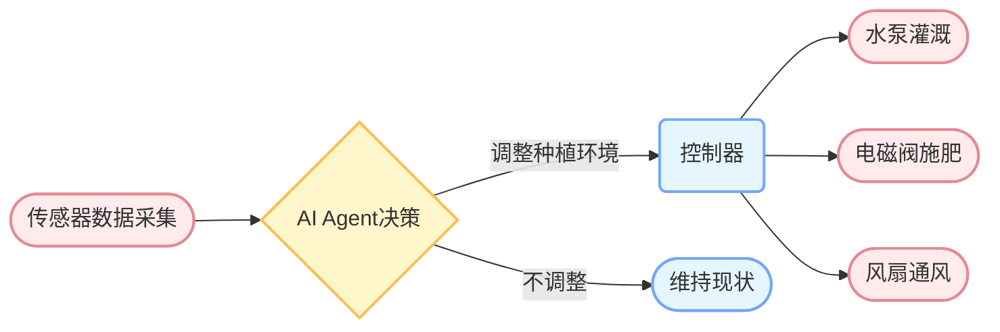

# 智能园艺：AI Agent控制的室内种植系统

> 关键词：智能园艺、AI Agent、室内种植系统、传感器、自动化控制

> 摘要：本文聚焦于智能园艺领域，深入探讨了基于AI Agent控制的室内种植系统。详细介绍了该系统的背景，包括其目的、预期读者和文档结构。阐述了核心概念，如AI Agent和室内种植系统的原理及联系，并通过Mermaid流程图展示架构。讲解了核心算法原理，结合Python代码说明具体操作步骤。给出了相关数学模型和公式，并举例说明。通过项目实战，从开发环境搭建到源代码实现及解读进行了详细说明。分析了该系统的实际应用场景，推荐了学习资源、开发工具框架和相关论文著作。最后总结了未来发展趋势与挑战，并提供常见问题解答和扩展阅读参考资料，旨在为智能园艺领域的研究和实践提供全面且深入的指导。

## 1. 背景介绍 
### 1.1 目的和范围
随着城市化进程的加速和人们对健康生活的追求，室内种植逐渐成为一种流行的生活方式。然而，传统的室内种植方式往往需要人工进行大量的监测和管理，效率低下且难以保证植物的生长质量。智能园艺：AI Agent控制的室内种植系统旨在利用先进的人工智能技术和传感器设备，实现室内种植的自动化和智能化管理，提高种植效率和植物生长质量。

本系统的范围涵盖了从植物生长环境的监测到种植过程的自动化控制，包括温度、湿度、光照、土壤水分等环境参数的实时监测，以及灌溉、施肥、通风等种植操作的自动执行。同时，系统还具备智能决策功能，能够根据植物的生长状态和环境条件，自动调整种植策略，以实现最佳的生长效果。

### 1.2 预期读者
本文的预期读者包括但不限于以下几类人群：
- 园艺爱好者：希望通过智能化手段提高室内种植的效率和质量，享受更加便捷和科学的种植体验。
- 人工智能开发者：对将AI技术应用于实际场景感兴趣，希望了解如何使用AI Agent实现室内种植系统的自动化控制。
- 农业科技研究人员：关注智能园艺领域的发展动态，希望通过本文了解相关技术和方法，为农业科技创新提供参考。
- 系统集成商：负责将各种硬件设备和软件系统集成到一起，实现室内种植系统的整体解决方案，需要了解系统的架构和技术细节。

### 1.3 文档结构概述
本文将按照以下结构进行组织：
- 核心概念与联系：介绍智能园艺、AI Agent和室内种植系统的核心概念，以及它们之间的联系，并通过文本示意图和Mermaid流程图展示系统架构。
- 核心算法原理 & 具体操作步骤：详细讲解系统所采用的核心算法原理，并结合Python代码说明具体的操作步骤。
- 数学模型和公式 & 详细讲解 & 举例说明：给出系统相关的数学模型和公式，并进行详细讲解和举例说明。
- 项目实战：代码实际案例和详细解释说明：通过一个具体的项目实战，介绍开发环境的搭建、源代码的详细实现和代码解读。
- 实际应用场景：分析智能园艺：AI Agent控制的室内种植系统在不同场景下的实际应用。
- 工具和资源推荐：推荐学习资源、开发工具框架和相关论文著作，帮助读者进一步深入学习和研究。
- 总结：未来发展趋势与挑战：总结智能园艺领域的未来发展趋势，并分析可能面临的挑战。
- 附录：常见问题与解答：提供常见问题的解答，帮助读者解决在学习和实践过程中遇到的问题。
- 扩展阅读 & 参考资料：提供扩展阅读的建议和相关参考资料，方便读者进一步深入学习和研究。

### 1.4 术语表
#### 1.4.1 核心术语定义
- **智能园艺**：利用先进的信息技术和自动化设备，实现园艺生产的智能化管理和控制，提高园艺生产的效率和质量。
- **AI Agent**：人工智能代理，是一种能够感知环境、做出决策并执行相应动作的智能实体。在本系统中，AI Agent负责根据传感器数据和预设的规则，自动调整室内种植环境和种植操作。
- **室内种植系统**：在室内环境中进行植物种植的系统，包括种植设备、传感器、控制器等组成部分，能够为植物提供适宜的生长环境。
- **传感器**：用于感知环境参数的设备，如温度传感器、湿度传感器、光照传感器等，能够将环境参数转换为电信号，并传输给控制器。
- **控制器**：负责接收传感器数据，根据预设的规则和算法进行决策，并控制执行器执行相应的动作，如灌溉、施肥、通风等。
- **执行器**：根据控制器的指令，执行相应动作的设备，如水泵、电磁阀、风扇等。

#### 1.4.2 相关概念解释
- **自动化控制**：通过控制器和执行器，实现对室内种植环境和种植操作的自动调节和控制，减少人工干预，提高种植效率和质量。
- **机器学习**：一种人工智能技术，通过对大量数据的学习和分析，自动发现数据中的规律和模式，并用于预测和决策。在本系统中，机器学习可以用于预测植物的生长状态和环境需求，从而实现更加智能化的种植管理。
- **物联网**：通过互联网将各种设备连接起来，实现设备之间的互联互通和数据共享。在本系统中，物联网技术可以用于传感器和控制器之间的数据传输，以及远程监控和管理。

#### 1.4.3 缩略词列表
- **AI**：Artificial Intelligence，人工智能
- **IoT**：Internet of Things，物联网
- **PID**：Proportional-Integral-Derivative，比例-积分-微分控制器

## 2. 核心概念与联系 
### 核心概念原理
#### 智能园艺
智能园艺是将先进的信息技术、自动化技术和园艺技术相结合，实现园艺生产的智能化管理和控制。其核心原理是通过传感器实时监测植物生长环境的各种参数，如温度、湿度、光照、土壤水分等，然后将这些数据传输给控制器。控制器根据预设的规则和算法，对数据进行分析和处理，做出决策，并控制执行器对种植环境和种植操作进行调整，以满足植物的生长需求。

#### AI Agent
AI Agent是一种能够感知环境、做出决策并执行相应动作的智能实体。在智能园艺中，AI Agent可以根据传感器数据和预设的规则，自动调整室内种植环境和种植操作。其工作原理是通过感知模块获取环境信息，然后将这些信息传递给决策模块。决策模块根据预设的规则和算法，对信息进行分析和处理，做出决策，并将决策结果传递给执行模块。执行模块根据决策结果，控制执行器执行相应的动作。

#### 室内种植系统
室内种植系统是在室内环境中进行植物种植的系统，包括种植设备、传感器、控制器等组成部分。其核心原理是通过种植设备为植物提供生长的空间和条件，通过传感器实时监测植物生长环境的各种参数，通过控制器根据传感器数据和预设的规则，对种植环境和种植操作进行调整，以满足植物的生长需求。

### 架构的文本示意图
智能园艺：AI Agent控制的室内种植系统的架构可以分为三个层次：感知层、决策层和执行层。

- **感知层**：主要由各种传感器组成，如温度传感器、湿度传感器、光照传感器、土壤水分传感器等，用于实时监测植物生长环境的各种参数。
- **决策层**：主要由AI Agent和控制器组成，AI Agent根据传感器数据和预设的规则，做出决策，并将决策结果传递给控制器。控制器根据决策结果，对种植环境和种植操作进行调整。
- **执行层**：主要由各种执行器组成，如水泵、电磁阀、风扇等，根据控制器的指令，执行相应的动作，如灌溉、施肥、通风等。

### Mermaid流程图


## 3. 核心算法原理 & 具体操作步骤 
### 核心算法原理
本系统采用的核心算法是PID控制算法和机器学习算法。

#### PID控制算法
PID控制算法是一种经典的控制算法，广泛应用于工业控制领域。其基本原理是根据系统的误差（设定值与实际值之间的差值），通过比例（P）、积分（I）和微分（D）三个环节的计算，得到控制量，从而实现对系统的控制。

PID控制算法的公式如下：
$$u(t) = K_p e(t) + K_i \int_{0}^{t} e(\tau) d\tau + K_d \frac{de(t)}{dt}$$
其中，$u(t)$ 是控制量，$K_p$ 是比例系数，$K_i$ 是积分系数，$K_d$ 是微分系数，$e(t)$ 是误差。

#### 机器学习算法
机器学习算法可以用于预测植物的生长状态和环境需求，从而实现更加智能化的种植管理。本系统采用的机器学习算法是决策树算法。决策树算法是一种基于树结构进行决策的算法，其基本原理是通过对训练数据的学习，构建一棵决策树，然后根据决策树对新的数据进行分类和预测。

### 具体操作步骤
#### 数据采集
通过各种传感器实时采集植物生长环境的各种参数，如温度、湿度、光照、土壤水分等，并将这些数据传输给控制器。

#### 数据处理
控制器对采集到的数据进行处理，包括数据清洗、特征提取等操作，以提高数据的质量和可用性。

#### 决策制定
AI Agent根据处理后的数据和预设的规则，做出决策。如果采用PID控制算法，AI Agent将根据误差计算控制量；如果采用机器学习算法，AI Agent将根据决策树对新的数据进行分类和预测。

#### 控制执行
控制器根据AI Agent的决策结果，控制执行器执行相应的动作，如灌溉、施肥、通风等。

### Python源代码示例
```python
import time

# PID控制器类
class PIDController:
    def __init__(self, Kp, Ki, Kd):
        self.Kp = Kp
        self.Ki = Ki
        self.Kd = Kd
        self.prev_error = 0
        self.integral = 0

    def update(self, setpoint, current_value):
        error = setpoint - current_value
        self.integral += error
        derivative = error - self.prev_error
        output = self.Kp * error + self.Ki * self.integral + self.Kd * derivative
        self.prev_error = error
        return output

# 模拟传感器数据采集
def get_sensor_data():
    # 这里可以替换为实际的传感器数据采集代码
    return 20.0

# 模拟执行器控制
def control_actuator(output):
    # 这里可以替换为实际的执行器控制代码
    print(f"控制执行器，输出值: {output}")

# 主程序
if __name__ == "__main__":
    # 初始化PID控制器
    pid = PIDController(Kp=1.0, Ki=0.1, Kd=0.01)
    setpoint = 25.0  # 设定值

    while True:
        # 采集传感器数据
        current_value = get_sensor_data()
        # 计算控制量
        output = pid.update(setpoint, current_value)
        # 控制执行器
        control_actuator(output)
        # 休眠一段时间
        time.sleep(1)
```

## 4. 数学模型和公式 & 详细讲解 & 举例说明 
### PID控制算法数学模型和公式
PID控制算法的数学模型和公式在前面已经介绍过，这里再次给出：
$$u(t) = K_p e(t) + K_i \int_{0}^{t} e(\tau) d\tau + K_d \frac{de(t)}{dt}$$
其中，$u(t)$ 是控制量，$K_p$ 是比例系数，$K_i$ 是积分系数，$K_d$ 是微分系数，$e(t)$ 是误差。

### 详细讲解
- **比例环节（P）**：比例环节的作用是根据误差的大小，成比例地输出控制量。比例系数 $K_p$ 越大，系统的响应速度越快，但也容易导致系统不稳定。
- **积分环节（I）**：积分环节的作用是消除系统的稳态误差。积分系数 $K_i$ 越大，系统消除稳态误差的速度越快，但也容易导致系统出现积分饱和现象。
- **微分环节（D）**：微分环节的作用是预测误差的变化趋势，提前给出控制量，从而提高系统的响应速度和稳定性。微分系数 $K_d$ 越大，系统的响应速度越快，但也容易导致系统对噪声过于敏感。

### 举例说明
假设我们要控制室内温度，设定温度为 $25^{\circ}C$，当前温度为 $20^{\circ}C$，误差 $e(t) = 25 - 20 = 5^{\circ}C$。

- 比例环节：如果比例系数 $K_p = 1.0$，则比例环节的输出为 $K_p e(t) = 1.0 \times 5 = 5$。
- 积分环节：假设积分系数 $K_i = 0.1$，积分项 $\int_{0}^{t} e(\tau) d\tau$ 为 $10$，则积分环节的输出为 $K_i \int_{0}^{t} e(\tau) d\tau = 0.1 \times 10 = 1$。
- 微分环节：假设微分系数 $K_d = 0.01$，误差的变化率 $\frac{de(t)}{dt}$ 为 $1$，则微分环节的输出为 $K_d \frac{de(t)}{dt} = 0.01 \times 1 = 0.01$。

控制量 $u(t) = K_p e(t) + K_i \int_{0}^{t} e(\tau) d\tau + K_d \frac{de(t)}{dt} = 5 + 1 + 0.01 = 6.01$。

根据控制量 $u(t)$，我们可以控制加热器的功率，使室内温度逐渐接近设定温度。

## 5. 项目实战：代码实际案例和详细解释说明 
### 5.1  开发环境搭建
#### 硬件环境
- **开发板**：可以选择树莓派（Raspberry Pi）等开发板，作为系统的控制器。
- **传感器**：温度传感器、湿度传感器、光照传感器、土壤水分传感器等，用于实时监测植物生长环境的各种参数。
- **执行器**：水泵、电磁阀、风扇等，用于控制种植环境和种植操作。

#### 软件环境
- **操作系统**：可以选择Raspbian等适合树莓派的操作系统。
- **编程语言**：Python，用于编写系统的控制程序。
- **开发工具**：可以选择Visual Studio Code等开发工具，方便编写和调试代码。

### 5.2  源代码详细实现和代码解读
```python
import RPi.GPIO as GPIO
import time
import Adafruit_DHT

# 定义传感器引脚
DHT_PIN = 4
# 定义执行器引脚
PUMP_PIN = 17

# 初始化GPIO
GPIO.setmode(GPIO.BCM)
GPIO.setup(PUMP_PIN, GPIO.OUT)

# 读取温度和湿度传感器数据
def read_dht_sensor():
    sensor = Adafruit_DHT.DHT11
    humidity, temperature = Adafruit_DHT.read_retry(sensor, DHT_PIN)
    if humidity is not None and temperature is not None:
        return temperature, humidity
    else:
        return None, None

# 控制水泵
def control_pump(state):
    if state:
        GPIO.output(PUMP_PIN, GPIO.HIGH)
    else:
        GPIO.output(PUMP_PIN, GPIO.LOW)

# 主程序
if __name__ == "__main__":
    try:
        while True:
            # 读取传感器数据
            temperature, humidity = read_dht_sensor()
            if temperature is not None and humidity is not None:
                print(f"温度: {temperature}°C, 湿度: {humidity}%")
                # 根据温度和湿度控制水泵
                if temperature > 25 and humidity < 50:
                    control_pump(True)
                else:
                    control_pump(False)
            else:
                print("无法读取传感器数据")
            # 休眠一段时间
            time.sleep(5)
    except KeyboardInterrupt:
        print("程序终止")
    finally:
        # 清理GPIO
        GPIO.cleanup()
```

### 代码解读与分析
- **导入必要的库**：导入RPi.GPIO库用于控制GPIO引脚，导入time库用于实现延时功能，导入Adafruit_DHT库用于读取温度和湿度传感器数据。
- **定义传感器和执行器引脚**：定义温度和湿度传感器的引脚为4，定义水泵的引脚为17。
- **初始化GPIO**：设置GPIO模式为BCM模式，并将水泵引脚设置为输出模式。
- **读取温度和湿度传感器数据**：定义read_dht_sensor函数，用于读取温度和湿度传感器数据。
- **控制水泵**：定义control_pump函数，用于控制水泵的开关状态。
- **主程序**：在主程序中，使用一个无限循环不断读取传感器数据，并根据温度和湿度控制水泵的开关状态。当温度大于25°C且湿度小于50%时，打开水泵；否则，关闭水泵。
- **异常处理**：使用try-except-finally语句块处理异常，确保程序在终止时能够清理GPIO资源。

## 6. 实际应用场景 
### 家庭园艺
在家庭环境中，智能园艺：AI Agent控制的室内种植系统可以帮助用户轻松实现室内种植。用户只需要将系统安装在室内，设置好种植参数，系统就可以自动监测植物生长环境的各种参数，并根据植物的生长需求自动调整种植环境和种植操作。这样，用户就可以在繁忙的生活中，轻松享受种植的乐趣。

### 商业园艺
在商业园艺领域，智能园艺：AI Agent控制的室内种植系统可以提高园艺生产的效率和质量。例如，在花卉种植基地，系统可以实时监测花卉的生长环境，根据花卉的生长需求自动调整温度、湿度、光照等环境参数，从而提高花卉的品质和产量。同时，系统还可以实现自动化灌溉、施肥等操作，减少人工成本。

### 科研实验
在科研实验中，智能园艺：AI Agent控制的室内种植系统可以为科研人员提供精确的实验环境。科研人员可以根据实验需求，设置不同的种植参数，系统可以自动控制种植环境，确保实验的准确性和可重复性。例如，在植物生长机理研究中，系统可以模拟不同的环境条件，观察植物的生长变化，从而深入了解植物的生长规律。

## 7. 工具和资源推荐
### 7.1 学习资源推荐
#### 7.1.1 书籍推荐
- 《Python机器学习实战》：本书详细介绍了Python在机器学习领域的应用，包括各种机器学习算法的原理和实现，以及如何使用Python进行数据处理、模型训练和评估。
- 《智能农业：物联网与人工智能应用》：本书介绍了智能农业的发展现状和趋势，以及物联网和人工智能技术在农业领域的应用，包括智能园艺、精准农业等方面的内容。
- 《园艺学概论》：本书是园艺学领域的经典教材，系统介绍了园艺植物的分类、生长发育、栽培管理等方面的知识，对于了解园艺学的基本原理和方法非常有帮助。

#### 7.1.2 在线课程
- Coursera上的“机器学习”课程：由斯坦福大学教授Andrew Ng主讲，是机器学习领域的经典课程，介绍了机器学习的基本概念、算法和应用。
- edX上的“智能农业与物联网”课程：该课程介绍了智能农业的发展现状和趋势，以及物联网技术在农业领域的应用，包括智能园艺、精准农业等方面的内容。
- 中国大学MOOC上的“园艺植物栽培学”课程：该课程系统介绍了园艺植物的栽培管理技术，包括土壤管理、施肥、灌溉、病虫害防治等方面的内容。

#### 7.1.3 技术博客和网站
- 博客园：是国内知名的技术博客平台，有很多关于人工智能、物联网、园艺等领域的技术文章。
- 开源中国：是国内最大的开源技术社区，提供了大量的开源项目和技术资源，对于学习和实践智能园艺系统非常有帮助。
- 园艺在线：是一个专注于园艺领域的网站，提供了园艺知识、种植技术、园艺产品等方面的信息。

### 7.2 开发工具框架推荐
#### 7.2.1 IDE和编辑器
- Visual Studio Code：是一款轻量级的开源代码编辑器，支持多种编程语言和插件扩展，对于Python开发非常方便。
- PyCharm：是一款专业的Python集成开发环境，提供了丰富的代码编辑、调试、测试等功能，适合大型Python项目的开发。
- Thonny：是一款专门为初学者设计的Python IDE，界面简洁，易于上手，适合初学者学习Python编程。

#### 7.2.2 调试和性能分析工具
- pdb：是Python自带的调试工具，可以在代码中设置断点，单步执行代码，查看变量的值等，帮助开发者调试代码。
- cProfile：是Python自带的性能分析工具，可以分析代码的执行时间和函数调用情况，帮助开发者找出代码中的性能瓶颈。
- Py-Spy：是一个跨平台的Python性能分析工具，可以实时监测Python程序的运行状态，分析代码的性能瓶颈。

#### 7.2.3 相关框架和库
- TensorFlow：是Google开发的开源机器学习框架，提供了丰富的机器学习算法和工具，对于开发智能园艺系统中的机器学习模型非常有帮助。
- PyTorch：是Facebook开发的开源深度学习框架，具有简洁易用、灵活性高的特点，适合快速开发和实验深度学习模型。
- Adafruit_DHT：是Adafruit公司开发的Python库，用于读取DHT系列温度和湿度传感器的数据，非常方便实用。

### 7.3 相关论文著作推荐
#### 7.3.1 经典论文
- “A Survey on Internet of Things for Smart Agriculture”：该论文对物联网在智能农业领域的应用进行了全面的综述，包括智能园艺、精准农业等方面的内容。
- “Machine Learning in Agriculture: A Review”：该论文对机器学习在农业领域的应用进行了综述，介绍了机器学习算法在作物生长预测、病虫害防治等方面的应用。
- “Smart Greenhouse Monitoring and Control System Based on Internet of Things”：该论文介绍了一种基于物联网的智能温室监测和控制系统，实现了温室环境的实时监测和自动化控制。

#### 7.3.2 最新研究成果
- 在IEEE Xplore、ACM Digital Library等学术数据库中，可以搜索到关于智能园艺、AI Agent、物联网等领域的最新研究成果。
- 关注相关学术会议和研讨会，如ACM SIGKDD、IEEE ICDM等，了解智能园艺领域的最新研究动态。

#### 7.3.3 应用案例分析
- 《智能农业应用案例集》：该案例集收集了智能农业领域的各种应用案例，包括智能园艺、精准农业等方面的内容，对于了解智能农业的实际应用非常有帮助。
- 相关企业的官方网站和博客，如华为、阿里云等，会分享一些智能农业领域的应用案例和技术经验。

## 8. 总结：未来发展趋势与挑战
### 未来发展趋势
- **智能化程度不断提高**：随着人工智能技术的不断发展，智能园艺系统的智能化程度将不断提高。AI Agent将能够更加准确地感知植物的生长状态和环境需求，做出更加智能化的决策，实现更加精准的种植管理。
- **与物联网深度融合**：物联网技术将为智能园艺系统提供更加便捷的数据传输和远程监控功能。通过物联网，用户可以随时随地通过手机、电脑等设备远程监控和控制室内种植系统，实现更加智能化的种植管理。
- **个性化种植服务**：未来的智能园艺系统将能够根据用户的需求和偏好，提供个性化的种植服务。例如，根据用户的种植经验、种植环境和种植目标，为用户推荐适合的植物品种和种植方案。
- **与其他领域的交叉融合**：智能园艺系统将与其他领域的技术进行交叉融合，如区块链、大数据、云计算等。例如，利用区块链技术实现种植数据的安全共享和追溯，利用大数据和云计算技术对种植数据进行分析和挖掘，为种植决策提供更加科学的依据。

### 挑战
- **数据安全和隐私问题**：智能园艺系统需要收集和处理大量的种植数据，这些数据涉及到用户的隐私和商业机密。因此，如何保障数据的安全和隐私是智能园艺系统面临的一个重要挑战。
- **技术标准和规范缺乏**：目前，智能园艺领域还缺乏统一的技术标准和规范，不同厂家的产品和系统之间存在兼容性问题。这给用户的选择和使用带来了一定的困难，也制约了智能园艺行业的发展。
- **成本较高**：智能园艺系统需要使用大量的传感器、控制器、执行器等设备，以及人工智能算法和云计算服务，这些都导致了系统的成本较高。如何降低系统的成本，提高系统的性价比，是智能园艺系统推广应用的关键。
- **用户认知和接受度较低**：由于智能园艺是一个新兴的领域，很多用户对其了解和认知程度较低，对智能园艺系统的接受度也不高。因此，如何加强对智能园艺的宣传和推广，提高用户的认知和接受度，是智能园艺系统面临的另一个挑战。

## 9. 附录：常见问题与解答
### 问题1：智能园艺系统需要哪些硬件设备？
智能园艺系统需要的硬件设备包括开发板（如树莓派）、传感器（如温度传感器、湿度传感器、光照传感器、土壤水分传感器等）、执行器（如水泵、电磁阀、风扇等）。

### 问题2：如何选择适合的传感器和执行器？
选择适合的传感器和执行器需要考虑以下因素：
- 测量范围和精度：根据实际需求选择测量范围和精度合适的传感器。
- 可靠性和稳定性：选择可靠性和稳定性高的传感器和执行器，以确保系统的正常运行。
- 兼容性：选择与开发板和其他设备兼容的传感器和执行器。
- 成本：根据预算选择成本合适的传感器和执行器。

### 问题3：智能园艺系统的开发难度大吗？
智能园艺系统的开发难度取决于系统的复杂程度和开发者的技术水平。对于初学者来说，可以从简单的系统开始开发，逐步积累经验。同时，可以参考相关的开源项目和教程，降低开发难度。

### 问题4：智能园艺系统可以实现远程控制吗？
可以。通过物联网技术，智能园艺系统可以实现远程控制。用户可以通过手机、电脑等设备，随时随地远程监控和控制室内种植系统。

### 问题5：智能园艺系统的维护成本高吗？
智能园艺系统的维护成本主要包括硬件设备的更换和维修、软件系统的更新和升级等方面。一般来说，只要选择质量可靠的硬件设备和稳定的软件系统，维护成本不会太高。

## 10. 扩展阅读 & 参考资料
### 扩展阅读
- 《人工智能简史》：了解人工智能的发展历程和主要技术，对于理解智能园艺系统中的AI Agent技术非常有帮助。
- 《物联网技术与应用》：深入了解物联网的原理、技术和应用，对于掌握智能园艺系统中的物联网技术非常有帮助。
- 《植物生理学》：了解植物的生长发育规律和生理机制，对于优化智能园艺系统的种植策略非常有帮助。

### 参考资料
- [Adafruit官方网站](https://www.adafruit.com/)：提供了各种传感器和开发板的资料和教程。
- [树莓派官方网站](https://www.raspberrypi.org/)：提供了树莓派的相关资料和教程。
- [TensorFlow官方文档](https://www.tensorflow.org/)：提供了TensorFlow机器学习框架的详细文档和教程。
- [PyTorch官方文档](https://pytorch.org/)：提供了PyTorch深度学习框架的详细文档和教程。

作者：AI天才研究院/AI Genius Institute & 禅与计算机程序设计艺术 /Zen And The Art of Computer Programming