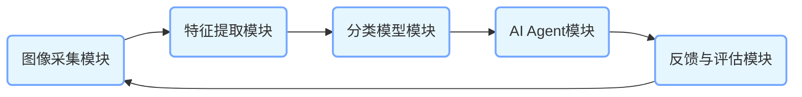

# 智能垃圾分类系统：AI Agent的环保教育助手

> 关键词：智能垃圾分类系统、AI Agent、环保教育、计算机视觉、机器学习

> 摘要：本文围绕智能垃圾分类系统展开，探讨了AI Agent在其中作为环保教育助手的重要作用。详细阐述了智能垃圾分类系统的核心概念、算法原理、数学模型等技术要点，并通过项目实战展示了系统的具体实现。分析了其实际应用场景，推荐了相关的学习资源、开发工具和论文著作。最后总结了该系统未来的发展趋势与挑战，为推动环保教育和垃圾分类的智能化发展提供了全面的参考。

## 1. 背景介绍 
### 1.1 目的和范围
随着全球环境问题的日益严峻，垃圾分类成为了环境保护的重要环节。传统的垃圾分类主要依靠人工进行，效率低下且容易出错。智能垃圾分类系统旨在利用先进的AI技术，实现垃圾的自动分类识别，提高垃圾分类的效率和准确性。同时，将AI Agent融入其中，使其成为环保教育的有力助手，向公众普及垃圾分类知识，提高环保意识。本文章的范围涵盖了智能垃圾分类系统的技术原理、实现方法、应用场景以及未来发展等多个方面。

### 1.2 预期读者
本文预期读者包括对人工智能、计算机视觉、环保教育等领域感兴趣的技术爱好者、科研人员、环保工作者以及相关专业的学生。对于想要了解智能垃圾分类系统背后技术原理和应用的人群具有较高的参考价值。

### 1.3 文档结构概述
本文首先介绍智能垃圾分类系统的背景信息，包括目的、预期读者和文档结构概述。接着阐述核心概念与联系，包括相关的技术原理和架构。然后详细讲解核心算法原理和具体操作步骤，并用Python代码进行阐述。随后介绍数学模型和公式，并举例说明。通过项目实战展示系统的实际实现和代码解读。分析实际应用场景，推荐相关的工具和资源。最后总结未来发展趋势与挑战，提供常见问题与解答和扩展阅读参考资料。

### 1.4 术语表
#### 1.4.1 核心术语定义
- **智能垃圾分类系统**：利用人工智能技术实现对垃圾进行自动分类识别的系统。
- **AI Agent**：人工智能代理，能够感知环境、做出决策并采取行动的智能实体。
- **计算机视觉**：让计算机从图像或视频中获取信息的技术领域。
- **机器学习**：一门多领域交叉学科，涉及概率论、统计学、逼近论、凸分析、算法复杂度理论等多门学科。它专门研究计算机怎样模拟或实现人类的学习行为，以获取新的知识或技能，重新组织已有的知识结构使之不断改善自身的性能。

#### 1.4.2 相关概念解释
- **深度学习**：机器学习的一个分支领域，它是一种基于对数据进行表征学习的方法。深度学习通过构建具有很多层的神经网络模型，自动从大量数据中学习特征和模式。
- **卷积神经网络（CNN）**：一种专门为处理具有网格结构数据（如图像）而设计的深度学习模型。CNN通过卷积层、池化层等操作，自动提取图像的特征。

#### 1.4.3 缩略词列表
- **CNN**：Convolutional Neural Network（卷积神经网络）
- **AI**：Artificial Intelligence（人工智能）
- **ML**：Machine Learning（机器学习）

## 2. 核心概念与联系 

### 核心概念原理
智能垃圾分类系统的核心原理是利用计算机视觉和机器学习技术对垃圾图像进行分析和识别。计算机视觉技术用于从图像中提取有用的信息，如颜色、形状、纹理等。机器学习算法则根据这些提取的特征对垃圾进行分类。

AI Agent在智能垃圾分类系统中扮演着环保教育助手的角色。它可以与用户进行交互，回答用户关于垃圾分类的问题，提供相关的环保知识和建议。同时，AI Agent还可以根据用户的垃圾分类行为进行评估和反馈，帮助用户提高垃圾分类的准确性。

### 架构的文本示意图
智能垃圾分类系统主要由以下几个部分组成：
1. **图像采集模块**：负责采集垃圾的图像数据。
2. **特征提取模块**：利用计算机视觉技术从图像中提取特征。
3. **分类模型模块**：使用机器学习算法对提取的特征进行分类。
4. **AI Agent模块**：与用户进行交互，提供环保教育服务。
5. **反馈与评估模块**：对用户的垃圾分类行为进行评估和反馈。

### Mermaid 流程图


## 3. 核心算法原理 & 具体操作步骤 

### 核心算法原理
智能垃圾分类系统中常用的分类算法是卷积神经网络（CNN）。CNN通过卷积层、池化层和全连接层等结构，自动从图像中提取特征并进行分类。

卷积层通过卷积核在图像上滑动，提取图像的局部特征。池化层则对卷积层的输出进行下采样，减少数据量并保留重要特征。全连接层将提取的特征映射到不同的分类标签上。

### 具体操作步骤
1. **数据收集**：收集大量的垃圾图像数据，并对其进行标注，标注信息包括垃圾的类别。
2. **数据预处理**：对收集到的图像数据进行预处理，如调整图像大小、归一化等。
3. **模型构建**：使用深度学习框架（如TensorFlow、PyTorch）构建CNN模型。
4. **模型训练**：将预处理后的数据输入到模型中进行训练，调整模型的参数，使其能够准确地对垃圾进行分类。
5. **模型评估**：使用测试数据对训练好的模型进行评估，计算模型的准确率、召回率等指标。
6. **模型部署**：将训练好的模型部署到智能垃圾分类系统中，实现实时的垃圾分类识别。

### Python源代码实现
以下是一个使用PyTorch实现简单CNN模型进行垃圾分类的示例代码：
```python
import torch
import torch.nn as nn
import torch.optim as optim
from torchvision import datasets, transforms

# 数据预处理
transform = transforms.Compose([
    transforms.Resize((224, 224)),
    transforms.ToTensor(),
    transforms.Normalize((0.5, 0.5, 0.5), (0.5, 0.5, 0.5))
])

# 加载数据集
train_dataset = datasets.ImageFolder(root='train_data', transform=transform)
train_loader = torch.utils.data.DataLoader(train_dataset, batch_size=32, shuffle=True)

test_dataset = datasets.ImageFolder(root='test_data', transform=transform)
test_loader = torch.utils.data.DataLoader(test_dataset, batch_size=32, shuffle=False)

# 定义CNN模型
class GarbageClassifier(nn.Module):
    def __init__(self):
        super(GarbageClassifier, self).__init__()
        self.conv1 = nn.Conv2d(3, 16, kernel_size=3, padding=1)
        self.relu1 = nn.ReLU()
        self.pool1 = nn.MaxPool2d(2)
        self.conv2 = nn.Conv2d(16, 32, kernel_size=3, padding=1)
        self.relu2 = nn.ReLU()
        self.pool2 = nn.MaxPool2d(2)
        self.fc1 = nn.Linear(32 * 56 * 56, 128)
        self.relu3 = nn.ReLU()
        self.fc2 = nn.Linear(128, len(train_dataset.classes))

    def forward(self, x):
        x = self.pool1(self.relu1(self.conv1(x)))
        x = self.pool2(self.relu2(self.conv2(x)))
        x = x.view(-1, 32 * 56 * 56)
        x = self.relu3(self.fc1(x))
        x = self.fc2(x)
        return x

# 初始化模型、损失函数和优化器
model = GarbageClassifier()
criterion = nn.CrossEntropyLoss()
optimizer = optim.Adam(model.parameters(), lr=0.001)

# 训练模型
num_epochs = 10
for epoch in range(num_epochs):
    running_loss = 0.0
    for i, (images, labels) in enumerate(train_loader):
        optimizer.zero_grad()
        outputs = model(images)
        loss = criterion(outputs, labels)
        loss.backward()
        optimizer.step()
        running_loss += loss.item()
    print(f'Epoch {epoch + 1}, Loss: {running_loss / len(train_loader)}')

# 评估模型
correct = 0
total = 0
with torch.no_grad():
    for images, labels in test_loader:
        outputs = model(images)
        _, predicted = torch.max(outputs.data, 1)
        total += labels.size(0)
        correct += (predicted == labels).sum().item()

print(f'Accuracy: {100 * correct / total}%')
```

## 4. 数学模型和公式 & 详细讲解 & 举例说明 

### 卷积操作
卷积操作是CNN中的核心操作，其数学公式为：
$$
y_{i,j} = \sum_{m=0}^{M-1} \sum_{n=0}^{N-1} x_{i+m,j+n} \cdot w_{m,n} + b
$$
其中，$x$ 是输入图像，$w$ 是卷积核，$b$ 是偏置项，$y$ 是卷积输出。

### 池化操作
池化操作通常使用最大池化或平均池化。最大池化的数学公式为：
$$
y_{i,j} = \max_{m,n \in \mathcal{R}} x_{i+m,j+n}
$$
其中，$\mathcal{R}$ 是池化区域。

### 损失函数
在分类任务中，常用的损失函数是交叉熵损失函数，其数学公式为：
$$
L = -\frac{1}{N} \sum_{i=1}^{N} \sum_{j=1}^{C} y_{i,j} \log(p_{i,j})
$$
其中，$N$ 是样本数量，$C$ 是类别数量，$y_{i,j}$ 是真实标签，$p_{i,j}$ 是预测概率。

### 举例说明
假设我们有一个 $3\times3$ 的输入图像 $x$ 和一个 $2\times2$ 的卷积核 $w$，偏置项 $b = 0$。输入图像 $x$ 为：
$$
x = \begin{bmatrix}
1 & 2 & 3 \\
4 & 5 & 6 \\
7 & 8 & 9
\end{bmatrix}
$$
卷积核 $w$ 为：
$$
w = \begin{bmatrix}
1 & 2 \\
3 & 4
\end{bmatrix}
$$
进行卷积操作，首先计算左上角的输出：
$$
y_{0,0} = 1\times1 + 2\times2 + 4\times3 + 5\times4 = 37
$$
依次计算其他位置的输出，最终得到卷积输出。

## 5. 项目实战：代码实际案例和详细解释说明 

### 5.1  开发环境搭建
1. **安装Python**：建议使用Python 3.7及以上版本。
2. **安装深度学习框架**：可以选择TensorFlow或PyTorch，这里以PyTorch为例。使用以下命令安装PyTorch：
```bash
pip install torch torchvision
```
3. **安装其他依赖库**：如numpy、matplotlib等。
```bash
pip install numpy matplotlib
```

### 5.2  源代码详细实现和代码解读
以下是一个完整的智能垃圾分类系统的代码示例，包括数据加载、模型定义、训练和评估：
```python
import torch
import torch.nn as nn
import torch.optim as optim
from torchvision import datasets, transforms
import matplotlib.pyplot as plt

# 数据预处理
transform = transforms.Compose([
    transforms.Resize((224, 224)),
    transforms.ToTensor(),
    transforms.Normalize((0.5, 0.5, 0.5), (0.5, 0.5, 0.5))
])

# 加载数据集
train_dataset = datasets.ImageFolder(root='train_data', transform=transform)
train_loader = torch.utils.data.DataLoader(train_dataset, batch_size=32, shuffle=True)

test_dataset = datasets.ImageFolder(root='test_data', transform=transform)
test_loader = torch.utils.data.DataLoader(test_dataset, batch_size=32, shuffle=False)

# 定义CNN模型
class GarbageClassifier(nn.Module):
    def __init__(self):
        super(GarbageClassifier, self).__init__()
        self.conv1 = nn.Conv2d(3, 16, kernel_size=3, padding=1)
        self.relu1 = nn.ReLU()
        self.pool1 = nn.MaxPool2d(2)
        self.conv2 = nn.Conv2d(16, 32, kernel_size=3, padding=1)
        self.relu2 = nn.ReLU()
        self.pool2 = nn.MaxPool2d(2)
        self.fc1 = nn.Linear(32 * 56 * 56, 128)
        self.relu3 = nn.ReLU()
        self.fc2 = nn.Linear(128, len(train_dataset.classes))

    def forward(self, x):
        x = self.pool1(self.relu1(self.conv1(x)))
        x = self.pool2(self.relu2(self.conv2(x)))
        x = x.view(-1, 32 * 56 * 56)
        x = self.relu3(self.fc1(x))
        x = self.fc2(x)
        return x

# 初始化模型、损失函数和优化器
model = GarbageClassifier()
criterion = nn.CrossEntropyLoss()
optimizer = optim.Adam(model.parameters(), lr=0.001)

# 训练模型
num_epochs = 10
train_losses = []
for epoch in range(num_epochs):
    running_loss = 0.0
    for i, (images, labels) in enumerate(train_loader):
        optimizer.zero_grad()
        outputs = model(images)
        loss = criterion(outputs, labels)
        loss.backward()
        optimizer.step()
        running_loss += loss.item()
    train_loss = running_loss / len(train_loader)
    train_losses.append(train_loss)
    print(f'Epoch {epoch + 1}, Loss: {train_loss}')

# 绘制训练损失曲线
plt.plot(train_losses)
plt.xlabel('Epoch')
plt.ylabel('Loss')
plt.title('Training Loss')
plt.show()

# 评估模型
correct = 0
total = 0
with torch.no_grad():
    for images, labels in test_loader:
        outputs = model(images)
        _, predicted = torch.max(outputs.data, 1)
        total += labels.size(0)
        correct += (predicted == labels).sum().item()

print(f'Accuracy: {100 * correct / total}%')
```

### 5.3  代码解读与分析
1. **数据预处理**：使用`transforms.Compose`定义了一系列的数据预处理操作，包括调整图像大小、转换为张量和归一化。
2. **数据加载**：使用`datasets.ImageFolder`加载图像数据集，并使用`torch.utils.data.DataLoader`创建数据加载器。
3. **模型定义**：定义了一个简单的CNN模型`GarbageClassifier`，包括卷积层、池化层和全连接层。
4. **训练模型**：使用交叉熵损失函数和Adam优化器进行模型训练，记录每个epoch的训练损失。
5. **绘制训练损失曲线**：使用`matplotlib`绘制训练损失曲线，帮助我们观察模型的训练过程。
6. **评估模型**：使用测试数据对训练好的模型进行评估，计算模型的准确率。

## 6. 实际应用场景 
### 家庭场景
在家庭中，智能垃圾分类系统可以作为一个智能垃圾桶，用户将垃圾放入垃圾桶时，系统可以自动识别垃圾的类别，并给出相应的提示。同时，AI Agent可以与用户进行交互，提供垃圾分类的知识和建议，帮助用户养成正确的垃圾分类习惯。

### 公共场所场景
在公共场所，如商场、学校、公园等，智能垃圾分类系统可以安装在垃圾桶旁边。当用户投放垃圾时，系统可以实时识别垃圾的类别，并对用户的垃圾分类行为进行评估和反馈。此外，系统还可以通过显示屏或语音提示向公众宣传环保知识，提高公众的环保意识。

### 垃圾处理厂场景
在垃圾处理厂，智能垃圾分类系统可以用于对垃圾进行初步分类，提高垃圾处理的效率和准确性。系统可以快速识别垃圾的类别，将不同类型的垃圾分别输送到相应的处理设备中，减少人工分类的工作量。

## 7. 工具和资源推荐
### 7.1 学习资源推荐
#### 7.1.1 书籍推荐
- 《深度学习》（Ian Goodfellow、Yoshua Bengio和Aaron Courville著）：深度学习领域的经典教材，详细介绍了深度学习的基本原理和算法。
- 《Python深度学习》（Francois Chollet著）：以Keras框架为例，介绍了如何使用Python进行深度学习开发。
- 《计算机视觉：算法与应用》（Richard Szeliski著）：全面介绍了计算机视觉的基本算法和应用。

#### 7.1.2 在线课程
- Coursera上的“深度学习专项课程”（Deep Learning Specialization）：由Andrew Ng教授授课，涵盖了深度学习的各个方面。
- edX上的“计算机视觉基础”（Foundations of Computer Vision）：介绍了计算机视觉的基本概念和算法。
- 哔哩哔哩上的相关AI和计算机视觉教程：有许多优质的免费教程可供学习。

#### 7.1.3 技术博客和网站
- Medium：有许多关于人工智能、计算机视觉的技术博客文章。
- 机器之心：专注于人工智能领域的资讯和技术文章。
- 开源中国：提供了丰富的开源项目和技术文章。

### 7.2 开发工具框架推荐
#### 7.2.1 IDE和编辑器
- PyCharm：一款专业的Python集成开发环境，提供了丰富的代码编辑、调试和分析功能。
- Jupyter Notebook：交互式的开发环境，适合进行数据探索和模型训练。
- Visual Studio Code：轻量级的代码编辑器，支持多种编程语言和插件。

#### 7.2.2 调试和性能分析工具
- TensorBoard：TensorFlow提供的可视化工具，用于监控模型的训练过程和性能分析。
- PyTorch Profiler：PyTorch提供的性能分析工具，帮助用户优化模型的性能。
- cProfile：Python内置的性能分析工具，用于分析代码的运行时间和性能瓶颈。

#### 7.2.3 相关框架和库
- TensorFlow：Google开发的深度学习框架，具有强大的功能和广泛的应用。
- PyTorch：Facebook开发的深度学习框架，易于使用和调试。
- OpenCV：计算机视觉领域的开源库，提供了丰富的图像处理和计算机视觉算法。

### 7.3 相关论文著作推荐
#### 7.3.1 经典论文
- LeCun, Y., Bottou, L., Bengio, Y., & Haffner, P. (1998). Gradient-based learning applied to document recognition. Proceedings of the IEEE, 86(11), 2278-2324. （介绍了卷积神经网络的经典论文）
- Krizhevsky, A., Sutskever, I., & Hinton, G. E. (2012). ImageNet classification with deep convolutional neural networks. Advances in neural information processing systems, 25. （介绍了AlexNet的论文，开启了深度学习在计算机视觉领域的热潮）

#### 7.3.2 最新研究成果
- 可以通过IEEE Xplore、ACM Digital Library等学术数据库搜索最新的关于智能垃圾分类、计算机视觉和人工智能的研究成果。

#### 7.3.3 应用案例分析
- 相关的行业报告和研究机构的分析文章，介绍了智能垃圾分类系统在实际应用中的案例和效果。

## 8. 总结：未来发展趋势与挑战
### 未来发展趋势
1. **更精准的识别技术**：随着计算机视觉和机器学习技术的不断发展，智能垃圾分类系统的识别准确率将不断提高。未来可能会采用更先进的深度学习模型和算法，如Transformer架构，进一步提升系统的性能。
2. **多模态融合**：除了图像识别，未来的智能垃圾分类系统可能会融合声音、气味等多模态信息，提高垃圾分类的准确性和可靠性。
3. **智能化的交互体验**：AI Agent将变得更加智能和人性化，能够与用户进行更加自然和流畅的交互。例如，通过语音识别和自然语言处理技术，实现语音对话和智能问答。
4. **与物联网的结合**：智能垃圾分类系统将与物联网技术相结合，实现垃圾的实时监测和管理。例如，通过传感器实时监测垃圾桶的装满程度，自动调度垃圾清运车辆。

### 挑战
1. **数据质量和多样性**：高质量、多样化的训练数据是提高智能垃圾分类系统性能的关键。然而，收集和标注大量的垃圾图像数据是一项艰巨的任务，并且不同地区的垃圾种类和特征可能存在差异，需要考虑数据的多样性。
2. **计算资源和成本**：深度学习模型的训练和推理需要大量的计算资源，这增加了系统的成本和部署难度。如何在有限的计算资源下提高系统的性能是一个挑战。
3. **用户接受度**：推广智能垃圾分类系统需要用户的积极参与和配合。如何提高用户对智能垃圾分类系统的接受度，培养用户的环保意识和垃圾分类习惯是一个重要的问题。
4. **法律法规和标准**：目前，智能垃圾分类系统的相关法律法规和标准还不够完善。需要制定统一的标准和规范，确保系统的安全性、可靠性和互操作性。

## 9. 附录：常见问题与解答
### 1. 智能垃圾分类系统的识别准确率能达到多少？
智能垃圾分类系统的识别准确率受到多种因素的影响，如数据质量、模型复杂度、垃圾种类等。一般来说，在理想情况下，系统的识别准确率可以达到80%以上，但在实际应用中可能会有所下降。

### 2. 如何提高智能垃圾分类系统的性能？
可以从以下几个方面提高智能垃圾分类系统的性能：
- 收集更多高质量、多样化的训练数据。
- 选择更合适的深度学习模型和算法。
- 进行数据增强和模型优化。
- 融合多模态信息。

### 3. 智能垃圾分类系统可以识别哪些类型的垃圾？
智能垃圾分类系统可以识别常见的垃圾类型，如可回收物、有害垃圾、厨余垃圾和其他垃圾。具体的识别类型可以根据实际需求进行定制。

### 4. 智能垃圾分类系统的成本高吗？
智能垃圾分类系统的成本包括硬件设备成本、软件开发成本、数据标注成本等。不同规模和功能的系统成本差异较大。一般来说，随着技术的发展和普及，系统的成本会逐渐降低。

## 10. 扩展阅读 & 参考资料
1. 相关的学术论文和研究报告。
2. 智能垃圾分类系统的官方文档和技术资料。
3. 人工智能和计算机视觉领域的经典书籍和教材。
4. 行业新闻和资讯网站。

作者：AI天才研究院/AI Genius Institute & 禅与计算机程序设计艺术 /Zen And The Art of Computer Programming