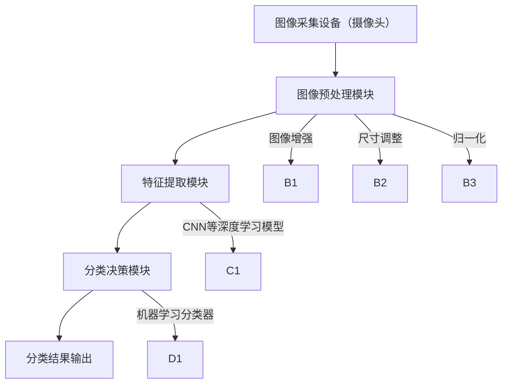

# 智能垃圾分类：AI Agent的识别系统

> 关键词：智能垃圾分类、AI Agent、识别系统、计算机视觉、机器学习

> 摘要：本文围绕智能垃圾分类中AI Agent识别系统展开，详细阐述了其核心概念、算法原理、数学模型等内容。通过介绍系统的背景信息，让读者了解其目的和适用范围。核心概念部分给出了系统的原理和架构示意图及流程图，帮助读者直观理解。算法原理用Python代码进行详细说明，数学模型部分则通过公式和实例进行深入剖析。项目实战环节展示了开发环境搭建、代码实现和解读。此外，还介绍了实际应用场景、推荐了相关工具和资源，最后总结了未来发展趋势与挑战，并提供了常见问题解答和扩展阅读资料，旨在为读者全面呈现智能垃圾分类AI Agent识别系统的全貌。

## 1. 背景介绍 
### 1.1 目的和范围
随着全球人口的增长和城市化进程的加速，垃圾产生量急剧增加。垃圾分类作为垃圾处理的关键环节，对于资源回收利用、环境保护和可持续发展至关重要。传统的垃圾分类主要依赖人工，效率低且容易出错。因此，开发智能垃圾分类系统具有重要的现实意义。

本文的范围聚焦于智能垃圾分类中基于AI Agent的识别系统。该系统旨在利用先进的人工智能技术，实现对垃圾种类的自动、准确识别，提高垃圾分类的效率和准确性。

### 1.2 预期读者
本文预期读者包括对人工智能、计算机视觉、垃圾分类技术感兴趣的科研人员、开发者、环保工作者以及相关领域的学生。对于希望了解智能垃圾分类技术原理和实现方法的读者，本文将提供全面而深入的知识。

### 1.3 文档结构概述
本文将按照以下结构进行阐述：首先介绍核心概念与联系，包括系统的原理和架构；接着详细讲解核心算法原理和具体操作步骤，并给出Python源代码；然后介绍数学模型和公式，并举例说明；之后通过项目实战展示代码的实际应用和详细解释；再介绍该系统的实际应用场景；推荐相关的工具和资源；最后总结未来发展趋势与挑战，提供常见问题解答和扩展阅读资料。

### 1.4 术语表
#### 1.4.1 核心术语定义
- **AI Agent（人工智能代理）**：是一种能够感知环境、做出决策并采取行动的智能实体。在智能垃圾分类系统中，AI Agent通过摄像头等设备感知垃圾图像，运用机器学习算法进行分析和判断，最终输出垃圾的分类结果。
- **垃圾分类**：将垃圾按照其成分、性质和用途等因素进行分类，常见的分类方式包括可回收物、有害垃圾、厨余垃圾和其他垃圾。
- **计算机视觉**：是一门研究如何使计算机“看”的科学，通过对图像或视频进行分析和处理，提取有用的信息。在智能垃圾分类中，计算机视觉技术用于对垃圾图像进行特征提取和识别。

#### 1.4.2 相关概念解释
- **机器学习**：是一门多领域交叉学科，涉及概率论、统计学、逼近论、凸分析、算法复杂度理论等多门学科。它专门研究计算机怎样模拟或实现人类的学习行为，以获取新的知识或技能，重新组织已有的知识结构使之不断改善自身的性能。在智能垃圾分类中，机器学习算法用于训练模型，使其能够准确识别不同种类的垃圾。
- **深度学习**：是机器学习的一个分支领域，它试图使用包含复杂结构或由多重非线性变换构成的多个处理层对数据进行高层抽象的算法。深度学习在图像识别领域取得了巨大的成功，在智能垃圾分类中也被广泛应用。

#### 1.4.3 缩略词列表
- **CNN（Convolutional Neural Network）**：卷积神经网络，是一种专门为处理具有网格结构数据（如图像）而设计的深度学习模型。
- **RGB（Red, Green, Blue）**：红绿蓝，是一种加色模型，将红、绿、蓝三原色的色光以不同的比例相加，以产生多种多样的色光。

## 2. 核心概念与联系 
### 核心概念原理
智能垃圾分类的AI Agent识别系统主要基于计算机视觉和机器学习技术。其核心原理是通过摄像头等设备采集垃圾的图像，然后利用计算机视觉算法对图像进行预处理，提取图像的特征。接着，将提取的特征输入到经过训练的机器学习模型中，模型根据特征进行分类判断，最终输出垃圾的分类结果。

### 架构的文本示意图
```plaintext
+---------------------+
| 图像采集设备（摄像头） |
+---------------------+
           |
           v
+---------------------+
| 图像预处理模块       |
| - 图像增强           |
| - 尺寸调整           |
| - 归一化             |
+---------------------+
           |
           v
+---------------------+
| 特征提取模块         |
| - CNN等深度学习模型 |
+---------------------+
           |
           v
+---------------------+
| 分类决策模块         |
| - 机器学习分类器     |
+---------------------+
           |
           v
+---------------------+
| 分类结果输出         |
+---------------------+
```

### Mermaid流程图


## 3. 核心算法原理 & 具体操作步骤 
### 核心算法原理
在智能垃圾分类的AI Agent识别系统中，常用的核心算法是卷积神经网络（CNN）。CNN是一种专门用于处理具有网格结构数据（如图像）的深度学习模型，它通过卷积层、池化层和全连接层等组件，自动提取图像的特征并进行分类。

卷积层通过卷积核在图像上滑动，进行卷积操作，提取图像的局部特征。池化层则对卷积层的输出进行下采样，减少数据量，同时保留重要的特征信息。全连接层将池化层的输出展平为一维向量，并通过多层感知机进行分类决策。

### 具体操作步骤
#### 步骤1：数据收集
收集大量不同种类垃圾的图像数据，并进行标注，标注信息包括垃圾的分类标签。

#### 步骤2：数据预处理
对收集到的图像数据进行预处理，包括图像增强、尺寸调整和归一化等操作。图像增强可以增加数据的多样性，提高模型的泛化能力；尺寸调整可以将图像统一到相同的大小，方便模型处理；归一化可以将图像的像素值缩放到[0, 1]或[-1, 1]的范围内，加速模型的训练。

#### 步骤3：模型构建
使用深度学习框架（如TensorFlow、PyTorch等）构建CNN模型。模型的结构可以根据实际情况进行调整，通常包括多个卷积层、池化层和全连接层。

#### 步骤4：模型训练
将预处理后的图像数据输入到构建好的模型中进行训练。在训练过程中，使用损失函数（如交叉熵损失函数）来衡量模型的预测结果与真实标签之间的差异，并使用优化算法（如随机梯度下降、Adam等）来更新模型的参数，使损失函数的值不断减小。

#### 步骤5：模型评估
使用测试集对训练好的模型进行评估，计算模型的准确率、召回率、F1值等指标，评估模型的性能。

#### 步骤6：模型部署
将训练好的模型部署到实际的应用环境中，通过摄像头采集垃圾图像，输入到模型中进行分类识别，并输出分类结果。

### Python源代码实现
```python
import tensorflow as tf
from tensorflow.keras import layers, models
from tensorflow.keras.preprocessing.image import ImageDataGenerator

# 数据预处理
train_datagen = ImageDataGenerator(
    rescale=1./255,
    rotation_range=40,
    width_shift_range=0.2,
    height_shift_range=0.2,
    shear_range=0.2,
    zoom_range=0.2,
    horizontal_flip=True,
    fill_mode='nearest'
)

test_datagen = ImageDataGenerator(rescale=1./255)

# 加载数据
train_generator = train_datagen.flow_from_directory(
    'train_data_directory',
    target_size=(150, 150),
    batch_size=32,
    class_mode='categorical'
)

test_generator = test_datagen.flow_from_directory(
    'test_data_directory',
    target_size=(150, 150),
    batch_size=32,
    class_mode='categorical'
)

# 构建CNN模型
model = models.Sequential([
    layers.Conv2D(32, (3, 3), activation='relu', input_shape=(150, 150, 3)),
    layers.MaxPooling2D((2, 2)),
    layers.Conv2D(64, (3, 3), activation='relu'),
    layers.MaxPooling2D((2, 2)),
    layers.Conv2D(128, (3, 3), activation='relu'),
    layers.MaxPooling2D((2, 2)),
    layers.Flatten(),
    layers.Dense(128, activation='relu'),
    layers.Dense(train_generator.num_classes, activation='softmax')
])

# 编译模型
model.compile(optimizer='adam',
              loss='categorical_crossentropy',
              metrics=['accuracy'])

# 训练模型
model.fit(
    train_generator,
    steps_per_epoch=train_generator.samples // train_generator.batch_size,
    epochs=10,
    validation_data=test_generator,
    validation_steps=test_generator.samples // test_generator.batch_size
)

# 评估模型
test_loss, test_acc = model.evaluate(test_generator)
print(f"Test accuracy: {test_acc}")
```

## 4. 数学模型和公式 & 详细讲解 & 举例说明 
### 卷积操作
卷积操作是CNN的核心操作之一，它通过卷积核在图像上滑动，进行卷积运算，提取图像的局部特征。卷积运算的数学公式如下：
$$
y(i,j) = \sum_{m=0}^{M-1} \sum_{n=0}^{N-1} x(i+m,j+n) \cdot k(m,n)
$$
其中，$x$ 是输入图像，$k$ 是卷积核，$y$ 是卷积输出，$M$ 和 $N$ 分别是卷积核的高度和宽度。

### 举例说明
假设输入图像 $x$ 是一个 $3\times3$ 的矩阵：
$$
x = \begin{bmatrix}
1 & 2 & 3 \\
4 & 5 & 6 \\
7 & 8 & 9
\end{bmatrix}
$$
卷积核 $k$ 是一个 $2\times2$ 的矩阵：
$$
k = \begin{bmatrix}
1 & 0 \\
0 & 1
\end{bmatrix}
$$
则卷积输出 $y$ 的计算过程如下：
$$
y(0,0) = x(0,0) \cdot k(0,0) + x(0,1) \cdot k(0,1) + x(1,0) \cdot k(1,0) + x(1,1) \cdot k(1,1) = 1 \cdot 1 + 2 \cdot 0 + 4 \cdot 0 + 5 \cdot 1 = 6
$$
$$
y(0,1) = x(0,1) \cdot k(0,0) + x(0,2) \cdot k(0,1) + x(1,1) \cdot k(1,0) + x(1,2) \cdot k(1,1) = 2 \cdot 1 + 3 \cdot 0 + 5 \cdot 0 + 6 \cdot 1 = 8
$$
$$
y(1,0) = x(1,0) \cdot k(0,0) + x(1,1) \cdot k(0,1) + x(2,0) \cdot k(1,0) + x(2,1) \cdot k(1,1) = 4 \cdot 1 + 5 \cdot 0 + 7 \cdot 0 + 8 \cdot 1 = 12
$$
$$
y(1,1) = x(1,1) \cdot k(0,0) + x(1,2) \cdot k(0,1) + x(2,1) \cdot k(1,0) + x(2,2) \cdot k(1,1) = 5 \cdot 1 + 6 \cdot 0 + 8 \cdot 0 + 9 \cdot 1 = 14
$$
因此，卷积输出 $y$ 为：
$$
y = \begin{bmatrix}
6 & 8 \\
12 & 14
\end{bmatrix}
$$

### 池化操作
池化操作通常用于对卷积层的输出进行下采样，减少数据量，同时保留重要的特征信息。常见的池化操作有最大池化和平均池化。

最大池化的数学公式如下：
$$
y(i,j) = \max_{m=0}^{M-1} \max_{n=0}^{N-1} x(iM + m, jN + n)
$$
其中，$x$ 是输入特征图，$y$ 是池化输出，$M$ 和 $N$ 分别是池化窗口的高度和宽度。

### 举例说明
假设输入特征图 $x$ 是一个 $4\times4$ 的矩阵：
$$
x = \begin{bmatrix}
1 & 2 & 3 & 4 \\
5 & 6 & 7 & 8 \\
9 & 10 & 11 & 12 \\
13 & 14 & 15 & 16
\end{bmatrix}
$$
池化窗口的大小为 $2\times2$，则最大池化输出 $y$ 的计算过程如下：
$$
y(0,0) = \max\{x(0,0), x(0,1), x(1,0), x(1,1)\} = \max\{1, 2, 5, 6\} = 6
$$
$$
y(0,1) = \max\{x(0,2), x(0,3), x(1,2), x(1,3)\} = \max\{3, 4, 7, 8\} = 8
$$
$$
y(1,0) = \max\{x(2,0), x(2,1), x(3,0), x(3,1)\} = \max\{9, 10, 13, 14\} = 14
$$
$$
y(1,1) = \max\{x(2,2), x(2,3), x(3,2), x(3,3)\} = \max\{11, 12, 15, 16\} = 16
$$
因此，最大池化输出 $y$ 为：
$$
y = \begin{bmatrix}
6 & 8 \\
14 & 16
\end{bmatrix}
$$

### 全连接层
全连接层将池化层的输出展平为一维向量，并通过多层感知机进行分类决策。全连接层的数学公式如下：
$$
y = f(Wx + b)
$$
其中，$x$ 是输入向量，$W$ 是权重矩阵，$b$ 是偏置向量，$f$ 是激活函数。

### 举例说明
假设输入向量 $x$ 是一个长度为 4 的向量：
$$
x = \begin{bmatrix}
1 \\
2 \\
3 \\
4
\end{bmatrix}
$$
权重矩阵 $W$ 是一个 $2\times4$ 的矩阵：
$$
W = \begin{bmatrix}
1 & 2 & 3 & 4 \\
5 & 6 & 7 & 8
\end{bmatrix}
$$
偏置向量 $b$ 是一个长度为 2 的向量：
$$
b = \begin{bmatrix}
1 \\
2
\end{bmatrix}
$$
激活函数 $f$ 为 sigmoid 函数：
$$
f(z) = \frac{1}{1 + e^{-z}}
$$
则全连接层的输出 $y$ 的计算过程如下：
$$
z = Wx + b = \begin{bmatrix}
1 & 2 & 3 & 4 \\
5 & 6 & 7 & 8
\end{bmatrix} \begin{bmatrix}
1 \\
2 \\
3 \\
4
\end{bmatrix} + \begin{bmatrix}
1 \\
2
\end{bmatrix} = \begin{bmatrix}
1\times1 + 2\times2 + 3\times3 + 4\times4 + 1 \\
5\times1 + 6\times2 + 7\times3 + 8\times4 + 2
\end{bmatrix} = \begin{bmatrix}
31 \\
73
\end{bmatrix}
$$
$$
y = f(z) = \begin{bmatrix}
\frac{1}{1 + e^{-31}} \\
\frac{1}{1 + e^{-73}}
\end{bmatrix} \approx \begin{bmatrix}
1 \\
1
\end{bmatrix}
$$

## 5. 项目实战：代码实际案例和详细解释说明 
### 5.1  开发环境搭建
#### 操作系统
建议使用Linux系统（如Ubuntu）或Windows系统。

#### 编程语言和框架
- **Python**：版本3.6及以上。
- **TensorFlow**：深度学习框架，用于构建和训练CNN模型。可以使用以下命令安装：
```bash
pip install tensorflow
```
- **OpenCV**：计算机视觉库，用于图像预处理和显示。可以使用以下命令安装：
```bash
pip install opencv-python
```

#### 硬件要求
- **CPU**：多核处理器，推荐Intel Core i5及以上。
- **GPU（可选）**：NVIDIA GPU，推荐NVIDIA GeForce GTX 10系列及以上，以加速模型训练。

### 5.2  源代码详细实现和代码解读
```python
import tensorflow as tf
from tensorflow.keras import layers, models
from tensorflow.keras.preprocessing.image import ImageDataGenerator
import cv2
import numpy as np

# 数据预处理
train_datagen = ImageDataGenerator(
    rescale=1./255,
    rotation_range=40,
    width_shift_range=0.2,
    height_shift_range=0.2,
    shear_range=0.2,
    zoom_range=0.2,
    horizontal_flip=True,
    fill_mode='nearest'
)

test_datagen = ImageDataGenerator(rescale=1./255)

# 加载数据
train_generator = train_datagen.flow_from_directory(
    'train_data_directory',
    target_size=(150, 150),
    batch_size=32,
    class_mode='categorical'
)

test_generator = test_datagen.flow_from_directory(
    'test_data_directory',
    target_size=(150, 150),
    batch_size=32,
    class_mode='categorical'
)

# 构建CNN模型
model = models.Sequential([
    layers.Conv2D(32, (3, 3), activation='relu', input_shape=(150, 150, 3)),
    layers.MaxPooling2D((2, 2)),
    layers.Conv2D(64, (3, 3), activation='relu'),
    layers.MaxPooling2D((2, 2)),
    layers.Conv2D(128, (3, 3), activation='relu'),
    layers.MaxPooling2D((2, 2)),
    layers.Flatten(),
    layers.Dense(128, activation='relu'),
    layers.Dense(train_generator.num_classes, activation='softmax')
])

# 编译模型
model.compile(optimizer='adam',
              loss='categorical_crossentropy',
              metrics=['accuracy'])

# 训练模型
model.fit(
    train_generator,
    steps_per_epoch=train_generator.samples // train_generator.batch_size,
    epochs=10,
    validation_data=test_generator,
    validation_steps=test_generator.samples // test_generator.batch_size
)

# 保存模型
model.save('garbage_classification_model.h5')

# 加载模型
loaded_model = tf.keras.models.load_model('garbage_classification_model.h5')

# 实时识别
cap = cv2.VideoCapture(0)

while True:
    ret, frame = cap.read()
    if not ret:
        break

    # 图像预处理
    resized_frame = cv2.resize(frame, (150, 150))
    normalized_frame = resized_frame / 255.0
    input_frame = np.expand_dims(normalized_frame, axis=0)

    # 预测
    predictions = loaded_model.predict(input_frame)
    predicted_class = np.argmax(predictions[0])

    # 显示结果
    class_names = list(train_generator.class_indices.keys())
    cv2.putText(frame, f"Class: {class_names[predicted_class]}", (10, 30), cv2.FONT_HERSHEY_SIMPLEX, 1, (0, 255, 0), 2)
    cv2.imshow('Garbage Classification', frame)

    if cv2.waitKey(1) & 0xFF == ord('q'):
        break

cap.release()
cv2.destroyAllWindows()
```

### 代码解读与分析
#### 数据预处理部分
- `ImageDataGenerator` 用于对图像数据进行预处理，包括图像增强、归一化等操作。
- `flow_from_directory` 用于从指定的目录中加载图像数据，并将其转换为适合模型训练的格式。

#### 模型构建部分
- `Sequential` 用于构建一个顺序模型，即多个层按顺序堆叠的模型。
- `Conv2D` 是卷积层，用于提取图像的局部特征。
- `MaxPooling2D` 是最大池化层，用于对卷积层的输出进行下采样。
- `Flatten` 用于将池化层的输出展平为一维向量。
- `Dense` 是全连接层，用于进行分类决策。

#### 模型训练部分
- `compile` 用于编译模型，指定优化器、损失函数和评估指标。
- `fit` 用于训练模型，指定训练数据、训练轮数、验证数据等参数。

#### 模型保存和加载部分
- `save` 用于将训练好的模型保存到文件中。
- `load_model` 用于从文件中加载已保存的模型。

#### 实时识别部分
- `VideoCapture` 用于打开摄像头，获取实时视频流。
- `resize` 和 `normalized` 用于对摄像头捕获的图像进行预处理。
- `predict` 用于对预处理后的图像进行预测，输出分类结果。
- `putText` 用于在图像上显示分类结果。

## 6. 实际应用场景 
### 家庭垃圾分类
在家庭环境中，智能垃圾分类的AI Agent识别系统可以安装在垃圾桶附近，通过摄像头实时识别投放的垃圾种类，并通过语音提示或指示灯等方式告知用户正确的分类方法，帮助用户养成正确的垃圾分类习惯。

### 公共场所垃圾分类
在商场、学校、医院等公共场所，该系统可以安装在大型垃圾桶或垃圾分类收集站，自动识别垃圾种类，提高垃圾分类的效率和准确性。同时，系统还可以实时统计各类垃圾的投放量，为垃圾处理和资源回收提供数据支持。

### 垃圾处理厂
在垃圾处理厂，该系统可以用于对垃圾进行初步分类，将不同种类的垃圾分别输送到相应的处理设备中，提高垃圾处理的效率和质量。

## 7. 工具和资源推荐
### 7.1 学习资源推荐
#### 7.1.1 书籍推荐
- 《深度学习》（Deep Learning）：由Ian Goodfellow、Yoshua Bengio和Aaron Courville所著，是深度学习领域的经典教材，涵盖了深度学习的基本概念、算法和应用。
- 《Python深度学习》（Deep Learning with Python）：由Francois Chollet所著，结合Keras框架详细介绍了深度学习的实践方法，适合初学者。
- 《计算机视觉：算法与应用》（Computer Vision: Algorithms and Applications）：由Richard Szeliski所著，全面介绍了计算机视觉的基本算法和应用，包括图像特征提取、目标检测、图像分割等。

#### 7.1.2 在线课程
- Coursera上的“深度学习专项课程”（Deep Learning Specialization）：由Andrew Ng教授授课，包括深度学习基础、卷积神经网络、循环神经网络等内容，是学习深度学习的优质课程。
- edX上的“计算机视觉基础”（Introduction to Computer Vision）：由香港科技大学的Kwan-Yee K. Wong教授授课，介绍了计算机视觉的基本概念和算法。
- 哔哩哔哩（B站）上有许多关于人工智能和计算机视觉的免费教程，如“李沐的动手学深度学习”等。

#### 7.1.3 技术博客和网站
- Medium：是一个技术博客平台，有许多关于人工智能、深度学习和计算机视觉的优质文章。
- arXiv：是一个预印本平台，提供了大量最新的学术论文，涵盖了人工智能的各个领域。
- Kaggle：是一个数据科学竞赛平台，有许多关于图像分类、目标检测等计算机视觉任务的数据集和竞赛，可以通过参与竞赛来提高实践能力。

### 7.2 开发工具框架推荐
#### 7.2.1 IDE和编辑器
- PyCharm：是一款专门为Python开发设计的集成开发环境（IDE），具有代码自动补全、调试、版本控制等功能，适合专业开发者。
- Jupyter Notebook：是一个基于Web的交互式计算环境，支持Python、R等多种编程语言，适合数据探索和模型实验。
- Visual Studio Code：是一款轻量级的代码编辑器，支持多种编程语言和插件扩展，具有丰富的功能和良好的用户体验。

#### 7.2.2 调试和性能分析工具
- TensorBoard：是TensorFlow提供的可视化工具，可以用于查看模型的训练过程、损失函数变化、模型结构等信息，帮助开发者调试和优化模型。
- PyTorch Profiler：是PyTorch提供的性能分析工具，可以用于分析模型的运行时间、内存使用情况等，帮助开发者找出性能瓶颈。
- NVIDIA Nsight Systems：是NVIDIA提供的性能分析工具，专门用于分析GPU加速的应用程序，包括深度学习模型的训练和推理。

#### 7.2.3 相关框架和库
- TensorFlow：是一个开源的深度学习框架，由Google开发，具有强大的计算能力和丰富的工具集，支持多种平台和设备。
- PyTorch：是一个开源的深度学习框架，由Facebook开发，具有动态图机制和简洁的API，适合快速开发和实验。
- OpenCV：是一个开源的计算机视觉库，提供了丰富的图像和视频处理算法，包括图像滤波、特征提取、目标检测等。

### 7.3 相关论文著作推荐
#### 7.3.1 经典论文
- "ImageNet Classification with Deep Convolutional Neural Networks"：由Alex Krizhevsky、Ilya Sutskever和Geoffrey E. Hinton发表于2012年的NeurIPS会议，介绍了AlexNet模型，开创了深度学习在图像分类领域的先河。
- "Very Deep Convolutional Networks for Large-Scale Image Recognition"：由Karen Simonyan和Andrew Zisserman发表于2014年的ICLR会议，介绍了VGGNet模型，证明了增加网络深度可以提高模型的性能。
- "Going Deeper with Convolutions"：由Christian Szegedy等人发表于2015年的CVPR会议，介绍了GoogLeNet模型，提出了Inception模块，有效提高了模型的计算效率和性能。

#### 7.3.2 最新研究成果
- 关注arXiv上关于计算机视觉和垃圾分类的最新论文，了解该领域的最新研究进展和技术趋势。
- 参加计算机视觉领域的顶级学术会议，如CVPR、ICCV、ECCV等，获取最新的研究成果和前沿技术。

#### 7.3.3 应用案例分析
- 关注科技媒体和行业报告，了解智能垃圾分类技术在实际应用中的案例和效果，学习他人的经验和教训。
- 参与相关的技术社区和论坛，与同行交流和分享应用案例和实践经验。

## 8. 总结：未来发展趋势与挑战
### 未来发展趋势
- **多模态融合**：未来的智能垃圾分类系统将不仅仅依赖于图像识别技术，还会融合语音识别、传感器数据等多模态信息，提高识别的准确性和可靠性。
- **边缘计算**：随着边缘计算技术的发展，智能垃圾分类系统将更多地采用边缘计算架构，将数据处理和模型推理放在本地设备上进行，减少数据传输延迟，提高系统的实时性和隐私性。
- **智能化管理**：智能垃圾分类系统将与物联网、大数据等技术相结合，实现对垃圾分类过程的智能化管理。例如，实时监测垃圾桶的装满程度，自动调度垃圾清运车辆，提高垃圾处理的效率和管理水平。

### 挑战
- **数据质量和多样性**：高质量、多样化的训练数据是提高模型性能的关键。然而，收集和标注大量不同场景、不同光照条件下的垃圾图像数据是一项艰巨的任务。
- **复杂环境适应能力**：在实际应用中，垃圾的外观和形态可能会受到各种因素的影响，如光照变化、遮挡、污渍等。如何提高模型在复杂环境下的适应能力，是当前面临的一个挑战。
- **法律法规和标准不完善**：目前，智能垃圾分类相关的法律法规和标准还不够完善，缺乏统一的技术规范和评价指标。这给智能垃圾分类系统的推广和应用带来了一定的困难。

## 9. 附录：常见问题与解答
### 问题1：如何提高智能垃圾分类系统的识别准确率？
- **增加训练数据**：收集更多不同种类、不同场景的垃圾图像数据，并进行准确标注，以提高模型的泛化能力。
- **优化模型结构**：尝试不同的深度学习模型架构，如ResNet、DenseNet等，并进行调参优化，以提高模型的性能。
- **多模型融合**：将多个不同的模型进行融合，综合考虑各个模型的预测结果，以提高识别的准确率。

### 问题2：智能垃圾分类系统在实际应用中可能会遇到哪些问题？
- **光照问题**：光照变化可能会影响图像的质量，导致模型识别不准确。可以通过图像增强技术对图像进行预处理，减少光照的影响。
- **遮挡问题**：垃圾可能会被其他物体遮挡，导致部分特征无法被识别。可以通过多视角采集图像或使用三维重建技术来解决遮挡问题。
- **数据更新问题**：随着垃圾种类的不断变化和新的垃圾出现，需要及时更新训练数据和模型，以保证系统的准确性。

### 问题3：如何选择适合的深度学习框架？
- **学习成本**：如果是初学者，建议选择API简洁、文档丰富的框架，如Keras、PyTorch等。
- **性能要求**：如果对模型的性能要求较高，需要处理大规模数据和复杂模型，建议选择TensorFlow、MXNet等具有强大计算能力的框架。
- **社区支持**：选择社区活跃、开源资源丰富的框架，这样可以更容易获取帮助和解决问题。

## 10. 扩展阅读 & 参考资料
### 扩展阅读
- 《人工智能：一种现代的方法》（Artificial Intelligence: A Modern Approach）：全面介绍了人工智能的基本概念、算法和应用，是人工智能领域的经典教材。
- 《数据挖掘：概念与技术》（Data Mining: Concepts and Techniques）：介绍了数据挖掘的基本概念、算法和应用，对于理解机器学习和深度学习中的数据处理和特征提取有很大帮助。
- 《信息论、编码与密码学》（Information Theory, Coding, and Cryptography）：介绍了信息论的基本概念和原理，对于理解深度学习中的损失函数和优化算法有一定的帮助。

### 参考资料
- TensorFlow官方文档：https://www.tensorflow.org/
- PyTorch官方文档：https://pytorch.org/
- OpenCV官方文档：https://opencv.org/
- 相关学术会议论文集，如CVPR、ICCV、ECCV等。

作者：AI天才研究院/AI Genius Institute & 禅与计算机程序设计艺术 /Zen And The Art of Computer Programming