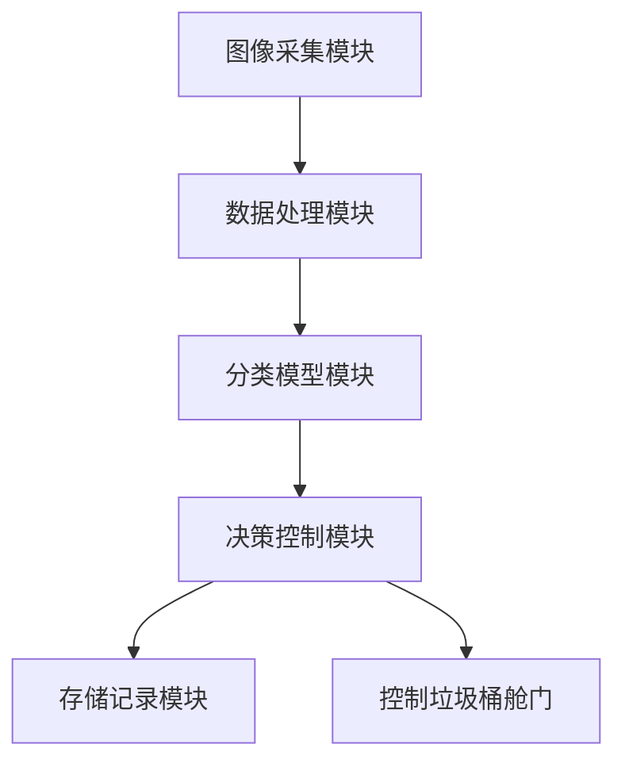

# 智能垃圾桶：AI Agent的自动分类系统

> 关键词：智能垃圾桶、AI Agent、自动分类系统、机器学习、计算机视觉

> 摘要：本文围绕智能垃圾桶的AI Agent自动分类系统展开深入探讨。首先介绍了该系统提出的背景、目的和适用范围，明确预期读者和文档结构。接着详细阐述了核心概念，包括AI Agent、智能垃圾桶自动分类系统的原理与架构，并给出了相应的文本示意图和Mermaid流程图。深入讲解了核心算法原理，通过Python源代码进行详细说明，同时介绍了相关的数学模型和公式，并举例进行分析。在项目实战部分，给出了开发环境搭建的步骤、源代码实现及详细解读。探讨了该系统的实际应用场景，推荐了学习资源、开发工具框架和相关论文著作。最后总结了未来发展趋势与挑战，解答了常见问题并提供了扩展阅读和参考资料。

## 1. 背景介绍 
### 1.1 目的和范围
随着全球人口的增长和城市化进程的加速，垃圾处理成为了一个日益严峻的问题。传统的垃圾桶仅仅是一个存储垃圾的容器，需要人工进行分类和清理，效率低下且容易出现分类错误的情况。智能垃圾桶的AI Agent自动分类系统旨在利用先进的人工智能技术，实现垃圾的自动分类，提高垃圾处理的效率和准确性，减少人工成本。

本系统的范围主要涵盖了垃圾的识别、分类和记录等功能。通过计算机视觉和机器学习算法，对投入垃圾桶的垃圾进行实时识别，并将其分类到相应的类别中，同时记录分类信息，以便后续的统计和分析。

### 1.2 预期读者
本文的预期读者包括对人工智能、计算机视觉、垃圾处理等领域感兴趣的科研人员、工程师、学生以及相关行业的从业者。对于想要了解智能垃圾桶技术原理和实现方法的读者，本文将提供详细的技术讲解和实践指导。

### 1.3 文档结构概述
本文将按照以下结构进行组织：
- 核心概念与联系：介绍智能垃圾桶AI Agent自动分类系统的核心概念，包括AI Agent、自动分类系统的原理和架构，并给出相应的示意图和流程图。
- 核心算法原理 & 具体操作步骤：详细讲解实现垃圾自动分类的核心算法原理，并用Python源代码进行详细阐述。
- 数学模型和公式 & 详细讲解 & 举例说明：介绍相关的数学模型和公式，并通过具体的例子进行说明。
- 项目实战：代码实际案例和详细解释说明：给出一个完整的项目实战案例，包括开发环境搭建、源代码实现和代码解读。
- 实际应用场景：探讨智能垃圾桶AI Agent自动分类系统的实际应用场景。
- 工具和资源推荐：推荐学习资源、开发工具框架和相关论文著作。
- 总结：未来发展趋势与挑战：总结智能垃圾桶技术的未来发展趋势和面临的挑战。
- 附录：常见问题与解答：解答读者在学习和实践过程中常见的问题。
- 扩展阅读 & 参考资料：提供相关的扩展阅读和参考资料。

### 1.4 术语表
#### 1.4.1 核心术语定义
- **AI Agent（人工智能代理）**：是一种能够感知环境、做出决策并采取行动的智能实体。在智能垃圾桶系统中，AI Agent负责感知投入的垃圾，进行分类决策并控制垃圾桶的操作。
- **智能垃圾桶**：配备了人工智能技术和传感器的垃圾桶，能够自动识别和分类垃圾。
- **自动分类系统**：利用计算机视觉和机器学习算法，对垃圾进行自动识别和分类的系统。
- **计算机视觉**：是一门研究如何使机器“看”的科学，通过图像和视频处理技术，让计算机理解和解释视觉信息。
- **机器学习**：是一门多领域交叉学科，涉及概率论、统计学、逼近论、凸分析、算法复杂度理论等多门学科。它专门研究计算机怎样模拟或实现人类的学习行为，以获取新的知识或技能，重新组织已有的知识结构使之不断改善自身的性能。

#### 1.4.2 相关概念解释
- **深度学习**：是机器学习的一个分支领域，它是一种基于对数据进行表征学习的方法。深度学习通过构建具有很多层的神经网络模型，自动从数据中学习特征和模式。
- **卷积神经网络（CNN）**：是一种专门为处理具有网格结构数据（如图像）而设计的深度学习模型。它通过卷积层、池化层和全连接层等组件，自动提取图像的特征。
- **图像识别**：是指利用计算机对图像进行处理、分析和理解，以识别各种不同模式的目标和对象的技术。在智能垃圾桶系统中，图像识别用于识别投入的垃圾种类。

#### 1.4.3 缩略词列表
- **AI**：Artificial Intelligence，人工智能
- **CNN**：Convolutional Neural Network，卷积神经网络
- **ML**：Machine Learning，机器学习

## 2. 核心概念与联系 

### 核心概念原理
智能垃圾桶的AI Agent自动分类系统主要基于计算机视觉和机器学习技术。其核心原理是通过摄像头采集投入垃圾桶的垃圾图像，然后利用卷积神经网络（CNN）对图像进行特征提取和分类。

AI Agent作为系统的核心，负责感知环境、做出决策和执行动作。它接收摄像头采集的图像数据，将其输入到训练好的CNN模型中进行分类预测。根据预测结果，AI Agent控制垃圾桶的相应舱门打开，将垃圾投放至正确的分类区域。

### 架构的文本示意图
智能垃圾桶的AI Agent自动分类系统主要由以下几个部分组成：
- **图像采集模块**：由摄像头组成，负责采集投入垃圾桶的垃圾图像。
- **数据处理模块**：对采集到的图像进行预处理，如缩放、归一化等操作，以提高模型的分类准确率。
- **分类模型模块**：使用训练好的CNN模型对预处理后的图像进行分类预测。
- **决策控制模块**：AI Agent根据分类预测结果，做出决策并控制垃圾桶的舱门打开。
- **存储记录模块**：记录分类信息，如垃圾种类、投放时间等，以便后续的统计和分析。

### Mermaid流程图


## 3. 核心算法原理 & 具体操作步骤 

### 核心算法原理
本系统使用卷积神经网络（CNN）作为核心分类算法。CNN是一种专门为处理具有网格结构数据（如图像）而设计的深度学习模型。它通过卷积层、池化层和全连接层等组件，自动提取图像的特征。

卷积层通过卷积核在图像上滑动，进行卷积操作，提取图像的局部特征。池化层用于降低特征图的维度，减少计算量，同时增强模型的鲁棒性。全连接层将提取的特征进行整合，输出分类结果。

### 具体操作步骤
#### 步骤1：数据收集与预处理
首先，需要收集大量的垃圾图像数据，并对其进行标注，标记出每个图像对应的垃圾类别。然后，对图像进行预处理，包括缩放、归一化等操作，以提高模型的分类准确率。

```python
import cv2
import numpy as np
from sklearn.preprocessing import LabelEncoder

# 数据收集与预处理函数
def preprocess_data(image_paths, labels):
    images = []
    for path in image_paths:
        image = cv2.imread(path)
        image = cv2.resize(image, (224, 224))  # 缩放图像到224x224
        image = image / 255.0  # 归一化处理
        images.append(image)
    
    images = np.array(images)
    le = LabelEncoder()
    labels = le.fit_transform(labels)
    
    return images, labels
```

#### 步骤2：模型构建
使用Keras构建CNN模型。

```python
from keras.models import Sequential
from keras.layers import Conv2D, MaxPooling2D, Flatten, Dense

# 构建CNN模型
def build_model(num_classes):
    model = Sequential()
    model.add(Conv2D(32, (3, 3), activation='relu', input_shape=(224, 224, 3)))
    model.add(MaxPooling2D((2, 2)))
    model.add(Conv2D(64, (3, 3), activation='relu'))
    model.add(MaxPooling2D((2, 2)))
    model.add(Conv2D(128, (3, 3), activation='relu'))
    model.add(MaxPooling2D((2, 2)))
    model.add(Flatten())
    model.add(Dense(128, activation='relu'))
    model.add(Dense(num_classes, activation='softmax'))
    
    model.compile(optimizer='adam', loss='sparse_categorical_crossentropy', metrics=['accuracy'])
    
    return model
```

#### 步骤3：模型训练
使用预处理后的数据对模型进行训练。

```python
# 模型训练
def train_model(model, images, labels, epochs=10, batch_size=32):
    model.fit(images, labels, epochs=epochs, batch_size=batch_size)
    return model
```

#### 步骤4：模型预测
使用训练好的模型对新的垃圾图像进行分类预测。

```python
# 模型预测
def predict(model, image):
    image = cv2.resize(image, (224, 224))
    image = image / 255.0
    image = np.expand_dims(image, axis=0)
    predictions = model.predict(image)
    predicted_class = np.argmax(predictions)
    return predicted_class
```

## 4. 数学模型和公式 & 详细讲解 & 举例说明 

### 卷积操作
卷积操作是CNN的核心操作之一。设输入图像为 $X$，卷积核为 $W$，输出特征图为 $Y$，则卷积操作可以表示为：

$$Y(i,j)=\sum_{m=0}^{M-1}\sum_{n=0}^{N-1}X(i+m,j+n)W(m,n)$$

其中，$M$ 和 $N$ 分别是卷积核的高度和宽度。

### 池化操作
池化操作用于降低特征图的维度。常见的池化操作有最大池化和平均池化。以最大池化为例，设输入特征图为 $X$，池化窗口大小为 $k\times k$，输出特征图为 $Y$，则最大池化操作可以表示为：

$$Y(i,j)=\max_{m=0}^{k-1}\max_{n=0}^{k-1}X(ik + m, jk + n)$$

### 全连接层
全连接层将提取的特征进行整合，输出分类结果。设输入特征向量为 $x$，权重矩阵为 $W$，偏置向量为 $b$，输出向量为 $y$，则全连接层的计算可以表示为：

$$y = Wx + b$$

### 举例说明
假设输入图像的大小为 $32\times 32\times 3$，卷积核的大小为 $3\times 3\times 3$，步长为 1，填充为 0。则经过卷积操作后，输出特征图的大小为 $(32 - 3 + 1)\times(32 - 3 + 1)\times C$，其中 $C$ 是卷积核的数量。

假设池化窗口大小为 $2\times 2$，步长为 2，则经过最大池化操作后，输出特征图的大小为 $( (32 - 3 + 1) / 2)\times( (32 - 3 + 1) / 2)\times C$。

## 5. 项目实战：代码实际案例和详细解释说明 

### 5.1  开发环境搭建
#### 安装Python
首先，需要安装Python 3.x版本。可以从Python官方网站（https://www.python.org/downloads/）下载并安装。

#### 安装必要的库
使用pip安装必要的库，包括OpenCV、Keras、NumPy等。

```bash
pip install opencv-python keras numpy
```

### 5.2  源代码详细实现和代码解读
```python
import cv2
import numpy as np
from sklearn.preprocessing import LabelEncoder
from keras.models import Sequential
from keras.layers import Conv2D, MaxPooling2D, Flatten, Dense

# 数据收集与预处理函数
def preprocess_data(image_paths, labels):
    images = []
    for path in image_paths:
        image = cv2.imread(path)
        image = cv2.resize(image, (224, 224))  # 缩放图像到224x224
        image = image / 255.0  # 归一化处理
        images.append(image)
    
    images = np.array(images)
    le = LabelEncoder()
    labels = le.fit_transform(labels)
    
    return images, labels

# 构建CNN模型
def build_model(num_classes):
    model = Sequential()
    model.add(Conv2D(32, (3, 3), activation='relu', input_shape=(224, 224, 3)))
    model.add(MaxPooling2D((2, 2)))
    model.add(Conv2D(64, (3, 3), activation='relu'))
    model.add(MaxPooling2D((2, 2)))
    model.add(Conv2D(128, (3, 3), activation='relu'))
    model.add(MaxPooling2D((2, 2)))
    model.add(Flatten())
    model.add(Dense(128, activation='relu'))
    model.add(Dense(num_classes, activation='softmax'))
    
    model.compile(optimizer='adam', loss='sparse_categorical_crossentropy', metrics=['accuracy'])
    
    return model

# 模型训练
def train_model(model, images, labels, epochs=10, batch_size=32):
    model.fit(images, labels, epochs=epochs, batch_size=batch_size)
    return model

# 模型预测
def predict(model, image):
    image = cv2.resize(image, (224, 224))
    image = image / 255.0
    image = np.expand_dims(image, axis=0)
    predictions = model.predict(image)
    predicted_class = np.argmax(predictions)
    return predicted_class

# 主函数
def main():
    # 假设已经有了图像路径和对应的标签
    image_paths = ['path/to/image1.jpg', 'path/to/image2.jpg',...]
    labels = ['class1', 'class2',...]
    
    # 数据预处理
    images, labels = preprocess_data(image_paths, labels)
    
    # 构建模型
    num_classes = len(np.unique(labels))
    model = build_model(num_classes)
    
    # 模型训练
    model = train_model(model, images, labels)
    
    # 测试图像
    test_image = cv2.imread('path/to/test_image.jpg')
    predicted_class = predict(model, test_image)
    print(f'Predicted class: {predicted_class}')

if __name__ == "__main__":
    main()
```

### 5.3  代码解读与分析
- **数据预处理**：`preprocess_data` 函数负责读取图像数据，并进行缩放和归一化处理。同时，使用 `LabelEncoder` 对标签进行编码。
- **模型构建**：`build_model` 函数使用Keras构建CNN模型，包括卷积层、池化层和全连接层。使用 `adam` 优化器和 `sparse_categorical_crossentropy` 损失函数进行模型编译。
- **模型训练**：`train_model` 函数使用预处理后的数据对模型进行训练。
- **模型预测**：`predict` 函数使用训练好的模型对新的图像进行分类预测。
- **主函数**：`main` 函数调用上述函数，完成数据预处理、模型构建、训练和预测的整个流程。

## 6. 实际应用场景 
### 公共场所
在商场、学校、公园等公共场所，智能垃圾桶的AI Agent自动分类系统可以帮助人们正确分类垃圾，提高垃圾处理的效率。同时，系统可以实时记录垃圾投放信息，为后续的垃圾处理和管理提供数据支持。

### 住宅小区
在住宅小区中，智能垃圾桶可以方便居民进行垃圾分类，减少人工分类的工作量。系统可以通过手机APP等方式，向居民提供垃圾分类的指导和提示，提高居民的环保意识。

### 工业领域
在工业生产过程中，会产生大量的废弃物。智能垃圾桶的自动分类系统可以对这些废弃物进行实时分类，提高资源回收利用率，减少环境污染。

## 7. 工具和资源推荐
### 7.1 学习资源推荐
#### 7.1.1 书籍推荐
- 《深度学习》（Deep Learning）：由Ian Goodfellow、Yoshua Bengio和Aaron Courville所著，是深度学习领域的经典教材。
- 《Python深度学习》（Deep Learning with Python）：由Francois Chollet所著，介绍了如何使用Python和Keras进行深度学习开发。
- 《计算机视觉：算法与应用》（Computer Vision: Algorithms and Applications）：由Richard Szeliski所著，是计算机视觉领域的权威书籍。

#### 7.1.2 在线课程
- Coursera上的“深度学习专项课程”（Deep Learning Specialization）：由Andrew Ng教授授课，系统介绍了深度学习的基础知识和应用。
- edX上的“计算机视觉基础”（Introduction to Computer Vision）：介绍了计算机视觉的基本概念和算法。
- Udemy上的“Python数据科学和机器学习训练营”（Python for Data Science and Machine Learning Bootcamp）：涵盖了Python编程、数据科学和机器学习的基础知识。

#### 7.1.3 技术博客和网站
- Medium：是一个技术博客平台，有很多关于人工智能、计算机视觉等领域的优质文章。
- arXiv：是一个预印本平台，提供了大量的学术论文，包括人工智能、机器学习等领域的最新研究成果。
- Kaggle：是一个数据科学竞赛平台，提供了丰富的数据集和竞赛项目，可以帮助学习者提高实践能力。

### 7.2 开发工具框架推荐
#### 7.2.1 IDE和编辑器
- PyCharm：是一款专门为Python开发设计的集成开发环境（IDE），提供了丰富的功能和插件，方便开发者进行代码编写、调试和管理。
- Jupyter Notebook：是一个基于Web的交互式开发环境，适合进行数据分析、机器学习等领域的实验和开发。
- Visual Studio Code：是一款轻量级的代码编辑器，支持多种编程语言和插件，具有良好的扩展性。

#### 7.2.2 调试和性能分析工具
- TensorBoard：是TensorFlow提供的可视化工具，可以帮助开发者可视化模型的训练过程、性能指标等信息。
- Py-Spy：是一个Python性能分析工具，可以实时监测Python程序的性能瓶颈。
- cProfile：是Python标准库中的性能分析模块，可以分析Python程序的运行时间和函数调用次数。

#### 7.2.3 相关框架和库
- TensorFlow：是一个开源的机器学习框架，由Google开发，广泛应用于深度学习领域。
- PyTorch：是一个开源的深度学习框架，由Facebook开发，具有动态图的特点，方便开发者进行模型开发和调试。
- OpenCV：是一个开源的计算机视觉库，提供了丰富的图像处理和计算机视觉算法，适用于图像识别、目标检测等领域。

### 7.3 相关论文著作推荐
#### 7.3.1 经典论文
- “ImageNet Classification with Deep Convolutional Neural Networks”：由Alex Krizhevsky、Ilya Sutskever和Geoffrey E. Hinton所著，介绍了AlexNet模型，开启了深度学习在计算机视觉领域的革命。
- “Very Deep Convolutional Networks for Large-Scale Image Recognition”：由Karen Simonyan和Andrew Zisserman所著，提出了VGGNet模型，在图像分类任务中取得了很好的效果。
- “Going Deeper with Convolutions”：由Christian Szegedy等人所著，提出了GoogLeNet模型，引入了Inception模块，提高了模型的性能和效率。

#### 7.3.2 最新研究成果
- 可以关注CVPR（计算机视觉与模式识别会议）、ICCV（国际计算机视觉会议）、ECCV（欧洲计算机视觉会议）等顶级学术会议，获取计算机视觉领域的最新研究成果。

#### 7.3.3 应用案例分析
- 可以参考一些实际的智能垃圾桶项目案例，了解如何将AI Agent自动分类系统应用到实际场景中。同时，可以关注相关的行业报告和研究论文，了解智能垃圾桶技术的应用现状和发展趋势。

## 8. 总结：未来发展趋势与挑战
### 未来发展趋势
- **智能化程度不断提高**：随着人工智能技术的不断发展，智能垃圾桶的AI Agent自动分类系统将变得更加智能化。例如，系统可以通过学习用户的行为习惯，提供个性化的垃圾分类建议；可以实时监测垃圾桶的状态，自动调整分类策略。
- **与物联网技术深度融合**：智能垃圾桶可以与物联网技术相结合，实现远程监控和管理。例如，通过传感器实时监测垃圾桶的满溢状态，及时通知清理人员进行清理；可以将分类信息上传到云端，实现数据的共享和分析。
- **应用场景不断拓展**：除了公共场所和住宅小区，智能垃圾桶的应用场景还将不断拓展。例如，在医疗、餐饮等行业，智能垃圾桶可以对特殊垃圾进行分类和处理，提高垃圾处理的安全性和效率。

### 挑战
- **数据质量和数量**：深度学习模型的性能很大程度上依赖于数据的质量和数量。收集大量高质量的垃圾图像数据是一个挑战，同时需要对数据进行标注和预处理，以提高模型的分类准确率。
- **模型的泛化能力**：不同地区、不同环境下的垃圾种类和外观可能存在差异，模型需要具备良好的泛化能力，才能在不同的场景下准确分类垃圾。
- **成本和维护**：智能垃圾桶的研发和生产成本较高，同时需要定期进行维护和更新。如何降低成本，提高系统的稳定性和可靠性，是一个需要解决的问题。

## 9. 附录：常见问题与解答
### 问题1：如何提高模型的分类准确率？
- 答案：可以通过以下方法提高模型的分类准确率：
  - 收集更多高质量的数据，并进行数据增强，如旋转、翻转、缩放等操作，以增加数据的多样性。
  - 调整模型的超参数，如学习率、批次大小、训练轮数等。
  - 尝试不同的模型架构，如ResNet、Inception等。

### 问题2：智能垃圾桶的AI Agent自动分类系统可以识别哪些类型的垃圾？
- 答案：系统可以识别的垃圾类型取决于训练数据的种类。一般来说，可以识别常见的可回收物、有害垃圾、厨余垃圾和其他垃圾等。

### 问题3：如何处理模型的过拟合问题？
- 答案：可以通过以下方法处理模型的过拟合问题：
  - 增加训练数据的数量。
  - 使用正则化方法，如L1和L2正则化。
  - 提前停止训练，避免模型过度学习训练数据。

## 10. 扩展阅读 & 参考资料
### 扩展阅读
- 《人工智能时代的垃圾分类新趋势》
- 《计算机视觉技术在智能垃圾桶中的应用研究》

### 参考资料
- Goodfellow, I., Bengio, Y., & Courville, A. (2016). Deep Learning. MIT Press.
- Chollet, F. (2017). Deep Learning with Python. Manning Publications.
- Szeliski, R. (2010). Computer Vision: Algorithms and Applications. Springer.

作者：AI天才研究院/AI Genius Institute & 禅与计算机程序设计艺术 /Zen And The Art of Computer Programming