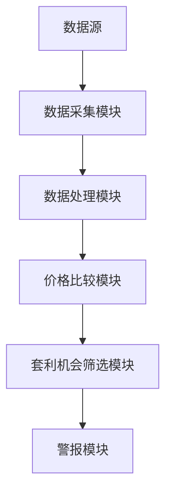

# 智能外汇套利机会识别系统

> 关键词：智能外汇套利、机会识别系统、算法原理、数学模型、项目实战

> 摘要：本文围绕智能外汇套利机会识别系统展开全面深入的探讨。首先介绍系统开发的背景、目的、预期读者和文档结构等信息，接着阐述核心概念、算法原理、数学模型等基础理论知识，通过 Python 代码详细展示算法实现过程。然后结合实际项目，从开发环境搭建到源代码实现与解读进行实战分析。还探讨了该系统在实际中的应用场景，推荐了相关的学习资源、开发工具框架以及论文著作。最后总结系统未来的发展趋势与挑战，并提供常见问题解答和扩展阅读参考资料，旨在为读者全面剖析智能外汇套利机会识别系统。

## 1. 背景介绍 
### 1.1 目的和范围
在外汇市场中，由于不同市场、不同交易平台或者不同货币对之间存在信息传递的延迟、交易成本的差异等因素，会出现短暂的价格差异。外汇套利就是利用这些价格差异，在一个市场以低价买入某种货币，同时在另一个市场以高价卖出，从而获取无风险或者低风险的利润。

本智能外汇套利机会识别系统的目的在于实时监测外汇市场中各种货币对的价格信息，通过先进的算法和技术手段，快速、准确地识别出潜在的套利机会，并及时向投资者发出警报。系统的范围涵盖了主要外汇交易市场中常见的货币对，如 EUR/USD、GBP/USD、USD/JPY 等，能够处理多种数据源的数据，包括实时行情数据、历史交易数据等。

### 1.2 预期读者
本文的预期读者主要包括以下几类人群：
- 外汇投资者：希望借助系统识别套利机会，提高投资收益的个人或机构投资者。
- 金融科技开发者：对智能金融系统开发感兴趣，希望了解外汇套利机会识别系统的架构、算法和实现细节的开发者。
- 金融研究人员：从事外汇市场研究，需要利用系统进行数据收集和分析的研究人员。
- 高校相关专业学生：学习金融工程、计算机科学等专业，希望通过实际案例了解金融与技术结合应用的学生。

### 1.3 文档结构概述
本文将按照以下结构进行组织：
- 核心概念与联系：介绍智能外汇套利机会识别系统涉及的核心概念，包括外汇套利的类型、系统的架构等，并通过文本示意图和 Mermaid 流程图进行展示。
- 核心算法原理 & 具体操作步骤：详细讲解系统所使用的核心算法原理，如价格比较算法、套利机会筛选算法等，并使用 Python 源代码进行阐述。
- 数学模型和公式 & 详细讲解 & 举例说明：介绍系统背后的数学模型和公式，如套利收益计算模型等，并通过具体例子进行说明。
- 项目实战：代码实际案例和详细解释说明：从开发环境搭建开始，逐步介绍系统的源代码实现和代码解读，帮助读者理解系统的实际开发过程。
- 实际应用场景：探讨智能外汇套利机会识别系统在实际外汇交易中的应用场景。
- 工具和资源推荐：推荐学习相关知识、开发系统所需的工具和资源，包括书籍、在线课程、开发工具框架和相关论文著作等。
- 总结：未来发展趋势与挑战：总结系统的未来发展趋势和可能面临的挑战。
- 附录：常见问题与解答：解答读者在学习和使用系统过程中可能遇到的常见问题。
- 扩展阅读 & 参考资料：提供扩展阅读的建议和相关参考资料。

### 1.4 术语表
#### 1.4.1 核心术语定义
- **外汇套利**：利用不同外汇市场、不同货币对之间的价格差异，进行低买高卖操作以获取利润的交易行为。
- **货币对**：由两种货币组成的外汇交易单位，如 EUR/USD 表示欧元兑美元。
- **点差**：买入价和卖出价之间的差值，是外汇交易的成本之一。
- **套利机会**：当不同市场或不同货币对之间存在足够大的价格差异，使得扣除交易成本后仍能获得利润时，就存在套利机会。

#### 1.4.2 相关概念解释
- **实时行情数据**：外汇市场中货币对的最新价格信息，包括买入价、卖出价等，通常以高频数据的形式提供。
- **历史交易数据**：过去一段时间内外汇市场的交易记录，包括价格、交易量等信息，可用于分析市场趋势和统计套利机会的出现频率。
- **交易成本**：进行外汇交易时需要支付的费用，包括点差、手续费等。

#### 1.4.3 缩略词列表
- **API**：Application Programming Interface，应用程序编程接口，用于获取外汇市场的实时行情数据。
- **PIP**：Percentage in Point，点，外汇价格变动的最小单位。

## 2. 核心概念与联系 

### 核心概念原理
智能外汇套利机会识别系统的核心原理是通过实时监测多个外汇市场或交易平台上的货币对价格，找出价格差异，并判断是否存在套利机会。系统主要涉及以下几个核心概念：

- **数据源**：系统需要从多个数据源获取外汇市场的实时行情数据，这些数据源可以是外汇交易平台的 API、金融数据提供商等。
- **价格比较**：将不同数据源提供的同一货币对的价格进行比较，找出价格差异。
- **套利机会筛选**：根据预先设定的条件，如最小利润阈值、最大交易成本等，筛选出具有实际操作价值的套利机会。
- **警报机制**：当识别出套利机会时，系统会及时向投资者发出警报，通知他们进行交易操作。

### 架构的文本示意图
```plaintext
+-------------------+
| 数据源            |
| （交易平台 API、  |
|  金融数据提供商） |
+-------------------+
         |
         v
+-------------------+
| 数据采集模块      |
| （获取实时行情    |
|  数据）           |
+-------------------+
         |
         v
+-------------------+
| 数据处理模块      |
| （清洗、存储数    |
|  据）             |
+-------------------+
         |
         v
+-------------------+
| 价格比较模块      |
| （比较不同数据    |
|  源的价格）       |
+-------------------+
         |
         v
+-------------------+
| 套利机会筛选模块  |
| （根据条件筛选    |
|  套利机会）       |
+-------------------+
         |
         v
+-------------------+
| 警报模块          |
| （向投资者发      |
|  出警报）         |
+-------------------+
```

### Mermaid 流程图


## 3. 核心算法原理 & 具体操作步骤 

### 价格比较算法原理
价格比较算法是智能外汇套利机会识别系统的核心算法之一，其主要目的是找出不同数据源提供的同一货币对的价格差异。以下是价格比较算法的 Python 实现：

```python
import requests

# 假设这是两个不同数据源的 API 地址
api_url_1 = 'https://example.com/api/price1'
api_url_2 = 'https://example.com/api/price2'

def get_price(api_url):
    try:
        response = requests.get(api_url)
        if response.status_code == 200:
            data = response.json()
            return data['price']
        else:
            print(f"请求失败，状态码: {response.status_code}")
            return None
    except Exception as e:
        print(f"发生错误: {e}")
        return None

# 获取两个数据源的价格
price_1 = get_price(api_url_1)
price_2 = get_price(api_url_2)

if price_1 is not None and price_2 is not None:
    price_difference = abs(price_1 - price_2)
    print(f"价格差异: {price_difference}")
else:
    print("无法获取价格信息")
```

### 套利机会筛选算法原理
套利机会筛选算法根据预先设定的条件，如最小利润阈值、最大交易成本等，筛选出具有实际操作价值的套利机会。以下是套利机会筛选算法的 Python 实现：

```python
# 假设最小利润阈值为 0.001
min_profit_threshold = 0.001
# 假设交易成本为 0.0005
transaction_cost = 0.0005

def is_arbitrage_opportunity(price_1, price_2):
    price_difference = abs(price_1 - price_2)
    profit = price_difference - 2 * transaction_cost  # 考虑双向交易成本
    if profit > min_profit_threshold:
        return True
    else:
        return False

if price_1 is not None and price_2 is not None:
    if is_arbitrage_opportunity(price_1, price_2):
        print("存在套利机会")
    else:
        print("不存在套利机会")
```

### 具体操作步骤
1. **数据采集**：使用 API 从多个数据源获取外汇市场的实时行情数据。
2. **数据处理**：对采集到的数据进行清洗和存储，去除无效数据和重复数据。
3. **价格比较**：将不同数据源提供的同一货币对的价格进行比较，计算价格差异。
4. **套利机会筛选**：根据预先设定的条件，筛选出具有实际操作价值的套利机会。
5. **警报通知**：当识别出套利机会时，通过邮件、短信等方式向投资者发出警报。

## 4. 数学模型和公式 & 详细讲解 & 举例说明 

### 套利收益计算模型
套利收益的计算公式如下：
$$
\text{套利收益} = (\text{高价卖出价} - \text{低价买入价}) \times \text{交易数量} - 2 \times \text{交易成本} \times \text{交易数量}
$$

### 详细讲解
- **高价卖出价**：在价格较高的市场或交易平台上卖出货币的价格。
- **低价买入价**：在价格较低的市场或交易平台上买入货币的价格。
- **交易数量**：进行套利交易的货币数量。
- **交易成本**：每单位货币交易需要支付的费用，包括点差、手续费等。

### 举例说明
假设在市场 A 上，EUR/USD 的买入价为 1.1000，卖出价为 1.1002；在市场 B 上，EUR/USD 的买入价为 1.1005，卖出价为 1.1007。交易成本为每单位货币 0.0001。我们进行 10000 单位的 EUR/USD 套利交易。

- 在市场 A 上以 1.1002 的价格买入 10000 单位的 EUR/USD，成本为 $1.1002 \times 10000 = 11002$ 美元。
- 在市场 B 上以 1.1005 的价格卖出 10000 单位的 EUR/USD，收入为 $1.1005 \times 10000 = 11005$ 美元。
- 交易成本为 $2 \times 0.0001 \times 10000 = 2$ 美元。
- 套利收益为 $(1.1005 - 1.1002) \times 10000 - 2 = 1$ 美元。

## 5. 项目实战：代码实际案例和详细解释说明 

### 5.1  开发环境搭建
#### 编程语言和框架
本项目使用 Python 作为主要编程语言，因为 Python 具有丰富的库和工具，适合进行数据处理和分析。以下是需要安装的主要库：
- `requests`：用于发送 HTTP 请求，获取外汇市场的实时行情数据。
- `pandas`：用于数据处理和分析。
- `numpy`：用于数值计算。

可以使用以下命令安装这些库：
```sh
pip install requests pandas numpy
```

#### 开发工具
推荐使用 PyCharm 作为开发工具，它是一款功能强大的 Python 集成开发环境（IDE），提供了代码编辑、调试、版本控制等功能。

### 5.2  源代码详细实现和代码解读
```python
import requests
import pandas as pd
import numpy as np

# 假设这是两个不同数据源的 API 地址
api_url_1 = 'https://example.com/api/price1'
api_url_2 = 'https://example.com/api/price2'

# 假设最小利润阈值为 0.001
min_profit_threshold = 0.001
# 假设交易成本为 0.0005
transaction_cost = 0.0005

def get_price(api_url):
    try:
        response = requests.get(api_url)
        if response.status_code == 200:
            data = response.json()
            return data['price']
        else:
            print(f"请求失败，状态码: {response.status_code}")
            return None
    except Exception as e:
        print(f"发生错误: {e}")
        return None

def is_arbitrage_opportunity(price_1, price_2):
    price_difference = abs(price_1 - price_2)
    profit = price_difference - 2 * transaction_cost  # 考虑双向交易成本
    if profit > min_profit_threshold:
        return True
    else:
        return False

# 获取两个数据源的价格
price_1 = get_price(api_url_1)
price_2 = get_price(api_url_2)

if price_1 is not None and price_2 is not None:
    if is_arbitrage_opportunity(price_1, price_2):
        print("存在套利机会")
        # 计算套利收益
        transaction_volume = 10000  # 假设交易数量为 10000
        profit = (max(price_1, price_2) - min(price_1, price_2)) * transaction_volume - 2 * transaction_cost * transaction_volume
        print(f"套利收益: {profit}")
    else:
        print("不存在套利机会")
else:
    print("无法获取价格信息")
```

### 5.3  代码解读与分析
- **`get_price` 函数**：该函数用于从指定的 API 地址获取外汇市场的实时行情数据。如果请求成功，返回价格信息；否则，打印错误信息并返回 `None`。
- **`is_arbitrage_opportunity` 函数**：该函数用于判断是否存在套利机会。它计算两个价格之间的差异，并扣除双向交易成本，然后与最小利润阈值进行比较。如果利润大于阈值，则认为存在套利机会。
- **主程序**：首先调用 `get_price` 函数获取两个数据源的价格，然后调用 `is_arbitrage_opportunity` 函数判断是否存在套利机会。如果存在套利机会，则计算套利收益并打印出来；否则，打印不存在套利机会的信息。

## 6. 实际应用场景 
### 个人投资者
个人投资者可以使用智能外汇套利机会识别系统来寻找外汇市场中的套利机会，提高投资收益。系统可以实时监测多个外汇市场的价格信息，当发现套利机会时，及时向投资者发出警报，投资者可以根据警报信息进行交易操作。

### 金融机构
金融机构，如银行、对冲基金等，可以利用智能外汇套利机会识别系统进行大规模的外汇套利交易。系统可以处理大量的实时行情数据，快速准确地识别出套利机会，并自动执行交易策略，提高交易效率和收益。

### 外汇交易平台
外汇交易平台可以将智能外汇套利机会识别系统集成到自己的平台中，为用户提供套利机会识别服务。这可以吸引更多的用户使用平台进行外汇交易，提高平台的竞争力。

## 7. 工具和资源推荐
### 7.1 学习资源推荐
#### 7.1.1 书籍推荐
- 《外汇交易圣经》：全面介绍外汇交易的基本知识、交易策略和风险管理方法。
- 《金融市场技术分析》：讲解金融市场的技术分析方法，包括图表分析、指标分析等，对外汇套利交易有很大的帮助。
- 《Python 金融数据分析实战》：介绍如何使用 Python 进行金融数据分析，包括数据获取、处理、可视化等，适合开发智能外汇套利机会识别系统的开发者阅读。

#### 7.1.2 在线课程
- Coursera 上的“Financial Markets”课程：由耶鲁大学教授 Robert Shiller 主讲，介绍金融市场的基本概念、理论和实践。
- Udemy 上的“Python for Finance: Investment Fundamentals & Data Analytics”课程：讲解如何使用 Python 进行金融投资分析和数据处理。

#### 7.1.3 技术博客和网站
- 外汇天眼：提供外汇市场的实时行情、新闻资讯、交易策略等信息。
- 汇通网：专注于外汇市场的分析和研究，提供专业的外汇评论和交易建议。
- 量化投资与机器学习：分享量化投资和机器学习在金融领域的应用经验和技术文章。

### 7.2 开发工具框架推荐
#### 7.2.1 IDE和编辑器
- PyCharm：功能强大的 Python 集成开发环境，提供代码编辑、调试、版本控制等功能。
- Visual Studio Code：轻量级的代码编辑器，支持多种编程语言，具有丰富的插件扩展功能。

#### 7.2.2 调试和性能分析工具
- `pdb`：Python 内置的调试器，可以帮助开发者调试代码。
- `cProfile`：Python 内置的性能分析工具，可以分析代码的运行时间和性能瓶颈。

#### 7.2.3 相关框架和库
- `requests`：用于发送 HTTP 请求，获取外汇市场的实时行情数据。
- `pandas`：用于数据处理和分析，提供了丰富的数据结构和数据处理方法。
- `numpy`：用于数值计算，提供了高效的数组和矩阵运算功能。

### 7.3 相关论文著作推荐
#### 7.3.1 经典论文
- "Arbitrage in Financial Markets"：介绍金融市场中的套利理论和方法。
- "The Efficiency of Foreign Exchange Markets"：研究外汇市场的有效性和套利机会。

#### 7.3.2 最新研究成果
- 可以通过 Google Scholar、IEEE Xplore 等学术数据库搜索关于智能外汇套利机会识别系统的最新研究成果。

#### 7.3.3 应用案例分析
- 可以参考一些金融机构或研究机构发布的外汇套利交易应用案例分析报告，了解实际应用中的经验和教训。

## 8. 总结：未来发展趋势与挑战
### 未来发展趋势
- **智能化程度提高**：随着人工智能和机器学习技术的不断发展，智能外汇套利机会识别系统将更加智能化。系统可以通过学习历史数据和市场趋势，自动调整套利策略，提高套利效率和收益。
- **多市场融合**：未来的系统将不仅仅局限于外汇市场，还将融合股票、期货、债券等多个金融市场，实现跨市场的套利机会识别。
- **移动化和云端化**：为了方便投资者随时随地获取套利机会信息，系统将向移动化和云端化方向发展。投资者可以通过手机应用或网页浏览器访问系统，实时监测市场行情和套利机会。

### 挑战
- **数据质量和可靠性**：外汇市场的实时行情数据质量和可靠性对系统的性能和准确性有很大影响。数据延迟、错误或不完整可能导致系统误判套利机会，因此需要建立有效的数据质量监控和处理机制。
- **市场变化快速**：外汇市场变化快速，套利机会往往转瞬即逝。系统需要具备快速响应和处理能力，能够在短时间内识别和抓住套利机会。
- **法律法规和监管**：外汇套利交易涉及到金融市场的法律法规和监管要求。系统开发者和投资者需要遵守相关法律法规，确保交易的合法性和合规性。

## 9. 附录：常见问题与解答
### 问题 1：智能外汇套利机会识别系统的准确率有多高？
解答：系统的准确率取决于多个因素，如数据质量、算法模型、市场环境等。一般来说，通过优化数据采集和处理方法、改进算法模型，可以提高系统的准确率。但由于外汇市场的不确定性，系统无法保证 100% 的准确率。

### 问题 2：系统识别出的套利机会一定能获利吗？
解答：不一定。虽然系统识别出的套利机会理论上存在获利空间，但在实际交易中，还需要考虑交易成本、市场流动性、交易执行速度等因素。如果这些因素不利，可能会导致套利交易无法获利甚至亏损。

### 问题 3：如何保证系统的安全性？
解答：为了保证系统的安全性，需要采取以下措施：
- 对数据进行加密处理，防止数据泄露。
- 采用安全的网络通信协议，确保数据传输的安全性。
- 对系统进行定期的安全审计和漏洞修复，防止黑客攻击。

### 问题 4：系统可以处理多少个数据源的数据？
解答：系统可以处理的数据源数量取决于系统的性能和架构设计。一般来说，通过优化系统架构和采用分布式计算技术，可以处理多个数据源的数据。但随着数据源数量的增加，系统的处理压力也会增大，需要合理配置系统资源。

## 10. 扩展阅读 & 参考资料
### 扩展阅读
- 《高频交易》：介绍高频交易的原理、策略和技术，对智能外汇套利机会识别系统的开发有一定的参考价值。
- 《量化交易：如何建立自己的算法交易系统》：讲解如何建立量化交易系统，包括数据获取、策略开发、回测和实盘交易等环节。

### 参考资料
- 外汇交易平台的官方文档和 API 文档，用于了解如何获取实时行情数据。
- 相关学术论文和研究报告，用于深入了解外汇套利理论和技术。

作者：AI天才研究院/AI Genius Institute & 禅与计算机程序设计艺术 /Zen And The Art of Computer Programming