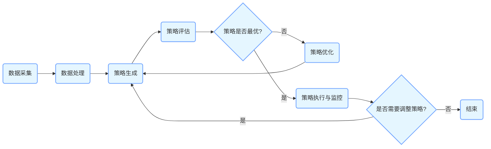

# 智能外汇风险对冲策略优化系统

> 关键词：智能外汇、风险对冲策略、优化系统、量化分析、机器学习

> 摘要：本文围绕智能外汇风险对冲策略优化系统展开深入探讨。首先介绍了系统开发的背景、目的、预期读者以及文档结构等内容。接着阐述了核心概念，包括外汇风险、对冲策略等，并给出了相关原理和架构的示意图及流程图。详细讲解了核心算法原理，通过Python代码进行具体实现。分析了系统涉及的数学模型和公式，并举例说明其应用。在项目实战部分，提供了开发环境搭建、源代码实现及解读。探讨了系统的实际应用场景，推荐了学习资源、开发工具框架以及相关论文著作。最后总结了系统未来的发展趋势与挑战，同时列出常见问题解答和扩展阅读参考资料，旨在为外汇市场参与者提供一个全面且深入的智能外汇风险对冲策略优化系统的技术指导。

## 1. 背景介绍 
### 1.1 目的和范围
在全球经济一体化的大背景下，外汇市场作为全球最大、最活跃的金融市场之一，每天的交易量巨大。外汇汇率的波动受到多种因素的影响，如宏观经济数据、政治事件、央行政策等，这些波动给企业和投资者带来了巨大的外汇风险。外汇风险对冲策略的目的就是通过各种金融工具和手段，降低或消除因汇率波动而产生的潜在损失。

本智能外汇风险对冲策略优化系统的目的是开发一个智能化的系统，利用先进的数据分析和机器学习技术，对传统的外汇风险对冲策略进行优化，提高对冲效率和效果，降低成本。系统的范围涵盖了外汇市场数据的采集、清洗、分析，对冲策略的生成、评估和优化，以及策略的执行和监控等环节。

### 1.2 预期读者
本文的预期读者包括外汇市场的投资者、企业财务管理人员、金融机构的交易员和分析师，以及对量化金融和机器学习在外汇领域应用感兴趣的技术人员和研究人员。

### 1.3 文档结构概述
本文将按照以下结构进行阐述：首先介绍系统的核心概念和它们之间的联系，包括外汇风险、对冲策略等；然后详细讲解核心算法原理和具体操作步骤，并用Python代码进行实现；接着分析系统涉及的数学模型和公式，并举例说明；在项目实战部分，介绍开发环境搭建、源代码实现和代码解读；探讨系统的实际应用场景；推荐相关的学习资源、开发工具框架和论文著作；最后总结系统的未来发展趋势与挑战，列出常见问题解答和扩展阅读参考资料。

### 1.4 术语表
#### 1.4.1 核心术语定义
- **外汇风险**：指经济主体在持有或运用外汇的经济活动中，因汇率变动而蒙受损失的可能性。
- **风险对冲**：通过投资或购买与标的资产收益波动负相关的某种资产或衍生产品，来冲销标的资产潜在的风险损失的一种风险管理策略。
- **对冲策略**：为了实现风险对冲而制定的具体操作方案，包括选择对冲工具、确定对冲比例等。
- **量化分析**：指运用数学、统计学等方法，对金融市场的数据进行分析和建模，以支持投资决策。
- **机器学习**：一门多领域交叉学科，涉及概率论、统计学、逼近论、凸分析、算法复杂度理论等多门学科。它专门研究计算机怎样模拟或实现人类的学习行为，以获取新的知识或技能，重新组织已有的知识结构使之不断改善自身的性能。

#### 1.4.2 相关概念解释
- **外汇衍生品**：以外汇为基础资产的金融衍生工具，包括外汇远期、外汇期货、外汇期权等，常用于外汇风险对冲。
- **夏普比率**：一种衡量投资组合风险调整后收益的指标，计算公式为 $Sharpe Ratio = \frac{R_p - R_f}{\sigma_p}$，其中 $R_p$ 是投资组合的预期收益率，$R_f$ 是无风险利率，$\sigma_p$ 是投资组合的标准差。
- **最大回撤**：在选定周期内任一历史时点往后推，产品净值走到最低点时的收益率回撤幅度的最大值，用于衡量投资组合的最大潜在损失。

#### 1.4.3 缩略词列表
- **AI**：Artificial Intelligence，人工智能
- **ML**：Machine Learning，机器学习
- **FX**：Foreign Exchange，外汇
- **VaR**：Value at Risk，风险价值

## 2. 核心概念与联系 

### 核心概念原理
#### 外汇风险
外汇风险主要包括交易风险、会计风险和经济风险。交易风险是指企业在以外币计价的交易中，由于汇率波动而导致的应收资产或应付债务的本币价值发生变化的风险。会计风险是指企业在进行会计报表合并时，由于汇率波动而导致的资产、负债、收入和费用等项目的本币价值发生变化的风险。经济风险是指由于汇率波动而对企业未来的现金流量和市场价值产生的潜在影响。

#### 风险对冲
风险对冲的原理是通过建立与原风险头寸相反的头寸，使得当原风险头寸因汇率波动而产生损失时，对冲头寸能够产生相应的收益，从而抵消或部分抵消损失。例如，企业预计未来会收到一笔外币应收账款，为了避免汇率下跌带来的损失，可以通过签订外汇远期合约，在未来以约定的汇率卖出该外币，从而锁定本币收入。

#### 对冲策略
常见的对冲策略包括外汇远期对冲、外汇期货对冲、外汇期权对冲等。外汇远期对冲是指企业与银行签订外汇远期合约，约定在未来某一特定日期以约定的汇率买卖一定金额的外汇。外汇期货对冲是指企业通过在期货市场上买卖外汇期货合约来对冲外汇风险。外汇期权对冲是指企业购买外汇期权合约，获得在未来某一特定日期或之前以约定的汇率买卖一定金额外汇的权利，而不是义务。

### 架构的文本示意图
```plaintext
智能外汇风险对冲策略优化系统架构

数据采集层
|-- 外汇市场数据
|   |-- 汇率数据
|   |-- 利率数据
|   |-- 宏观经济数据
|-- 企业财务数据
|   |-- 外汇收支数据
|   |-- 资产负债数据

数据处理层
|-- 数据清洗
|   |-- 去除噪声
|   |-- 填补缺失值
|-- 数据特征提取
|   |-- 计算技术指标
|   |-- 构建经济因子

策略生成层
|-- 传统策略生成
|   |-- 外汇远期对冲策略
|   |-- 外汇期货对冲策略
|   |-- 外汇期权对冲策略
|-- 智能策略生成
|   |-- 基于机器学习的策略生成

策略评估层
|-- 风险评估
|   |-- 计算VaR
|   |-- 计算最大回撤
|-- 收益评估
|   |-- 计算夏普比率
|   |-- 计算累计收益率

策略优化层
|-- 基于遗传算法的优化
|-- 基于模拟退火算法的优化

策略执行与监控层
|-- 策略执行
|   |-- 交易指令发送
|-- 策略监控
|   |-- 实时风险监测
|   |-- 策略调整
```

### Mermaid 流程图


## 3. 核心算法原理 & 具体操作步骤 

### 核心算法原理
#### 机器学习算法在策略生成中的应用
我们可以使用机器学习算法，如支持向量机（SVM）、随机森林（Random Forest）等，来预测外汇汇率的走势，并根据预测结果生成对冲策略。以支持向量机为例，其基本原理是在特征空间中找到一个最优的超平面，使得不同类别的样本能够被最大程度地分开。在外汇汇率预测中，我们可以将历史汇率数据、宏观经济数据等作为输入特征，将汇率的涨跌作为输出标签，训练支持向量机模型。

#### 优化算法在策略优化中的应用
为了找到最优的对冲策略，我们可以使用优化算法，如遗传算法（Genetic Algorithm）、模拟退火算法（Simulated Annealing Algorithm）等。以遗传算法为例，其基本原理是模拟生物进化过程，通过选择、交叉和变异等操作，不断迭代优化策略参数，直到找到最优解。

### 具体操作步骤及 Python 代码实现

#### 数据采集与处理
```python
import pandas as pd
import numpy as np
import yfinance as yf

# 采集外汇数据
def get_fx_data(pair, start_date, end_date):
    data = yf.download(pair, start=start_date, end=end_date)
    return data

# 数据清洗
def clean_data(data):
    data = data.dropna()
    return data

# 数据特征提取
def extract_features(data):
    data['returns'] = np.log(data['Close'] / data['Close'].shift(1))
    data['ma_5'] = data['Close'].rolling(window=5).mean()
    data['ma_20'] = data['Close'].rolling(window=20).mean()
    return data

# 示例
pair = 'EURUSD=X'
start_date = '2020-01-01'
end_date = '2023-01-01'
fx_data = get_fx_data(pair, start_date, end_date)
cleaned_data = clean_data(fx_data)
featured_data = extract_features(cleaned_data)
```

#### 策略生成
```python
from sklearn.svm import SVC
from sklearn.model_selection import train_test_split
from sklearn.preprocessing import StandardScaler

# 准备训练数据
X = featured_data[['ma_5', 'ma_20']].dropna()
y = (featured_data['returns'].shift(-1) > 0).dropna()[:-1]
X = X[:-1]

# 数据标准化
scaler = StandardScaler()
X_scaled = scaler.fit_transform(X)

# 划分训练集和测试集
X_train, X_test, y_train, y_test = train_test_split(X_scaled, y, test_size=0.2, random_state=42)

# 训练支持向量机模型
model = SVC()
model.fit(X_train, y_train)

# 生成策略信号
predictions = model.predict(X_scaled)
featured_data['signal'] = np.nan
featured_data['signal'][1:-1] = predictions
```

#### 策略评估
```python
# 计算累计收益率
featured_data['strategy_returns'] = featured_data['signal'] * featured_data['returns']
featured_data['cumulative_returns'] = (1 + featured_data['strategy_returns']).cumprod()

# 计算夏普比率
risk_free_rate = 0.01
sharpe_ratio = (featured_data['strategy_returns'].mean() - risk_free_rate) / featured_data['strategy_returns'].std()

# 计算最大回撤
cumulative_returns = featured_data['cumulative_returns']
running_max = np.maximum.accumulate(cumulative_returns)
drawdown = (cumulative_returns - running_max) / running_max
max_drawdown = drawdown.min()
```

#### 策略优化（遗传算法示例）
```python
import deap
from deap import base, creator, tools, algorithms

# 定义适应度函数和个体
creator.create("FitnessMax", base.Fitness, weights=(1.0,))
creator.create("Individual", list, fitness=creator.FitnessMax)

# 定义遗传算法参数
toolbox = base.Toolbox()
toolbox.register("attr_float", np.random.uniform, 0, 1)
toolbox.register("individual", tools.initRepeat, creator.Individual, toolbox.attr_float, n=2)
toolbox.register("population", tools.initRepeat, list, toolbox.individual)

# 定义适应度评估函数
def evaluate(individual):
    # 假设根据个体参数调整策略
    # 这里简单返回夏普比率作为适应度值
    return sharpe_ratio,

toolbox.register("evaluate", evaluate)
toolbox.register("mate", tools.cxTwoPoint)
toolbox.register("mutate", tools.mutGaussian, mu=0, sigma=0.2, indpb=0.2)
toolbox.register("select", tools.selTournament, tournsize=3)

# 运行遗传算法
pop = toolbox.population(n=50)
NGEN = 40
for gen in range(NGEN):
    offspring = algorithms.varAnd(pop, toolbox, cxpb=0.5, mutpb=0.2)
    fits = toolbox.map(toolbox.evaluate, offspring)
    for fit, ind in zip(fits, offspring):
        ind.fitness.values = fit
    pop = toolbox.select(offspring, k=len(pop))

best_ind = tools.selBest(pop, k=1)[0]
```

## 4. 数学模型和公式 & 详细讲解 & 举例说明 

### 夏普比率
夏普比率是一种衡量投资组合风险调整后收益的指标，其公式为：
$$Sharpe Ratio = \frac{R_p - R_f}{\sigma_p}$$
其中，$R_p$ 是投资组合的预期收益率，$R_f$ 是无风险利率，$\sigma_p$ 是投资组合的标准差。

**详细讲解**：夏普比率的分子表示投资组合的超额收益率，即投资组合的预期收益率减去无风险利率。分母表示投资组合的风险，用标准差来衡量。夏普比率越高，说明投资组合在承担相同风险的情况下，能够获得更高的超额收益。

**举例说明**：假设一个投资组合的预期收益率为 15%，无风险利率为 3%，标准差为 20%，则该投资组合的夏普比率为：
$$Sharpe Ratio = \frac{0.15 - 0.03}{0.2} = 0.6$$

### 风险价值（VaR）
风险价值是指在一定的置信水平下，某一投资组合在未来特定的一段时间内可能遭受的最大损失。其计算公式为：
$$VaR = z_{\alpha} \cdot \sigma \cdot V$$
其中，$z_{\alpha}$ 是标准正态分布的分位数，对应于置信水平 $\alpha$；$\sigma$ 是投资组合的标准差；$V$ 是投资组合的价值。

**详细讲解**：风险价值的计算基于正态分布假设，通过确定一定置信水平下的分位数，来估计投资组合的最大潜在损失。例如，在 95% 的置信水平下，$z_{\alpha} = 1.645$，表示在未来特定的一段时间内，投资组合有 95% 的可能性损失不会超过 $VaR$。

**举例说明**：假设一个投资组合的价值为 100 万元，标准差为 5%，在 95% 的置信水平下，$z_{\alpha} = 1.645$，则该投资组合的 $VaR$ 为：
$$VaR = 1.645 \cdot 0.05 \cdot 1000000 = 82250$$
这意味着在 95% 的置信水平下，该投资组合在未来特定的一段时间内可能遭受的最大损失为 82250 元。

### 最大回撤
最大回撤是指在选定周期内任一历史时点往后推，产品净值走到最低点时的收益率回撤幅度的最大值。其计算公式为：
$$Max Drawdown = \min_{t_1 \leq t_2} \left( \frac{V_{t_2}}{V_{t_1}} - 1 \right)$$
其中，$V_{t_1}$ 和 $V_{t_2}$ 分别是投资组合在时间 $t_1$ 和 $t_2$ 的净值，且 $t_1 \leq t_2$。

**详细讲解**：最大回撤衡量了投资组合在历史上的最大亏损情况，反映了投资组合的抗风险能力。最大回撤越大，说明投资组合在历史上遭受的最大损失越大，风险越高。

**举例说明**：假设一个投资组合的净值在某一段时间内的变化如下：$V_1 = 1$，$V_2 = 1.1$，$V_3 = 0.9$，$V_4 = 1.05$。则最大回撤为：
$$Max Drawdown = \min \left( \frac{0.9}{1.1} - 1, \frac{0.9}{1} - 1 \right) = -0.1818$$
即最大回撤为 18.18%。

## 5. 项目实战：代码实际案例和详细解释说明 

### 5.1  开发环境搭建
#### 操作系统
推荐使用 Linux 或 macOS 操作系统，因为它们对 Python 开发环境的支持较好。如果使用 Windows 操作系统，建议安装 Windows Subsystem for Linux (WSL)。

#### Python 环境
安装 Python 3.7 及以上版本，可以从 Python 官方网站（https://www.python.org/downloads/）下载安装包进行安装。安装完成后，建议使用虚拟环境来管理项目的依赖包，避免不同项目之间的包冲突。可以使用 `venv` 或 `conda` 来创建虚拟环境。

#### 依赖包安装
在虚拟环境中，使用 `pip` 安装项目所需的依赖包，包括 `pandas`、`numpy`、`yfinance`、`scikit-learn`、`deap` 等。可以使用以下命令进行安装：
```sh
pip install pandas numpy yfinance scikit-learn deap
```

### 5.2  源代码详细实现和代码解读
#### 数据采集模块
```python
import pandas as pd
import yfinance as yf

def get_fx_data(pair, start_date, end_date):
    """
    采集外汇数据
    :param pair: 外汇对，如 'EURUSD=X'
    :param start_date: 开始日期，格式为 'YYYY-MM-DD'
    :param end_date: 结束日期，格式为 'YYYY-MM-DD'
    :return: 外汇数据 DataFrame
    """
    data = yf.download(pair, start=start_date, end=end_date)
    return data
```
**代码解读**：该函数使用 `yfinance` 库从雅虎财经网站采集指定外汇对在指定日期范围内的历史数据，并返回一个 `pandas` 的 `DataFrame` 对象。

#### 数据处理模块
```python
import numpy as np

def clean_data(data):
    """
    数据清洗，去除缺失值
    :param data: 原始数据 DataFrame
    :return: 清洗后的数据 DataFrame
    """
    data = data.dropna()
    return data

def extract_features(data):
    """
    数据特征提取，计算收益率和移动平均线
    :param data: 清洗后的数据 DataFrame
    :return: 带有特征的数据 DataFrame
    """
    data['returns'] = np.log(data['Close'] / data['Close'].shift(1))
    data['ma_5'] = data['Close'].rolling(window=5).mean()
    data['ma_20'] = data['Close'].rolling(window=20).mean()
    return data
```
**代码解读**：`clean_data` 函数使用 `pandas` 的 `dropna` 方法去除数据中的缺失值。`extract_features` 函数计算了外汇的对数收益率，并分别计算了 5 日和 20 日的移动平均线。

#### 策略生成模块
```python
from sklearn.svm import SVC
from sklearn.model_selection import train_test_split
from sklearn.preprocessing import StandardScaler

def generate_strategy(data):
    """
    生成对冲策略
    :param data: 带有特征的数据 DataFrame
    :return: 带有策略信号的数据 DataFrame
    """
    # 准备训练数据
    X = data[['ma_5', 'ma_20']].dropna()
    y = (data['returns'].shift(-1) > 0).dropna()[:-1]
    X = X[:-1]

    # 数据标准化
    scaler = StandardScaler()
    X_scaled = scaler.fit_transform(X)

    # 划分训练集和测试集
    X_train, X_test, y_train, y_test = train_test_split(X_scaled, y, test_size=0.2, random_state=42)

    # 训练支持向量机模型
    model = SVC()
    model.fit(X_train, y_train)

    # 生成策略信号
    predictions = model.predict(X_scaled)
    data['signal'] = np.nan
    data['signal'][1:-1] = predictions
    return data
```
**代码解读**：该函数使用支持向量机模型来预测外汇汇率的涨跌，并根据预测结果生成策略信号。首先准备训练数据，然后对数据进行标准化处理，接着划分训练集和测试集，训练支持向量机模型，最后使用模型进行预测并生成策略信号。

#### 策略评估模块
```python
def evaluate_strategy(data):
    """
    评估对冲策略
    :param data: 带有策略信号的数据 DataFrame
    :return: 夏普比率和最大回撤
    """
    # 计算累计收益率
    data['strategy_returns'] = data['signal'] * data['returns']
    data['cumulative_returns'] = (1 + data['strategy_returns']).cumprod()

    # 计算夏普比率
    risk_free_rate = 0.01
    sharpe_ratio = (data['strategy_returns'].mean() - risk_free_rate) / data['strategy_returns'].std()

    # 计算最大回撤
    cumulative_returns = data['cumulative_returns']
    running_max = np.maximum.accumulate(cumulative_returns)
    drawdown = (cumulative_returns - running_max) / running_max
    max_drawdown = drawdown.min()

    return sharpe_ratio, max_drawdown
```
**代码解读**：该函数计算了策略的累计收益率、夏普比率和最大回撤。累计收益率用于衡量策略的收益情况，夏普比率用于衡量策略的风险调整后收益，最大回撤用于衡量策略的最大潜在损失。

#### 策略优化模块
```python
import deap
from deap import base, creator, tools, algorithms

def optimize_strategy(sharpe_ratio):
    """
    优化对冲策略
    :param sharpe_ratio: 初始夏普比率
    :return: 最优个体
    """
    # 定义适应度函数和个体
    creator.create("FitnessMax", base.Fitness, weights=(1.0,))
    creator.create("Individual", list, fitness=creator.FitnessMax)

    # 定义遗传算法参数
    toolbox = base.Toolbox()
    toolbox.register("attr_float", np.random.uniform, 0, 1)
    toolbox.register("individual", tools.initRepeat, creator.Individual, toolbox.attr_float, n=2)
    toolbox.register("population", tools.initRepeat, list, toolbox.individual)

    # 定义适应度评估函数
    def evaluate(individual):
        # 假设根据个体参数调整策略
        # 这里简单返回夏普比率作为适应度值
        return sharpe_ratio,

    toolbox.register("evaluate", evaluate)
    toolbox.register("mate", tools.cxTwoPoint)
    toolbox.register("mutate", tools.mutGaussian, mu=0, sigma=0.2, indpb=0.2)
    toolbox.register("select", tools.selTournament, tournsize=3)

    # 运行遗传算法
    pop = toolbox.population(n=50)
    NGEN = 40
    for gen in range(NGEN):
        offspring = algorithms.varAnd(pop, toolbox, cxpb=0.5, mutpb=0.2)
        fits = toolbox.map(toolbox.evaluate, offspring)
        for fit, ind in zip(fits, offspring):
            ind.fitness.values = fit
        pop = toolbox.select(offspring, k=len(pop))

    best_ind = tools.selBest(pop, k=1)[0]
    return best_ind
```
**代码解读**：该函数使用遗传算法来优化对冲策略。首先定义适应度函数和个体，然后定义遗传算法的操作，如选择、交叉和变异，接着运行遗传算法进行迭代优化，最后返回最优个体。

### 5.3  代码解读与分析
通过以上代码，我们实现了一个完整的智能外汇风险对冲策略优化系统。从数据采集、处理，到策略生成、评估和优化，每个模块都有明确的功能。

数据采集模块使用 `yfinance` 库从雅虎财经网站获取外汇数据，方便快捷。数据处理模块对采集到的数据进行清洗和特征提取，为后续的策略生成提供了高质量的数据。策略生成模块使用支持向量机模型来预测外汇汇率的涨跌，并生成策略信号。策略评估模块计算了策略的累计收益率、夏普比率和最大回撤，用于评估策略的性能。策略优化模块使用遗传算法来优化策略参数，提高策略的性能。

整个系统的优点在于结合了机器学习和优化算法，能够自动生成和优化对冲策略，提高了对冲效率和效果。但也存在一些局限性，如机器学习模型的预测准确性可能受到数据质量和模型参数的影响，遗传算法的优化结果可能陷入局部最优解等。

## 6. 实际应用场景 
### 企业外汇风险管理
对于跨国企业来说，外汇风险是其面临的重要风险之一。企业在进行国际贸易、海外投资等活动时，会涉及到大量的外汇收支。通过使用智能外汇风险对冲策略优化系统，企业可以根据自身的外汇收支情况和风险偏好，生成最优的对冲策略，降低外汇汇率波动对企业财务状况的影响。例如，一家出口企业预计未来会收到一笔美元货款，为了避免美元贬值带来的损失，企业可以使用系统生成的外汇远期对冲策略，锁定本币收入。

### 金融机构外汇交易
金融机构如银行、证券公司等，在外汇市场上进行大量的交易活动。通过使用智能外汇风险对冲策略优化系统，金融机构可以提高交易效率和盈利能力。例如，银行可以使用系统生成的对冲策略，对其外汇资产和负债进行风险管理，降低汇率波动带来的风险。证券公司可以使用系统生成的交易策略，为客户提供外汇投资建议，提高客户的投资收益。

### 个人外汇投资
随着外汇市场的开放和个人投资意识的提高，越来越多的个人投资者参与到外汇投资中来。个人投资者可以使用智能外汇风险对冲策略优化系统，生成适合自己的投资策略，降低投资风险。例如，个人投资者可以使用系统生成的外汇期权对冲策略，在享受外汇汇率上涨带来的收益的同时，降低汇率下跌带来的损失。

## 7. 工具和资源推荐
### 7.1 学习资源推荐
#### 7.1.1 书籍推荐
- 《外汇交易实战全典》：本书详细介绍了外汇交易的基本知识、交易策略和风险管理方法，适合初学者阅读。
- 《量化投资：策略与技术》：本书系统地介绍了量化投资的理论和实践，包括数据处理、策略开发、回测和优化等方面的内容，对于想深入了解量化投资的读者有很大的帮助。
- 《机器学习》（周志华著）：本书是机器学习领域的经典教材，全面介绍了机器学习的基本概念、算法和应用，对于想将机器学习应用于外汇风险对冲的读者是一本很好的参考书。

#### 7.1.2 在线课程
- Coursera 上的 “Machine Learning” 课程：由斯坦福大学教授 Andrew Ng 主讲，是机器学习领域的经典课程，涵盖了机器学习的基本概念、算法和应用。
- edX 上的 “Quantitative Finance” 课程：由 MIT 教授 John G. Rimlinger 主讲，介绍了量化金融的基本理论和方法，包括风险度量、资产定价和投资组合优化等方面的内容。
- 网易云课堂上的 “外汇交易入门与实战技巧” 课程：适合初学者学习外汇交易的基本知识和实战技巧。

#### 7.1.3 技术博客和网站
- QuantNet：是一个量化金融领域的专业社区，提供了丰富的量化金融知识、技术文章和论坛交流平台。
- Towards Data Science：是一个数据科学和机器学习领域的知名博客，上面有很多关于机器学习算法、数据分析和应用的文章。
- Investing.com：是一个全球金融市场信息网站，提供了外汇、股票、期货等市场的实时行情、新闻和分析。

### 7.2 开发工具框架推荐
#### 7.2.1 IDE和编辑器
- PyCharm：是一款专门为 Python 开发设计的集成开发环境（IDE），具有代码编辑、调试、版本控制等功能，适合专业的 Python 开发者使用。
- Jupyter Notebook：是一个交互式的开发环境，支持 Python、R 等多种编程语言，适合数据探索、模型开发和可视化等工作。
- Visual Studio Code：是一款轻量级的代码编辑器，支持多种编程语言和插件扩展，具有丰富的代码编辑和调试功能。

#### 7.2.2 调试和性能分析工具
- PDB：是 Python 自带的调试工具，可以帮助开发者在代码中设置断点、单步执行代码、查看变量值等，方便调试代码。
- cProfile：是 Python 自带的性能分析工具，可以帮助开发者分析代码的运行时间和函数调用情况，找出代码中的性能瓶颈。
- Py-Spy：是一个第三方的性能分析工具，可以实时监测 Python 程序的运行情况，生成火焰图等可视化结果，帮助开发者快速定位性能问题。

#### 7.2.3 相关框架和库
- Pandas：是一个用于数据处理和分析的 Python 库，提供了高效的数据结构和数据操作方法，适合处理外汇市场数据。
- NumPy：是一个用于科学计算的 Python 库，提供了高效的数组操作和数学函数，是许多数据科学和机器学习库的基础。
- Scikit-learn：是一个用于机器学习的 Python 库，提供了丰富的机器学习算法和工具，如分类、回归、聚类等算法，以及数据预处理、模型评估等工具。
- TensorFlow 和 PyTorch：是两个流行的深度学习框架，提供了高效的深度学习模型开发和训练工具，适合处理复杂的外汇汇率预测问题。

### 7.3 相关论文著作推荐
#### 7.3.1 经典论文
- “A Simple Model of Capital Market Equilibrium with Incomplete Information” by Merton H. Miller and Franco Modigliani：该论文提出了著名的 MM 定理，为现代金融理论的发展奠定了基础。
- “Capital Asset Prices: A Theory of Market Equilibrium Under Conditions of Risk” by William F. Sharpe：该论文提出了资本资产定价模型（CAPM），是现代投资组合理论的重要组成部分。
- “The Arbitrage Theory of Capital Asset Pricing” by Stephen A. Ross：该论文提出了套利定价理论（APT），是对 CAPM 的扩展和改进。

#### 7.3.2 最新研究成果
- 在学术数据库如 IEEE Xplore、ACM Digital Library、ScienceDirect 等上搜索关于 “Intelligent Foreign Exchange Risk Hedging Strategy Optimization” 的最新研究论文，可以了解到该领域的最新研究动态和技术进展。

#### 7.3.3 应用案例分析
- 《金融科技前沿：应用与案例》：本书介绍了金融科技在各个领域的应用案例，包括外汇风险管理、量化投资等方面的案例，对于了解智能外汇风险对冲策略优化系统的实际应用有很大的帮助。

## 8. 总结：未来发展趋势与挑战
### 未来发展趋势
#### 智能化程度不断提高
随着人工智能和机器学习技术的不断发展，智能外汇风险对冲策略优化系统的智能化程度将不断提高。系统将能够自动学习和适应外汇市场的变化，生成更加精准和有效的对冲策略。例如，系统可以使用深度学习算法对大量的外汇市场数据进行分析和建模，预测汇率的走势，从而生成更加优化的对冲策略。

#### 与其他金融技术的融合
智能外汇风险对冲策略优化系统将与其他金融技术如区块链、云计算等进行融合，提高系统的安全性、效率和可扩展性。例如，区块链技术可以用于记录外汇交易的历史数据，保证数据的真实性和不可篡改；云计算技术可以提供强大的计算能力，支持系统进行大规模的数据处理和模型训练。

#### 个性化服务的发展
随着投资者对个性化投资服务的需求不断增加，智能外汇风险对冲策略优化系统将能够根据投资者的风险偏好、投资目标和资金状况等因素，为投资者提供个性化的对冲策略。例如，系统可以为保守型投资者提供更加稳健的对冲策略，为激进型投资者提供更加激进的投资策略。

### 挑战
#### 数据质量和隐私问题
智能外汇风险对冲策略优化系统需要大量的外汇市场数据和企业财务数据来进行分析和建模。数据的质量直接影响到系统的性能和准确性。同时，数据的隐私和安全也是一个重要的问题。如何保证数据的质量和隐私，是系统开发和应用过程中需要解决的一个挑战。

#### 模型的可解释性和可靠性
机器学习和深度学习模型通常是黑盒模型，难以解释其决策过程和结果。在外汇风险对冲领域，模型的可解释性和可靠性非常重要。投资者和监管机构需要了解模型的决策依据和风险特征，才能放心使用系统。如何提高模型的可解释性和可靠性，是系统开发和应用过程中需要解决的另一个挑战。

#### 市场变化的不确定性
外汇市场是一个高度复杂和不确定的市场，汇率的波动受到多种因素的影响，如宏观经济数据、政治事件、央行政策等。这些因素的变化具有不确定性，使得外汇市场的走势难以预测。如何应对市场变化的不确定性，提高系统的适应性和稳定性，是系统开发和应用过程中需要解决的一个重要挑战。

## 9. 附录：常见问题与解答
### 问题 1：智能外汇风险对冲策略优化系统适用于所有外汇市场参与者吗？
解答：该系统适用于大多数外汇市场参与者，包括企业、金融机构和个人投资者。但不同的参与者有不同的风险偏好、投资目标和资金状况，系统需要根据这些因素进行个性化的调整和优化，以满足不同参与者的需求。

### 问题 2：系统生成的对冲策略一定能保证盈利吗？
解答：不能。外汇市场是一个高度复杂和不确定的市场，汇率的波动受到多种因素的影响，具有不确定性。系统生成的对冲策略只是基于历史数据和模型预测，不能保证在未来的市场环境中一定能盈利。但系统可以通过优化策略参数，降低风险，提高收益的可能性。

### 问题 3：系统的运行需要什么样的硬件和软件环境？
解答：系统的运行需要一台配置较高的计算机，建议使用多核 CPU 和较大的内存。软件方面，需要安装 Python 3.7 及以上版本，并安装相关的依赖包，如 `pandas`、`numpy`、`scikit-learn` 等。同时，建议使用虚拟环境来管理项目的依赖包，避免不同项目之间的包冲突。

### 问题 4：如何评估系统生成的对冲策略的性能？
解答：可以使用多种指标来评估系统生成的对冲策略的性能，如夏普比率、最大回撤、累计收益率等。夏普比率用于衡量策略的风险调整后收益，最大回撤用于衡量策略的最大潜在损失，累计收益率用于衡量策略的收益情况。通过综合评估这些指标，可以全面了解策略的性能。

### 问题 5：系统可以实时监测和调整对冲策略吗？
解答：可以。系统可以实时采集外汇市场数据，根据市场变化和策略评估结果，实时监测和调整对冲策略。例如，当市场情况发生变化时，系统可以自动调整策略参数，生成新的对冲策略，以适应市场变化。

## 10. 扩展阅读 & 参考资料
- [1] Hull, J. C. (2017). Options, Futures, and Other Derivatives. Pearson.
- [2] Murphy, J. J. (1999). Technical Analysis of the Financial Markets. New York Institute of Finance.
- [3] Goodfellow, I. J., Bengio, Y., & Courville, A. (2016). Deep Learning. MIT Press.
- [4] QuantNet: https://www.quantnet.com/
- [5] Towards Data Science: https://towardsdatascience.com/
- [6] Investing.com: https://www.investing.com/

作者：AI天才研究院/AI Genius Institute & 禅与计算机程序设计艺术 /Zen And The Art of Computer Programming