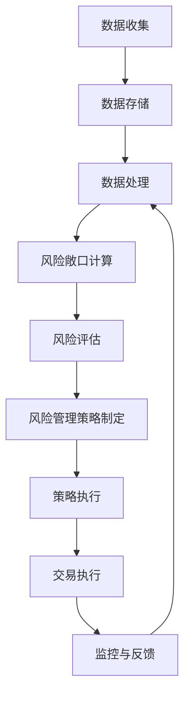

# 智能外汇风险敞口管理系统

> 关键词：智能外汇风险敞口管理系统、外汇风险、风险敞口、风险管理、人工智能、量化分析、金融科技

> 摘要：本文围绕智能外汇风险敞口管理系统展开深入探讨。首先介绍了该系统的背景，包括目的范围、预期读者等内容。详细阐述了核心概念与联系，通过文本示意图和 Mermaid 流程图清晰展示系统架构。深入讲解了核心算法原理及具体操作步骤，并用 Python 源代码进行详细阐述。给出了相关数学模型和公式，并举例说明。通过项目实战，展示了开发环境搭建、源代码实现及代码解读。分析了系统的实际应用场景，推荐了相关工具和资源，包括学习资源、开发工具框架以及论文著作等。最后总结了未来发展趋势与挑战，提供常见问题解答及扩展阅读和参考资料，旨在全面深入地剖析智能外汇风险敞口管理系统，为金融领域的风险管理提供有价值的参考。

## 1. 背景介绍 
### 1.1 目的和范围
在全球经济一体化的大背景下，外汇市场的波动日益频繁且复杂。企业和金融机构在跨国业务和投资活动中面临着巨大的外汇风险。智能外汇风险敞口管理系统的目的在于帮助企业和金融机构准确识别、度量和管理外汇风险敞口，降低因汇率波动带来的潜在损失，提高风险管理效率和决策的科学性。

该系统的范围涵盖了外汇交易数据的收集、处理和分析，外汇风险敞口的计算和评估，以及基于风险评估结果的风险管理策略制定和执行。它适用于各类涉及外汇业务的企业，如跨国贸易公司、跨国投资企业等，以及金融机构，如银行、证券公司、基金公司等。

### 1.2 预期读者
本文的预期读者包括金融领域的从业者，如外汇交易员、风险管理专家、投资经理等，他们可以从系统的原理、算法和实际应用中获取有用的信息，提升自身的风险管理能力。同时，也适合对金融科技和人工智能在金融领域应用感兴趣的研究人员和学生，帮助他们了解智能外汇风险敞口管理系统的前沿技术和发展趋势。此外，企业的财务管理人员和决策者也可以通过本文了解如何利用该系统进行外汇风险管理，保障企业的财务稳定。

### 1.3 文档结构概述
本文首先介绍智能外汇风险敞口管理系统的背景信息，包括目的、范围、预期读者和文档结构概述等。接着深入讲解核心概念与联系，通过文本示意图和 Mermaid 流程图展示系统的架构和工作原理。然后详细阐述核心算法原理和具体操作步骤，并用 Python 源代码进行说明。随后介绍相关的数学模型和公式，并举例说明其应用。通过项目实战部分，展示系统的开发环境搭建、源代码实现和代码解读。分析系统的实际应用场景，推荐相关的工具和资源。最后总结未来发展趋势与挑战，提供常见问题解答及扩展阅读和参考资料。

### 1.4 术语表
#### 1.4.1 核心术语定义
- **外汇风险敞口**：指企业或金融机构在外汇交易中因汇率波动而面临的潜在风险暴露程度，通常用货币金额或风险价值等指标来衡量。
- **风险管理**：是指通过识别、评估和应对风险，以最小化风险对企业或金融机构目标的影响的过程。
- **人工智能**：是指让计算机系统模拟人类智能的技术，包括机器学习、深度学习、自然语言处理等。
- **量化分析**：是指运用数学和统计方法对金融数据进行分析和建模，以支持决策和风险管理。

#### 1.4.2 相关概念解释
- **汇率波动**：是指两种货币之间的兑换比率随时间的变化而波动的现象，汇率波动是外汇风险的主要来源。
- **风险度量**：是指对风险的大小和可能性进行量化的过程，常用的风险度量指标包括风险价值（VaR）、条件风险价值（CVaR）等。
- **风险管理策略**：是指为了降低外汇风险敞口而采取的一系列措施，包括套期保值、风险分散、风险转移等。

#### 1.4.3 缩略词列表
- **VaR**：Value at Risk，风险价值
- **CVaR**：Conditional Value at Risk，条件风险价值
- **AI**：Artificial Intelligence，人工智能
- **ML**：Machine Learning，机器学习
- **DL**：Deep Learning，深度学习

## 2. 核心概念与联系 

### 核心概念原理
智能外汇风险敞口管理系统主要基于以下几个核心概念：
- **数据收集与整合**：系统需要收集各种外汇交易数据，包括交易时间、交易金额、交易货币对、汇率等信息，并将这些数据整合到一个统一的数据库中。这些数据是后续风险分析和管理的基础。
- **风险敞口计算**：根据收集到的外汇交易数据，系统使用特定的算法计算企业或金融机构的外汇风险敞口。风险敞口的计算方法有多种，常见的包括名义金额法、敏感性分析法、风险价值法等。
- **风险评估与预警**：系统对计算得到的风险敞口进行评估，判断风险的大小和可能性。同时，设置风险预警阈值，当风险敞口超过预警阈值时，系统及时发出预警信号，提醒相关人员采取措施。
- **风险管理策略制定**：根据风险评估结果，系统结合企业或金融机构的风险偏好和业务目标，制定相应的风险管理策略。风险管理策略可以包括套期保值、风险分散、风险转移等。
- **策略执行与监控**：系统将制定好的风险管理策略转化为具体的交易指令，并执行这些指令。同时，实时监控交易执行情况和风险敞口的变化，及时调整风险管理策略。

### 架构的文本示意图
智能外汇风险敞口管理系统的架构主要包括以下几个部分：
- **数据层**：负责收集、存储和管理外汇交易数据，包括历史数据和实时数据。数据层可以使用数据库管理系统（如 MySQL、Oracle 等）来实现。
- **处理层**：对数据层中的数据进行处理和分析，包括数据清洗、特征提取、风险敞口计算、风险评估等。处理层可以使用编程语言（如 Python、Java 等）和相关的数据分析库（如 Pandas、Numpy 等）来实现。
- **决策层**：根据处理层的分析结果，结合企业或金融机构的风险偏好和业务目标，制定风险管理策略。决策层可以使用人工智能算法（如机器学习、深度学习等）来实现。
- **执行层**：将决策层制定的风险管理策略转化为具体的交易指令，并执行这些指令。执行层可以与外汇交易平台进行接口，实现自动化交易。
- **监控层**：实时监控系统的运行情况和风险敞口的变化，及时发现异常情况并发出预警信号。监控层可以使用日志记录、可视化工具等技术来实现。

### Mermaid 流程图


## 3. 核心算法原理 & 具体操作步骤 

### 风险敞口计算算法原理
在智能外汇风险敞口管理系统中，常用的风险敞口计算方法是风险价值（VaR）法。VaR 是指在一定的置信水平下，某一金融资产或投资组合在未来特定时期内可能遭受的最大损失。

VaR 的计算方法有多种，常见的包括历史模拟法、方差 - 协方差法和蒙特卡罗模拟法。下面以历史模拟法为例，介绍 VaR 的计算原理和具体操作步骤。

#### 历史模拟法原理
历史模拟法是一种非参数方法，它基于历史数据来估计未来的风险。具体来说，历史模拟法将历史数据按照时间顺序排列，然后选取一定数量的历史数据作为样本，计算这些样本的收益率。根据收益率的分布情况，确定在一定置信水平下的最大损失，即为 VaR。

#### 具体操作步骤
1. **数据收集**：收集外汇交易的历史数据，包括交易时间、交易金额、交易货币对、汇率等信息。
2. **数据处理**：对收集到的历史数据进行清洗和预处理，去除异常值和缺失值。
3. **收益率计算**：根据历史数据计算外汇交易的收益率。收益率的计算公式为：
   $$R_{t}=\frac{P_{t}-P_{t-1}}{P_{t-1}}$$
   其中，$R_{t}$ 表示第 $t$ 期的收益率，$P_{t}$ 表示第 $t$ 期的汇率，$P_{t-1}$ 表示第 $t - 1$ 期的汇率。
4. **排序**：将计算得到的收益率按照从小到大的顺序排列。
5. **确定 VaR**：根据给定的置信水平，确定对应的分位数。例如，在 95% 的置信水平下，VaR 就是收益率序列中第 5% 分位数对应的收益率乘以投资组合的价值。

### Python 源代码实现
```python
import pandas as pd
import numpy as np

# 假设我们有一个包含汇率数据的 DataFrame
# 这里简单模拟一些数据
data = {
    'date': pd.date_range(start='2020-01-01', periods=100),
    'exchange_rate': np.random.randn(100) + 1.0
}
df = pd.DataFrame(data)

# 计算收益率
df['return'] = df['exchange_rate'].pct_change()
df = df.dropna()  # 去除缺失值

# 设定置信水平
confidence_level = 0.95

# 排序收益率
sorted_returns = np.sort(df['return'])

# 计算 VaR
var_index = int((1 - confidence_level) * len(sorted_returns))
var = sorted_returns[var_index]

print(f"在 {confidence_level * 100}% 的置信水平下，VaR 为: {var}")
```

## 4. 数学模型和公式 & 详细讲解 & 举例说明 

### 风险价值（VaR）公式
风险价值（VaR）的计算公式可以表示为：
$$VaR = -z_{\alpha}\sigma\sqrt{\Delta t}V$$
其中：
- $z_{\alpha}$ 是标准正态分布的分位数，对应于给定的置信水平 $\alpha$。例如，在 95% 的置信水平下，$z_{\alpha}=1.645$；在 99% 的置信水平下，$z_{\alpha}=2.326$。
- $\sigma$ 是投资组合的收益率标准差，反映了投资组合的风险程度。
- $\Delta t$ 是时间间隔，通常以年为单位。
- $V$ 是投资组合的价值。

### 详细讲解
- **$z_{\alpha}$ 的含义**：$z_{\alpha}$ 是标准正态分布的分位数，它表示在给定的置信水平下，标准正态分布中左侧尾部的面积。例如，在 95% 的置信水平下，$z_{\alpha}=1.645$ 表示在标准正态分布中，左侧尾部面积为 5% 对应的分位数。
- **$\sigma$ 的计算**：$\sigma$ 是投资组合的收益率标准差，可以通过历史数据计算得到。具体来说，可以使用样本标准差的计算公式：
  $$\sigma=\sqrt{\frac{1}{n - 1}\sum_{i = 1}^{n}(R_{i}-\bar{R})^{2}}$$
  其中，$R_{i}$ 表示第 $i$ 期的收益率，$\bar{R}$ 表示收益率的均值，$n$ 表示样本数量。
- **$\Delta t$ 的选择**：$\Delta t$ 表示时间间隔，通常以年为单位。例如，如果我们要计算一天的 VaR，则 $\Delta t=\frac{1}{252}$（假设一年有 252 个交易日）；如果要计算一个月的 VaR，则 $\Delta t=\frac{1}{12}$。
- **$V$ 的确定**：$V$ 是投资组合的价值，根据实际情况确定。

### 举例说明
假设一个投资组合的价值为 $V = 1000000$ 美元，收益率的标准差为 $\sigma = 0.02$，时间间隔为 $\Delta t=\frac{1}{252}$（一天），置信水平为 95%。

首先，查找标准正态分布表，得到 $z_{\alpha}=1.645$。

然后，根据 VaR 公式计算：
$$VaR=-z_{\alpha}\sigma\sqrt{\Delta t}V=-1.645\times0.02\times\sqrt{\frac{1}{252}}\times1000000\approx - 2077$$

这意味着在 95% 的置信水平下，该投资组合在一天内可能遭受的最大损失约为 2077 美元。

## 5. 项目实战：代码实际案例和详细解释说明 

### 5.1  开发环境搭建
#### 操作系统
建议使用 Linux 或 macOS 操作系统，因为它们对 Python 开发环境的支持较好。如果使用 Windows 操作系统，也可以进行开发，但可能会遇到一些兼容性问题。

#### Python 安装
确保已经安装了 Python 3.6 或更高版本。可以从 Python 官方网站（https://www.python.org/downloads/） 下载并安装。

#### 虚拟环境创建
为了避免不同项目之间的依赖冲突，建议使用虚拟环境。可以使用 `venv` 或 `conda` 来创建虚拟环境。

使用 `venv` 创建虚拟环境的命令如下：
```bash
python -m venv myenv
source myenv/bin/activate  # 在 Linux 或 macOS 上
myenv\Scripts\activate  # 在 Windows 上
```

#### 依赖库安装
安装项目所需的依赖库，包括 `pandas`、`numpy`、`matplotlib` 等。可以使用 `pip` 来安装：
```bash
pip install pandas numpy matplotlib
```

### 5.2  源代码详细实现和代码解读
#### 数据收集与处理
```python
import pandas as pd
import numpy as np

# 模拟数据收集
data = {
    'date': pd.date_range(start='2020-01-01', periods=100),
    'currency_pair': ['USD/EUR'] * 100,
    'exchange_rate': np.random.randn(100) + 1.0
}
df = pd.DataFrame(data)

# 数据处理：计算收益率
df['return'] = df['exchange_rate'].pct_change()
df = df.dropna()  # 去除缺失值
```
代码解读：
- 首先，使用 `pandas` 库创建一个包含日期、货币对和汇率的 DataFrame。
- 然后，使用 `pct_change()` 方法计算汇率的收益率。
- 最后，使用 `dropna()` 方法去除包含缺失值的行。

#### 风险敞口计算
```python
# 设定置信水平
confidence_level = 0.95

# 排序收益率
sorted_returns = np.sort(df['return'])

# 计算 VaR
var_index = int((1 - confidence_level) * len(sorted_returns))
var = sorted_returns[var_index]

print(f"在 {confidence_level * 100}% 的置信水平下，VaR 为: {var}")
```
代码解读：
- 首先，设定置信水平为 95%。
- 然后，使用 `np.sort()` 方法对收益率进行排序。
- 接着，根据置信水平计算对应的分位数索引。
- 最后，根据索引获取对应的收益率作为 VaR。

#### 可视化
```python
import matplotlib.pyplot as plt

# 绘制收益率直方图
plt.hist(df['return'], bins=30, edgecolor='black')
plt.axvline(x=var, color='r', linestyle='--', label=f'VaR at {confidence_level * 100}%')
plt.xlabel('Return')
plt.ylabel('Frequency')
plt.title('Return Distribution with VaR')
plt.legend()
plt.show()
```
代码解读：
- 首先，使用 `matplotlib` 库绘制收益率的直方图。
- 然后，使用 `axvline()` 方法绘制 VaR 线。
- 最后，设置图表的标题、坐标轴标签和图例，并显示图表。

### 5.3  代码解读与分析
通过上述代码，我们实现了一个简单的智能外汇风险敞口管理系统的核心功能，包括数据收集、处理、风险敞口计算和可视化。

- **数据收集与处理**：使用 `pandas` 库可以方便地处理和分析金融数据。通过计算收益率，我们将汇率数据转化为更易于分析的形式。
- **风险敞口计算**：使用历史模拟法计算 VaR，该方法简单直观，不需要对收益率的分布进行假设。
- **可视化**：使用 `matplotlib` 库绘制收益率的直方图和 VaR 线，可以直观地展示风险敞口的情况。

需要注意的是，上述代码只是一个简单的示例，实际的智能外汇风险敞口管理系统可能需要更复杂的算法和更完善的功能，如实时数据更新、多货币对处理、风险管理策略优化等。

## 6. 实际应用场景 
### 跨国贸易企业
跨国贸易企业在进出口业务中通常会涉及多种货币的交易，面临着汇率波动的风险。智能外汇风险敞口管理系统可以帮助企业准确计算外汇风险敞口，及时发现潜在的风险，并制定相应的风险管理策略。例如，企业可以通过系统监测不同货币对的汇率变化，当风险敞口超过