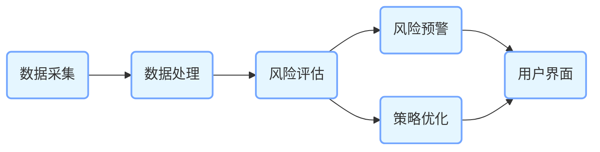

# 智能外汇风险管理系统

> 关键词：智能外汇风险管理系统、外汇风险、量化分析、机器学习、实时监控、风险预警、策略优化

> 摘要：本文围绕智能外汇风险管理系统展开全面深入的探讨。首先介绍了该系统产生的背景、目的、适用读者以及文档结构等内容。接着阐述了系统所涉及的核心概念及其联系，通过文本示意图和 Mermaid 流程图直观呈现。详细讲解了系统的核心算法原理，结合 Python 源代码进行具体操作步骤的说明。深入剖析了相关数学模型和公式，并举例进行说明。通过项目实战展示了系统的开发环境搭建、源代码实现与解读。分析了系统在实际中的应用场景，推荐了学习该系统相关知识的工具和资源，包括书籍、在线课程、技术博客、开发工具框架以及相关论文著作等。最后总结了智能外汇风险管理系统未来的发展趋势与面临的挑战，并提供常见问题的解答和扩展阅读的参考资料。

## 1. 背景介绍 
### 1.1 目的和范围
在全球经济一体化的大背景下，外汇市场的交易规模日益庞大，外汇风险也随之增加。智能外汇风险管理系统的目的在于帮助企业、金融机构以及个人投资者有效识别、评估和控制外汇风险，降低因汇率波动带来的损失，提高外汇资产的安全性和收益性。

本系统的范围涵盖了外汇市场的多种交易场景，包括即期外汇交易、远期外汇交易、外汇期权交易等。它能够处理不同货币对之间的汇率数据，对各种外汇风险进行量化分析和管理，为用户提供实时的风险预警和决策支持。

### 1.2 预期读者
本系统的预期读者包括金融机构的风险管理部门人员，如银行的外汇交易风险管理团队、投资基金的风险分析师等；企业的财务管理人员，特别是那些有涉外业务、面临外汇风险的企业；个人投资者，尤其是参与外汇交易的投资者。此外，对金融科技、风险管理领域感兴趣的研究人员和学生也可以从本文中获取相关知识和技术。

### 1.3 文档结构概述
本文将按照以下结构进行阐述：首先介绍智能外汇风险管理系统的背景信息，包括目的、预期读者和文档结构等。接着讲解系统的核心概念与联系，通过文本示意图和 Mermaid 流程图展示系统的原理和架构。然后详细介绍核心算法原理和具体操作步骤，结合 Python 源代码进行说明。随后分析系统所涉及的数学模型和公式，并举例说明。通过项目实战展示系统的开发过程和代码实现。介绍系统的实际应用场景。推荐相关的学习工具和资源，包括书籍、在线课程、技术博客、开发工具框架以及相关论文著作等。最后总结系统的未来发展趋势与挑战，提供常见问题的解答和扩展阅读的参考资料。

### 1.4 术语表
#### 1.4.1 核心术语定义
- **外汇风险**：指经济主体在持有或运用外汇的经济活动中，因汇率变动而蒙受损失的一种可能性。
- **即期外汇交易**：又称现汇交易，是指在外汇买卖成交后，原则上在两个工作日内办理交割的外汇交易。
- **远期外汇交易**：是指交易双方在成交后并不立即办理交割，而是事先约定币种、金额、汇率、交割时间等交易条件，到期才进行实际交割的外汇交易。
- **外汇期权交易**：是指交易双方在规定的期间按商定的条件和一定的汇率，就将来是否购买或出售某种外汇的选择权进行买卖的交易。
- **风险敞口**：指未加保护的风险，即因债务人违约行为导致的可能承受风险的信贷余额。

#### 1.4.2 相关概念解释
- **汇率波动**：汇率在不同时间点上的变化，是外汇风险产生的直接原因。汇率波动受到多种因素的影响，如宏观经济数据、政治局势、货币政策等。
- **风险管理策略**：为了降低外汇风险而采取的一系列措施和方法，包括套期保值、风险分散、风险规避等。
- **量化分析**：运用数学模型和统计方法对数据进行分析和处理，以评估外汇风险的大小和可能性。

#### 1.4.3 缩略词列表
- **VaR**：Value at Risk，风险价值，是一种常用的风险度量指标，用于衡量在一定的置信水平下，某一金融资产或投资组合在未来特定的一段时间内可能遭受的最大损失。
- **CVaR**：Conditional Value at Risk，条件风险价值，是在 VaR 基础上发展起来的一种风险度量指标，它衡量的是在损失超过 VaR 的条件下的平均损失。

## 2. 核心概念与联系 
### 核心概念原理
智能外汇风险管理系统的核心原理是通过收集、整理和分析外汇市场的相关数据，运用量化分析方法和机器学习算法，对各种外汇风险进行识别、评估和控制。系统主要包括数据采集模块、数据处理模块、风险评估模块、风险预警模块和策略优化模块。

数据采集模块负责从各种数据源（如外汇交易平台、金融资讯网站等）获取外汇市场的实时数据和历史数据，包括汇率数据、利率数据、宏观经济数据等。数据处理模块对采集到的数据进行清洗、转换和存储，以便后续分析使用。风险评估模块运用各种风险度量指标（如 VaR、CVaR 等）对不同外汇交易场景下的风险进行量化评估。风险预警模块根据设定的风险阈值，对可能出现的风险进行实时监测和预警。策略优化模块根据风险评估结果和用户的风险偏好，制定和优化风险管理策略。

### 架构的文本示意图
智能外汇风险管理系统的架构可以分为以下几个层次：
1. **数据层**：包括各种数据源，如外汇交易平台、金融资讯网站、数据库等，负责提供系统所需的原始数据。
2. **处理层**：包括数据采集模块、数据处理模块，对原始数据进行采集、清洗、转换和存储。
3. **分析层**：包括风险评估模块、风险预警模块，运用量化分析方法和机器学习算法对数据进行分析，评估风险并进行预警。
4. **决策层**：包括策略优化模块，根据风险评估结果和用户的风险偏好，制定和优化风险管理策略。
5. **展示层**：包括用户界面，将系统的分析结果和决策建议以直观的方式展示给用户。

### Mermaid 流程图


## 3. 核心算法原理 & 具体操作步骤 
### 核心算法原理
智能外汇风险管理系统中常用的核心算法包括风险度量算法（如 VaR、CVaR 计算算法）和机器学习算法（如回归分析、分类算法等）。

#### VaR 计算算法
VaR 是一种基于统计分析方法的风险度量指标，其基本思想是在一定的置信水平下，估计某一金融资产或投资组合在未来特定的一段时间内可能遭受的最大损失。计算 VaR 的方法主要有历史模拟法、方差 - 协方差法和蒙特卡罗模拟法。

- **历史模拟法**：通过历史数据来模拟未来的风险状况。具体步骤如下：
    1. 收集历史汇率数据。
    2. 计算历史汇率的收益率。
    3. 按照收益率从小到大进行排序。
    4. 根据置信水平确定对应的分位数，该分位数对应的收益率即为 VaR。

- **方差 - 协方差法**：假设汇率收益率服从正态分布，通过计算收益率的均值和方差来估计 VaR。具体步骤如下：
    1. 计算汇率收益率的均值 $\mu$ 和方差 $\sigma^2$。
    2. 根据置信水平 $c$ 确定对应的标准正态分布分位数 $z_c$。
    3. 计算 VaR：$VaR = z_c \times \sigma \times \sqrt{T}$，其中 $T$ 为时间间隔。

- **蒙特卡罗模拟法**：通过随机模拟来生成大量的可能的汇率路径，然后根据这些路径计算投资组合的价值变化，从而估计 VaR。具体步骤如下：
    1. 确定汇率收益率的概率分布模型。
    2. 利用随机数生成器生成大量的随机样本。
    3. 根据样本计算投资组合的价值变化。
    4. 按照价值变化从小到大进行排序，根据置信水平确定对应的分位数，该分位数对应的价值变化即为 VaR。

#### 机器学习算法
机器学习算法可以用于外汇风险的预测和分类。例如，回归分析可以用于预测汇率的变化趋势，分类算法可以用于将外汇交易分为高风险、中风险和低风险三类。

### 具体操作步骤及 Python 源代码
以下是使用 Python 实现历史模拟法计算 VaR 的示例代码：
```python
import numpy as np
import pandas as pd

# 生成示例数据
np.random.seed(0)
data = np.random.randn(1000) + 0.01  # 模拟汇率收益率数据

# 计算 VaR
def historical_var(data, confidence_level=0.95):
    sorted_data = np.sort(data)
    index = int((1 - confidence_level) * len(sorted_data))
    var = -sorted_data[index]
    return var

# 调用函数计算 VaR
var = historical_var(data)
print(f"VaR at 95% confidence level: {var}")
```
代码解释：
1. 首先，使用 `numpy` 生成 1000 个模拟的汇率收益率数据。
2. 定义 `historical_var` 函数，该函数接受收益率数据和置信水平作为输入。
3. 在函数内部，对收益率数据进行排序。
4. 根据置信水平计算对应的分位数索引。
5. 取该分位数对应的收益率的相反数作为 VaR。
6. 最后，调用函数计算 VaR 并打印结果。

## 4. 数学模型和公式 & 详细讲解 & 举例说明 
### VaR 数学模型和公式
#### 历史模拟法
历史模拟法的基本公式为：
设 $r_1, r_2, \cdots, r_n$ 为历史汇率收益率数据，将其从小到大排序得到 $r_{(1)}, r_{(2)}, \cdots, r_{(n)}$。对于置信水平 $c$，$VaR$ 的计算公式为：
$$VaR = -r_{(k)}$$
其中 $k = \lfloor (1 - c)n \rfloor$，$\lfloor \cdot \rfloor$ 表示向下取整。

**举例说明**：假设我们有 1000 个历史汇率收益率数据，置信水平为 95%。则 $k = \lfloor (1 - 0.95) \times 1000 \rfloor = 50$，取第 50 小的收益率的相反数作为 VaR。

#### 方差 - 协方差法
假设汇率收益率 $r$ 服从正态分布 $N(\mu, \sigma^2)$，对于置信水平 $c$，对应的标准正态分布分位数为 $z_c$（可以通过查标准正态分布表得到）。则 $VaR$ 的计算公式为：
$$VaR = z_c \times \sigma \times \sqrt{T}$$
其中 $T$ 为时间间隔。

**举例说明**：假设某外汇资产的收益率均值 $\mu = 0.01$，标准差 $\sigma = 0.05$，时间间隔 $T = 1$ 天，置信水平为 95%，对应的标准正态分布分位数 $z_{0.95} = 1.645$。则 $VaR = 1.645 \times 0.05 \times \sqrt{1} = 0.08225$。

#### 蒙特卡罗模拟法
蒙特卡罗模拟法通过随机模拟生成大量的可能的汇率路径，设 $V_0$ 为投资组合的初始价值，$V_i$ 为第 $i$ 条路径下投资组合的期末价值，$n$ 为模拟路径的数量。对于置信水平 $c$，$VaR$ 的计算公式为：
$$VaR = -V_{(k)}$$
其中 $V_{(k)}$ 是将 $V_1 - V_0, V_2 - V_0, \cdots, V_n - V_0$ 从小到大排序后第 $k$ 个值，$k = \lfloor (1 - c)n \rfloor$。

### CVaR 数学模型和公式
CVaR 是在 VaR 基础上发展起来的一种风险度量指标，它衡量的是在损失超过 VaR 的条件下的平均损失。对于置信水平 $c$，$CVaR$ 的计算公式为：
$$CVaR = \frac{1}{1 - c} \int_{VaR}^{\infty} f(x) x dx$$
其中 $f(x)$ 为收益率的概率密度函数。

在实际计算中，通常使用离散近似的方法：
设 $r_1, r_2, \cdots, r_n$ 为历史汇率收益率数据，将其从小到大排序得到 $r_{(1)}, r_{(2)}, \cdots, r_{(n)}$。对于置信水平 $c$，$k = \lfloor (1 - c)n \rfloor$，$CVaR$ 的计算公式为：
$$CVaR = -\frac{1}{(1 - c)n} \sum_{i = k}^{n} r_{(i)}$$

**举例说明**：假设我们有 1000 个历史汇率收益率数据，置信水平为 95%。则 $k = \lfloor (1 - 0.95) \times 1000 \rfloor = 50$，$CVaR$ 为第 50 到第 1000 个收益率的平均值的相反数。

## 5. 项目实战：代码实际案例和详细解释说明 
### 5.1  开发环境搭建
#### 操作系统
可以选择 Windows、Linux 或 macOS 操作系统，建议使用 Linux 或 macOS，因为它们在开发和部署方面具有更好的稳定性和兼容性。

#### 编程语言和开发工具
- **Python**：作为主要的编程语言，建议使用 Python 3.7 及以上版本。
- **Anaconda**：一个开源的 Python 发行版本，包含了许多常用的科学计算和数据分析库，如 `numpy`、`pandas`、`matplotlib` 等。可以从 Anaconda 官方网站下载并安装。
- **Jupyter Notebook**：一个交互式的开发环境，方便进行代码的编写、调试和展示。安装 Anaconda 后，Jupyter Notebook 会自动安装。

#### 数据库
可以选择 MySQL、PostgreSQL 等关系型数据库，也可以选择 MongoDB 等非关系型数据库，用于存储外汇市场的历史数据和系统的运行数据。

### 5.2  源代码详细实现和代码解读
以下是一个简单的智能外汇风险管理系统的源代码实现示例，包括数据采集、数据处理、风险评估和风险预警模块。

```python
import pandas as pd
import numpy as np
import yfinance as yf  # 用于获取外汇数据
from scipy.stats import norm

# 数据采集模块
def collect_data(currency_pair, start_date, end_date):
    data = yf.download(currency_pair, start=start_date, end=end_date)
    return data['Close']

# 数据处理模块
def process_data(data):
    returns = data.pct_change().dropna()
    return returns

# 风险评估模块（使用方差 - 协方差法计算 VaR）
def calculate_var(returns, confidence_level=0.95, time_horizon=1):
    mean_return = returns.mean()
    std_return = returns.std()
    z_score = norm.ppf(1 - confidence_level)
    var = - (mean_return * time_horizon + z_score * std_return * np.sqrt(time_horizon))
    return var

# 风险预警模块
def risk_alert(var, threshold):
    if var > threshold:
        print("Warning: High foreign exchange risk!")
    else:
        print("Low foreign exchange risk.")

# 主函数
def main():
    currency_pair = 'EURUSD=X'  # 欧元兑美元汇率
    start_date = '2020-01-01'
    end_date = '2023-12-31'
    threshold = 0.02  # 风险阈值

    # 数据采集
    data = collect_data(currency_pair, start_date, end_date)

    # 数据处理
    returns = process_data(data)

    # 风险评估
    var = calculate_var(returns)

    # 风险预警
    risk_alert(var, threshold)

if __name__ == "__main__":
    main()
```
代码解读：
1. **数据采集模块**：`collect_data` 函数使用 `yfinance` 库从雅虎财经获取指定货币对在指定时间范围内的收盘价数据。
2. **数据处理模块**：`process_data` 函数计算收盘价的收益率，并去除缺失值。
3. **风险评估模块**：`calculate_var` 函数使用方差 - 协方差法计算 VaR。首先计算收益率的均值和标准差，然后根据置信水平确定对应的标准正态分布分位数，最后计算 VaR。
4. **风险预警模块**：`risk_alert` 函数根据计算得到的 VaR 和设定的风险阈值进行风险预警。如果 VaR 超过阈值，则输出高风险警告；否则输出低风险提示。
5. **主函数**：`main` 函数调用上述模块，完成数据采集、数据处理、风险评估和风险预警的整个流程。

### 5.3  代码解读与分析
- **优点**：该代码实现了一个简单的智能外汇风险管理系统的基本功能，代码结构清晰，易于理解和扩展。使用 `yfinance` 库可以方便地获取外汇市场数据，使用方差 - 协方差法计算 VaR 简单高效。
- **缺点**：该代码只是一个简单的示例，存在一些局限性。例如，只考虑了单个货币对的风险，没有考虑多个货币对之间的相关性；使用方差 - 协方差法计算 VaR 假设收益率服从正态分布，可能与实际情况不符；没有考虑到市场的极端情况等。

在实际应用中，可以对代码进行进一步的优化和扩展，例如增加更多的风险度量指标（如 CVaR），使用机器学习算法进行风险预测，考虑多个货币对之间的相关性等。

## 6. 实际应用场景 
### 金融机构
- **银行**：银行在外汇交易业务中面临着汇率波动的风险。智能外汇风险管理系统可以帮助银行实时监测外汇头寸的风险状况，及时调整交易策略，降低风险。例如，银行可以根据系统的风险预警信息，对高风险的外汇头寸进行套期保值操作，减少因汇率波动带来的损失。
- **投资基金**：投资基金通常会投资于不同国家和地区的资产，面临着外汇风险。智能外汇风险管理系统可以帮助投资基金评估外汇风险对投资组合的影响，优化投资组合的配置，提高投资收益。例如，投资基金可以根据系统的风险评估结果，调整不同货币资产的比例，降低外汇风险暴露。

### 企业
- **跨国公司**：跨国公司在全球范围内开展业务，涉及大量的外汇交易。智能外汇风险管理系统可以帮助跨国公司识别和管理外汇风险，降低因汇率波动对公司财务状况的影响。例如，跨国公司可以根据系统的风险预警信息，提前制定外汇风险管理策略，如锁定汇率、调整结算货币等。
- **出口企业**：出口企业在出口商品时通常会面临外汇收款的风险。智能外汇风险管理系统可以帮助出口企业评估外汇风险，选择合适的结算方式和货币，降低因汇率波动带来的损失。例如，出口企业可以根据系统的风险评估结果，选择使用远期外汇合约等金融工具进行套期保值。

### 个人投资者
个人投资者在参与外汇交易时也面临着外汇风险。智能外汇风险管理系统可以帮助个人投资者了解自己的外汇投资风险状况，制定合理的投资策略。例如，个人投资者可以根据系统的风险预警信息，及时调整外汇投资组合，避免过度暴露于高风险的货币对。

## 7. 工具和资源推荐
### 7.1 学习资源推荐
#### 7.1.1 书籍推荐
- 《金融风险管理师（FRM）考试教材》：全面介绍了金融风险管理的理论和实践，包括外汇风险管理的相关内容。
- 《期权、期货及其他衍生品》：详细讲解了期权、期货等金融衍生品的定价和风险管理，对外汇风险管理有重要的参考价值。
- 《Python 金融大数据分析》：介绍了如何使用 Python 进行金融数据的分析和处理，包括外汇数据的处理和风险分析。

#### 7.1.2 在线课程
- Coursera 上的“Financial Risk Management”：由知名教授授课，系统介绍了金融风险管理的理论和方法，包括外汇风险管理。
- edX 上的“Python for Finance: Investment Fundamentals and Data Analytics”：讲解了如何使用 Python 进行金融数据分析和投资决策，对外汇风险管理有一定的帮助。

#### 7.1.3 技术博客和网站
- 量化投资与机器学习论坛：提供了大量的量化投资和风险管理的技术文章和案例，包括外汇风险管理的相关内容。
- 汇通网：专注于外汇市场的资讯和分析，提供实时的外汇行情和市场动态，有助于了解外汇市场的情况。

### 7.2 开发工具框架推荐
#### 7.2.1 IDE和编辑器
- PyCharm：一款专业的 Python 集成开发环境，提供了丰富的代码编辑、调试和分析功能，适合开发智能外汇风险管理系统。
- Visual Studio Code：一款轻量级的代码编辑器，支持多种编程语言和插件，具有良好的扩展性，也可以用于 Python 开发。

#### 7.2.2 调试和性能分析工具
- Py-Spy：一个用于 Python 程序性能分析的工具，可以帮助开发者找出程序中的性能瓶颈。
- pdb：Python 内置的调试器，可以帮助开发者调试程序中的错误。

#### 7.2.3 相关框架和库
- `numpy`：一个用于科学计算的 Python 库，提供了高效的数组操作和数学函数，是智能外汇风险管理系统中数据处理和分析的基础库。
- `pandas`：一个用于数据处理和分析的 Python 库，提供了灵活的数据结构和数据操作方法，方便处理外汇市场的历史数据。
- `scikit-learn`：一个用于机器学习的 Python 库，提供了丰富的机器学习算法和工具，可用于外汇风险的预测和分类。

### 7.3 相关论文著作推荐
#### 7.3.1 经典论文
- Jorion, P. (1996). Value at Risk: The New Benchmark for Managing Financial Risk. 该论文系统介绍了风险价值（VaR）的概念和计算方法，是金融风险管理领域的经典文献。
- Engle, R. F. (1982). Autoregressive conditional heteroscedasticity with estimates of the variance of United Kingdom inflation. 该论文提出了自回归条件异方差（ARCH）模型，为金融时间序列的波动性建模提供了重要的方法。

#### 7.3.2 最新研究成果
- 关注国际顶级金融学术期刊，如 the Journal of Finance、Review of Financial Studies 等，这些期刊上发表了许多关于外汇风险管理的最新研究成果。

#### 7.3.3 应用案例分析
- 可以参考一些金融机构和企业的实际应用案例，了解智能外汇风险管理系统在实际中的应用效果和经验教训。例如，一些银行和投资基金的年度报告中可能会有关于外汇风险管理的相关内容。

## 8. 总结：未来发展趋势与挑战
### 未来发展趋势
- **智能化和自动化**：随着人工智能和机器学习技术的不断发展，智能外汇风险管理系统将更加智能化和自动化。系统可以自动识别和分析外汇市场的各种风险因素，实时调整风险管理策略，提高风险管理的效率和准确性。
- **大数据和云计算**：大数据和云计算技术的应用将为智能外汇风险管理系统提供更强大的数据处理和分析能力。系统可以收集和分析更多的外汇市场数据，包括社交媒体数据、新闻资讯等非结构化数据，提高风险预测的准确性。
- **跨市场和跨领域风险管理**：未来的智能外汇风险管理系统将不仅仅局限于外汇市场，还将考虑与其他金融市场（如股票市场、债券市场等）的相关性，实现跨市场和跨领域的风险管理。

### 挑战
- **数据质量和安全**：智能外汇风险管理系统依赖于大量的外汇市场数据，数据的质量和安全至关重要。数据的不准确、不完整或泄露可能会导致系统的风险评估和决策出现偏差，甚至造成重大损失。
- **模型的有效性和适应性**：外汇市场是一个复杂多变的市场，现有的风险度量模型和机器学习算法可能无法完全准确地描述市场的风险特征。因此，需要不断改进和优化模型，提高模型的有效性和适应性。
- **监管和合规要求**：金融行业受到严格的监管，智能外汇风险管理系统需要满足各种监管和合规要求。例如，系统需要遵循数据保护法规、风险披露要求等，这增加了系统开发和运营的难度。

## 9. 附录：常见问题与解答
### 1. 智能外汇风险管理系统适用于所有类型的外汇交易吗？
智能外汇风险管理系统适用于大多数类型的外汇交易，包括即期外汇交易、远期外汇交易、外汇期权交易等。但是，不同类型的外汇交易具有不同的风险特征，系统需要根据具体情况进行相应的调整和优化。

### 2. 如何选择合适的风险度量指标？
选择合适的风险度量指标需要考虑多个因素，如风险的性质、数据的可用性、模型的复杂度等。常见的风险度量指标包括 VaR、CVaR 等。VaR 简单直观，易于理解和计算，但它只考虑了损失的最大可能值，没有考虑损失超过 VaR 的情况。CVaR 则在 VaR 的基础上，考虑了损失超过 VaR 的条件下的平均损失，更能反映极端风险。在实际应用中，可以根据具体情况选择合适的风险度量指标，或者同时使用多个指标进行综合评估。

### 3. 智能外汇风险管理系统的准确性如何保证？
智能外汇风险管理系统的准确性受到多个因素的影响，如数据质量、模型的有效性、算法的合理性等。为了保证系统的准确性，需要采取以下措施：
- 确保数据的准确性和完整性，对数据进行严格的清洗和验证。
- 选择合适的风险度量模型和机器学习算法，并进行充分的测试和验证。
- 不断更新和优化模型，以适应外汇市场的变化。
- 定期对系统的性能进行评估和监控，及时发现和解决问题。

### 4. 智能外汇风险管理系统与人工风险管理相比有哪些优势？
智能外汇风险管理系统与人工风险管理相比，具有以下优势：
- **效率高**：系统可以实时收集和分析大量的外汇市场数据，快速做出风险评估和决策，大大提高了风险管理的效率。
- **准确性高**：系统可以运用量化分析方法和机器学习算法，减少人为因素的干扰，提高风险评估的准确性。
- **客观性强**：系统基于数据和模型进行分析和决策，不受主观情绪和偏见的影响，具有更强的客观性。
- **可重复性强**：系统的分析和决策过程是基于固定的算法和模型，具有很强的可重复性，可以保证风险管理的一致性。

## 10. 扩展阅读 & 参考资料
### 扩展阅读
- 《金融科技前沿：技术驱动的金融创新》：介绍了金融科技的最新发展趋势和应用案例，包括智能外汇风险管理系统等相关内容。
- 《人工智能在金融领域的应用》：探讨了人工智能技术在金融领域的应用，如风险评估、投资决策等，对外汇风险管理有一定的启发。

### 参考资料
- 各外汇交易平台的官方文档和技术资料。
- 相关金融机构和企业的研究报告和案例分析。
- 国际金融组织（如国际货币基金组织、世界银行等）发布的统计数据和研究报告。

作者：AI天才研究院/AI Genius Institute & 禅与计算机程序设计艺术 /Zen And The Art of Computer Programming