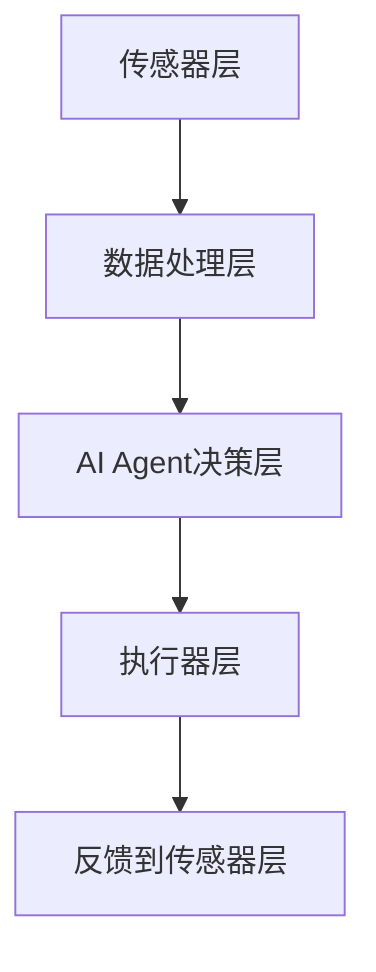

# 智能婴儿摇篮：AI Agent的安抚模式优化

> 关键词：智能婴儿摇篮、AI Agent、安抚模式、优化算法、机器学习

> 摘要：本文聚焦于智能婴儿摇篮中AI Agent安抚模式的优化。首先介绍了智能婴儿摇篮的背景信息，包括目的范围、预期读者等。接着阐述了核心概念与联系，如AI Agent在婴儿摇篮中的工作原理及架构。详细讲解了核心算法原理及具体操作步骤，通过Python代码进行示例。分析了相关数学模型和公式，并举例说明。通过项目实战给出代码实际案例及详细解释。探讨了智能婴儿摇篮安抚模式的实际应用场景，推荐了学习资源、开发工具框架以及相关论文著作。最后总结了未来发展趋势与挑战，提供常见问题解答和扩展阅读参考资料，旨在为智能婴儿摇篮安抚模式的进一步发展提供全面的技术指导。

## 1. 背景介绍 
### 1.1 目的和范围
智能婴儿摇篮的出现旨在为婴儿提供更加舒适、安全和智能的睡眠环境，减轻家长照顾婴儿的负担。而AI Agent的安抚模式优化是智能婴儿摇篮发展的关键环节。本文章的目的在于深入探讨如何通过优化AI Agent的安抚模式，提高智能婴儿摇篮对婴儿的安抚效果。范围涵盖了从AI Agent的核心算法原理到实际项目应用的各个方面，包括开发环境搭建、代码实现、实际应用场景分析等。

### 1.2 预期读者
本文预期读者包括从事智能硬件开发的工程师、对人工智能在智能家居领域应用感兴趣的技术爱好者、相关专业的研究人员以及关注智能婴儿产品发展的家长群体。对于工程师和研究人员，本文提供了详细的技术实现细节和优化思路；对于技术爱好者，能帮助他们了解智能婴儿摇篮背后的技术原理；对于家长群体，可让他们了解智能婴儿摇篮的优势和发展方向。

### 1.3 文档结构概述
本文将按照以下结构展开：首先介绍相关背景信息，让读者了解文章的目的和适用对象。接着阐述核心概念与联系，使读者对AI Agent在智能婴儿摇篮中的工作原理有清晰的认识。然后详细讲解核心算法原理和具体操作步骤，并给出Python代码示例。分析相关数学模型和公式，通过举例加深理解。进行项目实战，包括开发环境搭建、源代码实现和代码解读。探讨实际应用场景，为读者展示智能婴儿摇篮安抚模式的应用价值。推荐学习资源、开发工具框架和相关论文著作，帮助读者进一步深入学习。最后总结未来发展趋势与挑战，提供常见问题解答和扩展阅读参考资料。

### 1.4 术语表
#### 1.4.1 核心术语定义
- **智能婴儿摇篮**：集成了传感器、控制器和执行器等设备，能够根据婴儿的状态自动调整摇篮的摆动方式、音乐播放等功能，为婴儿提供舒适睡眠环境的智能化摇篮。
- **AI Agent**：人工智能代理，是一种能够感知环境、进行决策并采取行动的智能实体。在智能婴儿摇篮中，AI Agent通过分析传感器数据，决定采取何种安抚模式来满足婴儿的需求。
- **安抚模式**：智能婴儿摇篮为安抚婴儿而采用的一系列策略，包括不同的摆动频率、幅度、音乐类型等。

#### 1.4.2 相关概念解释
- **机器学习**：是一门多领域交叉学科，涉及概率论、统计学、逼近论、凸分析、算法复杂度理论等多门学科。它专门研究计算机怎样模拟或实现人类的学习行为，以获取新的知识或技能，重新组织已有的知识结构使之不断改善自身的性能。在智能婴儿摇篮中，机器学习算法可用于分析婴儿的行为模式，优化安抚模式。
- **传感器融合**：将多种不同类型的传感器数据进行综合处理，以获得更准确、全面的信息。在智能婴儿摇篮中，可能会使用加速度传感器、声音传感器、温度传感器等，通过传感器融合技术可以更准确地判断婴儿的状态。

#### 1.4.3 缩略词列表
- **AI**：Artificial Intelligence，人工智能
- **ML**：Machine Learning，机器学习

## 2. 核心概念与联系 
### 核心概念原理
智能婴儿摇篮中的AI Agent的核心原理是基于对婴儿状态的感知和分析，采取合适的安抚模式。其工作流程如下：首先，通过各种传感器收集婴儿的相关信息，如哭声、动作、体温等。然后，AI Agent对这些数据进行处理和分析，判断婴儿的当前状态，例如是饥饿、困倦还是需要安抚。最后，根据判断结果，AI Agent选择合适的安抚模式，如调整摇篮的摆动频率、播放舒缓的音乐等。

### 架构的文本示意图
智能婴儿摇篮的AI Agent架构主要包括以下几个部分：
- **传感器层**：负责收集婴儿的各种状态信息，如声音传感器用于检测婴儿的哭声，加速度传感器用于检测婴儿的动作，温度传感器用于检测婴儿周围的温度等。
- **数据处理层**：对传感器收集到的数据进行预处理，包括数据清洗、特征提取等操作，将原始数据转换为适合AI Agent分析的格式。
- **AI Agent决策层**：基于机器学习算法或规则引擎，对处理后的数据进行分析和判断，决定采取何种安抚模式。
- **执行器层**：根据AI Agent的决策，执行相应的安抚动作，如控制摇篮的摆动电机、播放音乐的音响设备等。

### Mermaid流程图

该流程图展示了智能婴儿摇篮中AI Agent的工作流程。传感器层收集数据后传输到数据处理层进行处理，处理后的数据进入AI Agent决策层进行分析和决策，决策结果通过执行器层执行，执行结果又会反馈到传感器层，形成一个闭环系统，不断优化安抚模式。

## 3. 核心算法原理 & 具体操作步骤 
### 核心算法原理
在智能婴儿摇篮的AI Agent中，常用的核心算法包括机器学习算法，如决策树、神经网络等。这里以决策树算法为例进行讲解。决策树是一种基于树结构进行决策的算法，它通过对数据的特征进行划分，构建一个树状结构，每个内部节点是一个特征上的测试，每个分支是一个测试输出，每个叶节点是一个类别或值。

在智能婴儿摇篮中，决策树算法可以根据婴儿的哭声特征（如哭声的频率、强度等）、动作特征（如动作的幅度、频率等）和温度特征等，判断婴儿的状态（如饥饿、困倦、需要安抚等），并根据判断结果选择合适的安抚模式。

### 具体操作步骤
以下是使用Python实现基于决策树算法的AI Agent的具体操作步骤：
```python
import pandas as pd
from sklearn.tree import DecisionTreeClassifier
from sklearn.model_selection import train_test_split
from sklearn.metrics import accuracy_score

# 步骤1：准备数据
# 假设我们有一个包含婴儿状态和安抚模式的数据集
data = {
    'cry_frequency': [10, 20, 30, 40, 50],
    'action_frequency': [5, 10, 15, 20, 25],
    'temperature': [25, 26, 27, 28, 29],
    'state': ['need_soothing', 'hungry', 'sleepy', 'need_soothing', 'hungry'],
    'soothing_mode': ['slow_swing', 'feed', 'turn_off_music', 'fast_swing', 'feed']
}
df = pd.DataFrame(data)

# 步骤2：数据预处理
X = df[['cry_frequency', 'action_frequency', 'temperature']]
y = df['soothing_mode']

# 步骤3：划分训练集和测试集
X_train, X_test, y_train, y_test = train_test_split(X, y, test_size=0.2, random_state=42)

# 步骤4：创建决策树模型
model = DecisionTreeClassifier()

# 步骤5：训练模型
model.fit(X_train, y_train)

# 步骤6：预测
y_pred = model.predict(X_test)

# 步骤7：评估模型
accuracy = accuracy_score(y_test, y_pred)
print(f"模型准确率: {accuracy}")
```
### 代码解释
1. **准备数据**：创建一个包含婴儿状态和安抚模式的数据集，使用Pandas的DataFrame进行存储。
2. **数据预处理**：将特征数据（哭声频率、动作频率、温度）作为输入X，安抚模式作为输出y。
3. **划分训练集和测试集**：使用`train_test_split`函数将数据集划分为训练集和测试集，测试集占比为20%。
4. **创建决策树模型**：使用`DecisionTreeClassifier`创建一个决策树分类器。
5. **训练模型**：使用训练集数据对模型进行训练。
6. **预测**：使用训练好的模型对测试集数据进行预测。
7. **评估模型**：使用`accuracy_score`函数计算模型的准确率。

## 4. 数学模型和公式 & 详细讲解 & 举例说明 
### 决策树的信息增益公式
在决策树算法中，常用信息增益来选择最优的划分特征。信息增益的计算公式如下：
$$
IG(D, A) = H(D) - H(D|A)
$$
其中，$IG(D, A)$ 表示特征 $A$ 对数据集 $D$ 的信息增益，$H(D)$ 表示数据集 $D$ 的信息熵，$H(D|A)$ 表示在特征 $A$ 给定的条件下数据集 $D$ 的条件熵。

### 信息熵的计算公式
信息熵是衡量数据集不确定性的指标，计算公式如下：
$$
H(D) = -\sum_{k=1}^{|y|} p_k \log_2 p_k
$$
其中，$|y|$ 表示数据集 $D$ 中类别的数量，$p_k$ 表示第 $k$ 个类别的样本在数据集 $D$ 中所占的比例。

### 条件熵的计算公式
条件熵是在给定某个特征的条件下，数据集的不确定性，计算公式如下：
$$
H(D|A) = \sum_{i=1}^{|A|} \frac{|D_i|}{|D|} H(D_i)
$$
其中，$|A|$ 表示特征 $A$ 的取值个数，$D_i$ 表示特征 $A$ 取值为第 $i$ 个值的样本子集，$|D_i|$ 表示 $D_i$ 的样本数量，$|D|$ 表示数据集 $D$ 的样本数量。

### 举例说明
假设有一个数据集 $D$，包含10个样本，分为两个类别：正类和负类，其中正类有6个样本，负类有4个样本。则数据集 $D$ 的信息熵为：
$$
H(D) = -\frac{6}{10} \log_2 \frac{6}{10} - \frac{4}{10} \log_2 \frac{4}{10} \approx 0.971
$$
假设我们有一个特征 $A$，有两个取值：$A_1$ 和 $A_2$，其中 $A_1$ 对应的样本子集 $D_1$ 有6个样本，正类有4个，负类有2个；$A_2$ 对应的样本子集 $D_2$ 有4个样本，正类有2个，负类有2个。则特征 $A$ 给定条件下数据集 $D$ 的条件熵为：
$$
H(D|A) = \frac{6}{10} \left(-\frac{4}{6} \log_2 \frac{4}{6} - \frac{2}{6} \log_2 \frac{2}{6}\right) + \frac{4}{10} \left(-\frac{2}{4} \log_2 \frac{2}{4} - \frac{2}{4} \log_2 \frac{2}{4}\right) \approx 0.881
$$
特征 $A$ 对数据集 $D$ 的信息增益为：
$$
IG(D, A) = H(D) - H(D|A) \approx 0.971 - 0.881 = 0.09
$$

## 5. 项目实战：代码实际案例和详细解释说明 
### 5.1  开发环境搭建
#### 硬件环境
- **智能婴儿摇篮硬件**：包括摇篮本体、摆动电机、音响设备、传感器（如声音传感器、加速度传感器、温度传感器等）。
- **开发板**：可以选择树莓派等开发板，用于运行AI Agent的算法和控制硬件设备。

#### 软件环境
- **操作系统**：可以选择Raspbian等适合树莓派的操作系统。
- **编程语言**：Python，因为Python具有丰富的机器学习库和易于使用的特点。
- **开发工具**：可以使用PyCharm等集成开发环境进行代码开发。

### 5.2  源代码详细实现和代码解读
```python
import RPi.GPIO as GPIO
import time
import random
import numpy as np
from sklearn.tree import DecisionTreeClassifier

# 初始化GPIO
GPIO.setmode(GPIO.BCM)
GPIO.setwarnings(False)

# 定义传感器引脚
CRY_SENSOR_PIN = 17
ACTION_SENSOR_PIN = 18
TEMPERATURE_SENSOR_PIN = 22

# 定义执行器引脚
SWING_MOTOR_PIN = 23
MUSIC_PLAYER_PIN = 24

# 初始化传感器引脚为输入模式
GPIO.setup(CRY_SENSOR_PIN, GPIO.IN)
GPIO.setup(ACTION_SENSOR_PIN, GPIO.IN)
GPIO.setup(TEMPERATURE_SENSOR_PIN, GPIO.IN)

# 初始化执行器引脚为输出模式
GPIO.setup(SWING_MOTOR_PIN, GPIO.OUT)
GPIO.setup(MUSIC_PLAYER_PIN, GPIO.OUT)

# 模拟传感器数据
def get_sensor_data():
    cry_frequency = random.randint(10, 50)
    action_frequency = random.randint(5, 25)
    temperature = random.randint(25, 29)
    return cry_frequency, action_frequency, temperature

# 模拟决策树模型
def train_model():
    data = {
        'cry_frequency': [10, 20, 30, 40, 50],
        'action_frequency': [5, 10, 15, 20, 25],
        'temperature': [25, 26, 27, 28, 29],
        'soothing_mode': ['slow_swing', 'feed', 'turn_off_music', 'fast_swing', 'feed']
    }
    df = pd.DataFrame(data)
    X = df[['cry_frequency', 'action_frequency', 'temperature']]
    y = df['soothing_mode']
    model = DecisionTreeClassifier()
    model.fit(X, y)
    return model

# 执行安抚模式
def execute_soothing_mode(soothing_mode):
    if soothing_mode == 'slow_swing':
        GPIO.output(SWING_MOTOR_PIN, GPIO.HIGH)
        time.sleep(5)
        GPIO.output(SWING_MOTOR_PIN, GPIO.LOW)
    elif soothing_mode == 'fast_swing':
        GPIO.output(SWING_MOTOR_PIN, GPIO.HIGH)
        time.sleep(10)
        GPIO.output(SWING_MOTOR_PIN, GPIO.LOW)
    elif soothing_mode == 'turn_off_music':
        GPIO.output(MUSIC_PLAYER_PIN, GPIO.LOW)
    elif soothing_mode == 'feed':
        print("请给婴儿喂食")

# 主循环
def main():
    model = train_model()
    while True:
        cry_frequency, action_frequency, temperature = get_sensor_data()
        input_data = np.array([[cry_frequency, action_frequency, temperature]])
        soothing_mode = model.predict(input_data)[0]
        execute_soothing_mode(soothing_mode)
        time.sleep(10)

if __name__ == "__main__":
    try:
        main()
    except KeyboardInterrupt:
        GPIO.cleanup()
```
### 5.3  代码解读与分析
1. **初始化GPIO**：使用RPi.GPIO库初始化树莓派的GPIO引脚，将传感器引脚设置为输入模式，执行器引脚设置为输出模式。
2. **模拟传感器数据**：`get_sensor_data`函数模拟传感器收集婴儿的哭声频率、动作频率和温度数据。
3. **训练决策树模型**：`train_model`函数使用模拟数据集训练一个决策树模型，用于根据传感器数据预测安抚模式。
4. **执行安抚模式**：`execute_soothing_mode`函数根据预测的安抚模式，控制摆动电机和音响设备执行相应的动作。
5. **主循环**：`main`函数是程序的主循环，不断获取传感器数据，使用训练好的模型预测安抚模式，并执行相应的安抚动作。

## 6. 实际应用场景 
### 家庭场景
在家庭中，智能婴儿摇篮可以为家长提供很大的便利。当婴儿哭闹时，AI Agent可以通过分析传感器数据，快速判断婴儿的需求，并采取合适的安抚模式。例如，如果婴儿是因为困倦而哭闹，AI Agent可以控制摇篮缓慢摆动，并播放舒缓的音乐，帮助婴儿入睡。如果婴儿是因为饥饿而哭闹，AI Agent可以提醒家长给婴儿喂食。

### 托儿所和幼儿园场景
在托儿所和幼儿园中，通常有多个婴儿需要照顾。智能婴儿摇篮可以帮助工作人员更好地照顾婴儿。通过集中监控多个智能婴儿摇篮的状态，工作人员可以及时了解每个婴儿的需求，并采取相应的措施。例如，当某个婴儿需要安抚时，工作人员可以通过远程控制智能婴儿摇篮，启动相应的安抚模式。

### 医院新生儿病房场景
在医院新生儿病房中，智能婴儿摇篮可以为医护人员提供辅助支持。医护人员可以通过智能婴儿摇篮实时监测婴儿的状态，如体温、呼吸等。当婴儿出现异常情况时，AI Agent可以及时发出警报，提醒医护人员进行处理。同时，智能婴儿摇篮的安抚模式也可以帮助婴儿缓解不适，提高治疗效果。

## 7. 工具和资源推荐
### 7.1 学习资源推荐
#### 7.1.1 书籍推荐
- 《机器学习》（周志华著）：这本书是机器学习领域的经典教材，全面介绍了机器学习的基本概念、算法和应用。
- 《Python机器学习》（Sebastian Raschka著）：以Python为工具，详细介绍了机器学习的算法实现和应用案例。
- 《人工智能：一种现代的方法》（Stuart Russell和Peter Norvig著）：是人工智能领域的权威书籍，涵盖了人工智能的各个方面。

#### 7.1.2 在线课程
- Coursera上的“机器学习”课程（Andrew Ng教授主讲）：是一门非常经典的机器学习课程，适合初学者入门。
- edX上的“人工智能基础”课程：介绍了人工智能的基本概念、算法和应用。
- 中国大学MOOC上的“Python语言程序设计”课程：帮助学习者掌握Python编程语言的基础知识。

#### 7.1.3 技术博客和网站
- 博客园：是一个技术交流平台，有很多关于机器学习、人工智能的技术文章。
- 开源中国：提供了丰富的开源项目和技术资讯，对智能硬件开发有很大的帮助。
- Kaggle：是一个数据科学竞赛平台，上面有很多机器学习的数据集和优秀的解决方案。

### 7.2 开发工具框架推荐
#### 7.2.1 IDE和编辑器
- PyCharm：是一款专门为Python开发设计的集成开发环境，具有代码自动补全、调试等功能。
- Visual Studio Code：是一款轻量级的代码编辑器，支持多种编程语言，有丰富的插件可以扩展功能。

#### 7.2.2 调试和性能分析工具
- PDB：是Python自带的调试工具，可以帮助开发者定位代码中的问题。
- cProfile：是Python的性能分析工具，可以分析代码的运行时间和内存使用情况。

#### 7.2.3 相关框架和库
- Scikit-learn：是一个用于机器学习的Python库，提供了丰富的机器学习算法和工具。
- TensorFlow：是一个开源的机器学习框架，广泛应用于深度学习领域。
- Keras：是一个高级神经网络API，基于TensorFlow等后端，易于使用。

### 7.3 相关论文著作推荐
#### 7.3.1 经典论文
- “A Decision-Theoretic Generalization of On-Line Learning and an Application to Boosting”（Yoav Freund和Robert E. Schapire著）：介绍了AdaBoost算法，是机器学习领域的经典论文。
- “ImageNet Classification with Deep Convolutional Neural Networks”（Alex Krizhevsky、Ilya Sutskever和Geoffrey E. Hinton著）：提出了AlexNet，开启了深度学习在计算机视觉领域的热潮。

#### 7.3.2 最新研究成果
- 可以关注NeurIPS（神经信息处理系统大会）、ICML（国际机器学习会议）等顶级学术会议上的最新研究成果，了解智能婴儿摇篮相关领域的前沿技术。

#### 7.3.3 应用案例分析
- 可以查阅IEEE Xplore、ACM Digital Library等数据库，获取智能婴儿产品应用案例的相关论文，学习其他研究者的实践经验。

## 8. 总结：未来发展趋势与挑战
### 未来发展趋势
- **个性化安抚模式**：未来的智能婴儿摇篮将能够根据每个婴儿的个性特点和习惯，提供更加个性化的安抚模式。例如，有些婴儿可能喜欢某种特定的音乐或摆动方式，AI Agent可以通过学习婴儿的偏好，为其提供定制化的安抚服务。
- **多模态交互**：智能婴儿摇篮将不仅仅依赖于传感器数据，还会结合视觉、语音等多模态信息进行更准确的判断。例如，通过摄像头识别婴儿的表情和动作，结合哭声和体温等数据，更全面地了解婴儿的状态。
- **与智能家居系统的集成**：智能婴儿摇篮将与智能家居系统实现更紧密的集成，成为智能家居的一部分。例如，当婴儿入睡后，智能婴儿摇篮可以自动调节房间的温度、湿度和光线，为婴儿创造更舒适的睡眠环境。

### 挑战
- **数据隐私和安全**：智能婴儿摇篮收集了大量婴儿的个人信息，如哭声、动作、体温等，如何保护这些数据的隐私和安全是一个重要的挑战。需要采取有效的加密和访问控制措施，防止数据泄露。
- **算法的准确性和可靠性**：AI Agent的安抚模式优化依赖于准确的算法和可靠的数据。如何提高算法的准确性和可靠性，减少误判和漏判，是需要解决的问题。需要不断优化算法，增加训练数据的多样性和数量。
- **硬件的稳定性和耐用性**：智能婴儿摇篮的硬件设备需要长时间稳定运行，同时要具备一定的耐用性。如何提高硬件的稳定性和耐用性，降低故障率，是智能婴儿摇篮发展的关键。

## 9. 附录：常见问题与解答
### 问题1：智能婴儿摇篮的安抚模式是否适用于所有婴儿？
解答：虽然智能婴儿摇篮的安抚模式是基于大量数据和算法优化的，但每个婴儿的个性和习惯不同，可能存在部分婴儿对某些安抚模式不适应的情况。家长可以根据婴儿的实际反应，对安抚模式进行适当调整。

### 问题2：智能婴儿摇篮的传感器数据准确吗？
解答：智能婴儿摇篮的传感器数据的准确性受到多种因素的影响，如传感器的质量、安装位置等。一般来说，正规厂家生产的智能婴儿摇篮会采用高质量的传感器，并经过严格的测试和校准，以确保数据的准确性。但在使用过程中，仍可能会受到环境因素的干扰，导致数据出现一定的误差。

### 问题3：智能婴儿摇篮的AI Agent会不断学习和优化吗？
解答：一些先进的智能婴儿摇篮的AI Agent具备学习和优化的能力。它可以通过不断收集和分析婴儿的状态数据，调整安抚模式，以提高安抚效果。但具体是否具备学习和优化功能，取决于产品的设计和配置。

## 10. 扩展阅读 & 参考资料
### 扩展阅读
- 《智能硬件开发实战》：介绍了智能硬件开发的相关技术和实践经验，对智能婴儿摇篮的开发有一定的参考价值。
- 《深度学习入门：基于Python的理论与实现》：深入讲解了深度学习的基本原理和Python实现，有助于进一步理解智能婴儿摇篮中AI Agent的算法。

### 参考资料
- 相关智能婴儿摇篮产品的用户手册和技术文档。
- 机器学习和人工智能领域的学术论文和研究报告。

作者：AI天才研究院/AI Genius Institute & 禅与计算机程序设计艺术 /Zen And The Art of Computer Programming