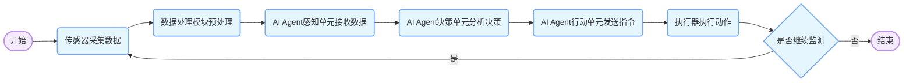

# 智能宠物屋：AI Agent的宠物行为分析与训练

> 关键词：智能宠物屋、AI Agent、宠物行为分析、宠物训练、人工智能

> 摘要：本文聚焦于智能宠物屋中运用AI Agent进行宠物行为分析与训练的技术。详细介绍了相关背景知识，包括目的范围、预期读者等。深入探讨了核心概念与联系，阐述了核心算法原理及具体操作步骤，结合数学模型和公式进行详细讲解与举例说明。通过项目实战展示代码案例及详细解释，分析了实际应用场景，推荐了相关工具和资源，最后总结未来发展趋势与挑战，解答常见问题并提供扩展阅读和参考资料，旨在为该领域的研究和实践提供全面且深入的指导。

## 1. 背景介绍 
### 1.1 目的和范围
随着人们生活水平的提高，养宠物的家庭越来越多。然而，宠物主人由于工作等原因，无法时刻陪伴宠物，也难以全面了解宠物的行为和需求。智能宠物屋结合AI Agent技术应运而生，其目的在于为宠物提供一个智能化的生活环境，同时帮助宠物主人更好地了解宠物的行为习惯、健康状况，并实现远程对宠物进行训练。本文章的范围涵盖了智能宠物屋的基本原理、AI Agent在宠物行为分析与训练中的应用、相关算法和技术实现，以及实际应用场景和未来发展趋势等方面。

### 1.2 预期读者
本文预期读者包括宠物爱好者、智能家居开发者、人工智能研究人员、动物行为学家以及对智能宠物相关技术感兴趣的人士。对于宠物爱好者，文章可以帮助他们了解如何利用科技手段更好地照顾和训练宠物；对于开发者和研究人员，可提供技术思路和实现方法；对于动物行为学家，有助于将先进的AI技术引入到宠物行为研究中。

### 1.3 文档结构概述
本文将首先介绍相关的核心概念与联系，包括智能宠物屋和AI Agent的基本原理和架构。接着详细阐述核心算法原理及具体操作步骤，并结合数学模型和公式进行说明。通过项目实战部分展示代码案例，分析代码实现和功能。然后探讨实际应用场景，推荐相关的工具和资源。最后总结未来发展趋势与挑战，解答常见问题并提供扩展阅读和参考资料。

### 1.4 术语表
#### 1.4.1 核心术语定义
- **智能宠物屋**：一种配备了多种传感器和智能设备的宠物居住空间，能够实时监测宠物的行为和环境信息，并通过AI技术进行分析和处理。
- **AI Agent**：人工智能代理，是一种能够感知环境、自主决策并采取行动的智能实体。在智能宠物屋中，AI Agent可以根据宠物的行为数据进行分析和判断，实现对宠物的行为分析和训练。
- **宠物行为分析**：通过对宠物的动作、姿态、声音等行为数据进行采集和分析，了解宠物的情绪、需求和健康状况。
- **宠物训练**：利用AI Agent根据宠物的行为特点和训练目标，设计个性化的训练方案，引导宠物学习和掌握特定的技能和行为。

#### 1.4.2 相关概念解释
- **传感器技术**：智能宠物屋中使用的传感器包括摄像头、麦克风、温度传感器、湿度传感器等，用于采集宠物的行为数据和环境信息。
- **机器学习**：是AI Agent实现宠物行为分析和训练的核心技术之一，通过对大量的宠物行为数据进行学习和分析，建立行为模型和训练策略。
- **自然语言处理**：用于处理宠物的声音信号，理解宠物的叫声和表达的含义，实现与宠物的交互和沟通。

#### 1.4.3 缩略词列表
- **AI**：Artificial Intelligence，人工智能
- **ML**：Machine Learning，机器学习
- **NLP**：Natural Language Processing，自然语言处理

## 2. 核心概念与联系 

### 核心概念原理
#### 智能宠物屋原理
智能宠物屋主要由硬件设备和软件系统组成。硬件设备包括传感器、执行器和控制器等。传感器用于采集宠物的行为数据和环境信息，如摄像头可以拍摄宠物的动作和姿态，麦克风可以录制宠物的声音，温度和湿度传感器可以监测屋内的环境状况。执行器则根据AI Agent的决策执行相应的动作，如喂食器可以根据宠物的饮食需求投放食物，玩具可以通过电机控制实现移动和互动。控制器负责协调传感器和执行器的工作，并与AI Agent进行数据交互。

软件系统主要包括数据处理模块、AI Agent模块和用户界面模块。数据处理模块对传感器采集到的数据进行预处理，如降噪、特征提取等。AI Agent模块根据处理后的数据进行行为分析和决策，制定训练方案。用户界面模块则为宠物主人提供与智能宠物屋的交互界面，主人可以通过手机APP或网页实时查看宠物的状态和环境信息，远程控制智能宠物屋的设备，以及获取AI Agent提供的训练建议。

#### AI Agent原理
AI Agent是智能宠物屋的核心决策单元，它基于机器学习和自然语言处理等技术，实现对宠物行为的理解和分析。AI Agent的工作流程主要包括感知、决策和行动三个阶段。在感知阶段，AI Agent通过传感器获取宠物的行为数据和环境信息；在决策阶段，AI Agent利用机器学习模型对感知到的数据进行分析和判断，预测宠物的需求和行为趋势，制定相应的训练策略；在行动阶段，AI Agent将决策结果发送给执行器，控制智能宠物屋的设备执行相应的动作。

### 架构的文本示意图
```plaintext
智能宠物屋系统架构
|-- 硬件设备
|   |-- 传感器（摄像头、麦克风、温湿度传感器等）
|   |-- 执行器（喂食器、玩具、灯光等）
|   |-- 控制器
|-- 软件系统
|   |-- 数据处理模块
|   |-- AI Agent模块
|       |-- 感知单元
|       |-- 决策单元
|       |-- 行动单元
|   |-- 用户界面模块
```

### Mermaid流程图


## 3. 核心算法原理 & 具体操作步骤 

### 核心算法原理
#### 宠物行为分类算法
在宠物行为分析中，常用的算法是基于机器学习的分类算法，如支持向量机（SVM）、决策树、神经网络等。以神经网络为例，其基本原理是通过多层神经元的组合，对输入的宠物行为数据进行非线性变换和特征提取，最终输出宠物的行为类别。

假设我们使用一个简单的全连接神经网络进行宠物行为分类，输入层的神经元数量为 $n$，表示宠物行为数据的特征维度；隐藏层的神经元数量为 $m$；输出层的神经元数量为 $k$，表示宠物行为的类别数量。神经网络的前向传播过程可以表示为：

输入层到隐藏层的计算：
$$
z_{j}^{(1)} = \sum_{i=1}^{n} w_{ji}^{(1)} x_{i} + b_{j}^{(1)}
$$
其中，$z_{j}^{(1)}$ 是隐藏层第 $j$ 个神经元的输入，$w_{ji}^{(1)}$ 是输入层第 $i$ 个神经元到隐藏层第 $j$ 个神经元的权重，$x_{i}$ 是输入层第 $i$ 个神经元的输入，$b_{j}^{(1)}$ 是隐藏层第 $j$ 个神经元的偏置。

隐藏层的激活函数：
$$
a_{j}^{(1)} = f(z_{j}^{(1)})
$$
其中，$a_{j}^{(1)}$ 是隐藏层第 $j$ 个神经元的输出，$f$ 是激活函数，常用的激活函数有ReLU、Sigmoid等。

隐藏层到输出层的计算：
$$
z_{l}^{(2)} = \sum_{j=1}^{m} w_{lj}^{(2)} a_{j}^{(1)} + b_{l}^{(2)}
$$
其中，$z_{l}^{(2)}$ 是输出层第 $l$ 个神经元的输入，$w_{lj}^{(2)}$ 是隐藏层第 $j$ 个神经元到输出层第 $l$ 个神经元的权重，$b_{l}^{(2)}$ 是输出层第 $l$ 个神经元的偏置。

输出层的激活函数：
$$
a_{l}^{(2)} = softmax(z_{l}^{(2)})
$$
其中，$a_{l}^{(2)}$ 是输出层第 $l$ 个神经元的输出，$softmax$ 函数用于将输出值转换为概率分布，表示宠物属于每个行为类别的概率。

#### 宠物训练策略生成算法
宠物训练策略生成算法基于强化学习的思想，通过奖励和惩罚机制引导宠物学习和掌握特定的技能和行为。以Q学习算法为例，其核心是学习一个动作价值函数 $Q(s, a)$，表示在状态 $s$ 下采取动作 $a$ 的预期累计奖励。

Q学习算法的更新公式为：
$$
Q(s_{t}, a_{t}) \leftarrow Q(s_{t}, a_{t}) + \alpha \left[ r_{t} + \gamma \max_{a} Q(s_{t+1}, a) - Q(s_{t}, a_{t}) \right]
$$
其中，$s_{t}$ 是当前状态，$a_{t}$ 是当前动作，$r_{t}$ 是执行动作 $a_{t}$ 后获得的奖励，$s_{t+1}$ 是下一个状态，$\alpha$ 是学习率，$\gamma$ 是折扣因子。

### 具体操作步骤
#### 数据采集
使用摄像头、麦克风等传感器采集宠物的行为数据和环境信息。数据采集的频率和时长根据实际需求进行设置，一般建议采集足够多的数据以保证模型的训练效果。

#### 数据预处理
对采集到的数据进行预处理，包括降噪、特征提取等操作。例如，对于视频数据，可以使用图像处理算法提取宠物的动作特征；对于音频数据，可以使用语音处理算法提取宠物的声音特征。

#### 模型训练
使用预处理后的数据对机器学习模型进行训练。对于宠物行为分类模型，可以使用标注好的行为数据进行监督学习；对于宠物训练策略生成模型，可以使用强化学习算法进行训练。

#### 模型部署
将训练好的模型部署到智能宠物屋的控制器中，实现实时的行为分析和决策。

#### 训练执行
AI Agent根据宠物的当前状态和训练目标，生成相应的训练策略，并控制执行器执行相应的动作。同时，根据宠物的反馈调整训练策略，不断优化训练效果。

### Python源代码实现
```python
import numpy as np

# 定义神经网络类
class NeuralNetwork:
    def __init__(self, input_size, hidden_size, output_size):
        self.input_size = input_size
        self.hidden_size = hidden_size
        self.output_size = output_size
        
        # 初始化权重和偏置
        self.weights1 = np.random.randn(self.input_size, self.hidden_size)
        self.bias1 = np.zeros((1, self.hidden_size))
        self.weights2 = np.random.randn(self.hidden_size, self.output_size)
        self.bias2 = np.zeros((1, self.output_size))
    
    def relu(self, x):
        return np.maximum(0, x)
    
    def softmax(self, x):
        exp_x = np.exp(x - np.max(x, axis=1, keepdims=True))
        return exp_x / np.sum(exp_x, axis=1, keepdims=True)
    
    def forward(self, X):
        # 前向传播
        self.z1 = np.dot(X, self.weights1) + self.bias1
        self.a1 = self.relu(self.z1)
        self.z2 = np.dot(self.a1, self.weights2) + self.bias2
        self.a2 = self.softmax(self.z2)
        return self.a2

# 定义Q学习类
class QLearning:
    def __init__(self, state_size, action_size, learning_rate=0.1, discount_factor=0.9):
        self.state_size = state_size
        self.action_size = action_size
        self.learning_rate = learning_rate
        self.discount_factor = discount_factor
        self.q_table = np.zeros((state_size, action_size))
    
    def get_action(self, state):
        # 根据Q表选择动作
        return np.argmax(self.q_table[state, :])
    
    def update_q_table(self, state, action, reward, next_state):
        # 更新Q表
        max_q_next = np.max(self.q_table[next_state, :])
        self.q_table[state, action] += self.learning_rate * (reward + self.discount_factor * max_q_next - self.q_table[state, action])


# 示例使用
# 神经网络示例
input_size = 10
hidden_size = 20
output_size = 3
nn = NeuralNetwork(input_size, hidden_size, output_size)
X = np.random.randn(1, input_size)
output = nn.forward(X)
print("神经网络输出:", output)

# Q学习示例
state_size = 5
action_size = 2
q_learning = QLearning(state_size, action_size)
state = 0
action = q_learning.get_action(state)
reward = 1
next_state = 1
q_learning.update_q_table(state, action, reward, next_state)
print("Q表:", q_learning.q_table)
```

## 4. 数学模型和公式 & 详细讲解 & 举例说明 

### 宠物行为分类的数学模型
在宠物行为分类中，我们使用的神经网络模型可以用数学公式进行详细描述。

#### 前向传播过程
如前面所述，输入层到隐藏层的计算可以表示为：
$$
z_{j}^{(1)} = \sum_{i=1}^{n} w_{ji}^{(1)} x_{i} + b_{j}^{(1)}
$$
其中，$n$ 是输入层的神经元数量，$w_{ji}^{(1)}$ 是输入层第 $i$ 个神经元到隐藏层第 $j$ 个神经元的权重，$x_{i}$ 是输入层第 $i$ 个神经元的输入，$b_{j}^{(1)}$ 是隐藏层第 $j$ 个神经元的偏置。

隐藏层的激活函数使用ReLU函数：
$$
a_{j}^{(1)} = \max(0, z_{j}^{(1)})
$$
ReLU函数的作用是引入非线性因素，使得神经网络能够学习到更复杂的特征。

隐藏层到输出层的计算为：
$$
z_{l}^{(2)} = \sum_{j=1}^{m} w_{lj}^{(2)} a_{j}^{(1)} + b_{l}^{(2)}
$$
其中，$m$ 是隐藏层的神经元数量，$w_{lj}^{(2)}$ 是隐藏层第 $j$ 个神经元到输出层第 $l$ 个神经元的权重，$b_{l}^{(2)}$ 是输出层第 $l$ 个神经元的偏置。

输出层的激活函数使用softmax函数：
$$
a_{l}^{(2)} = \frac{e^{z_{l}^{(2)}}}{\sum_{k=1}^{K} e^{z_{k}^{(2)}}}
$$
其中，$K$ 是输出层的神经元数量，$a_{l}^{(2)}$ 表示宠物属于第 $l$ 个行为类别的概率。

#### 损失函数
在训练神经网络时，我们使用交叉熵损失函数来衡量模型的预测结果与真实标签之间的差异。交叉熵损失函数的公式为：
$$
L = -\frac{1}{N} \sum_{n=1}^{N} \sum_{l=1}^{K} y_{nl} \log(a_{nl}^{(2)})
$$
其中，$N$ 是样本数量，$y_{nl}$ 是第 $n$ 个样本的真实标签，$a_{nl}^{(2)}$ 是第 $n$ 个样本在输出层第 $l$ 个神经元的输出。

#### 反向传播过程
为了更新神经网络的权重和偏置，我们使用反向传播算法。反向传播算法的核心是计算损失函数对权重和偏置的梯度，然后使用梯度下降法更新权重和偏置。

损失函数对输出层权重的梯度为：
$$
\frac{\partial L}{\partial w_{lj}^{(2)}} = \frac{1}{N} \sum_{n=1}^{N} (a_{nl}^{(2)} - y_{nl}) a_{nj}^{(1)}
$$

损失函数对输出层偏置的梯度为：
$$
\frac{\partial L}{\partial b_{l}^{(2)}} = \frac{1}{N} \sum_{n=1}^{N} (a_{nl}^{(2)} - y_{nl})
$$

损失函数对隐藏层权重的梯度为：
$$
\frac{\partial L}{\partial w_{ji}^{(1)}} = \frac{1}{N} \sum_{n=1}^{N} \left[ \sum_{l=1}^{K} (a_{nl}^{(2)} - y_{nl}) w_{lj}^{(2)} \right] \cdot \frac{\partial a_{nj}^{(1)}}{\partial z_{nj}^{(1)}} \cdot x_{ni}
$$

损失函数对隐藏层偏置的梯度为：
$$
\frac{\partial L}{\partial b_{j}^{(1)}} = \frac{1}{N} \sum_{n=1}^{N} \left[ \sum_{l=1}^{K} (a_{nl}^{(2)} - y_{nl}) w_{lj}^{(2)} \right] \cdot \frac{\partial a_{nj}^{(1)}}{\partial z_{nj}^{(1)}}
$$

其中，$\frac{\partial a_{nj}^{(1)}}{\partial z_{nj}^{(1)}}$ 是ReLU函数的导数，当 $z_{nj}^{(1)} > 0$ 时，$\frac{\partial a_{nj}^{(1)}}{\partial z_{nj}^{(1)}} = 1$；当 $z_{nj}^{(1)} \leq 0$ 时，$\frac{\partial a_{nj}^{(1)}}{\partial z_{nj}^{(1)}} = 0$。

### 宠物训练策略生成的数学模型
在宠物训练策略生成中，我们使用的Q学习算法的数学模型如下。

#### Q学习算法
Q学习算法的核心是学习一个动作价值函数 $Q(s, a)$，表示在状态 $s$ 下采取动作 $a$ 的预期累计奖励。Q学习算法的更新公式为：
$$
Q(s_{t}, a_{t}) \leftarrow Q(s_{t}, a_{t}) + \alpha \left[ r_{t} + \gamma \max_{a} Q(s_{t+1}, a) - Q(s_{t}, a_{t}) \right]
$$
其中，$s_{t}$ 是当前状态，$a_{t}$ 是当前动作，$r_{t}$ 是执行动作 $a_{t}$ 后获得的奖励，$s_{t+1}$ 是下一个状态，$\alpha$ 是学习率，$\gamma$ 是折扣因子。

#### 策略选择
在每个时间步 $t$，根据当前的Q表选择动作。常用的策略选择方法有 $\epsilon$-贪心策略，即：
$$
a_{t} = 
\begin{cases}
\argmax_{a} Q(s_{t}, a) & \text{with probability } 1 - \epsilon \\
\text{random action} & \text{with probability } \epsilon
\end{cases}
$$
其中，$\epsilon$ 是一个小的正数，用于平衡探索和利用。

### 举例说明
#### 宠物行为分类举例
假设我们要对宠物的三种行为（睡觉、玩耍、进食）进行分类。我们采集了100个样本，每个样本有5个特征（如动作速度、姿态角度等）。输入层的神经元数量 $n = 5$，隐藏层的神经元数量 $m = 10$，输出层的神经元数量 $K = 3$。

在训练过程中，我们使用交叉熵损失函数来衡量模型的预测结果与真实标签之间的差异。通过反向传播算法更新神经网络的权重和偏置，使得损失函数逐渐减小。训练完成后，我们可以使用训练好的模型对新的宠物行为数据进行分类。

#### 宠物训练策略生成举例
假设宠物的状态有5种（如饥饿、无聊、困倦等），可以采取的动作有2种（如喂食、玩耍）。我们使用Q学习算法来生成训练策略。

在每个时间步，根据当前的状态 $s_{t}$ 和 $\epsilon$-贪心策略选择动作 $a_{t}$。执行动作 $a_{t}$ 后，获得奖励 $r_{t}$ 和下一个状态 $s_{t+1}$。然后使用Q学习算法的更新公式更新Q表。经过多次迭代，Q表逐渐收敛，我们可以根据收敛后的Q表制定最优的训练策略。

## 5. 项目实战：代码实际案例和详细解释说明 

### 5.1  开发环境搭建
#### 硬件环境
- **树莓派**：作为智能宠物屋的控制器，选择树莓派4B，它具有较高的性能和丰富的接口。
- **摄像头**：用于采集宠物的视频数据，选择分辨率较高的USB摄像头。
- **麦克风**：用于采集宠物的声音数据，选择灵敏度较高的麦克风。
- **喂食器**：用于给宠物喂食，可选择电动喂食器。
- **玩具**：用于与宠物互动，可选择带有电机的智能玩具。

#### 软件环境
- **操作系统**：在树莓派上安装Raspbian操作系统。
- **Python环境**：安装Python 3.x版本，并安装相关的库，如OpenCV、NumPy、Scikit-learn等。

### 5.2  源代码详细实现和代码解读
```python
import cv2
import numpy as np
import time
from collections import deque

# 定义宠物行为分类模型
class PetBehaviorClassifier:
    def __init__(self):
        # 加载预训练的模型（这里简单示例，实际需要训练）
        self.model = np.random.randn(5, 3)
    
    def classify(self, features):
        # 进行行为分类
        output = np.dot(features, self.model)
        action = np.argmax(output)
        return action

# 定义宠物训练器
class PetTrainer:
    def __init__(self):
        self.state_size = 5
        self.action_size = 2
        self.q_table = np.zeros((self.state_size, self.action_size))
        self.learning_rate = 0.1
        self.discount_factor = 0.9
    
    def get_action(self, state):
        # 根据Q表选择动作
        return np.argmax(self.q_table[state, :])
    
    def update_q_table(self, state, action, reward, next_state):
        # 更新Q表
        max_q_next = np.max(self.q_table[next_state, :])
        self.q_table[state, action] += self.learning_rate * (reward + self.discount_factor * max_q_next - self.q_table[state, action])

# 模拟传感器数据采集
def collect_sensor_data():
    # 模拟采集宠物的特征数据
    features = np.random.randn(1, 5)
    return features

# 模拟执行器执行动作
def execute_action(action):
    if action == 0:
        print("执行喂食动作")
    elif action == 1:
        print("执行玩耍动作")

# 主程序
if __name__ == "__main__":
    classifier = PetBehaviorClassifier()
    trainer = PetTrainer()
    
    state = 0  # 初始状态
    buffer = deque(maxlen=10)  # 用于存储最近的行为数据
    
    while True:
        # 采集传感器数据
        features = collect_sensor_data()
        buffer.append(features)
        
        # 进行行为分类
        action = classifier.classify(features)
        print("宠物当前行为分类:", action)
        
        # 根据状态选择动作
        training_action = trainer.get_action(state)
        execute_action(training_action)
        
        # 模拟获得奖励
        reward = np.random.randint(0, 2)
        
        # 模拟下一个状态
        next_state = np.random.randint(0, 5)
        
        # 更新Q表
        trainer.update_q_table(state, training_action, reward, next_state)
        
        state = next_state
        
        time.sleep(1)
```

### 5.3  代码解读与分析
#### 宠物行为分类模型
`PetBehaviorClassifier` 类用于实现宠物行为分类。在实际应用中，需要使用大量的宠物行为数据对模型进行训练。这里简单示例，使用随机生成的权重矩阵进行分类。`classify` 方法接受宠物的特征数据作为输入，通过矩阵乘法计算输出，并返回分类结果。

#### 宠物训练器
`PetTrainer` 类用于实现宠物训练策略的生成。使用Q学习算法，通过维护一个Q表来记录每个状态下每个动作的价值。`get_action` 方法根据当前状态和Q表选择动作，`update_q_table` 方法根据奖励和下一个状态更新Q表。

#### 传感器数据采集
`collect_sensor_data` 函数模拟传感器采集宠物的特征数据。在实际应用中，需要使用摄像头、麦克风等传感器采集真实的数据，并进行预处理。

#### 执行器执行动作
`execute_action` 函数模拟执行器执行动作。根据传入的动作编号，输出相应的动作信息。

#### 主程序
在主程序中，首先初始化宠物行为分类模型和宠物训练器。然后进入一个无限循环，不断采集传感器数据，进行行为分类，选择训练动作，执行动作，获得奖励，更新Q表。通过不断的迭代，逐渐优化训练策略。

## 6. 实际应用场景 
### 家庭宠物护理
智能宠物屋可以为家庭宠物提供全方位的护理服务。宠物主人可以通过手机APP实时查看宠物的状态和环境信息，如宠物的行为、饮食情况、屋内的温度和湿度等。当宠物出现异常行为或环境不适宜时，智能宠物屋可以及时发出警报，提醒主人采取相应的措施。同时，AI Agent可以根据宠物的行为特点和健康状况，制定个性化的饮食和运动计划，帮助宠物保持健康。

### 宠物训练
智能宠物屋可以实现远程宠物训练。主人可以通过手机APP设置训练目标和任务，AI Agent根据宠物的当前状态和训练目标，生成相应的训练策略，并控制智能宠物屋的设备执行训练动作。例如，当主人希望宠物学会坐下时，AI Agent可以通过发出声音指令、展示食物等方式引导宠物做出坐下的动作，并给予奖励。通过不断的训练和反馈，宠物可以逐渐掌握特定的技能和行为。

### 宠物研究
智能宠物屋为宠物研究提供了丰富的数据来源。研究人员可以通过智能宠物屋采集大量的宠物行为数据，分析宠物的行为模式、情绪变化和社交行为等。结合机器学习和数据分析技术，研究人员可以深入了解宠物的心理和生理特征，为宠物的健康和福利提供科学依据。

### 宠物寄养和宠物店
在宠物寄养和宠物店场景中，智能宠物屋可以提高服务质量和管理效率。店主可以通过智能宠物屋实时监控宠物的状态，为每只宠物提供个性化的照顾。同时，智能宠物屋可以记录宠物的寄养历史和健康信息，方便店主进行管理和统计。

## 7. 工具和资源推荐
### 7.1 学习资源推荐
#### 7.1.1 书籍推荐
- 《深度学习》（Deep Learning）：由Ian Goodfellow、Yoshua Bengio和Aaron Courville撰写，是深度学习领域的经典教材，涵盖了神经网络、卷积神经网络、循环神经网络等核心内容。
- 《机器学习》（Machine Learning）：由Tom M. Mitchell编写，系统介绍了机器学习的基本概念、算法和应用，适合初学者入门。
- 《Python机器学习》（Python Machine Learning）：由Sebastian Raschka和Vahid Mirjalili编写，通过Python代码实现了各种机器学习算法，帮助读者快速掌握机器学习的实践技巧。

#### 7.1.2 在线课程
- Coursera上的“深度学习专项课程”（Deep Learning Specialization）：由Andrew Ng教授授课，包括神经网络和深度学习、改善深层神经网络、结构化机器学习项目等多个课程，全面介绍了深度学习的理论和实践。
- edX上的“人工智能导论”（Introduction to Artificial Intelligence）：由麻省理工学院（MIT）的Patrick Winston教授授课，涵盖了人工智能的基本概念、搜索算法、知识表示等内容。
- 网易云课堂上的“Python数据分析与机器学习实战”：通过实际案例介绍了Python在数据分析和机器学习中的应用，适合有一定Python基础的学习者。

#### 7.1.3 技术博客和网站
- Medium：是一个技术博客平台，有许多关于人工智能、机器学习和智能宠物的文章和教程。
- Towards Data Science：专注于数据科学和机器学习领域，提供了大量的技术文章和案例分析。
- Kaggle：是一个数据科学竞赛平台，有许多关于宠物行为分析和预测的数据集和竞赛项目，可以帮助学习者提高实践能力。

### 7.2 开发工具框架推荐
#### 7.2.1 IDE和编辑器
- PyCharm：是一款专门为Python开发设计的集成开发环境（IDE），具有代码自动补全、调试、版本控制等功能，适合大型项目的开发。
- Jupyter Notebook：是一个交互式的开发环境，支持Python、R等多种编程语言，适合进行数据分析和模型实验。
- Visual Studio Code：是一款轻量级的代码编辑器，支持多种编程语言和插件扩展，具有丰富的代码高亮、调试等功能。

#### 7.2.2 调试和性能分析工具
- Py-Spy：是一个用于Python代码性能分析的工具，可以实时监测Python程序的CPU使用率、函数调用时间等信息，帮助开发者找出性能瓶颈。
- cProfile：是Python标准库中的一个性能分析模块，可以统计函数调用次数、执行时间等信息，生成性能分析报告。
- TensorBoard：是TensorFlow的可视化工具，可用于可视化神经网络的训练过程、模型结构和性能指标等。

#### 7.2.3 相关框架和库
- TensorFlow：是Google开发的开源深度学习框架，支持多种深度学习模型的构建和训练，具有高效的分布式计算能力。
- PyTorch：是Facebook开发的开源深度学习框架，具有动态图和静态图两种模式，易于使用和调试，适合快速原型开发。
- OpenCV：是一个开源的计算机视觉库，提供了丰富的图像处理和计算机视觉算法，可用于宠物行为数据的采集和处理。

### 7.3 相关论文著作推荐
#### 7.3.1 经典论文
- “ImageNet Classification with Deep Convolutional Neural Networks”：由Alex Krizhevsky、Ilya Sutskever和Geoffrey E. Hinton发表于2012年的NIPS会议，提出了AlexNet卷积神经网络，开创了深度学习在图像分类领域的先河。
- “Human-level control through deep reinforcement learning”：由Volodymyr Mnih等人发表于2015年的Nature杂志，提出了深度Q网络（DQN）算法，实现了通过深度强化学习玩Atari游戏。
- “Attention Is All You Need”：由Ashish Vaswani等人发表于2017年的NeurIPS会议，提出了Transformer模型，在自然语言处理领域取得了巨大成功。

#### 7.3.2 最新研究成果
- 近年来，关于宠物行为分析和训练的研究逐渐增多。一些研究使用深度学习和计算机视觉技术对宠物的行为进行分类和识别，另一些研究则使用强化学习和自然语言处理技术实现宠物的智能训练。可以通过学术数据库（如IEEE Xplore、ACM Digital Library等）搜索相关的最新研究成果。

#### 7.3.3 应用案例分析
- 一些科技公司和研究机构已经开展了智能宠物屋的实际应用项目。可以通过相关的技术报告、行业新闻和学术论文了解这些应用案例的设计思路、技术实现和应用效果。

## 8. 总结：未来发展趋势与挑战
### 未来发展趋势
#### 多模态融合技术
未来的智能宠物屋将融合更多的传感器技术，如视觉、听觉、触觉等，实现多模态的数据采集和分析。通过多模态融合技术，可以更全面、准确地了解宠物的行为和需求，提供更个性化的服务和训练方案。

#### 情感计算与交互
随着人工智能技术的发展，智能宠物屋将具备情感计算能力，能够识别宠物的情绪状态，并做出相应的反应。例如，当宠物感到孤独或焦虑时，智能宠物屋可以通过播放音乐、展示温馨的画面等方式安抚宠物的情绪。同时，智能宠物屋还可以与宠物进行更自然、友好的交互，增强宠物与主人之间的情感联系。

#### 云端服务与大数据分析
智能宠物屋将与云端服务相结合，实现数据的存储、分析和共享。通过大数据分析技术，可以挖掘宠物行为数据中的潜在信息，为宠物主人和研究人员提供更有价值的参考。例如，分析不同品种、年龄、性别宠物的行为特点和健康状况，为宠物的健康管理和疾病预防提供科学依据。

#### 智能家居集成
智能宠物屋将与智能家居系统深度集成，实现更智能化的家居控制。例如，当宠物进入或离开房间时，智能宠物屋可以自动调节房间的温度、湿度和灯光；当宠物需要进食时，智能宠物屋可以与厨房的智能设备联动，自动准备食物。

### 挑战
#### 数据隐私和安全
智能宠物屋采集的宠物行为数据包含了宠物的个人信息和生活习惯，涉及到数据隐私和安全问题。如何保护这些数据不被泄露和滥用，是智能宠物屋发展面临的重要挑战。需要采取有效的数据加密、访问控制和安全审计等措施，确保数据的安全性和隐私性。

#### 算法准确性和泛化能力
宠物的行为具有多样性和复杂性，不同品种、年龄、性格的宠物行为差异较大。如何提高宠物行为分析和训练算法的准确性和泛化能力，是智能宠物屋技术发展的关键。需要收集更多的宠物行为数据，设计更有效的算法模型，并进行充分的实验和验证。

#### 成本和易用性
智能宠物屋的硬件设备和软件开发需要一定的成本，如何降低成本，提高产品的性价比，是推广智能宠物屋的重要因素。同时，产品的易用性也非常重要，需要设计简单、直观的用户界面，方便宠物主人使用和操作。

#### 动物伦理问题
在智能宠物屋的开发和应用过程中，需要考虑动物伦理问题。例如，过度依赖智能设备可能会影响宠物的自然行为和社交能力；使用电击、噪音等惩罚手段进行宠物训练可能会对宠物造成伤害。需要遵循动物福利原则，确保智能宠物屋的设计和使用符合动物伦理要求。

## 9. 附录：常见问题与解答
### 问题1：智能宠物屋的传感器数据准确吗？
解答：智能宠物屋的传感器数据准确性取决于传感器的质量和安装位置。一般来说，选择质量可靠的传感器，并合理安装在宠物活动区域，可以获得较为准确的数据。同时，通过数据预处理和校准等技术手段，可以进一步提高数据的准确性。

### 问题2：AI Agent如何判断宠物的行为状态？
解答：AI Agent通过机器学习算法对传感器采集到的宠物行为数据进行分析和分类。首先，需要使用大量的标注数据对机器学习模型进行训练，让模型学习不同行为状态的特征。然后，将实时采集到的数据输入到训练好的模型中，模型根据学习到的特征进行判断，输出宠物的行为状态。

### 问题3：智能宠物屋可以训练所有宠物吗？
解答：智能宠物屋可以适用于大多数常见的宠物，如猫、狗等。但不同宠物的行为特点和学习能力有所差异，对于一些特殊品种或具有特殊行为问题的宠物，可能需要进行个性化的训练方案设计。同时，宠物的训练效果还受到宠物的年龄、性格等因素的影响。

### 问题4：智能宠物屋的安全性如何保障？
解答：智能宠物屋的安全性可以从多个方面进行保障。在硬件方面，选择质量可靠的电子元件和材料，确保设备的稳定性和安全性。在软件方面，采用数据加密、访问控制等技术手段，保护用户数据的安全。同时，设置安全机制，如过载保护、漏电保护等，防止设备发生故障对宠物造成伤害。

### 问题5：智能宠物屋的成本高吗？
解答：智能宠物屋的成本因设备配置和功能不同而异。一般来说，基本功能的智能宠物屋成本相对较低，而具备高级功能（如多模态传感器、智能交互等）的智能宠物屋成本会较高。随着技术的发展和市场竞争的加剧，智能宠物屋的成本有望逐渐降低。

## 10. 扩展阅读 & 参考资料
### 扩展阅读
- 《人工智能时代的宠物生活》：探讨了人工智能技术在宠物领域的应用前景和影响。
- 《宠物行为学》：深入研究了宠物的行为特点和心理机制，为智能宠物屋的设计和应用提供了理论基础。
- 《智能家居技术与应用》：介绍了智能家居系统的原理和技术，有助于理解智能宠物屋与智能家居的集成。

### 参考资料
- IEEE Transactions on Intelligent Transportation Systems：该期刊发表了许多关于人工智能和智能系统的研究论文，可从中获取相关的技术资料。
- ACM SIGKDD Conference on Knowledge Discovery and Data Mining：是数据挖掘领域的顶级会议，会议论文中包含了许多关于数据分析和机器学习的最新研究成果。
- 相关的科技公司官网，如Google、Facebook、NVIDIA等，这些公司在人工智能和机器学习领域具有领先的技术和研究成果，可以从其官网上获取相关的技术文档和研究报告。

作者：AI天才研究院/AI Genius Institute & 禅与计算机程序设计艺术 /Zen And The Art of Computer Programming