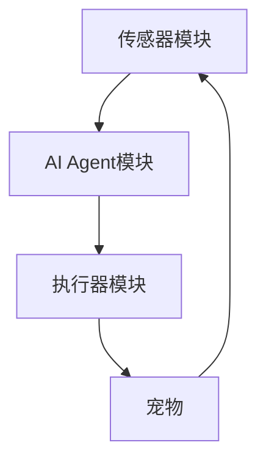

# 智能宠物玩具：AI Agent的宠物智力开发

> 关键词：智能宠物玩具、AI Agent、宠物智力开发、机器学习、人机交互

> 摘要：本文聚焦于智能宠物玩具领域，深入探讨了如何运用AI Agent实现宠物智力开发。首先介绍了智能宠物玩具及AI Agent的背景知识，包括目的、预期读者等内容。接着阐述了核心概念与联系，详细讲解了核心算法原理及操作步骤，并结合数学模型和公式进行说明。通过项目实战，给出代码实际案例及详细解读。同时列举了智能宠物玩具的实际应用场景，推荐了相关学习资源、开发工具框架以及论文著作。最后总结了未来发展趋势与挑战，提供了常见问题解答和扩展阅读参考资料，旨在为相关领域的研究者和开发者提供全面而深入的技术指导。

## 1. 背景介绍 
### 1.1 目的和范围
随着人们生活水平的提高，宠物在家庭中的地位日益重要，宠物主人对宠物的生活质量和智力发展也越发关注。智能宠物玩具作为融合了先进技术与宠物娱乐需求的产品，正逐渐成为市场的热点。本文章的目的在于深入探讨如何利用AI Agent技术开发智能宠物玩具，以实现宠物的智力开发。范围涵盖了智能宠物玩具的核心概念、算法原理、数学模型、实际应用场景等多个方面，旨在为相关领域的研究和开发提供全面的技术参考。

### 1.2 预期读者
本文预期读者包括宠物科技领域的开发者、人工智能研究者、宠物玩具制造商、对智能宠物产品感兴趣的技术爱好者以及关注宠物智力发展的宠物主人。这些读者可以从文章中获取不同层面的知识，开发者和研究者可以借鉴技术原理进行产品创新，制造商可以了解市场趋势和技术方向，技术爱好者可以拓宽知识面，宠物主人可以更好地了解智能宠物玩具的价值。

### 1.3 文档结构概述
本文将按照以下结构展开：首先介绍核心概念与联系，明确智能宠物玩具和AI Agent的定义、原理及相互关系；接着阐述核心算法原理和具体操作步骤，通过Python代码详细说明；然后介绍数学模型和公式，并举例说明；之后进行项目实战，包括开发环境搭建、源代码实现和代码解读；再列举实际应用场景；推荐相关工具和资源；最后总结未来发展趋势与挑战，提供常见问题解答和扩展阅读参考资料。

### 1.4 术语表
#### 1.4.1 核心术语定义
- **智能宠物玩具**：具备一定智能功能的宠物玩具，能够根据宠物的行为和环境变化做出相应反应，实现与宠物的互动和娱乐。
- **AI Agent（人工智能代理）**：一种能够感知环境、进行决策并采取行动以实现特定目标的软件实体。在智能宠物玩具中，AI Agent可以模拟宠物的行为和需求，与宠物进行交互。
- **机器学习**：一门多领域交叉学科，涉及概率论、统计学、逼近论、凸分析、算法复杂度理论等多门学科。它专门研究计算机怎样模拟或实现人类的学习行为，以获取新的知识或技能，重新组织已有的知识结构使之不断改善自身的性能。
- **人机交互**：人与计算机之间使用某种对话语言，以一定的交互方式，为完成确定任务的人与计算机之间的信息交换过程。在智能宠物玩具中，体现为宠物与玩具之间的互动。

#### 1.4.2 相关概念解释
- **强化学习**：机器学习中的一个领域，强调智能体（agent）如何在环境中采取一系列行动，以最大化累积奖励。在智能宠物玩具中，强化学习可以用于训练玩具根据宠物的行为给予不同的反馈，从而激发宠物的兴趣和学习能力。
- **计算机视觉**：是一门研究如何使机器“看”的科学，更进一步的说，就是指用摄影机和电脑代替人眼对目标进行识别、跟踪和测量等机器视觉，并进一步做图形处理，使电脑处理成为更适合人眼观察或传送给仪器检测的图像。在智能宠物玩具中，计算机视觉可以用于识别宠物的动作和表情。

#### 1.4.3 缩略词列表
- **AI**：Artificial Intelligence，人工智能
- **ML**：Machine Learning，机器学习
- **RL**：Reinforcement Learning，强化学习
- **CV**：Computer Vision，计算机视觉

## 2. 核心概念与联系 

### 核心概念原理
智能宠物玩具的核心在于利用AI Agent技术实现与宠物的互动和智力开发。AI Agent通过传感器感知宠物的行为和环境信息，然后运用机器学习算法进行决策，最后通过执行器（如电机、灯光等）做出相应的反应。

例如，一个智能宠物球可以通过内置的加速度计和陀螺仪感知宠物的撞击和滚动动作，AI Agent根据这些数据判断宠物的活跃程度和兴趣点，然后通过改变球的滚动速度和方向来吸引宠物继续玩耍。

### 架构的文本示意图
```plaintext
智能宠物玩具架构

|-------------------|
|    传感器模块     |
|-------------------|
| 加速度计、陀螺仪  |
| 摄像头、麦克风    |
|-------------------|
        |
        v
|-------------------|
|    AI Agent模块   |
|-------------------|
| 数据预处理        |
| 机器学习算法      |
| 决策生成          |
|-------------------|
        |
        v
|-------------------|
|    执行器模块     |
|-------------------|
| 电机、灯光        |
| 扬声器、振动器    |
|-------------------|
```

### Mermaid流程图


该流程图展示了智能宠物玩具的工作流程：传感器模块收集宠物和环境信息，将其传输给AI Agent模块进行处理和决策，AI Agent模块根据决策结果控制执行器模块做出反应，执行器模块的反应作用于宠物，宠物的反馈又被传感器模块收集，形成一个闭环系统。

## 3. 核心算法原理 & 具体操作步骤 

### 核心算法原理
在智能宠物玩具中，常用的核心算法是强化学习算法。强化学习的基本思想是智能体在环境中不断尝试不同的动作，根据环境给予的奖励信号来调整自己的行为策略，以最大化长期累积奖励。

以智能宠物球为例，宠物球的AI Agent可以将宠物的撞击和追逐行为视为奖励信号，当宠物撞击球时，AI Agent得到一个正奖励；当宠物长时间不与球互动时，AI Agent得到一个负奖励。AI Agent通过不断尝试不同的滚动速度和方向，学习到哪些动作能够获得更多的正奖励，从而优化自己的行为策略。

### Python源代码详细阐述
以下是一个简单的强化学习示例，使用OpenAI Gym库模拟智能宠物玩具的环境：

```python
import gym
import numpy as np

# 创建环境
env = gym.make('CartPole-v1')

# 初始化参数
alpha = 0.1  # 学习率
gamma = 0.9  # 折扣因子
epsilon = 0.1  # 探索率
num_episodes = 1000  # 训练回合数

# 初始化Q表
state_space_size = env.observation_space.shape[0]
action_space_size = env.action_space.n
Q = np.zeros((state_space_size, action_space_size))

# 训练循环
for episode in range(num_episodes):
    state = env.reset()
    done = False
    total_reward = 0

    while not done:
        # 探索与利用平衡
        if np.random.uniform(0, 1) < epsilon:
            action = env.action_space.sample()  # 随机选择动作
        else:
            action = np.argmax(Q[state, :])  # 选择Q值最大的动作

        # 执行动作
        next_state, reward, done, _ = env.step(action)

        # 更新Q表
        Q[state, action] = (1 - alpha) * Q[state, action] + alpha * (reward + gamma * np.max(Q[next_state, :]))

        state = next_state
        total_reward += reward

    print(f"Episode {episode + 1}: Total Reward = {total_reward}")

# 测试智能体
state = env.reset()
done = False
total_reward = 0

while not done:
    action = np.argmax(Q[state, :])
    next_state, reward, done, _ = env.step(action)
    state = next_state
    total_reward += reward

print(f"Test Total Reward = {total_reward}")

env.close()
```

### 具体操作步骤
1. **环境初始化**：创建OpenAI Gym环境，设置学习率、折扣因子、探索率和训练回合数等参数。
2. **Q表初始化**：根据环境的状态空间和动作空间大小，初始化Q表。
3. **训练循环**：在每个训练回合中，智能体根据当前状态选择动作，执行动作并获取下一个状态和奖励，然后更新Q表。
4. **测试智能体**：训练完成后，使用训练好的Q表在环境中进行测试，记录总奖励。
5. **关闭环境**：测试结束后，关闭OpenAI Gym环境。

## 4. 数学模型和公式 & 详细讲解 & 举例说明 

### 数学模型和公式
在强化学习中，最常用的数学模型是马尔可夫决策过程（Markov Decision Process，MDP）。MDP由一个四元组 $(S, A, P, R)$ 表示，其中：
- $S$ 是状态空间，表示环境的所有可能状态。
- $A$ 是动作空间，表示智能体可以采取的所有动作。
- $P$ 是状态转移概率函数，表示在状态 $s \in S$ 采取动作 $a \in A$ 后转移到状态 $s' \in S$ 的概率，即 $P(s'|s, a)$。
- $R$ 是奖励函数，表示在状态 $s \in S$ 采取动作 $a \in A$ 后转移到状态 $s' \in S$ 时获得的奖励，即 $R(s, a, s')$。

智能体的目标是找到一个最优策略 $\pi^*$，使得长期累积奖励最大化。在Q学习算法中，Q值函数 $Q(s, a)$ 表示在状态 $s$ 采取动作 $a$ 后，遵循最优策略所能获得的期望累积奖励。Q值函数的更新公式为：

$$
Q(s, a) \leftarrow (1 - \alpha) Q(s, a) + \alpha \left[ R(s, a, s') + \gamma \max_{a'} Q(s', a') \right]
$$

其中，$\alpha$ 是学习率，$\gamma$ 是折扣因子。

### 详细讲解
- **状态转移概率函数 $P(s'|s, a)$**：描述了环境的动态特性，即智能体在某个状态下采取某个动作后，环境转移到下一个状态的概率。在实际应用中，状态转移概率函数可能是未知的，需要智能体通过不断尝试来学习。
- **奖励函数 $R(s, a, s')$**：是智能体学习的目标，它告诉智能体哪些动作是好的，哪些动作是坏的。奖励函数的设计直接影响智能体的学习效果。
- **Q值函数 $Q(s, a)$**：是智能体学习的核心，它记录了在每个状态下采取每个动作的价值。通过不断更新Q值函数，智能体可以找到最优策略。
- **学习率 $\alpha$**：控制了新的经验对Q值函数的更新程度。学习率越大，智能体对新经验的反应越敏感；学习率越小，智能体对新经验的反应越缓慢。
- **折扣因子 $\gamma$**：表示未来奖励的重要性。折扣因子越接近1，智能体越注重长期奖励；折扣因子越接近0，智能体越注重短期奖励。

### 举例说明
假设一个智能宠物球在一个二维平面上运动，宠物可以撞击球使其滚动。球的状态可以用其位置 $(x, y)$ 和速度 $(v_x, v_y)$ 表示，动作可以是改变球的滚动方向（如向左、向右、向前、向后）。

当宠物撞击球时，球获得一个正奖励；当球长时间静止不动时，球获得一个负奖励。智能体通过不断尝试不同的滚动方向，根据Q值函数的更新公式更新Q值，学习到哪些滚动方向能够获得更多的正奖励，从而吸引宠物继续玩耍。

## 5. 项目实战：代码实际案例和详细解释说明 

### 5.1  开发环境搭建
#### 硬件环境
- **开发板**：可以选择树莓派（Raspberry Pi）作为开发板，它具有丰富的接口和强大的计算能力，适合用于开发智能宠物玩具。
- **传感器**：根据需求选择合适的传感器，如加速度计、陀螺仪、摄像头、麦克风等。
- **执行器**：如电机、灯光、扬声器、振动器等，用于实现宠物玩具的互动功能。

#### 软件环境
- **操作系统**：在树莓派上安装Raspbian操作系统。
- **编程语言**：使用Python作为开发语言，它具有丰富的库和工具，适合用于开发人工智能应用。
- **开发工具**：可以使用PyCharm或VS Code作为开发工具，方便代码的编写和调试。

### 5.2  源代码详细实现和代码解读
以下是一个简单的智能宠物玩具项目的源代码示例，实现了一个基于树莓派和加速度计的智能宠物球：

```python
import RPi.GPIO as GPIO
import time
import random

# 初始化GPIO
GPIO.setmode(GPIO.BCM)
GPIO.setup(17, GPIO.OUT)  # 电机控制引脚
GPIO.setup(18, GPIO.OUT)  # 灯光控制引脚

# 模拟加速度计数据
def get_accelerometer_data():
    x = random.uniform(-1, 1)
    y = random.uniform(-1, 1)
    z = random.uniform(-1, 1)
    return x, y, z

# 控制电机转动
def control_motor(speed):
    if speed > 0:
        GPIO.output(17, GPIO.HIGH)
    else:
        GPIO.output(17, GPIO.LOW)

# 控制灯光闪烁
def control_light(brightness):
    if brightness > 0:
        GPIO.output(18, GPIO.HIGH)
    else:
        GPIO.output(18, GPIO.LOW)

# 主循环
try:
    while True:
        # 获取加速度计数据
        x, y, z = get_accelerometer_data()

        # 根据加速度计数据控制电机和灯光
        if abs(x) > 0.5 or abs(y) > 0.5 or abs(z) > 0.5:
            motor_speed = 1
            light_brightness = 1
        else:
            motor_speed = 0
            light_brightness = 0

        control_motor(motor_speed)
        control_light(light_brightness)

        time.sleep(0.1)

except KeyboardInterrupt:
    print("Program terminated by user.")
finally:
    GPIO.cleanup()
```

### 代码解读与分析
- **初始化GPIO**：使用RPi.GPIO库初始化树莓派的GPIO引脚，设置电机和灯光控制引脚为输出模式。
- **模拟加速度计数据**：定义一个函数 `get_accelerometer_data` 模拟加速度计的数据，返回三个随机的加速度值。
- **控制电机转动**：定义一个函数 `control_motor` 根据输入的速度值控制电机的转动。
- **控制灯光闪烁**：定义一个函数 `control_light` 根据输入的亮度值控制灯光的闪烁。
- **主循环**：在主循环中，不断获取加速度计数据，根据加速度计数据判断宠物是否与球互动，然后控制电机和灯光的状态。
- **异常处理**：使用 `try-except-finally` 语句捕获键盘中断异常，确保程序在用户终止时能够正确清理GPIO资源。

## 6. 实际应用场景 
### 家庭陪伴
智能宠物玩具可以为宠物提供持续的陪伴和娱乐，解决宠物主人因工作繁忙无法陪伴宠物的问题。例如，智能宠物球可以自动滚动和改变方向，吸引宠物追逐和玩耍，让宠物在家中也能保持活跃和快乐。

### 宠物训练
通过设置不同的互动模式和奖励机制，智能宠物玩具可以帮助宠物主人进行宠物训练。例如，智能宠物玩具可以根据宠物的表现给予不同的奖励，如食物、声音或灯光提示，激励宠物学习新的技能和行为。

### 宠物健康监测
智能宠物玩具可以集成传感器，实时监测宠物的活动量、心率、体温等健康指标。宠物主人可以通过手机应用程序查看宠物的健康数据，及时发现宠物的健康问题并采取相应的措施。

### 宠物社交
一些智能宠物玩具支持多宠物互动功能，宠物可以通过玩具与其他宠物进行交流和玩耍。这有助于提高宠物的社交能力，减少宠物的孤独感。

## 7. 工具和资源推荐
### 7.1 学习资源推荐
#### 7.1.1 书籍推荐
- 《机器学习》（周志华）：全面介绍了机器学习的基本概念、算法和应用，是机器学习领域的经典教材。
- 《深度学习》（Ian Goodfellow、Yoshua Bengio和Aaron Courville）：深入讲解了深度学习的原理和技术，是深度学习领域的权威著作。
- 《强化学习：原理与Python实现》（杉山将）：详细介绍了强化学习的基本理论和算法，并通过Python代码进行了实现和验证。

#### 7.1.2 在线课程
- Coursera上的“机器学习”课程（Andrew Ng教授主讲）：是一门经典的机器学习入门课程，讲解深入浅出，适合初学者。
- edX上的“深度学习专项课程”（Andrew Ng教授主讲）：深入讲解了深度学习的各个方面，包括卷积神经网络、循环神经网络等。
- Udemy上的“强化学习实战”课程：通过实际案例和项目，帮助学员掌握强化学习的应用和实践。

#### 7.1.3 技术博客和网站
- Medium：是一个技术博客平台，上面有很多关于人工智能、机器学习和智能宠物玩具的文章和教程。
- Towards Data Science：专注于数据科学和人工智能领域的技术分享和交流，提供了很多有价值的文章和案例。
- GitHub：是一个代码托管平台，上面有很多开源的智能宠物玩具项目和相关代码，可以供开发者参考和学习。

### 7.2 开发工具框架推荐
#### 7.2.1 IDE和编辑器
- PyCharm：是一款专门为Python开发设计的集成开发环境，具有强大的代码编辑、调试和项目管理功能。
- VS Code：是一款轻量级的代码编辑器，支持多种编程语言和插件扩展，适合快速开发和调试。
- Jupyter Notebook：是一个交互式的开发环境，支持Python代码的编写、运行和可视化，适合进行数据分析和模型训练。

#### 7.2.2 调试和性能分析工具
- PDB：是Python自带的调试工具，可以帮助开发者定位和解决代码中的问题。
- cProfile：是Python的性能分析工具，可以分析代码的运行时间和资源消耗情况，帮助开发者优化代码性能。
- TensorBoard：是TensorFlow的可视化工具，可以帮助开发者可视化模型的训练过程和性能指标。

#### 7.2.3 相关框架和库
- TensorFlow：是一个开源的机器学习框架，提供了丰富的工具和库，支持深度学习模型的开发和训练。
- PyTorch：是另一个流行的深度学习框架，具有简洁易用的接口和高效的计算性能。
- OpenAI Gym：是一个用于开发和比较强化学习算法的工具包，提供了多种模拟环境和评估指标。

### 7.3 相关论文著作推荐
#### 7.3.1 经典论文
- “Q-learning”（Watkins和Dayan，1992）：提出了Q学习算法，是强化学习领域的经典论文之一。
- “Playing Atari with Deep Reinforcement Learning”（Mnih等人，2013）：首次将深度学习与强化学习相结合，实现了在Atari游戏上的智能决策。
- “Human-level control through deep reinforcement learning”（Mnih等人，2015）：进一步改进了深度强化学习算法，使智能体在多个Atari游戏上达到了人类水平的表现。

#### 7.3.2 最新研究成果
- 关注NeurIPS、ICML、CVPR等顶级人工智能会议的论文，了解智能宠物玩具和AI Agent领域的最新研究进展。
- 查阅相关学术期刊，如Journal of Artificial Intelligence Research、Artificial Intelligence等，获取最新的研究成果和技术趋势。

#### 7.3.3 应用案例分析
- 研究一些知名的智能宠物玩具产品的技术文档和案例分析，了解它们的设计思路、技术实现和市场应用情况。
- 分析一些宠物科技公司的研发报告和白皮书，了解行业的发展动态和市场需求。

## 8. 总结：未来发展趋势与挑战
### 未来发展趋势
- **个性化定制**：未来的智能宠物玩具将更加注重个性化定制，根据宠物的品种、年龄、性格等因素，为宠物提供量身定制的互动体验和智力开发方案。
- **多模态交互**：智能宠物玩具将不仅仅局限于物理互动，还将融合视觉、听觉、嗅觉等多种模态的交互方式，提高宠物与玩具之间的互动效果和趣味性。
- **云端服务**：通过与云端服务器的连接，智能宠物玩具可以实现数据的存储、分析和共享，为宠物主人提供更全面的宠物健康管理和行为分析服务。
- **跨领域融合**：智能宠物玩具将与人工智能、物联网、大数据等技术进行更深入的融合，创造出更加智能、便捷、有趣的宠物产品和服务。

### 挑战
- **技术瓶颈**：目前，智能宠物玩具的技术还存在一些瓶颈，如传感器的精度和可靠性、机器学习算法的效率和泛化能力等，需要进一步的研究和创新来突破。
- **数据隐私和安全**：智能宠物玩具收集和处理大量的宠物数据，如健康数据、行为数据等，如何保障这些数据的隐私和安全是一个重要的挑战。
- **用户接受度**：智能宠物玩具作为一种新兴产品，用户对其功能和价值的认知还不够充分，需要加强市场推广和用户教育，提高用户的接受度和满意度。
- **成本控制**：智能宠物玩具的研发和生产成本较高，如何在保证产品质量和性能的前提下，降低成本，提高产品的性价比，是企业面临的一个重要挑战。

## 9. 附录：常见问题与解答
### 智能宠物玩具对所有宠物都适用吗？
智能宠物玩具的适用性因宠物的品种、年龄、性格等因素而异。一般来说，大多数宠物都可以从智能宠物玩具中获得一定的乐趣和智力开发，但对于一些特别胆小、懒惰或有特殊健康问题的宠物，可能需要选择适合它们的玩具和互动方式。

### 智能宠物玩具的安全性如何保障？
智能宠物玩具的安全性是非常重要的。在设计和生产过程中，需要遵循相关的安全标准和规范，确保玩具的材料无毒、无害，结构牢固，不会对宠物造成伤害。同时，还需要对玩具进行严格的质量检测和认证，确保其安全性和可靠性。

### 智能宠物玩具需要定期维护吗？
是的，智能宠物玩具需要定期维护。定期清洁玩具表面，检查传感器和执行器的工作状态，确保电池电量充足等。如果发现玩具出现故障或异常，应及时进行维修或更换。

### 智能宠物玩具可以替代宠物主人的陪伴吗？
智能宠物玩具可以为宠物提供一定的陪伴和娱乐，但不能完全替代宠物主人的陪伴。宠物需要与主人建立亲密的关系，获得主人的关爱和关注。因此，宠物主人仍然需要花时间陪伴宠物，与宠物进行互动和交流。

## 10. 扩展阅读 & 参考资料
### 扩展阅读
- 《宠物行为学》：深入了解宠物的行为特点和心理需求，有助于更好地设计和开发智能宠物玩具。
- 《人工智能技术前沿》：关注人工智能领域的最新技术和研究成果，为智能宠物玩具的发展提供新的思路和方向。
- 《物联网应用开发实战》：学习物联网技术的应用和开发，了解如何将智能宠物玩具与物联网相结合，实现更多的功能和服务。

### 参考资料
- 相关的学术论文和研究报告，如IEEE Xplore、ACM Digital Library等数据库中的论文。
- 智能宠物玩具产品的官方文档和技术资料，如产品说明书、用户手册等。
- 行业论坛和社区的讨论和分享，如Stack Overflow、Reddit等。

作者：AI天才研究院/AI Genius Institute & 禅与计算机程序设计艺术 /Zen And The Art of Computer Programming