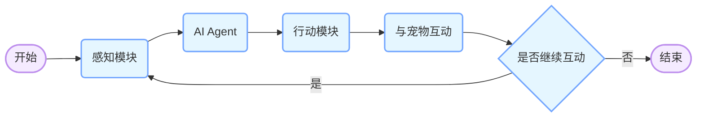

# 智能宠物玩具：AI Agent的宠物智力开发

> 关键词：智能宠物玩具、AI Agent、宠物智力开发、人工智能、宠物互动

> 摘要：本文围绕智能宠物玩具中AI Agent在宠物智力开发方面展开深入探讨。首先介绍了相关背景知识，包括目的范围、预期读者等内容。接着详细阐述了核心概念与联系，分析了AI Agent应用于宠物玩具的原理和架构。通过Python代码展示了核心算法原理和具体操作步骤，并给出了相应的数学模型和公式进行理论支撑。在项目实战部分，给出了开发环境搭建、源代码实现及解读。同时探讨了智能宠物玩具的实际应用场景，推荐了学习、开发工具和相关论文著作。最后总结了未来发展趋势与挑战，还提供了常见问题解答和扩展阅读参考资料，旨在全面解析智能宠物玩具借助AI Agent实现宠物智力开发的技术与应用。

## 1. 背景介绍 
### 1.1 目的和范围
随着人们生活水平的提高，宠物在家庭中的地位日益重要，人们对宠物的健康和智力发展也越发关注。智能宠物玩具作为融合了人工智能技术的创新产品，能够为宠物提供更丰富、更具挑战性的互动体验，从而促进宠物的智力开发。本文的目的在于深入探讨智能宠物玩具中AI Agent的应用原理、实现方法以及对宠物智力开发的作用。范围涵盖了智能宠物玩具的核心概念、算法原理、数学模型、项目实战、实际应用场景等方面，旨在为相关技术开发者、宠物爱好者和研究者提供全面的参考。

### 1.2 预期读者
本文预期读者主要包括以下几类人群：
- 人工智能和计算机科学领域的开发者和研究者，他们对将AI技术应用于宠物玩具感兴趣，希望了解相关的算法和实现方法。
- 宠物玩具制造商和设计师，期望通过引入AI Agent技术来提升产品的竞争力和创新性。
- 宠物爱好者和养宠人士，想要了解智能宠物玩具如何帮助宠物开发智力，提高宠物的生活质量。
- 动物行为学家和兽医，对宠物的智力发展和行为研究有深入的兴趣，希望从技术角度探索新的研究方向。

### 1.3 文档结构概述
本文将按照以下结构进行详细阐述：
- 核心概念与联系：介绍智能宠物玩具和AI Agent的核心概念，以及它们之间的联系和架构。
- 核心算法原理 & 具体操作步骤：使用Python代码详细讲解AI Agent在智能宠物玩具中的核心算法原理和操作步骤。
- 数学模型和公式 & 详细讲解 & 举例说明：给出相关的数学模型和公式，并进行详细解释和举例。
- 项目实战：代码实际案例和详细解释说明，包括开发环境搭建、源代码实现和代码解读。
- 实际应用场景：探讨智能宠物玩具在不同场景下的应用。
- 工具和资源推荐：推荐学习、开发工具和相关论文著作。
- 总结：未来发展趋势与挑战：总结智能宠物玩具的发展趋势和面临的挑战。
- 附录：常见问题与解答：解答读者可能遇到的常见问题。
- 扩展阅读 & 参考资料：提供相关的扩展阅读和参考资料。

### 1.4 术语表
#### 1.4.1 核心术语定义
- **智能宠物玩具**：融合了人工智能、传感器、执行器等技术的宠物玩具，能够根据宠物的行为和环境变化做出相应的反应，为宠物提供互动体验。
- **AI Agent（人工智能代理）**：是一个能够感知环境、进行决策并采取行动的软件实体。在智能宠物玩具中，AI Agent可以根据宠物的行为数据进行分析和决策，控制玩具的动作和功能。
- **宠物智力开发**：通过提供适当的刺激和挑战，促进宠物的认知、学习、记忆和解决问题等能力的发展。

#### 1.4.2 相关概念解释
- **机器学习**：是AI Agent实现智能决策的重要技术之一，通过对大量数据的学习和分析，让AI Agent能够自动发现数据中的规律和模式，从而做出更准确的决策。
- **传感器技术**：用于感知宠物的行为和环境信息，如宠物的位置、动作、声音等，为AI Agent提供决策依据。
- **执行器**：根据AI Agent的决策，控制智能宠物玩具的动作和功能，如移动、发光、发声等。

#### 1.4.3 缩略词列表
- **AI**：Artificial Intelligence，人工智能
- **ML**：Machine Learning，机器学习
- **RGB**：Red Green Blue，红绿蓝，用于表示颜色

## 2. 核心概念与联系 

### 核心概念原理
智能宠物玩具借助AI Agent实现宠物智力开发的核心原理在于构建一个能够感知、决策和行动的智能系统。这个系统主要由以下几个部分组成：

#### 感知模块
感知模块通过各种传感器收集宠物的行为信息和环境信息。常见的传感器包括红外传感器、摄像头、麦克风等。红外传感器可以检测宠物的位置和运动轨迹，摄像头可以捕捉宠物的图像和视频，麦克风可以收集宠物的声音。这些传感器将收集到的信息传输给AI Agent，作为决策的依据。

#### 决策模块
AI Agent作为决策核心，利用机器学习算法对感知模块收集到的数据进行分析和处理。通过对大量数据的学习和训练，AI Agent可以建立宠物行为模型，预测宠物的行为和需求。例如，根据宠物的运动轨迹和声音，AI Agent可以判断宠物是处于兴奋状态还是无聊状态，从而做出相应的决策。

#### 行动模块
行动模块根据AI Agent的决策，控制智能宠物玩具的动作和功能。行动模块通常由执行器组成，如电机、灯光、扬声器等。执行器可以实现玩具的移动、发光、发声等功能，与宠物进行互动。

### 架构的文本示意图
智能宠物玩具的架构可以用以下文本示意图表示：

```plaintext
+----------------+
|  感知模块      |
|  (传感器)      |
+----------------+
       |
       v
+----------------+
|  AI Agent      |
|  (决策模块)    |
+----------------+
       |
       v
+----------------+
|  行动模块      |
|  (执行器)      |
+----------------+
```

### Mermaid流程图


这个流程图展示了智能宠物玩具的工作流程。首先，感知模块收集宠物的行为和环境信息，然后将信息传输给AI Agent进行决策。AI Agent根据决策结果控制行动模块，实现玩具与宠物的互动。互动过程中，系统会不断判断是否继续互动，如果是则继续收集信息进行决策，否则结束互动。

## 3. 核心算法原理 & 具体操作步骤 

### 核心算法原理
在智能宠物玩具中，AI Agent常用的核心算法之一是强化学习算法。强化学习是一种通过智能体与环境进行交互，不断尝试不同的动作，并根据环境反馈的奖励信号来学习最优策略的机器学习方法。

具体来说，在智能宠物玩具的场景中，AI Agent可以看作是智能体，宠物和环境组成了环境系统。AI Agent通过感知模块获取环境状态（如宠物的位置、动作等），然后根据当前状态选择一个动作（如玩具移动到某个位置、发出某种声音等）。环境会根据AI Agent的动作给出一个奖励信号，这个奖励信号表示该动作的好坏程度。AI Agent的目标是通过不断尝试不同的动作，最大化长期累积奖励，从而学习到最优的决策策略。

### Python源代码详细阐述
以下是一个简单的强化学习示例代码，使用OpenAI Gym库模拟一个简单的智能宠物玩具环境：

```python
import gym
import numpy as np

# 创建一个简单的环境
env = gym.make('FrozenLake-v0')

# 初始化Q表
Q = np.zeros([env.observation_space.n, env.action_space.n])

# 定义超参数
learning_rate = 0.8
gamma = 0.95
num_episodes = 2000

# 强化学习训练过程
for episode in range(num_episodes):
    state = env.reset()
    done = False
    while not done:
        # 根据Q表选择动作
        if np.random.uniform(0, 1) < 0.1:
            action = env.action_space.sample()  # 探索
        else:
            action = np.argmax(Q[state, :])  # 利用

        # 执行动作，获取新状态和奖励
        next_state, reward, done, _ = env.step(action)

        # 更新Q表
        Q[state, action] = (1 - learning_rate) * Q[state, action] + \
                           learning_rate * (reward + gamma * np.max(Q[next_state, :]))

        state = next_state

# 测试训练好的策略
state = env.reset()
done = False
total_reward = 0
while not done:
    action = np.argmax(Q[state, :])
    state, reward, done, _ = env.step(action)
    total_reward += reward
    env.render()

print(f"Total reward: {total_reward}")
```

### 具体操作步骤
1. **环境初始化**：使用`gym.make()`函数创建一个简单的环境，这里使用的是`FrozenLake-v0`环境。
2. **Q表初始化**：创建一个全零的Q表，用于存储每个状态-动作对的价值。
3. **超参数设置**：设置学习率`learning_rate`、折扣因子`gamma`和训练的回合数`num_episodes`。
4. **训练过程**：在每个回合中，智能体根据当前状态选择动作，执行动作后获取新状态和奖励，并更新Q表。
5. **测试过程**：使用训练好的Q表，让智能体在环境中执行动作，计算总奖励并输出。

这个示例代码展示了强化学习算法在智能宠物玩具中的基本应用原理，通过不断的训练和学习，智能体可以学习到最优的决策策略，从而更好地与宠物进行互动。

## 4. 数学模型和公式 & 详细讲解 & 举例说明 

### 数学模型
在强化学习中，常用的数学模型是马尔可夫决策过程（Markov Decision Process，MDP）。一个MDP可以用一个五元组 $(S, A, P, R, \gamma)$ 来表示，其中：
- $S$ 是状态空间，表示环境的所有可能状态。
- $A$ 是动作空间，表示智能体可以采取的所有动作。
- $P$ 是状态转移概率函数，表示在状态 $s \in S$ 下采取动作 $a \in A$ 后转移到状态 $s' \in S$ 的概率，即 $P(s'|s, a)$。
- $R$ 是奖励函数，表示在状态 $s \in S$ 下采取动作 $a \in A$ 后转移到状态 $s' \in S$ 所获得的奖励，即 $R(s, a, s')$。
- $\gamma$ 是折扣因子，用于权衡当前奖励和未来奖励的重要性，取值范围为 $[0, 1]$。

### 核心公式
#### Q值更新公式
在Q学习算法中，Q值（状态-动作价值）的更新公式为：

$$
Q(s, a) \leftarrow (1 - \alpha)Q(s, a) + \alpha\left[R(s, a, s') + \gamma \max_{a'} Q(s', a')\right]
$$

其中：
- $Q(s, a)$ 表示在状态 $s$ 下采取动作 $a$ 的Q值。
- $\alpha$ 是学习率，控制Q值更新的步长。
- $R(s, a, s')$ 是在状态 $s$ 下采取动作 $a$ 转移到状态 $s'$ 所获得的奖励。
- $\gamma$ 是折扣因子。
- $\max_{a'} Q(s', a')$ 表示在新状态 $s'$ 下所有可能动作的最大Q值。

#### 策略选择公式
在训练过程中，智能体通常采用 $\epsilon$-贪心策略来选择动作：

$$
\pi(s) = 
\begin{cases}
\arg\max_{a} Q(s, a) & \text{with probability } 1 - \epsilon \\
\text{random action} & \text{with probability } \epsilon
\end{cases}
$$

其中：
- $\pi(s)$ 表示在状态 $s$ 下的动作选择策略。
- $\epsilon$ 是探索率，控制智能体进行探索和利用的比例。

### 详细讲解
#### Q值更新公式
Q值更新公式的核心思想是通过不断地尝试不同的动作，根据环境反馈的奖励信号来更新Q值，使得Q值能够逐渐逼近最优值。具体来说，公式右边的第一项 $(1 - \alpha)Q(s, a)$ 表示保留之前的Q值信息，第二项 $\alpha\left[R(s, a, s') + \gamma \max_{a'} Q(s', a')\right]$ 表示根据当前的奖励和未来的最大Q值来更新Q值。学习率 $\alpha$ 控制了更新的步长，折扣因子 $\gamma$ 用于权衡当前奖励和未来奖励的重要性。

#### 策略选择公式
$\epsilon$-贪心策略是一种平衡探索和利用的策略。在训练初期，智能体需要更多地进行探索，尝试不同的动作，以发现更优的策略。因此，在一定概率 $\epsilon$ 下，智能体随机选择一个动作。随着训练的进行，智能体逐渐积累了更多的经验，此时可以更多地利用已经学习到的Q值，选择Q值最大的动作。

### 举例说明
假设智能宠物玩具处于一个简单的二维环境中，状态空间 $S$ 表示玩具的位置，动作空间 $A$ 表示玩具可以移动的方向（上、下、左、右）。当玩具处于状态 $s$ 时，智能体选择动作 $a$ 向右移动，移动到新状态 $s'$ 后，环境给予奖励 $R(s, a, s') = 1$。假设当前的Q值 $Q(s, a) = 0$，学习率 $\alpha = 0.8$，折扣因子 $\gamma = 0.95$，在新状态 $s'$ 下所有可能动作的最大Q值 $\max_{a'} Q(s', a') = 2$。根据Q值更新公式：

$$
\begin{align*}
Q(s, a) &\leftarrow (1 - 0.8) \times 0 + 0.8 \times (1 + 0.95 \times 2) \\
&= 0.8 \times (1 + 1.9) \\
&= 0.8 \times 2.9 \\
&= 2.32
\end{align*}
$$

更新后的Q值 $Q(s, a) = 2.32$，表示在状态 $s$ 下采取动作 $a$ 的价值得到了提升。

## 5. 项目实战：代码实际案例和详细解释说明 

### 5.1  开发环境搭建
#### 硬件环境
- **开发板**：可以选择树莓派（Raspberry Pi）作为开发板，它具有较低的成本和丰富的接口，适合用于智能宠物玩具的开发。
- **传感器**：根据需求选择合适的传感器，如红外传感器、摄像头、麦克风等。
- **执行器**：电机、灯光、扬声器等执行器，用于控制玩具的动作和功能。

#### 软件环境
- **操作系统**：在树莓派上安装Raspbian操作系统。
- **开发语言**：使用Python作为开发语言，它具有简单易学、丰富的库支持等优点。
- **开发工具**：可以使用Thonny、PyCharm等集成开发环境（IDE）进行代码开发。

### 5.2  源代码详细实现和代码解读
以下是一个简单的智能宠物玩具项目的源代码示例，该项目使用树莓派和红外传感器，实现玩具根据宠物的接近情况做出相应的反应：

```python
import RPi.GPIO as GPIO
import time

# 定义红外传感器引脚
IR_PIN = 17

# 初始化GPIO
GPIO.setmode(GPIO.BCM)
GPIO.setup(IR_PIN, GPIO.IN)

# 定义执行器函数，这里简单模拟玩具发光
def toy_action():
    print("Toy is shining!")

try:
    while True:
        # 读取红外传感器状态
        ir_state = GPIO.input(IR_PIN)
        if ir_state == GPIO.HIGH:
            # 检测到宠物接近
            toy_action()
        time.sleep(0.1)
except KeyboardInterrupt:
    print("Program terminated by user.")
finally:
    # 清理GPIO资源
    GPIO.cleanup()
```

### 代码解读
1. **导入必要的库**：导入`RPi.GPIO`库用于控制树莓派的GPIO引脚，导入`time`库用于添加延时。
2. **定义红外传感器引脚**：将红外传感器连接到树莓派的GPIO 17引脚。
3. **初始化GPIO**：设置GPIO模式为BCM模式，并将红外传感器引脚设置为输入模式。
4. **定义执行器函数**：`toy_action()`函数用于模拟玩具的动作，这里简单地打印一条信息表示玩具发光。
5. **主循环**：在主循环中，不断读取红外传感器的状态。如果检测到宠物接近（红外传感器输出高电平），则调用`toy_action()`函数。
6. **异常处理**：使用`try-except-finally`语句捕获键盘中断异常，确保程序在用户终止时能够正确清理GPIO资源。

### 5.3  代码解读与分析
这个简单的代码示例展示了智能宠物玩具的基本工作原理。通过红外传感器感知宠物的接近情况，然后根据传感器的状态控制玩具的动作。在实际应用中，可以根据需求添加更多的传感器和执行器，实现更复杂的功能。例如，可以添加摄像头进行图像识别，判断宠物的行为和表情；添加电机控制玩具的移动，与宠物进行更互动的游戏。

## 6. 实际应用场景 
### 家庭陪伴场景
在家庭环境中，智能宠物玩具可以作为宠物的陪伴伙伴。当主人不在家时，玩具可以通过AI Agent与宠物进行互动，缓解宠物的孤独感。例如，玩具可以根据宠物的活动情况自动移动，吸引宠物的注意力；还可以发出各种声音和灯光效果，激发宠物的兴趣。

### 宠物训练场景
智能宠物玩具可以用于宠物的训练。通过设置不同的任务和挑战，玩具可以帮助宠物学习新的技能和行为。例如，玩具可以隐藏食物，让宠物通过寻找和解决问题来获取食物，从而提高宠物的认知和学习能力。

### 宠物健康监测场景
结合传感器技术，智能宠物玩具可以对宠物的健康状况进行监测。例如，通过监测宠物的运动轨迹和活动量，判断宠物的健康状态是否正常；还可以通过分析宠物的声音和行为，检测宠物是否存在异常情况。

### 宠物社交场景
智能宠物玩具可以促进宠物之间的社交互动。多个智能宠物玩具可以联网，让宠物在不同的地点也能进行互动和交流。例如，宠物可以通过玩具进行追逐游戏、合作完成任务等，增强宠物的社交能力。

## 7. 工具和资源推荐
### 7.1 学习资源推荐
#### 7.1.1 书籍推荐
- 《强化学习：原理与Python实现》：详细介绍了强化学习的基本原理和算法，并通过Python代码进行实现，适合初学者入门。
- 《人工智能：一种现代的方法》：全面介绍了人工智能的各个领域，包括机器学习、知识表示、自然语言处理等，是人工智能领域的经典教材。
- 《Python机器学习实战》：通过实际案例介绍了Python在机器学习中的应用，包括数据预处理、模型训练、评估等方面的内容。

#### 7.1.2 在线课程
- Coursera上的“强化学习专项课程”：由DeepMind的专家授课，系统地介绍了强化学习的理论和实践。
- edX上的“人工智能导论”：涵盖了人工智能的基本概念、算法和应用，适合初学者学习。
- 网易云课堂上的“Python数据分析与机器学习实战”：通过实际项目介绍了Python在数据分析和机器学习中的应用。

#### 7.1.3 技术博客和网站
- Medium：有许多人工智能和机器学习领域的博主分享最新的技术文章和研究成果。
- Towards Data Science：专注于数据科学和机器学习领域的技术博客，提供了大量的优质文章和教程。
- GitHub：可以在上面找到许多开源的人工智能和机器学习项目，学习他人的代码和经验。

### 7.2 开发工具框架推荐
#### 7.2.1 IDE和编辑器
- PyCharm：功能强大的Python集成开发环境，提供了代码编辑、调试、版本控制等功能。
- Visual Studio Code：轻量级的代码编辑器，支持多种编程语言和插件扩展，适合快速开发和调试。
- Thonny：简单易用的Python IDE，适合初学者使用。

#### 7.2.2 调试和性能分析工具
- pdb：Python自带的调试工具，可以帮助开发者定位代码中的问题。
- cProfile：Python的性能分析工具，可以分析代码的执行时间和内存使用情况。
- TensorBoard：用于可视化深度学习模型的训练过程和性能指标。

#### 7.2.3 相关框架和库
- OpenAI Gym：用于开发和比较强化学习算法的工具包，提供了丰富的环境和接口。
- TensorFlow：开源的深度学习框架，支持多种深度学习模型的开发和训练。
- PyTorch：另一个流行的深度学习框架，具有简洁的API和动态图机制。

### 7.3 相关论文著作推荐
#### 7.3.1 经典论文
- “Reinforcement Learning: An Introduction”：强化学习领域的经典教材，系统地介绍了强化学习的基本概念、算法和应用。
- “Playing Atari with Deep Reinforcement Learning”：首次将深度学习和强化学习相结合，在Atari游戏上取得了优异的成绩。
- “Human-level control through deep reinforcement learning”：提出了深度Q网络（DQN）算法，开启了深度强化学习的新篇章。

#### 7.3.2 最新研究成果
- 可以关注NeurIPS、ICML、AAAI等顶级人工智能会议的论文，了解最新的研究成果和技术趋势。
- 一些知名的学术期刊，如Journal of Artificial Intelligence Research（JAIR）、Artificial Intelligence等，也会发表人工智能领域的高质量研究论文。

#### 7.3.3 应用案例分析
- 可以参考一些智能宠物玩具相关的专利和商业案例，了解实际应用中的技术和设计思路。
- 一些科技媒体和行业报告也会介绍智能宠物玩具的市场情况和应用案例。

## 8. 总结：未来发展趋势与挑战
### 未来发展趋势
- **个性化定制**：未来的智能宠物玩具将更加注重个性化定制，根据宠物的品种、年龄、性格等因素，为宠物提供定制化的互动体验和智力开发方案。
- **多模态交互**：除了现有的传感器技术，智能宠物玩具将引入更多的交互方式，如手势识别、语音交互等，实现更加自然和丰富的人机交互。
- **健康监测与管理**：结合生物传感器和数据分析技术，智能宠物玩具将能够实时监测宠物的健康状况，提供健康建议和预警，为宠物的健康管理提供更全面的支持。
- **社交化与联网化**：智能宠物玩具将实现联网功能，让宠物之间可以进行社交互动，同时主人也可以通过手机APP远程控制和监控玩具，增强主人与宠物之间的联系。

### 挑战
- **数据隐私与安全**：智能宠物玩具收集了大量的宠物行为和健康数据，如何保护这些数据的隐私和安全是一个重要的挑战。需要采取有效的数据加密、访问控制等措施，防止数据泄露和滥用。
- **算法复杂度与计算资源**：随着智能宠物玩具功能的不断增加，AI Agent的算法复杂度也会相应提高，对计算资源的需求也会增大。如何在有限的硬件资源下实现高效的算法，是需要解决的问题。
- **用户体验与易用性**：智能宠物玩具的用户不仅包括宠物，还包括主人。如何设计出简单易用、功能丰富的产品，提高用户体验，是产品成功的关键。需要考虑用户的需求和使用习惯，进行人性化的设计。
- **伦理与道德问题**：随着人工智能技术在宠物玩具中的应用，可能会引发一些伦理和道德问题，如宠物的自主性、人机关系等。需要建立相应的伦理准则和法律法规，规范技术的应用和发展。

## 9. 附录：常见问题与解答
### 智能宠物玩具对所有宠物都适用吗？
智能宠物玩具通常适用于大多数常见的宠物，如猫、狗等。但不同品种和年龄的宠物对玩具的兴趣和反应可能会有所不同。例如，一些活泼好动的宠物可能对具有移动和互动功能的玩具更感兴趣，而一些老年宠物可能更适合较为安静的玩具。此外，某些特殊品种的宠物可能对某些类型的刺激有特殊的需求或反应，需要根据具体情况选择合适的玩具。

### 智能宠物玩具会对宠物造成伤害吗？
一般情况下，正规生产的智能宠物玩具经过了严格的质量检测和安全评估，不会对宠物造成伤害。但在使用过程中，仍然需要注意一些事项。例如，要确保玩具的材料无毒、无尖锐边角，避免宠物误食或受伤。同时，要按照说明书正确使用玩具，定期检查玩具的状态，如有损坏应及时更换。

### 如何选择适合自己宠物的智能宠物玩具？
选择适合宠物的智能宠物玩具可以考虑以下几个因素：
- **宠物的品种和年龄**：不同品种和年龄的宠物有不同的特点和需求，选择玩具时要根据这些因素进行考虑。
- **宠物的性格和兴趣**：观察宠物的日常行为和兴趣爱好，选择符合其性格特点的玩具。例如，喜欢追逐的宠物可以选择具有移动功能的玩具，喜欢咬嚼的宠物可以选择耐咬的玩具。
- **玩具的功能和质量**：根据自己的需求选择具有合适功能的玩具，同时要确保玩具的质量可靠，避免出现故障或安全问题。

### 智能宠物玩具的电池续航能力如何？
智能宠物玩具的电池续航能力因产品而异。一般来说，续航时间会受到玩具的功能、使用频率和电池容量等因素的影响。一些简单功能的玩具可能续航时间较长，而一些具有复杂功能的玩具可能需要更频繁地充电。在购买玩具时，可以查看产品说明书了解其电池续航能力，并根据自己的需求进行选择。

### 智能宠物玩具可以与手机APP连接吗？
许多智能宠物玩具支持与手机APP连接。通过手机APP，主人可以远程控制玩具的功能，了解宠物与玩具的互动情况，还可以获取宠物的健康数据等信息。在购买玩具时，可以查看产品说明，了解其是否支持手机APP连接以及支持的操作系统。

## 10. 扩展阅读 & 参考资料
### 扩展阅读
- 《宠物行为学》：深入了解宠物的行为特点和心理需求，有助于更好地设计和使用智能宠物玩具。
- 《物联网技术与应用》：了解物联网技术的原理和应用，对于理解智能宠物玩具的联网功能和数据传输有帮助。
- 《人工智能伦理》：探讨人工智能技术应用中的伦理和道德问题，思考智能宠物玩具发展过程中可能面临的挑战。

### 参考资料
- 各智能宠物玩具制造商的官方网站和产品说明书，提供了产品的详细信息和使用指南。
- 相关的学术论文和研究报告，如IEEE Xplore、ACM Digital Library等数据库中的论文，为技术研究和开发提供了理论支持。
- 科技媒体和行业论坛，如TechCrunch、Engadget等，报道了智能宠物玩具领域的最新动态和趋势。

作者：AI天才研究院/AI Genius Institute & 禅与计算机程序设计艺术 /Zen And The Art of Computer Programming